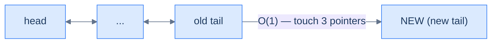
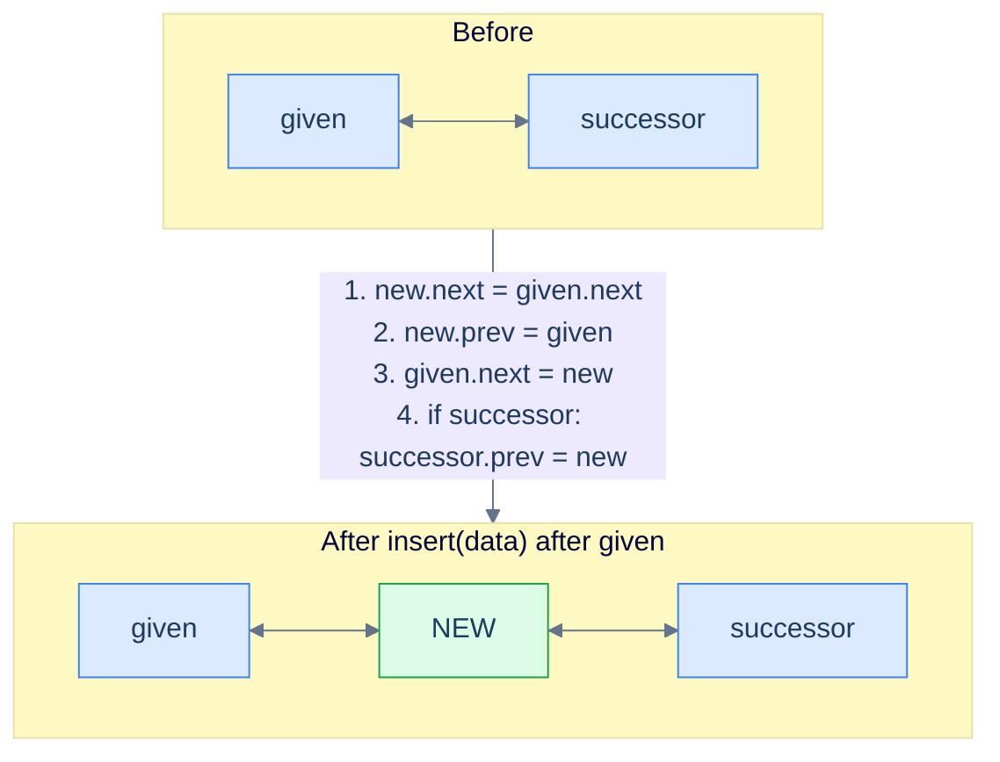
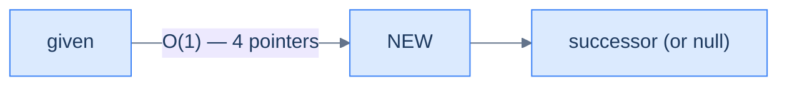
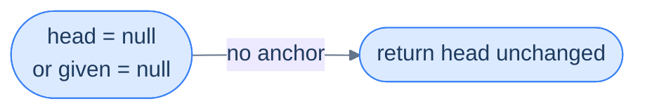
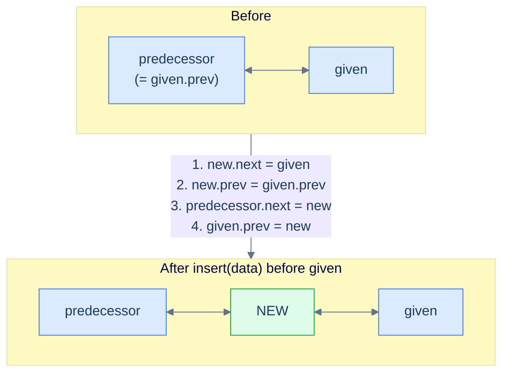
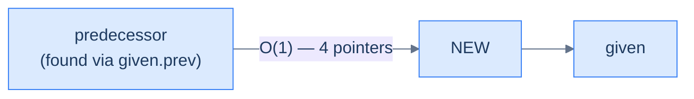
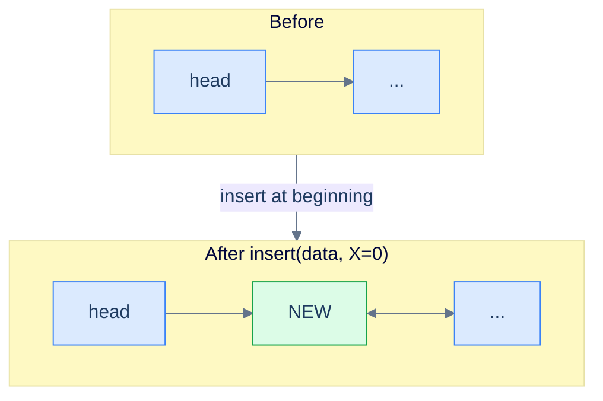
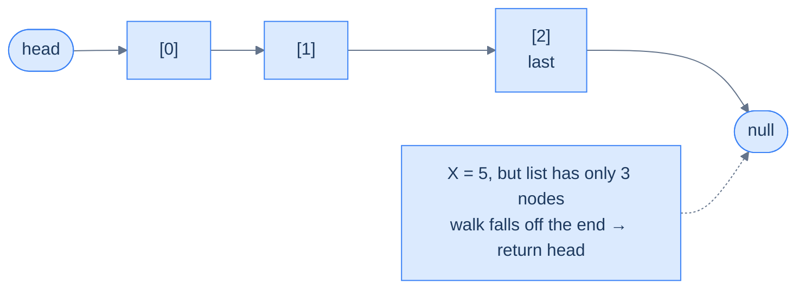

# 3. Insertion in Doubly Linked Lists

## The Hook

In a singly linked list, "insert before this node" was a small lie we told ourselves. We *said* "insert before X" but really we had to walk all the way from the head to find the node sitting one step before X — because the list refused to tell us who lived behind any given address. A thousand-node list, a thousand-step walk, just to wedge one node into place.

In a doubly linked list, that walk simply… doesn't happen. Every node already knows who's behind it. "Insert before X" becomes a four-pointer reshuffle done **on the spot**, in O(1). It's the kind of speedup you don't fully appreciate until you watch a million-element insertion that used to take seconds finish in microseconds.

But there's a catch — and it's the catch that catches everyone the first time. **A doubly linked list has twice as many pointers, so every insertion has twice as many ways to go wrong.** Forget one mirror update and your forward chain looks fine while the backward chain quietly snaps. By the end of this lesson, you'll have a checklist drilled into muscle memory: *what point at me?* and *what do I point at?* — answer both, every time, and the list stays correct.

---

## Table of contents

1. [Understanding the Problem](#understanding-the-problem)
2. [Supported Operations](#supported-operations)
3. [Internal Mechanics](#internal-mechanics)
4. [Understanding insertion at beginning](#understanding-insertion-at-beginning)
5. [Insert at beginning](#insert-at-beginning)
6. [Understanding insertion at end](#understanding-insertion-at-end)
7. [Insert at end](#insert-at-end)
8. [Understanding insertion after the given node](#understanding-insertion-after-the-given-node)
9. [Insert after the given node](#insert-after-the-given-node)
10. [Understanding insertion before a given node](#understanding-insertion-before-the-given-node)
11. [Insert before the given node](#insert-before-the-given-node)
12. [Understanding insertion at a given distance](#understanding-insertion-at-a-given-distance)
13. [Insert at given distance](#insert-at-given-distance)
14. [Working Example](#working-example)
15. [Edge Cases and Pitfalls](#edge-cases-and-pitfalls)
16. [Production Reality](#production-reality)
17. [Practice Ladder](#practice-ladder)
18. [Quiz](#quiz)
19. [Further Reading](#further-reading)
20. [Cross-Links](#cross-links)
21. [Final Takeaway](#final-takeaway)

***

# Understanding the Problem

Insertion in a doubly linked list is the operation that pays back the extra `prev` pointer the structure carries. A singly linked list charges `O(n)` time for any operation that needs the predecessor of a known node — *insert before*, *delete this node*, *splice around here* — because the only direction the list can travel is forward. A doubly linked list stores the backward link at every node, so the predecessor is always one dereference away.

The trap is in counting pointers:

- **Singly linked list** — each node holds one outbound pointer (`next`). Every insertion is two pointer writes, *if* the predecessor is in hand; otherwise the walk dominates.
- **Doubly linked list** — each node holds two outbound pointers (`prev` and `next`). Every insertion is *four* pointer writes, all of them required to keep both chains consistent.

To make this concrete: inserting `6` between `7` and `3` in `5 ⇄ 7 ⇄ 3` is a one-line splice on paper and a four-line splice in code — `new.next = 3`, `new.prev = 7`, `7.next = new`, `3.prev = new`. Skip the fourth line and the forward chain still walks `5 → 7 → 6 → 3`, but walking the list *backward* from `3` jumps over `6` straight to `7` because `3.prev` was never updated. The bug renders the list silently broken in one direction.

So the key idea is: a doubly linked list trades twice the per-node memory and twice the pointer bookkeeping for `O(1)` insertion at *every* known reference — head, tail, before-a-node, after-a-node. The walk only reappears when the input is an index, because indices can't be dereferenced.

---

# Supported Operations

A doubly linked list supports the same five insertion variants as a singly linked list — distinguished by *what reference you already hold*. The splice is now four pointer writes; the cost still varies with how far you have to walk to reach the splice point.

| Operation | Inputs | Time | Space | Notes |
|---|---|---|---|---|
| Insert at beginning | `head`, `data` | `O(1)` | `O(1)` | Three pointer writes (new node has no predecessor); independent of list length. |
| Insert at end | `tail`, `data` | `O(1)` with cached tail / `O(n)` without | `O(1)` | If the list caches a `tail` pointer the splice is `O(1)`; otherwise walk to the tail. |
| Insert after given node | `node`, `data` | `O(1)` | `O(1)` | Node reference is given; no walk needed. |
| Insert before given node | `head`, `node`, `data` | `O(1)` | `O(1)` | The `prev` pointer gives the predecessor for free — the singly-list walk vanishes. |
| Insert at distance `X` | `head`, `X`, `data` | `O(X)` time | `O(1)` | Walk `X − 1` steps, then splice. Out-of-range `X` returns the list unchanged. |

Two pieces are constant across the table: every variant allocates **one** node (`O(1)` extra space) and every variant ends in the same four-pointer splice. The variability is purely in the *walk*.

To make this concrete: insert-before in a singly linked list is `O(n)` time because the predecessor must be searched for; in a doubly linked list the predecessor is `node.prev`, so the same operation collapses to `O(1)`. Insert-at-distance still pays `O(X)` time because indices don't dereference — the back pointer doesn't help you "jump" to position 500.

So the tradeoff is: the doubly linked list buys constant-time predecessor access (and therefore constant-time *insert before*, *delete this node*) at the cost of one extra pointer per node and double the splice bookkeeping. Random access remains `O(n)` — the back pointer fixes the predecessor problem, not the indexing problem.

---

# Internal Mechanics

Every insertion in a doubly linked list — at the head, at the tail, after a node, before a node, or at a distance — compiles down to the same four pointer writes. Memorise these once and every variant in this lesson becomes a checklist exercise.

The four pointer writes (when both neighbours exist):

- **`new.next = successor`** — wire the new node forward.
- **`new.prev = predecessor`** — wire the new node backward.
- **`predecessor.next = new`** — redirect the predecessor's forward link.
- **`successor.prev = new`** — redirect the successor's backward link (the *mirror* update).

The order matters: **always wire the new node's `.next` and `.prev` first, then redirect the neighbours.** If you write `predecessor.next = new` before reading `predecessor.next` into `new.next`, the original successor is lost — you've overwritten the only forward reference to the rest of the list. The mirror rule is the same on the `prev` side.

To make this concrete: suppose we want to insert `6` between `7` and `3` in `5 ⇄ 7 ⇄ 3`. With `predecessor = node(7)` and `successor = node(3)`:

- `new.next = 7.next` — `new` now points forward at `3`.
- `new.prev = 7` — `new` now points backward at `7`.
- `7.next = new` — `7`'s forward pointer flips from `3` to `new`.
- `3.prev = new` — `3`'s backward pointer flips from `7` to `new`.

After the four writes, the chain reads `5 ⇄ 7 ⇄ new ⇄ 3` in both directions. Skip the last write and the forward chain is correct but `3.prev` still says `7` — backward traversal hops over `new` as if it didn't exist.

The same four-step pattern covers every variant — what changes is whether the predecessor or successor is `null`:

- **Insert at head**: predecessor is `null`, successor is the old head. Three writes (`new.next`, `new.prev = null`, `old_head.prev`); the missing fourth is the caller updating the head reference.
- **Insert at tail**: predecessor is the old tail, successor is `null`. Three writes; the missing fourth is `new.next = null`.
- **Insert after given**: both neighbours exist *unless* the given node is the tail (`given.next == null`), in which case the successor-mirror write is skipped.
- **Insert before given**: both neighbours exist *unless* the given node is the head (`given.prev == null`), in which case the new node becomes the new head.

So the core insight is: every insertion is "allocate, then four pointer writes, in the order new-node-first / neighbours-second" — what differs across variants is which of the four reduce to `null` writes and which (if any) the caller has to skip with a null guard.

> 🖼 Diagram — TODO: four-frame splice — allocate the new node, wire `new.next`, wire `new.prev`, redirect `predecessor.next`, redirect `successor.prev`; a fifth frame illustrating the silent corruption when `successor.prev` is forgotten.

---

# Understanding insertion at beginning

Inserting a node at the beginning of a doubly linked list is similar to inserting a node at the beginning of a singly linked list. The main difference is that a doubly linked list has **two** references stored in each node, and we need to keep track of both. **Every link is two pointers, not one** — break that habit and the list breaks with it. Let's examine the scenarios we need to take into account.

## 1. The list is empty

In this scenario, if the linked list is empty, the **head** will be `null`. We need to initialize the **head** node of the linked list and ensure that the `prev` and `next` pointers of this newly created **head** node are both `null`, because this single node is simultaneously the **head** and the **tail** of the list.


<p align="center"><strong>Insertion into an empty list — the new node becomes the entire list. Both <code>prev</code> and <code>next</code> are <code>null</code> because there are no neighbours on either side.</strong></p>

> **Algorithm**
>
> -   **Step 1:** Create a new node with the given data.
> -   **Step 2:** Set the new node's `next` pointer to `null` since it's the only node.
> -   **Step 3:** Set the new node's `prev` pointer to `null` since it's the only node.
> -   **Step 4:** Return the new node, as this node is also the head node.

## 2. The list is not empty

In this scenario, the linked list already contains some data, so the **head** is not `null` — it is the first node of the linked list. To insert a new node at the beginning of the list, create a new node, set its `next` to point at the old head, set its `prev` to `null` (it's the new head, so nothing precedes it), and **mirror** the link by setting the old head's `prev` to point back at the new node. This last step is the one beginners forget — and it silently corrupts every backward traversal afterward.


<p align="center"><strong>Insertion at the beginning of a non-empty list — three pointer updates plus the new node returned as the new head. The mirror update <code>head.prev = new</code> is what keeps backward traversal honest.</strong></p>

> **Algorithm**
>
> -   **Step 1:** Create a new node with the given data.
> -   **Step 2:** Set the `next` pointer of the new node to the current head, as the new node will be the new head.
> -   **Step 3:** Set the new node's `prev` pointer to `null` since it's the new head node.
> -   **Step 4:** Set the `prev` pointer of the current head to the new node to restore the bidirectional link.
> -   **Step 5:** Return the new node, as this is the new head.

## Implementation

When implementing the logic for the insert-at-beginning operation, we consider both possible cases (empty / non-empty) and write the code for each in conditional blocks.


```python run viz=linked-list viz-root=head
"""
Definition for doubly-linked list.
class ListNode:
    def __init__(self, val):
        self.val = val
        self.prev = None
        self.next = None
"""

from typing import Optional

class Solution:
    def insert_at_beginning(
        self, head: Optional[ListNode], data: int
    ) -> Optional[ListNode]:

        # Create a new node with the given data
        new_node: ListNode = ListNode(data)

        # Check if the list is empty
        if head is None:

            # Set the next pointer to None since it's the only node
            new_node.next = None
            new_node.prev = None

            # Return the new_node as this is the new head
            return new_node

        # Set the next pointer of the new node to the current head
        new_node.next = head

        # Set the prev pointer of the new node to None since it will be
        # the new head
        new_node.prev = None

        # Set the prev pointer of the current head to the new node
        head.prev = new_node

        # Return the new node as the new head of the list
        return new_node
```

```java run viz=linked-list viz-root=head
/**
 * Definition for doubly-linked list.
 * class ListNode {
 *     int val;
 *     ListNode prev;
 *     ListNode next;
 *     ListNode() {}
 *     ListNode(int val) { this.val = val; }
 * };
 */

class Solution {
    public ListNode insertAtBeginning(ListNode head, int data) {

        // Create a new node with the given data
        ListNode newNode = new ListNode(data);

        // Check if the list is empty
        if (head == null) {

            // Set the next pointer to null since it's the only node
            newNode.next = null;
            newNode.prev = null;

            // Return the newNode as this is the new head
            return newNode;
        }

        // Set the next pointer of the new node to the current head
        newNode.next = head;

        // Set the prev pointer of the new node to null since it will be
        // the new head
        newNode.prev = null;

        // Set the prev pointer of the current head to the new node
        head.prev = newNode;

        // Return the new node as the new head of the list
        return newNode;
    }
}
```


## Complexity Analysis

The time complexity of the above function does not depend on the list size — we always touch a fixed number of pointers, never traverse. The space complexity is also constant because we only allocate a single new node.


<p align="center"><strong>All cases — insert before the head node touches a constant number of pointers (new.next, new.prev, head.prev). No traversal, no allocation beyond the single new node.</strong></p>

> **Best Case**
>
> -   Space Complexity — **O(1)**
> -   Time Complexity — **O(1)**
>
> **Worst Case**
>
> -   Space Complexity — **O(1)**
> -   Time Complexity — **O(1)**

***

# Insert at beginning

## The Problem

> Given the **head** of a doubly linked list and a **data** value, write a function to insert a new node with the given data value at the beginning of the linked list and return the head of the updated list.

```
Input:  head = [5, 7, 3, 10], data = 6
Output: [6, 5, 7, 3, 10]
```

<details>
<summary><h2>The Solution</h2></summary>


```python run viz=linked-list viz-root=head
from typing import Optional


class ListNode:
    def __init__(self, val=0, prev=None, nxt=None):
        self.val = val
        self.prev = prev
        self.next = nxt


def from_list(values):
    if not values:
        return None
    head = ListNode(values[0])
    cur = head
    for v in values[1:]:
        node = ListNode(v, prev=cur)
        cur.next = node
        cur = node
    return head


def to_list(head):
    out = []
    while head is not None:
        out.append(head.val)
        head = head.next
    return out


class Solution:
    def insert_at_beginning(
        self, head: Optional[ListNode], data: int
    ) -> Optional[ListNode]:

        # Create a new node with the given data
        new_node: ListNode = ListNode(data)

        # Check if the list is empty
        if head is None:

            # Set the next pointer to None since it's the only node
            new_node.next = None
            new_node.prev = None

            # Return the new_node as this is the new head
            return new_node

        # Set the next pointer of the new node to the current head
        new_node.next = head

        # Set the prev pointer of the new node to None since it will be
        # the new head
        new_node.prev = None

        # Set the prev pointer of the current head to the new node
        head.prev = new_node

        # Return the new node as the new head of the list
        return new_node


# Examples from the problem statement
print(to_list(Solution().insert_at_beginning(from_list([5, 7, 3, 10]), 6)))  # [6, 5, 7, 3, 10]

# Edge cases
print(to_list(Solution().insert_at_beginning(None, 1)))                       # [1]
print(to_list(Solution().insert_at_beginning(from_list([42]), 99)))           # [99, 42]
print(to_list(Solution().insert_at_beginning(from_list([1, 2, 3]), 0)))       # [0, 1, 2, 3]
print(to_list(Solution().insert_at_beginning(from_list([5, 5, 5]), 5)))       # [5, 5, 5, 5]
print(to_list(Solution().insert_at_beginning(from_list([10, 20]), 5)))        # [5, 10, 20]
```

```java run viz=linked-list viz-root=head
import java.util.*;

public class Main {
    static class ListNode {
        int val;
        ListNode prev;
        ListNode next;
        ListNode() {}
        ListNode(int val) { this.val = val; }
    }

    static ListNode fromList(int... values) {
        if (values.length == 0) return null;
        ListNode head = new ListNode(values[0]);
        ListNode cur = head;
        for (int i = 1; i < values.length; i++) {
            ListNode node = new ListNode(values[i]);
            node.prev = cur;
            cur.next = node;
            cur = node;
        }
        return head;
    }

    static java.util.List<Integer> toList(ListNode head) {
        java.util.List<Integer> out = new java.util.ArrayList<>();
        while (head != null) { out.add(head.val); head = head.next; }
        return out;
    }

    static class Solution {
        public ListNode insertAtBeginning(ListNode head, int data) {

            // Create a new node with the given data
            ListNode newNode = new ListNode(data);

            // Check if the list is empty
            if (head == null) {

                // Set the next pointer to null since it's the only node
                newNode.next = null;
                newNode.prev = null;

                // Return the newNode as this is the new head
                return newNode;
            }

            // Set the next pointer of the new node to the current head
            newNode.next = head;

            // Set the prev pointer of the new node to null since it will be
            // the new head
            newNode.prev = null;

            // Set the prev pointer of the current head to the new node
            head.prev = newNode;

            // Return the new node as the new head of the list
            return newNode;
        }
    }

    public static void main(String[] args) {
        // Examples from the problem statement
        System.out.println(toList(new Solution().insertAtBeginning(fromList(5, 7, 3, 10), 6)));  // [6, 5, 7, 3, 10]

        // Edge cases
        System.out.println(toList(new Solution().insertAtBeginning(null, 1)));                    // [1]
        System.out.println(toList(new Solution().insertAtBeginning(fromList(42), 99)));            // [99, 42]
        System.out.println(toList(new Solution().insertAtBeginning(fromList(1, 2, 3), 0)));        // [0, 1, 2, 3]
        System.out.println(toList(new Solution().insertAtBeginning(fromList(5, 5, 5), 5)));        // [5, 5, 5, 5]
        System.out.println(toList(new Solution().insertAtBeginning(fromList(10, 20), 5)));         // [5, 10, 20]
    }
}
```


<details>
<summary><strong>Trace — head = [5, 7, 3, 10], data = 6</strong></summary>

```
Initial │ head → 5 ⇄ 7 ⇄ 3 ⇄ 10
Step 1  │ create new_node(6)
Step 2  │ head is not null         │ skip the empty-list branch
Step 3  │ new_node.next = head     │ new_node(6) → 5 ⇄ 7 ⇄ 3 ⇄ 10
Step 4  │ new_node.prev = null     │ new_node(6) is the new head — nothing precedes it
Step 5  │ head.prev = new_node     │ old head 5 now points back: new_node(6) ⇄ 5 ⇄ 7 ⇄ 3 ⇄ 10
Step 6  │ return new_node          │ new head is 6
Result: [6, 5, 7, 3, 10] ✓
```

The mirror update `head.prev = new_node` is the doubly-linked step the singly linked version never had — without it the backward chain from node 5 would still point at `null` and reverse traversal would lose the new head.

</details>

</details>

***

# Understanding insertion at end

When inserting at the end of a doubly linked list, we must access the linked list's tail node. Fortunately, in a doubly linked list, we routinely keep a direct reference to the tail (much like the head). This makes insertion at the end almost a perfect mirror of insertion at the beginning — just flip every `head` to `tail` and every `next` to `prev`.

## 1. The list is empty

If the linked list is empty, the **tail** will be `null`. We initialize the new node and set both its pointers to `null`, since the new node is simultaneously the head and the tail of a one-element list.


<p align="center"><strong>The list is empty — the new node becomes both the head and the tail. Same single-node case as insert-at-beginning, just entered through a different door.</strong></p>

> **Algorithm**
>
> -   **Step 1:** Create a new node with the given data.
> -   **Step 2:** Set this new node's `next` pointer to `null` since it's the only node.
> -   **Step 3:** Set this new node's `prev` pointer to `null` since it's the only node.
> -   **Step 4:** Return the new node, as this node is also the tail node.

## 2. The list is not empty

The linked list already contains some data, so the **tail** is the last node. We create the new node, link `tail.next = new` so the existing tail now points forward at us, link `new.prev = tail` to mirror that connection, and set `new.next = null` because the new node is now the end of the list.


<p align="center"><strong>Insertion at the end of a non-empty list — three pointer updates and the new node becomes the new tail. Mirror image of insertion at the beginning.</strong></p>

> **Algorithm**
>
> -   **Step 1:** Create a new node with the given data.
> -   **Step 2:** Set the current tail's `next` pointer to hold the reference of the new node.
> -   **Step 3:** Set the new node's `prev` pointer to hold the reference of the current tail.
> -   **Step 4:** Set the new node's `next` pointer to `null`.
> -   **Step 5:** Return the new node, as this is the new tail.

## Implementation

We consider both cases and handle them in conditional blocks.


```python run viz=linked-list viz-root=head
"""
Definition for doubly-linked list.
class ListNode:
    def __init__(self, val):
        self.val = val
        self.prev = None
        self.next = None
"""

from typing import Optional

class Solution:
    def insert_at_end(
        self, tail: Optional[ListNode], data: int
    ) -> Optional[ListNode]:

        # Create a new node with the given data
        new_node: ListNode = ListNode(data)

        # Check if the list is empty
        if tail is None:

            # Set the next and prev pointer of the new node to None
            new_node.next = None
            new_node.prev = None

            # Return the new_node as this is the new tail
            return new_node

        # Set the next pointer of the tail to the new node
        tail.next = new_node

        # Set the previous pointer of the new node to the current tail
        new_node.prev = tail

        # Set the next pointer of the new node to None since it will be
        # the new tail
        new_node.next = None

        # Return the new node as the new tail of the list
        return new_node
```

```java run viz=linked-list viz-root=head
/**
 * Definition for doubly-linked list.
 * class ListNode {
 *     int val;
 *     ListNode prev;
 *     ListNode next;
 *     ListNode() {}
 *     ListNode(int val) { this.val = val; }
 * };
 */

class Solution {
    public ListNode insertAtEnd(ListNode tail, int data) {

        // Create a new node with the given data
        ListNode newNode = new ListNode(data);

        // Check if the list is empty
        if (tail == null) {

            // Set the next and prev pointer of the new node to null
            newNode.next = null;
            newNode.prev = null;

            // Return the newNode as this is the new tail
            return newNode;
        }

        // Set the next pointer of the tail to the new node
        tail.next = newNode;

        // Set the previous pointer of the new node to the current tail
        newNode.prev = tail;

        // Set the next pointer of the new node to null since it will be
        // the new tail
        newNode.next = null;

        // Return the new node as the new tail of the list
        return newNode;
    }
}
```


## Complexity Analysis



<p align="center"><strong>All cases — insert after the tail node touches a constant number of pointers. Same constant-time guarantee as insert-at-beginning, achieved through the dedicated <code>tail</code> reference.</strong></p>

> **Best Case**
>
> -   Space Complexity — **O(1)**
> -   Time Complexity — **O(1)**
>
> **Worst Case**
>
> -   Space Complexity — **O(1)**
> -   Time Complexity — **O(1)**

***

# Insert at end

## The Problem

> Given the **tail** of a doubly linked list and a **data** value, write a function to insert a new node with the given data value at the end of the linked list and return the tail of the updated list.

```
Input:  head = [5, 7, 3, 10], data = 6
Output: [5, 7, 3, 10, 6]
```

<details>
<summary><h2>The Solution</h2></summary>


```python run viz=linked-list viz-root=head
from typing import Optional


class ListNode:
    def __init__(self, val=0, prev=None, nxt=None):
        self.val = val
        self.prev = prev
        self.next = nxt


def from_list(values):
    if not values:
        return None
    head = ListNode(values[0])
    cur = head
    for v in values[1:]:
        node = ListNode(v, prev=cur)
        cur.next = node
        cur = node
    return head


def to_list(head):
    out = []
    while head is not None:
        out.append(head.val)
        head = head.next
    return out


def to_tail(head):
    if head is None:
        return None
    cur = head
    while cur.next is not None:
        cur = cur.next
    return cur


def head_of(tail):
    """Walk backwards to recover head from the tail node."""
    if tail is None:
        return None
    cur = tail
    while cur.prev is not None:
        cur = cur.prev
    return cur


class Solution:
    def insert_at_end(
        self, tail: Optional[ListNode], data: int
    ) -> Optional[ListNode]:

        # Create a new node with the given data
        new_node: ListNode = ListNode(data)

        # Check if the list is empty
        if tail is None:

            # Set the next and prev pointer of the new node to None
            new_node.next = None
            new_node.prev = None

            # Return the newNode as this is the new tail
            return new_node

        # Set the next pointer of the tail to the new node
        tail.next = new_node

        # Set the previous pointer of the new node to the current tail
        new_node.prev = tail

        # Set the next pointer of the new node to None since it will be
        # the new tail
        new_node.next = None

        # Return the new node as the new tail of the list
        return new_node


# Examples from the problem statement — rebuild full list via head
t1 = Solution().insert_at_end(to_tail(from_list([5, 7, 3, 10])), 6)
print(to_list(head_of(t1)))    # [5, 7, 3, 10, 6]

# Edge cases
t2 = Solution().insert_at_end(None, 1)
print(to_list(head_of(t2)))    # [1]

t3 = Solution().insert_at_end(to_tail(from_list([42])), 99)
print(to_list(head_of(t3)))    # [42, 99]

t4 = Solution().insert_at_end(to_tail(from_list([1, 2, 3])), 4)
print(to_list(head_of(t4)))    # [1, 2, 3, 4]

t5 = Solution().insert_at_end(to_tail(from_list([5, 5])), 5)
print(to_list(head_of(t5)))    # [5, 5, 5]

t6 = Solution().insert_at_end(to_tail(from_list([10])), 20)
print(to_list(head_of(t6)))    # [10, 20]
```

```java run viz=linked-list viz-root=head
import java.util.*;

public class Main {
    static class ListNode {
        int val;
        ListNode prev;
        ListNode next;
        ListNode() {}
        ListNode(int val) { this.val = val; }
    }

    static ListNode fromList(int... values) {
        if (values.length == 0) return null;
        ListNode head = new ListNode(values[0]);
        ListNode cur = head;
        for (int i = 1; i < values.length; i++) {
            ListNode node = new ListNode(values[i]);
            node.prev = cur;
            cur.next = node;
            cur = node;
        }
        return head;
    }

    static ListNode toTail(ListNode head) {
        if (head == null) return null;
        ListNode cur = head;
        while (cur.next != null) cur = cur.next;
        return cur;
    }

    static ListNode headOf(ListNode tail) {
        if (tail == null) return null;
        ListNode cur = tail;
        while (cur.prev != null) cur = cur.prev;
        return cur;
    }

    static java.util.List<Integer> toList(ListNode head) {
        java.util.List<Integer> out = new java.util.ArrayList<>();
        while (head != null) { out.add(head.val); head = head.next; }
        return out;
    }

    static class Solution {
        public ListNode insertAtEnd(ListNode tail, int data) {

            // Create a new node with the given data
            ListNode newNode = new ListNode(data);

            // Check if the list is empty
            if (tail == null) {

                // Set the next and prev pointer of the new node to null
                newNode.next = null;
                newNode.prev = null;

                // Return the newNode as this is the new tail
                return newNode;
            }

            // Set the next pointer of the tail to the new node
            tail.next = newNode;

            // Set the previous pointer of the new node to the current tail
            newNode.prev = tail;

            // Set the next pointer of the new node to null since it will be
            // the new tail
            newNode.next = null;

            // Return the new node as the new tail of the list
            return newNode;
        }
    }

    public static void main(String[] args) {
        // Examples from the problem statement
        ListNode t1 = new Solution().insertAtEnd(toTail(fromList(5, 7, 3, 10)), 6);
        System.out.println(toList(headOf(t1)));    // [5, 7, 3, 10, 6]

        // Edge cases
        ListNode t2 = new Solution().insertAtEnd(null, 1);
        System.out.println(toList(headOf(t2)));    // [1]

        ListNode t3 = new Solution().insertAtEnd(toTail(fromList(42)), 99);
        System.out.println(toList(headOf(t3)));    // [42, 99]

        ListNode t4 = new Solution().insertAtEnd(toTail(fromList(1, 2, 3)), 4);
        System.out.println(toList(headOf(t4)));    // [1, 2, 3, 4]

        ListNode t5 = new Solution().insertAtEnd(toTail(fromList(5, 5)), 5);
        System.out.println(toList(headOf(t5)));    // [5, 5, 5]

        ListNode t6 = new Solution().insertAtEnd(toTail(fromList(10)), 20);
        System.out.println(toList(headOf(t6)));    // [10, 20]
    }
}
```

</details>


***

# Understanding insertion after the given node

Inserting a node after a given node is a simple operation. It is similar to inserting after a given node in a singly linked list, with one extra step — we must update the `prev` pointer of the node that comes after the given one (if it exists), so the new node is wired in **both** directions. Let's examine the two cases we need to consider.

## 1. The given node is null

If the given node is `null`, there's no insertion point — we simply return without making any changes. (This is the equivalent of an "empty list" guard for an operation that takes a node reference.)


<p align="center"><strong>The list is empty / given node is null — no anchor exists, so we return early without modification.</strong></p>

> **Algorithm**
>
> -   **Step 1:** Return from the function.

## 2. The list is not empty

The new node will be inserted between two existing nodes (the given node and its current successor). We must wire **all four** of the affected pointers, with one twist: if the given node is the *tail*, there is no successor — so the "fix the successor's `prev`" step has to be guarded by a null check.



<p align="center"><strong>Insert after the given node — splice the new node between <code>given</code> and <code>given.next</code>. Four pointers updated; the fourth is conditional because the given node may be the tail.</strong></p>

> **Algorithm**
>
> -   **Step 1:** Create a new node with the given data.
> -   **Step 2:** Set the new node's `next` pointer to hold the node's reference stored in the `next` pointer of the `given` node.
> -   **Step 3:** Set the new node's `prev` pointer to hold the reference of the `given` node.
> -   **Step 4:** Set the `given` node's `next` pointer to hold the reference of the new node.
> -   **Step 5:** Set the `prev` pointer of the node after the `given` node (if it exists) to hold the reference of the new node.

## Implementation

We will be given the node, **after** which we will perform the insertion.


```python run viz=linked-list viz-root=head
"""
Definition for doubly-linked list.
class ListNode:
    def __init__(self, val):
        self.val = val
        self.prev = None
        self.next = None
"""

from typing import Optional

class Solution:
    def insert_after_the_given_node(
        self, node: Optional[ListNode], data: int
    ) -> None:

        # Check if the given node is valid (not None)
        if node is None:

            # If the node is None, we cannot insert after it, so return.
            return

        # Create a new node with the given data
        new_node: ListNode = ListNode(data)

        # Link the new node to the next node in the list
        new_node.next = node.next

        # Link the new node to the current node as its previous node
        new_node.prev = node

        # Link the current node to the new node, effectively inserting
        # the new node after it
        node.next = new_node

        # If the new node has a valid next node, update its previous node
        # to point back to the new node
        if new_node.next is not None:
            new_node.next.prev = new_node
```

```java run viz=linked-list viz-root=head
/**
 * Definition for doubly-linked list.
 * class ListNode {
 *     int val;
 *     ListNode prev;
 *     ListNode next;
 *     ListNode() {}
 *     ListNode(int val) { this.val = val; }
 * };
 */

class Solution {
    public void insertAfterTheGivenNode(ListNode node, int data) {

        // Check if the given node is valid (not null)
        if (node == null) {

            // If the node is null, we cannot insert after it, so return.
            return;
        }

        // Create a new node with the given data
        ListNode newNode = new ListNode(data);

        // Link the new node to the next node in the list
        newNode.next = node.next;

        // Link the new node to the current node as its previous node
        newNode.prev = node;

        // Link the current node to the new node, effectively inserting
        // the new node after it
        node.next = newNode;

        // If the new node has a valid next node, update its previous
        // node to point back to the new node
        if (newNode.next != null) {
            newNode.next.prev = newNode;
        }
    }
}
```


> *Why is the order of those four assignments important? Try mentally swapping step 4 (<code>node.next = new</code>) with step 2 (<code>new.next = node.next</code>) — what reads what before being overwritten?*
>
> If you do step 4 first, `node.next` becomes the new node, and step 2 then reads `node.next` and finds *the new node again*, creating a cycle. **Always copy the old pointers into the new node first, then overwrite the old ones.** This "save before clobber" pattern shows up in every linked-list mutation.

## Complexity Analysis

The time complexity is **O(1)** because we only touch a constant number of pointers — no traversal is required. Space is **O(1)** because we allocate exactly one node.



<p align="center"><strong>All cases — insert after the given node touches at most four pointers regardless of list size.</strong></p>

> **Best Case**
>
> -   Space Complexity — **O(1)**
> -   Time Complexity — **O(1)**
>
> **Worst Case**
>
> -   Space Complexity — **O(1)**
> -   Time Complexity — **O(1)**

***

# Insert after the given node

## The Problem

> Given a reference to a **random node** in a doubly linked list and a **data** value, write a function to insert a new node with the given data value after the given node.

```
Input:  head = [5, 7, 3, 10], node = 7, data = 6
Output: [5, 7, 6, 3, 10]
```

<details>
<summary><h2>The Solution</h2></summary>


```python run viz=linked-list viz-root=head
from typing import Optional


class ListNode:
    def __init__(self, val=0, prev=None, nxt=None):
        self.val = val
        self.prev = prev
        self.next = nxt


def from_list(values):
    if not values:
        return None
    head = ListNode(values[0])
    cur = head
    for v in values[1:]:
        node = ListNode(v, prev=cur)
        cur.next = node
        cur = node
    return head


def to_list(head):
    out = []
    while head is not None:
        out.append(head.val)
        head = head.next
    return out


def get_node(head, val):
    """Return first node with the given value."""
    cur = head
    while cur is not None:
        if cur.val == val:
            return cur
        cur = cur.next
    return None


class Solution:
    def insert_after_the_given_node(
        self, node: Optional[ListNode], data: int
    ) -> None:

        # Check if the given node is valid (not None)
        if node is None:

            # If the node is None, we cannot insert after it, so return.
            return

        # Create a new node with the given data
        new_node: ListNode = ListNode(data)

        # Link the new node to the next node in the list
        new_node.next = node.next

        # Link the new node to the current node as its previous node
        new_node.prev = node

        # Link the current node to the new node, effectively inserting
        # the new node after it
        node.next = new_node

        # If the new node has a valid next node, update its previous node
        # to point back to the new node
        if new_node.next is not None:
            new_node.next.prev = new_node


# Examples from the problem statement
h1 = from_list([5, 7, 3, 10])
Solution().insert_after_the_given_node(get_node(h1, 7), 6)
print(to_list(h1))    # [5, 7, 6, 3, 10]

# Edge cases — insert after head
h2 = from_list([1, 2, 3])
Solution().insert_after_the_given_node(get_node(h2, 1), 99)
print(to_list(h2))    # [1, 99, 2, 3]

# Insert after tail
h3 = from_list([1, 2, 3])
Solution().insert_after_the_given_node(get_node(h3, 3), 4)
print(to_list(h3))    # [1, 2, 3, 4]

# Single node list
h4 = from_list([5])
Solution().insert_after_the_given_node(get_node(h4, 5), 10)
print(to_list(h4))    # [5, 10]

# None node — no-op
h5 = from_list([1, 2])
Solution().insert_after_the_given_node(None, 9)
print(to_list(h5))    # [1, 2]

# Insert after middle
h6 = from_list([10, 20, 30, 40])
Solution().insert_after_the_given_node(get_node(h6, 20), 25)
print(to_list(h6))    # [10, 20, 25, 30, 40]
```

```java run viz=linked-list viz-root=head
import java.util.*;

public class Main {
    static class ListNode {
        int val;
        ListNode prev;
        ListNode next;
        ListNode() {}
        ListNode(int val) { this.val = val; }
    }

    static ListNode fromList(int... values) {
        if (values.length == 0) return null;
        ListNode head = new ListNode(values[0]);
        ListNode cur = head;
        for (int i = 1; i < values.length; i++) {
            ListNode node = new ListNode(values[i]);
            node.prev = cur;
            cur.next = node;
            cur = node;
        }
        return head;
    }

    static java.util.List<Integer> toList(ListNode head) {
        java.util.List<Integer> out = new java.util.ArrayList<>();
        while (head != null) { out.add(head.val); head = head.next; }
        return out;
    }

    static ListNode getNode(ListNode head, int val) {
        ListNode cur = head;
        while (cur != null) {
            if (cur.val == val) return cur;
            cur = cur.next;
        }
        return null;
    }

    static class Solution {
        public void insertAfterTheGivenNode(ListNode node, int data) {

            // Check if the given node is valid (not null)
            if (node == null) {

                // If the node is null, we cannot insert after it, so return.
                return;
            }

            // Create a new node with the given data
            ListNode newNode = new ListNode(data);

            // Link the new node to the next node in the list
            newNode.next = node.next;

            // Link the new node to the current node as its previous node
            newNode.prev = node;

            // Link the current node to the new node, effectively inserting
            // the new node after it
            node.next = newNode;

            // If the new node has a valid next node, update its previous
            // node to point back to the new node
            if (newNode.next != null) {
                newNode.next.prev = newNode;
            }
        }
    }

    public static void main(String[] args) {
        // Examples from the problem statement
        ListNode h1 = fromList(5, 7, 3, 10);
        new Solution().insertAfterTheGivenNode(getNode(h1, 7), 6);
        System.out.println(toList(h1));    // [5, 7, 6, 3, 10]

        // Edge cases — insert after head
        ListNode h2 = fromList(1, 2, 3);
        new Solution().insertAfterTheGivenNode(getNode(h2, 1), 99);
        System.out.println(toList(h2));    // [1, 99, 2, 3]

        // Insert after tail
        ListNode h3 = fromList(1, 2, 3);
        new Solution().insertAfterTheGivenNode(getNode(h3, 3), 4);
        System.out.println(toList(h3));    // [1, 2, 3, 4]

        // Single node list
        ListNode h4 = fromList(5);
        new Solution().insertAfterTheGivenNode(getNode(h4, 5), 10);
        System.out.println(toList(h4));    // [5, 10]

        // None node — no-op
        ListNode h5 = fromList(1, 2);
        new Solution().insertAfterTheGivenNode(null, 9);
        System.out.println(toList(h5));    // [1, 2]

        // Insert after middle
        ListNode h6 = fromList(10, 20, 30, 40);
        new Solution().insertAfterTheGivenNode(getNode(h6, 20), 25);
        System.out.println(toList(h6));    // [10, 20, 25, 30, 40]
    }
}
```


<details>
<summary><strong>Trace — head = [5, 7, 3, 10], given = node(7), data = 6</strong></summary>

```
Initial │ 5 ⇄ 7 ⇄ 3 ⇄ 10
Step 1  │ node = node(7) is not null            │ continue
Step 2  │ create new_node(6)
Step 3  │ new_node.next = node.next = node(3)    │ new_node(6) → 3
Step 4  │ new_node.prev = node = node(7)         │ 7 ← new_node(6)
Step 5  │ node.next = new_node                  │ 5 ⇄ 7 → new_node(6) → 3 ⇄ 10
Step 6  │ new_node.next is node(3) ≠ null →     │ node(3).prev = new_node(6)
        │ new_node.next.prev = new_node          │ 5 ⇄ 7 ⇄ new_node(6) ⇄ 3 ⇄ 10
Result: [5, 7, 6, 3, 10] ✓
```

Four pointers, not two — steps 4 and 6 are the `prev`-side mirror updates. Step 6 is guarded by a null check because the given node could be the tail, in which case there is no successor whose `prev` needs fixing.

</details>

</details>

***

# Understanding insertion before the given node

In linked lists, it is essential to access the node **before** the one being inserted or deleted. In a singly linked list, finding the node before the given one requires traversing from the head — that's the whole reason singly lists are bad at this operation. **In a doubly linked list, that walk vanishes.** The node before the given one is sitting right there at `given.prev`, one hop away. This is the operation where the doubly linked list earns its keep over a singly linked list. Let's examine the three cases we need to consider.

## 1. The list is empty (or given is null)

If the list is empty or the given node is null, there is no insertion point. In such a case, we return the **head** node that was provided as it is.



<p align="center"><strong>Empty list or null reference — no insertion point exists, return the original head untouched.</strong></p>

> **Algorithm**
>
> -   **Step 1:** Return the original head node.

## 2. The given node is the first node (the head)

This is exactly the **insert-at-beginning** case we already solved. We detect it by comparing the given node reference to the head — if they're the same, we delegate.


<p align="center"><strong>The given node is the first node — same as inserting at the beginning. The new node becomes the new head.</strong></p>

> **Algorithm**
>
> -   **Step 1:** Create a new node with the given data.
> -   **Step 2:** Set the `next` pointer of the new node to the current head, as the new node will be the new head.
> -   **Step 3:** Set the new node's `prev` pointer to `null` since it's the new head node.
> -   **Step 4:** Set the `prev` pointer of current head to the new node to restore the bidirectional link.
> -   **Step 5:** Return the new node, as this is the new head.

## 3. The given node is not the first node

In this scenario, we use a reference manipulation similar to **inserting after a given node**. However, this time we use the `prev` pointer to find the predecessor — and that's where the doubly linked list shines. The predecessor is `given.prev`, available in O(1).



<p align="center"><strong>Insert before a non-head given node — splice the new node between <code>given.prev</code> and <code>given</code>. Four pointers updated, all reachable in O(1).</strong></p>

> **Algorithm**
>
> -   **Step 1:** Create a new node with the given data.
> -   **Step 2:** Set the new node's `next` pointer to hold the reference of the `given` node.
> -   **Step 3:** Set the new node's `prev` pointer to hold the reference of the node before the `given` node.
> -   **Step 4:** Set the `next` pointer of the node before the given node to hold the reference of the new node.
> -   **Step 5:** Set the `given` node's `prev` pointer to hold the reference of the new node.
> -   **Step 6:** Return the original head node.

## Implementation


```python run viz=linked-list viz-root=head
"""
Definition for doubly-linked list.
class ListNode:
    def __init__(self, val):
        self.val = val
        self.prev = None
        self.next = None
"""

from typing import Optional

class Solution:
    def insert_before_the_given_node(
        self,
        head: Optional[ListNode],
        node: Optional[ListNode],
        data: int,
    ) -> Optional[ListNode]:

        # Check if the head or the node to insert before is None
        if head is None or node is None:
            return head

        # Create a new node with the provided data
        new_node = ListNode(data)

        # Check if the node to insert before is the head of the list.
        if node == head:

            # Set the next pointer of the new node to the current head
            new_node.next = head

            # Set the prev pointer of the new node to None since it will
            # be the new head
            new_node.prev = None

            # Set the prev pointer of the current head to the new node
            head.prev = new_node

            # Return the new_node as this is the new head
            return new_node

        # Update the pointers of the new node to connect it with the list.
        # The next node of the new node is the node given
        new_node.next = node

        # The previous node of the new node is the prev node of the given
        # node
        new_node.prev = node.prev

        # Update the next pointer of the previous node of the node to
        # point to the new node.
        if new_node.prev:
            new_node.prev.next = new_node

        # Update the prev pointer of the node to point back to the new
        # node
        node.prev = new_node

        # Return the updated head of the list
        return head
```

```java run viz=linked-list viz-root=head
/**
 * Definition for doubly-linked list.
 * class ListNode {
 *     int val;
 *     ListNode prev;
 *     ListNode next;
 *     ListNode() {}
 *     ListNode(int val) { this.val = val; }
 * };
 */

class Solution {
    public ListNode insertBeforeTheGivenNode(
        ListNode head,
        ListNode node,
        int data
    ) {

        // Check if the head or the node to insert before is null
        if (head == null || node == null) {
            return head;
        }

        // Create a new node with the provided data
        ListNode newNode = new ListNode(data);

        // Check if the node to insert before is the head of the list.
        if (node == head) {

            // Set the next pointer of the new node to the current head
            newNode.next = head;

            // Set the prev pointer of the new node to null since it will
            // be the new head
            newNode.prev = null;

            // Set the prev pointer of the current head to the new node
            head.prev = newNode;

            // Return the newNode as this is the new head
            return newNode;
        }

        // Update the pointers of the new node to connect it with the
        // list. The next node of the new node is the node given
        newNode.next = node;

        // The previous node of the new node is the prev node of the
        // given node
        newNode.prev = node.prev;

        // Update the next pointer of the previous node of the node to
        // point to the new node.
        if (newNode.prev != null) {
            newNode.prev.next = newNode;
        }

        // Update the prev pointer of the node to point back to the new
        // node
        node.prev = newNode;

        // Return the updated head of the list
        return head;
    }
}
```


## Complexity Analysis

The time complexity has improved dramatically compared to the singly linked list version of this operation. We no longer need to traverse the list to find the node one step before the given node — `given.prev` gives it to us for free. With a doubly linked list, the time complexity is **O(1)** for inserting anywhere in the list if we have a reference to the node before/after which we want to insert.



<p align="center"><strong>All cases — insert before the given node touches a constant number of pointers, with the predecessor located in O(1) via <code>given.prev</code>. This is the headline win of the doubly linked list.</strong></p>

This is the main advantage of the doubly linked list. Since we are only creating a single node, the extra space needed for this operation is constant — hence the space complexity is **O(1)**.

> **Best Case**
>
> -   Space Complexity — **O(1)**
> -   Time Complexity — **O(1)**
>
> **Worst Case**
>
> -   Space Complexity — **O(1)**
> -   Time Complexity — **O(1)**

***

# Insert before the given node

## The Problem

> Given the **head** of a doubly linked list, a reference to a **random node** in that linked list, and a **data** value, write a function to insert a new node with the given data before the given node and return the head of the updated list.

```
Input:  head = [5, 7, 3, 10], node = 7, data = 6
Output: [5, 6, 7, 3, 10]
```

<details>
<summary><h2>The Solution</h2></summary>


```python run viz=linked-list viz-root=head
from typing import Optional


class ListNode:
    def __init__(self, val=0, prev=None, nxt=None):
        self.val = val
        self.prev = prev
        self.next = nxt


def from_list(values):
    if not values:
        return None
    head = ListNode(values[0])
    cur = head
    for v in values[1:]:
        node = ListNode(v, prev=cur)
        cur.next = node
        cur = node
    return head


def to_list(head):
    out = []
    while head is not None:
        out.append(head.val)
        head = head.next
    return out


def get_node(head, val):
    cur = head
    while cur is not None:
        if cur.val == val:
            return cur
        cur = cur.next
    return None


class Solution:
    def insert_before_the_given_node(
        self,
        head: Optional[ListNode],
        node: Optional[ListNode],
        data: int,
    ) -> Optional[ListNode]:

        # Check if the head or the node to insert before is null
        if head is None or node is None:
            return head

        # Create a new node with the provided data
        new_node = ListNode(data)

        # Check if the node to insert before is the head of the list.
        if node == head:

            # Set the next pointer of the new node to the current head
            new_node.next = head

            # Set the prev pointer of the new node to None since it will
            # be the new head
            new_node.prev = None

            # Set the prev pointer of the current head to the new node
            head.prev = new_node

            # Return the newNode as this is the new head
            return new_node

        # Update the pointers of the new node to connect it with the
        # list. The next node of the new node is the node given
        new_node.next = node

        # The previous node of the new node is the prev node of the given
        # node
        new_node.prev = node.prev

        # Update the next pointer of the previous node of the node to
        # point to the new node.
        if new_node.prev:
            new_node.prev.next = new_node

        # Update the prev pointer of the node to point back to the new
        # node
        node.prev = new_node

        # Return the updated head of the list
        return head


# Examples from the problem statement
h1 = from_list([5, 7, 3, 10])
print(to_list(Solution().insert_before_the_given_node(h1, get_node(h1, 7), 6)))  # [5, 6, 7, 3, 10]

# Insert before head
h2 = from_list([5, 7, 3, 10])
print(to_list(Solution().insert_before_the_given_node(h2, get_node(h2, 5), 1)))  # [1, 5, 7, 3, 10]

# Insert before tail
h3 = from_list([1, 2, 3])
print(to_list(Solution().insert_before_the_given_node(h3, get_node(h3, 3), 99))) # [1, 2, 99, 3]

# Single node — inserts before the only node
h4 = from_list([5])
print(to_list(Solution().insert_before_the_given_node(h4, get_node(h4, 5), 0)))  # [0, 5]

# head is None — returns None
print(Solution().insert_before_the_given_node(None, None, 9))                     # None

# node is None — returns head unchanged
h5 = from_list([1, 2])
print(to_list(Solution().insert_before_the_given_node(h5, None, 9)))              # [1, 2]
```

```java run viz=linked-list viz-root=head
import java.util.*;

public class Main {
    static class ListNode {
        int val;
        ListNode prev;
        ListNode next;
        ListNode() {}
        ListNode(int val) { this.val = val; }
    }

    static ListNode fromList(int... values) {
        if (values.length == 0) return null;
        ListNode head = new ListNode(values[0]);
        ListNode cur = head;
        for (int i = 1; i < values.length; i++) {
            ListNode node = new ListNode(values[i]);
            node.prev = cur;
            cur.next = node;
            cur = node;
        }
        return head;
    }

    static java.util.List<Integer> toList(ListNode head) {
        java.util.List<Integer> out = new java.util.ArrayList<>();
        while (head != null) { out.add(head.val); head = head.next; }
        return out;
    }

    static ListNode getNode(ListNode head, int val) {
        ListNode cur = head;
        while (cur != null) {
            if (cur.val == val) return cur;
            cur = cur.next;
        }
        return null;
    }

    static class Solution {
        public ListNode insertBeforeTheGivenNode(
            ListNode head,
            ListNode node,
            int data
        ) {

            // Check if the head or the node to insert before is null
            if (head == null || node == null) {
                return head;
            }

            // Create a new node with the provided data
            ListNode newNode = new ListNode(data);

            // Check if the node to insert before is the head of the list.
            if (node == head) {

                // Set the next pointer of the new node to the current head
                newNode.next = head;

                // Set the prev pointer of the new node to null since it will
                // be the new head
                newNode.prev = null;

                // Set the prev pointer of the current head to the new node
                head.prev = newNode;

                // Return the newNode as this is the new head
                return newNode;
            }

            // Update the pointers of the new node to connect it with the
            // list. The next node of the new node is the node given
            newNode.next = node;

            // The previous node of the new node is the prev node of the
            // given node
            newNode.prev = node.prev;

            // Update the next pointer of the previous node of the node to
            // point to the new node.
            if (newNode.prev != null) {
                newNode.prev.next = newNode;
            }

            // Update the prev pointer of the node to point back to the new
            // node
            node.prev = newNode;

            // Return the updated head of the list
            return head;
        }
    }

    public static void main(String[] args) {
        // Examples from the problem statement
        ListNode h1 = fromList(5, 7, 3, 10);
        System.out.println(toList(new Solution().insertBeforeTheGivenNode(h1, getNode(h1, 7), 6)));  // [5, 6, 7, 3, 10]

        // Insert before head
        ListNode h2 = fromList(5, 7, 3, 10);
        System.out.println(toList(new Solution().insertBeforeTheGivenNode(h2, getNode(h2, 5), 1)));  // [1, 5, 7, 3, 10]

        // Insert before tail
        ListNode h3 = fromList(1, 2, 3);
        System.out.println(toList(new Solution().insertBeforeTheGivenNode(h3, getNode(h3, 3), 99))); // [1, 2, 99, 3]

        // Single node — inserts before the only node
        ListNode h4 = fromList(5);
        System.out.println(toList(new Solution().insertBeforeTheGivenNode(h4, getNode(h4, 5), 0)));  // [0, 5]

        // head is null — returns null
        System.out.println(new Solution().insertBeforeTheGivenNode(null, null, 9));                   // null

        // node is null — returns head unchanged
        ListNode h5 = fromList(1, 2);
        System.out.println(toList(new Solution().insertBeforeTheGivenNode(h5, null, 9)));             // [1, 2]
    }
}
```


<details>
<summary><strong>Trace — head = [5, 7, 3, 10], given = node(7), data = 6</strong></summary>

```
Initial │ 5 ⇄ 7 ⇄ 3 ⇄ 10  ;  given = node(7)
Step 1  │ head, node both non-null; node ≠ head → not the head case
Step 2  │ create new_node(6)
Step 3  │ new_node.next = node = node(7)         │ new_node(6) → 7
Step 4  │ new_node.prev = node.prev = node(5)    │ 5 ← new_node(6)
Step 5  │ new_node.prev is node(5) ≠ null →     │ node(5).next = new_node(6)
        │ new_node.prev.next = new_node          │ 5 → new_node(6) → 7
Step 6  │ node.prev = new_node                  │ node(7).prev = new_node(6)
        │                                        │ 5 ⇄ new_node(6) ⇄ 7 ⇄ 3 ⇄ 10
Step 7  │ return head                            │ head still node(5)
Result: [5, 6, 7, 3, 10] ✓
```

The predecessor is read straight off `node.prev` in step 4 — no walk from the head needed. That O(1) lookup of the previous node is exactly the win the second pointer buys: in a singly linked list this operation would have to traverse from the head to find the node before `given`.

</details>

</details>

***

# Understanding insertion at a given distance

We have learned how to perform this operation on a singly linked list. However, a doubly linked list does *not* offer a specific advantage in this case — we don't know the address of the node where we want to insert, only an index, so we still have to traverse the list to find it. On top of that, we have *more* pointers to maintain than in a singly linked list. **Sometimes the extra pointer doesn't help.** Let's look at all the cases we need to consider.

## 1. The list is empty and X > 0

Attempting to insert a node at position > 0 in an empty list is invalid — there are no nodes for an "X-th" position to refer to. The only valid position in an empty list is 0 (which becomes a regular insert-at-beginning). For X > 0, we return the existing **head** unchanged.


<p align="center"><strong>Empty list with X > 0 — there is no X-th position to target. Return early without modification.</strong></p>

> **Algorithm**
>
> -   **Step 1:** Return the original head node.

## 2. X = 0

This is simply inserting a node at the beginning of the list, which we already covered.



<p align="center"><strong>X = 0 — degenerate case that becomes a vanilla insert-at-beginning.</strong></p>

> **Algorithm**
>
> -   **Step 1:** Create a new node with the given data.
> -   **Step 2:** Set the `next` pointer of the new node to the current head, as the new node will be the new head.
> -   **Step 3:** Set the new node's `prev` pointer to `null` since it's the new head node.
> -   **Step 4:** Set the `prev` pointer of current head to the new node to restore the bidirectional link.
> -   **Step 5:** Return the new node, as this is the new head.

## 3. X ≤ size of the list

For positions inside the list, we traverse forward keeping a counter starting at 0. Every step we increment the counter by 1, stopping when the counter reaches `X - 1` — the node *just before* the position where the new node should go. From there, the problem reduces to **inserting after the given node**, which we already solved.


<p align="center"><strong>X ≤ length — walk forward to position X-1, then delegate to "insert after the given node". Total cost: O(X) for the walk + O(1) for the splice.</strong></p>

> **Algorithm**
>
> -   **Step 1:** Create a new node with the given data.
> -   **Step 2:** Traverse the distance X − 1 while keeping track of the `current` node.
> -   **Step 3:** Set the new node's `next` pointer to hold the node's reference stored in the `next` pointer of the `current` node.
> -   **Step 4:** Set the new node's `prev` pointer to hold the reference of the `current` node.
> -   **Step 5:** Set the `current` node's `next` pointer to hold the reference of the new node.
> -   **Step 6:** Set the `prev` pointer of the node after the `current` node (if it exists) to hold the reference of the new node.
> -   **Step 7:** Return the original head node.

## 4. X > size of the list

If `X` is larger than the list's length, the position doesn't exist (e.g. inserting at position 5 in a 3-element list). The traversal will run off the end (`current` becomes `null`), and we return the existing **head** without modification.



<p align="center"><strong>X > length — the traversal walks off the end and we return the original head unchanged.</strong></p>

> **Algorithm**
>
> -   **Step 1:** Create a new node with the given data.
> -   **Step 2:** Traverse the distance X − 1 while keeping track of the `current` node.
> -   **Step 3:** Return the original head node.

## Implementation

When implementing the logic for insert at a distance `X`, we keep all the possible cases in mind and write the code for each in conditional blocks.


```python run viz=linked-list viz-root=head
"""
Definition for doubly-linked list.
class ListNode:
    def __init__(self, val):
        self.val = val
        self.prev = None
        self.next = None
"""

from typing import Optional

class Solution:
    def insert_at_given_distance(
        self, head: Optional[ListNode], X: int, data: int
    ) -> Optional[ListNode]:

        # If the list is empty, head is None, and X is greater than 0,
        # it's not possible to insert the new node, so return None.
        if head is None and X > 0:
            return None

        # Create a new node with the given data.
        new_node = ListNode(data)

        # If X is 0, insert the new node at the beginning of the list.
        if X == 0:

            # Set the next pointer of the new node to the current head
            new_node.next = head

            # Set the prev pointer of the new node to None since it will
            # be the new head
            new_node.prev = None
            if head is not None:

                # Set the prev pointer of the current head to the new
                # node
                head.prev = new_node

            # Return the new node as the new head of the list
            return new_node

        # Traverse the list to find the node at position X-1.
        current = head

        # Counter to track the number of nodes traversed
        counter = 0

        while current is not None and counter < X - 1:

            # Move to the next node
            current = current.next

            # Increment the counter
            counter += 1

        # If the list is shorter than X-1, it's not possible to insert
        # the new node, so return head.
        if current is None:
            return head

        # Insert the new node after the node at position X-1.
        new_node.next = current.next
        new_node.prev = current
        current.next = new_node
        if new_node.next is not None:
            new_node.next.prev = new_node

        # Return the updated head of the list
        return head
```

```java run viz=linked-list viz-root=head
/**
 * Definition for doubly-linked list.
 * class ListNode {
 *     int val;
 *     ListNode prev;
 *     ListNode next;
 *     ListNode() {}
 *     ListNode(int val) { this.val = val; }
 * };
 */

class Solution {
    public ListNode insertAtGivenDistance(
        ListNode head,
        int X,
        int data
    ) {

        // If the list is empty, head is null, and X is greater than 0,
        // it's not possible to insert the new node, so return null.
        if (head == null && X > 0) {
            return null;
        }

        // Create a new node with the given data.
        ListNode newNode = new ListNode(data);

        // If X is 0, insert the new node at the beginning of the list.
        if (X == 0) {

            // Set the next pointer of the new node to the current head
            newNode.next = head;

            // Set the prev pointer of the new node to null since it will
            // be the new head
            newNode.prev = null;
            if (head != null) {

                // Set the prev pointer of the current head to the new
                // node
                head.prev = newNode;
            }

            // Return the new node as the new head of the list
            return newNode;
        }

        // Traverse the list to find the node at position X-1.
        ListNode current = head;

        // Counter to track the number of nodes traversed
        int counter = 0;

        while (current != null && counter < X - 1) {

            // Move to the next node
            current = current.next;

            // Increment the counter
            counter++;
        }

        // If the list is shorter than X-1, it's not possible to insert
        // the new node, so return head.
        if (current == null) {
            return head;
        }

        // Insert the new node after the node at position X-1.
        newNode.next = current.next;
        newNode.prev = current;
        current.next = newNode;
        if (newNode.next != null) {
            newNode.next.prev = newNode;
        }

        // Return the updated head of the list
        return head;
    }
}
```


## Complexity Analysis

The time complexity of insertion at a given distance depends on the position. Linked lists do not support direct random access, so traversal is required before insertion. The cases below describe the algorithm's performance under different conditions.

### Best case

The best case occurs when `X = 0`. In this case, we insert at the beginning, which takes **constant** time regardless of the list's size.


<p align="center"><strong>Best case (X = 0) — direct insert before the head, no traversal.</strong></p>

### Worst case

The worst case occurs when `X` equals the list's length. In this case, we traverse the entire list before inserting, costing **O(N)**.


<p align="center"><strong>Worst case (X = length) — walk the entire list, then insert after the tail. The doubly linked list can't shortcut this because the input is an index, not a node reference.</strong></p>

The function's space complexity is constant, as we only allocate a fixed number of variables (one new node and a counter) regardless of list size.

> **Best Case** — X = 0
>
> -   Space Complexity — **O(1)**
> -   Time Complexity — **O(1)**
>
> **Worst Case** — X = length of the list
>
> -   Space Complexity — **O(1)**
> -   Time Complexity — **O(N)**

***

# Insert at given distance

## The Problem

> Given the **head** of a doubly linked list, a distance **X**, and a **data** value, write a function to insert a new node with the given data value at a distance X from the start of the linked list and return the head of the updated list.

```
Input:  head = [5, 7, 3, 10], X = 1, data = 6
Output: [5, 6, 7, 3, 10]
```

<details>
<summary><h2>The Solution</h2></summary>


```python run viz=linked-list viz-root=head
from typing import Optional


class ListNode:
    def __init__(self, val=0, prev=None, nxt=None):
        self.val = val
        self.prev = prev
        self.next = nxt


def from_list(values):
    if not values:
        return None
    head = ListNode(values[0])
    cur = head
    for v in values[1:]:
        node = ListNode(v, prev=cur)
        cur.next = node
        cur = node
    return head


def to_list(head):
    out = []
    while head is not None:
        out.append(head.val)
        head = head.next
    return out


class Solution:
    def insert_at_given_distance(
        self, head: Optional[ListNode], X: int, data: int
    ) -> Optional[ListNode]:

        # If the list is empty, head is None, and X is greater than 0,
        # it's not possible to insert the new node, so return None.
        if head is None and X > 0:
            return None

        # Create a new node with the given data.
        new_node = ListNode(data)

        # If X is 0, insert the new node at the beginning of the list.
        if X == 0:

            # Set the next pointer of the new node to the current head
            new_node.next = head

            # Set the prev pointer of the new node to None since it will
            # be the new head
            new_node.prev = None
            if head is not None:

                # Set the prev pointer of the current head to the new
                # node
                head.prev = new_node

            # Return the new node as the new head of the list
            return new_node

        # Traverse the list to find the node at position X-1.
        current = head

        # Counter to track the number of nodes traversed
        counter = 0

        while current is not None and counter < X - 1:

            # Move to the next node
            current = current.next

            # Increment the counter
            counter += 1

        # If the list is shorter than X-1, it's not possible to insert
        # the new node, so return head.
        if current is None:
            return head

        # Insert the new node after the node at position X-1.
        new_node.next = current.next
        new_node.prev = current
        current.next = new_node
        if new_node.next is not None:
            new_node.next.prev = new_node

        # Return the updated head of the list
        return head


# Examples from the problem statement
print(to_list(Solution().insert_at_given_distance(from_list([5, 7, 3, 10]), 1, 6)))   # [5, 6, 7, 3, 10]

# Edge cases
print(to_list(Solution().insert_at_given_distance(from_list([5, 7, 3, 10]), 0, 6)))   # [6, 5, 7, 3, 10]
print(to_list(Solution().insert_at_given_distance(from_list([5, 7, 3, 10]), 3, 6)))   # [5, 7, 3, 6, 10]
print(to_list(Solution().insert_at_given_distance(None, 0, 1)))                         # [1]
print(Solution().insert_at_given_distance(None, 2, 1))                                  # None
print(to_list(Solution().insert_at_given_distance(from_list([1]), 0, 9)))              # [9, 1]
print(to_list(Solution().insert_at_given_distance(from_list([1, 2, 3]), 10, 9)))       # [1, 2, 3] (X beyond length)
```

```java run viz=linked-list viz-root=head
import java.util.*;

public class Main {
    static class ListNode {
        int val;
        ListNode prev;
        ListNode next;
        ListNode() {}
        ListNode(int val) { this.val = val; }
    }

    static ListNode fromList(int... values) {
        if (values.length == 0) return null;
        ListNode head = new ListNode(values[0]);
        ListNode cur = head;
        for (int i = 1; i < values.length; i++) {
            ListNode node = new ListNode(values[i]);
            node.prev = cur;
            cur.next = node;
            cur = node;
        }
        return head;
    }

    static java.util.List<Integer> toList(ListNode head) {
        java.util.List<Integer> out = new java.util.ArrayList<>();
        while (head != null) { out.add(head.val); head = head.next; }
        return out;
    }

    static class Solution {
        public ListNode insertAtGivenDistance(
            ListNode head,
            int X,
            int data
        ) {

            // If the list is empty, head is null, and X is greater than 0,
            // it's not possible to insert the new node, so return null.
            if (head == null && X > 0) {
                return null;
            }

            // Create a new node with the given data.
            ListNode newNode = new ListNode(data);

            // If X is 0, insert the new node at the beginning of the list.
            if (X == 0) {

                // Set the next pointer of the new node to the current head
                newNode.next = head;

                // Set the prev pointer of the new node to null since it will
                // be the new head
                newNode.prev = null;
                if (head != null) {

                    // Set the prev pointer of the current head to the new
                    // node
                    head.prev = newNode;
                }

                // Return the new node as the new head of the list
                return newNode;
            }

            // Traverse the list to find the node at position X-1.
            ListNode current = head;

            // Counter to track the number of nodes traversed
            int counter = 0;

            while (current != null && counter < X - 1) {

                // Move to the next node
                current = current.next;

                // Increment the counter
                counter++;
            }

            // If the list is shorter than X-1, it's not possible to insert
            // the new node, so return head.
            if (current == null) {
                return head;
            }

            // Insert the new node after the node at position X-1.
            newNode.next = current.next;
            newNode.prev = current;
            current.next = newNode;
            if (newNode.next != null) {
                newNode.next.prev = newNode;
            }

            // Return the updated head of the list
            return head;
        }
    }

    public static void main(String[] args) {
        // Examples from the problem statement
        System.out.println(toList(new Solution().insertAtGivenDistance(fromList(5, 7, 3, 10), 1, 6)));  // [5, 6, 7, 3, 10]

        // Edge cases
        System.out.println(toList(new Solution().insertAtGivenDistance(fromList(5, 7, 3, 10), 0, 6)));  // [6, 5, 7, 3, 10]
        System.out.println(toList(new Solution().insertAtGivenDistance(fromList(5, 7, 3, 10), 3, 6)));  // [5, 7, 3, 6, 10]
        System.out.println(toList(new Solution().insertAtGivenDistance(null, 0, 1)));                    // [1]
        System.out.println(new Solution().insertAtGivenDistance(null, 2, 1));                            // null
        System.out.println(toList(new Solution().insertAtGivenDistance(fromList(1), 0, 9)));            // [9, 1]
        System.out.println(toList(new Solution().insertAtGivenDistance(fromList(1, 2, 3), 10, 9)));     // [1, 2, 3]
    }
}
```


<details>
<summary><strong>Trace — head = [5, 7, 3, 10], X = 1, data = 6</strong></summary>

```
Initial │ 5 ⇄ 7 ⇄ 3 ⇄ 10
Step 1  │ X = 1 ≠ 0  → walk to position X − 1 = 0
        │ counter=0, current=node(5) — loop condition counter < 0 false → stop
Step 2  │ current = node(5) is not null → splice
Step 3  │ new_node(6).next = current.next = node(7)        │ new_node(6) → 7
Step 4  │ new_node(6).prev = current = node(5)             │ 5 ← new_node(6)
Step 5  │ current.next = new_node                          │ 5 → new_node(6) → 7
Step 6  │ new_node.next is node(7) ≠ null →               │ node(7).prev = new_node(6)
        │ new_node.next.prev = new_node                     │ 5 ⇄ new_node(6) ⇄ 7 ⇄ 3 ⇄ 10
Result: [5, 6, 7, 3, 10] ✓
```

Once the walk lands on the node at position X − 1, the splice is the same four-pointer insert-after we already drilled — steps 4 and 6 wire the `prev` side so the backward chain stays intact.

</details>

</details>

***

# Working Example

Five insertion variants, one splice pattern. The table below walks the same data — `head ⇄ 5 ⇄ 7 ⇄ 3 ⇄ 10` — through each variant and shows where the cost goes.

| Variant | Walk cost | Splice cost | Total | Result |
|---|---|---|---|---|
| At beginning, `data = 6` | 0 steps (head is given) | `O(1)` (3 pointer writes) | **`O(1)`** | `6 ⇄ 5 ⇄ 7 ⇄ 3 ⇄ 10` |
| At end, `data = 6` (tail given) | 0 steps (tail is given) | `O(1)` (3 pointer writes) | **`O(1)`** | `5 ⇄ 7 ⇄ 3 ⇄ 10 ⇄ 6` |
| After given node `node(7)`, `data = 6` | 0 steps (node is given) | `O(1)` (4 pointer writes) | **`O(1)`** | `5 ⇄ 7 ⇄ 6 ⇄ 3 ⇄ 10` |
| Before given node `node(7)`, `data = 6` | 0 steps (`prev` is free) | `O(1)` (4 pointer writes) | **`O(1)`** | `5 ⇄ 6 ⇄ 7 ⇄ 3 ⇄ 10` |
| At distance `X = 2`, `data = 6` | 2 steps | `O(1)` (4 pointer writes) | **`O(X)`** | `5 ⇄ 7 ⇄ 6 ⇄ 3 ⇄ 10` |

Every row that has a non-null predecessor and a non-null successor ends in the same four-line splice: `new.next = successor; new.prev = predecessor; predecessor.next = new; successor.prev = new`. Rows where one neighbour is `null` drop the corresponding mirror write.

So the core insight is: **whenever a doubly linked-list problem hands you a pointer to "where" — head, tail, or any node — the insert is `O(1)` time. The back pointer eliminates the singly-list walk that *insert before* used to require.** Only insert-at-distance still costs the walk, because indices can't be dereferenced.

> **The Insertion Checklist** — every time you splice a node into a doubly linked list, ask the same four questions. Drill them until they're automatic:
>
> 1. **What does the new node's `next` point to?**
> 2. **What does the new node's `prev` point to?**
> 3. **What `next` pointer in the existing list now points to the new node?**
> 4. **What `prev` pointer in the existing list now points to the new node?**
>
> Skip any one and you've corrupted the chain in one direction. The bug hides until someone walks backward.

> **Transfer Challenge:** Given the head of a sorted doubly linked list and a value `v`, write a function that inserts `v` while preserving sorted order. What is the time complexity? Could a doubly linked list ever beat `O(n)` for *sorted insertion* given the structure has no random access?
>
> <details><summary><strong>Answer</strong></summary>
>
> The walk to find the insertion point is `O(n)` time — no back pointer helps here because the value-based search still has to visit nodes in order. Once the search stops at the first node whose value is ≥ `v`, the splice is `O(1)` using *insert before the given node* (or `O(1)` *insert at end* if the search fell off). So total cost is `O(n)` time, `O(1)` space.
>
> No: sorted insertion on any *linked* structure is `O(n)` time because finding the position is inherently sequential. To beat that bound you need a different structure entirely — a balanced BST or skip list — that supports `O(log n)` search.
>
> </details>

---

# Edge Cases and Pitfalls

The doubly-linked splice has four pointer writes, which means four places to forget. Most insertion bugs land on a forgotten mirror update, a `null` neighbour the code didn't guard, or a head/tail reference the caller didn't refresh. Keep this list open when you write any of the five variants.

- **Forgetting the mirror update.** Updating `predecessor.next` without updating `successor.prev` (or vice versa) leaves the forward chain correct and the backward chain broken — backward traversal hops over the new node as if it doesn't exist. The bug is invisible until someone walks `prev` and the test suite doesn't. Rule: **every link is two pointers, not one.**
- **Wrong pointer-write order.** `predecessor.next = new_node` *before* `new_node.next = predecessor.next` overwrites the only reference to the successor; reading `predecessor.next` afterwards yields `new_node` itself. Same hazard mirrored on the `prev` side. Rule: **wire the new node's `.next` and `.prev` first, then redirect the neighbours.**
- **Inserting into an empty list.** `head == null` (or `tail == null` for the tail-keyed variant) is a separate code path for every variant. The new node's `prev` and `next` are both `null` and the node becomes the entire list. Skip the guard and you'll dereference `null` on the very first mirror write.
- **Inserting into a single-node list.** The single node is simultaneously head and tail. *Insert at beginning* and *insert at end* both produce a two-node list, but via different code paths — verify both branches are tested, including that the *other* endpoint reference is updated by the caller.
- **`node` argument is `null` (insert-after, insert-before).** A `null` reference has no neighbours to splice between. The function should return cleanly, not crash on `node.next` or `node.prev`.
- **Given node's neighbour is `null` (head/tail edge).** *Insert after the tail* has `node.next == null` — the line `node.next.prev = new_node` would dereference `null`. Guard with `if (new_node.next != null) new_node.next.prev = new_node`. The mirror case applies to *insert before the head*.
- **`X` is out of range (insert-at-distance).** `X > length(list)` and `X < 0` are both invalid positions. The reference implementation returns `head` unchanged for `X > length`; reject negatives explicitly if the caller can supply them.
- **Confusing `X = 0` with `X = 1`.** A position of `0` means *before* the head (the new node becomes the new head); `X = 1` means *between* node 0 and node 1. Off-by-one here produces results that look almost right and pass shallow tests.
- **Forgetting to return the new head when it changes.** *Insert at beginning* and *insert before head* both change which node is the head. If the function returns the old `head` reference, the caller's pointer still points at the second node — the new head is unreachable and silently leaks.
- **Mismatched tail reference after a head insertion (or vice versa).** If the list caches a tail pointer alongside the head, the caller must refresh it whenever the head insertion produces the *first* node of a previously-empty list (because the new node is also the new tail). The same applies in reverse to tail insertions on empty lists.

***

# Production Reality

Doubly linked lists are the structure of choice whenever a system needs `O(1)` splicing from *both* ends — and especially when it needs `O(1)` removal of an arbitrary node already in hand.

**[Linux kernel `list_head`]** — uses **a circular doubly linked intrusive list with `list_add` doing four pointer writes** — because every subsystem that holds an object reference (scheduler, VFS, network) can splice it in or out in `O(1)` time without a separate container allocation.

The kernel's circular doubly linked list is embedded directly into each struct via a `list_head` field. Any code that holds a pointer to the struct gets `O(1)` insertion *and* `O(1)` removal — the back pointer is what makes "unlink this node" constant-time without a head reference. Source: [include/linux/list.h](https://github.com/torvalds/linux/blob/master/include/linux/list.h).

**[Java's `LinkedList`]** — uses **a doubly linked list with cached `first` and `last` pointers** — because `addFirst`/`addLast`/`removeFirst`/`removeLast` are all `O(1)` time, and the back pointer makes `ListIterator.remove()` constant-time too.

`java.util.LinkedList` keeps head and tail node references on the list itself, so prepending and appending are both four-pointer writes. The `Deque` interface it implements relies entirely on the doubly-linked property — singly-linked would force `O(n)` removal from the tail. Source: [LinkedList.java](https://github.com/openjdk/jdk/blob/master/src/java.base/share/classes/java/util/LinkedList.java).

**[Python's `collections.OrderedDict` and `lru_cache`]** — uses **a doubly linked list of dictionary entries** — because `move_to_end(...)` must splice an arbitrary entry to either end in `O(1)` time, which requires the back pointer.

The underlying hash table gives `O(1)` lookup; the doubly linked list threaded through the entries gives `O(1)` reordering. The LRU cache evicts from one end and promotes from the middle on every hit — both operations are `O(1)` only because every node knows its predecessor. A singly linked list here would degrade `move_to_end` to `O(n)` time. Source: [odictobject.c](https://github.com/python/cpython/blob/main/Objects/odictobject.c) <!-- VERIFY: confirm the doubly-linked threading lives in odictobject.c and not _collectionsmodule.c -->.

**[Redis `adlist`]** — uses **a doubly linked list with cached `head`, `tail`, and `len`** — because pub/sub queues and the slow-log are append-and-trim workloads where both ends must be `O(1)` and arbitrary-node deletion (e.g. unsubscribing a client) must also be `O(1)`.

Redis maintains a doubly linked list with cached endpoints. `LPUSH`/`RPUSH` and the symmetric `LPOP`/`RPOP` are all `O(1)` time; cancelling a subscriber or expiring a message uses the back pointer to splice the node out without re-walking the list. Source: [adlist.c](https://github.com/redis/redis/blob/unstable/src/adlist.c).

**[Browser DOM `Node.parentNode` / `Node.previousSibling`]** — uses **a doubly linked list of child nodes per parent** — because DOM operations like `insertBefore`, `removeChild`, and `replaceChild` require `O(1)` access to siblings on both sides.

Every DOM node carries `nextSibling` and `previousSibling` references. `parentNode.insertBefore(new, ref)` is the spec-mandated four-pointer splice; without the back pointer, removing a child would force the engine to walk the parent's child list every time. Source: the DOM Living Standard — [§4.4 Mutation methods](https://dom.spec.whatwg.org/#mutation-method-macro).

**[Database B-tree leaf chains]** — uses **a doubly linked list connecting leaf pages** — because range scans (`WHERE x BETWEEN a AND b`) need to walk leaves forward *and* backward, and concurrent inserts splice new leaves into the chain in `O(1)` time.

Most relational engines (PostgreSQL, MySQL InnoDB, SQLite) link B-tree leaf pages with both forward and backward pointers. The back pointer is what makes descending-order range scans cheap and enables "fix up the previous leaf" during a page split. Source: [PostgreSQL nbtree README](https://github.com/postgres/postgres/blob/master/src/backend/access/nbtree/README).

***

# Practice Ladder

Five problems, easiest first. Try each unaided; hit the hint only after ten minutes stuck; don't peek at solutions until you've made the splice *do something* in code.

| # | Problem | Pattern | Difficulty | Hint |
|---|---------|---------|------------|------|
| 1 | [Reverse a List](./06-pattern-reversal/02-problems/01-reverse-a-list.md) | [Reversal](./06-pattern-reversal/01-pattern.md) | Easy | At each step, swap `current.prev` and `current.next` and advance — the four-pointer splice you drilled here, applied `n` times. The back pointer makes reversal *symmetric* — no save-before-clobber gymnastics. |
| 2 | [Pairwise Swap](./07-pattern-reversal-subproblem/02-problems/01-pairwise-swap.md) | [Reversal Subproblem](./07-pattern-reversal-subproblem/01-pattern.md) | Easy | Each pair-swap is "remove this node, insert before its predecessor" — two splices using the operations from this lesson. The `prev` pointer is what makes "insert before predecessor" `O(1)`. |
| 3 | [Two Sum](./08-pattern-two-pointers/02-problems/02-two-sum.md) | [Two Pointers](./08-pattern-two-pointers/01-pattern.md) | Easy | Initialise `left = head`, `right = tail` (only possible because we have a tail pointer or can walk via `prev` from the end). The back pointer is what makes `right = right.prev` work in `O(1)` time. |
| 4 | [Relocate Node](./09-pattern-reorder/02-problems/01-relocate-node.md) | [Reorder](./09-pattern-reorder/01-pattern.md) | Medium | Detach the source node (`O(1)` using its `prev` and `next`), then insert before the destination (`O(1)` using `dest.prev`). Two splices, total `O(1)` time once you've found both nodes. |
| 5 | [Reverse the Given Segment](./06-pattern-reversal/02-problems/04-reverse-the-given-segment.md) | [Reversal](./06-pattern-reversal/01-pattern.md) | Medium | Detach the segment with two splices (using `prev` to find the predecessor of the start), reverse it in place, then re-attach with two more splices. Eight pointer writes total. |

Once these feel automatic, you've internalised every move the reversal, two-pointer, and reorder patterns will ask of you — and the four-pointer splice disappears into muscle memory.

***

# Quiz

Test your grip before moving on. One answer per question; reveal only after you have committed to one.

**[Recall] Q: How many pointer writes does a "splice between two existing nodes" require in a doubly linked list?**
Four — `new.next`, `new.prev`, `predecessor.next`, `successor.prev`. All four are required to keep both chains consistent.

**[Recall] Q: For *insert before a given node* on a doubly linked list, what is the time complexity? Why is it different from the singly-linked version?**
`O(1)` time. The doubly linked list stores the predecessor at `node.prev` — no walk is needed. The singly-linked version is `O(n)` time because the predecessor must be searched for from the head.

**[Reasoning] Q: Why must `new_node.next = predecessor.next` happen *before* `predecessor.next = new_node`?**
Because `predecessor.next = new_node` overwrites the only reference to the original successor; reading `predecessor.next` afterwards yields `new_node` itself, producing a self-loop and dropping the rest of the list. The same hazard mirrors on the `prev` side.

**[Reasoning] Q: When inserting after a given node, why is the line `new_node.next.prev = new_node` guarded by a null check?**
Because the given node could be the tail, in which case `new_node.next` is `null` and dereferencing it crashes. The mirror update is skipped — there is no successor whose `prev` needs fixing.

**[Tradeoff] Q: When does the extra `prev` pointer pay for itself, and when is it pure overhead?**
It pays whenever you need `O(1)` removal of a node you already hold (LRU caches, intrusive kernel lists), or `O(1)` *insert before* without a head walk. It is pure overhead — one extra pointer per node — when the workload is forward-traversal-only (e.g. a streaming queue), in which case a singly linked list with cached tail is strictly cheaper.

***

# Further Reading

Curated paths in, not a syllabus. Read in order of the annotation; come back for the rest when you need depth.

- **[CLRS — Chapter 10: Elementary Data Structures](https://mitpress.mit.edu/9780262046305/introduction-to-algorithms/)**
  ★ Essential — the canonical reference for doubly linked-list insertion, deletion, and the sentinel-node trick that collapses every head/tail edge case.
- **[Sedgewick & Wayne — Algorithms, 4th ed., §1.3 Bags, Queues and Stacks](https://algs4.cs.princeton.edu/13stacks/)**
  ★ Essential — implements doubly linked lists as the backing for deque, with diagrams that make the four-pointer splice visual.
- **[The Linux Kernel Linked Lists API](https://www.kernel.org/doc/html/latest/core-api/kernel-api.html#list-management-functions)**
  ◆ Advanced — the intrusive circular doubly linked list — `list_add`, `list_del`, `container_of` — how production C systems get zero-allocation `O(1)` insert and `O(1)` arbitrary-node removal.
- **[Java `LinkedList.linkBefore` source](https://github.com/openjdk/jdk/blob/master/src/java.base/share/classes/java/util/LinkedList.java)**
  → Reference — the exact four-pointer-write splice as a JDK method, with cached head/tail pointers and the `Node<E>` private inner class.
- **[Python `OrderedDict` design notes](https://github.com/python/cpython/blob/main/Objects/odictobject.c)**
  → Reference — how a doubly linked list threaded through a hash table's entries gives `O(1)` `move_to_end` and powers `functools.lru_cache`.

***

# Cross-Links

**Prerequisites**

- [Introduction to Doubly Linked Lists](./01-introduction-to-doubly-linked-lists.md) — node structure with `prev` and `next`, the `head`/`tail` reference pair, and why every link is two pointers.
- [Traversal in Doubly Linked Lists](./02-traversal-in-doubly-linked-lists.md) — forward and backward walks, the cost model insertion piggybacks on for the at-distance variant.
- [Insertion in Singly Linked Lists](../03-singly-linked-list/03-insertion-in-singly-linked-lists.md) — the single-direction baseline; *insert before* is `O(n)` there and `O(1)` here, which is exactly why doubly linked lists exist.

**What comes next**

- [Deletion in Doubly Linked Lists](./04-deletion-in-doubly-linked-lists.md) — the mirror operation; same four-pointer discipline, played in reverse to unlink rather than splice.
- [Pattern: Reversal](./06-pattern-reversal/01-pattern.md) — the first major doubly-linked pattern; the back pointer makes reversal symmetric — no save-before-clobber gymnastics.
- [Pattern: Two Pointers](./08-pattern-two-pointers/01-pattern.md) — uses both ends of the list as starting positions; only possible because the back pointer makes `right = right.prev` `O(1)`.
- [Design a Doubly Linked List](./10-design-a-doubly-linked-list/01-design-a-doubly-linked-list.md) — wraps all the insertion variants into a single API with cached head, tail, and length.

***

## Final Takeaway

1. **Core mechanic:** every insertion in a doubly linked list is "allocate a node, wire its `.next` and `.prev` to the neighbours, then redirect the neighbours' `.next` and `.prev` back at it" — four pointer writes, always in the order new-node-first / neighbours-second.
2. **Dominant tradeoff:** insertion at any known reference — head, tail, before-a-node, after-a-node — is `O(1)` time regardless of list size; the price is one extra pointer per node and four pointer writes per splice instead of two.
3. **One thing to remember:** every link is two pointers, not one — if the forward chain looks correct but you forgot the mirror update, backward traversal is silently broken and the bug will hide until someone walks `prev`.
