# 4. Deletion in Doubly Linked Lists

## The Hook

Insertion was the easy half of the story. We were *adding* a node — bringing in fresh memory, wiring it carefully into the chain, and walking away with a longer list. Deletion is the inverse, and at first glance it looks symmetric: same four-pointer dance, same "save before clobber" discipline, same O(1) splice when we know the target. But there's a wrinkle that changes everything.

**When you delete a node, the node is gone.** Forever. Once you call `delete` (or drop the last reference), the memory may be reused before your next instruction runs. So the *order* of operations becomes load-bearing in a way it never was for insertion. Read what you need to read **before** you free, and the moment you free, every field on that node — `prev`, `next`, `val` — turns into a landmine.

Master that, and you unlock the doubly linked list's headline feature: **O(1) deletion of any node, given just its address.** A singly linked list cannot do this — it is forced to walk from the head to find the predecessor every single time. The doubly linked list closes that gap with one extra pointer per node, and in this lesson you'll see exactly how. By the end, you'll have a checklist for deletion that mirrors the insertion checklist from the last lesson — and you'll know why deleting an arbitrary known node is the operation that makes LRU caches, undo stacks, and process schedulers feasible.

---

## Table of contents

1. [Understanding deletion of first node](#understanding-deletion-of-first-node)
2. [Delete first node](#delete-first-node)
3. [Understanding deletion of last node](#understanding-deletion-of-last-node)
4. [Delete last node](#delete-last-node)
5. [Understanding deletion by given data](#understanding-deletion-by-given-data)
6. [Delete node with given data](#delete-node-with-given-data)
7. [Delete nodes with given data](#delete-nodes-with-given-data)
8. [Understanding deletion after the given node](#understanding-deletion-after-the-given-node)
9. [Delete node after the given node](#delete-node-after-the-given-node)
10. [Understanding deletion before a given node](#understanding-deletion-before-a-given-node)
11. [Delete node before the given node](#delete-node-before-the-given-node)
12. [Understanding deletion of the given node](#understanding-deletion-of-the-given-node)
13. [Delete the given node](#delete-the-given-node)
14. [Understanding deletion at a given distance](#understanding-deletion-at-a-given-distance)
15. [Delete node at given distance](#delete-node-at-given-distance)

***

# Understanding deletion of first node

Deleting the first node is the mirror of **inserting at the beginning** — same anchor (the head), same constant cost, but now we are *removing* a node instead of adding one. The shape of the work is the same: tweak a small, fixed set of pointers, then return the new head. Three cases appear, and the order in which we touch the pointers matters because once a node is freed, its fields are no longer safe to read.

## 1. The list is empty

The list contains no nodes — `head` is `null`. There is nothing to delete, so we return `null` (or the original head, which is the same thing). This guard is the very first line of every deletion routine in this lesson.

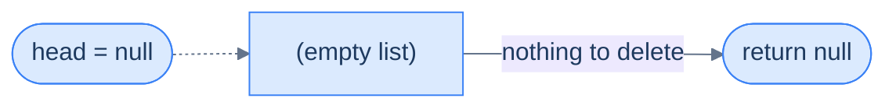

<p align="center"><strong>Empty list — no node exists, so deletion is a no-op. Return <code>null</code> immediately.</strong></p>

> **Algorithm**
>
> -   **Step 1:** Return the original head node.

## 2. The list has only one node

The lone node is simultaneously the head and the tail. Deleting it leaves a *truly* empty list. We save the head reference into a temporary, advance `head` to its (null) successor, and free the saved reference. The list is now empty.


<p align="center"><strong>Single-node list — the lone node is both head and tail. After deletion, the list is empty and <code>head</code> becomes <code>null</code>.</strong></p>

> **Algorithm**
>
> -   **Step 1:** Delete the head node to free up memory.
> -   **Step 2:** Return `null` as the list is now empty.

## 3. The list has more than one node

This is the general case. We *save the old head* in a temporary, slide `head` forward to the second node, snip the bidirectional link by clearing the new head's `prev` to `null`, and only **then** free the saved old head. The save-before-clobber pattern from insertion appears here in a slightly different form: **save the doomed node *before* you reroute pointers around it**, because once `head` moves, the old node may have no other live reference and you'll never reach it again.


<p align="center"><strong>Multi-node deletion at the front — three pointer touches plus a free. The new head's <code>prev</code> must be cleared to <code>null</code>, restoring the "I have no predecessor" invariant.</strong></p>

> **Algorithm**
>
> -   **Step 1:** Create a temporary pointer to store the current head node.
> -   **Step 2:** Move the head pointer to the next node.
> -   **Step 3:** Set the `prev` pointer of the new head node to `null`.
> -   **Step 4:** Delete the original head node to free up memory.
> -   **Step 5:** Return the new head node.

## Implementation

When implementing the logic for deleting the first node, we consider all three cases and write the code for each in conditional blocks.


```python run
"""
Definition for doubly-linked list.
class ListNode:
    def __init__(self, val):
        self.val = val
        self.prev = None
        self.next = None
"""

from typing import Optional

class Solution:
    def delete_first_node(
        self, head: Optional[ListNode]
    ) -> Optional[ListNode]:

        # Check if the list is empty (no nodes)
        if head is None:

            # If the list is empty, there is nothing to delete, so return
            # None
            return None

        # Check if there is only one node in the list
        if head.next is None:

            # Delete the single node
            del head

            # After deletion, the list becomes empty, so return None
            return None

        # If there are multiple nodes in the list
        # Store the first node in a temporary pointer
        nodeToBeDeleted = head

        # Update the head to point to the second node
        head = head.next

        # Update the previous pointer of the new head to None
        if head:
            head.prev = None

        # Delete the first node
        del nodeToBeDeleted

        # Return the updated head of the list
        return head
```

```java run
/**
 * Definition for doubly-linked list.
 * class ListNode {
 *     int val;
 *     ListNode prev;
 *     ListNode next;
 *     ListNode() {}
 *     ListNode(int val) { this.val = val; }
 * };
 */

class Solution {
    public ListNode deleteFirstNode(ListNode head) {

        // Check if the list is empty (no nodes)
        if (head == null) {

            // If the list is empty, there is nothing to delete, so
            // return null
            return null;
        }

        // Check if there is only one node in the list
        if (head.next == null) {

            // Delete the single node
            head = null;

            // After deletion, the list becomes empty, so return null
            return null;
        }

        // If there are multiple nodes in the list
        // Store the first node in a temporary pointer
        ListNode nodeToBeDeleted = head;

        // Update the head to point to the second node
        head = head.next;

        // Update the previous pointer of the new head to null
        head.prev = null;

        // Delete the first node
        nodeToBeDeleted = null;

        // Return the updated head of the list
        return head;
    }
}
```


## Complexity Analysis

We touch a constant number of pointers regardless of list length, and we never traverse. Both time and space are O(1).

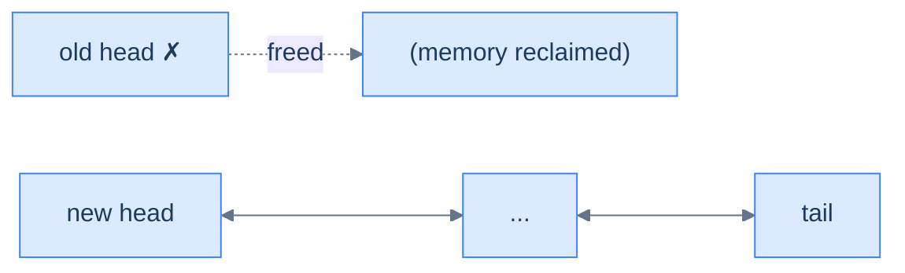

<p align="center"><strong>All cases — delete the first node touches a constant number of pointers (free old head, slide head forward, clear new head's <code>prev</code>). No traversal.</strong></p>

> **Best Case**
>
> -   Space Complexity — **O(1)**
> -   Time Complexity — **O(1)**
>
> **Worst Case**
>
> -   Space Complexity — **O(1)**
> -   Time Complexity — **O(1)**

***

# Delete first node

## The Problem

> Given the **head** of a doubly linked list, write a function to delete the first node from this list and return the head of the updated list.

```
Input:  head = [5, 7, 3, 10]
Output: [7, 3, 10]
```

<details>
<summary><h2>The Solution</h2></summary>


```python run viz=linked-list viz-root=head
from typing import Optional


class ListNode:
    def __init__(self, val=0, prev=None, nxt=None):
        self.val = val
        self.prev = prev
        self.next = nxt


def from_list(values):
    if not values:
        return None
    head = ListNode(values[0])
    cur = head
    for v in values[1:]:
        node = ListNode(v, prev=cur)
        cur.next = node
        cur = node
    return head


def to_list(head):
    out = []
    while head is not None:
        out.append(head.val)
        head = head.next
    return out


class Solution:
    def delete_first_node(
        self, head: Optional[ListNode]
    ) -> Optional[ListNode]:

        # Check if the list is empty (no nodes)
        if head is None:

            # If the list is empty, there is nothing to delete, so return
            # None
            return None

        # Check if there is only one node in the list
        if head.next is None:

            # Delete the single node
            del head

            # After deletion, the list becomes empty, so return None
            return None

        # If there are multiple nodes in the list
        # Store the first node in a temporary pointer
        nodeToBeDeleted = head

        # Update the head to point to the second node
        head = head.next

        # Update the previous pointer of the new head to None
        if head:
            head.prev = None

        # Delete the first node
        del nodeToBeDeleted

        # Return the updated head of the list
        return head


# Examples from the problem statement
print(to_list(Solution().delete_first_node(from_list([5, 7, 3, 10]))))  # [7, 3, 10]

# Edge cases
print(to_list(Solution().delete_first_node(None)))                       # []
print(to_list(Solution().delete_first_node(from_list([42]))))            # []
print(to_list(Solution().delete_first_node(from_list([1, 2]))))          # [2]
print(to_list(Solution().delete_first_node(from_list([1, 2, 3, 4]))))   # [2, 3, 4]
print(to_list(Solution().delete_first_node(from_list([5, 5, 5]))))      # [5, 5]
```

```java run
import java.util.*;

public class Main {
    static class ListNode {
        int val;
        ListNode prev;
        ListNode next;
        ListNode() {}
        ListNode(int val) { this.val = val; }
    }

    static ListNode fromList(int... values) {
        if (values.length == 0) return null;
        ListNode head = new ListNode(values[0]);
        ListNode cur = head;
        for (int i = 1; i < values.length; i++) {
            ListNode node = new ListNode(values[i]);
            node.prev = cur;
            cur.next = node;
            cur = node;
        }
        return head;
    }

    static java.util.List<Integer> toList(ListNode head) {
        java.util.List<Integer> out = new java.util.ArrayList<>();
        while (head != null) { out.add(head.val); head = head.next; }
        return out;
    }

    static class Solution {
        public ListNode deleteFirstNode(ListNode head) {

            // Check if the list is empty (no nodes)
            if (head == null) {

                // If the list is empty, there is nothing to delete, so
                // return null
                return null;
            }

            // Check if there is only one node in the list
            if (head.next == null) {

                // Delete the single node
                head = null;

                // After deletion, the list becomes empty, so return null
                return null;
            }

            // If there are multiple nodes in the list
            // Store the first node in a temporary pointer
            ListNode nodeToBeDeleted = head;

            // Update the head to point to the second node
            head = head.next;

            // Update the previous pointer of the new head to null
            head.prev = null;

            // Delete the first node
            nodeToBeDeleted = null;

            // Return the updated head of the list
            return head;
        }
    }

    public static void main(String[] args) {
        // Examples from the problem statement
        System.out.println(toList(new Solution().deleteFirstNode(fromList(5, 7, 3, 10))));  // [7, 3, 10]

        // Edge cases
        System.out.println(toList(new Solution().deleteFirstNode(null)));                    // []
        System.out.println(toList(new Solution().deleteFirstNode(fromList(42))));            // []
        System.out.println(toList(new Solution().deleteFirstNode(fromList(1, 2))));          // [2]
        System.out.println(toList(new Solution().deleteFirstNode(fromList(1, 2, 3, 4))));   // [2, 3, 4]
        System.out.println(toList(new Solution().deleteFirstNode(fromList(5, 5, 5))));      // [5, 5]
    }
}
```


<details>
<summary><strong>Trace — head = [5, 7, 3, 10]</strong></summary>

```
Initial │ head → 5 ⇄ 7 ⇄ 3 ⇄ 10
Step 1  │ head is not null, head.next is not null → multi-node case
Step 2  │ node_to_be_deleted = head        │ save old head (node 5)
Step 3  │ head = head.next                 │ head → 7 ⇄ 3 ⇄ 10
Step 4  │ head.prev = null                 │ new head 7 drops its back-link to the freed node
Step 5  │ free old head (node 5)
Result: [7, 3, 10] ✓
```

Two invariants. Save the old head *before* advancing the `head` reference — once `head = head.next` runs, the original node is unreachable through `head`, so the saved pointer is the only way back to free it. And clear the new head's `prev` to `null` (step 4) — otherwise node 7 still points back at the freed node 5 and a reverse traversal would walk into dead memory.

</details>

</details>

***

# Understanding deletion of last node

Deleting the last node is the perfect mirror of deleting the first — we already keep an explicit `tail` reference, so the predecessor is one `prev` hop away. No traversal, no scanning. The cases are identical in shape; only the words `head ↔ tail` and `next ↔ prev` flip.

## 1. The list is empty

`tail` is `null`, so there is nothing to delete. Return `null`.


<p align="center"><strong>Empty list — return <code>null</code> immediately, no work to do.</strong></p>

> **Algorithm**
>
> -   **Step 1:** Return the original tail node.

## 2. The list has only one node

The one node is both head and tail. Deleting it empties the list. Save the reference, set `tail` to `null`, and free.


<p align="center"><strong>Single-node list — the lone node disappears and <code>tail</code> becomes <code>null</code>.</strong></p>

> **Algorithm**
>
> -   **Step 1:** Delete the tail node to free up memory.
> -   **Step 2:** Return `null` as the list is now empty.

## 3. The list has more than one node

Save the doomed tail, slide `tail` backward via its `prev` pointer (this is where the doubly linked list earns its keep — *no scan from head needed*), set the new tail's `next` to `null`, and free the saved old tail.


<p align="center"><strong>Multi-node deletion at the back — three pointer touches plus a free. The <code>prev</code> pointer is what makes this O(1) — a singly linked list cannot do this without an O(N) walk.</strong></p>

> **Algorithm**
>
> -   **Step 1:** Create a temporary pointer to store the current tail node.
> -   **Step 2:** Move the tail pointer to the previous node.
> -   **Step 3:** Set the `next` pointer of the new tail node to `null`.
> -   **Step 4:** Delete the original tail node to free up memory.
> -   **Step 5:** Return the new tail node.

## Implementation


```python run
"""
Definition for doubly-linked list.
class ListNode:
    def __init__(self, val):
        self.val = val
        self.prev = None
        self.next = None
"""

from typing import Optional

class Solution:
    def delete_last_node(
        self, tail: Optional[ListNode]
    ) -> Optional[ListNode]:

        # If the list is empty, there is nothing to delete, so return
        # None
        if tail is None:
            return None

        # Check if there is only one node in the list
        if tail.prev is None:

            # Delete the single node
            tail = None

            # After deletion, the list becomes empty, so return None
            return None

        # If there are multiple nodes in the list
        # Store the last node (tail) in a temporary pointer
        node_to_be_deleted: ListNode = tail

        # Update the tail to point to the second-to-last node
        tail = tail.prev

        # Update the next pointer of the new tail to None
        if tail:
            tail.next = None

        # Delete the last node
        del node_to_be_deleted

        # Return the updated tail of the list
        return tail
```

```java run
/**
 * Definition for doubly-linked list.
 * class ListNode {
 *     int val;
 *     ListNode prev;
 *     ListNode next;
 *     ListNode() {}
 *     ListNode(int val) { this.val = val; }
 * };
 */

class Solution {
    public ListNode deleteLastNode(ListNode tail) {

        // If the list is empty, there is nothing to delete, so return
        // null
        if (tail == null) {
            return null;
        }

        // Check if there is only one node in the list
        if (tail.prev == null) {

            // Delete the single node
            tail = null;

            // After deletion, the list becomes empty, so return null
            return null;
        }

        // If there are multiple nodes in the list
        // Store the last node (tail) in a temporary pointer
        ListNode nodeToBeDeleted = tail;

        // Update the tail to point to the second-to-last node
        tail = tail.prev;

        // Update the next pointer of the new tail to null
        tail.next = null;

        // Delete the last node
        nodeToBeDeleted = null;

        // Return the updated tail of the list
        return tail;
    }
}
```


## Complexity Analysis

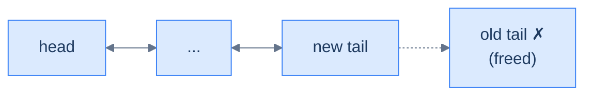

<p align="center"><strong>All cases — delete the last node touches a constant number of pointers. The <code>prev</code> pointer eliminates the O(N) walk a singly linked list would require.</strong></p>

> **Best Case**
>
> -   Space Complexity — **O(1)**
> -   Time Complexity — **O(1)**
>
> **Worst Case**
>
> -   Space Complexity — **O(1)**
> -   Time Complexity — **O(1)**

***

# Delete last node

## The Problem

> Given the **tail** of a doubly linked list, write a function to delete the last node from this linked list and return the tail of the updated list.

```
Input:  tail = node(10) of [5, 7, 3, 10]
Output: [5, 7, 3]
```

<details>
<summary><h2>The Solution</h2></summary>


```python run viz=linked-list viz-root=head
from typing import Optional


class ListNode:
    def __init__(self, val=0, prev=None, nxt=None):
        self.val = val
        self.prev = prev
        self.next = nxt


def from_list(values):
    if not values:
        return None
    head = ListNode(values[0])
    cur = head
    for v in values[1:]:
        node = ListNode(v, prev=cur)
        cur.next = node
        cur = node
    return head


def to_list(head):
    out = []
    while head is not None:
        out.append(head.val)
        head = head.next
    return out


def to_tail(head):
    if head is None:
        return None
    cur = head
    while cur.next is not None:
        cur = cur.next
    return cur


def head_of(node):
    if node is None:
        return None
    cur = node
    while cur.prev is not None:
        cur = cur.prev
    return cur


class Solution:
    def delete_last_node(
        self, tail: Optional[ListNode]
    ) -> Optional[ListNode]:

        # If the list is empty, there is nothing to delete, so return
        # null
        if tail is None:
            return None

        # Check if there is only one node in the list
        if tail.prev is None:

            # Delete the single node
            tail = None

            # After deletion, the list becomes empty, so return None
            return None

        # If there are multiple nodes in the list
        # Store the last node (tail) in a temporary pointer
        node_to_be_deleted: ListNode = tail

        # Update the tail to point to the second-to-last node
        tail = tail.prev

        # Update the next pointer of the new tail to None
        if tail:
            tail.next = None

        # Delete the last node
        del node_to_be_deleted

        # Return the updated tail of the list
        return tail


# Examples from the problem statement — show full list via head_of(new_tail)
new_tail1 = Solution().delete_last_node(to_tail(from_list([5, 7, 3, 10])))
print(to_list(head_of(new_tail1)))   # [5, 7, 3]

# Edge cases
print(Solution().delete_last_node(None))                                      # None

new_tail3 = Solution().delete_last_node(to_tail(from_list([42])))
print(new_tail3)                                                               # None

new_tail4 = Solution().delete_last_node(to_tail(from_list([1, 2])))
print(to_list(head_of(new_tail4)))   # [1]

new_tail5 = Solution().delete_last_node(to_tail(from_list([1, 2, 3, 4])))
print(to_list(head_of(new_tail5)))   # [1, 2, 3]

new_tail6 = Solution().delete_last_node(to_tail(from_list([5, 5, 5])))
print(to_list(head_of(new_tail6)))   # [5, 5]
```

```java run
import java.util.*;

public class Main {
    static class ListNode {
        int val;
        ListNode prev;
        ListNode next;
        ListNode() {}
        ListNode(int val) { this.val = val; }
    }

    static ListNode fromList(int... values) {
        if (values.length == 0) return null;
        ListNode head = new ListNode(values[0]);
        ListNode cur = head;
        for (int i = 1; i < values.length; i++) {
            ListNode node = new ListNode(values[i]);
            node.prev = cur;
            cur.next = node;
            cur = node;
        }
        return head;
    }

    static ListNode toTail(ListNode head) {
        if (head == null) return null;
        ListNode cur = head;
        while (cur.next != null) cur = cur.next;
        return cur;
    }

    static ListNode headOf(ListNode node) {
        if (node == null) return null;
        ListNode cur = node;
        while (cur.prev != null) cur = cur.prev;
        return cur;
    }

    static java.util.List<Integer> toList(ListNode head) {
        java.util.List<Integer> out = new java.util.ArrayList<>();
        while (head != null) { out.add(head.val); head = head.next; }
        return out;
    }

    static class Solution {
        public ListNode deleteLastNode(ListNode tail) {

            // If the list is empty, there is nothing to delete, so return
            // null
            if (tail == null) {
                return null;
            }

            // Check if there is only one node in the list
            if (tail.prev == null) {

                // Delete the single node
                tail = null;

                // After deletion, the list becomes empty, so return null
                return null;
            }

            // If there are multiple nodes in the list
            // Store the last node (tail) in a temporary pointer
            ListNode nodeToBeDeleted = tail;

            // Update the tail to point to the second-to-last node
            tail = tail.prev;

            // Update the next pointer of the new tail to null
            tail.next = null;

            // Delete the last node
            nodeToBeDeleted = null;

            // Return the updated tail of the list
            return tail;
        }
    }

    public static void main(String[] args) {
        // Examples from the problem statement
        ListNode t1 = new Solution().deleteLastNode(toTail(fromList(5, 7, 3, 10)));
        System.out.println(toList(headOf(t1)));   // [5, 7, 3]

        // Edge cases
        System.out.println(new Solution().deleteLastNode(null));              // null

        ListNode t3 = new Solution().deleteLastNode(toTail(fromList(42)));
        System.out.println(t3);                                               // null

        ListNode t4 = new Solution().deleteLastNode(toTail(fromList(1, 2)));
        System.out.println(toList(headOf(t4)));   // [1]

        ListNode t5 = new Solution().deleteLastNode(toTail(fromList(1, 2, 3, 4)));
        System.out.println(toList(headOf(t5)));   // [1, 2, 3]

        ListNode t6 = new Solution().deleteLastNode(toTail(fromList(5, 5, 5)));
        System.out.println(toList(headOf(t6)));   // [5, 5]
    }
}
```


<details>
<summary><strong>Trace — tail = node(10) of [5, 7, 3, 10]</strong></summary>

```
Initial │ tail → node(10) of 5 ⇄ 7 ⇄ 3 ⇄ 10
Step 1  │ tail is not null, tail.prev is not null → multi-node case
Step 2  │ node_to_be_deleted = tail        │ save old tail (node 10)
Step 3  │ tail = tail.prev                 │ tail → node(3)   (one O(1) hop)
Step 4  │ tail.next = null                 │ 5 ⇄ 7 ⇄ 3   (new tail terminates the chain)
Step 5  │ free old tail (node 10)
Result: [5, 7, 3] ✓
```

No walk. The `prev` pointer takes us from the old tail to the second-to-last node in one O(1) hop — this is exactly where the doubly linked list beats the singly linked one, which would have to scan from the head to find the predecessor.

</details>

</details>

***

# Understanding deletion by given data

Deleting a node by its value combines what we already know: a linear search to locate the node, followed by a constant-time splice to remove it. Four cases cover every possibility, and each one degenerates to something we already understand.

## 1. The list is empty

Nothing to search, nothing to delete. Return the (null) head.

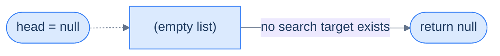

<p align="center"><strong>Empty list — no node to compare against, return immediately.</strong></p>

> **Algorithm**
>
> -   **Step 1:** Return the original head node.

## 2. The first node matches

If the head's value matches the target, the operation degenerates to **delete the first node**. Slide `head` forward, clear the new head's `prev`, and free the old head.


<p align="center"><strong>Head match — same as "delete first node". The new head's <code>prev</code> must be set to <code>null</code>.</strong></p>

> **Algorithm**
>
> -   **Step 1:** Create a temporary pointer to store the current head node.
> -   **Step 2:** Move the head pointer to the next node.
> -   **Step 3:** Set the `prev` pointer of the new head node to `null`.
> -   **Step 4:** Delete the original head node to free up memory.
> -   **Step 5:** Return the new head node.

## 3. The matching node is in the middle (or at the tail)

Walk forward from the second node, comparing values, until you find a match. The matching node has both a predecessor (`current.prev`) and a successor (`current.next`, which may be `null` if the match is the tail). Splice it out by routing the predecessor's `next` to the successor and the successor's `prev` to the predecessor — guarding the second update with a null check, because the matching node may be the tail.

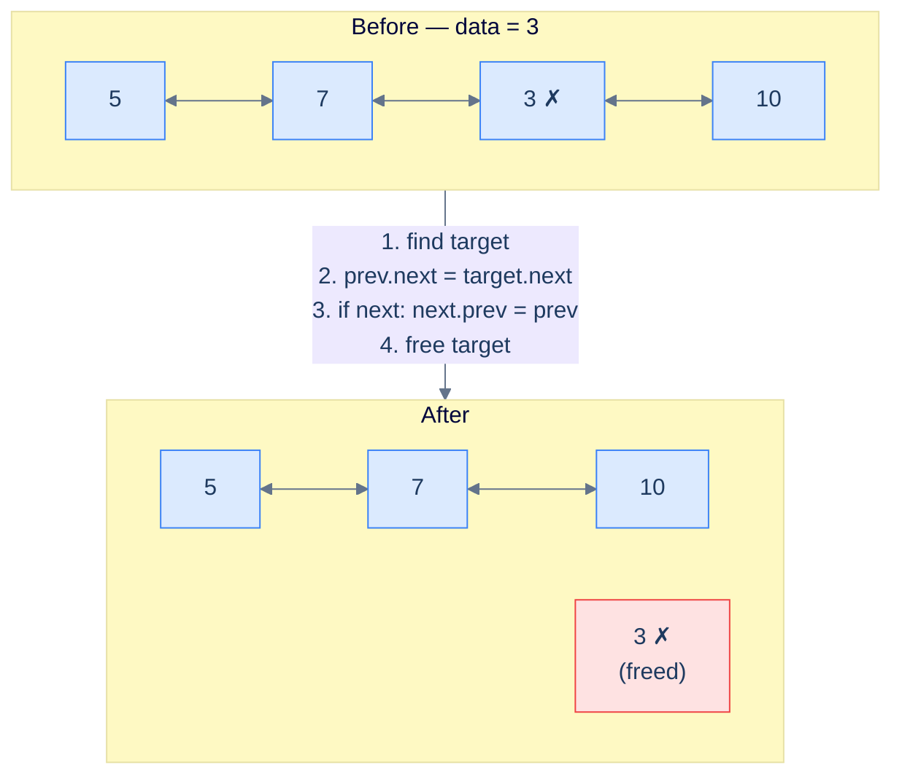

<p align="center"><strong>Mid-list match — the predecessor is reachable in O(1) via <code>target.prev</code>, and we splice both directions in two pointer writes plus a free.</strong></p>

> **Algorithm**
>
> -   **Step 1:** Traverse the list, keeping track of the `current` node, until reaching the node whose value equals the given data.
> -   **Step 2:** Set the `next` pointer of the node before the `current` node to hold the reference of the node after the `current` node.
> -   **Step 3:** Set the `prev` pointer of the node after the `current` node (if it exists) to hold the reference of the node before the `current` node.
> -   **Step 4:** Delete the `current` node to free up memory.
> -   **Step 5:** Return the original head node.

## 4. The data is not found

If the walk falls off the end (`current` becomes `null`) without ever matching, the value is not in the list. Return the head unchanged.


<p align="center"><strong>No match — fall off the end and return the original head untouched.</strong></p>

> **Algorithm**
>
> -   **Step 1:** Traverse the list, keeping track of the `current` node, until `current` becomes `null`.
> -   **Step 2:** Return the original head node.

## Implementation


```python run
"""
Definition for doubly-linked list.
class ListNode:
    def __init__(self, val):
        self.val = val
        self.prev = None
        self.next = None
"""

from typing import Optional

class Solution:
    def delete_node_with_given_data(
        self, head: Optional[ListNode], data: int
    ) -> Optional[ListNode]:

        # If the list is empty, there is nothing to delete, so return
        # None
        if head is None:
            return None

        # If the first node's value matches the target data, delete the
        # first node
        if head.val == data:

            # Store the current head in a separate variable to be deleted
            # later
            node_to_be_deleted = head

            # Move the head to the next node in the list
            head = head.next

            # If the new head exists, update its previous pointer to be
            # None, as it is now the first node
            if head is not None:
                head.prev = None

            # Dereference node_to_be_deleted for garbage collection
            node_to_be_deleted = None

            # Return the new head of the list
            return head

        # Pointer to the current node, starting from the second node
        current = head.next

        # If the target data is not in the first node, search for it in
        # the rest of the list
        while current is not None and current.val != data:

            # Continue traversing the list until the target data is found
            # or the end of the list is reached
            current = current.next

        # If the target data is not found in the list, return the head
        if current is None:
            return head

        # If the target data is found, remove the node from the list
        current.prev.next = current.next

        # If the next node exists, update its previous pointer to skip
        # the deleted node
        if current.next is not None:
            current.next.prev = current.prev

        # Dereference current for garbage collection
        current = None

        # Return the head of the list, with the target data node removed
        return head
```

```java run
/**
 * Definition for doubly-linked list.
 * class ListNode {
 *     int val;
 *     ListNode prev;
 *     ListNode next;
 *     ListNode() {}
 *     ListNode(int val) { this.val = val; }
 * };
 */

class Solution {
    public ListNode deleteNodeWithGivenData(ListNode head, int data) {

        // If the list is empty, there is nothing to delete, so return
        // null
        if (head == null) {
            return null;
        }

        // If the first node's value matches the target data, delete the
        // first node
        if (head.val == data) {

            // Store the current head in a separate variable to be
            // deleted later
            ListNode nodeToBeDeleted = head;

            // Move the head to the next node in the list
            head = head.next;

            // If the new head exists, update its previous pointer to be
            // null, as it is now the first node
            if (head != null) {
                head.prev = null;
            }

            // Delete the node with the target data by dereferencing it
            nodeToBeDeleted = null;

            // Return the new head of the list
            return head;
        }

        // Pointer to the current node, starting from the second node
        ListNode current = head.next;

        // If the target data is not in the first node, search for it in
        // the rest of the list
        while (current != null && current.val != data) {

            // Continue traversing the list until the target data is
            // found or the end of the list is reached
            current = current.next;
        }

        // If the target data is not found in the list, return the head
        if (current == null) {
            return head;
        }

        // If the target data is found, remove the node from the list
        current.prev.next = current.next;

        // If the next node exists, update its previous pointer to skip
        // the deleted node
        if (current.next != null) {
            current.next.prev = current.prev;
        }

        // Delete the node with the target data by dereferencing it
        current = null;

        // Return the head of the list, with the target data node removed
        return head;
    }
}
```


> *Before reading on — what would happen if we removed the `if (current.next != null)` guard? Trace it on `[5, 7, 3]` with `data = 3`.*
>
> `current` would land on the tail (node 3). `current.next` is `null`, and dereferencing `current.next.prev` would crash. The guard exists because the matching node may be the tail, in which case there is no successor whose `prev` needs updating.

## Complexity Analysis

Time depends on where the match lives. If the head matches, we're done in O(1). If the match sits at the tail (or the value is absent), we walked the whole list — O(N).

### Best case

The match is at the head. Constant time.

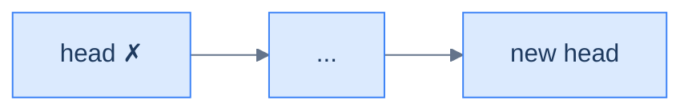

<p align="center"><strong>Best case — head matches, no traversal needed.</strong></p>

### Worst case

The match is at the tail (or absent). Linear time.

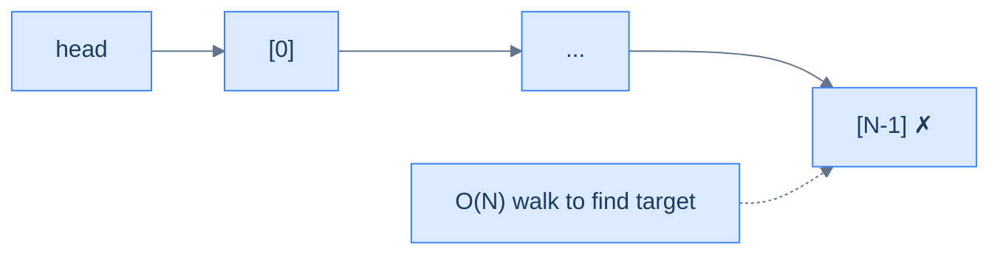

<p align="center"><strong>Worst case — value lives at the tail (or doesn't exist), forcing a full O(N) traversal.</strong></p>

> **Best Case** — match is the first node
>
> -   Space Complexity — **O(1)**
> -   Time Complexity — **O(1)**
>
> **Worst Case** — match is at the tail, or absent
>
> -   Space Complexity — **O(1)**
> -   Time Complexity — **O(N)**

***

# Delete node with given data

## The Problem

> Given the **head** of a doubly linked list and a **data** value, write a function to delete the first node with the given data from the list and return the head of the updated list.

```
Input:  head = [5, 7, 3, 10], data = 3
Output: [5, 7, 10]
```

<details>
<summary><h2>The Solution</h2></summary>


```python run viz=linked-list viz-root=head
from typing import Optional


class ListNode:
    def __init__(self, val=0, prev=None, nxt=None):
        self.val = val
        self.prev = prev
        self.next = nxt


def from_list(values):
    if not values:
        return None
    head = ListNode(values[0])
    cur = head
    for v in values[1:]:
        node = ListNode(v, prev=cur)
        cur.next = node
        cur = node
    return head


def to_list(head):
    out = []
    while head is not None:
        out.append(head.val)
        head = head.next
    return out


class Solution:
    def delete_node_with_given_data(
        self, head: Optional[ListNode], data: int
    ) -> Optional[ListNode]:

        # If the list is empty, there is nothing to delete, so return
        # None
        if head is None:
            return None

        # If the first node's value matches the target data, delete the
        # first node
        if head.val == data:

            # Store the current head in a separate variable to be deleted
            # later
            node_to_be_deleted = head

            # Move the head to the next node in the list
            head = head.next

            # If the new head exists, update its previous pointer to be
            # None, as it is now the first node
            if head is not None:
                head.prev = None

            # Dereference node_to_be_deleted for garbage collection
            node_to_be_deleted = None

            # Return the new head of the list
            return head

        # Pointer to the current node, starting from the second node
        current = head.next

        # If the target data is not in the first node, search for it in
        # the rest of the list
        while current is not None and current.val != data:

            # Continue traversing the list until the target data is found
            # or the end of the list is reached
            current = current.next

        # If the target data is not found in the list, return the head
        if current is None:
            return head

        # If the target data is found, remove the node from the list
        current.prev.next = current.next

        # If the next node exists, update its previous pointer to skip
        # the deleted node
        if current.next is not None:
            current.next.prev = current.prev

        # Dereference current for garbage collection
        current = None

        # Return the head of the list, with the target data node removed
        return head


# Examples from the problem statement
print(to_list(Solution().delete_node_with_given_data(from_list([5, 7, 3, 10]), 3)))    # [5, 7, 10]

# Edge cases
print(to_list(Solution().delete_node_with_given_data(None, 3)))                         # []
print(to_list(Solution().delete_node_with_given_data(from_list([5, 7, 3, 10]), 5)))    # [7, 3, 10]
print(to_list(Solution().delete_node_with_given_data(from_list([5, 7, 3, 10]), 10)))   # [5, 7, 3]
print(to_list(Solution().delete_node_with_given_data(from_list([5, 7, 3, 10]), 99)))   # [5, 7, 3, 10]
print(to_list(Solution().delete_node_with_given_data(from_list([42]), 42)))             # []
print(to_list(Solution().delete_node_with_given_data(from_list([3, 3, 3]), 3)))        # [3, 3] (only first)
```

```java run
import java.util.*;

public class Main {
    static class ListNode {
        int val;
        ListNode prev;
        ListNode next;
        ListNode() {}
        ListNode(int val) { this.val = val; }
    }

    static ListNode fromList(int... values) {
        if (values.length == 0) return null;
        ListNode head = new ListNode(values[0]);
        ListNode cur = head;
        for (int i = 1; i < values.length; i++) {
            ListNode node = new ListNode(values[i]);
            node.prev = cur;
            cur.next = node;
            cur = node;
        }
        return head;
    }

    static java.util.List<Integer> toList(ListNode head) {
        java.util.List<Integer> out = new java.util.ArrayList<>();
        while (head != null) { out.add(head.val); head = head.next; }
        return out;
    }

    static class Solution {
        public ListNode deleteNodeWithGivenData(ListNode head, int data) {

            // If the list is empty, there is nothing to delete, so return
            // null
            if (head == null) {
                return null;
            }

            // If the first node's value matches the target data, delete the
            // first node
            if (head.val == data) {

                // Store the current head in a separate variable to be
                // deleted later
                ListNode nodeToBeDeleted = head;

                // Move the head to the next node in the list
                head = head.next;

                // If the new head exists, update its previous pointer to be
                // null, as it is now the first node
                if (head != null) {
                    head.prev = null;
                }

                // Delete the node with the target data by dereferencing it
                nodeToBeDeleted = null;

                // Return the new head of the list
                return head;
            }

            // Pointer to the current node, starting from the second node
            ListNode current = head.next;

            // If the target data is not in the first node, search for it in
            // the rest of the list
            while (current != null && current.val != data) {

                // Continue traversing the list until the target data is
                // found or the end of the list is reached
                current = current.next;
            }

            // If the target data is not found in the list, return the head
            if (current == null) {
                return head;
            }

            // If the target data is found, remove the node from the list
            current.prev.next = current.next;

            // If the next node exists, update its previous pointer to skip
            // the deleted node
            if (current.next != null) {
                current.next.prev = current.prev;
            }

            // Delete the node with the target data by dereferencing it
            current = null;

            // Return the head of the list, with the target data node removed
            return head;
        }
    }

    public static void main(String[] args) {
        // Examples from the problem statement
        System.out.println(toList(new Solution().deleteNodeWithGivenData(fromList(5, 7, 3, 10), 3)));    // [5, 7, 10]

        // Edge cases
        System.out.println(toList(new Solution().deleteNodeWithGivenData(null, 3)));                      // []
        System.out.println(toList(new Solution().deleteNodeWithGivenData(fromList(5, 7, 3, 10), 5)));    // [7, 3, 10]
        System.out.println(toList(new Solution().deleteNodeWithGivenData(fromList(5, 7, 3, 10), 10)));   // [5, 7, 3]
        System.out.println(toList(new Solution().deleteNodeWithGivenData(fromList(5, 7, 3, 10), 99)));   // [5, 7, 3, 10]
        System.out.println(toList(new Solution().deleteNodeWithGivenData(fromList(42), 42)));             // []
        System.out.println(toList(new Solution().deleteNodeWithGivenData(fromList(3, 3, 3), 3)));        // [3, 3]
    }
}
```


<details>
<summary><strong>Trace — head = [5, 7, 3, 10], data = 3</strong></summary>

```
Initial │ 5 ⇄ 7 ⇄ 3 ⇄ 10
Step 1  │ head.val = 5 ≠ 3 → not the head case
Step 2  │ current = head.next = node(7)
Step 3  │ current.val = 7 ≠ 3 → current = node(3)
Step 4  │ current.val = 3 == 3 ✓ → loop exits
Step 5  │ current.prev.next = current.next     │ node(7).next = node(10)
Step 6  │ current.next is node(10) ≠ null →   │ node(10).prev = current.prev
        │ current.next.prev = current.prev      │ node(10).prev = node(7)
Step 7  │ free node(3)
Result: [5, 7, 10] ✓
```

The search keeps a single `current` cursor — there is no trailing `previous` pointer, because the predecessor is read straight off `current.prev` in step 5. Step 6 is the `prev`-side mirror, guarded by a null check in case the matched node was the tail.

</details>

</details>

***

# Delete nodes with given data

## The Problem

> Given the **head** of a doubly linked list and a **data** value, write a function to delete **all** the nodes with the given data from the list and return the head of the updated list.

```
Input:  head = [5, 7, 3, 10, 3], data = 3
Output: [5, 7, 10]
```

This is the *plural* sibling of the previous problem. The trick is two-phase: first peel off any matching nodes from the front (the head can match repeatedly — `[3, 3, 3, 5]` with `data = 3` should leave `[5]`), then walk the rest with two pointers (`previous` and `current`), splicing out each match in O(1) per match.

<details>
<summary><h2>The Solution</h2></summary>


```python run viz=linked-list viz-root=head
from typing import Optional


class ListNode:
    def __init__(self, val=0, prev=None, nxt=None):
        self.val = val
        self.prev = prev
        self.next = nxt


def from_list(values):
    if not values:
        return None
    head = ListNode(values[0])
    cur = head
    for v in values[1:]:
        node = ListNode(v, prev=cur)
        cur.next = node
        cur = node
    return head


def to_list(head):
    out = []
    while head is not None:
        out.append(head.val)
        head = head.next
    return out


class Solution:
    def delete_nodes_with_given_data(
        self, head: Optional[ListNode], data: int
    ) -> Optional[ListNode]:

        # Check if the head is None (empty list)
        if head is None:
            return None

        # Delete nodes with the given data at the beginning of the list
        while head is not None and head.val == data:

            # Move the head pointer to the next node
            head = head.next

            # Update the previous pointer of the new head
            if head is not None:
                head.prev = None

        # If the list is empty after deleting nodes at the beginning
        if head is None:
            return None

        # Iterate through the rest of the list to delete nodes with the
        # given data
        previous: Optional[ListNode] = head
        current: Optional[ListNode] = head.next

        while current is not None:

            # Delete nodes with the given data
            while current is not None and current.val == data:
                current = current.next

            # Update the previous pointer to skip the deleted nodes
            if previous:
                previous.next = current
            if current is not None:
                current.prev = previous

            # Move the previous and current pointers forward
            previous = current
            if current is not None:
                current = current.next

        # Return the modified head of the list
        return head


# Examples from the problem statement
print(to_list(Solution().delete_nodes_with_given_data(from_list([5, 7, 3, 10, 3]), 3)))     # [5, 7, 10]

# Edge cases
print(to_list(Solution().delete_nodes_with_given_data(None, 3)))                              # []
print(to_list(Solution().delete_nodes_with_given_data(from_list([3, 3, 3]), 3)))             # []
print(to_list(Solution().delete_nodes_with_given_data(from_list([1, 2, 3]), 1)))             # [2, 3]
print(to_list(Solution().delete_nodes_with_given_data(from_list([1, 2, 3]), 3)))             # [1, 2]
print(to_list(Solution().delete_nodes_with_given_data(from_list([1, 2, 2, 2, 3]), 2)))      # [1, 3]
print(to_list(Solution().delete_nodes_with_given_data(from_list([5, 5, 5, 5]), 5)))         # []
```

```java run
import java.util.*;

public class Main {
    static class ListNode {
        int val;
        ListNode prev;
        ListNode next;
        ListNode() {}
        ListNode(int val) { this.val = val; }
    }

    static ListNode fromList(int... values) {
        if (values.length == 0) return null;
        ListNode head = new ListNode(values[0]);
        ListNode cur = head;
        for (int i = 1; i < values.length; i++) {
            ListNode node = new ListNode(values[i]);
            node.prev = cur;
            cur.next = node;
            cur = node;
        }
        return head;
    }

    static java.util.List<Integer> toList(ListNode head) {
        java.util.List<Integer> out = new java.util.ArrayList<>();
        while (head != null) { out.add(head.val); head = head.next; }
        return out;
    }

    static class Solution {
        public ListNode deleteNodesWithGivenData(ListNode head, int data) {

            // Check if the head is null (empty list)
            if (head == null) {
                return null;
            }

            // Delete nodes with the given data at the beginning of the list
            while (head != null && head.val == data) {

                // Store the node to delete
                ListNode nodeToDelete = head;

                // Move the head pointer to the next node
                head = head.next;

                // Update the previous pointer of the new head
                if (head != null) {
                    head.prev = null;
                }

                // Delete the node
                nodeToDelete = null;
            }

            // If the list is empty after deleting nodes at the beginning
            if (head == null) {
                return null;
            }

            // Iterate through the rest of the list to delete nodes with the
            // given data
            ListNode previous = head;
            ListNode current = head.next;

            while (current != null) {

                // Delete nodes with the given data
                while (current != null && current.val == data) {
                    ListNode nodeToDelete = current;
                    current = current.next;

                    // Delete the node
                    nodeToDelete = null;
                }

                // Update the previous pointer to skip the deleted nodes
                previous.next = current;
                if (current != null) {
                    current.prev = previous;
                }

                // Move the previous and current pointers forward
                previous = current;
                if (current != null) {
                    current = current.next;
                }
            }

            // Return the modified head of the list
            return head;
        }
    }

    public static void main(String[] args) {
        // Examples from the problem statement
        System.out.println(toList(new Solution().deleteNodesWithGivenData(fromList(5, 7, 3, 10, 3), 3)));    // [5, 7, 10]

        // Edge cases
        System.out.println(toList(new Solution().deleteNodesWithGivenData(null, 3)));                          // []
        System.out.println(toList(new Solution().deleteNodesWithGivenData(fromList(3, 3, 3), 3)));            // []
        System.out.println(toList(new Solution().deleteNodesWithGivenData(fromList(1, 2, 3), 1)));            // [2, 3]
        System.out.println(toList(new Solution().deleteNodesWithGivenData(fromList(1, 2, 3), 3)));            // [1, 2]
        System.out.println(toList(new Solution().deleteNodesWithGivenData(fromList(1, 2, 2, 2, 3), 2)));     // [1, 3]
        System.out.println(toList(new Solution().deleteNodesWithGivenData(fromList(5, 5, 5, 5), 5)));        // []
    }
}
```


<details>
<summary><strong>Trace — head = [5, 7, 3, 10, 3], data = 3</strong></summary>

```
Initial │ 5 ⇄ 7 ⇄ 3 ⇄ 10 ⇄ 3
Phase 1 │ head.val = 5 ≠ 3 → no front matches; head stays at node(5)
Phase 2 │ previous = node(5), current = node(7)
        │ inner loop: 7 ≠ 3 → no drop; current stays node(7)
        │ previous.next = node(7); node(7).prev = previous(5); previous = 7; current = node(3)
        │ inner loop: 3 == 3 → drop current; current = node(10)
        │ previous.next = node(10); node(10).prev = previous(7); previous = 10; current = node(3)
        │ inner loop: 3 == 3 → drop current; current = null
        │ previous.next = null   (current is null, so no prev mirror; tail terminator restored)
Result: [5, 7, 10] ✓
```

Each splice rewires *both* directions — `previous.next` jumps over the dropped run, and the surviving successor's `prev` is reset back to `previous` so the backward chain stays consistent. The `prev` write is skipped only when `current` is `null` (the run reached the tail). The two-phase split keeps the head case clean: the head can match repeatedly, but every other matching run sits between two well-defined neighbours.

</details>

</details>

***

# Understanding deletion after the given node

This case is similar to its singly-linked counterpart, with one extra step: after we splice out the node *after* the given one, we must update the **back-pointer** of the new successor — otherwise the backward chain breaks. Three cases.

## 1. The list is empty

No list, no anchor. Return `null`.

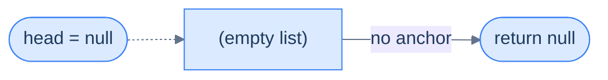

<p align="center"><strong>Empty list — no anchor for the operation.</strong></p>

> **Algorithm**
>
> -   **Step 1:** Return the original head node.

## 2. The given node is the last node

The given node has no successor — there's nothing *after* it to delete. Return the head unchanged.

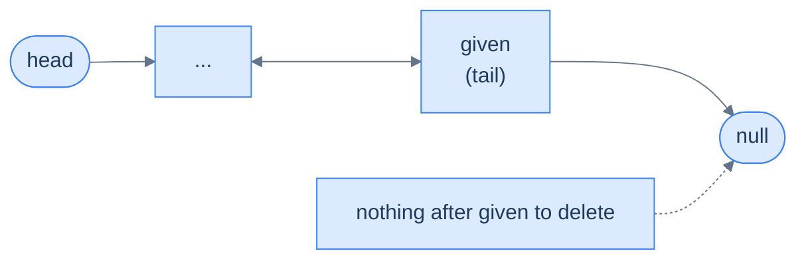

<p align="center"><strong>Given node is the tail — there is no successor, so the operation is a no-op.</strong></p>

> **Algorithm**
>
> -   **Step 1:** Return the original head node.

## 3. The given node is not the last node

Save `target = given.next`, then route `given.next` past it to `target.next`. If `target.next` exists (i.e. the deleted node was not itself the tail), update its `prev` back to `given`. Then free `target`.

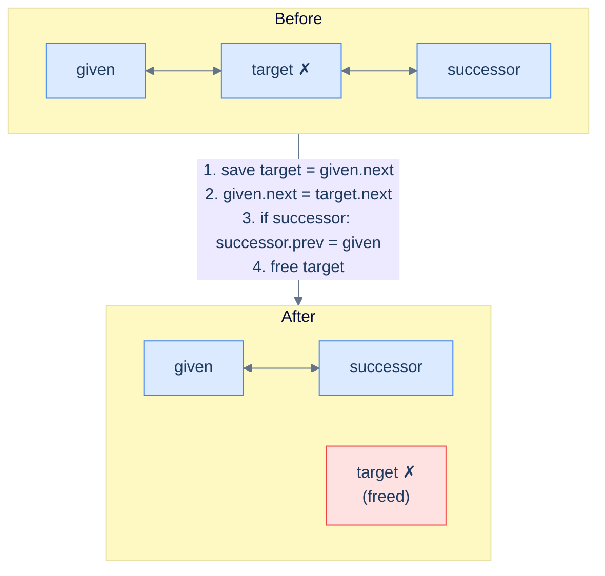

<p align="center"><strong>Splice out the node after the given one — three pointer touches plus a free, with the mirror update guarded against the case where the deleted node was the tail.</strong></p>

> **Algorithm**
>
> -   **Step 1:** Create a temporary pointer to store the reference of the node after the `given` node.
> -   **Step 2:** Set the `given` node's `next` pointer to hold the reference of the node stored in the `next` pointer of the node after the `given` node.
> -   **Step 3:** Set the `prev` pointer of the node after the deleted node (if it exists) to hold the reference of the `given` node.
> -   **Step 4:** Delete the node after the given node to free up memory.
> -   **Step 5:** Return the original head node.

## Implementation


```python run
"""
Definition for doubly-linked list.
class ListNode:
    def __init__(self, val):
        self.val = val
        self.prev = None
        self.next = None
"""

from typing import Optional

class Solution:
    def delete_node_after_the_given_node(
        self, head: Optional[ListNode], node: Optional[ListNode]
    ) -> Optional[ListNode]:

        # If the list is empty, there's nothing to delete, so return
        # None.
        if head is None:
            return None

        # If the given node is None or it is the last node in the list,
        # there's no node to delete, so return the original head.
        if node is None or node.next is None:
            return head

        # Store the next node in a temporary variable.
        node_to_be_deleted = node.next

        # Link the current node (node) to the node after the one being
        # deleted.
        node.next = node_to_be_deleted.next

        # Check if the node to be deleted is not the last node in the
        # list
        if node_to_be_deleted.next is not None:

            # Point the previous node of the node to be deleted to the
            # given node
            node_to_be_deleted.next.prev = node

        # Dereference node_to_be_deleted for garbage collection
        node_to_be_deleted = None

        # Return the original head.
        return head
```

```java run
/**
 * Definition for doubly-linked list.
 * class ListNode {
 *     int val;
 *     ListNode prev;
 *     ListNode next;
 *     ListNode() {}
 *     ListNode(int val) { this.val = val; }
 * };
 */

class Solution {
    public ListNode deleteNodeAfterTheGivenNode(
        ListNode head,
        ListNode node
    ) {

        // If the list is empty, there's nothing to delete, so return
        // null.
        if (head == null) {
            return null;
        }

        // If the given node is null or it is the last node in the list,
        // there's no node to delete, so return the original head.
        if (node == null || node.next == null) {
            return head;
        }

        // Store the next node in a temporary variable.
        ListNode nodeToBeDeleted = node.next;

        // Link the current node (node) to the node after the one being
        // deleted.
        node.next = nodeToBeDeleted.next;

        // Check if the node to be deleted is not the last node in the
        // list
        if (nodeToBeDeleted.next != null) {

            // Point the previous node of the node to be deleted to the
            // given node
            nodeToBeDeleted.next.prev = node;
        }

        // Dereference nodeToBeDeleted to allow garbage collection
        nodeToBeDeleted = null;

        // Return the original head.
        return head;
    }
}
```


## Complexity Analysis

We touch a constant number of pointers and never traverse. Both time and space are O(1).

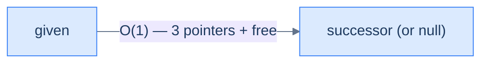

<p align="center"><strong>All cases — delete after the given node touches at most three pointers and one free, regardless of list size.</strong></p>

> **Best Case**
>
> -   Space Complexity — **O(1)**
> -   Time Complexity — **O(1)**
>
> **Worst Case**
>
> -   Space Complexity — **O(1)**
> -   Time Complexity — **O(1)**

***

# Delete node after the given node

## The Problem

> Given the **head** of a doubly linked list and a reference to a **random node** in the list, write a function to delete the node after the given node and return the head of the updated list.

```
Input:  head = [5, 7, 3, 10], node = node(7)
Output: [5, 7, 10]
```

<details>
<summary><h2>The Solution</h2></summary>


```python run viz=linked-list viz-root=head
from typing import Optional


class ListNode:
    def __init__(self, val=0, prev=None, nxt=None):
        self.val = val
        self.prev = prev
        self.next = nxt


def from_list(values):
    if not values:
        return None
    head = ListNode(values[0])
    cur = head
    for v in values[1:]:
        node = ListNode(v, prev=cur)
        cur.next = node
        cur = node
    return head


def to_list(head):
    out = []
    while head is not None:
        out.append(head.val)
        head = head.next
    return out


def get_node(head, val):
    cur = head
    while cur is not None:
        if cur.val == val:
            return cur
        cur = cur.next
    return None


class Solution:
    def delete_node_after_the_given_node(
        self, head: Optional[ListNode], node: Optional[ListNode]
    ) -> Optional[ListNode]:

        # If the list is empty, there's nothing to delete, so return
        # None.
        if head is None:
            return None

        # If the given node is None or it is the last node in the list,
        # there's no node to delete, so return the original head.
        if node is None or node.next is None:
            return head

        # Store the next node in a temporary variable.
        node_to_be_deleted = node.next

        # Link the current node (node) to the node after the one being
        # deleted.
        node.next = node_to_be_deleted.next

        # Check if the node to be deleted is not the last node in the
        # list
        if node_to_be_deleted.next is not None:

            # Point the previous node of the node to be deleted to the
            # given node
            node_to_be_deleted.next.prev = node

        # Dereference node_to_be_deleted for garbage collection
        node_to_be_deleted = None

        # Return the original head.
        return head


# Examples from the problem statement
h1 = from_list([5, 7, 3, 10])
print(to_list(Solution().delete_node_after_the_given_node(h1, get_node(h1, 7))))   # [5, 7, 10]

# Edge cases — empty list
print(to_list(Solution().delete_node_after_the_given_node(None, None)))             # []

# node is None — no-op
h2 = from_list([1, 2, 3])
print(to_list(Solution().delete_node_after_the_given_node(h2, None)))              # [1, 2, 3]

# node is the tail — no-op
h3 = from_list([1, 2, 3])
print(to_list(Solution().delete_node_after_the_given_node(h3, get_node(h3, 3))))   # [1, 2, 3]

# delete after head
h4 = from_list([1, 2, 3, 4])
print(to_list(Solution().delete_node_after_the_given_node(h4, get_node(h4, 1))))   # [1, 3, 4]

# single-node list
h5 = from_list([5])
print(to_list(Solution().delete_node_after_the_given_node(h5, get_node(h5, 5))))   # [5]
```

```java run
import java.util.*;

public class Main {
    static class ListNode {
        int val;
        ListNode prev;
        ListNode next;
        ListNode() {}
        ListNode(int val) { this.val = val; }
    }

    static ListNode fromList(int... values) {
        if (values.length == 0) return null;
        ListNode head = new ListNode(values[0]);
        ListNode cur = head;
        for (int i = 1; i < values.length; i++) {
            ListNode node = new ListNode(values[i]);
            node.prev = cur;
            cur.next = node;
            cur = node;
        }
        return head;
    }

    static java.util.List<Integer> toList(ListNode head) {
        java.util.List<Integer> out = new java.util.ArrayList<>();
        while (head != null) { out.add(head.val); head = head.next; }
        return out;
    }

    static ListNode getNode(ListNode head, int val) {
        ListNode cur = head;
        while (cur != null) {
            if (cur.val == val) return cur;
            cur = cur.next;
        }
        return null;
    }

    static class Solution {
        public ListNode deleteNodeAfterTheGivenNode(
            ListNode head,
            ListNode node
        ) {

            // If the list is empty, there's nothing to delete, so return
            // null.
            if (head == null) {
                return null;
            }

            // If the given node is null or it is the last node in the list,
            // there's no node to delete, so return the original head.
            if (node == null || node.next == null) {
                return head;
            }

            // Store the next node in a temporary variable.
            ListNode nodeToBeDeleted = node.next;

            // Link the current node (node) to the node after the one being
            // deleted.
            node.next = nodeToBeDeleted.next;

            // Check if the node to be deleted is not the last node in the
            // list
            if (nodeToBeDeleted.next != null) {

                // Point the previous node of the node to be deleted to the
                // given node
                nodeToBeDeleted.next.prev = node;
            }

            // Dereference nodeToBeDeleted to allow garbage collection
            nodeToBeDeleted = null;

            // Return the original head.
            return head;
        }
    }

    public static void main(String[] args) {
        // Examples from the problem statement
        ListNode h1 = fromList(5, 7, 3, 10);
        System.out.println(toList(new Solution().deleteNodeAfterTheGivenNode(h1, getNode(h1, 7))));  // [5, 7, 10]

        // Edge cases — empty list
        System.out.println(toList(new Solution().deleteNodeAfterTheGivenNode(null, null)));           // []

        // node is null — no-op
        ListNode h2 = fromList(1, 2, 3);
        System.out.println(toList(new Solution().deleteNodeAfterTheGivenNode(h2, null)));            // [1, 2, 3]

        // node is the tail — no-op
        ListNode h3 = fromList(1, 2, 3);
        System.out.println(toList(new Solution().deleteNodeAfterTheGivenNode(h3, getNode(h3, 3)))); // [1, 2, 3]

        // delete after head
        ListNode h4 = fromList(1, 2, 3, 4);
        System.out.println(toList(new Solution().deleteNodeAfterTheGivenNode(h4, getNode(h4, 1)))); // [1, 3, 4]

        // single-node list
        ListNode h5 = fromList(5);
        System.out.println(toList(new Solution().deleteNodeAfterTheGivenNode(h5, getNode(h5, 5)))); // [5]
    }
}
```


<details>
<summary><strong>Trace — head = [5, 7, 3, 10], node = node(7)</strong></summary>

```
Initial │ 5 ⇄ 7 ⇄ 3 ⇄ 10
Step 1  │ head, node both non-null, node.next = node(3) non-null → general case
Step 2  │ node_to_be_deleted = node.next = node(3)   (save before clobber)
Step 3  │ node.next = node_to_be_deleted.next        │ node(7).next = node(10)
Step 4  │ node_to_be_deleted.next is node(10) ≠ null → │ node(10).prev = node
        │ node_to_be_deleted.next.prev = node          │ node(10).prev = node(7)
Step 5  │ free node(3)
Result: [5, 7, 10] ✓
```

Step 4 is the `prev`-side mirror: after node(7) forward-links past node(3), node(10) must also drop its back-link to node(3) and point at node(7). The null check guards the case where the deleted node was itself the tail.

</details>

</details>

***

# Understanding deletion before a given node

This is one of the operations that gives a doubly linked list a real edge over a singly linked one. In a singly linked list, "delete before X" needs us to track a `previousToPrevious` pointer all the way from the head — there's no other way to find the node *two steps* before X. In a doubly linked list, both candidates we need are within one hop: `node.prev` is the doomed node, and `node.prev.prev` is the predecessor's predecessor whose `next` we have to reroute. Four cases.

## 1. The list is empty (or given is null)

No anchor exists. Return the head unchanged.


<p align="center"><strong>Empty list or null reference — no anchor exists, return early.</strong></p>

> **Algorithm**
>
> -   **Step 1:** Return the original head node.

## 2. The given node is the head

The head has no predecessor — there is nothing *before* it to delete. Return the head unchanged.

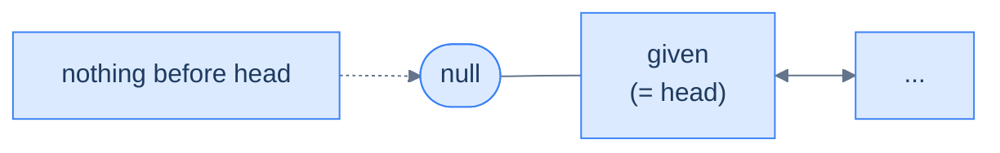

<p align="center"><strong>Given is the head — no predecessor exists, the operation is a no-op.</strong></p>

> **Algorithm**
>
> -   **Step 1:** Return the original head node.

## 3. The given node is the second node

The node before the second node *is* the head. Deleting it means a new head emerges — the given node itself becomes the head. This is functionally **delete the first node**.

```mermaid
---
config:
  theme: base
  themeVariables:
    primaryColor: "#dbeafe"
    primaryBorderColor: "#3b82f6"
    primaryTextColor: "#1e3a5f"
    lineColor: "#64748b"
    secondaryColor: "#ede9fe"
    tertiaryColor: "#fef9c3"
---
flowchart TB
    subgraph BEFORE["Before"]
        direction LR
        BH(["head"]) --> H1["5 ✗"] <--> G["given (7)"] <--> H3["3"]
    end
    subgraph AFTER["After"]
        direction LR
        AH(["head"]) --> AG["given (7)"] <--> N3["3"]
        GONE["5 ✗<br/>(freed)"]
    end
    BEFORE -->|"delete-first-node + update head reference"| AFTER
    style GONE fill:#fee2e2,stroke:#ef4444
```

<p align="center"><strong>Given is the second node — the predecessor is the head. Deleting it promotes the given node to head.</strong></p>

> **Algorithm**
>
> -   **Step 1:** Create a temporary pointer to store the current head node.
> -   **Step 2:** Move the head pointer to the next node (which is the given node).
> -   **Step 3:** Set the `prev` pointer of the new head node to `null`.
> -   **Step 4:** Delete the original head node to free up memory.
> -   **Step 5:** Return the new head node.

## 4. The given node is any other node

The doomed node is `target = given.prev`, and its predecessor is `target.prev` (= `given.prev.prev`). Both are O(1) hops away. Reroute `given.prev = target.prev`, route `target.prev.next = given`, and free `target`.

```mermaid
---
config:
  theme: base
  themeVariables:
    primaryColor: "#dbeafe"
    primaryBorderColor: "#3b82f6"
    primaryTextColor: "#1e3a5f"
    lineColor: "#64748b"
    secondaryColor: "#ede9fe"
    tertiaryColor: "#fef9c3"
---
flowchart TB
    subgraph BEFORE["Before"]
        direction LR
        PP["pre-predecessor<br/>(= given.prev.prev)"] <--> BT["target ✗<br/>(= given.prev)"] <--> BG["given"]
    end
    subgraph AFTER["After"]
        direction LR
        AP["pre-predecessor"] <--> AG["given"]
        GONE["target ✗<br/>(freed)"]
    end
    BEFORE -->|"1. save target = given.prev<br/>2. given.prev = target.prev<br/>3. if pre-pre: pre-pre.next = given<br/>4. free target"| AFTER
    style GONE fill:#fee2e2,stroke:#ef4444
```

<p align="center"><strong>Given is mid-list — splice the predecessor out by routing <code>given.prev</code> to <code>given.prev.prev</code> and the pre-predecessor's <code>next</code> to <code>given</code>. Both hops are O(1).</strong></p>

> **Algorithm**
>
> -   **Step 1:** Create a temporary pointer to store the reference of the node before the `given` node.
> -   **Step 2:** Set the given node's `prev` pointer to hold the reference of the node before the node to be deleted.
> -   **Step 3:** Set the `next` pointer of the node before the to-be-deleted node (if it exists) to hold the reference of the `given` node.
> -   **Step 4:** Delete the node before the `given` node to free up memory.
> -   **Step 5:** Return the original head node.

## Implementation


```python run
"""
Definition for doubly-linked list.
class ListNode:
    def __init__(self, val):
        self.val = val
        self.prev = None
        self.next = None
"""

from typing import Optional

class Solution:
    def delete_node_before_the_given_node(
        self, head: Optional[ListNode], node: Optional[ListNode]
    ) -> Optional[ListNode]:

        # If the head or the given node is None, there is nothing to delete
        # Return the existing head
        if head is None or node is None:
            return head

        # If the given node is the head node, we cannot delete the node
        # before it
        if node == head:
            return head

        # If the node to delete is the immediate next node of the head
        # Update the head to point to the next node, delete the original
        # head, and return the updated head
        if head.next is not None and head.next == node:
            node_to_be_deleted = head
            head = head.next

            # Update the new head's previous pointer to None
            head.prev = None

            # Dereference for garbage collection
            node_to_be_deleted = None
            return head

        # If the node before the given node is not the head,
        # update the pointers of the neighboring nodes and delete the
        # node before the given node

        # Get the node before the given node
        node_to_be_deleted = node.prev

        # Update the previous pointer of the given node
        node.prev = node_to_be_deleted.prev
        if node_to_be_deleted.prev is not None:

            # Update the next pointer of the node before the given node
            node_to_be_deleted.prev.next = node

        # Dereference for garbage collection
        node_to_be_deleted = None

        # Return the head of the updated linked list
        return head
```

```java run
/**
 * Definition for doubly-linked list.
 * class ListNode {
 *     int val;
 *     ListNode prev;
 *     ListNode next;
 *     ListNode() {}
 *     ListNode(int val) { this.val = val; }
 * };
 */

class Solution {
    public ListNode deleteNodeBeforeTheGivenNode(
        ListNode head,
        ListNode node
    ) {

        // If the head or the given node is null, there is nothing to
        // delete Return the existing head
        if (head == null || node == null) {
            return head;
        }

        // If the given node is the head node, we cannot delete the node
        // before it
        if (node == head) {
            return head;
        }

        // If the node to delete is the immediate next node of the head
        // Update the head to point to the next node, delete the original
        // head, and return the updated head
        if (head.next != null && head.next == node) {
            ListNode nodeToBeDeleted = head;
            head = head.next;

            // Update the new head's previous pointer to null
            head.prev = null;

            // Dereference for garbage collection
            nodeToBeDeleted = null;
            return head;
        }

        // If the node before the given node is not the head,
        // update the pointers of the neighboring nodes and delete the
        // node before the given node

        // Get the node before the given node
        ListNode nodeToBeDeleted = node.prev;

        // Update the previous pointer of the given node
        node.prev = nodeToBeDeleted.prev;
        if (nodeToBeDeleted.prev != null) {

            // Update the next pointer of the node before the given node
            nodeToBeDeleted.prev.next = node;
        }

        // Dereference for garbage collection
        nodeToBeDeleted = null;

        // Return the head of the updated linked list
        return head;
    }
}
```


> *Why is the "given is the second node" case special? Try to fit it under the general case — what goes wrong?*
>
> Under the general case, we set `target.prev.next = node` only if `target.prev != null`. If `target` is the head (Case 3), `target.prev` is null and that step is skipped — but we **also** need to update the external `head` reference, because the head itself is gone. The general case alone never updates `head`. Splitting Case 3 out keeps the head reference honest.

## Complexity Analysis

We never traverse — both the doomed node and its predecessor are reachable in O(1) via `prev` links. This is the same headline win we saw with insertion-before-given-node, expressed for deletion.

```mermaid
---
config:
  theme: base
  themeVariables:
    primaryColor: "#dbeafe"
    primaryBorderColor: "#3b82f6"
    primaryTextColor: "#1e3a5f"
    lineColor: "#64748b"
    secondaryColor: "#ede9fe"
    tertiaryColor: "#fef9c3"
---
flowchart LR
    PP["pre-predecessor"] -->|"O(1)"| G["given"]
    NOTE["target = given.prev — O(1)<br/>target.prev = given.prev.prev — O(1)"] -.-> G
```

<p align="center"><strong>All cases — delete before the given node touches a constant number of pointers, with both the target and its predecessor reachable via <code>prev</code> in O(1).</strong></p>

> **Best Case**
>
> -   Space Complexity — **O(1)**
> -   Time Complexity — **O(1)**
>
> **Worst Case**
>
> -   Space Complexity — **O(1)**
> -   Time Complexity — **O(1)**

***

# Delete node before the given node

## The Problem

> Given the **head** of a doubly linked list and a reference to a **random node** in the list, write a function to delete the node before the given node and return the head of the updated list.

```
Input:  head = [5, 7, 3, 10], node = node(3)
Output: [5, 3, 10]
```

<details>
<summary><h2>The Solution</h2></summary>


```python run viz=linked-list viz-root=head
from typing import Optional


class ListNode:
    def __init__(self, val=0, prev=None, nxt=None):
        self.val = val
        self.prev = prev
        self.next = nxt


def from_list(values):
    if not values:
        return None
    head = ListNode(values[0])
    cur = head
    for v in values[1:]:
        node = ListNode(v, prev=cur)
        cur.next = node
        cur = node
    return head


def to_list(head):
    out = []
    while head is not None:
        out.append(head.val)
        head = head.next
    return out


def get_node(head, val):
    cur = head
    while cur is not None:
        if cur.val == val:
            return cur
        cur = cur.next
    return None


class Solution:
    def delete_node_before_the_given_node(
        self, head: Optional[ListNode], node: Optional[ListNode]
    ) -> Optional[ListNode]:

        # If the head or the given node is None, there is nothing to
        # delete. Return the existing head
        if head is None or node is None:
            return head

        # If the given node is the head node, we cannot delete the node
        # before it
        if node == head:
            return head

        # If the node to delete is the immediate next node of the head
        # Update the head to point to the next node, delete the original
        # head, and return the updated head
        if head.next is not None and head.next == node:
            node_to_be_deleted = head
            head = head.next

            # Update the new head's previous pointer to None
            head.prev = None

            # Dereference for garbage collection
            node_to_be_deleted = None
            return head

        # Get the node before the given node
        node_to_be_deleted = node.prev

        # Update the previous pointer of the given node
        node.prev = node_to_be_deleted.prev
        if node_to_be_deleted.prev is not None:

            # Update the next pointer of the node before the given node
            node_to_be_deleted.prev.next = node

        # Dereference for garbage collection
        node_to_be_deleted = None

        # Return the head of the updated linked list
        return head


# Examples from the problem statement
h1 = from_list([5, 7, 3, 10])
print(to_list(Solution().delete_node_before_the_given_node(h1, get_node(h1, 3))))   # [5, 3, 10]

# Edge cases — node is head (no-op)
h2 = from_list([5, 7, 3, 10])
print(to_list(Solution().delete_node_before_the_given_node(h2, get_node(h2, 5))))   # [5, 7, 3, 10]

# delete before second node (removes head)
h3 = from_list([5, 7, 3, 10])
print(to_list(Solution().delete_node_before_the_given_node(h3, get_node(h3, 7))))   # [7, 3, 10]

# delete before tail
h4 = from_list([1, 2, 3, 4])
print(to_list(Solution().delete_node_before_the_given_node(h4, get_node(h4, 4))))   # [1, 2, 4]

# head is None — returns None
print(Solution().delete_node_before_the_given_node(None, None))                       # None

# two-node list, delete before second node
h5 = from_list([10, 20])
print(to_list(Solution().delete_node_before_the_given_node(h5, get_node(h5, 20))))  # [20]
```

```java run
import java.util.*;

public class Main {
    static class ListNode {
        int val;
        ListNode prev;
        ListNode next;
        ListNode() {}
        ListNode(int val) { this.val = val; }
    }

    static ListNode fromList(int... values) {
        if (values.length == 0) return null;
        ListNode head = new ListNode(values[0]);
        ListNode cur = head;
        for (int i = 1; i < values.length; i++) {
            ListNode node = new ListNode(values[i]);
            node.prev = cur;
            cur.next = node;
            cur = node;
        }
        return head;
    }

    static java.util.List<Integer> toList(ListNode head) {
        java.util.List<Integer> out = new java.util.ArrayList<>();
        while (head != null) { out.add(head.val); head = head.next; }
        return out;
    }

    static ListNode getNode(ListNode head, int val) {
        ListNode cur = head;
        while (cur != null) {
            if (cur.val == val) return cur;
            cur = cur.next;
        }
        return null;
    }

    static class Solution {
        public ListNode deleteNodeBeforeTheGivenNode(
            ListNode head,
            ListNode node
        ) {

            // If the head or the given node is null, there is nothing to
            // delete Return the existing head
            if (head == null || node == null) {
                return head;
            }

            // If the given node is the head node, we cannot delete the node
            // before it
            if (node == head) {
                return head;
            }

            // If the node to delete is the immediate next node of the head
            // Update the head to point to the next node, delete the original
            // head, and return the updated head
            if (head.next != null && head.next == node) {
                ListNode nodeToBeDeleted = head;
                head = head.next;

                // Update the new head's previous pointer to null
                head.prev = null;

                // Dereference for garbage collection
                nodeToBeDeleted = null;
                return head;
            }

            // If the node before the given node is not the head,
            // update the pointers of the neighbouring nodes and delete the
            // node before the given node

            // Get the node before the given node
            ListNode nodeToBeDeleted = node.prev;

            // Update the previous pointer of the given node
            node.prev = nodeToBeDeleted.prev;
            if (nodeToBeDeleted.prev != null) {

                // Update the next pointer of the node before the given node
                nodeToBeDeleted.prev.next = node;
            }

            // Dereference for garbage collection
            nodeToBeDeleted = null;

            // Return the head of the updated linked list
            return head;
        }
    }

    public static void main(String[] args) {
        // Examples from the problem statement
        ListNode h1 = fromList(5, 7, 3, 10);
        System.out.println(toList(new Solution().deleteNodeBeforeTheGivenNode(h1, getNode(h1, 3))));   // [5, 3, 10]

        // Edge cases — node is head (no-op)
        ListNode h2 = fromList(5, 7, 3, 10);
        System.out.println(toList(new Solution().deleteNodeBeforeTheGivenNode(h2, getNode(h2, 5))));   // [5, 7, 3, 10]

        // delete before second node (removes head)
        ListNode h3 = fromList(5, 7, 3, 10);
        System.out.println(toList(new Solution().deleteNodeBeforeTheGivenNode(h3, getNode(h3, 7))));   // [7, 3, 10]

        // delete before tail
        ListNode h4 = fromList(1, 2, 3, 4);
        System.out.println(toList(new Solution().deleteNodeBeforeTheGivenNode(h4, getNode(h4, 4))));   // [1, 2, 4]

        // head is null
        System.out.println(new Solution().deleteNodeBeforeTheGivenNode(null, null));                    // null

        // two-node list
        ListNode h5 = fromList(10, 20);
        System.out.println(toList(new Solution().deleteNodeBeforeTheGivenNode(h5, getNode(h5, 20)))); // [20]
    }
}
```


<details>
<summary><strong>Trace — head = [5, 7, 3, 10], node = node(3)</strong></summary>

```
Initial │ 5 ⇄ 7 ⇄ 3 ⇄ 10
Step 1  │ node(3) is not head, head.next = node(7) ≠ node(3) → general case
Step 2  │ node_to_be_deleted = node.prev = node(7)   (the doomed predecessor — one O(1) hop)
Step 3  │ node.prev = node_to_be_deleted.prev        │ node(3).prev = node(5)
Step 4  │ node_to_be_deleted.prev is node(5) ≠ null → │ node(5).next = node
        │ node_to_be_deleted.prev.next = node          │ node(5).next = node(3)
Step 5  │ free node(7)
Result: [5, 3, 10] ✓
```

No lock-step walk. Both nodes we need are one `prev` hop away — `node.prev` is the doomed node (node 7) and `node.prev.prev` is the pre-predecessor (node 5) whose `next` gets rerouted. A singly linked list would have to drag two trailing pointers from the head to reach the same two nodes.

</details>

</details>

***

# Understanding deletion of the given node

**This is the headline operation of the entire lesson.** Given just a reference to a node — no head, no walk, no search — delete it in O(1). A singly linked list literally cannot do this, because it cannot find the predecessor without walking from the head. The doubly linked list closes that gap with one extra pointer per node, and the result is an operation that powers every LRU cache, every undo stack, every process scheduler in the kernel.

Three cases.

## 1. The list is empty (or given is null)

No anchor exists. Return the (null) head.

```mermaid
---
config:
  theme: base
  themeVariables:
    primaryColor: "#dbeafe"
    primaryBorderColor: "#3b82f6"
    primaryTextColor: "#1e3a5f"
    lineColor: "#64748b"
    secondaryColor: "#ede9fe"
    tertiaryColor: "#fef9c3"
---
flowchart LR
    H(["head = null<br/>or given = null"]) -->|"no target"| OUT(["return head"])
```

<p align="center"><strong>Empty list or null reference — nothing to delete.</strong></p>

> **Algorithm**
>
> -   **Step 1:** Return the original head node.

## 2. The given node is the head

Slide `head` forward, clear the new head's `prev`, free the old head. Same as **delete first node**.

```mermaid
---
config:
  theme: base
  themeVariables:
    primaryColor: "#dbeafe"
    primaryBorderColor: "#3b82f6"
    primaryTextColor: "#1e3a5f"
    lineColor: "#64748b"
    secondaryColor: "#ede9fe"
    tertiaryColor: "#fef9c3"
---
flowchart TB
    subgraph BEFORE["Before"]
        direction LR
        BH(["head"]) --> G["given (= head) ✗"] <--> H2["..."]
    end
    subgraph AFTER["After"]
        direction LR
        AH(["head"]) --> N2["..."]
    end
    BEFORE -->|"head = head.next; head.prev = null; free old"| AFTER
    style G fill:#fee2e2,stroke:#ef4444
```

<p align="center"><strong>Given is the head — degenerate case that becomes "delete first node".</strong></p>

> **Algorithm**
>
> -   **Step 1:** Create a temporary pointer to store the current head node.
> -   **Step 2:** Move the head pointer to the next node.
> -   **Step 3:** Set the `prev` pointer of the new head node to `null`.
> -   **Step 4:** Delete the original head node to free up memory.
> -   **Step 5:** Return the new head node.

## 3. The given node is not the head — the killer feature

We have `node`. Its predecessor is `node.prev`, sitting right there. Its successor is `node.next`, also right there. Splice both directions and free. **Three pointer touches, O(1), no traversal.** This is the operation a singly linked list can't match — it would need O(N) to find the predecessor.

```mermaid
---
config:
  theme: base
  themeVariables:
    primaryColor: "#dbeafe"
    primaryBorderColor: "#3b82f6"
    primaryTextColor: "#1e3a5f"
    lineColor: "#64748b"
    secondaryColor: "#ede9fe"
    tertiaryColor: "#fef9c3"
---
flowchart TB
    subgraph BEFORE["Before"]
        direction LR
        P["predecessor<br/>(= node.prev)"] <--> G["given ✗"] <--> S["successor<br/>(= node.next, may be null)"]
    end
    subgraph AFTER["After"]
        direction LR
        AP["predecessor"] <--> AS["successor"]
        GONE["given ✗<br/>(freed)"]
    end
    BEFORE -->|"1. node.prev.next = node.next<br/>2. if node.next: node.next.prev = node.prev<br/>3. free node"| AFTER
    style GONE fill:#fee2e2,stroke:#ef4444
```

<p align="center"><strong>Given is mid-list (or tail) — splice both directions in O(1). This is the operation that justifies the existence of the doubly linked list.</strong></p>

> **Algorithm**
>
> -   **Step 1:** Set the `next` pointer of the node before the `given` node to hold the reference of the node after the `given` node.
> -   **Step 2:** Set the `prev` pointer of the node after the `given` node (if it exists) to hold the reference of the node before the `given` node.
> -   **Step 3:** Delete the `given` node to free up memory.
> -   **Step 4:** Return the original head node.

## Implementation


```python run
"""
Definition for doubly-linked list.
class ListNode:
    def __init__(self, val):
        self.val = val
        self.prev = None
        self.next = None
"""

from typing import Optional

class Solution:
    def delete_the_given_node(
        self, head: Optional[ListNode], node: Optional[ListNode]
    ) -> Optional[ListNode]:

        # If the list is empty or the given node is None, there's nothing
        # to do
        if head is None or node is None:
            return head

        # If the node to be deleted is the head node
        if node == head:
            head = head.next

            # If there is a new head, update its previous pointer to null
            if head is not None:
                head.prev = None

            # Dereference the node for garbage collection
            node = None
            return head

        # If the node to be deleted is not the head node
        # Update the previous node's next pointer to skip the given node
        if node.prev is not None:
            node.prev.next = node.next

        # If the node to be deleted is not the last node in the list
        # Update the next node's previous pointer to skip the given node
        if node.next is not None:
            node.next.prev = node.prev

        # Dereference node for garbage collection
        node = None

        # Return the original head of the list
        return head
```

```java run
/**
 * Definition for doubly-linked list.
 * class ListNode {
 *     int val;
 *     ListNode prev;
 *     ListNode next;
 *     ListNode() {}
 *     ListNode(int val) { this.val = val; }
 * };
 */

class Solution {
    public ListNode deleteTheGivenNode(ListNode head, ListNode node) {

        // If the list is empty or the given node is null, there's
        // nothing to do
        if (head == null || node == null) {
            return head;
        }

        // If the node to be deleted is the head node
        if (node == head) {
            head = head.next;

            // If there is a new head, update its previous pointer to
            // null
            if (head != null) {
                head.prev = null;
            }

            // Dereference the node for garbage collection
            node = null;
            return head;
        }

        // If the node to be deleted is not the head node
        // Update the previous node's next pointer to skip the given node
        node.prev.next = node.next;

        // If the node to be deleted is not the last node in the list
        // Update the next node's previous pointer to skip the given node
        if (node.next != null) {
            node.next.prev = node.prev;
        }

        // Dereference the node for garbage collection
        node = null;

        // Return the original head of the list
        return head;
    }
}
```


## Complexity Analysis

This is the operation where the doubly linked list's headline guarantee shines. A singly linked list would need **O(N)** to delete a given node (because it has to find the predecessor by walking from the head). Here, both neighbours are one hop away through `node.prev` and `node.next`, so the splice is **O(1)** in every case — head, middle, or tail.

```mermaid
---
config:
  theme: base
  themeVariables:
    primaryColor: "#dbeafe"
    primaryBorderColor: "#3b82f6"
    primaryTextColor: "#1e3a5f"
    lineColor: "#64748b"
    secondaryColor: "#ede9fe"
    tertiaryColor: "#fef9c3"
---
flowchart LR
    P["predecessor"] -->|"O(1) — skip target"| S["successor"]
    NOTE["both neighbours reachable<br/>via node.prev and node.next"] -.-> P
```

<p align="center"><strong>All cases — delete the given node is O(1) thanks to the <code>prev</code> pointer. This single guarantee is why LRU caches, undo stacks, and kernel run-queues are built on doubly linked lists.</strong></p>

> **Best Case**
>
> -   Space Complexity — **O(1)**
> -   Time Complexity — **O(1)**
>
> **Worst Case**
>
> -   Space Complexity — **O(1)**
> -   Time Complexity — **O(1)**

***

# Delete the given node

## The Problem

> Given the **head** of a doubly linked list and a reference to a **random node** in that list, write a function to delete that node from the list and return the head of the updated list.

```
Input:  head = [5, 7, 3, 10], node = node(7)
Output: [5, 3, 10]
```

<details>
<summary><h2>The Solution</h2></summary>


```python run viz=linked-list viz-root=head
from typing import Optional


class ListNode:
    def __init__(self, val=0, prev=None, nxt=None):
        self.val = val
        self.prev = prev
        self.next = nxt


def from_list(values):
    if not values:
        return None
    head = ListNode(values[0])
    cur = head
    for v in values[1:]:
        node = ListNode(v, prev=cur)
        cur.next = node
        cur = node
    return head


def to_list(head):
    out = []
    while head is not None:
        out.append(head.val)
        head = head.next
    return out


def get_node(head, val):
    cur = head
    while cur is not None:
        if cur.val == val:
            return cur
        cur = cur.next
    return None


class Solution:
    def delete_the_given_node(
        self, head: Optional[ListNode], node: Optional[ListNode]
    ) -> Optional[ListNode]:

        # If the list is empty or the given node is None, there's nothing
        # to do
        if head is None or node is None:
            return head

        # If the node to be deleted is the head node
        if node == head:
            head = head.next

            # If there is a new head, update its previous pointer to null
            if head is not None:
                head.prev = None

            # Dereference the node for garbage collection
            node = None
            return head

        # If the node to be deleted is not the head node
        # Update the previous node's next pointer to skip the given node
        if node.prev is not None:
            node.prev.next = node.next

        # If the node to be deleted is not the last node in the list
        # Update the next node's previous pointer to skip the given node
        if node.next is not None:
            node.next.prev = node.prev

        # Dereference node for garbage collection
        node = None

        # Return the original head of the list
        return head


# Examples from the problem statement
h1 = from_list([5, 7, 3, 10])
print(to_list(Solution().delete_the_given_node(h1, get_node(h1, 7))))    # [5, 3, 10]

# Edge cases — delete head
h2 = from_list([5, 7, 3, 10])
print(to_list(Solution().delete_the_given_node(h2, get_node(h2, 5))))    # [7, 3, 10]

# Delete tail
h3 = from_list([5, 7, 3, 10])
print(to_list(Solution().delete_the_given_node(h3, get_node(h3, 10))))   # [5, 7, 3]

# Single-node list
h4 = from_list([42])
print(to_list(Solution().delete_the_given_node(h4, get_node(h4, 42))))   # []

# node is None — no-op
h5 = from_list([1, 2, 3])
print(to_list(Solution().delete_the_given_node(h5, None)))                # [1, 2, 3]

# head is None
print(Solution().delete_the_given_node(None, None))                        # None
```

```java run
import java.util.*;

public class Main {
    static class ListNode {
        int val;
        ListNode prev;
        ListNode next;
        ListNode() {}
        ListNode(int val) { this.val = val; }
    }

    static ListNode fromList(int... values) {
        if (values.length == 0) return null;
        ListNode head = new ListNode(values[0]);
        ListNode cur = head;
        for (int i = 1; i < values.length; i++) {
            ListNode node = new ListNode(values[i]);
            node.prev = cur;
            cur.next = node;
            cur = node;
        }
        return head;
    }

    static java.util.List<Integer> toList(ListNode head) {
        java.util.List<Integer> out = new java.util.ArrayList<>();
        while (head != null) { out.add(head.val); head = head.next; }
        return out;
    }

    static ListNode getNode(ListNode head, int val) {
        ListNode cur = head;
        while (cur != null) {
            if (cur.val == val) return cur;
            cur = cur.next;
        }
        return null;
    }

    static class Solution {
        public ListNode deleteTheGivenNode(ListNode head, ListNode node) {

            // If the list is empty or the given node is null, there's
            // nothing to do
            if (head == null || node == null) {
                return head;
            }

            // If the node to be deleted is the head node
            if (node == head) {
                head = head.next;

                // If there is a new head, update its previous pointer to
                // null
                if (head != null) {
                    head.prev = null;
                }

                // Dereference the node for garbage collection
                node = null;
                return head;
            }

            // If the node to be deleted is not the head node
            // Update the previous node's next pointer to skip the given node
            node.prev.next = node.next;

            // If the node to be deleted is not the last node in the list
            // Update the next node's previous pointer to skip the given node
            if (node.next != null) {
                node.next.prev = node.prev;
            }

            // Dereference the node for garbage collection
            node = null;

            // Return the original head of the list
            return head;
        }
    }

    public static void main(String[] args) {
        // Examples from the problem statement
        ListNode h1 = fromList(5, 7, 3, 10);
        System.out.println(toList(new Solution().deleteTheGivenNode(h1, getNode(h1, 7))));    // [5, 3, 10]

        // Edge cases — delete head
        ListNode h2 = fromList(5, 7, 3, 10);
        System.out.println(toList(new Solution().deleteTheGivenNode(h2, getNode(h2, 5))));    // [7, 3, 10]

        // Delete tail
        ListNode h3 = fromList(5, 7, 3, 10);
        System.out.println(toList(new Solution().deleteTheGivenNode(h3, getNode(h3, 10))));   // [5, 7, 3]

        // Single-node list
        ListNode h4 = fromList(42);
        System.out.println(toList(new Solution().deleteTheGivenNode(h4, getNode(h4, 42))));   // []

        // node is null — no-op
        ListNode h5 = fromList(1, 2, 3);
        System.out.println(toList(new Solution().deleteTheGivenNode(h5, null)));              // [1, 2, 3]

        // head is null
        System.out.println(new Solution().deleteTheGivenNode(null, null));                     // null
    }
}
```


<details>
<summary><strong>Trace — head = [5, 7, 3, 10], node = node(7)</strong></summary>

```
Initial │ 5 ⇄ 7 ⇄ 3 ⇄ 10
Step 1  │ node = node(7) ≠ head → general case
Step 2  │ node.prev is node(5) ≠ null →     │ node(5).next = node.next
        │ node.prev.next = node.next          │ node(5).next = node(3)
Step 3  │ node.next is node(3) ≠ null →     │ node(3).prev = node.prev
        │ node.next.prev = node.prev          │ node(3).prev = node(5)
Step 4  │ free node(7)
Result: [5, 3, 10] ✓

No traversal at all. Both neighbours are read directly off the doomed
node — node.prev (node 5) and node.next (node 3) — and the splice is two
pointer writes. This O(1) given-node deletion is the operation a singly
linked list cannot match.
```

</details>

</details>

***

# Understanding deletion at a given distance

This final form combines what we know: walk forward `X` steps, then delete whatever node we land on. Because the input is an *index* (not a node reference), the doubly linked list's `prev` pointer doesn't shortcut the walk — but once we've located the target, the splice is O(1). Four cases.

## 1. The list is empty

No nodes to count, no node to delete. Return `null`.

```mermaid
---
config:
  theme: base
  themeVariables:
    primaryColor: "#dbeafe"
    primaryBorderColor: "#3b82f6"
    primaryTextColor: "#1e3a5f"
    lineColor: "#64748b"
    secondaryColor: "#ede9fe"
    tertiaryColor: "#fef9c3"
---
flowchart LR
    H(["head = null"]) -.-> EMPTY[" (empty list) "]
    EMPTY -->|"no nodes to count"| OUT(["return null"])
```

<p align="center"><strong>Empty list — nothing at any distance.</strong></p>

> **Algorithm**
>
> -   **Step 1:** Return the original head node.

## 2. X = 0

Delete the head — degenerate case identical to **delete first node**.

```mermaid
---
config:
  theme: base
  themeVariables:
    primaryColor: "#dbeafe"
    primaryBorderColor: "#3b82f6"
    primaryTextColor: "#1e3a5f"
    lineColor: "#64748b"
    secondaryColor: "#ede9fe"
    tertiaryColor: "#fef9c3"
---
flowchart TB
    subgraph BEFORE["Before — X = 0"]
        direction LR
        BH(["head"]) --> H1["[0] ✗"] <--> H2["[1]"] <--> H3["[2]"]
    end
    subgraph AFTER["After"]
        direction LR
        AH(["head"]) --> N1["[1]"] <--> N2["[2]"]
    end
    BEFORE -->|"delete first node"| AFTER
    style H1 fill:#fee2e2,stroke:#ef4444
```

<p align="center"><strong>X = 0 — degenerate case that becomes "delete first node".</strong></p>

> **Algorithm**
>
> -   **Step 1:** Create a temporary pointer to store the current head node.
> -   **Step 2:** Move the head pointer to the next node.
> -   **Step 3:** Set the `prev` pointer of the new head node to `null`.
> -   **Step 4:** Delete the original head node to free up memory.
> -   **Step 5:** Return the new head node.

## 3. X < size of the list

Walk forward `X` steps via `next`, landing on the target. Then delegate to **delete the given node** — splice predecessor and successor, free, done.

```mermaid
---
config:
  theme: base
  themeVariables:
    primaryColor: "#dbeafe"
    primaryBorderColor: "#3b82f6"
    primaryTextColor: "#1e3a5f"
    lineColor: "#64748b"
    secondaryColor: "#ede9fe"
    tertiaryColor: "#fef9c3"
---
flowchart LR
    H(["head"]) --> N0["[0]"] --> Nm1["[X-1]"] --> NX["[X] ✗<br/>(target)"] --> Nx1["[X+1]"] --> Tail["..."]
    NOTE["walk X steps then splice"] -.-> NX
    style NX fill:#fee2e2,stroke:#ef4444
```

<p align="center"><strong>X &lt; length — walk forward to position X (cost O(X)), then splice in O(1).</strong></p>

> **Algorithm**
>
> -   **Step 1:** Traverse the distance X while keeping track of the `current` node.
> -   **Step 2:** Set the `next` pointer of the node before the `current` node to hold the reference of the node after the `current` node.
> -   **Step 3:** Set the `prev` pointer of the node after the `current` node (if it exists) to hold the reference of the node before the `current` node.
> -   **Step 4:** Delete the `current` node to free up memory.
> -   **Step 5:** Return the original head node.

## 4. X ≥ size of the list

Position `X` doesn't exist — the walk runs off the end (`current` becomes `null`). Return the original head unchanged.

> **Note:** `X = size` is also invalid — for a 5-node list, valid distances are `[0, 4]` (X is a distance from the head, not a 1-indexed position). `X = 5` falls off the end.

```mermaid
---
config:
  theme: base
  themeVariables:
    primaryColor: "#dbeafe"
    primaryBorderColor: "#3b82f6"
    primaryTextColor: "#1e3a5f"
    lineColor: "#64748b"
    secondaryColor: "#ede9fe"
    tertiaryColor: "#fef9c3"
---
flowchart LR
    H(["head"]) --> N0["[0]"] --> N1["[1]"] --> N2["[2]<br/>last"] --> NULL(["null"])
    NOTE["X = 5, but list has 3 nodes<br/>walk falls off end → return head"] -.-> NULL
```

<p align="center"><strong>X &ge; length — walk falls off the end and we return the original head untouched.</strong></p>

> **Algorithm**
>
> -   **Step 1:** Traverse the distance X while keeping track of the `current` node.
> -   **Step 2:** Return the original head node.

## Implementation


```python run
"""
Definition for doubly-linked list.
class ListNode:
    def __init__(self, val):
        self.val = val
        self.prev = None
        self.next = None
"""

from typing import Optional

class Solution:
    def delete_node_at_given_distance(
        self, head: Optional[ListNode], X: int
    ) -> Optional[ListNode]:

        # Check if the list is empty. If so, there's nothing to delete,
        # so return None.
        if head is None:
            return None

        # If X is 0, we need to delete the first node
        if X == 0:

            # Store the node to be deleted in a temporary pointer
            node_to_be_deleted: ListNode = head

            # Move the head to the next node, removing the first node
            head = head.next

            # Update the new head's prev pointer
            if head is not None:
                head.prev = None

            # Delete the node that was previously the head
            del node_to_be_deleted

            # Return the new head
            return head

        # Initialize a current pointer to traverse the list
        current: Optional[ListNode] = head

        # Initialize a counter to keep track of the distance from the
        # head
        counter: int = 0

        # Traverse the list until either the end is reached or the
        # desired distance X is reached
        while current is not None and counter < X:
            current = current.next
            counter += 1

        # If the end of the list is reached before reaching the desired
        # distance X, there is no node to delete, so we return the
        # original head.
        if current is None:
            return head

        # If the desired node is found at the given distance X,
        # update the previous node's next pointer to skip the current
        # node
        if current.prev is not None:
            current.prev.next = current.next

        # Update the next node's previous pointer to skip the current
        # node
        if current.next is not None:
            current.next.prev = current.prev

        # Delete the current node as it is no longer part of the list
        del current

        # Return the original head of the list
        return head
```

```java run
/**
 * Definition for doubly-linked list.
 * class ListNode {
 *     int val;
 *     ListNode prev;
 *     ListNode next;
 *     ListNode() {}
 *     ListNode(int val) { this.val = val; }
 * };
 */

class Solution {
    public ListNode deleteNodeAtGivenDistance(ListNode head, int X) {

        // Check if the list is empty. If so, there's nothing to delete,
        // so return null.
        if (head == null) {
            return null;
        }

        // If X is 0, we need to delete the first node
        if (X == 0) {

            // Store the node to be deleted in a temporary pointer
            ListNode nodeToBeDeleted = head;

            // Move the head to the next node, removing the first node
            head = head.next;

            // Update the new head's prev pointer
            if (head != null) {
                head.prev = null;
            }

            // Delete the node that was previously the head
            nodeToBeDeleted = null;

            // Return the new head
            return head;
        }

        // Initialize a current pointer to traverse the list
        ListNode current = head;

        // Initialize a counter to keep track of the distance from the
        // head
        int counter = 0;

        // Traverse the list until either the end is reached or the
        // desired distance X is reached
        while (current != null && counter < X) {
            current = current.next;
            counter++;
        }

        // If the end of the list is reached before reaching the desired
        // distance X, there is no node to delete, so we return the
        // original head.
        if (current == null) {
            return head;
        }

        // If the desired node is found at the given distance X,
        // update the previous node's next pointer to skip the current
        // node
        if (current.prev != null) {
            current.prev.next = current.next;
        }

        // Update the next node's previous pointer to skip the current
        // node
        if (current.next != null) {
            current.next.prev = current.prev;
        }

        // Delete the current node as it is no longer part of the list
        current = null;

        // Return the original head of the list
        return head;
    }
}
```


## Complexity Analysis

### Best case

`X = 0` — head deletion in constant time.

```mermaid
---
config:
  theme: base
  themeVariables:
    primaryColor: "#dbeafe"
    primaryBorderColor: "#3b82f6"
    primaryTextColor: "#1e3a5f"
    lineColor: "#64748b"
    secondaryColor: "#ede9fe"
    tertiaryColor: "#fef9c3"
---
flowchart LR
    OLD["[0] ✗"] -.-> GONE["(freed)"]
    NEW["new head [1]"] <--> M["..."] <--> T["tail"]
```

<p align="center"><strong>Best case (X = 0) — direct head deletion, no traversal.</strong></p>

### Worst case

`X = length − 1` — walk the whole list, then delete the tail. O(N).

```mermaid
---
config:
  theme: base
  themeVariables:
    primaryColor: "#dbeafe"
    primaryBorderColor: "#3b82f6"
    primaryTextColor: "#1e3a5f"
    lineColor: "#64748b"
    secondaryColor: "#ede9fe"
    tertiaryColor: "#fef9c3"
---
flowchart LR
    H["head"] --> A["[0]"] --> ETC["..."] --> T["[N-1] ✗"]
    NOTE["O(N) walk before delete"] -.-> T
```

<p align="center"><strong>Worst case (X = length − 1) — full traversal before the splice. The doubly linked list can't shortcut this because the input is an index, not a node reference.</strong></p>

> **Best Case** — X = 0
>
> -   Space Complexity — **O(1)**
> -   Time Complexity — **O(1)**
>
> **Worst Case** — X = length − 1
>
> -   Space Complexity — **O(1)**
> -   Time Complexity — **O(N)**

***

# Delete node at given distance

## The Problem

> Given the **head** of a doubly linked list and a distance **X**, write a function to delete the node at distance X from the start of the linked list and return the head of the updated list.

```
Input:  head = [5, 7, 3, 10], X = 1
Output: [5, 3, 10]
```

<details>
<summary><h2>The Solution</h2></summary>


```python run viz=linked-list viz-root=head
from typing import Optional


class ListNode:
    def __init__(self, val=0, prev=None, nxt=None):
        self.val = val
        self.prev = prev
        self.next = nxt


def from_list(values):
    if not values:
        return None
    head = ListNode(values[0])
    cur = head
    for v in values[1:]:
        node = ListNode(v, prev=cur)
        cur.next = node
        cur = node
    return head


def to_list(head):
    out = []
    while head is not None:
        out.append(head.val)
        head = head.next
    return out


class Solution:
    def delete_node_at_given_distance(
        self, head: Optional[ListNode], x: int
    ) -> Optional[ListNode]:

        # Check if the list is empty. If so, there's nothing to delete,
        # so return None.
        if head is None:
            return None

        # If x is 0, we need to delete the first node
        if x == 0:

            # Store the node to be deleted in a temporary pointer
            node_to_be_deleted: ListNode = head

            # Move the head to the next node, removing the first node
            head = head.next

            # Update the new head's prev pointer
            if head is not None:
                head.prev = None

            # Delete the node that was previously the head
            del node_to_be_deleted

            # Return the new head
            return head

        # Initialize a current pointer to traverse the list
        current: Optional[ListNode] = head

        # Initialize a counter to keep track of the distance from the
        # head
        counter: int = 0

        # Traverse the list until either the end is reached or the
        # desired distance x is reached
        while current is not None and counter < x:
            current = current.next
            counter += 1

        # If the end of the list is reached before reaching the desired
        # distance x, there is no node to delete, so we return the
        # original head.
        if current is None:
            return head

        # If the desired node is found at the given distance x,
        # update the previous node's next pointer to skip the current
        # node
        if current.prev is not None:
            current.prev.next = current.next

        # Update the next node's previous pointer to skip the current
        # node
        if current.next is not None:
            current.next.prev = current.prev

        # Delete the current node as it is no longer part of the list
        del current

        # Return the original head of the list
        return head


# Examples from the problem statement
print(to_list(Solution().delete_node_at_given_distance(from_list([5, 7, 3, 10]), 1)))   # [5, 3, 10]

# Edge cases
print(to_list(Solution().delete_node_at_given_distance(None, 0)))                        # []
print(to_list(Solution().delete_node_at_given_distance(from_list([5, 7, 3, 10]), 0)))   # [7, 3, 10]
print(to_list(Solution().delete_node_at_given_distance(from_list([5, 7, 3, 10]), 3)))   # [5, 7, 3]
print(to_list(Solution().delete_node_at_given_distance(from_list([5, 7, 3, 10]), 9)))   # [5, 7, 3, 10]
print(to_list(Solution().delete_node_at_given_distance(from_list([42]), 0)))             # []
print(to_list(Solution().delete_node_at_given_distance(from_list([1, 2]), 1)))           # [1]
```

```java run
import java.util.*;

public class Main {
    static class ListNode {
        int val;
        ListNode prev;
        ListNode next;
        ListNode() {}
        ListNode(int val) { this.val = val; }
    }

    static ListNode fromList(int... values) {
        if (values.length == 0) return null;
        ListNode head = new ListNode(values[0]);
        ListNode cur = head;
        for (int i = 1; i < values.length; i++) {
            ListNode node = new ListNode(values[i]);
            node.prev = cur;
            cur.next = node;
            cur = node;
        }
        return head;
    }

    static java.util.List<Integer> toList(ListNode head) {
        java.util.List<Integer> out = new java.util.ArrayList<>();
        while (head != null) { out.add(head.val); head = head.next; }
        return out;
    }

    static class Solution {
        public ListNode deleteNodeAtGivenDistance(ListNode head, int X) {

            // Check if the list is empty. If so, there's nothing to delete,
            // so return null.
            if (head == null) {
                return null;
            }

            // If X is 0, we need to delete the first node
            if (X == 0) {

                // Store the node to be deleted in a temporary pointer
                ListNode nodeToBeDeleted = head;

                // Move the head to the next node, removing the first node
                head = head.next;

                // Update the new head's prev pointer
                if (head != null) {
                    head.prev = null;
                }

                // Delete the node that was previously the head
                nodeToBeDeleted = null;

                // Return the new head
                return head;
            }

            // Initialize a current pointer to traverse the list
            ListNode current = head;

            // Initialize a counter to keep track of the distance from the
            // head
            int counter = 0;

            // Traverse the list until either the end is reached or the
            // desired distance X is reached
            while (current != null && counter < X) {
                current = current.next;
                counter++;
            }

            // If the end of the list is reached before reaching the desired
            // distance X, there is no node to delete, so we return the
            // original head.
            if (current == null) {
                return head;
            }

            // If the desired node is found at the given distance X,
            // update the previous node's next pointer to skip the current
            // node
            if (current.prev != null) {
                current.prev.next = current.next;
            }

            // Update the next node's previous pointer to skip the current
            // node
            if (current.next != null) {
                current.next.prev = current.prev;
            }

            // Delete the current node as it is no longer part of the list
            current = null;

            // Return the original head of the list
            return head;
        }
    }

    public static void main(String[] args) {
        // Examples from the problem statement
        System.out.println(toList(new Solution().deleteNodeAtGivenDistance(fromList(5, 7, 3, 10), 1)));  // [5, 3, 10]

        // Edge cases
        System.out.println(toList(new Solution().deleteNodeAtGivenDistance(null, 0)));                   // []
        System.out.println(toList(new Solution().deleteNodeAtGivenDistance(fromList(5, 7, 3, 10), 0)));  // [7, 3, 10]
        System.out.println(toList(new Solution().deleteNodeAtGivenDistance(fromList(5, 7, 3, 10), 3)));  // [5, 7, 3]
        System.out.println(toList(new Solution().deleteNodeAtGivenDistance(fromList(5, 7, 3, 10), 9)));  // [5, 7, 3, 10]
        System.out.println(toList(new Solution().deleteNodeAtGivenDistance(fromList(42), 0)));            // []
        System.out.println(toList(new Solution().deleteNodeAtGivenDistance(fromList(1, 2), 1)));          // [1]
    }
}
```


<details>
<summary><strong>Trace — head = [5, 7, 3, 10], X = 1</strong></summary>

```
Initial │ 5 ⇄ 7 ⇄ 3 ⇄ 10
Step 1  │ X = 1 ≠ 0 → walk X steps to land on the target
Step 2  │ counter=0, current=node(5); counter < 1 → current=node(7), counter=1
        │ counter < 1 false → stop. current = node(7) (the target at distance 1)
Step 3  │ current is not null → splice it out
Step 4  │ current.prev.next = current.next     │ node(5).next = node(3)
Step 5  │ current.next is node(3) ≠ null →    │ node(3).prev = current.prev
        │ current.next.prev = current.prev      │ node(3).prev = node(5)
Step 6  │ free node(7)
Result: [5, 3, 10] ✓
```

The walk lands `current` *on* the doomed node, not before it — then the splice is the same O(1) two-pointer rewire as "delete the given node", reading the neighbours straight off `current.prev` and `current.next`.

</details>

</details>
<details>
<summary><h2>Final Takeaway</h2></summary>


Eight deletion variants, one underlying skill: **find the doomed node, save its address, reroute its neighbours, free.** The doubly linked list earns its keep when the input is a *node reference* — delete first, delete last, delete given, delete before, delete after all collapse to O(1). When the input is a *value or an index*, you still pay O(N) for the search or the walk, just like in a singly linked list — the extra `prev` pointer doesn't help because values and indices don't dereference.

But the headline win is **delete the given node in O(1)**. A singly linked list cannot do this. That single capability is why every LRU cache, every undo stack, every kernel run-queue, and the deque inside Python's `collections` is built on a doubly linked list.

> **The Deletion Checklist** — every time you splice a node out of a doubly linked list, ask yourself the same four questions. Drill them until they're automatic:
>
> 1. **Have I saved the doomed node's address before rerouting?** (Save before clobber — once neighbours skip past it, you may have no way back.)
> 2. **Does the predecessor's `next` now skip the doomed node?**
> 3. **Does the successor's `prev` now skip the doomed node?** (Guard with a null check — the doomed node may be the tail.)
> 4. **Did I update the external `head` reference if I deleted the head?** (And the `tail` reference if I deleted the tail.)
>
> Skip any one and you've corrupted the chain — or leaked memory, or left a dangling reference. The bug will hide until someone walks backward, or until the freed node is reused for something else.

> **Transfer challenge:** Implement an LRU cache with capacity `K` using a doubly linked list and a hash map. On `get(key)`, if the key exists, move its node to the front (most-recently-used end) in O(1); on `put(key, value)`, if the cache is full, evict the tail node in O(1). Hint: every operation in this lesson except "delete by value" and "delete at distance" is O(1) — those are the *only* operations LRU needs.
>
> <details>
> <summary>Solution sketch</summary>
>
> Maintain a hash map `key → node` and a doubly linked list with explicit `head` (most-recently-used) and `tail` (least-recently-used) references. `get(key)`: look up the node in O(1), then `delete the given node` (O(1)) and `insert at beginning` (O(1)) to move it to the front. `put(key, value)`: if the key exists, move-to-front and update the value; if not and the cache is at capacity, `delete last node` (O(1)) plus a hash-map removal, then `insert at beginning` (O(1)) and a hash-map insertion. Every public operation is O(1) — the only structure that makes this possible is a doubly linked list, because *delete-the-given-node* is the load-bearing operation, and that's O(1) only with `prev` pointers.
>
> </details>

Up next: **reversal**. Insertion and deletion let us add and remove nodes — reversal is something more dramatic, where we keep every node and only flip the *direction* of every link. The same "save before clobber" discipline that protected us during deletion will save us again, this time as we walk a list that is being rewired underneath us.

</details>

<!-- ============================================== -->
<!-- SWEEP 2 — missing sections (placeholders only) -->
<!-- ============================================== -->

<!-- TODO: Understanding the Problem — missing, needs to be written -->
<!--       Guidance: frame the gap the structure/algorithm fills -->

<!-- TODO: Supported Operations — missing, needs to be written -->
<!--       Guidance: table: operation / time / notes -->

<!-- TODO: Internal Mechanics — missing, needs to be written -->
<!--       Guidance: how it actually works under the hood -->

<!-- TODO: Working Example — missing, needs to be written -->
<!--       Guidance: one fully worked end-to-end example -->

<!-- TODO: Edge Cases & Pitfalls — missing, needs to be written -->
<!--       Guidance: bulleted list of gotchas -->

<!-- TODO: Production Reality — missing, needs to be written -->
<!--       Guidance: 4–6 entries: System — uses X — because Y -->

<!-- TODO: Quiz — missing, needs to be written -->
<!--       Guidance: 3–5 questions, each labeled [Recall]/[Reasoning]/[Tradeoff] -->

<!-- TODO: Practice Ladder — missing, needs to be written -->
<!--       Guidance: table: 5 links into pattern problems + hints -->

<!-- TODO: Further Reading — missing, needs to be written -->
<!--       Guidance: annotated: ★ Essential / ◆ Advanced / → Reference -->

<!-- TODO: Cross-Links — missing, needs to be written -->
<!--       Guidance: Prerequisites | What comes next -->

<!-- TODO: Final Takeaway — missing, needs to be written -->
<!--       Guidance: exactly 3 typed bullets: Core mechanic / Dominant tradeoff / One thing to remember -->
