# 4. Deletion in Doubly Linked Lists

## The Hook

Insertion was the easy half of the story. We were *adding* a node — bringing in fresh memory, wiring it carefully into the chain, and walking away with a longer list. Deletion is the inverse, and at first glance it looks symmetric: same four-pointer dance, same "save before clobber" discipline, same O(1) splice when we know the target. But there's a wrinkle that changes everything.

**When you delete a node, the node is gone.** Forever. Once you call `delete` (or drop the last reference), the memory may be reused before your next instruction runs. So the *order* of operations becomes load-bearing in a way it never was for insertion. Read what you need to read **before** you free, and the moment you free, every field on that node — `prev`, `next`, `val` — turns into a landmine.

Master that, and you unlock the doubly linked list's headline feature: **O(1) deletion of any node, given just its address.** A singly linked list cannot do this — it is forced to walk from the head to find the predecessor every single time. The doubly linked list closes that gap with one extra pointer per node, and in this lesson you'll see exactly how. By the end, you'll have a checklist for deletion that mirrors the insertion checklist from the last lesson — and you'll know why deleting an arbitrary known node is the operation that makes LRU caches, undo stacks, and process schedulers feasible.

---

## Table of contents

1. [Understanding deletion of first node](#understanding-deletion-of-first-node)
2. [Delete first node](#delete-first-node)
3. [Understanding deletion of last node](#understanding-deletion-of-last-node)
4. [Delete last node](#delete-last-node)
5. [Understanding deletion by given data](#understanding-deletion-by-given-data)
6. [Delete node with given data](#delete-node-with-given-data)
7. [Delete nodes with given data](#delete-nodes-with-given-data)
8. [Understanding deletion after the given node](#understanding-deletion-after-the-given-node)
9. [Delete node after the given node](#delete-node-after-the-given-node)
10. [Understanding deletion before a given node](#understanding-deletion-before-a-given-node)
11. [Delete node before the given node](#delete-node-before-the-given-node)
12. [Understanding deletion of the given node](#understanding-deletion-of-the-given-node)
13. [Delete the given node](#delete-the-given-node)
14. [Understanding deletion at a given distance](#understanding-deletion-at-a-given-distance)
15. [Delete node at given distance](#delete-node-at-given-distance)

***

# Understanding deletion of first node

Deleting the first node is the mirror of **inserting at the beginning** — same anchor (the head), same constant cost, but now we are *removing* a node instead of adding one. The shape of the work is the same: tweak a small, fixed set of pointers, then return the new head. Three cases appear, and the order in which we touch the pointers matters because once a node is freed, its fields are no longer safe to read.

## 1. The list is empty

The list contains no nodes — `head` is `null`. There is nothing to delete, so we return `null` (or the original head, which is the same thing). This guard is the very first line of every deletion routine in this lesson.


<p align="center"><strong>Empty list — no node exists, so deletion is a no-op. Return <code>null</code> immediately.</strong></p>

> **Algorithm**
>
> -   **Step 1:** Return the original head node.

## 2. The list has only one node

The lone node is simultaneously the head and the tail. Deleting it leaves a *truly* empty list. We save the head reference into a temporary, advance `head` to its (null) successor, and free the saved reference. The list is now empty.

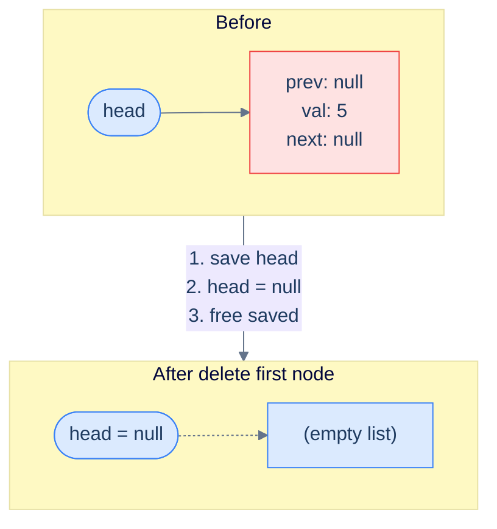

<p align="center"><strong>Single-node list — the lone node is both head and tail. After deletion, the list is empty and <code>head</code> becomes <code>null</code>.</strong></p>

> **Algorithm**
>
> -   **Step 1:** Delete the head node to free up memory.
> -   **Step 2:** Return `null` as the list is now empty.

## 3. The list has more than one node

This is the general case. We *save the old head* in a temporary, slide `head` forward to the second node, snip the bidirectional link by clearing the new head's `prev` to `null`, and only **then** free the saved old head. The save-before-clobber pattern from insertion appears here in a slightly different form: **save the doomed node *before* you reroute pointers around it**, because once `head` moves, the old node may have no other live reference and you'll never reach it again.

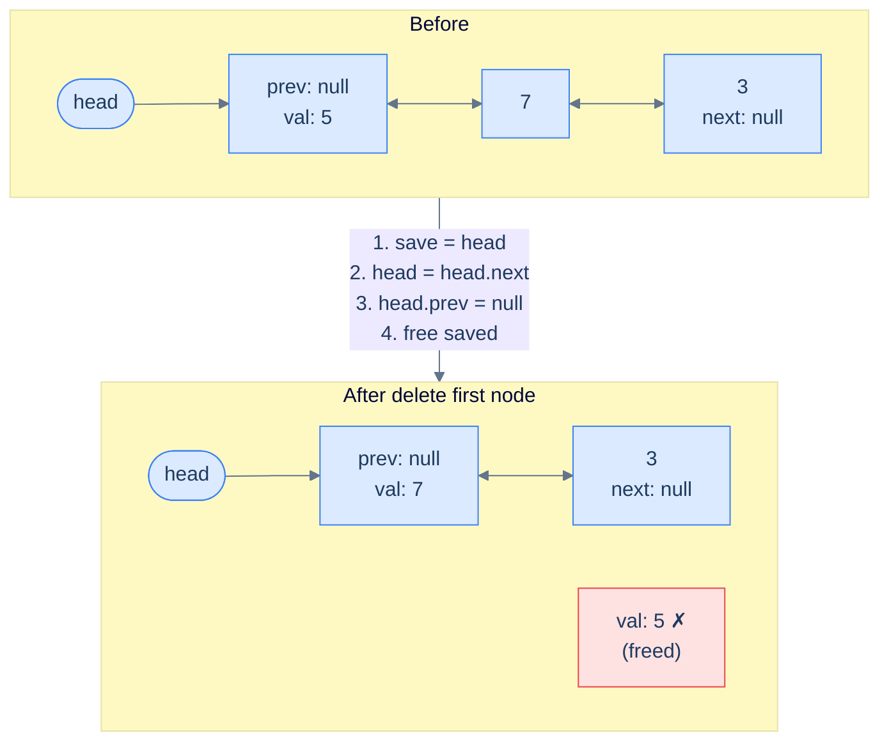

<p align="center"><strong>Multi-node deletion at the front — three pointer touches plus a free. The new head's <code>prev</code> must be cleared to <code>null</code>, restoring the "I have no predecessor" invariant.</strong></p>

> **Algorithm**
>
> -   **Step 1:** Create a temporary pointer to store the current head node.
> -   **Step 2:** Move the head pointer to the next node.
> -   **Step 3:** Set the `prev` pointer of the new head node to `null`.
> -   **Step 4:** Delete the original head node to free up memory.
> -   **Step 5:** Return the new head node.

## Implementation

When implementing the logic for deleting the first node, we consider all three cases and write the code for each in conditional blocks.


```pseudocode
function deleteFirstNode(head):
    if head is null: return null                       # empty list
    if head.next is null: return null                  # single node — list becomes empty
    head ← head.next                                   # slide head forward
    head.prev ← null                                   # new head has no predecessor
    return head
```

```python run
class Solution:
    def delete_first_node(self, head):
        if head is None:                       # Case 1: empty list
            return None
        if head.next is None:                  # Case 2: single node
            return None                        #   Drop the only reference — list is empty
        node_to_delete = head                  # Save before clobber
        head           = head.next             # Slide the head forward
        head.prev      = None                  # New head has no predecessor
        del node_to_delete                     # Free the old head (Python GC will reclaim)
        return head
```

```java run
class Solution {
    public ListNode deleteFirstNode(ListNode head) {
        if (head == null)        return null;          // Case 1: empty
        if (head.next == null)   return null;          // Case 2: single node
        ListNode nodeToDelete = head;                  // Save before clobber
        head        = head.next;                       // Slide forward
        head.prev   = null;                            // New head has no predecessor
        nodeToDelete = null;                           // Drop reference for GC
        return head;
    }
}
```

```c run
ListNode* deleteFirstNode(ListNode *head) {
    if (head == NULL)         return NULL;            /* Case 1: empty */
    if (head->next == NULL) {                         /* Case 2: single node */
        free(head);
        return NULL;
    }
    ListNode *nodeToDelete = head;                    /* Save before clobber */
    head        = head->next;                         /* Slide forward */
    head->prev  = NULL;                               /* New head has no predecessor */
    free(nodeToDelete);                               /* Free the old head */
    return head;
}
```

```scala run
class Solution {
  def deleteFirstNode(head: ListNode): ListNode = {
    if (head == null)        return null               // Case 1: empty
    if (head.next == null)   return null               // Case 2: single node
    var nodeToDelete = head                            // Save before clobber
    val newHead      = head.next
    newHead.prev     = null                            // No predecessor
    nodeToDelete     = null                            // Drop ref
    newHead
  }
}
```


## Complexity Analysis

We touch a constant number of pointers regardless of list length, and we never traverse. Both time and space are O(1).

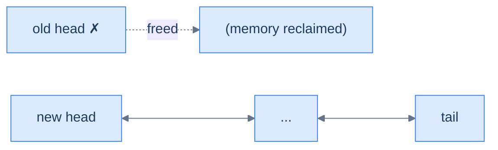

<p align="center"><strong>All cases — delete the first node touches a constant number of pointers (free old head, slide head forward, clear new head's <code>prev</code>). No traversal.</strong></p>

> **Best Case**
>
> -   Space Complexity — **O(1)**
> -   Time Complexity — **O(1)**
>
> **Worst Case**
>
> -   Space Complexity — **O(1)**
> -   Time Complexity — **O(1)**

***

# Delete first node

## The Problem

> Given the **head** of a doubly linked list, write a function to delete the first node from this list and return the head of the updated list.

```
Input:  head = [5, 7, 3, 10]
Output: [7, 3, 10]
```

## The Solution


```pseudocode
function deleteFirstNode(head):
    if head is null: return null
    if head.next is null: return null                  # single-node list
    head ← head.next
    head.prev ← null
    return head
```

```python run
class Solution:
    def delete_first_node(self, head):
        if head is None:                  # Empty list
            return None
        if head.next is None:             # Single-node list
            return None
        head      = head.next             # Slide the head forward
        head.prev = None                  # New head has no predecessor
        return head
```

```java run
class Solution {
    public ListNode deleteFirstNode(ListNode head) {
        if (head == null)       return null;
        if (head.next == null)  return null;
        head      = head.next;
        head.prev = null;
        return head;
    }
}
```

```c run
ListNode* deleteFirstNode(ListNode *head) {
    if (head == NULL)        return NULL;
    if (head->next == NULL) { free(head); return NULL; }
    ListNode *old = head;
    head        = head->next;
    head->prev  = NULL;
    free(old);
    return head;
}
```

```scala run
class Solution {
  def deleteFirstNode(head: ListNode): ListNode = {
    if (head == null)       return null
    if (head.next == null)  return null
    val newHead = head.next
    newHead.prev = null
    newHead
  }
}
```


<details>
<summary><strong>Trace — head = [5, 7, 3, 10]</strong></summary>

```
Initial │ head → 5 ↔ 7 ↔ 3 ↔ 10
Step 1  │ head is not null, head.next is not null → general case
Step 2  │ save old head (node 5)
Step 3  │ head = head.next                  │ head → 7 ↔ 3 ↔ 10  (but 7.prev still → 5)
Step 4  │ head.prev = null                  │ head → 7 ↔ 3 ↔ 10  (clean break)
Step 5  │ free old head (node 5)
Result: [7, 3, 10] ✓
```

The key invariant: clear `head.prev = null` *before* freeing, so the new head's "I'm now the front" claim is honest in both directions.

</details>

***

# Understanding deletion of last node

Deleting the last node is the perfect mirror of deleting the first — we already keep an explicit `tail` reference, so the predecessor is one `prev` hop away. No traversal, no scanning. The cases are identical in shape; only the words `head ↔ tail` and `next ↔ prev` flip.

## 1. The list is empty

`tail` is `null`, so there is nothing to delete. Return `null`.

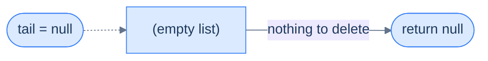

<p align="center"><strong>Empty list — return <code>null</code> immediately, no work to do.</strong></p>

> **Algorithm**
>
> -   **Step 1:** Return the original tail node.

## 2. The list has only one node

The one node is both head and tail. Deleting it empties the list. Save the reference, set `tail` to `null`, and free.

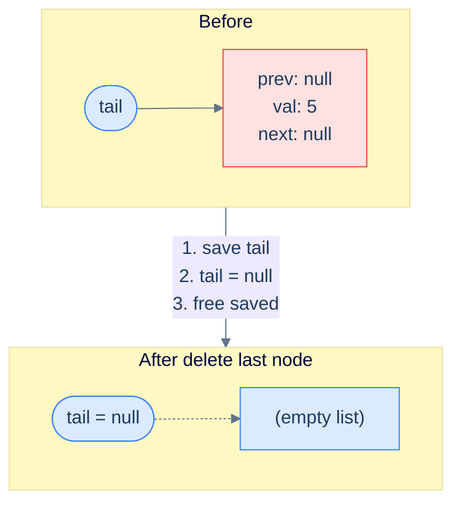

<p align="center"><strong>Single-node list — the lone node disappears and <code>tail</code> becomes <code>null</code>.</strong></p>

> **Algorithm**
>
> -   **Step 1:** Delete the tail node to free up memory.
> -   **Step 2:** Return `null` as the list is now empty.

## 3. The list has more than one node

Save the doomed tail, slide `tail` backward via its `prev` pointer (this is where the doubly linked list earns its keep — *no scan from head needed*), set the new tail's `next` to `null`, and free the saved old tail.

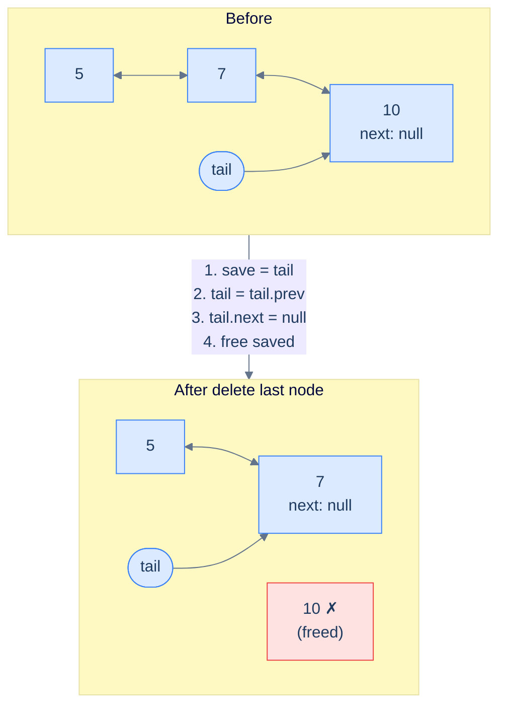

<p align="center"><strong>Multi-node deletion at the back — three pointer touches plus a free. The <code>prev</code> pointer is what makes this O(1) — a singly linked list cannot do this without an O(N) walk.</strong></p>

> **Algorithm**
>
> -   **Step 1:** Create a temporary pointer to store the current tail node.
> -   **Step 2:** Move the tail pointer to the previous node.
> -   **Step 3:** Set the `next` pointer of the new tail node to `null`.
> -   **Step 4:** Delete the original tail node to free up memory.
> -   **Step 5:** Return the new tail node.

## Implementation


```pseudocode
# DLL's payoff — backward slide via tail.prev is O(1) (no traversal needed).
function deleteLastNode(tail):
    if tail is null: return null
    if tail.prev is null: return null                  # single-node list
    tail ← tail.prev                                   # slide backward
    tail.next ← null                                   # new tail has no successor
    return tail
```

```python run
class Solution:
    def delete_last_node(self, tail):
        if tail is None:                       # Case 1: empty list
            return None
        if tail.prev is None:                  # Case 2: single node
            return None
        node_to_delete = tail                  # Save before clobber
        tail           = tail.prev             # Slide tail backward via prev (O(1)!)
        tail.next      = None                  # New tail has no successor
        del node_to_delete
        return tail
```

```java run
class Solution {
    public ListNode deleteLastNode(ListNode tail) {
        if (tail == null)        return null;          // Case 1: empty
        if (tail.prev == null)   return null;          // Case 2: single node
        ListNode nodeToDelete = tail;                  // Save before clobber
        tail        = tail.prev;                       // Slide backward via prev (O(1)!)
        tail.next   = null;                            // New tail has no successor
        nodeToDelete = null;
        return tail;
    }
}
```

```c run
ListNode* deleteLastNode(ListNode *tail) {
    if (tail == NULL)         return NULL;
    if (tail->prev == NULL) { free(tail); return NULL; }
    ListNode *old = tail;
    tail        = tail->prev;                          /* Slide backward via prev (O(1)!) */
    tail->next  = NULL;                                /* New tail has no successor */
    free(old);
    return tail;
}
```

```scala run
class Solution {
  def deleteLastNode(tail: ListNode): ListNode = {
    if (tail == null)       return null
    if (tail.prev == null)  return null
    val newTail = tail.prev
    newTail.next = null
    newTail
  }
}
```


## Complexity Analysis

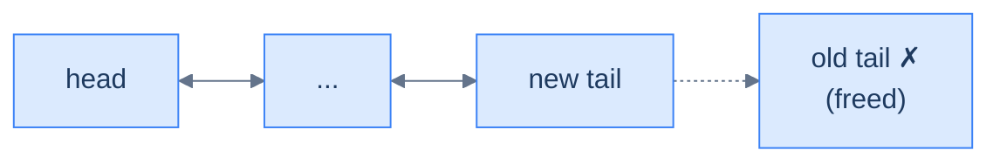

<p align="center"><strong>All cases — delete the last node touches a constant number of pointers. The <code>prev</code> pointer eliminates the O(N) walk a singly linked list would require.</strong></p>

> **Best Case**
>
> -   Space Complexity — **O(1)**
> -   Time Complexity — **O(1)**
>
> **Worst Case**
>
> -   Space Complexity — **O(1)**
> -   Time Complexity — **O(1)**

***

# Delete last node

## The Problem

> Given the **tail** of a doubly linked list, write a function to delete the last node from this linked list and return the tail of the updated list.

```
Input:  tail = node(10) of [5, 7, 3, 10]
Output: [5, 7, 3]
```

## The Solution


```pseudocode
function deleteLastNode(tail):
    if tail is null: return null
    if tail.prev is null: return null
    tail ← tail.prev
    tail.next ← null
    return tail
```

```python run
class Solution:
    def delete_last_node(self, tail):
        if tail is None:                  # Empty list
            return None
        if tail.prev is None:             # Single-node list
            return None
        tail      = tail.prev             # Slide tail backward (O(1) via prev)
        tail.next = None                  # New tail has no successor
        return tail
```

```java run
class Solution {
    public ListNode deleteLastNode(ListNode tail) {
        if (tail == null)        return null;
        if (tail.prev == null)   return null;
        tail      = tail.prev;
        tail.next = null;
        return tail;
    }
}
```

```c run
ListNode* deleteLastNode(ListNode *tail) {
    if (tail == NULL)         return NULL;
    if (tail->prev == NULL) { free(tail); return NULL; }
    ListNode *old = tail;
    tail        = tail->prev;
    tail->next  = NULL;
    free(old);
    return tail;
}
```

```scala run
class Solution {
  def deleteLastNode(tail: ListNode): ListNode = {
    if (tail == null)       return null
    if (tail.prev == null)  return null
    val newTail = tail.prev
    newTail.next = null
    newTail
  }
}
```


<details>
<summary><strong>Trace — tail = node(10) of [5, 7, 3, 10]</strong></summary>

```
Initial │ 5 ↔ 7 ↔ 3 ↔ 10  ;  tail = node(10)
Step 1  │ tail.prev = node(3) is not null → general case
Step 2  │ tail = tail.prev                  │ tail → 3, but 3.next still → 10
Step 3  │ tail.next = null                  │ 5 ↔ 7 ↔ 3   (clean break)
Step 4  │ free old tail (node 10)
Result: [5, 7, 3] ✓
```

Notice we never touched the head — and we never traversed. The doubly linked list's `prev` pointer collapses what would have been an O(N) operation in a singly linked list down to a constant-time tweak.

</details>

***

# Understanding deletion by given data

Deleting a node by its value combines what we already know: a linear search to locate the node, followed by a constant-time splice to remove it. Four cases cover every possibility, and each one degenerates to something we already understand.

## 1. The list is empty

Nothing to search, nothing to delete. Return the (null) head.


<p align="center"><strong>Empty list — no node to compare against, return immediately.</strong></p>

> **Algorithm**
>
> -   **Step 1:** Return the original head node.

## 2. The first node matches

If the head's value matches the target, the operation degenerates to **delete the first node**. Slide `head` forward, clear the new head's `prev`, and free the old head.

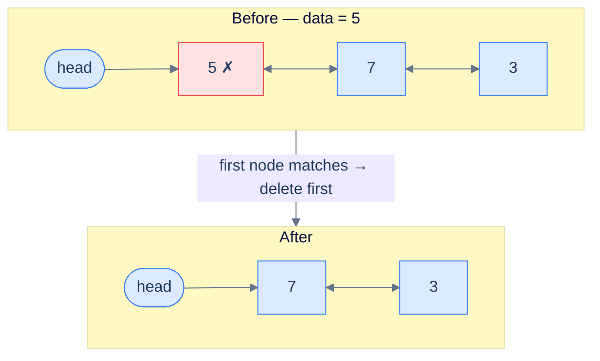

<p align="center"><strong>Head match — same as "delete first node". The new head's <code>prev</code> must be set to <code>null</code>.</strong></p>

> **Algorithm**
>
> -   **Step 1:** Create a temporary pointer to store the current head node.
> -   **Step 2:** Move the head pointer to the next node.
> -   **Step 3:** Set the `prev` pointer of the new head node to `null`.
> -   **Step 4:** Delete the original head node to free up memory.
> -   **Step 5:** Return the new head node.

## 3. The matching node is in the middle (or at the tail)

Walk forward from the second node, comparing values, until you find a match. The matching node has both a predecessor (`current.prev`) and a successor (`current.next`, which may be `null` if the match is the tail). Splice it out by routing the predecessor's `next` to the successor and the successor's `prev` to the predecessor — guarding the second update with a null check, because the matching node may be the tail.

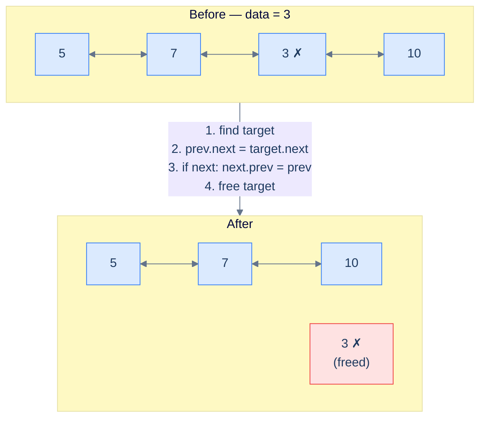

<p align="center"><strong>Mid-list match — the predecessor is reachable in O(1) via <code>target.prev</code>, and we splice both directions in two pointer writes plus a free.</strong></p>

> **Algorithm**
>
> -   **Step 1:** Traverse the list, keeping track of the `current` node, until reaching the node whose value equals the given data.
> -   **Step 2:** Set the `next` pointer of the node before the `current` node to hold the reference of the node after the `current` node.
> -   **Step 3:** Set the `prev` pointer of the node after the `current` node (if it exists) to hold the reference of the node before the `current` node.
> -   **Step 4:** Delete the `current` node to free up memory.
> -   **Step 5:** Return the original head node.

## 4. The data is not found

If the walk falls off the end (`current` becomes `null`) without ever matching, the value is not in the list. Return the head unchanged.

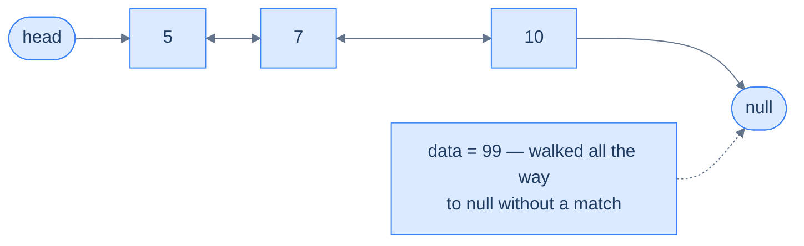

<p align="center"><strong>No match — fall off the end and return the original head untouched.</strong></p>

> **Algorithm**
>
> -   **Step 1:** Traverse the list, keeping track of the `current` node, until `current` becomes `null`.
> -   **Step 2:** Return the original head node.

## Implementation


```pseudocode
function deleteNodeWithGivenData(head, data):
    if head is null: return null
    if head.val = data:                                # head matches
        head ← head.next
        if head is not null:
            head.prev ← null                           # new head has no predecessor
        return head

    current ← head.next                                # skip head — already checked
    while current is not null AND current.val ≠ data:
        current ← current.next
    if current is null: return head                    # not found

    # Splice `current` out — both directions thanks to prev pointer.
    current.prev.next ← current.next
    if current.next is not null:                       # current may be the tail
        current.next.prev ← current.prev
    return head
```

```python run
class Solution:
    def delete_node_with_given_data(self, head, data):
        if head is None:                          # Case 1: empty
            return None
        if head.val == data:                      # Case 2: head matches
            node_to_delete = head
            head           = head.next
            if head is not None:
                head.prev = None                  # New head loses its predecessor
            del node_to_delete
            return head
        current = head.next                       # Skip head — already checked
        while current is not None and current.val != data:
            current = current.next
        if current is None:                       # Case 4: not found
            return head
        # Case 3: splice current out
        current.prev.next = current.next          # Predecessor skips over current
        if current.next is not None:              # Conditional — current may be the tail
            current.next.prev = current.prev      # Successor's back-link skips current
        del current
        return head
```

```java run
class Solution {
    public ListNode deleteNodeWithGivenData(ListNode head, int data) {
        if (head == null) return null;
        if (head.val == data) {                          // Case 2: head matches
            ListNode old = head;
            head = head.next;
            if (head != null) head.prev = null;
            old = null;
            return head;
        }
        ListNode current = head.next;
        while (current != null && current.val != data) {
            current = current.next;
        }
        if (current == null) return head;                // Case 4: not found
        current.prev.next = current.next;                // Splice forward
        if (current.next != null) {                      // Splice backward (guarded)
            current.next.prev = current.prev;
        }
        current = null;
        return head;
    }
}
```

```c run
ListNode* deleteNodeWithGivenData(ListNode *head, int data) {
    if (head == NULL) return NULL;
    if (head->val == data) {                              /* Case 2: head matches */
        ListNode *old = head;
        head = head->next;
        if (head != NULL) head->prev = NULL;
        free(old);
        return head;
    }
    ListNode *current = head->next;
    while (current != NULL && current->val != data) {
        current = current->next;
    }
    if (current == NULL) return head;                     /* Case 4: not found */
    current->prev->next = current->next;
    if (current->next != NULL) {
        current->next->prev = current->prev;
    }
    free(current);
    return head;
}
```

```scala run
class Solution {
  def deleteNodeWithGivenData(head: ListNode, data: Int): ListNode = {
    if (head == null) return null
    if (head.v == data) {
      val newHead = head.next
      if (newHead != null) newHead.prev = null
      return newHead
    }
    var current = head.next
    while (current != null && current.v != data) current = current.next
    if (current == null) return head
    current.prev.next = current.next
    if (current.next != null) current.next.prev = current.prev
    head
  }
}
```


> *Before reading on — what would happen if we removed the `if (current.next != null)` guard? Trace it on `[5, 7, 3]` with `data = 3`.*
>
> `current` would land on the tail (node 3). `current.next` is `null`, and dereferencing `current.next.prev` would crash. The guard exists because the matching node may be the tail, in which case there is no successor whose `prev` needs updating.

## Complexity Analysis

Time depends on where the match lives. If the head matches, we're done in O(1). If the match sits at the tail (or the value is absent), we walked the whole list — O(N).

### Best case

The match is at the head. Constant time.

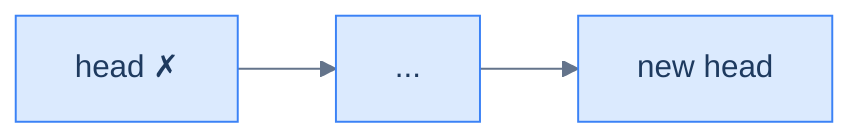

<p align="center"><strong>Best case — head matches, no traversal needed.</strong></p>

### Worst case

The match is at the tail (or absent). Linear time.

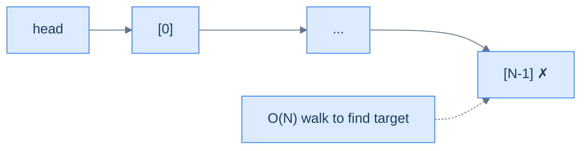

<p align="center"><strong>Worst case — value lives at the tail (or doesn't exist), forcing a full O(N) traversal.</strong></p>

> **Best Case** — match is the first node
>
> -   Space Complexity — **O(1)**
> -   Time Complexity — **O(1)**
>
> **Worst Case** — match is at the tail, or absent
>
> -   Space Complexity — **O(1)**
> -   Time Complexity — **O(N)**

***

# Delete node with given data

## The Problem

> Given the **head** of a doubly linked list and a **data** value, write a function to delete the first node with the given data from the list and return the head of the updated list.

```
Input:  head = [5, 7, 3, 10], data = 3
Output: [5, 7, 10]
```

## The Solution


```pseudocode
function deleteNodeWithGivenData(head, data):
    if head is null: return null
    if head.val = data:
        head ← head.next
        if head is not null: head.prev ← null
        return head
    current ← head.next
    while current is not null AND current.val ≠ data:
        current ← current.next
    if current is null: return head
    current.prev.next ← current.next
    if current.next is not null:
        current.next.prev ← current.prev
    return head
```

```python run
class Solution:
    def delete_node_with_given_data(self, head, data):
        if head is None:
            return None
        if head.val == data:                      # Head match shortcut
            head = head.next
            if head is not None:
                head.prev = None
            return head
        current = head.next
        while current is not None and current.val != data:
            current = current.next
        if current is None:                       # Not found
            return head
        current.prev.next = current.next          # Splice forward
        if current.next is not None:
            current.next.prev = current.prev      # Splice backward (guarded)
        return head
```

```java run
class Solution {
    public ListNode deleteNodeWithGivenData(ListNode head, int data) {
        if (head == null) return null;
        if (head.val == data) {
            head = head.next;
            if (head != null) head.prev = null;
            return head;
        }
        ListNode current = head.next;
        while (current != null && current.val != data) current = current.next;
        if (current == null) return head;
        current.prev.next = current.next;
        if (current.next != null) current.next.prev = current.prev;
        return head;
    }
}
```

```c run
ListNode* deleteNodeWithGivenData(ListNode *head, int data) {
    if (head == NULL) return NULL;
    if (head->val == data) {
        ListNode *old = head;
        head = head->next;
        if (head != NULL) head->prev = NULL;
        free(old);
        return head;
    }
    ListNode *current = head->next;
    while (current != NULL && current->val != data) current = current->next;
    if (current == NULL) return head;
    current->prev->next = current->next;
    if (current->next != NULL) current->next->prev = current->prev;
    free(current);
    return head;
}
```

```scala run
class Solution {
  def deleteNodeWithGivenData(head: ListNode, data: Int): ListNode = {
    if (head == null) return null
    if (head.v == data) {
      val newHead = head.next
      if (newHead != null) newHead.prev = null
      return newHead
    }
    var current = head.next
    while (current != null && current.v != data) current = current.next
    if (current == null) return head
    current.prev.next = current.next
    if (current.next != null) current.next.prev = current.prev
    head
  }
}
```


<details>
<summary><strong>Trace — head = [5, 7, 3, 10], data = 3</strong></summary>

```
Initial │ 5 ↔ 7 ↔ 3 ↔ 10
Step 1  │ head.val = 5 ≠ 3 → not the head case
Step 2  │ current = node(7); 7 ≠ 3 → advance
Step 3  │ current = node(3); 3 == 3 ✓ → splice
Step 4  │ current.prev.next = current.next     │ 7.next = node(10)
Step 5  │ current.next != null → splice back  │ 10.prev = node(7)
Step 6  │ free node(3)
Result: [5, 7, 10] ✓
```

</details>

***

# Delete nodes with given data

## The Problem

> Given the **head** of a doubly linked list and a **data** value, write a function to delete **all** the nodes with the given data from the list and return the head of the updated list.

```
Input:  head = [5, 7, 3, 10, 3], data = 3
Output: [5, 7, 10]
```

This is the *plural* sibling of the previous problem. The trick is two-phase: first peel off any matching nodes from the front (the head can match repeatedly — `[3, 3, 3, 5]` with `data = 3` should leave `[5]`), then walk the rest with two pointers (`previous` and `current`), splicing out each match in O(1) per match.

## The Solution


```pseudocode
# Two-phase. Phase 1: peel matches from the front. Phase 2: skip matching runs in the interior.
function deleteNodesWithGivenData(head, data):
    while head is not null AND head.val = data:        # phase 1
        head ← head.next
        if head is not null: head.prev ← null
    if head is null: return null

    previous ← head
    current ← head.next
    while current is not null:
        while current is not null AND current.val = data:
            current ← current.next                     # skip a run of matches
        previous.next ← current                        # bridge over the deleted run
        if current is not null:
            current.prev ← previous                    # mirror the back-link
            previous ← current
            current ← current.next
    return head
```

```python run
class Solution:
    def delete_nodes_with_given_data(self, head, data):
        # Phase 1: peel matches off the front
        while head is not None and head.val == data:
            head = head.next
            if head is not None:
                head.prev = None
        if head is None:                              # All nodes matched
            return None
        # Phase 2: scan the rest with previous/current
        previous = head                               # Last known good node
        current  = head.next
        while current is not None:
            # Inner loop: skip a run of matches
            while current is not None and current.val == data:
                current = current.next                # Advance past the matching run
            # Splice previous → current (jumping over any deleted run)
            previous.next = current
            if current is not None:
                current.prev = previous               # Mirror update
                previous = current                    # previous catches up
                current  = current.next               # advance past the kept node
        return head
```

```java run
class Solution {
    public ListNode deleteNodesWithGivenData(ListNode head, int data) {
        while (head != null && head.val == data) {
            head = head.next;
            if (head != null) head.prev = null;
        }
        if (head == null) return null;
        ListNode previous = head;
        ListNode current  = head.next;
        while (current != null) {
            while (current != null && current.val == data) current = current.next;
            previous.next = current;
            if (current != null) {
                current.prev = previous;
                previous = current;
                current  = current.next;
            }
        }
        return head;
    }
}
```

```c run
ListNode* deleteNodesWithGivenData(ListNode *head, int data) {
    while (head != NULL && head->val == data) {
        ListNode *old = head;
        head = head->next;
        if (head != NULL) head->prev = NULL;
        free(old);
    }
    if (head == NULL) return NULL;
    ListNode *previous = head;
    ListNode *current  = head->next;
    while (current != NULL) {
        while (current != NULL && current->val == data) {
            ListNode *old = current;
            current = current->next;
            free(old);
        }
        previous->next = current;
        if (current != NULL) {
            current->prev = previous;
            previous = current;
            current  = current->next;
        }
    }
    return head;
}
```

```scala run
class Solution {
  def deleteNodesWithGivenData(head: ListNode, data: Int): ListNode = {
    var h = head
    while (h != null && h.v == data) {
      h = h.next
      if (h != null) h.prev = null
    }
    if (h == null) return null
    var previous = h
    var current  = h.next
    while (current != null) {
      while (current != null && current.v == data) current = current.next
      previous.next = current
      if (current != null) {
        current.prev = previous
        previous = current
        current  = current.next
      }
    }
    h
  }
}
```


<details>
<summary><strong>Trace — head = [5, 7, 3, 10, 3], data = 3</strong></summary>

```
Initial │ 5 ↔ 7 ↔ 3 ↔ 10 ↔ 3
Phase 1 │ head.val = 5 ≠ 3 → no front matches
Phase 2 │ previous = node(5), current = node(7)
        │ 7 ≠ 3 → previous.next = node(7); previous = 7; current = 3
        │ inner: 3 == 3 → current = node(10)
        │ previous.next = 10; 10.prev = 7; previous = 10; current = 3
        │ inner: 3 == 3 → current = null
        │ previous.next = null   (tail terminator restored)
Result: [5, 7, 10] ✓
```

The two-phase split is what keeps the head case clean — the head can match repeatedly, but every other matching run sits between two well-defined neighbours.

</details>

***

# Understanding deletion after the given node

This case is similar to its singly-linked counterpart, with one extra step: after we splice out the node *after* the given one, we must update the **back-pointer** of the new successor — otherwise the backward chain breaks. Three cases.

## 1. The list is empty

No list, no anchor. Return `null`.


<p align="center"><strong>Empty list — no anchor for the operation.</strong></p>

> **Algorithm**
>
> -   **Step 1:** Return the original head node.

## 2. The given node is the last node

The given node has no successor — there's nothing *after* it to delete. Return the head unchanged.


<p align="center"><strong>Given node is the tail — there is no successor, so the operation is a no-op.</strong></p>

> **Algorithm**
>
> -   **Step 1:** Return the original head node.

## 3. The given node is not the last node

Save `target = given.next`, then route `given.next` past it to `target.next`. If `target.next` exists (i.e. the deleted node was not itself the tail), update its `prev` back to `given`. Then free `target`.

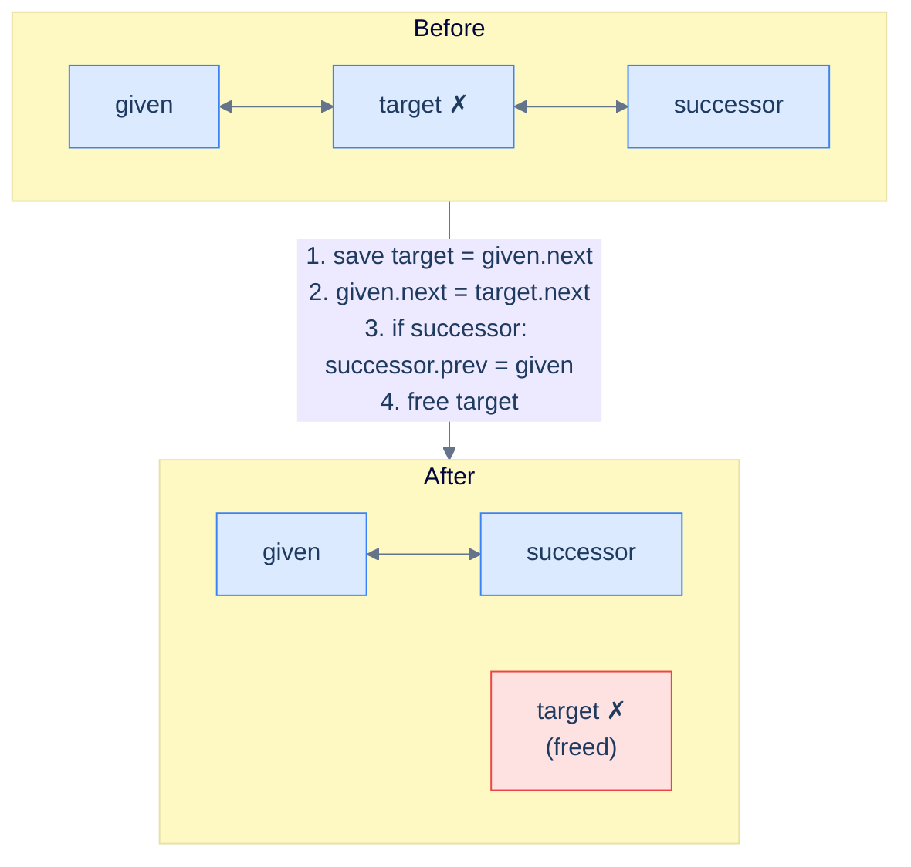

<p align="center"><strong>Splice out the node after the given one — three pointer touches plus a free, with the mirror update guarded against the case where the deleted node was the tail.</strong></p>

> **Algorithm**
>
> -   **Step 1:** Create a temporary pointer to store the reference of the node after the `given` node.
> -   **Step 2:** Set the `given` node's `next` pointer to hold the reference of the node stored in the `next` pointer of the node after the `given` node.
> -   **Step 3:** Set the `prev` pointer of the node after the deleted node (if it exists) to hold the reference of the `given` node.
> -   **Step 4:** Delete the node after the given node to free up memory.
> -   **Step 5:** Return the original head node.

## Implementation


```pseudocode
function deleteNodeAfterTheGivenNode(head, node):
    if head is null: return null
    if node is null OR node.next is null: return head    # nothing after given
    target ← node.next
    node.next ← target.next                              # bridge given → grand-successor
    if target.next is not null:
        target.next.prev ← node                          # mirror
    return head
```

```python run
class Solution:
    def delete_node_after_the_given_node(self, head, node):
        if head is None:                              # Case 1: empty
            return None
        if node is None or node.next is None:         # Case 2: nothing after given
            return head
        target = node.next                            # Save the doomed node
        node.next = target.next                       # Reroute given.next past target
        if target.next is not None:                   # If target was not the tail
            target.next.prev = node                   #   mirror — successor's back-link
        del target
        return head
```

```java run
class Solution {
    public ListNode deleteNodeAfterTheGivenNode(ListNode head, ListNode node) {
        if (head == null) return null;
        if (node == null || node.next == null) return head;     // Cases 1 & 2
        ListNode target = node.next;                            // Save before clobber
        node.next = target.next;                                // Reroute past target
        if (target.next != null) {                              // Mirror (guarded)
            target.next.prev = node;
        }
        target = null;
        return head;
    }
}
```

```c run
ListNode* deleteNodeAfterTheGivenNode(ListNode *head, ListNode *node) {
    if (head == NULL) return NULL;
    if (node == NULL || node->next == NULL) return head;
    ListNode *target = node->next;
    node->next = target->next;
    if (target->next != NULL) target->next->prev = node;
    free(target);
    return head;
}
```

```scala run
class Solution {
  def deleteNodeAfterTheGivenNode(head: ListNode, node: ListNode): ListNode = {
    if (head == null) return null
    if (node == null || node.next == null) return head
    val target = node.next
    node.next = target.next
    if (target.next != null) target.next.prev = node
    head
  }
}
```


## Complexity Analysis

We touch a constant number of pointers and never traverse. Both time and space are O(1).

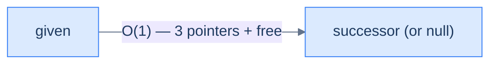

<p align="center"><strong>All cases — delete after the given node touches at most three pointers and one free, regardless of list size.</strong></p>

> **Best Case**
>
> -   Space Complexity — **O(1)**
> -   Time Complexity — **O(1)**
>
> **Worst Case**
>
> -   Space Complexity — **O(1)**
> -   Time Complexity — **O(1)**

***

# Delete node after the given node

## The Problem

> Given the **head** of a doubly linked list and a reference to a **random node** in the list, write a function to delete the node after the given node and return the head of the updated list.

```
Input:  head = [5, 7, 3, 10], node = node(7)
Output: [5, 7, 10]
```

## The Solution


```pseudocode
# Compact form — same algorithm.
function deleteNodeAfterTheGivenNode(head, node):
    if head is null: return null
    if node is null OR node.next is null: return head
    target ← node.next
    node.next ← target.next
    if target.next is not null:
        target.next.prev ← node
    return head
```

```python run
class Solution:
    def delete_node_after_the_given_node(self, head, node):
        if head is None: return None
        if node is None or node.next is None: return head
        target    = node.next                          # Save before clobber
        node.next = target.next                        # Reroute past target
        if target.next is not None:                    # Guarded mirror update
            target.next.prev = node
        return head
```

```java run
class Solution {
    public ListNode deleteNodeAfterTheGivenNode(ListNode head, ListNode node) {
        if (head == null) return null;
        if (node == null || node.next == null) return head;
        ListNode target = node.next;
        node.next = target.next;
        if (target.next != null) target.next.prev = node;
        return head;
    }
}
```

```c run
ListNode* deleteNodeAfterTheGivenNode(ListNode *head, ListNode *node) {
    if (head == NULL) return NULL;
    if (node == NULL || node->next == NULL) return head;
    ListNode *target = node->next;
    node->next = target->next;
    if (target->next != NULL) target->next->prev = node;
    free(target);
    return head;
}
```

```scala run
class Solution {
  def deleteNodeAfterTheGivenNode(head: ListNode, node: ListNode): ListNode = {
    if (head == null) return null
    if (node == null || node.next == null) return head
    val target = node.next
    node.next = target.next
    if (target.next != null) target.next.prev = node
    head
  }
}
```


<details>
<summary><strong>Trace — head = [5, 7, 3, 10], node = node(7)</strong></summary>

```
Initial │ 5 ↔ 7 ↔ 3 ↔ 10
Step 1  │ target = node(7).next = node(3)        (save before clobber)
Step 2  │ node(7).next = target.next = node(10)  │ 5 ↔ 7 → 10
Step 3  │ target.next != null → 10.prev = node(7)│ 5 ↔ 7 ↔ 10  (mirror complete)
Step 4  │ free node(3)
Result: [5, 7, 10] ✓
```

</details>

***

# Understanding deletion before a given node

This is one of the operations that gives a doubly linked list a real edge over a singly linked one. In a singly linked list, "delete before X" needs us to track a `previousToPrevious` pointer all the way from the head — there's no other way to find the node *two steps* before X. In a doubly linked list, both candidates we need are within one hop: `node.prev` is the doomed node, and `node.prev.prev` is the predecessor's predecessor whose `next` we have to reroute. Four cases.

## 1. The list is empty (or given is null)

No anchor exists. Return the head unchanged.

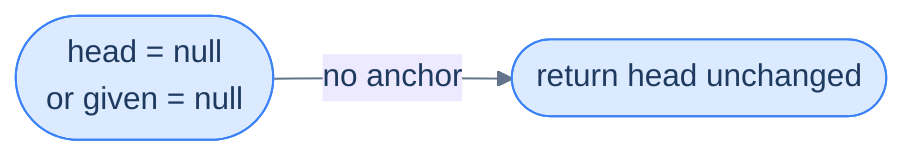

<p align="center"><strong>Empty list or null reference — no anchor exists, return early.</strong></p>

> **Algorithm**
>
> -   **Step 1:** Return the original head node.

## 2. The given node is the head

The head has no predecessor — there is nothing *before* it to delete. Return the head unchanged.


<p align="center"><strong>Given is the head — no predecessor exists, the operation is a no-op.</strong></p>

> **Algorithm**
>
> -   **Step 1:** Return the original head node.

## 3. The given node is the second node

The node before the second node *is* the head. Deleting it means a new head emerges — the given node itself becomes the head. This is functionally **delete the first node**.

```mermaid
---
config:
  theme: base
  themeVariables:
    primaryColor: "#dbeafe"
    primaryBorderColor: "#3b82f6"
    primaryTextColor: "#1e3a5f"
    lineColor: "#64748b"
    secondaryColor: "#ede9fe"
    tertiaryColor: "#fef9c3"
---
flowchart TB
    subgraph BEFORE["Before"]
        direction LR
        BH(["head"]) --> H1["5 ✗"] <--> G["given (7)"] <--> H3["3"]
    end
    subgraph AFTER["After"]
        direction LR
        AH(["head"]) --> AG["given (7)"] <--> N3["3"]
        GONE["5 ✗<br/>(freed)"]
    end
    BEFORE -->|"delete-first-node + update head reference"| AFTER
    style GONE fill:#fee2e2,stroke:#ef4444
```

<p align="center"><strong>Given is the second node — the predecessor is the head. Deleting it promotes the given node to head.</strong></p>

> **Algorithm**
>
> -   **Step 1:** Create a temporary pointer to store the current head node.
> -   **Step 2:** Move the head pointer to the next node (which is the given node).
> -   **Step 3:** Set the `prev` pointer of the new head node to `null`.
> -   **Step 4:** Delete the original head node to free up memory.
> -   **Step 5:** Return the new head node.

## 4. The given node is any other node

The doomed node is `target = given.prev`, and its predecessor is `target.prev` (= `given.prev.prev`). Both are O(1) hops away. Reroute `given.prev = target.prev`, route `target.prev.next = given`, and free `target`.

```mermaid
---
config:
  theme: base
  themeVariables:
    primaryColor: "#dbeafe"
    primaryBorderColor: "#3b82f6"
    primaryTextColor: "#1e3a5f"
    lineColor: "#64748b"
    secondaryColor: "#ede9fe"
    tertiaryColor: "#fef9c3"
---
flowchart TB
    subgraph BEFORE["Before"]
        direction LR
        PP["pre-predecessor<br/>(= given.prev.prev)"] <--> BT["target ✗<br/>(= given.prev)"] <--> BG["given"]
    end
    subgraph AFTER["After"]
        direction LR
        AP["pre-predecessor"] <--> AG["given"]
        GONE["target ✗<br/>(freed)"]
    end
    BEFORE -->|"1. save target = given.prev<br/>2. given.prev = target.prev<br/>3. if pre-pre: pre-pre.next = given<br/>4. free target"| AFTER
    style GONE fill:#fee2e2,stroke:#ef4444
```

<p align="center"><strong>Given is mid-list — splice the predecessor out by routing <code>given.prev</code> to <code>given.prev.prev</code> and the pre-predecessor's <code>next</code> to <code>given</code>. Both hops are O(1).</strong></p>

> **Algorithm**
>
> -   **Step 1:** Create a temporary pointer to store the reference of the node before the `given` node.
> -   **Step 2:** Set the given node's `prev` pointer to hold the reference of the node before the node to be deleted.
> -   **Step 3:** Set the `next` pointer of the node before the to-be-deleted node (if it exists) to hold the reference of the `given` node.
> -   **Step 4:** Delete the node before the `given` node to free up memory.
> -   **Step 5:** Return the original head node.

## Implementation


```pseudocode
# In a DLL, the predecessor is `node.prev` — O(1) access. Splice it out.
function deleteNodeBeforeTheGivenNode(head, node):
    if head is null OR node is null: return head
    if node = head: return head                          # nothing before head
    if head.next = node:                                 # given is the second node — old head is the target
        head ← head.next
        head.prev ← null
        return head
    target ← node.prev
    node.prev ← target.prev                              # given's prev jumps over target
    if target.prev is not null:
        target.prev.next ← node                          # mirror — pre-predecessor's next
    return head
```

```python run
class Solution:
    def delete_node_before_the_given_node(self, head, node):
        if head is None or node is None:                # Case 1
            return head
        if node is head:                                # Case 2: given is head — nothing before
            return head
        if head.next is node:                           # Case 3: given is second node
            old_head  = head
            head      = head.next                       # given becomes the new head
            head.prev = None
            del old_head
            return head
        # Case 4: general — splice predecessor out
        target    = node.prev                           # The doomed node
        node.prev = target.prev                         # given's prev jumps over target
        if target.prev is not None:                     # Mirror — pre-predecessor's next
            target.prev.next = node
        del target
        return head
```

```java run
class Solution {
    public ListNode deleteNodeBeforeTheGivenNode(ListNode head, ListNode node) {
        if (head == null || node == null) return head;
        if (node == head) return head;                          // Case 2
        if (head.next == node) {                                // Case 3: given is second
            ListNode old = head;
            head      = head.next;
            head.prev = null;
            old = null;
            return head;
        }
        ListNode target = node.prev;                            // Case 4
        node.prev = target.prev;
        if (target.prev != null) target.prev.next = node;
        target = null;
        return head;
    }
}
```

```c run
ListNode* deleteNodeBeforeTheGivenNode(ListNode *head, ListNode *node) {
    if (head == NULL || node == NULL) return head;
    if (node == head) return head;
    if (head->next == node) {
        ListNode *old = head;
        head = head->next;
        head->prev = NULL;
        free(old);
        return head;
    }
    ListNode *target = node->prev;
    node->prev = target->prev;
    if (target->prev != NULL) target->prev->next = node;
    free(target);
    return head;
}
```

```scala run
class Solution {
  def deleteNodeBeforeTheGivenNode(head: ListNode, node: ListNode): ListNode = {
    if (head == null || node == null) return head
    if (node eq head) return head
    if (head.next eq node) {
      val newHead = head.next
      newHead.prev = null
      return newHead
    }
    val target = node.prev
    node.prev = target.prev
    if (target.prev != null) target.prev.next = node
    head
  }
}
```


> *Why is the "given is the second node" case special? Try to fit it under the general case — what goes wrong?*
>
> Under the general case, we set `target.prev.next = node` only if `target.prev != null`. If `target` is the head (Case 3), `target.prev` is null and that step is skipped — but we **also** need to update the external `head` reference, because the head itself is gone. The general case alone never updates `head`. Splitting Case 3 out keeps the head reference honest.

## Complexity Analysis

We never traverse — both the doomed node and its predecessor are reachable in O(1) via `prev` links. This is the same headline win we saw with insertion-before-given-node, expressed for deletion.

```mermaid
---
config:
  theme: base
  themeVariables:
    primaryColor: "#dbeafe"
    primaryBorderColor: "#3b82f6"
    primaryTextColor: "#1e3a5f"
    lineColor: "#64748b"
    secondaryColor: "#ede9fe"
    tertiaryColor: "#fef9c3"
---
flowchart LR
    PP["pre-predecessor"] -->|"O(1)"| G["given"]
    NOTE["target = given.prev — O(1)<br/>target.prev = given.prev.prev — O(1)"] -.-> G
```

<p align="center"><strong>All cases — delete before the given node touches a constant number of pointers, with both the target and its predecessor reachable via <code>prev</code> in O(1).</strong></p>

> **Best Case**
>
> -   Space Complexity — **O(1)**
> -   Time Complexity — **O(1)**
>
> **Worst Case**
>
> -   Space Complexity — **O(1)**
> -   Time Complexity — **O(1)**

***

# Delete node before the given node

## The Problem

> Given the **head** of a doubly linked list and a reference to a **random node** in the list, write a function to delete the node before the given node and return the head of the updated list.

```
Input:  head = [5, 7, 3, 10], node = node(3)
Output: [5, 3, 10]
```

## The Solution


```pseudocode
# Compact form — same algorithm.
function deleteNodeBeforeTheGivenNode(head, node):
    if head is null OR node is null: return head
    if node = head: return head
    if head.next = node:
        head ← head.next
        head.prev ← null
        return head
    target ← node.prev
    node.prev ← target.prev
    if target.prev is not null:
        target.prev.next ← node
    return head
```

```python run
class Solution:
    def delete_node_before_the_given_node(self, head, node):
        if head is None or node is None: return head
        if node is head:                              # Nothing before head
            return head
        if head.next is node:                         # Given is second → delete first
            head      = head.next
            head.prev = None
            return head
        target    = node.prev                         # General: O(1) predecessor
        node.prev = target.prev
        if target.prev is not None:
            target.prev.next = node                   # Mirror — pre-predecessor → given
        return head
```

```java run
class Solution {
    public ListNode deleteNodeBeforeTheGivenNode(ListNode head, ListNode node) {
        if (head == null || node == null) return head;
        if (node == head) return head;
        if (head.next == node) {
            head      = head.next;
            head.prev = null;
            return head;
        }
        ListNode target = node.prev;
        node.prev = target.prev;
        if (target.prev != null) target.prev.next = node;
        return head;
    }
}
```

```c run
ListNode* deleteNodeBeforeTheGivenNode(ListNode *head, ListNode *node) {
    if (head == NULL || node == NULL) return head;
    if (node == head) return head;
    if (head->next == node) {
        ListNode *old = head;
        head = head->next;
        head->prev = NULL;
        free(old);
        return head;
    }
    ListNode *target = node->prev;
    node->prev = target->prev;
    if (target->prev != NULL) target->prev->next = node;
    free(target);
    return head;
}
```

```scala run
class Solution {
  def deleteNodeBeforeTheGivenNode(head: ListNode, node: ListNode): ListNode = {
    if (head == null || node == null) return head
    if (node eq head) return head
    if (head.next eq node) {
      val newHead = head.next
      newHead.prev = null
      return newHead
    }
    val target = node.prev
    node.prev = target.prev
    if (target.prev != null) target.prev.next = node
    head
  }
}
```


<details>
<summary><strong>Trace — head = [5, 7, 3, 10], node = node(3)</strong></summary>

```
Initial │ 5 ↔ 7 ↔ 3 ↔ 10
Step 1  │ node(3) is not head, head.next = node(7) ≠ node(3) → general case
Step 2  │ target = node(3).prev = node(7)
Step 3  │ node(3).prev = target.prev = node(5)
Step 4  │ target.prev != null → 5.next = node(3)
Step 5  │ free node(7)
Result: [5, 3, 10] ✓
```

`target.prev` was reachable in a single field read — no scan from head, no auxiliary pointer carried along during traversal. That's the doubly linked list paying for itself.

</details>

***

# Understanding deletion of the given node

**This is the headline operation of the entire lesson.** Given just a reference to a node — no head, no walk, no search — delete it in O(1). A singly linked list literally cannot do this, because it cannot find the predecessor without walking from the head. The doubly linked list closes that gap with one extra pointer per node, and the result is an operation that powers every LRU cache, every undo stack, every process scheduler in the kernel.

Three cases.

## 1. The list is empty (or given is null)

No anchor exists. Return the (null) head.

```mermaid
---
config:
  theme: base
  themeVariables:
    primaryColor: "#dbeafe"
    primaryBorderColor: "#3b82f6"
    primaryTextColor: "#1e3a5f"
    lineColor: "#64748b"
    secondaryColor: "#ede9fe"
    tertiaryColor: "#fef9c3"
---
flowchart LR
    H(["head = null<br/>or given = null"]) -->|"no target"| OUT(["return head"])
```

<p align="center"><strong>Empty list or null reference — nothing to delete.</strong></p>

> **Algorithm**
>
> -   **Step 1:** Return the original head node.

## 2. The given node is the head

Slide `head` forward, clear the new head's `prev`, free the old head. Same as **delete first node**.

```mermaid
---
config:
  theme: base
  themeVariables:
    primaryColor: "#dbeafe"
    primaryBorderColor: "#3b82f6"
    primaryTextColor: "#1e3a5f"
    lineColor: "#64748b"
    secondaryColor: "#ede9fe"
    tertiaryColor: "#fef9c3"
---
flowchart TB
    subgraph BEFORE["Before"]
        direction LR
        BH(["head"]) --> G["given (= head) ✗"] <--> H2["..."]
    end
    subgraph AFTER["After"]
        direction LR
        AH(["head"]) --> N2["..."]
    end
    BEFORE -->|"head = head.next; head.prev = null; free old"| AFTER
    style G fill:#fee2e2,stroke:#ef4444
```

<p align="center"><strong>Given is the head — degenerate case that becomes "delete first node".</strong></p>

> **Algorithm**
>
> -   **Step 1:** Create a temporary pointer to store the current head node.
> -   **Step 2:** Move the head pointer to the next node.
> -   **Step 3:** Set the `prev` pointer of the new head node to `null`.
> -   **Step 4:** Delete the original head node to free up memory.
> -   **Step 5:** Return the new head node.

## 3. The given node is not the head — the killer feature

We have `node`. Its predecessor is `node.prev`, sitting right there. Its successor is `node.next`, also right there. Splice both directions and free. **Three pointer touches, O(1), no traversal.** This is the operation a singly linked list can't match — it would need O(N) to find the predecessor.

```mermaid
---
config:
  theme: base
  themeVariables:
    primaryColor: "#dbeafe"
    primaryBorderColor: "#3b82f6"
    primaryTextColor: "#1e3a5f"
    lineColor: "#64748b"
    secondaryColor: "#ede9fe"
    tertiaryColor: "#fef9c3"
---
flowchart TB
    subgraph BEFORE["Before"]
        direction LR
        P["predecessor<br/>(= node.prev)"] <--> G["given ✗"] <--> S["successor<br/>(= node.next, may be null)"]
    end
    subgraph AFTER["After"]
        direction LR
        AP["predecessor"] <--> AS["successor"]
        GONE["given ✗<br/>(freed)"]
    end
    BEFORE -->|"1. node.prev.next = node.next<br/>2. if node.next: node.next.prev = node.prev<br/>3. free node"| AFTER
    style GONE fill:#fee2e2,stroke:#ef4444
```

<p align="center"><strong>Given is mid-list (or tail) — splice both directions in O(1). This is the operation that justifies the existence of the doubly linked list.</strong></p>

> **Algorithm**
>
> -   **Step 1:** Set the `next` pointer of the node before the `given` node to hold the reference of the node after the `given` node.
> -   **Step 2:** Set the `prev` pointer of the node after the `given` node (if it exists) to hold the reference of the node before the `given` node.
> -   **Step 3:** Delete the `given` node to free up memory.
> -   **Step 4:** Return the original head node.

## Implementation


```pseudocode
# DLL's signature operation — delete a given node in O(1) using its prev pointer.
function deleteTheGivenNode(head, node):
    if head is null OR node is null: return head
    if node = head:                                    # given is head — slide head forward
        head ← head.next
        if head is not null: head.prev ← null
        return head
    if node.prev is not null: node.prev.next ← node.next      # bridge prev → next
    if node.next is not null: node.next.prev ← node.prev      # mirror back-link
    return head
```

```python run
class Solution:
    def delete_the_given_node(self, head, node):
        if head is None or node is None:               # Case 1
            return head
        if node is head:                               # Case 2: given is head
            head = head.next
            if head is not None:
                head.prev = None
            return head
        # Case 3: O(1) splice — the headline operation
        if node.prev is not None:
            node.prev.next = node.next                 # Predecessor skips over node
        if node.next is not None:
            node.next.prev = node.prev                 # Successor's back-link skips node
        del node
        return head
```

```java run
class Solution {
    public ListNode deleteTheGivenNode(ListNode head, ListNode node) {
        if (head == null || node == null) return head;
        if (node == head) {                                    // Case 2
            head = head.next;
            if (head != null) head.prev = null;
            return head;
        }
        // Case 3: O(1) splice
        if (node.prev != null) node.prev.next = node.next;
        if (node.next != null) node.next.prev = node.prev;
        node = null;
        return head;
    }
}
```

```c run
ListNode* deleteTheGivenNode(ListNode *head, ListNode *node) {
    if (head == NULL || node == NULL) return head;
    if (node == head) {                                /* Case 2 */
        head = head->next;
        if (head != NULL) head->prev = NULL;
        free(node);
        return head;
    }
    /* Case 3: O(1) splice */
    if (node->prev != NULL) node->prev->next = node->next;
    if (node->next != NULL) node->next->prev = node->prev;
    free(node);
    return head;
}
```

```scala run
class Solution {
  def deleteTheGivenNode(head: ListNode, node: ListNode): ListNode = {
    if (head == null || node == null) return head
    if (node eq head) {
      val newHead = head.next
      if (newHead != null) newHead.prev = null
      return newHead
    }
    if (node.prev != null) node.prev.next = node.next
    if (node.next != null) node.next.prev = node.prev
    head
  }
}
```


## Complexity Analysis

This is the operation where the doubly linked list's headline guarantee shines. A singly linked list would need **O(N)** to delete a given node (because it has to find the predecessor by walking from the head). Here, both neighbours are one hop away through `node.prev` and `node.next`, so the splice is **O(1)** in every case — head, middle, or tail.

```mermaid
---
config:
  theme: base
  themeVariables:
    primaryColor: "#dbeafe"
    primaryBorderColor: "#3b82f6"
    primaryTextColor: "#1e3a5f"
    lineColor: "#64748b"
    secondaryColor: "#ede9fe"
    tertiaryColor: "#fef9c3"
---
flowchart LR
    P["predecessor"] -->|"O(1) — skip target"| S["successor"]
    NOTE["both neighbours reachable<br/>via node.prev and node.next"] -.-> P
```

<p align="center"><strong>All cases — delete the given node is O(1) thanks to the <code>prev</code> pointer. This single guarantee is why LRU caches, undo stacks, and kernel run-queues are built on doubly linked lists.</strong></p>

> **Best Case**
>
> -   Space Complexity — **O(1)**
> -   Time Complexity — **O(1)**
>
> **Worst Case**
>
> -   Space Complexity — **O(1)**
> -   Time Complexity — **O(1)**

***

# Delete the given node

## The Problem

> Given the **head** of a doubly linked list and a reference to a **random node** in that list, write a function to delete that node from the list and return the head of the updated list.

```
Input:  head = [5, 7, 3, 10], node = node(7)
Output: [5, 3, 10]
```

## The Solution


```pseudocode
# Compact form — same O(1) splice.
function deleteTheGivenNode(head, node):
    if head is null OR node is null: return head
    if node = head:
        head ← head.next
        if head is not null: head.prev ← null
        return head
    if node.prev is not null: node.prev.next ← node.next
    if node.next is not null: node.next.prev ← node.prev
    return head
```

```python run
class Solution:
    def delete_the_given_node(self, head, node):
        if head is None or node is None: return head
        if node is head:                            # Head case
            head = head.next
            if head is not None:
                head.prev = None
            return head
        # The headline O(1) splice
        if node.prev is not None:
            node.prev.next = node.next
        if node.next is not None:
            node.next.prev = node.prev
        return head
```

```java run
class Solution {
    public ListNode deleteTheGivenNode(ListNode head, ListNode node) {
        if (head == null || node == null) return head;
        if (node == head) {
            head = head.next;
            if (head != null) head.prev = null;
            return head;
        }
        if (node.prev != null) node.prev.next = node.next;
        if (node.next != null) node.next.prev = node.prev;
        return head;
    }
}
```

```c run
ListNode* deleteTheGivenNode(ListNode *head, ListNode *node) {
    if (head == NULL || node == NULL) return head;
    if (node == head) {
        head = head->next;
        if (head != NULL) head->prev = NULL;
        free(node);
        return head;
    }
    if (node->prev != NULL) node->prev->next = node->next;
    if (node->next != NULL) node->next->prev = node->prev;
    free(node);
    return head;
}
```

```scala run
class Solution {
  def deleteTheGivenNode(head: ListNode, node: ListNode): ListNode = {
    if (head == null || node == null) return head
    if (node eq head) {
      val newHead = head.next
      if (newHead != null) newHead.prev = null
      return newHead
    }
    if (node.prev != null) node.prev.next = node.next
    if (node.next != null) node.next.prev = node.prev
    head
  }
}
```


<details>
<summary><strong>Trace — head = [5, 7, 3, 10], node = node(7)</strong></summary>

```
Initial │ 5 ↔ 7 ↔ 3 ↔ 10
Step 1  │ node(7) ≠ head → general case
Step 2  │ node(7).prev != null → 5.next = node(3)
Step 3  │ node(7).next != null → 3.prev = node(5)
Step 4  │ free node(7)
Result: [5, 3, 10] ✓

Total: 2 pointer writes + 1 free. No traversal. The exact same operation
in a singly linked list would have required O(N) — walk from head until
some.next == node(7), then snip. The prev pointer eliminates that scan.
```

</details>

***

# Understanding deletion at a given distance

This final form combines what we know: walk forward `X` steps, then delete whatever node we land on. Because the input is an *index* (not a node reference), the doubly linked list's `prev` pointer doesn't shortcut the walk — but once we've located the target, the splice is O(1). Four cases.

## 1. The list is empty

No nodes to count, no node to delete. Return `null`.

```mermaid
---
config:
  theme: base
  themeVariables:
    primaryColor: "#dbeafe"
    primaryBorderColor: "#3b82f6"
    primaryTextColor: "#1e3a5f"
    lineColor: "#64748b"
    secondaryColor: "#ede9fe"
    tertiaryColor: "#fef9c3"
---
flowchart LR
    H(["head = null"]) -.-> EMPTY[" (empty list) "]
    EMPTY -->|"no nodes to count"| OUT(["return null"])
```

<p align="center"><strong>Empty list — nothing at any distance.</strong></p>

> **Algorithm**
>
> -   **Step 1:** Return the original head node.

## 2. X = 0

Delete the head — degenerate case identical to **delete first node**.

```mermaid
---
config:
  theme: base
  themeVariables:
    primaryColor: "#dbeafe"
    primaryBorderColor: "#3b82f6"
    primaryTextColor: "#1e3a5f"
    lineColor: "#64748b"
    secondaryColor: "#ede9fe"
    tertiaryColor: "#fef9c3"
---
flowchart TB
    subgraph BEFORE["Before — X = 0"]
        direction LR
        BH(["head"]) --> H1["[0] ✗"] <--> H2["[1]"] <--> H3["[2]"]
    end
    subgraph AFTER["After"]
        direction LR
        AH(["head"]) --> N1["[1]"] <--> N2["[2]"]
    end
    BEFORE -->|"delete first node"| AFTER
    style H1 fill:#fee2e2,stroke:#ef4444
```

<p align="center"><strong>X = 0 — degenerate case that becomes "delete first node".</strong></p>

> **Algorithm**
>
> -   **Step 1:** Create a temporary pointer to store the current head node.
> -   **Step 2:** Move the head pointer to the next node.
> -   **Step 3:** Set the `prev` pointer of the new head node to `null`.
> -   **Step 4:** Delete the original head node to free up memory.
> -   **Step 5:** Return the new head node.

## 3. X < size of the list

Walk forward `X` steps via `next`, landing on the target. Then delegate to **delete the given node** — splice predecessor and successor, free, done.

```mermaid
---
config:
  theme: base
  themeVariables:
    primaryColor: "#dbeafe"
    primaryBorderColor: "#3b82f6"
    primaryTextColor: "#1e3a5f"
    lineColor: "#64748b"
    secondaryColor: "#ede9fe"
    tertiaryColor: "#fef9c3"
---
flowchart LR
    H(["head"]) --> N0["[0]"] --> Nm1["[X-1]"] --> NX["[X] ✗<br/>(target)"] --> Nx1["[X+1]"] --> Tail["..."]
    NOTE["walk X steps then splice"] -.-> NX
    style NX fill:#fee2e2,stroke:#ef4444
```

<p align="center"><strong>X &lt; length — walk forward to position X (cost O(X)), then splice in O(1).</strong></p>

> **Algorithm**
>
> -   **Step 1:** Traverse the distance X while keeping track of the `current` node.
> -   **Step 2:** Set the `next` pointer of the node before the `current` node to hold the reference of the node after the `current` node.
> -   **Step 3:** Set the `prev` pointer of the node after the `current` node (if it exists) to hold the reference of the node before the `current` node.
> -   **Step 4:** Delete the `current` node to free up memory.
> -   **Step 5:** Return the original head node.

## 4. X ≥ size of the list

Position `X` doesn't exist — the walk runs off the end (`current` becomes `null`). Return the original head unchanged.

> **Note:** `X = size` is also invalid — for a 5-node list, valid distances are `[0, 4]` (X is a distance from the head, not a 1-indexed position). `X = 5` falls off the end.

```mermaid
---
config:
  theme: base
  themeVariables:
    primaryColor: "#dbeafe"
    primaryBorderColor: "#3b82f6"
    primaryTextColor: "#1e3a5f"
    lineColor: "#64748b"
    secondaryColor: "#ede9fe"
    tertiaryColor: "#fef9c3"
---
flowchart LR
    H(["head"]) --> N0["[0]"] --> N1["[1]"] --> N2["[2]<br/>last"] --> NULL(["null"])
    NOTE["X = 5, but list has 3 nodes<br/>walk falls off end → return head"] -.-> NULL
```

<p align="center"><strong>X &ge; length — walk falls off the end and we return the original head untouched.</strong></p>

> **Algorithm**
>
> -   **Step 1:** Traverse the distance X while keeping track of the `current` node.
> -   **Step 2:** Return the original head node.

## Implementation


```pseudocode
function deleteNodeAtGivenDistance(head, X):
    if head is null: return null
    if X = 0:                                          # delete first node
        head ← head.next
        if head is not null: head.prev ← null
        return head
    current ← head; counter ← 0
    while current is not null AND counter < X:
        current ← current.next
        counter ← counter + 1
    if current is null: return head                    # X out of range
    if current.prev is not null: current.prev.next ← current.next      # splice current out
    if current.next is not null: current.next.prev ← current.prev
    return head
```

```python run
class Solution:
    def delete_node_at_given_distance(self, head, X):
        if head is None:                              # Case 1
            return None
        if X == 0:                                    # Case 2: delete first
            head = head.next
            if head is not None:
                head.prev = None
            return head
        current = head
        counter = 0
        while current is not None and counter < X:    # Walk to position X
            current  = current.next
            counter += 1
        if current is None:                           # Case 4: X out of range
            return head
        # Case 3: splice current out (= delete the given node)
        if current.prev is not None:
            current.prev.next = current.next
        if current.next is not None:
            current.next.prev = current.prev
        del current
        return head
```

```java run
class Solution {
    public ListNode deleteNodeAtGivenDistance(ListNode head, int X) {
        if (head == null) return null;
        if (X == 0) {
            head = head.next;
            if (head != null) head.prev = null;
            return head;
        }
        ListNode current = head;
        int counter = 0;
        while (current != null && counter < X) {
            current = current.next;
            counter++;
        }
        if (current == null) return head;
        if (current.prev != null) current.prev.next = current.next;
        if (current.next != null) current.next.prev = current.prev;
        current = null;
        return head;
    }
}
```

```c run
ListNode* deleteNodeAtGivenDistance(ListNode *head, int X) {
    if (head == NULL) return NULL;
    if (X == 0) {
        ListNode *old = head;
        head = head->next;
        if (head != NULL) head->prev = NULL;
        free(old);
        return head;
    }
    ListNode *current = head;
    int counter = 0;
    while (current != NULL && counter < X) {
        current = current->next;
        counter++;
    }
    if (current == NULL) return head;
    if (current->prev != NULL) current->prev->next = current->next;
    if (current->next != NULL) current->next->prev = current->prev;
    free(current);
    return head;
}
```

```scala run
class Solution {
  def deleteNodeAtGivenDistance(head: ListNode, X: Int): ListNode = {
    if (head == null) return null
    if (X == 0) {
      val newHead = head.next
      if (newHead != null) newHead.prev = null
      return newHead
    }
    var current = head
    var counter = 0
    while (current != null && counter < X) {
      current = current.next
      counter += 1
    }
    if (current == null) return head
    if (current.prev != null) current.prev.next = current.next
    if (current.next != null) current.next.prev = current.prev
    head
  }
}
```


## Complexity Analysis

### Best case

`X = 0` — head deletion in constant time.

```mermaid
---
config:
  theme: base
  themeVariables:
    primaryColor: "#dbeafe"
    primaryBorderColor: "#3b82f6"
    primaryTextColor: "#1e3a5f"
    lineColor: "#64748b"
    secondaryColor: "#ede9fe"
    tertiaryColor: "#fef9c3"
---
flowchart LR
    OLD["[0] ✗"] -.-> GONE["(freed)"]
    NEW["new head [1]"] <--> M["..."] <--> T["tail"]
```

<p align="center"><strong>Best case (X = 0) — direct head deletion, no traversal.</strong></p>

### Worst case

`X = length − 1` — walk the whole list, then delete the tail. O(N).

```mermaid
---
config:
  theme: base
  themeVariables:
    primaryColor: "#dbeafe"
    primaryBorderColor: "#3b82f6"
    primaryTextColor: "#1e3a5f"
    lineColor: "#64748b"
    secondaryColor: "#ede9fe"
    tertiaryColor: "#fef9c3"
---
flowchart LR
    H["head"] --> A["[0]"] --> ETC["..."] --> T["[N-1] ✗"]
    NOTE["O(N) walk before delete"] -.-> T
```

<p align="center"><strong>Worst case (X = length − 1) — full traversal before the splice. The doubly linked list can't shortcut this because the input is an index, not a node reference.</strong></p>

> **Best Case** — X = 0
>
> -   Space Complexity — **O(1)**
> -   Time Complexity — **O(1)**
>
> **Worst Case** — X = length − 1
>
> -   Space Complexity — **O(1)**
> -   Time Complexity — **O(N)**

***

# Delete node at given distance

## The Problem

> Given the **head** of a doubly linked list and a distance **X**, write a function to delete the node at distance X from the start of the linked list and return the head of the updated list.

```
Input:  head = [5, 7, 3, 10], X = 1
Output: [5, 3, 10]
```

## The Solution


```pseudocode
# Compact form — same algorithm.
function deleteNodeAtGivenDistance(head, X):
    if head is null: return null
    if X = 0:
        head ← head.next
        if head is not null: head.prev ← null
        return head
    current ← head; counter ← 0
    while current is not null AND counter < X:
        current ← current.next
        counter ← counter + 1
    if current is null: return head
    if current.prev is not null: current.prev.next ← current.next
    if current.next is not null: current.next.prev ← current.prev
    return head
```

```python run
class Solution:
    def delete_node_at_given_distance(self, head, X):
        if head is None: return None
        if X == 0:                                    # Delete first
            head = head.next
            if head is not None:
                head.prev = None
            return head
        current, counter = head, 0
        while current is not None and counter < X:    # Walk X steps
            current  = current.next
            counter += 1
        if current is None:                           # Out of range
            return head
        if current.prev is not None:
            current.prev.next = current.next
        if current.next is not None:
            current.next.prev = current.prev
        return head
```

```java run
class Solution {
    public ListNode deleteNodeAtGivenDistance(ListNode head, int X) {
        if (head == null) return null;
        if (X == 0) {
            head = head.next;
            if (head != null) head.prev = null;
            return head;
        }
        ListNode current = head;
        int counter = 0;
        while (current != null && counter < X) { current = current.next; counter++; }
        if (current == null) return head;
        if (current.prev != null) current.prev.next = current.next;
        if (current.next != null) current.next.prev = current.prev;
        return head;
    }
}
```

```c run
ListNode* deleteNodeAtGivenDistance(ListNode *head, int X) {
    if (head == NULL) return NULL;
    if (X == 0) {
        ListNode *old = head;
        head = head->next;
        if (head != NULL) head->prev = NULL;
        free(old);
        return head;
    }
    ListNode *current = head;
    int counter = 0;
    while (current != NULL && counter < X) { current = current->next; counter++; }
    if (current == NULL) return head;
    if (current->prev != NULL) current->prev->next = current->next;
    if (current->next != NULL) current->next->prev = current->prev;
    free(current);
    return head;
}
```

```scala run
class Solution {
  def deleteNodeAtGivenDistance(head: ListNode, X: Int): ListNode = {
    if (head == null) return null
    if (X == 0) {
      val newHead = head.next
      if (newHead != null) newHead.prev = null
      return newHead
    }
    var current = head
    var counter = 0
    while (current != null && counter < X) { current = current.next; counter += 1 }
    if (current == null) return head
    if (current.prev != null) current.prev.next = current.next
    if (current.next != null) current.next.prev = current.prev
    head
  }
}
```


<details>
<summary><strong>Trace — head = [5, 7, 3, 10], X = 1</strong></summary>

```
Initial │ 5 ↔ 7 ↔ 3 ↔ 10
Step 1  │ X = 1 ≠ 0 → walk to position 1
Step 2  │ counter=0, current=node(5); counter<1 → advance
        │ counter=1, current=node(7); counter<1 false → stop
Step 3  │ current = node(7), splice it out:
        │   current.prev.next = current.next       │ 5.next = node(3)
        │   current.next.prev = current.prev       │ 3.prev = node(5)
Step 4  │ free node(7)
Result: [5, 3, 10] ✓
```

</details>

---

## Final Takeaway

Eight deletion variants, one underlying skill: **find the doomed node, save its address, reroute its neighbours, free.** The doubly linked list earns its keep when the input is a *node reference* — delete first, delete last, delete given, delete before, delete after all collapse to O(1). When the input is a *value or an index*, you still pay O(N) for the search or the walk, just like in a singly linked list — the extra `prev` pointer doesn't help because values and indices don't dereference.

But the headline win is **delete the given node in O(1)**. A singly linked list cannot do this. That single capability is why every LRU cache, every undo stack, every kernel run-queue, and the deque inside Python's `collections` is built on a doubly linked list.

> **The Deletion Checklist** — every time you splice a node out of a doubly linked list, ask yourself the same four questions. Drill them until they're automatic:
>
> 1. **Have I saved the doomed node's address before rerouting?** (Save before clobber — once neighbours skip past it, you may have no way back.)
> 2. **Does the predecessor's `next` now skip the doomed node?**
> 3. **Does the successor's `prev` now skip the doomed node?** (Guard with a null check — the doomed node may be the tail.)
> 4. **Did I update the external `head` reference if I deleted the head?** (And the `tail` reference if I deleted the tail.)
>
> Skip any one and you've corrupted the chain — or leaked memory, or left a dangling reference. The bug will hide until someone walks backward, or until the freed node is reused for something else.

> **Transfer challenge:** Implement an LRU cache with capacity `K` using a doubly linked list and a hash map. On `get(key)`, if the key exists, move its node to the front (most-recently-used end) in O(1); on `put(key, value)`, if the cache is full, evict the tail node in O(1). Hint: every operation in this lesson except "delete by value" and "delete at distance" is O(1) — those are the *only* operations LRU needs.
>
> <details>
> <summary>Solution sketch</summary>
>
> Maintain a hash map `key → node` and a doubly linked list with explicit `head` (most-recently-used) and `tail` (least-recently-used) references. `get(key)`: look up the node in O(1), then `delete the given node` (O(1)) and `insert at beginning` (O(1)) to move it to the front. `put(key, value)`: if the key exists, move-to-front and update the value; if not and the cache is at capacity, `delete last node` (O(1)) plus a hash-map removal, then `insert at beginning` (O(1)) and a hash-map insertion. Every public operation is O(1) — the only structure that makes this possible is a doubly linked list, because *delete-the-given-node* is the load-bearing operation, and that's O(1) only with `prev` pointers.
>
> </details>

Up next: **reversal**. Insertion and deletion let us add and remove nodes — reversal is something more dramatic, where we keep every node and only flip the *direction* of every link. The same "save before clobber" discipline that protected us during deletion will save us again, this time as we walk a list that is being rewired underneath us.
