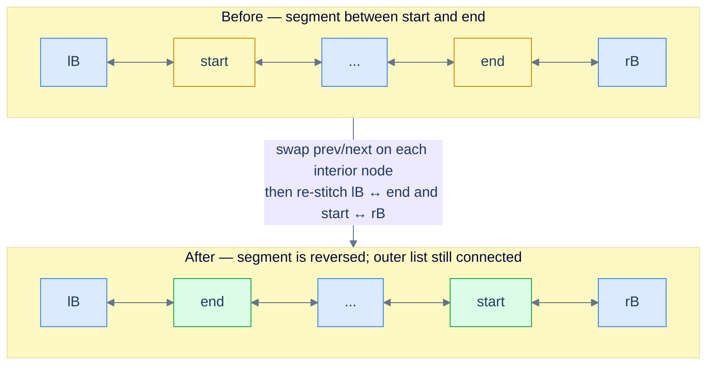
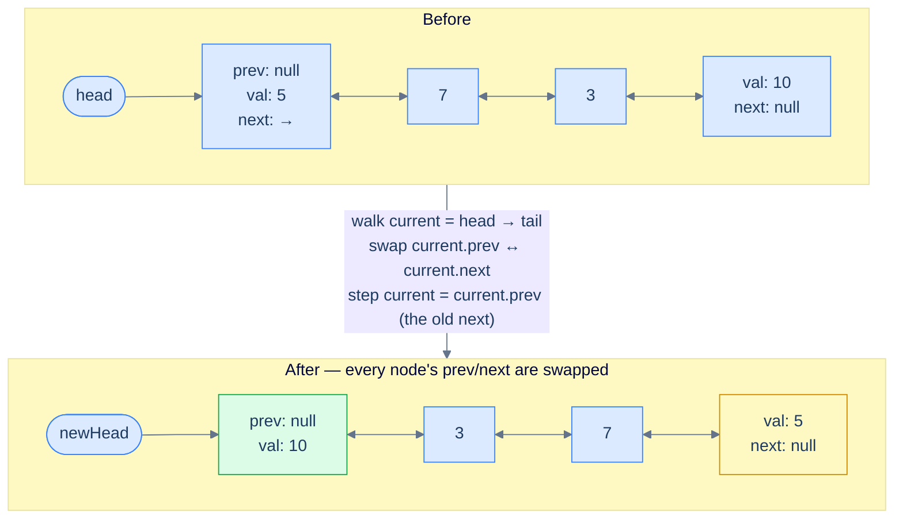
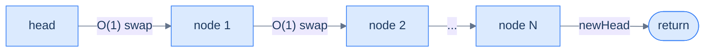
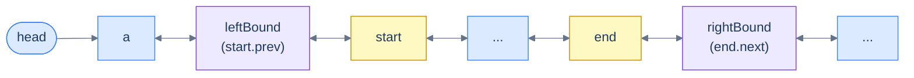
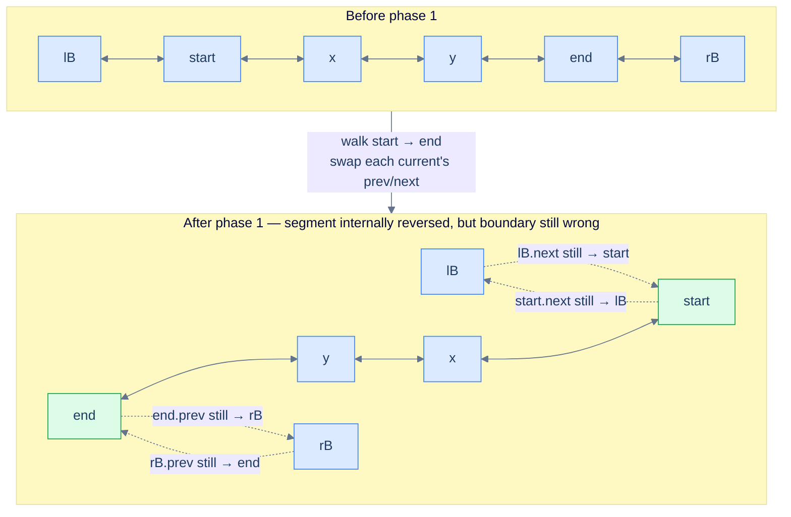
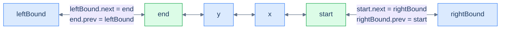
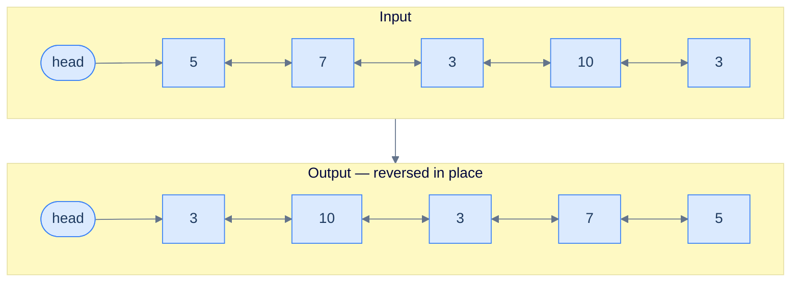

# 5. Pattern: Reversal

## The Hook

In a singly linked list, reversing the list felt like a magic trick — three pointers (`prev`, `curr`, `next`) shuffling around each other in a careful, error-prone choreography, one wrong move and the chain shatters. You probably remember the anxiety. You probably also remember finally getting it to work and feeling slightly proud.

Now bring the same problem to a doubly linked list and a small miracle happens. **There is no pointer chasing.** Each node already knows both of its neighbours. To "reverse" the list, you don't rearrange anything — you walk through every node and **swap its own `prev` and `next` pointers in place**. That's it. One swap per node, no temporaries that span iterations, no fragile three-pointer dance. The list is reversed when the walk ends.

We still finish in O(N) time — every node has to be touched — but the *kind* of work at each step collapses from "rewire three pointers in a careful order" to "swap two fields, take one step, repeat". By the end of this lesson, the same idea will let you reverse the **first K** nodes, the **last K** nodes, or **any segment between two given nodes** with the same swap-and-walk skeleton.

---

## Table of contents

1. [Understanding the reversal pattern](#understanding-the-reversal-pattern)
2. [Reversing a segment](#reversing-a-segment)
3. [Applications](#applications)
4. [Identifying direct application](#identifying-direct-application)
5. [Reverse a list](#reverse-a-list)
6. [Reverse first K nodes](#reverse-first-k-nodes)
7. [Reverse last K nodes](#reverse-last-k-nodes)
8. [Reverse the given segment](#reverse-the-given-segment)

***

# Understanding the reversal pattern

Many doubly linked list problems boil down to one move: **reverse the entire list, or some contiguous segment of it**. Some problems ask for it directly ("reverse the list"). Others hide it inside a larger algorithm — reorder, palindrome-check, k-group rotate, undo-stack rewind. If you can do the reversal cleanly and cheaply, the rest of the problem usually falls out.

The naive instinct is to rebuild the list from scratch — collect values into an array, walk it backwards, allocate fresh nodes. That works, but it costs O(N) extra space and ignores the doubly linked list's biggest advantage. The right approach is **in-place, single pass, O(1) extra space** — and on a DLL it's startlingly short.



<p align="center"><strong>Reversing a segment between <code>start</code> and <code>end</code>. The new boundary is <code>leftBound (lB)</code> ↔ <code>end</code> on one side and <code>start</code> ↔ <code>rightBound (rB)</code> on the other.</strong></p>

The **reversal pattern** is the family of linked list problems that can be solved by applying this single primitive — reverse a list, or a segment of one — possibly multiple times.

> *Before reading on — pause and predict. If every node already stores its `prev`, what is the **minimum** work you need to do at each node to reverse the list? What does each node "look like" after that work?*

## Reversing the entire list

Reversing the whole list is the special case where the segment runs from `head` all the way to the tail. We start with this case because it is the easiest to picture — but the code below is the fully general segment routine: it takes `start` and `end`, swaps every node in between, and stitches the result back to whatever neighbours sat outside the segment. For a whole-list reversal you simply pass `start = head` and `end = tail`; both boundary neighbours are then `null` and the stitching is a no-op.

The mental model is one line: **at each node, swap `prev` and `next`. Then move on.** That's the entire reversal. The reason it works is the symmetry of a doubly linked list — if you flip every node's two pointers, every existing `A → B` link becomes `A ← B`, and every existing `A ← B` link becomes `A → B`. Forward and backward chains *both* get reversed in the same sweep.



<p align="center"><strong>Whole-list reversal. After every node's <code>prev</code> and <code>next</code> are swapped, the original tail becomes the new head and the original head becomes the new tail.</strong></p>

There's one subtle move worth highlighting. After we swap a node's pointers, its old `next` is now sitting in `prev`. So to advance to the next node in the original list, we walk via `current.prev` — because *that field used to be `current.next` half a line ago*. This is the only "trick" in the algorithm, and it stops being tricky the moment you say it out loud.

Before the walk begins we capture two boundary references — `left_bound = start.prev` and `right_bound = end.next` — because the swaps will overwrite those fields. The loop runs `current` from `start` and stops the moment it reaches `right_bound`. Once the interior is reversed, four boundary writes re-stitch the segment to its neighbours: `start` is the segment's new tail, so `start.next = right_bound` and `right_bound.prev = start`; `end` is the new head, so `end.prev = left_bound` and `left_bound.next = end`. Each `if` guards the case where a boundary neighbour is `null`. For a whole-list reversal both neighbours are `null`, so `end` — the original tail — ends up as the new head.

## Algorithm

The algorithm below summarizes the in-place reversal of a doubly linked list segment between `start` and `end` — pass `start = head` and `end = tail` to reverse the entire list.

> **Algorithm**
>
> -   **Step 1:** If `start` equals `end`, the segment has a single node — nothing to reverse, so return.
> -   **Step 2:** Capture `leftBound` with `start.prev` and `rightBound` with `end.next` *before* any swap (either may be `null`).
> -   **Step 3:** Initialize `current` with `start` and iterate until `current` reaches `rightBound`. In each iteration do the following:
>     -   **Step 3.1:** Swap `current.next` and `current.prev`.
>     -   **Step 3.2:** Set `current` to `current.prev` to step to the next node in the *original* order (the field that used to be `next`).
> -   **Step 4:** Connect the new tail of the segment: set `start.next` to `rightBound`, and if `rightBound` is not `null`, set `rightBound.prev` to `start`.
> -   **Step 5:** Connect the new head of the segment: set `end.prev` to `leftBound`, and if `leftBound` is not `null`, set `leftBound.next` to `end`.

## Implementation

The code implementation of the segment reversal — which reverses the entire list when called with `start = head` and `end = tail` — is given below.


```python run

"""
Definition for doubly-linked list.
class ListNode:
    def __init__(self, val):
        self.val = val
        self.prev = None
        self.next = None
"""

from typing import Optional

def reverse(start: Optional[ListNode], end: Optional[ListNode]) -> None:
    # If the start and end nodes are the same, no reversal needed
    if start == end:
        return

    # Initialize leftBound and rightBound
    left_bound = start.prev  # start can never be null
    right_bound = end.next   # end can never be null

    # Initialize current pointer
    current = start

    # 1. Swap next and prev pointers of nodes until the rightBound
    while current != right_bound:
        # Swap prev and next for the current node
        current.prev, current.next = current.next, current.prev
        # Move to the previous node (which is now in the next pointer due to swap)
        current = current.prev

    # 2. Update boundary nodes

    # Correctly connect the new tail (start) of the reversed segment to the parent list
    start.next = right_bound
    if right_bound:
        right_bound.prev = start

    # Correctly connect the new head (end) of the reversed segment to the parent list
    end.prev = left_bound
    if left_bound:
        left_bound.next = end
```

```java run

/**
 * Definition for doubly-linked list.
 * class ListNode {
 *     int val;
 *     ListNode prev;
 *     ListNode next;
 *     ListNode() {}
 *     ListNode(int val) { this.val = val; }
 * };
 */

class ReverseALinkedList {

        public void reverse(ListNode start, ListNode end) {
        // If the start and end nodes are the same, no reversal needed
        if (start == end) {
            return;
        }

        // Initialize leftBound and rightBound
        ListNode leftBound = start.prev; // start can never be null
        ListNode rightBound = end.next; // end can never be null

        // Initialize current pointer to the start node
        ListNode current = start;

        // 1. Swap next and prev pointers of nodes within the segment
        while (current != rightBound) {
            // Swap the previous and next pointers
            ListNode temp = current.prev;
            current.prev = current.next;
            current.next = temp;

            // Move to what was previously the previous node (now stored in prev)
            current = current.prev;
        }

        // 2. Update boundary nodes

        // Correctly connect the new tail of the reversed segment to the rightBound
        start.next = rightBound;
        if (rightBound != null) {
            rightBound.prev = start;
        }

        // Correctly connect the new head of the reversed segment to the leftBound
        end.prev = leftBound;
        if (leftBound != null) {
            leftBound.next = end;
        }
    }
}
```


## Complexity Analysis

We visit every node exactly once and do O(1) work at each — a swap and a step. The space is just three local references regardless of list size.



<p align="center"><strong>One linear sweep, constant work per node, constant extra memory.</strong></p>

> **Best Case** — list is empty or has a single node.
>
> -   Space Complexity — **O(1)**
> -   Time Complexity — **O(1)**
>
> **Worst Case** — list has N nodes.
>
> -   Space Complexity — **O(1)**
> -   Time Complexity — **O(N)**

We can reverse the whole list now. But what if the problem only wants a slice — say, "reverse the nodes between position 3 and position 7"? The interior swap is identical; only the boundary plumbing changes. Let's see exactly how.

***

# Reversing a segment

Reversing a segment between two given nodes is the **general** form of the algorithm. The whole-list case is just the version where the segment happens to span everything. Here we are given two references — `start` and `end` — that point to two nodes in the list, with `start` somewhere before `end` in forward traversal order. The job: reverse the chunk from `start` to `end` (inclusive), and leave the rest of the list correctly attached on both sides.

For this lesson, assume `start` and `end` are non-null and that `start` is reachable from `head` and `end` is reachable from `start`.



<p align="center"><strong>Setup — capture <code>leftBound</code> (the node before <code>start</code>) and <code>rightBound</code> (the node after <code>end</code>) <em>before</em> we start swapping. These two references will be used at the end to re-stitch the reversed segment back into the parent list.</strong></p>

We capture two extra references **before any pointer is mutated**:

- `leftBound = start.prev` — the node that sits to the left of the segment
- `rightBound = end.next` — the node that sits to the right of the segment

Either one can be `null` (if the segment touches the head or the tail), so we handle them with null checks at stitching time. The reason we capture them up front is the same save-before-clobber discipline from the deletion lesson: once we start swapping pointers inside the segment, `start.prev` and `end.next` no longer mean what they meant a moment ago.

The algorithm splits cleanly into two phases.

### 1. Swap `next` and `prev` on each segment node

Walk `current` from `start` until it reaches `rightBound`. At each step, swap `current.prev` and `current.next`, then advance to the next node in the *original* order — which, post-swap, is now sitting in `current.prev`.



<p align="center"><strong>After phase 1 the interior is reversed — <code>end</code> is the new head of the segment and <code>start</code> is the new tail — but the boundary pointers are still tangled with their original neighbours. Phase 2 fixes that.</strong></p>

### 2. Re-stitch the reversed segment to the parent list

After phase 1, the reversed segment is dangling — its connections to `leftBound` and `rightBound` are wrong. Specifically, after the swaps, `start.next` now points at the *old* `leftBound`, and `end.prev` now points at the *old* `rightBound`. We fix this in two symmetric strokes.

**Tail of the reversed segment** — `start` is now the last node of the reversed slice. Its `next` should be `rightBound`. Mirror that: `rightBound.prev = start` (if `rightBound` exists).

**Head of the reversed segment** — `end` is now the first node of the reversed slice. Its `prev` should be `leftBound`. Mirror that: `leftBound.next = end` (if `leftBound` exists).



<p align="center"><strong>Final stitch — four pointer assignments (with null guards) reattach the reversed segment to the parent list. Both directions stay consistent.</strong></p>

> *Predict before reading on — what happens if we forget to update `rightBound.prev` after the swap? In which direction would the list look correct, and in which direction would it break?*

If you skip `rightBound.prev = start`, a forward walk from `head` looks fine — `start.next = rightBound` still works going forward. But the moment you walk *backward* from any node beyond the segment, you'll arrive at `rightBound` and follow its stale `prev` pointer right back into the middle of the reversed segment, jumping past `start` entirely. Backward traversal silently corrupts. This is the doubly linked list tax — every link is two pointers, and forgetting the mirror is the most common bug.

<details>
<summary><h2>Algorithm</h2></summary>


The algorithm below summarizes the doubly linked list segment reversal.

> **Algorithm**
>
> -   **Step 1:** If `start == end`, the segment has one node — nothing to reverse, return.
> -   **Step 2:** Capture `leftBound = start.prev` and `rightBound = end.next` *before* mutating anything (either may be `null`).
> -   **Step 3:** Initialize `current = start` and iterate until `current == rightBound`. In each iteration:
>     -   **Step 3.1:** Swap `current.prev` and `current.next`.
>     -   **Step 3.2:** Advance `current = current.prev` (the old `next`, post-swap).
> -   **Step 4:** Stitch the new tail of the segment to the parent list: set `start.next = rightBound`; if `rightBound` is non-null, set `rightBound.prev = start`.
> -   **Step 5:** Stitch the new head of the segment to the parent list: set `end.prev = leftBound`; if `leftBound` is non-null, set `leftBound.next = end`.

</details>
<details>
<summary><h2>Solution &amp; Analysis</h2></summary>

### Implementation

Given below is the code implementation to reverse a doubly linked list segment between `start` and `end`.


```python run
class Solution:
    def reverse(self, start, end):
        # Single-node segment — nothing to reverse
        if start == end:
            return

        # Capture boundary refs BEFORE any swap — they will be invalid after.
        left_bound  = start.prev   # may be None if segment touches the head
        right_bound = end.next     # may be None if segment touches the tail

        # Phase 1 — swap prev/next on every node from start up to (not including) right_bound
        current = start
        while current != right_bound:
            # The entire reversal at this node — flip its two pointers
            current.prev, current.next = current.next, current.prev
            # The original next is now in prev; that's how we advance in source order
            current = current.prev

        # Phase 2 — re-stitch the reversed segment to the parent list

        # New tail of the segment is `start` — connect it to right_bound (mirror both sides)
        start.next = right_bound
        if right_bound is not None:
            right_bound.prev = start

        # New head of the segment is `end` — connect it to left_bound (mirror both sides)
        end.prev = left_bound
        if left_bound is not None:
            left_bound.next = end
```

```java run
public class Main {
    static class ListNode { int val; ListNode prev, next; ListNode(int v){val=v;} }

    static class Solution {
        public void reverse(ListNode start, ListNode end) {
            // Single-node segment — nothing to reverse
            if (start == end) return;

            // Capture boundary refs BEFORE any swap — they become invalid after
            ListNode leftBound  = start.prev;  // may be null if segment touches head
            ListNode rightBound = end.next;    // may be null if segment touches tail

            // Phase 1 — swap prev/next on every node from start up to rightBound
            ListNode current = start;
            while (current != rightBound) {
                ListNode temp = current.prev;
                current.prev  = current.next;
                current.next  = temp;
                // Original next is now in prev — that's our walk direction
                current = current.prev;
            }

            // Phase 2 — stitch reversed segment back into the parent list
            start.next = rightBound;                         // new tail of segment → rightBound
            if (rightBound != null) rightBound.prev = start; // mirror

            end.prev = leftBound;                            // new head of segment → leftBound
            if (leftBound != null) leftBound.next = end;     // mirror
        }
    }

    public static void main(String[] args) {
        ListNode n1=new ListNode(5),n2=new ListNode(7),n3=new ListNode(3),n4=new ListNode(10),n5=new ListNode(6);
        n1.next=n2; n2.prev=n1; n2.next=n3; n3.prev=n2; n3.next=n4; n4.prev=n3; n4.next=n5; n5.prev=n4;
        new Solution().reverse(n2, n4);
        for (ListNode c=n1;c!=null;c=c.next) System.out.print(c.val+" ");
        // 5 10 3 7 6
    }
}
```

### Complexity Analysis

Phase 1 visits each node in the segment exactly once with O(1) work per node. Phase 2 is a fixed four-pointer reattachment. The space cost is two boundary references and one walk pointer — constant.

> **Best Case** — `start == end`.
>
> -   Space Complexity — **O(1)**
> -   Time Complexity — **O(1)**
>
> **Worst Case** — segment spans the entire list.
>
> -   Space Complexity — **O(1)**
> -   Time Complexity — **O(N)**

We have the primitive. Now the more interesting question: when do we *recognise* a problem as a reversal-pattern problem in the first place?

</details>

***

# Applications

Many doubly linked list problems can be classified as reversal pattern problems. Some are solved by directly applying the reversal algorithm (the entire problem *is* a reversal), while others embed reversal as a subproblem inside a larger algorithm.

> -   **Direct application** — the problem statement asks for a reversal, possibly with an extra constraint like "first K nodes" or "between positions L and R".
> -   **Subproblem** — the algorithm reverses one or more segments as part of a bigger move (e.g. rotate the list, reorder alternately, group-reverse every K).

We will examine techniques for identifying both categories. Let's start with the easier of the two — the direct applications.

***

# Identifying direct application

The reversal algorithm can be applied directly when the problem reduces to reversing a known segment of the list. These are usually classified as **easy** problems. If a problem statement (or a step in its solution) fits the template below, you can plug the reversal algorithm in directly.

> **Template:** Given a doubly linked list and two nodes `start` and `end`, reverse the segment between them.

Several variants of this template show up over and over:

- "Reverse the entire list" → `start = head`, `end = tail`.
- "Reverse the first K nodes" → `start = head`, `end = the K-th node`.
- "Reverse the last K nodes" → `start = the (N − K + 1)-th node`, `end = tail`.
- "Reverse the segment between positions L and R" → `start = L-th node`, `end = R-th node`.

Once you spot the shape, the work splits into two clean halves: **(a)** locate `start` and `end` (sometimes a small traversal, sometimes free if `head` is given), and **(b)** call the reversal primitive.

## Example

To make the identification concrete, here's a problem and the reasoning that flags it as a direct application.

> **Problem statement:** Given a doubly linked list, reverse it in place.



<p align="center"><strong>Reverse the given linked list in place.</strong></p>

### Linked list reversal algorithm

The problem fits the template with `start = head` and `end = tail` — the segment is the entire list. So this is the whole-list flavour we already saw: walk `current` from `head`, swap `prev` and `next` at every node, capture the new head when `current.prev` becomes `null` after a swap, and return it.

Below is the whole-list implementation, which tracks `newHead` directly instead of taking explicit `start`/`end` boundaries.


```python run

"""
Definition for doubly-linked list.
class ListNode:
    def __init__(self, val):
        self.val = val
        self.prev = None
        self.next = None
"""

from typing import Optional

def reverse_a_linked_list(head: Optional[ListNode]) -> Optional[ListNode]:
    # If the head is null or if it's the only node in the list, return the head as it is
    if not head or (not head.next):
        return head

    # Reference to track the current node
    current = head

    # Reference to hold the reversed head
    new_head = None

    while current is not None:
        # Swap the previous and next pointers of the current node
        current.prev, current.next = current.next, current.prev

        # If the previous node is now null, the current node is the new head
        if current.prev is None:
            new_head = current

        # Move the current reference to the next node, which is now the previous node
        current = current.prev

    # Return the new head, which was the last node in the original list
    return new_head
```

```java run

/**
 * Definition for doubly-linked list.
 * class ListNode {
 *     int val;
 *     ListNode prev;
 *     ListNode next;
 *     ListNode() {}
 *     ListNode(int val) { this.val = val; }
 * };
 */

public class Reverse {

    public ListNode reverse(ListNode head) {
        // If the head is null or if it's the only node in the list, return the head as it is
        if (head == null || (head.next == null)) {
            return head;
        }

        // Reference to track the current node
        ListNode current = head;

        // Reference to hold the reversed head
        ListNode newHead = null;

        while (current != null) {
            // Swap the previous and next pointers
            ListNode temp = current.prev;
            current.prev = current.next;
            current.next = temp;

            // If the previous node is now null, the current node is the new head
            if (current.prev == null) {
                newHead = current;
            }

            // Move the current reference to the next node, which is now the previous node
            current = current.prev;
        }

        // Return the new head, which was the last node in the original list
        return newHead;
    }
}
```


## Example Problems

Most direct-application problems are **easy** — the algorithm is the same, only the framing changes. The list below previews the four we'll solve in detail next.

> -   **Reverse a list** — the canonical whole-list reversal.
> -   **Reverse first K nodes** — reverse a prefix, leave the suffix untouched.
> -   **Reverse last K nodes** — reverse a suffix, leave the prefix untouched.
> -   **Reverse the given segment** — reverse a slice between positions `left` and `right`.

We'll now solve each one and watch the same primitive show up in four slightly different costumes.

***

# Reverse a list

## The Problem

> Given the **head** of a doubly linked list, write a function to reverse the list in place and return the head of the reversed list.

```
Input:  head = [5, 7, 3, 10, 3]
Output: [3, 10, 3, 7, 5]
```

<details>
<summary><h2>The Solution</h2></summary>


This is the whole-list special case. Walk every node with a `current`/`previous` pair; at each node **swap its `prev` and `next` pointers** so both chains flip at once, and return `previous` — once the walk ends, it holds the original tail, which is the new head.


```python run
from typing import Optional


class ListNode:
    def __init__(self, val=0, prev=None, nxt=None):
        self.val = val
        self.prev = prev
        self.next = nxt


def from_list(values):
    if not values:
        return None
    head = ListNode(values[0])
    cur = head
    for v in values[1:]:
        node = ListNode(v, prev=cur)
        cur.next = node
        cur = node
    return head


def to_list(head):
    out = []
    while head is not None:
        out.append(head.val)
        head = head.next
    return out


class Solution:
    def reverse_a_list(
        self, head: Optional[ListNode]
    ) -> Optional[ListNode]:

        # If the head is null or if it's the only node in the list,
        # return the head as it is
        if head is None or (head.prev is None and head.next is None):
            return head

        # Pointer to track the current node
        current = head

        # Pointer to track the previous node
        previous = None

        while current is not None:

            # Save the address of next node
            next_node = current.next

            # Swap the previous and next nodes pointers of the current
            # node
            current.prev, current.next = current.next, current.prev

            # Store the previous node in the previous pointer
            previous = current

            # Move the current pointer to the next node
            current = next_node

        # Return the new head, which is stored in the previous pointer
        return previous


# Examples from the problem statement
print(to_list(Solution().reverse_a_list(from_list([5, 7, 3, 10, 3]))))   # [3, 10, 3, 7, 5]

# Edge cases
print(to_list(Solution().reverse_a_list(None)))                            # []
print(to_list(Solution().reverse_a_list(from_list([42]))))                 # [42]
print(to_list(Solution().reverse_a_list(from_list([1, 2]))))               # [2, 1]
print(to_list(Solution().reverse_a_list(from_list([1, 2, 3, 4]))))        # [4, 3, 2, 1]
print(to_list(Solution().reverse_a_list(from_list([5, 5, 5]))))           # [5, 5, 5]
print(to_list(Solution().reverse_a_list(from_list([1, 2, 3, 2, 1]))))    # [1, 2, 3, 2, 1]
```

```java run
import java.util.*;

public class Main {
    static class ListNode {
        int val;
        ListNode prev;
        ListNode next;
        ListNode() {}
        ListNode(int val) { this.val = val; }
    }

    static ListNode fromList(int... values) {
        if (values.length == 0) return null;
        ListNode head = new ListNode(values[0]);
        ListNode cur = head;
        for (int i = 1; i < values.length; i++) {
            ListNode node = new ListNode(values[i]);
            node.prev = cur;
            cur.next = node;
            cur = node;
        }
        return head;
    }

    static java.util.List<Integer> toList(ListNode head) {
        java.util.List<Integer> out = new java.util.ArrayList<>();
        while (head != null) { out.add(head.val); head = head.next; }
        return out;
    }

    static class Solution {
        public ListNode reverseAList(ListNode head) {

            // If the head is null or if it's the only node in the list,
            // return the head as it is
            if (head == null || (head.prev == null && head.next == null)) {
                return head;
            }

            // Pointer to track the current node
            ListNode current = head;

            // Pointer to track the previous node
            ListNode previous = null;

            while (current != null) {

                // Save the address of next node
                ListNode next = current.next;

                // Swap the previous and next nodes pointers of the current
                // node
                ListNode temp = current.prev;
                current.prev = current.next;
                current.next = temp;

                // Store the previous node in the previous pointer
                previous = current;

                // Move the current pointer to the next node
                current = next;
            }

            // Return the new head, which is stored in the previous pointer
            return previous;
        }
    }

    public static void main(String[] args) {
        // Examples from the problem statement
        System.out.println(toList(new Solution().reverseAList(fromList(5, 7, 3, 10, 3))));   // [3, 10, 3, 7, 5]

        // Edge cases
        System.out.println(toList(new Solution().reverseAList(null)));                         // []
        System.out.println(toList(new Solution().reverseAList(fromList(42))));                 // [42]
        System.out.println(toList(new Solution().reverseAList(fromList(1, 2))));               // [2, 1]
        System.out.println(toList(new Solution().reverseAList(fromList(1, 2, 3, 4))));        // [4, 3, 2, 1]
        System.out.println(toList(new Solution().reverseAList(fromList(5, 5, 5))));           // [5, 5, 5]
        System.out.println(toList(new Solution().reverseAList(fromList(1, 2, 3, 2, 1))));    // [1, 2, 3, 2, 1]
    }
}
```


<details>
<summary><strong>Trace — head = [5, 7, 3, 10, 3]</strong></summary>

```
Initial: head → 5 ⇄ 7 ⇄ 3 ⇄ 10 ⇄ 3,   current = 5,   previous = null

Step 1 │ current = 5      │ next_node = 7   │ swap 5:  prev 7, next null  │ previous = 5,  current = 7
Step 2 │ current = 7      │ next_node = 3   │ swap 7:  prev 3, next 5     │ previous = 7,  current = 3
Step 3 │ current = 3 (m)  │ next_node = 10  │ swap 3:  prev 10, next 7    │ previous = 3,  current = 10
Step 4 │ current = 10     │ next_node = 3   │ swap 10: prev 3, next 3     │ previous = 10, current = 3
Step 5 │ current = 3 (t)  │ next_node = null│ swap 3:  prev null, next 10 │ previous = 3,  current = null
Done   │ current == null — return previous (= 3, original tail)

Result: head → 3 ⇄ 10 ⇄ 3 ⇄ 7 ⇄ 5  ✓
```

Each step swaps the node's `prev` and `next` in one stroke — `next_node` is saved *before* the swap because the swap overwrites `current.next`. Both chains flip together: the original tail ends with `prev = null` (it is the new head), and `previous` walks one step behind `current`, so it lands on that tail the moment `current` falls off the end.

</details>

</details>

***

# Reverse first K nodes

## The Problem

> Given the **head** of a doubly linked list and a non-negative integer **k**, write a function to reverse the **first K** nodes of the list and return the head of the resulting list. Reverse in place.

```
Input:  head = [5, 7, 3, 10, 3], k = 2
Output: [7, 5, 3, 10, 3]
```

The first K nodes form a prefix segment. After reversing it, we have a new list of length K plus an unchanged suffix of length `N − K`. Two stitches matter: the **new head** of the reversed prefix becomes the new head of the whole list, and the **new tail** of the reversed prefix (= the original `head`) must be re-linked to the suffix.

> *Quick prediction — what should the new tail's `prev` look like, and what should the suffix's first node's `prev` look like, after the reversal? Try to draw it before reading on.*

<details>
<summary><h2>The Solution</h2></summary>


Walk K steps, swapping each node's `prev` and `next` pointers, and stop. After the loop:

- `previous` holds the new head of the reversed prefix (originally the K-th node).
- The original `head` is now the *last* node of the reversed prefix (its `next` currently points at `null` after its own swap).
- `current` is sitting on the (K+1)-th node — the start of the untouched suffix, or `null` if `k >= N`.

We then re-stitch in three writes: the original head's `next` becomes `current` (the suffix start), the suffix's first node's `prev` points back at the original head, and the new head's `prev` is cleared to `null` — joining the reversed prefix to the remaining list in both directions.


```python run
from typing import Optional, List, Any


class ListNode:
    def __init__(self, val=0, prev=None, nxt=None):
        self.val = val
        self.prev = prev
        self.next = nxt


def from_list(values):
    if not values:
        return None
    head = ListNode(values[0])
    cur = head
    for v in values[1:]:
        node = ListNode(v, prev=cur)
        cur.next = node
        cur = node
    return head


def to_list(head):
    out = []
    while head is not None:
        out.append(head.val)
        head = head.next
    return out


class Solution:
    def reverse_first_k_nodes(
        self, head: Optional[ListNode], k: int
    ) -> Optional[ListNode]:

        # if K is less than or equal to 0, return the original head
        if k <= 0:
            return head

        # Initialize pointers current and previous
        current: Optional[ListNode] = head
        previous: Optional[ListNode] = None
        count = 0

        while current is not None and count < k:

            # Save the address of next node
            next_node = current.next

            # Swap the previous and next nodes pointers of the current
            # node
            current.prev, current.next = current.next, current.prev

            # Move previous to hold current node
            previous = current

            # Move current ahead
            current = next_node

            # Increment count
            count += 1

        # Connect the reversed sublist with the remaining part
        if head is not None:
            head.next = current

        # Update prev of the next node to point back to new tail
        if current is not None:
            current.prev = head

        # Mark the previous pointer of the new head to None
        if previous is not None:
            previous.prev = None

        return previous


# Examples from the problem statement
print(to_list(Solution().reverse_first_k_nodes(from_list([5, 7, 3, 10, 3]), 2)))   # [7, 5, 3, 10, 3]

# Edge cases
print(to_list(Solution().reverse_first_k_nodes(None, 3)))                            # []
print(to_list(Solution().reverse_first_k_nodes(from_list([5, 7, 3, 10, 3]), 0)))    # [5, 7, 3, 10, 3]
print(to_list(Solution().reverse_first_k_nodes(from_list([5, 7, 3, 10, 3]), 1)))    # [5, 7, 3, 10, 3]
print(to_list(Solution().reverse_first_k_nodes(from_list([5, 7, 3, 10, 3]), 5)))    # [3, 10, 3, 7, 5]
print(to_list(Solution().reverse_first_k_nodes(from_list([1, 2]), 2)))               # [2, 1]
print(to_list(Solution().reverse_first_k_nodes(from_list([42]), 1)))                 # [42]
```

```java run
import java.util.*;

public class Main {
    static class ListNode {
        int val;
        ListNode prev;
        ListNode next;
        ListNode() {}
        ListNode(int val) { this.val = val; }
    }

    static ListNode fromList(int... values) {
        if (values.length == 0) return null;
        ListNode head = new ListNode(values[0]);
        ListNode cur = head;
        for (int i = 1; i < values.length; i++) {
            ListNode node = new ListNode(values[i]);
            node.prev = cur;
            cur.next = node;
            cur = node;
        }
        return head;
    }

    static java.util.List<Integer> toList(ListNode head) {
        java.util.List<Integer> out = new java.util.ArrayList<>();
        while (head != null) { out.add(head.val); head = head.next; }
        return out;
    }

    static class Solution {
        public ListNode reverseFirstKNodes(ListNode head, int k) {

            // if K is less than or equal to 0, return the original head
            if (k <= 0) {
                return head;
            }

            // Initialize pointers current and previous
            ListNode current = head;
            ListNode previous = null;
            int count = 0;

            while (current != null && count < k) {

                // Save the address of next node
                ListNode next = current.next;

                // Swap the previous and next nodes pointers of the current
                // node
                ListNode temp = current.prev;
                current.prev = current.next;
                current.next = temp;

                // Move previous to hold current node
                previous = current;

                // Move current ahead
                current = next;

                // Increment count
                count++;
            }

            // Connect the reversed sublist with the remaining part
            if (head != null) {
                head.next = current;
            }

            // Update prev of the next node to point back to new tail
            if (current != null) {
                current.prev = head;
            }

            // Mark the previous pointer of the new head to nullptr
            if (previous != null) {
                previous.prev = null;
            }

            return previous;
        }
    }

    public static void main(String[] args) {
        // Examples from the problem statement
        System.out.println(toList(new Solution().reverseFirstKNodes(fromList(5, 7, 3, 10, 3), 2)));  // [7, 5, 3, 10, 3]

        // Edge cases
        System.out.println(toList(new Solution().reverseFirstKNodes(null, 3)));                       // []
        System.out.println(toList(new Solution().reverseFirstKNodes(fromList(5, 7, 3, 10, 3), 0)));  // [5, 7, 3, 10, 3]
        System.out.println(toList(new Solution().reverseFirstKNodes(fromList(5, 7, 3, 10, 3), 1)));  // [5, 7, 3, 10, 3]
        System.out.println(toList(new Solution().reverseFirstKNodes(fromList(5, 7, 3, 10, 3), 5)));  // [3, 10, 3, 7, 5]
        System.out.println(toList(new Solution().reverseFirstKNodes(fromList(1, 2), 2)));             // [2, 1]
        System.out.println(toList(new Solution().reverseFirstKNodes(fromList(42), 1)));               // [42]
    }
}
```


<details>
<summary><strong>Trace — head = [5, 7, 3, 10, 3], k = 2</strong></summary>

```
Initial: 5 ⇄ 7 ⇄ 3 ⇄ 10 ⇄ 3,   current = 5,  previous = null,  count = 0

Step 1 │ count=0 < k=2 │ current=5 │ next_node=7 │ swap 5: prev 7, next null │ previous=5, current=7, count=1
Step 2 │ count=1 < k=2 │ current=7 │ next_node=3 │ swap 7: prev 3, next 5    │ previous=7, current=3, count=2
Loop exits (count == k).

Stitch:
  head=5 (now the last node of the prefix) → head.next = current = node(3)
  current=3 is non-null → current.prev = head = node(5)   (mirror the boundary)
  previous=7 is the new head → previous.prev = null
  return previous=7 (new head)

Result: 7 ⇄ 5 ⇄ 3 ⇄ 10 ⇄ 3  ✓
```

The prefix `[5, 7]` flips to `[7, 5]` while the suffix `[3, 10, 3]` is left completely untouched. Three boundary writes reconnect the two parts in both directions: `head.next` forward into the suffix, the suffix's `prev` back at the old head, and the new head's `prev` cleared to `null`.

</details>

</details>

***

# Reverse last K nodes

## The Problem

> Given the **head** of a doubly linked list and a non-negative integer **k**, write a function to reverse the **last K** nodes of the list and return the head. Reverse in place.

```
Input:  head = [5, 7, 3, 10, 3], k = 2
Output: [5, 7, 3, 3, 10]
```

The last K nodes form a suffix segment. We don't know where the suffix starts without knowing the list length, so the algorithm has three pieces:

1. Compute the length `N` of the list.
2. If `K >= N`, the suffix is the entire list — just call the whole-list reversal.
3. Otherwise, walk to the `(N − K)`-th node, snip the suffix off, reverse it as a standalone list, and re-stitch.

The "snip and reverse" trick is the cleanest way to reuse the whole-list reversal we already have. We disconnect the suffix by setting the `(N − K)`-th node's `next` to `null` and the suffix's first `prev` to `null`, run `reverseAList` on the suffix in isolation, then reattach.

<details>
<summary><h2>The Solution</h2></summary>


```python run
from typing import Optional

class ListNode:
    def __init__(self, val=0, prev=None, nxt=None):
        self.val = val
        self.prev = prev
        self.next = nxt


def from_list(values):
    if not values:
        return None
    head = ListNode(values[0])
    cur = head
    for v in values[1:]:
        node = ListNode(v, prev=cur)
        cur.next = node
        cur = node
    return head


def to_list(head):
    out = []
    while head is not None:
        out.append(head.val)
        head = head.next
    return out


class Solution:
    def length_of_list(self, head: Optional[ListNode]) -> int:
        length: int = 0

        # Traverse the list and increment the length until the end
        while head:
            length += 1
            head = head.next

        # Return the length
        return length

    def reverse_a_list(
        self, head: Optional[ListNode]
    ) -> Optional[ListNode]:

        # If the head is null or if it's the only node in the list,
        # return the head as it is
        if head is None or (head.prev is None and head.next is None):
            return head

        # Pointer to track the current node
        current = head

        # Pointer to track the previous node
        previous = None

        while current is not None:

            # Save the address of next node
            next_node = current.next

            # Swap the previous and next nodes pointers of the current
            # node
            current.prev, current.next = current.next, current.prev

            # Store the previous node in the previous pointer
            previous = current

            # Move the current pointer to the next node
            current = next_node

        # Return the new head, which is stored in the previous pointer
        return previous

    def reverse_last_k_nodes(
        self, head: Optional[ListNode], k: int
    ) -> Optional[ListNode]:

        # if K is less than or equal to 0, return the original head
        if k <= 0:
            return head

        # Find the length of the list
        length = self.length_of_list(head)

        # If k is greater than or equal to length, reverse the entire
        # list
        if k >= length:
            return self.reverse_a_list(head)

        # Find the (length - k)th node after which the reversal should
        # occur
        current = head
        for _ in range(1, length - k):
            current = current.next

        # Disconnect the last k nodes from the main list
        if current.next is not None:
            current.next.prev = None

        # Reverse the last k nodes
        last_k_reverse_head = self.reverse_a_list(current.next)

        # Connect the (length - k)th node to the new head
        current.next = last_k_reverse_head

        # Connect the new head of the reversed list to the
        # (length - k)th node
        if last_k_reverse_head is not None:
            last_k_reverse_head.prev = current

        return head


# Examples from the problem statement
head = from_list([5, 7, 3, 10, 3])
print(to_list(Solution().reverse_last_k_nodes(head, 2)))  # [5, 7, 3, 3, 10]

# Edge cases
head = from_list([1, 2, 3, 4, 5])
print(to_list(Solution().reverse_last_k_nodes(head, 0)))  # [1, 2, 3, 4, 5]

head = from_list([1, 2, 3, 4, 5])
print(to_list(Solution().reverse_last_k_nodes(head, 1)))  # [1, 2, 3, 4, 5]

head = from_list([1, 2, 3, 4, 5])
print(to_list(Solution().reverse_last_k_nodes(head, 5)))  # [5, 4, 3, 2, 1]

head = from_list([1, 2, 3, 4, 5])
print(to_list(Solution().reverse_last_k_nodes(head, 10)))  # [5, 4, 3, 2, 1]

head = from_list([1, 2, 3, 4, 5])
print(to_list(Solution().reverse_last_k_nodes(head, 3)))  # [1, 2, 5, 4, 3]

head = from_list([7])
print(to_list(Solution().reverse_last_k_nodes(head, 1)))  # [7]

head = from_list([3, 9])
print(to_list(Solution().reverse_last_k_nodes(head, 1)))  # [3, 9]

head = from_list([3, 9])
print(to_list(Solution().reverse_last_k_nodes(head, 2)))  # [9, 3]
```

```java run
import java.util.*;

public class Main {
    static class ListNode {
        int val;
        ListNode prev;
        ListNode next;
        ListNode() {}
        ListNode(int val) { this.val = val; }
    }

    static ListNode fromList(int... values) {
        if (values.length == 0) return null;
        ListNode head = new ListNode(values[0]);
        ListNode cur = head;
        for (int i = 1; i < values.length; i++) {
            ListNode node = new ListNode(values[i]);
            node.prev = cur;
            cur.next = node;
            cur = node;
        }
        return head;
    }

    static java.util.List<Integer> toList(ListNode head) {
        java.util.List<Integer> out = new java.util.ArrayList<>();
        while (head != null) { out.add(head.val); head = head.next; }
        return out;
    }

    static class Solution {
        private int lengthOfList(ListNode head) {
            int length = 0;

            // Traverse the list and increment the length until the end
            while (head != null) {
                length++;
                head = head.next;
            }

            // Return the length
            return length;
        }

        private ListNode reverseAList(ListNode head) {

            // If the head is null or if it's the only node in the list,
            // return the head as it is
            if (head == null || (head.prev == null && head.next == null)) {
                return head;
            }

            // Pointer to track the current node
            ListNode current = head;

            // Pointer to track the previous node
            ListNode previous = null;

            while (current != null) {

                // Save the address of next node
                ListNode next = current.next;

                // Swap the previous and next nodes pointers of the current
                // node
                ListNode temp = current.prev;
                current.prev = current.next;
                current.next = temp;

                // Store the previous node in the previous pointer
                previous = current;

                // Move the current pointer to the next node
                current = next;
            }

            // Return the new head, which is stored in the previous pointer
            return previous;
        }

        public ListNode reverseLastKNodes(ListNode head, int k) {

            // if K is less than or equal to 0, return the original head
            if (k <= 0) {
                return head;
            }

            // Find the length of the list
            int length = lengthOfList(head);

            // If k is greater than or equal to length, reverse the entire
            // list
            if (k >= length) {
                return reverseAList(head);
            }

            // Find the (length - k)th node after which the reversal should
            // occur
            ListNode current = head;
            for (int i = 1; i < length - k; i++) {
                current = current.next;
            }

            // Disconnect the last k nodes from the main list
            if (current.next != null) {
                current.next.prev = null;
            }

            // Reverse the last k nodes
            ListNode lastKReverseHead = reverseAList(current.next);

            // Connect the (length - k)th node to the new head
            current.next = lastKReverseHead;

            // Connect the new head of the reversed list to the
            // (length - k)th node
            if (lastKReverseHead != null) {
                lastKReverseHead.prev = current;
            }

            return head;
        }
    }

    public static void main(String[] args) {
        // Examples from the problem statement
        System.out.println(toList(new Solution().reverseLastKNodes(fromList(5, 7, 3, 10, 3), 2)));  // [5, 7, 3, 3, 10]

        // Edge cases
        System.out.println(toList(new Solution().reverseLastKNodes(fromList(1, 2, 3, 4, 5), 0)));   // [1, 2, 3, 4, 5]
        System.out.println(toList(new Solution().reverseLastKNodes(fromList(1, 2, 3, 4, 5), 1)));   // [1, 2, 3, 4, 5]
        System.out.println(toList(new Solution().reverseLastKNodes(fromList(1, 2, 3, 4, 5), 5)));   // [5, 4, 3, 2, 1]
        System.out.println(toList(new Solution().reverseLastKNodes(fromList(1, 2, 3, 4, 5), 10)));  // [5, 4, 3, 2, 1]
        System.out.println(toList(new Solution().reverseLastKNodes(fromList(1, 2, 3, 4, 5), 3)));   // [1, 2, 5, 4, 3]
        System.out.println(toList(new Solution().reverseLastKNodes(fromList(7), 1)));               // [7]
        System.out.println(toList(new Solution().reverseLastKNodes(fromList(3, 9), 1)));            // [3, 9]
        System.out.println(toList(new Solution().reverseLastKNodes(fromList(3, 9), 2)));            // [9, 3]
    }
}
```


<details>
<summary><strong>Trace — head = [5, 7, 3, 10, 3], k = 2</strong></summary>

```
length = 5,  k = 2,  k < length  → suffix is positions 4..5 = [10, 3]

Walk: current = head, loop range(1, length - k) = range(1, 3) → 2 steps
  Start  current = 5
  Step 1 current = 5.next = 7
  Step 2 current = 7.next = 3   (this is the (length - k)-th = 3rd node)

Disconnect the suffix:
  current.next is node(10) ≠ null → current.next.prev = null
  (node 10 drops its back-link, so the suffix [10, 3] is a standalone list)

Reverse the suffix:
  reverse_a_list(current.next) = reverse_a_list(10 ⇄ 3) → 3 ⇄ 10
  last_k_reverse_head = 3

Re-stitch:
  current.next = last_k_reverse_head = node(3)         (prefix tail → new suffix head)
  last_k_reverse_head is non-null → last_k_reverse_head.prev = current = node(3)   (mirror)

Result: 5 ⇄ 7 ⇄ 3 ⇄ 3 ⇄ 10  ✓
```

The find-reverse-stitch pattern reuses the whole-list `reverse_a_list` helper verbatim — no edge-case branching for "where exactly does the segment start". Because the suffix is detached as its own list, the helper does the prev/next swaps internally; the re-stitch then restores both directions across the cut (`current.next` forward and `last_k_reverse_head.prev` backward). The price is two extra walks (one to count length, one to find the cut).

</details>

</details>

***

# Reverse the given segment

## The Problem

> Given the **head** of a doubly linked list and two integers **left** and **right** with **left ≤ right**, reverse the nodes from position **left** to position **right** (1-indexed) and return the head of the resulting list.

```
Example 1:
  Input:  head = [5, 7, 3, 10, 6], left = 2, right = 4
  Output: [5, 10, 3, 7, 6]
  Explanation: positions 2..4 were [7, 3, 10] → reversed to [10, 3, 7].

Example 2:
  Input:  head = [5], left = 1, right = 1
  Output: [5]
  Explanation: a single-node segment is its own reverse.
```

This is the most general direct application — a segment between two arbitrary positions. The work splits cleanly:

1. Walk to position `left` and capture it as `start`.
2. Walk to position `right` and capture it as `end`.
3. Call the segment-reversal primitive on `(start, end)`.
4. If `left == 1`, the new head of the list is `end` (because the reversed segment includes the original head). Otherwise, the head is unchanged.

The fourth step is the only spot where the head reference can shift, so it's the only spot where we have to think carefully about the return value.

<details>
<summary><h2>The Solution</h2></summary>


```python run
from typing import Optional

class ListNode:
    def __init__(self, val=0, prev=None, nxt=None):
        self.val = val
        self.prev = prev
        self.next = nxt


def from_list(values):
    if not values:
        return None
    head = ListNode(values[0])
    cur = head
    for v in values[1:]:
        node = ListNode(v, prev=cur)
        cur.next = node
        cur = node
    return head


def to_list(head):
    out = []
    while head is not None:
        out.append(head.val)
        head = head.next
    return out


class Solution:
    def get_node_at_position(
        self, head: Optional[ListNode], position: int
    ) -> Optional[ListNode]:
        current: Optional[ListNode] = head
        for _ in range(1, position):
            if current is None:
                break
            current = current.next
        return current

    def reverse(
        self, start: Optional[ListNode], end: Optional[ListNode]
    ) -> None:

        # If the start is null or start is the end, there's nothing to
        # reverse
        if start is None or start == end:
            return

        # Pointers to keep track of the bounds
        left_bound = start.prev
        right_bound = end.next
        current = start
        previous = left_bound

        # Reverse nodes until the right boundary
        while current != right_bound:

            # Save the address of next node
            next_node = current.next

            # Swap the previous and next nodes pointers of the current
            # node
            current.prev, current.next = current.next, current.prev

            # Store the previous node in the previous pointer
            previous = current

            # Move the current pointer to the next node
            current = next_node

        # Adjust connections with the new boundaries
        start.next = right_bound
        if right_bound:
            right_bound.prev = start

        end.prev = left_bound
        if left_bound:
            left_bound.next = end

    def reverse_the_given_segment(
        self, head: Optional[ListNode], left: int, right: int
    ) -> Optional[ListNode]:

        # Handle cases where reversal is not needed
        if head is None or head.next is None or left == right:
            return head

        # Get the node at the 'left' position
        start: Optional[ListNode] = self.get_node_at_position(head, left)

        # Get the node at the 'right' position
        end: Optional[ListNode] = self.get_node_at_position(head, right)

        # Reverse the segment between start and end
        self.reverse(start, end)

        # Return the new head if the reversal included the head node
        return end if left == 1 else head


# Examples from the problem statement
head = from_list([5, 7, 3, 10, 6])
print(to_list(Solution().reverse_the_given_segment(head, 2, 4)))  # [5, 10, 3, 7, 6]

head = from_list([5])
print(to_list(Solution().reverse_the_given_segment(head, 1, 1)))  # [5]

# Edge cases
head = from_list([1, 2, 3, 4, 5])
print(to_list(Solution().reverse_the_given_segment(head, 1, 5)))  # [5, 4, 3, 2, 1]

head = from_list([1, 2, 3, 4, 5])
print(to_list(Solution().reverse_the_given_segment(head, 1, 3)))  # [3, 2, 1, 4, 5]

head = from_list([1, 2, 3, 4, 5])
print(to_list(Solution().reverse_the_given_segment(head, 3, 5)))  # [1, 2, 5, 4, 3]

head = from_list([1, 2, 3, 4, 5])
print(to_list(Solution().reverse_the_given_segment(head, 2, 2)))  # [1, 2, 3, 4, 5]

head = from_list([1, 2])
print(to_list(Solution().reverse_the_given_segment(head, 1, 2)))  # [2, 1]

head = from_list([1, 2, 3, 4, 5])
print(to_list(Solution().reverse_the_given_segment(head, 2, 4)))  # [1, 4, 3, 2, 5]
```

```java run
import java.util.*;

public class Main {
    static class ListNode {
        int val;
        ListNode prev;
        ListNode next;
        ListNode() {}
        ListNode(int val) { this.val = val; }
    }

    static ListNode fromList(int... values) {
        if (values.length == 0) return null;
        ListNode head = new ListNode(values[0]);
        ListNode cur = head;
        for (int i = 1; i < values.length; i++) {
            ListNode node = new ListNode(values[i]);
            node.prev = cur;
            cur.next = node;
            cur = node;
        }
        return head;
    }

    static java.util.List<Integer> toList(ListNode head) {
        java.util.List<Integer> out = new java.util.ArrayList<>();
        while (head != null) { out.add(head.val); head = head.next; }
        return out;
    }

    static class Solution {
        private ListNode getNodeAtPosition(ListNode head, int position) {
            ListNode current = head;
            for (int i = 1; i < position; ++i) {
                current = current.next;
            }
            return current;
        }

        private void reverse(ListNode start, ListNode end) {

            // If the start is null or start is the end, there's nothing to
            // reverse
            if (start == null || start == end) {
                return;
            }

            // Pointers to keep track of the bounds
            ListNode leftBound = start.prev;
            ListNode rightBound = end.next;
            ListNode current = start;
            ListNode previous = leftBound;

            // Reverse nodes until the right boundary
            while (current != rightBound) {

                // Save the address of next node
                ListNode next = current.next;

                // Swap the previous and next nodes pointers of the current
                // node
                ListNode temp = current.prev;
                current.prev = current.next;
                current.next = temp;

                // Store the previous node in the previous pointer
                previous = current;

                // Move the current pointer to the next node
                current = next;
            }

            // Adjust connections with the new boundaries
            start.next = rightBound;
            if (rightBound != null) {
                rightBound.prev = start;
            }

            end.prev = leftBound;
            if (leftBound != null) {
                leftBound.next = end;
            }
        }

        public ListNode reverseTheGivenSegment(
            ListNode head,
            int left,
            int right
        ) {

            // Handle cases where reversal is not needed
            if (head == null || head.next == null || left == right) {
                return head;
            }

            // Get the node at the 'left' position
            ListNode start = getNodeAtPosition(head, left);

            // Get the node at the 'right' position
            ListNode end = getNodeAtPosition(head, right);

            // Reverse the segment between start and end
            reverse(start, end);

            // Return the new head if the reversal included the head node
            return left == 1 ? end : head;
        }
    }

    public static void main(String[] args) {
        // Examples from the problem statement
        System.out.println(toList(new Solution().reverseTheGivenSegment(fromList(5, 7, 3, 10, 6), 2, 4)));  // [5, 10, 3, 7, 6]
        System.out.println(toList(new Solution().reverseTheGivenSegment(fromList(5), 1, 1)));               // [5]

        // Edge cases
        System.out.println(toList(new Solution().reverseTheGivenSegment(fromList(1, 2, 3, 4, 5), 1, 5)));  // [5, 4, 3, 2, 1]
        System.out.println(toList(new Solution().reverseTheGivenSegment(fromList(1, 2, 3, 4, 5), 1, 3)));  // [3, 2, 1, 4, 5]
        System.out.println(toList(new Solution().reverseTheGivenSegment(fromList(1, 2, 3, 4, 5), 3, 5)));  // [1, 2, 5, 4, 3]
        System.out.println(toList(new Solution().reverseTheGivenSegment(fromList(1, 2, 3, 4, 5), 2, 2)));  // [1, 2, 3, 4, 5]
        System.out.println(toList(new Solution().reverseTheGivenSegment(fromList(1, 2), 1, 2)));            // [2, 1]
        System.out.println(toList(new Solution().reverseTheGivenSegment(fromList(1, 2, 3, 4, 5), 2, 4)));  // [1, 4, 3, 2, 5]
    }
}
```


<details>
<summary><strong>Trace — head = [5, 7, 3, 10, 6], left = 2, right = 4</strong></summary>

```
Setup: left = 2, right = 4, left != right → proceed
  start = get_node_at_position(head, left = 2)  = node(7)
  end   = get_node_at_position(head, right = 4) = node(10)

reverse(start = 7, end = 10):
  left_bound  = start.prev = node(5)   right_bound = end.next = node(6)
  current = 7   │ next_node = 3   │ swap 7:  prev 3, next 5    │ current = 3
  current = 3   │ next_node = 10  │ swap 3:  prev 10, next 7   │ current = 10
  current = 10  │ next_node = 6   │ swap 10: prev 6, next 3    │ current = 6
  current == right_bound (6). Stop.
  Stitch tail:  start.next = right_bound → 7.next = node(6); right_bound.prev = start → 6.prev = node(7)
  Stitch head:  end.prev = left_bound   → 10.prev = node(5); left_bound.next = end  → 5.next = node(10)

left == 1 is false → return original head (5).

Result: 5 ⇄ 10 ⇄ 3 ⇄ 7 ⇄ 6  ✓
```

Phase 1 swaps `prev`/`next` on every interior node; phase 2 then re-stitches all four boundary pointers — `start.next`/`right_bound.prev` on the right and `end.prev`/`left_bound.next` on the left — so both directions stay consistent. Capturing `left_bound` and `right_bound` *before* the swaps begin is what keeps the algorithm bug-free.

</details>

</details>
<details>
<summary><h2>Final Takeaway</h2></summary>


Reversal in a doubly linked list is a one-line idea — **swap `prev` and `next` on every node in the segment, then re-stitch the boundaries** — wrapped in a thin O(N) walk. Compared to a singly linked list, where you needed three pointers locked in a delicate dance, the DLL version is barely an algorithm; it's a habit. The same primitive solves four problems we just saw and a much longer list of indirect ones (rotate-by-K, reorder, palindrome check, undo-stacks, k-group rewinds). Once you recognise a problem as a "reverse this slice" problem, the implementation writes itself.

The two pieces of discipline to internalise:

1. **Save before clobber.** Capture `leftBound` and `rightBound` *before* any swap. Once swaps begin, the meanings of `start.prev` and `end.next` shift under your feet.
2. **Mirror every link.** Every connection in a DLL is two pointers. Set both, every time, or backward traversal silently breaks.

> **Transfer challenge** — Given the head of a doubly linked list and a positive integer K, reverse every consecutive group of K nodes (the last group may be shorter than K and should be reversed as well). Return the head. *Hint: you already have all the pieces.*

<details>
<summary><strong>Solution sketch</strong></summary>

Walk the list. At each step, locate `start` (current group's first node) and `end` (current group's K-th node, or the actual tail if fewer than K nodes remain). Apply the segment-reversal primitive on `(start, end)`. Track whether the very first group included the original head — that group's reversal returns the new head of the entire list. Move `current` to `start.next` (which is now the first node of the next group, post-stitch) and repeat. Each node is touched O(1) times across the whole algorithm, so the total cost is O(N).

The only new thing here is the *bookkeeping*, not the reversal itself — you've already seen that primitive four times.

</details>

Next time you see a problem that asks you to flip a chunk of a linked list — any chunk, anywhere — you won't reach for three pointers and a stack of temporary variables. You'll reach for one swap, one walk, and four boundary stitches. The reversal pattern stops being a trick and becomes a reflex.

</details>