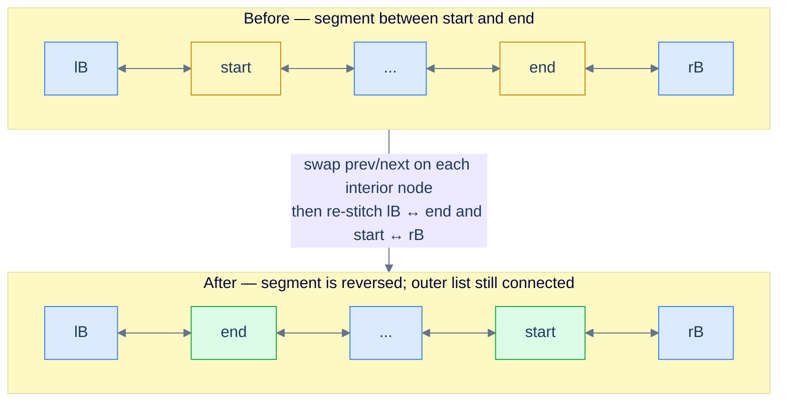
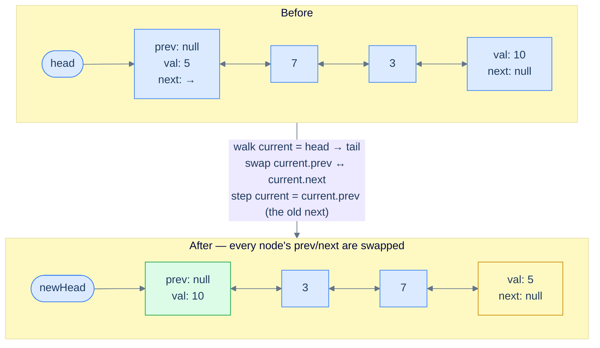
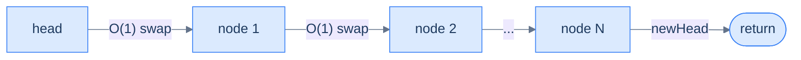
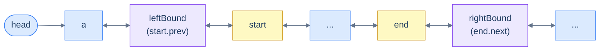
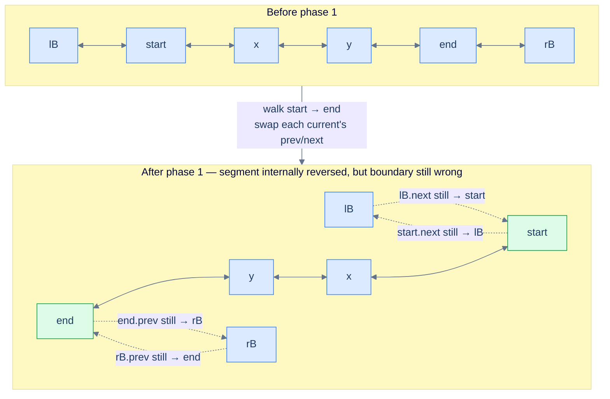
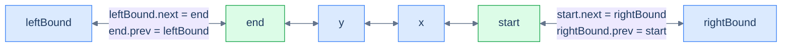
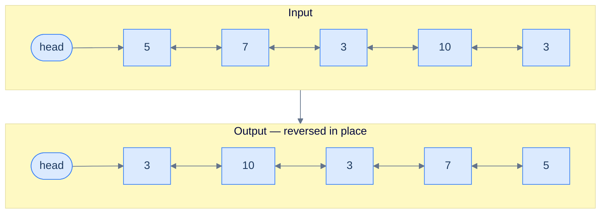

# Understanding the reversal pattern

Many doubly linked list problems boil down to one move: **reverse the entire list, or some contiguous segment of it**. Some problems ask for it directly ("reverse the list"). Others hide it inside a larger algorithm — reorder, palindrome-check, k-group rotate, undo-stack rewind. If you can do the reversal cleanly and cheaply, the rest of the problem usually falls out.

The naive instinct is to rebuild the list from scratch — collect values into an array, walk it backwards, allocate fresh nodes. That works, but it costs O(N) extra space and ignores the doubly linked list's biggest advantage. The right approach is **in-place, single pass, O(1) extra space** — and on a DLL it's startlingly short.

> 🖼 Diagram — Reversing a segment between start and end. The new boundary is leftBound (lB) ↔ end on one side and start ↔ rightBound (rB) on the other.


<p align="center"><strong>Reversing a segment between <code>start</code> and <code>end</code>. The new boundary is <code>leftBound (lB)</code> ↔ <code>end</code> on one side and <code>start</code> ↔ <code>rightBound (rB)</code> on the other.</strong></p>

The **reversal pattern** is the family of linked list problems that can be solved by applying this single primitive — reverse a list, or a segment of one — possibly multiple times.

> *Before reading on — pause and predict. If every node already stores its `prev`, what is the **minimum** work you need to do at each node to reverse the list? What does each node "look like" after that work?*

## Reversing the entire list

Reversing the whole list is the special case where the segment runs from `head` all the way to the tail. We start with this case because it is the easiest to picture — but the code below is the fully general segment routine: it takes `start` and `end`, swaps every node in between, and stitches the result back to whatever neighbours sat outside the segment. For a whole-list reversal you simply pass `start = head` and `end = tail`; both boundary neighbours are then `null` and the stitching is a no-op.

The mental model is one line: **at each node, swap `prev` and `next`. Then move on.** That's the entire reversal. The reason it works is the symmetry of a doubly linked list — if you flip every node's two pointers, every existing `A → B` link becomes `A ← B`, and every existing `A ← B` link becomes `A → B`. Forward and backward chains *both* get reversed in the same sweep.

> 🖼 Diagram — Whole-list reversal. After every node's prev and next are swapped, the original tail becomes the new head and the original head becomes the new tail.


<p align="center"><strong>Whole-list reversal. After every node's <code>prev</code> and <code>next</code> are swapped, the original tail becomes the new head and the original head becomes the new tail.</strong></p>

There's one subtle move worth highlighting. After we swap a node's pointers, its old `next` is now sitting in `prev`. So to advance to the next node in the original list, we walk via `current.prev` — because *that field used to be `current.next` half a line ago*. This is the only "trick" in the algorithm, and it stops being tricky the moment you say it out loud.

Before the walk begins we capture two boundary references — `left_bound = start.prev` and `right_bound = end.next` — because the swaps will overwrite those fields. The loop runs `current` from `start` and stops the moment it reaches `right_bound`. Once the interior is reversed, four boundary writes re-stitch the segment to its neighbours: `start` is the segment's new tail, so `start.next = right_bound` and `right_bound.prev = start`; `end` is the new head, so `end.prev = left_bound` and `left_bound.next = end`. Each `if` guards the case where a boundary neighbour is `null`. For a whole-list reversal both neighbours are `null`, so `end` — the original tail — ends up as the new head.

## Algorithm

The algorithm below summarizes the in-place reversal of a doubly linked list segment between `start` and `end` — pass `start = head` and `end = tail` to reverse the entire list.

> **Algorithm**
>
> -   **Step 1:** If `start` equals `end`, the segment has a single node — nothing to reverse, so return.
> -   **Step 2:** Capture `leftBound` with `start.prev` and `rightBound` with `end.next` *before* any swap (either may be `null`).
> -   **Step 3:** Initialize `current` with `start` and iterate until `current` reaches `rightBound`. In each iteration do the following:
>     -   **Step 3.1:** Swap `current.next` and `current.prev`.
>     -   **Step 3.2:** Set `current` to `current.prev` to step to the next node in the *original* order (the field that used to be `next`).
> -   **Step 4:** Connect the new tail of the segment: set `start.next` to `rightBound`, and if `rightBound` is not `null`, set `rightBound.prev` to `start`.
> -   **Step 5:** Connect the new head of the segment: set `end.prev` to `leftBound`, and if `leftBound` is not `null`, set `leftBound.next` to `end`.

## Implementation

The code implementation of the segment reversal — which reverses the entire list when called with `start = head` and `end = tail` — is given below.


```python run

"""
Definition for doubly-linked list.
class ListNode:
    def __init__(self, val):
        self.val = val
        self.prev = None
        self.next = None
"""

from typing import Optional

def reverse(start: Optional[ListNode], end: Optional[ListNode]) -> None:
    # If the start and end nodes are the same, no reversal needed
    if start == end:
        return

    # Initialize leftBound and rightBound
    left_bound = start.prev  # start can never be null
    right_bound = end.next   # end can never be null

    # Initialize current pointer
    current = start

    # 1. Swap next and prev pointers of nodes until the rightBound
    while current != right_bound:
        # Swap prev and next for the current node
        current.prev, current.next = current.next, current.prev
        # Move to the previous node (which is now in the next pointer due to swap)
        current = current.prev

    # 2. Update boundary nodes

    # Correctly connect the new tail (start) of the reversed segment to the parent list
    start.next = right_bound
    if right_bound:
        right_bound.prev = start

    # Correctly connect the new head (end) of the reversed segment to the parent list
    end.prev = left_bound
    if left_bound:
        left_bound.next = end
```

```java run

/**
 * Definition for doubly-linked list.
 * class ListNode {
 *     int val;
 *     ListNode prev;
 *     ListNode next;
 *     ListNode() {}
 *     ListNode(int val) { this.val = val; }
 * };
 */

class ReverseALinkedList {

        public void reverse(ListNode start, ListNode end) {
        // If the start and end nodes are the same, no reversal needed
        if (start == end) {
            return;
        }

        // Initialize leftBound and rightBound
        ListNode leftBound = start.prev; // start can never be null
        ListNode rightBound = end.next; // end can never be null

        // Initialize current pointer to the start node
        ListNode current = start;

        // 1. Swap next and prev pointers of nodes within the segment
        while (current != rightBound) {
            // Swap the previous and next pointers
            ListNode temp = current.prev;
            current.prev = current.next;
            current.next = temp;

            // Move to what was previously the previous node (now stored in prev)
            current = current.prev;
        }

        // 2. Update boundary nodes

        // Correctly connect the new tail of the reversed segment to the rightBound
        start.next = rightBound;
        if (rightBound != null) {
            rightBound.prev = start;
        }

        // Correctly connect the new head of the reversed segment to the leftBound
        end.prev = leftBound;
        if (leftBound != null) {
            leftBound.next = end;
        }
    }
}
```


## Complexity Analysis

We visit every node exactly once and do O(1) work at each — a swap and a step. The space is just three local references regardless of list size.

> 🖼 Diagram — One linear sweep, constant work per node, constant extra memory.


<p align="center"><strong>One linear sweep, constant work per node, constant extra memory.</strong></p>

> **Best Case** — list is empty or has a single node.
>
> -   Space Complexity — **O(1)**
> -   Time Complexity — **O(1)**
>
> **Worst Case** — list has N nodes.
>
> -   Space Complexity — **O(1)**
> -   Time Complexity — **O(N)**

We can reverse the whole list now. But what if the problem only wants a slice — say, "reverse the nodes between position 3 and position 7"? The interior swap is identical; only the boundary plumbing changes. Let's see exactly how.

# Reversing a segment

Reversing a segment between two given nodes is the **general** form of the algorithm. The whole-list case is just the version where the segment happens to span everything. Here we are given two references — `start` and `end` — that point to two nodes in the list, with `start` somewhere before `end` in forward traversal order. The job: reverse the chunk from `start` to `end` (inclusive), and leave the rest of the list correctly attached on both sides.

For this lesson, assume `start` and `end` are non-null and that `start` is reachable from `head` and `end` is reachable from `start`.

> 🖼 Diagram — Setup — capture leftBound (the node before start) and rightBound (the node after end) before we start swapping. These two references will be used at the end to re-stitch the reversed segment back into the parent list.


<p align="center"><strong>Setup — capture <code>leftBound</code> (the node before <code>start</code>) and <code>rightBound</code> (the node after <code>end</code>) <em>before</em> we start swapping. These two references will be used at the end to re-stitch the reversed segment back into the parent list.</strong></p>

We capture two extra references **before any pointer is mutated**:

- `leftBound = start.prev` — the node that sits to the left of the segment
- `rightBound = end.next` — the node that sits to the right of the segment

Either one can be `null` (if the segment touches the head or the tail), so we handle them with null checks at stitching time. The reason we capture them up front is the same save-before-clobber discipline from the deletion lesson: once we start swapping pointers inside the segment, `start.prev` and `end.next` no longer mean what they meant a moment ago.

The algorithm splits cleanly into two phases.

### 1. Swap `next` and `prev` on each segment node

Walk `current` from `start` until it reaches `rightBound`. At each step, swap `current.prev` and `current.next`, then advance to the next node in the *original* order — which, post-swap, is now sitting in `current.prev`.

> 🖼 Diagram — After phase 1 the interior is reversed — end is the new head of the segment and start is the new tail — but the boundary pointers are still tangled with their original neighbours. Phase 2 fixes that.


<p align="center"><strong>After phase 1 the interior is reversed — <code>end</code> is the new head of the segment and <code>start</code> is the new tail — but the boundary pointers are still tangled with their original neighbours. Phase 2 fixes that.</strong></p>

### 2. Re-stitch the reversed segment to the parent list

After phase 1, the reversed segment is dangling — its connections to `leftBound` and `rightBound` are wrong. Specifically, after the swaps, `start.next` now points at the *old* `leftBound`, and `end.prev` now points at the *old* `rightBound`. We fix this in two symmetric strokes.

**Tail of the reversed segment** — `start` is now the last node of the reversed slice. Its `next` should be `rightBound`. Mirror that: `rightBound.prev = start` (if `rightBound` exists).

**Head of the reversed segment** — `end` is now the first node of the reversed slice. Its `prev` should be `leftBound`. Mirror that: `leftBound.next = end` (if `leftBound` exists).

> 🖼 Diagram — Final stitch — four pointer assignments (with null guards) reattach the reversed segment to the parent list. Both directions stay consistent.


<p align="center"><strong>Final stitch — four pointer assignments (with null guards) reattach the reversed segment to the parent list. Both directions stay consistent.</strong></p>

> *Predict before reading on — what happens if we forget to update `rightBound.prev` after the swap? In which direction would the list look correct, and in which direction would it break?*

If you skip `rightBound.prev = start`, a forward walk from `head` looks fine — `start.next = rightBound` still works going forward. But the moment you walk *backward* from any node beyond the segment, you'll arrive at `rightBound` and follow its stale `prev` pointer right back into the middle of the reversed segment, jumping past `start` entirely. Backward traversal silently corrupts. This is the doubly linked list tax — every link is two pointers, and forgetting the mirror is the most common bug.

<details>
<summary><h2>Algorithm</h2></summary>


The algorithm below summarizes the doubly linked list segment reversal.

> **Algorithm**
>
> -   **Step 1:** If `start == end`, the segment has one node — nothing to reverse, return.
> -   **Step 2:** Capture `leftBound = start.prev` and `rightBound = end.next` *before* mutating anything (either may be `null`).
> -   **Step 3:** Initialize `current = start` and iterate until `current == rightBound`. In each iteration:
>     -   **Step 3.1:** Swap `current.prev` and `current.next`.
>     -   **Step 3.2:** Advance `current = current.prev` (the old `next`, post-swap).
> -   **Step 4:** Stitch the new tail of the segment to the parent list: set `start.next = rightBound`; if `rightBound` is non-null, set `rightBound.prev = start`.
> -   **Step 5:** Stitch the new head of the segment to the parent list: set `end.prev = leftBound`; if `leftBound` is non-null, set `leftBound.next = end`.

</details>
<details>
<summary><h2>Solution &amp; Analysis</h2></summary>

### Implementation

Given below is the code implementation to reverse a doubly linked list segment between `start` and `end`.


```python run
class Solution:
    def reverse(self, start, end):
        # Single-node segment — nothing to reverse
        if start == end:
            return

        # Capture boundary refs BEFORE any swap — they will be invalid after.
        left_bound  = start.prev   # may be None if segment touches the head
        right_bound = end.next     # may be None if segment touches the tail

        # Phase 1 — swap prev/next on every node from start up to (not including) right_bound
        current = start
        while current != right_bound:
            # The entire reversal at this node — flip its two pointers
            current.prev, current.next = current.next, current.prev
            # The original next is now in prev; that's how we advance in source order
            current = current.prev

        # Phase 2 — re-stitch the reversed segment to the parent list

        # New tail of the segment is `start` — connect it to right_bound (mirror both sides)
        start.next = right_bound
        if right_bound is not None:
            right_bound.prev = start

        # New head of the segment is `end` — connect it to left_bound (mirror both sides)
        end.prev = left_bound
        if left_bound is not None:
            left_bound.next = end
```

```java run
public class Main {
    static class ListNode { int val; ListNode prev, next; ListNode(int v){val=v;} }

    static class Solution {
        public void reverse(ListNode start, ListNode end) {
            // Single-node segment — nothing to reverse
            if (start == end) return;

            // Capture boundary refs BEFORE any swap — they become invalid after
            ListNode leftBound  = start.prev;  // may be null if segment touches head
            ListNode rightBound = end.next;    // may be null if segment touches tail

            // Phase 1 — swap prev/next on every node from start up to rightBound
            ListNode current = start;
            while (current != rightBound) {
                ListNode temp = current.prev;
                current.prev  = current.next;
                current.next  = temp;
                // Original next is now in prev — that's our walk direction
                current = current.prev;
            }

            // Phase 2 — stitch reversed segment back into the parent list
            start.next = rightBound;                         // new tail of segment → rightBound
            if (rightBound != null) rightBound.prev = start; // mirror

            end.prev = leftBound;                            // new head of segment → leftBound
            if (leftBound != null) leftBound.next = end;     // mirror
        }
    }

    public static void main(String[] args) {
        ListNode n1=new ListNode(5),n2=new ListNode(7),n3=new ListNode(3),n4=new ListNode(10),n5=new ListNode(6);
        n1.next=n2; n2.prev=n1; n2.next=n3; n3.prev=n2; n3.next=n4; n4.prev=n3; n4.next=n5; n5.prev=n4;
        new Solution().reverse(n2, n4);
        for (ListNode c=n1;c!=null;c=c.next) System.out.print(c.val+" ");
        // 5 10 3 7 6
    }
}
```

### Complexity Analysis

Phase 1 visits each node in the segment exactly once with O(1) work per node. Phase 2 is a fixed four-pointer reattachment. The space cost is two boundary references and one walk pointer — constant.

> **Best Case** — `start == end`.
>
> -   Space Complexity — **O(1)**
> -   Time Complexity — **O(1)**
>
> **Worst Case** — segment spans the entire list.
>
> -   Space Complexity — **O(1)**
> -   Time Complexity — **O(N)**

We have the primitive. Now the more interesting question: when do we *recognise* a problem as a reversal-pattern problem in the first place?

</details>

# Applications

Many doubly linked list problems can be classified as reversal pattern problems. Some are solved by directly applying the reversal algorithm (the entire problem *is* a reversal), while others embed reversal as a subproblem inside a larger algorithm.

> -   **Direct application** — the problem statement asks for a reversal, possibly with an extra constraint like "first K nodes" or "between positions L and R".
> -   **Subproblem** — the algorithm reverses one or more segments as part of a bigger move (e.g. rotate the list, reorder alternately, group-reverse every K).

We will examine techniques for identifying both categories. Let's start with the easier of the two — the direct applications.

# Identifying direct application

The reversal algorithm can be applied directly when the problem reduces to reversing a known segment of the list. These are usually classified as **easy** problems. If a problem statement (or a step in its solution) fits the template below, you can plug the reversal algorithm in directly.

> **Template:** Given a doubly linked list and two nodes `start` and `end`, reverse the segment between them.

Several variants of this template show up over and over:

- "Reverse the entire list" → `start = head`, `end = tail`.
- "Reverse the first K nodes" → `start = head`, `end = the K-th node`.
- "Reverse the last K nodes" → `start = the (N − K + 1)-th node`, `end = tail`.
- "Reverse the segment between positions L and R" → `start = L-th node`, `end = R-th node`.

Once you spot the shape, the work splits into two clean halves: **(a)** locate `start` and `end` (sometimes a small traversal, sometimes free if `head` is given), and **(b)** call the reversal primitive.

## Example

To make the identification concrete, here's a problem and the reasoning that flags it as a direct application.

> **Problem statement:** Given a doubly linked list, reverse it in place.

> 🖼 Diagram — Reverse the given linked list in place.


<p align="center"><strong>Reverse the given linked list in place.</strong></p>

### Linked list reversal algorithm

The problem fits the template with `start = head` and `end = tail` — the segment is the entire list. So this is the whole-list flavour we already saw: walk `current` from `head`, swap `prev` and `next` at every node, capture the new head when `current.prev` becomes `null` after a swap, and return it.

Below is the whole-list implementation, which tracks `newHead` directly instead of taking explicit `start`/`end` boundaries.


```python run

"""
Definition for doubly-linked list.
class ListNode:
    def __init__(self, val):
        self.val = val
        self.prev = None
        self.next = None
"""

from typing import Optional

def reverse_a_linked_list(head: Optional[ListNode]) -> Optional[ListNode]:
    # If the head is null or if it's the only node in the list, return the head as it is
    if not head or (not head.next):
        return head

    # Reference to track the current node
    current = head

    # Reference to hold the reversed head
    new_head = None

    while current is not None:
        # Swap the previous and next pointers of the current node
        current.prev, current.next = current.next, current.prev

        # If the previous node is now null, the current node is the new head
        if current.prev is None:
            new_head = current

        # Move the current reference to the next node, which is now the previous node
        current = current.prev

    # Return the new head, which was the last node in the original list
    return new_head
```

```java run

/**
 * Definition for doubly-linked list.
 * class ListNode {
 *     int val;
 *     ListNode prev;
 *     ListNode next;
 *     ListNode() {}
 *     ListNode(int val) { this.val = val; }
 * };
 */

public class Reverse {

    public ListNode reverse(ListNode head) {
        // If the head is null or if it's the only node in the list, return the head as it is
        if (head == null || (head.next == null)) {
            return head;
        }

        // Reference to track the current node
        ListNode current = head;

        // Reference to hold the reversed head
        ListNode newHead = null;

        while (current != null) {
            // Swap the previous and next pointers
            ListNode temp = current.prev;
            current.prev = current.next;
            current.next = temp;

            // If the previous node is now null, the current node is the new head
            if (current.prev == null) {
                newHead = current;
            }

            // Move the current reference to the next node, which is now the previous node
            current = current.prev;
        }

        // Return the new head, which was the last node in the original list
        return newHead;
    }
}
```


## Example Problems

Most direct-application problems are **easy** — the algorithm is the same, only the framing changes. The list below previews the four we'll solve in detail next.

> -   **Reverse a list** — the canonical whole-list reversal.
> -   **Reverse first K nodes** — reverse a prefix, leave the suffix untouched.
> -   **Reverse last K nodes** — reverse a suffix, leave the prefix untouched.
> -   **Reverse the given segment** — reverse a slice between positions `left` and `right`.

We'll now solve each one and watch the same primitive show up in four slightly different costumes.

<!-- ============================================== -->
<!-- SWEEP 2 — missing sections (placeholders only) -->
<!-- ============================================== -->

<!-- TODO: Why Naive Isn't Enough — missing, needs to be written -->
<!--       Guidance: motivation for why the obvious approach fails -->

<!-- TODO: The Core Idea — missing, needs to be written -->
<!--       Guidance: one paragraph: the central trick -->

<!-- TODO: How the Pointers/Window Move — missing, needs to be written -->
<!--       Guidance: mechanics of the moving parts -->

<!-- TODO: The Generic Algorithm — missing, needs to be written -->
<!--       Guidance: numbered steps, no code -->

<!-- TODO: Generic Implementation — missing, needs to be written -->
<!--       Guidance: Python block + Java block of the skeleton -->

<!-- TODO: Variants / Taxonomy — missing, needs to be written -->
<!--       Guidance: enumerate sub-shapes of this pattern -->

<!-- TODO: Recognition Checklist — missing, needs to be written -->
<!--       Guidance: 4-question diagnostic — the source of the Problem-section Diagnostic Questions -->

<!-- TODO: Canonical Example — missing, needs to be written -->
<!--       Guidance: fully worked example: brute force → optimised → template fit -->

<!-- TODO: Problems in This Category — missing, needs to be written -->
<!--       Guidance: table with links to the 02-problems/ files -->
