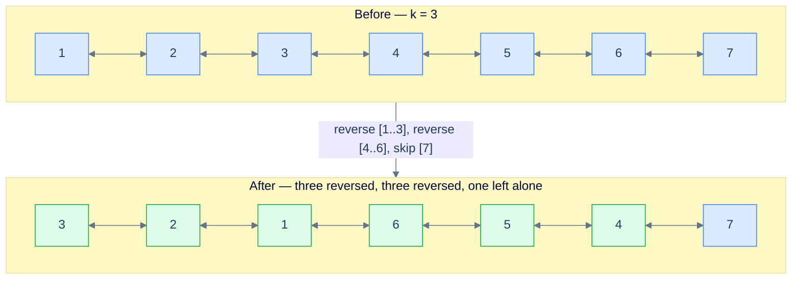
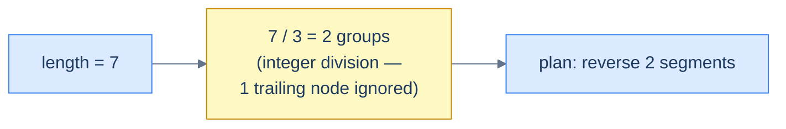
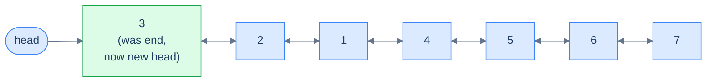
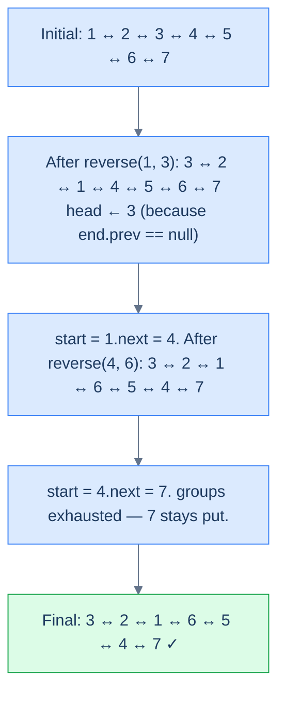

# Identifying reversal subproblem

In the previous lesson, the entire problem **was** the reversal. Here, the reversal is the **engine**, but it's not the whole car. These are the medium-and-hard problems where the question seems to be about *grouping*, *swapping*, or *alternating* — but underneath, every step is just "pick a window, reverse it, move on." The hard part is no longer the reversal; it's **deciding the windows** and stitching them back together without breaking the doubly-linked invariants.

These problems share a dangerous trait: they're **implementation-heavy**. The reversal helper alone is twenty lines. Add a head-tracker, a length scan, and a window walker and you're at fifty. One missed `prev` mirror and the backward chain silently dies while the forward chain looks pristine. The good news: every problem in this family answers two diagnostic questions the same way — and once you wire the answer to a template, the implementation writes itself.

## The Two Diagnostic Questions

> **Q1.** Can the problem or solution be broken down into smaller subproblems?
>
> **Q2.** Can any of those subproblems be solved by reversing a part of the linked list?

If the answer to both is **yes**, you're in this pattern. The proof is constructive: the moment you can describe the answer as "a sequence of segment reversals on the original list", you've already found the algorithm — you just have to write the loop that picks each segment.

## Worked example — Reverse in groups of K

Let's apply the diagnostic to a concrete problem before we dive into the catalogue.

> **Problem statement:** Given a doubly linked list, reverse the list in groups of `K` in place. If the last group has fewer than `K` nodes, leave it alone.

Take `k = 3` and a list of size 7. The output is the first three nodes reversed, the next three nodes reversed, and the trailing one node untouched.

> 🖼 Diagram — Reverse the given linked list in groups of k. The trailing fragment shorter than k stays put.


<p align="center"><strong>Reverse the given linked list in groups of <code>k</code>. The trailing fragment shorter than <code>k</code> stays put.</strong></p>

### Q1 — Yes, it splits cleanly

The whole job factors into two pieces: a one-time **length scan** to compute `groups = length / k` (integer division — fractional tail is ignored on purpose), then `groups` independent **segment reversals**. That's it. No backtracking, no recomputation, no auxiliary data structure.

> 🖼 Diagram — Calculate the length and the number of groups to reverse. The fractional tail is dropped on purpose so short trailing segments stay un-reversed.


<p align="center"><strong>Calculate the length and the number of groups to reverse. The fractional tail is dropped on purpose so short trailing segments stay un-reversed.</strong></p>

### Q2 — Yes, every subproblem is "reverse between start and end"

Reversing a group of size `k` is exactly the lesson-5 generic reversal: pick a `start` node and a `end` node `k-1` hops later, hand them to `reverse(start, end)`, done. No new algorithm needed.

> 🖼 Diagram — Reverse the first group between start and end using the reversal algorithm from lesson 5. After the call, end sits where the head of this group lives.


<p align="center"><strong>Reverse the first group between <code>start</code> and <code>end</code> using the reversal algorithm from lesson 5. After the call, <code>end</code> sits where the head of this group lives.</strong></p>

### Tracking the new head

The first reversal is special: it changes the head of the **entire** list. After `reverse(start, end)` runs on the first group, the original `start` is now the segment's tail and `end` is the segment's new head. We detect this by checking `end.prev == null` — the only segment whose new head has no predecessor is the first one.

> 🖼 Diagram — The reversed head of the first group becomes the new head of the linked list. Detect by end.prev == null.


<p align="center"><strong>The reversed head of the first group becomes the new head of the linked list. Detect by <code>end.prev == null</code>.</strong></p>

### Advancing to the next group

After the reversal, `start` (the original first node of the segment) is now the segment's tail. The very next node — `start.next` — is the head of the next group. Move `start` there and loop.

> 🖼 Diagram — The node after the current start is the start of the next group. Reassign start = start.next.


<p align="center"><strong>The node after the current <code>start</code> is the start of the next group. Reassign <code>start = start.next</code>.</strong></p>

> *Friction prompt — before reading on:* what would happen if the loop counter `groups` were computed **inside** the loop instead of once before it? Predict the failure mode.
>
> Answer: each iteration would call `findLength` again (O(N) every time → O(N²) total), and worse, after the first reversal the list's structure has shifted — re-measuring would still give the same total length, but you'd be paying O(N²) for nothing. Compute it once.

### Putting it together — the full execution

> 🖼 Diagram — Reverse the doubly linked list in groups of K — full trace for k = 3 on a 7-node list.


<p align="center"><strong>Reverse the doubly linked list in groups of K — full trace for <code>k = 3</code> on a 7-node list.</strong></p>

### The implementation

The structure is dead simple: a `findLength` helper, a `getNodeAtPosition` helper, the lesson-5 `reverse(start, end)` helper, and a thin driver that picks segments and tracks the new head.


```python run
"""
Definition for doubly-linked list.
class ListNode:
    def __init__(self, val):
        self.val = val
        self.prev = None
        self.next = None
"""

from typing import Optional

class Solution:
    def find_length(self, head: Optional[ListNode]) -> int:
        length = 0
        while head is not None:
            length += 1
            head = head.next
        return length

    def get_node_at_position(
        self, head: Optional[ListNode], position: int
    ) -> Optional[ListNode]:
        current = head
        for _ in range(1, position):
            if current is None:
                break
            current = current.next
        return current

    def reverse(
        self, start: Optional[ListNode], end: Optional[ListNode]
    ) -> None:
        if start is None or start == end:
            return

        left_bound = start.prev
        right_bound = end.next if end else None
        current = start
        previous = left_bound

        while current != right_bound:
            next_node = current.next
            current.prev, current.next = current.next, current.prev
            previous = current
            current = next_node

        if start:
            start.next = right_bound
        if right_bound:
            right_bound.prev = start

        if end:
            end.prev = left_bound
        if left_bound:
            left_bound.next = end

    def reverse_k_segments(
        self, head: Optional[ListNode], k: int
    ) -> Optional[ListNode]:

        # If the list is empty, has only one node, or k is 1, no need to
        # reverse segments
        if head is None or head.next is None or k == 1:
            return head

        # Start of the current segment to be reversed
        start = head

        # Find the total number of segments in the linked list
        total_segments = self.find_length(head) // k

        # Loop through the list to reverse every k-length segment
        for _ in range(total_segments):

            # Get the end node of the current segment
            end = self.get_node_at_position(start, k)

            # Reverse the segment
            self.reverse(start, end)

            # Check if the existing head needs to be updated.
            if end and end.prev is None:

                # If previous pointer of the end node (which becomes start
                # after the swap) is null, it means we're at the first
                # segment. So, we need to update the head to the new head
                # node
                head = end

            # Move start to the next segment
            start = start.next

        # Return the head of the modified list
        return head
```

```java run
/**
 * Definition for doubly-linked list.
 * class ListNode {
 *     int val;
 *     ListNode prev;
 *     ListNode next;
 *     ListNode() {}
 *     ListNode(int val) { this.val = val; }
 * };
 */

class Solution {
    public int findLength(ListNode head) {
        int length = 0;
        while (head != null) {
            length++;
            head = head.next;
        }
        return length;
    }

    public ListNode getNodeAtPosition(ListNode head, int position) {
        ListNode current = head;
        for (int i = 1; i < position; i++) {
            current = current.next;
        }
        return current;
    }

    public void reverse(ListNode start, ListNode end) {
        if (start == null || start == end) {
            return;
        }

        ListNode leftBound = start.prev;
        ListNode rightBound = end.next;
        ListNode current = start;
        ListNode previous = leftBound;

        while (current != rightBound) {
            ListNode next = current.next;

            ListNode temp = current.prev;
            current.prev = current.next;
            current.next = temp;

            previous = current;
            current = next;
        }

        start.next = rightBound;
        if (rightBound != null) {
            rightBound.prev = start;
        }

        end.prev = leftBound;
        if (leftBound != null) {
            leftBound.next = end;
        }
    }

    public ListNode reverseKSegments(ListNode head, int k) {

        // If the list is empty, has only one node, or k is 1, no need to
        // reverse segments
        if (head == null || head.next == null || k == 1) {
            return head;
        }

        // Start of the current segment to be reversed
        ListNode start = head;

        // Find the total number of segments in the linked list
        int totalSegments = findLength(head) / k;

        // Loop through the list to reverse every k-length segment
        for (int i = 0; i < totalSegments; i++) {

            // Get the end node of the current segment
            ListNode end = getNodeAtPosition(start, k);

            // Reverse the segment
            reverse(start, end);

            // Check if the existing head needs to be updated.
            if (end.prev == null) {

                // If previous pointer of the end node (which becomes
                // start after the swap) is null, it means we're at the
                // first segment. So, we need to update the head to the
                // new head node
                head = end;
            }

            // Move start to the next segment
            start = start.next;
        }

        // Return the head of the modified list
        return head;
    }
}
```


<details>
<summary><strong>Trace — head = [1, 2, 3, 4, 5, 6, 7], k = 3</strong></summary>

```
length = 7,  totalSegments = 7 / 3 = 2  (the trailing 1 node is ignored)

Step 1 │ start = node(1)            │ end = node(3)            │ reverse(1, 3)
        │ list: 3 ↔ 2 ↔ 1 ↔ 4 ↔ 5 ↔ 6 ↔ 7
        │ end.prev == null → head = node(3)
        │ start ← start.next = node(4)

Step 2 │ start = node(4)            │ end = node(6)            │ reverse(4, 6)
        │ list: 3 ↔ 2 ↔ 1 ↔ 6 ↔ 5 ↔ 4 ↔ 7
        │ end.prev != null (it's node(1)) → head unchanged
        │ start ← start.next = node(7)

Done   │ 2 segments processed; node(7) left untouched (the fractional tail)
Result: [3, 2, 1, 6, 5, 4, 7] ✓
```

This trace shows the two key tricks: head promotion fires only on segment 1, and the trailing node is silently skipped because `totalSegments` is an integer division.

</details>

The walkthrough above is the entire pattern. Every problem in this lesson is a remix of: **scan the length, pick a window, call reverse, advance, repeat.** The differences come from how the window is chosen — fixed `k = 2`, fixed `k`, growing `k`, or alternating `k` — and one bookkeeping flag for "skip this segment".

## Example problems

Most problems in this category are **medium** or **hard** — not because the reversal itself is hard, but because the windowing and the head-tracking each have their own off-by-one traps. Here's the catalogue we'll work through:

> -   **[Pairwise swap](https://www.codeintuition.io/courses/doubly-linked-list/LloccimoAdOaA5jCVh3LA)**
> -   **[Reverse K-segments](https://www.codeintuition.io/courses/doubly-linked-list/MqIdyjaACWE6lCWQPkbor)**
> -   **[Reverse increasing groups](https://www.codeintuition.io/courses/doubly-linked-list/Bxh830bVxO2vpqteZxgi0)**
> -   **[Reverse alternate segments](https://www.codeintuition.io/courses/doubly-linked-list/6SUHrVVt18Q5cc7NOuJPp)**

Each one bolts onto the template above. Let's see them in order.

<!-- ============================================== -->
<!-- SWEEP 2 — missing sections (placeholders only) -->
<!-- ============================================== -->

<!-- TODO: Understanding the Pattern — missing, needs to be written -->
<!--       Guidance: umbrella H2 with the subsections below -->

<!-- TODO: Why Naive Isn't Enough — missing, needs to be written -->
<!--       Guidance: motivation for why the obvious approach fails -->

<!-- TODO: The Core Idea — missing, needs to be written -->
<!--       Guidance: one paragraph: the central trick -->

<!-- TODO: How the Pointers/Window Move — missing, needs to be written -->
<!--       Guidance: mechanics of the moving parts -->

<!-- TODO: The Generic Algorithm — missing, needs to be written -->
<!--       Guidance: numbered steps, no code -->

<!-- TODO: Generic Implementation — missing, needs to be written -->
<!--       Guidance: Python block + Java block of the skeleton -->

<!-- TODO: Complexity Analysis — missing, needs to be written -->
<!--       Guidance: table -->

<!-- TODO: Variants / Taxonomy — missing, needs to be written -->
<!--       Guidance: enumerate sub-shapes of this pattern -->

<!-- TODO: Recognition Checklist — missing, needs to be written -->
<!--       Guidance: 4-question diagnostic — the source of the Problem-section Diagnostic Questions -->

<!-- TODO: Canonical Example — missing, needs to be written -->
<!--       Guidance: fully worked example: brute force → optimised → template fit -->

<!-- TODO: Problems in This Category — missing, needs to be written -->
<!--       Guidance: table with links to the 02-problems/ files -->
