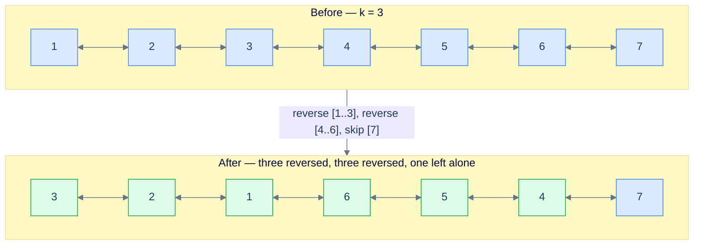
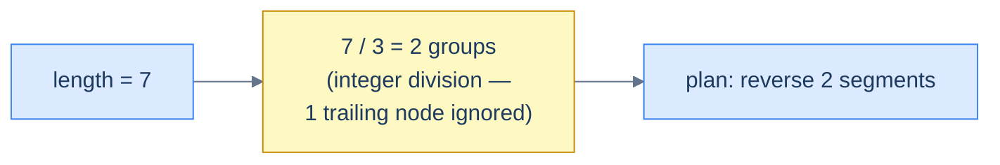
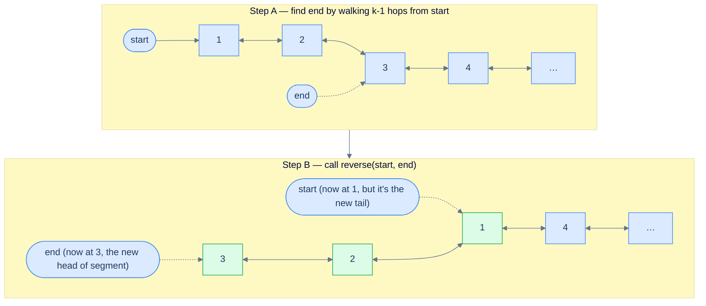
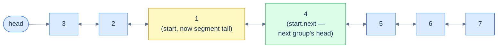
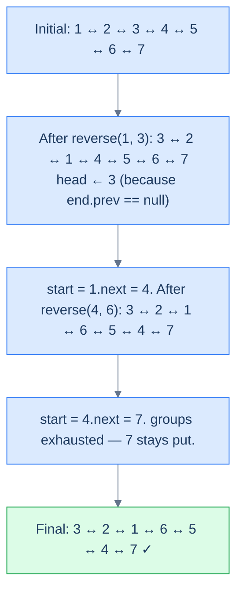

# Identifying reversal subproblem

In the previous lesson, the entire problem **was** the reversal. Here, the reversal is the **engine**, but it's not the whole car. These are the medium-and-hard problems where the question seems to be about *grouping*, *swapping*, or *alternating* — but underneath, every step is just "pick a window, reverse it, move on." The hard part is no longer the reversal; it's **deciding the windows** and stitching them back together without breaking the doubly-linked invariants.

These problems share a dangerous trait: they're **implementation-heavy**. The reversal helper alone is twenty lines. Add a head-tracker, a length scan, and a window walker and you're at fifty. One missed `prev` mirror and the backward chain silently dies while the forward chain looks pristine. The good news: every problem in this family answers two diagnostic questions the same way — and once you wire the answer to a template, the implementation writes itself.

## The Two Diagnostic Questions

> **Q1.** Can the problem or solution be broken down into smaller subproblems?
>
> **Q2.** Can any of those subproblems be solved by reversing a part of the linked list?

If the answer to both is **yes**, you're in this pattern. The proof is constructive: the moment you can describe the answer as "a sequence of segment reversals on the original list", you've already found the algorithm — you just have to write the loop that picks each segment.

## Worked example — Reverse in groups of K

Let's apply the diagnostic to a concrete problem before we dive into the catalogue.

> **Problem statement:** Given a doubly linked list, reverse the list in groups of `K` in place. If the last group has fewer than `K` nodes, leave it alone.

Take `k = 3` and a list of size 7. The output is the first three nodes reversed, the next three nodes reversed, and the trailing one node untouched.

> 🖼 Diagram — Reverse the given linked list in groups of k. The trailing fragment shorter than k stays put.


<p align="center"><strong>Reverse the given linked list in groups of <code>k</code>. The trailing fragment shorter than <code>k</code> stays put.</strong></p>

### Q1 — Yes, it splits cleanly

The whole job factors into two pieces: a one-time **length scan** to compute `groups = length / k` (integer division — fractional tail is ignored on purpose), then `groups` independent **segment reversals**. That's it. No backtracking, no recomputation, no auxiliary data structure.

> 🖼 Diagram — Calculate the length and the number of groups to reverse. The fractional tail is dropped on purpose so short trailing segments stay un-reversed.


<p align="center"><strong>Calculate the length and the number of groups to reverse. The fractional tail is dropped on purpose so short trailing segments stay un-reversed.</strong></p>

### Q2 — Yes, every subproblem is "reverse between start and end"

Reversing a group of size `k` is exactly the lesson-5 generic reversal: pick a `start` node and a `end` node `k-1` hops later, hand them to `reverse(start, end)`, done. No new algorithm needed.

> 🖼 Diagram — Reverse the first group between start and end using the reversal algorithm from lesson 5. After the call, end sits where the head of this group lives.


<p align="center"><strong>Reverse the first group between <code>start</code> and <code>end</code> using the reversal algorithm from lesson 5. After the call, <code>end</code> sits where the head of this group lives.</strong></p>

### Tracking the new head

The first reversal is special: it changes the head of the **entire** list. After `reverse(start, end)` runs on the first group, the original `start` is now the segment's tail and `end` is the segment's new head. We detect this by checking `end.prev == null` — the only segment whose new head has no predecessor is the first one.

> 🖼 Diagram — The reversed head of the first group becomes the new head of the linked list. Detect by end.prev == null.


<p align="center"><strong>The reversed head of the first group becomes the new head of the linked list. Detect by <code>end.prev == null</code>.</strong></p>

### Advancing to the next group

After the reversal, `start` (the original first node of the segment) is now the segment's tail. The very next node — `start.next` — is the head of the next group. Move `start` there and loop.

> 🖼 Diagram — The node after the current start is the start of the next group. Reassign start = start.next.


<p align="center"><strong>The node after the current <code>start</code> is the start of the next group. Reassign <code>start = start.next</code>.</strong></p>

> *Friction prompt — before reading on:* what would happen if the loop counter `groups` were computed **inside** the loop instead of once before it? Predict the failure mode.
>
> Answer: each iteration would call `findLength` again (O(N) every time → O(N²) total), and worse, after the first reversal the list's structure has shifted — re-measuring would still give the same total length, but you'd be paying O(N²) for nothing. Compute it once.

### Putting it together — the full execution

> 🖼 Diagram — Reverse the doubly linked list in groups of K — full trace for k = 3 on a 7-node list.


<p align="center"><strong>Reverse the doubly linked list in groups of K — full trace for <code>k = 3</code> on a 7-node list.</strong></p>

### The implementation

The structure is dead simple: a `findLength` helper, a `getNodeAtPosition` helper, the lesson-5 `reverse(start, end)` helper, and a thin driver that picks segments and tracks the new head.


```python run viz=linked-list viz-root=head
"""
Definition for doubly-linked list.
class ListNode:
    def __init__(self, val):
        self.val = val
        self.prev = None
        self.next = None
"""

from typing import Optional

class Solution:
    def find_length(self, head: Optional[ListNode]) -> int:
        length = 0
        while head is not None:
            length += 1
            head = head.next
        return length

    def get_node_at_position(
        self, head: Optional[ListNode], position: int
    ) -> Optional[ListNode]:
        current = head
        for _ in range(1, position):
            if current is None:
                break
            current = current.next
        return current

    def reverse(
        self, start: Optional[ListNode], end: Optional[ListNode]
    ) -> None:
        if start is None or start == end:
            return

        left_bound = start.prev
        right_bound = end.next if end else None
        current = start
        previous = left_bound

        while current != right_bound:
            next_node = current.next
            current.prev, current.next = current.next, current.prev
            previous = current
            current = next_node

        if start:
            start.next = right_bound
        if right_bound:
            right_bound.prev = start

        if end:
            end.prev = left_bound
        if left_bound:
            left_bound.next = end

    def reverse_k_segments(
        self, head: Optional[ListNode], k: int
    ) -> Optional[ListNode]:

        # If the list is empty, has only one node, or k is 1, no need to
        # reverse segments
        if head is None or head.next is None or k == 1:
            return head

        # Start of the current segment to be reversed
        start = head

        # Find the total number of segments in the linked list
        total_segments = self.find_length(head) // k

        # Loop through the list to reverse every k-length segment
        for _ in range(total_segments):

            # Get the end node of the current segment
            end = self.get_node_at_position(start, k)

            # Reverse the segment
            self.reverse(start, end)

            # Check if the existing head needs to be updated.
            if end and end.prev is None:

                # If previous pointer of the end node (which becomes start
                # after the swap) is null, it means we're at the first
                # segment. So, we need to update the head to the new head
                # node
                head = end

            # Move start to the next segment
            start = start.next

        # Return the head of the modified list
        return head
```

```java run viz=linked-list viz-root=head
/**
 * Definition for doubly-linked list.
 * class ListNode {
 *     int val;
 *     ListNode prev;
 *     ListNode next;
 *     ListNode() {}
 *     ListNode(int val) { this.val = val; }
 * };
 */

class Solution {
    public int findLength(ListNode head) {
        int length = 0;
        while (head != null) {
            length++;
            head = head.next;
        }
        return length;
    }

    public ListNode getNodeAtPosition(ListNode head, int position) {
        ListNode current = head;
        for (int i = 1; i < position; i++) {
            current = current.next;
        }
        return current;
    }

    public void reverse(ListNode start, ListNode end) {
        if (start == null || start == end) {
            return;
        }

        ListNode leftBound = start.prev;
        ListNode rightBound = end.next;
        ListNode current = start;
        ListNode previous = leftBound;

        while (current != rightBound) {
            ListNode next = current.next;

            ListNode temp = current.prev;
            current.prev = current.next;
            current.next = temp;

            previous = current;
            current = next;
        }

        start.next = rightBound;
        if (rightBound != null) {
            rightBound.prev = start;
        }

        end.prev = leftBound;
        if (leftBound != null) {
            leftBound.next = end;
        }
    }

    public ListNode reverseKSegments(ListNode head, int k) {

        // If the list is empty, has only one node, or k is 1, no need to
        // reverse segments
        if (head == null || head.next == null || k == 1) {
            return head;
        }

        // Start of the current segment to be reversed
        ListNode start = head;

        // Find the total number of segments in the linked list
        int totalSegments = findLength(head) / k;

        // Loop through the list to reverse every k-length segment
        for (int i = 0; i < totalSegments; i++) {

            // Get the end node of the current segment
            ListNode end = getNodeAtPosition(start, k);

            // Reverse the segment
            reverse(start, end);

            // Check if the existing head needs to be updated.
            if (end.prev == null) {

                // If previous pointer of the end node (which becomes
                // start after the swap) is null, it means we're at the
                // first segment. So, we need to update the head to the
                // new head node
                head = end;
            }

            // Move start to the next segment
            start = start.next;
        }

        // Return the head of the modified list
        return head;
    }
}
```


<details>
<summary><strong>Trace — head = [1, 2, 3, 4, 5, 6, 7], k = 3</strong></summary>

```
length = 7,  totalSegments = 7 / 3 = 2  (the trailing 1 node is ignored)

Step 1 │ start = node(1)            │ end = node(3)            │ reverse(1, 3)
        │ list: 3 ↔ 2 ↔ 1 ↔ 4 ↔ 5 ↔ 6 ↔ 7
        │ end.prev == null → head = node(3)
        │ start ← start.next = node(4)

Step 2 │ start = node(4)            │ end = node(6)            │ reverse(4, 6)
        │ list: 3 ↔ 2 ↔ 1 ↔ 6 ↔ 5 ↔ 4 ↔ 7
        │ end.prev != null (it's node(1)) → head unchanged
        │ start ← start.next = node(7)

Done   │ 2 segments processed; node(7) left untouched (the fractional tail)
Result: [3, 2, 1, 6, 5, 4, 7] ✓
```

This trace shows the two key tricks: head promotion fires only on segment 1, and the trailing node is silently skipped because `totalSegments` is an integer division.

</details>

The walkthrough above is the entire pattern. Every problem in this lesson is a remix of: **scan the length, pick a window, call reverse, advance, repeat.** The differences come from how the window is chosen — fixed `k = 2`, fixed `k`, growing `k`, or alternating `k` — and one bookkeeping flag for "skip this segment".

## Example problems

Most problems in this category are **medium** or **hard** — not because the reversal itself is hard, but because the windowing and the head-tracking each have their own off-by-one traps. Here's the catalogue we'll work through:

> -   **[Pairwise swap](https://www.codeintuition.io/courses/doubly-linked-list/LloccimoAdOaA5jCVh3LA)**
> -   **[Reverse K-segments](https://www.codeintuition.io/courses/doubly-linked-list/MqIdyjaACWE6lCWQPkbor)**
> -   **[Reverse increasing groups](https://www.codeintuition.io/courses/doubly-linked-list/Bxh830bVxO2vpqteZxgi0)**
> -   **[Reverse alternate segments](https://www.codeintuition.io/courses/doubly-linked-list/6SUHrVVt18Q5cc7NOuJPp)**

Each one bolts onto the template above. Let's see them in order.

---

## Understanding the Pattern

### Why Naive Isn't Enough

The full-list reversal from the previous lesson flips every link in one sweep and returns the new head — correct only when the whole list must be reversed. The moment the problem asks for *partial* flips — every adjacent pair, every block of `k`, every run satisfying a growing or alternating rule — a single sweep cannot express the intermediate seams. The naive workarounds are worse: copy values into an array, reorder them, and rebuild the list (`O(n)` extra space, throws away the doubly-linked invariants); or recompute boundaries by re-walking from `head` per chunk (`O(n²)` total).

To make this concrete: pairwise-swapping `1 ↔ 2 ↔ 3 ↔ 4` should produce `2 ↔ 1 ↔ 4 ↔ 3`. A full-list reversal returns `4 ↔ 3 ↔ 2 ↔ 1`. A value-copy approach allocates an `O(n)` array and dodges the requirement to rewrite `prev`/`next` pointers in place — the doubly-linked twist (every node carries *two* pointers that must stay mutually consistent) makes value-copy especially dangerous, because a half-finished swap silently corrupts the backward chain while the forward chain still looks valid.

So the key idea is: when a doubly-linked-list rewrite decomposes into many segment-sized reversals, treat the per-segment reversal as a primitive and drive it from an outer loop that walks the boundaries.

### The Core Idea

The pattern asks one question: **can the rewrite be expressed as a sequence of in-place segment reversals on a doubly linked list?**

Three concrete decomposition shapes recur in this section:

- **Fixed-size chunks** — slice the list into groups of `k` and reverse each (pairwise swap is `k = 2`, reverse-k-segments is general `k`).
- **Variable-size runs** — the chunk size changes between groups (reverse-increasing-groups grows the size `1, 2, 3, …`).
- **Conditional reversal** — walk the list in fixed-size chunks but reverse only some of them (reverse-alternate-segments flips every other chunk).

To make this concrete: in reverse-k-segments with `k = 3` on `1 ↔ 2 ↔ 3 ↔ 4 ↔ 5 ↔ 6 ↔ 7`, the outer driver slices the list into `[1, 2, 3]`, `[4, 5, 6]`, and the trailing fragment `[7]`. Each full chunk is reversed in place using the lesson-5 doubly-linked reversal — for every node inside the chunk, `prev` and `next` are swapped — and the four boundary pointers (`leftBound`, `start`, `end`, `rightBound`) are re-stitched bidirectionally so neither chain breaks. The outer loop runs `n / k` times; each inner reversal is `O(k)`; total cost is `O(n)`.

The core insight is: every reversal-subproblem solution on a doubly linked list is "outer driver picks the next chunk's boundary; inner segment-reversal swaps `prev`/`next` per node; seam stitcher reconnects both directions."

### How the Pointers/Window Move

The pattern uses four cooperating boundary pointers per chunk. The **outer driver** is whatever decides where the next chunk begins — a fixed count `total_segments = length / k`, a growing counter `group_size = 1, 2, 3, …`, or a toggling flag `should_reverse`. The driver walks forward through the list and never re-visits a node.

The four boundary pointers are:

- **`leftBound`** — the node immediately *before* the chunk's first node. Cached inside the `reverse` helper as `start.prev` so the predecessor's `next` can be re-pointed at the reversed chunk's new head, and so the new head's `prev` can point back at it. For the very first chunk it is `None`, which the outer driver detects via `end.prev == None` *after* the reversal — the only chunk whose new head has no predecessor is the first one.
- **`start`** — the chunk's first node *before* reversal. After reversal, `start` becomes the chunk's tail; its `next` is the natural `rightBound`, and the next iteration's `start.next` advance lands on the next chunk's head because the seam stitch put it there.
- **`end`** — the chunk's last node *before* reversal. Reached by advancing `start` by `k − 1` hops (or `group_size − 1`). After reversal, `end` is the chunk's new head.
- **`rightBound`** — implicit; it's `end.next` cached inside the `reverse` helper before the flip starts. The primitive uses it to know when to stop *and* to re-stitch the reversed chunk's tail (`start.next = rightBound; rightBound.prev = start`).

Each chunk goes through the same four steps: find `end` by walking `k − 1` nodes from `start`; call `reverse(start, end)` which swaps `prev`/`next` on every node in `[start, end]` and re-stitches the four boundary links bidirectionally; check `end.prev == None` to detect the first chunk and update the global `head`; advance — `start = start.next`, which is now the next chunk's head because the seam stitch put it there.

Crucially, the inner reversal preserves the doubly-linked invariant: at every step `current.next` and `current.prev` are swapped together, and after the loop the four boundary links (`leftBound.next`, `start.prev` was the old `leftBound`, `end.prev`, `rightBound.prev`) are stitched in a single block so both directions agree. The outer driver establishes the segment boundary before the inner call; the inner call never crosses it.

---

## The Generic Algorithm

The pattern follows the same five-step skeleton regardless of which decomposition shape it takes.

1. **Measure or precompute what you need.** Most variants want the list length up front (`length = findLength(head)`), because the outer driver needs to know when to stop and avoid running off the end mid-chunk. Pairwise swap can skip this because the per-iteration check `start != None and start.next != None` already guards the boundary.
2. **Initialise the boundary pointer.** Set `start = head`. There is no explicit `leftBound` variable in the doubly-linked driver — the helper reads `start.prev` inside `reverse(start, end)`, so the predecessor is always available without a separate cache. The first-chunk detection is post-hoc: `end.prev == None` after reversal.
3. **Drive the outer loop.** Iterate until the remaining list is too short for the next chunk. At each step, advance `end` by `k − 1` hops from `start` to mark the chunk's boundary. If the chunk size varies (reverse-increasing-groups) or the chunk is conditionally skipped (reverse-alternate-segments), apply that rule here.
4. **Run the inner segment reversal.** Call the shared `reverse(start, end)` helper, which swaps `prev`/`next` on every node in `[start, end]` and bidirectionally re-stitches the four boundary links (`leftBound.next ↔ end`, `start.next ↔ rightBound`). After the call, the chunk's nodes are in reversed order with both chains intact. If `end.prev == None`, promote `head = end` — this is the first chunk and its new head has no predecessor.
5. **Slide the boundary forward.** After a reversal, the old `start` is the chunk's tail in the new ordering, so `start.next` points at the next chunk's head. Set `start = start.next` and repeat. For the conditional-reversal variant, the "skip" branch instead does `start = end; start = start.next` so the boundary still lands on the next chunk's head — `end` is the segment's tail in the skip case because no reversal happened.

If the variant introduces a per-chunk decision (skip vs. reverse, grow vs. fixed), it slots into step 3 or step 5 — the surrounding scaffold does not change.

---

## Complexity Analysis

| | Complexity | Reason |
|---|---|---|
| **Time** | `O(n)` | The outer driver walks the list once. Each chunk's inner reversal swaps `prev`/`next` on its own `k` nodes and never revisits a node. Finding `end` is part of the same forward walk. Total work is one constant-factor pass — slightly higher constant than the singly-linked case because every node touches two pointers per swap. |
| **Space** | `O(1)` | The four boundary pointers, the counter, and the optional flag are constants. No auxiliary array or recursion stack is allocated; the list is rewritten in place. |

The constant factor is small but real — each node is touched once during the boundary walk that finds `end`, and once again during the inner flip. Two passes per node is still `O(n)`. The bidirectional stitch at the end of `reverse` adds at most four pointer writes per chunk, independent of `k`.

---

## Variants / Taxonomy

The pattern shows up in four recognisable sub-shapes. Each maps to a different outer-driver rule; the inner reversal primitive is identical.

- **Pairwise swap (`k = 2`)** — the outer driver is a `while start and start.next` guard; every chunk is a pair, and the reversal degenerates to "swap two adjacent nodes" (still a four-pointer dance because the doubly-linked invariants must be preserved). This is the simplest concrete instance of the pattern.
- **Reverse-k-segments (fixed `k ≥ 2`)** — the outer driver runs `length / k` times. Every full chunk is reversed; any trailing fragment of length `< k` is left untouched. The general form of pairwise swap.
- **Reverse-increasing-groups (growing `k`)** — the outer driver uses a counter `group_size = 1, 2, 3, …`. After each chunk, the counter grows and the remaining length shrinks. The loop stops when `length < group_size`. The chunk of size `1` is a degenerate no-op (the `start == end` guard inside `reverse` short-circuits).
- **Reverse-alternate-segments (conditional reversal)** — the outer driver walks fixed-size chunks but flips a boolean `should_reverse` each iteration. On `True` iterations the chunk is reversed; on `False` iterations the algorithm advances `start = end; start = start.next` so the boundary skips the untouched run and lands on the next chunk's head.

The shape of the outer driver's rule determines the variant; the inner reversal call and the seam-stitch step are common code.

---

## Recognition Checklist

The pattern fits when **all four** answers are "yes". The first two diagnose whether the problem is a reversal-subproblem at all; the last two confirm the inner segment reversal is feasible on a doubly linked list.

- Can the problem or solution be broken down into smaller subproblems that operate on contiguous chunks of the list?
- Can any subproblem be solved by reversing a part of the doubly linked list — i.e., swapping `prev`/`next` on each node between an inner `start` and `end` and re-stitching the four boundary links?
- Does the algorithm only need to walk each node a constant number of times — no random access, no per-chunk re-traversal from the head?
- Is each chunk's boundary computable from local state (`k`, a growing counter, a toggle) rather than from a global view of the list?

Common surface signals: "swap every two adjacent nodes," "reverse the list in groups of `k`," "reverse alternate segments of size `k`," "reverse the first/second half," "reverse a sub-list between positions `i` and `j`."

---

## Problems in This Category

| Problem | Subproblems | How segment reversal fits |
|---|---|---|
| **[Pairwise Swap](./02-problems/01-pairwise-swap.md)** | `n / 2` two-node reversals | Each chunk has `k = 2`; the reversal degenerates to swapping a pair of adjacent nodes while preserving both `prev` and `next` chains. |
| **[Reverse K-Segments](./02-problems/02-reverse-k-segments.md)** | `length / k` chunk reversals of size `k` | The general fixed-size form; trailing fragment of length `< k` is untouched. |
| **[Reverse Increasing Groups](./02-problems/03-reverse-increasing-groups.md)** | Chunks of size `1, 2, 3, …` | The chunk size grows after each iteration; the loop stops once the remaining length is too short. The first chunk of size `1` is a no-op the `reverse` helper short-circuits. |
| **[Reverse Alternate Segments](./02-problems/04-reverse-alternate-segments.md)** | Conditional chunk reversals of size `k` | The outer driver toggles a `should_reverse` flag; flipped chunks are reversed, skipped chunks just advance the boundary via `start = end; start = start.next`. |

Difficulty rises with the per-chunk decision: pairwise swap is a hard-coded `k = 2`; reverse-k-segments adds the general `k`; reverse-increasing-groups adds a growing counter; reverse-alternate-segments adds a conditional branch around the reversal call.
