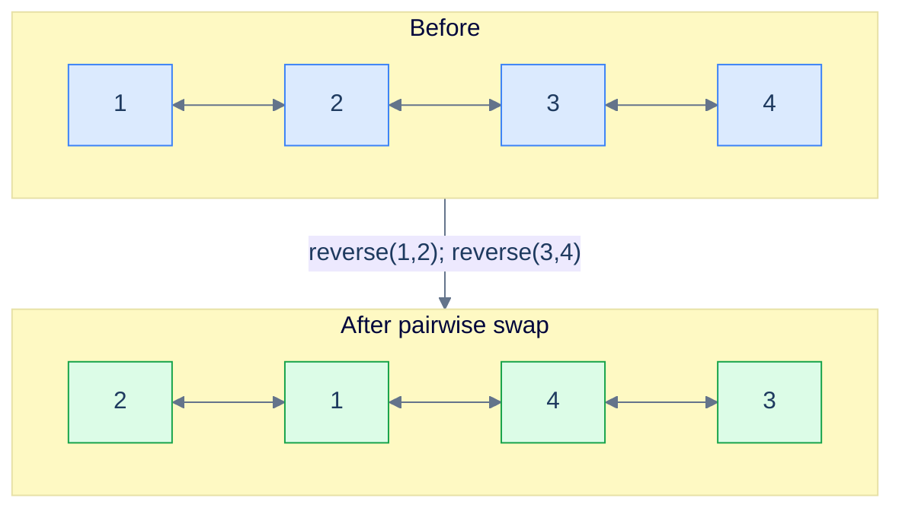
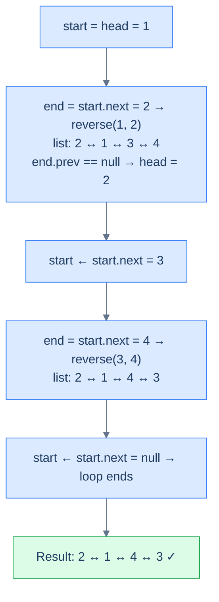

# Pairwise swap

## The Problem

Given the **head** of a doubly linked list, swap **every two adjacent nodes** and return the head of the reordered list. Solve it without modifying values — only relink pointers.

```
Input : head = [1, 2, 3, 4]
Output:        [2, 1, 4, 3]
Explanation: pairs (1,2) → (2,1) and (3,4) → (4,3).
```

<details>
<summary><h2>What Does "Pairwise Swap" Mean?</h2></summary>


A pairwise swap is just `reverseKSegments` with `k` hard-coded to `2`. Every window has exactly two nodes; `end` is always `start.next`; no `getNodeAtPosition` walk needed.

> 🖼 Diagram — Pairwise swap — every adjacent pair becomes a length-2 reversal.


<p align="center"><strong>Pairwise swap — every adjacent pair becomes a length-2 reversal.</strong></p>

</details>
<details>
<summary><h2>Applying the Diagnostic Questions</h2></summary>


| Question | Answer |
|---|---|
| **Q1.** Can the problem be broken into smaller subproblems? | **Yes** — one length-2 reversal per pair |
| **Q2.** Can each subproblem be solved by reversing a part of the list? | **Yes** — reverse(start, start.next) |

### Q1 — Why "one length-2 reversal per pair"?

Mental model: imagine the list as a row of dominos standing in pairs. Each pair is independent — flipping `(1,2)` doesn't affect `(3,4)`. So the whole job is a parade of identical, non-interfering reversals.

Concrete numbers: for `[1, 2, 3, 4, 5, 6]` you do three calls — `reverse(1,2)`, `reverse(3,4)`, `reverse(5,6)`. Three independent O(2) operations = O(N) total.

What breaks if you treat it as one big reversal: you get `[6, 5, 4, 3, 2, 1]` — full reverse, not pairwise. The "subproblem" view is what restricts each flip to a window of 2.

### Q2 — Why "reverse(start, start.next)"?

Mental model: with `k = 2`, the `end` pointer sits one hop away from `start` *by definition*. No length scan, no walker — just `end = start.next`.

Concrete numbers: at `start = 1`, `end = 1.next = 2`. Call `reverse(1, 2)`. After the call, `start` (node 1) is now the segment tail; `start.next` is node 3 — the head of the next pair. Loop.

What breaks if you skip the bidirectional check `start != null && start.next != null`: an odd-length list (e.g. `[1, 2, 3]`) tries to swap the lonely `3` with `null` and crashes.

</details>
<details>
<summary><h2>The Pairwise Strategy (Visualised)</h2></summary>


> 🖼 Diagram — The Pairwise Strategy — same template as reverseKSegments, with the window hard-pinned to 2.


<p align="center"><strong>The Pairwise Strategy — same template as <code>reverseKSegments</code>, with the window hard-pinned to 2.</strong></p>

</details>
<details>
<summary><h2>Solution &amp; Analysis</h2></summary>

### The Solution

```python run viz=linked-list viz-root=head
from typing import Optional

class ListNode:
    def __init__(self, val=0, prev=None, nxt=None):
        self.val = val
        self.prev = prev
        self.next = nxt


def from_list(values):
    if not values:
        return None
    head = ListNode(values[0])
    cur = head
    for v in values[1:]:
        node = ListNode(v, prev=cur)
        cur.next = node
        cur = node
    return head


def to_list(head):
    out = []
    while head is not None:
        out.append(head.val)
        head = head.next
    return out


class Solution:
    def reverse(
        self, start: Optional[ListNode], end: Optional[ListNode]
    ) -> None:
        if start is None or start == end:
            return

        left_bound = start.prev
        right_bound = end.next
        current = start
        previous = left_bound

        while current != right_bound:
            next_node = current.next
            current.prev, current.next = current.next, current.prev
            previous = current
            current = next_node

        start.next = right_bound
        if right_bound:
            right_bound.prev = start

        end.prev = left_bound
        if left_bound:
            left_bound.next = end

    def pairwise_swap(
        self, head: Optional[ListNode]
    ) -> Optional[ListNode]:

        # If the list is empty or has only one element, no reversal
        # needed.
        if head is None or head.next is None:
            return head

        # Start of the current pair to be reversed
        start = head

        # Loop while there are pairs to be swapped
        while start and start.next:

            # Get the end node of the current pair
            end = start.next

            # Reverse the pair
            self.reverse(start, end)

            # Check if the existing head needs to be updated.
            if end.prev is None:

                # If previous pointer of the end node (which become start
                # after the swap) is null, it means we're at the first
                # pair. So, we need to update the head to the new head
                # node
                head = end

            # Move start to the next pair
            start = start.next

        # Return the head of the modified list
        return head


# Examples from the problem statement
head = from_list([1, 2, 3, 4])
print(to_list(Solution().pairwise_swap(head)))         # [2, 1, 4, 3]

# Edge cases
head = from_list([])
print(to_list(Solution().pairwise_swap(head)))         # []

head = from_list([1])
print(to_list(Solution().pairwise_swap(head)))         # [1]

head = from_list([1, 2])
print(to_list(Solution().pairwise_swap(head)))         # [2, 1]

head = from_list([1, 2, 3])
print(to_list(Solution().pairwise_swap(head)))         # [2, 1, 3]

head = from_list([1, 2, 3, 4, 5, 6])
print(to_list(Solution().pairwise_swap(head)))         # [2, 1, 4, 3, 6, 5]

head = from_list([5, 5, 5, 5])
print(to_list(Solution().pairwise_swap(head)))         # [5, 5, 5, 5]

head = from_list([1, 2, 3, 4, 5])
print(to_list(Solution().pairwise_swap(head)))         # [2, 1, 4, 3, 5]
```

```java run
import java.util.*;

public class Main {
    static class ListNode {
        int val;
        ListNode prev;
        ListNode next;
        ListNode() {}
        ListNode(int val) { this.val = val; }
    }

    static ListNode fromList(int... values) {
        if (values.length == 0) return null;
        ListNode head = new ListNode(values[0]);
        ListNode cur = head;
        for (int i = 1; i < values.length; i++) {
            ListNode node = new ListNode(values[i]);
            node.prev = cur;
            cur.next = node;
            cur = node;
        }
        return head;
    }

    static java.util.List<Integer> toList(ListNode head) {
        java.util.List<Integer> out = new java.util.ArrayList<>();
        while (head != null) { out.add(head.val); head = head.next; }
        return out;
    }

    static class Solution {
        private void reverse(ListNode start, ListNode end) {
            if (start == null || start == end) {
                return;
            }

            ListNode leftBound = start.prev;
            ListNode rightBound = end.next;
            ListNode current = start;
            ListNode previous = leftBound;

            while (current != rightBound) {
                ListNode next = current.next;

                ListNode temp = current.prev;
                current.prev = current.next;
                current.next = temp;

                previous = current;
                current = next;
            }

            start.next = rightBound;
            if (rightBound != null) {
                rightBound.prev = start;
            }

            end.prev = leftBound;
            if (leftBound != null) {
                leftBound.next = end;
            }
        }

        public ListNode pairwiseSwap(ListNode head) {

            // If the list is empty or has only one element, no reversal
            // needed.
            if (head == null || head.next == null) {
                return head;
            }

            // Start of the current pair to be reversed
            ListNode start = head;

            // Loop while there are pairs to be swapped
            while (start != null && start.next != null) {

                // Get the end node of the current pair
                ListNode end = start.next;

                // Reverse the pair
                reverse(start, end);

                // Check if the existing head needs to be updated.
                if (end.prev == null) {

                    // If previous pointer of the end node (which become
                    // start after the swap) is null, it means we're at the
                    // first pair. So, we need to update the head to the new
                    // head node
                    head = end;
                }

                // Move the start to the next pair.
                start = start.next;
            }

            // Return the head of the modified list
            return head;
        }
    }

    public static void main(String[] args) {
        // Examples from the problem statement
        System.out.println(toList(new Solution().pairwiseSwap(fromList(1, 2, 3, 4))));        // [2, 1, 4, 3]

        // Edge cases
        System.out.println(toList(new Solution().pairwiseSwap(fromList())));                  // []
        System.out.println(toList(new Solution().pairwiseSwap(fromList(1))));                 // [1]
        System.out.println(toList(new Solution().pairwiseSwap(fromList(1, 2))));              // [2, 1]
        System.out.println(toList(new Solution().pairwiseSwap(fromList(1, 2, 3))));           // [2, 1, 3]
        System.out.println(toList(new Solution().pairwiseSwap(fromList(1, 2, 3, 4, 5, 6)))); // [2, 1, 4, 3, 6, 5]
        System.out.println(toList(new Solution().pairwiseSwap(fromList(5, 5, 5, 5))));       // [5, 5, 5, 5]
        System.out.println(toList(new Solution().pairwiseSwap(fromList(1, 2, 3, 4, 5))));    // [2, 1, 4, 3, 5]
    }
}
```


<details>
<summary><strong>Trace — head = [1, 2, 3, 4]</strong></summary>

```
Step 1 │ start = 1, end = start.next = 2 → reverse(1, 2)
        │ list: 2 → 1 → 3 → 4   |  left_bound is None → head = 2
        │ left_bound = start (node 1); start ← start.next = 3
Step 2 │ start = 3, end = start.next = 4 → reverse(3, 4)
        │ list: 2 → 1 → 4 → 3   |  left_bound = node(1) → left_bound.next = 4
        │ left_bound = start (node 3); start ← start.next = null  →  loop ends
Result: [2, 1, 4, 3] ✓
```

</details>

### Complexity Analysis

| Resource | Cost | Why |
|---|---|---|
| Time | **O(N)** | Each node is visited and pointer-flipped exactly once |
| Space | **O(1)** | Three temporary references; no auxiliary structure |

### Edge Cases

| Case | Example | Expected | Reasoning |
|---|---|---|---|
| Empty list | `head = null` | `null` | Guard at the top short-circuits |
| Single node | `[5]` | `[5]` | `head.next == null` guard catches it |
| Odd length | `[1, 2, 3]` | `[2, 1, 3]` | Loop ends when `start.next == null`; trailing 3 stays |
| Two nodes | `[1, 2]` | `[2, 1]` | One reversal, head promoted |

</details>

<!-- ============================================== -->
<!-- SWEEP 2 — missing sections (placeholders only) -->
<!-- ============================================== -->

<!-- TODO: Examples — missing, needs to be written -->
<!--       Guidance: min 3 examples: basic / variant / edge -->

<!-- TODO: Intuition — missing, needs to be written -->
<!--       Guidance: 3 paragraphs: brute force / observation / pattern fit -->

<!-- TODO: Applying the Diagnostic Questions — missing, needs to be written -->
<!--       Guidance: REQUIRED, never optional -->
<!--       Guidance: 4-row table. Columns: 'Check' | 'Answer for [Problem Name]' -->
<!--       Guidance: Rows: two positions simultaneously / one near start one near end / both move inward / simple O(1) work at each step -->

<!-- TODO: Approach — missing, needs to be written -->
<!--       Guidance: numbered steps, no code -->

<!-- TODO: Dry Run — missing, needs to be written -->
<!--       Guidance: walk through a small example step by step -->

<!-- TODO: Key Takeaway — missing, needs to be written -->
<!--       Guidance: 1–2 sentences -->
