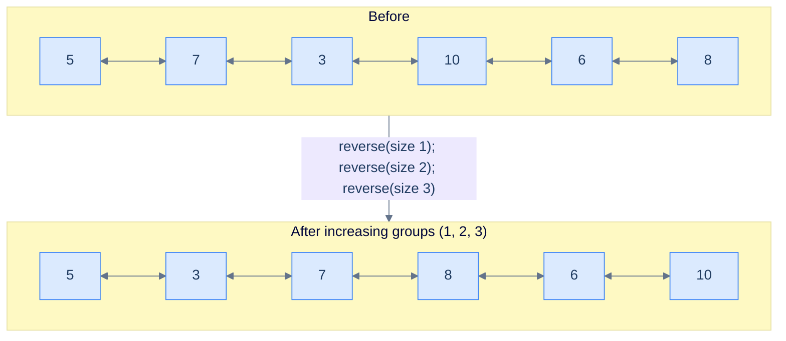
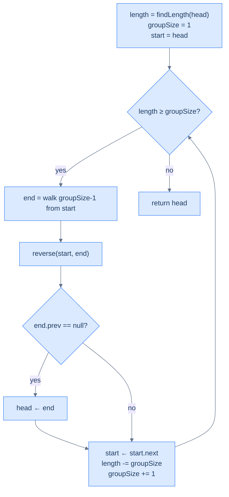

# Reverse increasing groups

## The Problem

Given the **head** of a doubly linked list, reverse the list in groups of **increasing size**: first group has size 1, next size 2, then 3, and so on. Return the head of the modified list. If the trailing fragment is shorter than the next required group size, leave it alone.

```
Input : head = [5, 7, 3, 10, 6, 8]
Output:        [5, 3, 7, 8, 6, 10]
Explanation: groups of sizes 1, 2, 3 — (5)→(5), (7,3)→(3,7), (10,6,8)→(8,6,10).

Input : head = [5, 7, 3, 10, 6]
Output:        [5, 3, 7, 10, 6]
Explanation: groups 1 and 2 — (5)→(5), (7,3)→(3,7). The trailing 2 nodes are
             fewer than the next required size of 3 → left unchanged.

Input : head = [5]
Output:        [5]
Explanation: only one group of size 1; reversing it is a no-op.
```

<details>
<summary><h2>What Does "Increasing Groups" Mean?</h2></summary>


Same template, dynamic window. The K-segments problem fixed `k` for every iteration. Here, `k` grows: 1 on iteration 1, 2 on iteration 2, 3 on iteration 3. The loop guard becomes "do I have at least `groupSize` nodes left?"

> 🖼 Diagram — Reverse increasing groups — group size grows by 1 each iteration. The cumulative coverage is 1 + 2 + 3 + … = n(n+1)/2.


<p align="center"><strong>Reverse increasing groups — group size grows by 1 each iteration. The cumulative coverage is <code>1 + 2 + 3 + … = n(n+1)/2</code>.</strong></p>

</details>
<details>
<summary><h2>Applying the Diagnostic Questions</h2></summary>


| Question | Answer |
|---|---|
| **Q1.** Can the problem be broken into smaller subproblems? | **Yes** — one reversal per growing window |
| **Q2.** Can each subproblem be solved by reversing a part? | **Yes** — same `reverse(start, end)`, with `end` walked `groupSize-1` hops |

### Q1 — Why "one reversal per growing window"?

Mental model: the problem is a parade of independent reversals just like K-segments — but the parade marshal grows the window by one each step. Track a `length` counter that you decrement by `groupSize` after each iteration; stop when `length < groupSize`.

Concrete numbers: `length = 6`. Iter 1: `groupSize = 1`, reverse 1 node, `length = 5`. Iter 2: `groupSize = 2`, reverse 2, `length = 3`. Iter 3: `groupSize = 3`, reverse 3, `length = 0`. Iter 4 would need `groupSize = 4` but `length = 0 < 4` → stop.

What breaks if you don't decrement length: the loop never terminates because `length` stays at 6 forever and every iteration looks fine — until `getNodeAtPosition` walks off the list and crashes.

### Q2 — Why "same reverse, dynamic end"?

Mental model: the only thing changing per iteration is how far `end` is from `start`. Everything else — head promotion, advancing `start`, the reverse helper — is identical to K-segments.

Concrete numbers: at iteration 3 with `start = node(10)`, `groupSize = 3` → walk 2 hops → `end = node(8)`. Call `reverse(10, 8)`. Output segment: `(8, 6, 10)`.

What breaks if you don't increment `groupSize` after each iteration: you've reduced the problem to "reverse every node alone", which is a no-op — output equals input.

</details>
<details>
<summary><h2>The Increasing-Group Strategy (Visualised)</h2></summary>


> 🖼 Diagram — The Increasing-Group Strategy — same skeleton as K-segments with two new bookkeeping lines: shrink length, grow groupSize.


<p align="center"><strong>The Increasing-Group Strategy — same skeleton as K-segments with two new bookkeeping lines: shrink <code>length</code>, grow <code>groupSize</code>.</strong></p>

</details>
<details>
<summary><h2>Solution &amp; Analysis</h2></summary>

### The Solution

```python run viz=linked-list viz-root=head
from typing import Optional

class ListNode:
    def __init__(self, val=0, prev=None, nxt=None):
        self.val = val
        self.prev = prev
        self.next = nxt


def from_list(values):
    if not values:
        return None
    head = ListNode(values[0])
    cur = head
    for v in values[1:]:
        node = ListNode(v, prev=cur)
        cur.next = node
        cur = node
    return head


def to_list(head):
    out = []
    while head is not None:
        out.append(head.val)
        head = head.next
    return out


class Solution:
    def find_length(self, head: Optional[ListNode]) -> int:
        length = 0
        while head is not None:
            length += 1
            head = head.next
        return length

    def get_node_at_position(
        self, head: ListNode, position: int
    ) -> ListNode:
        current = head
        for _ in range(1, position):
            current = current.next
        return current

    def reverse(
        self, start: Optional[ListNode], end: Optional[ListNode]
    ) -> None:
        if start is None or start == end:
            return

        left_bound = start.prev
        right_bound = end.next if end else None
        current = start
        previous = left_bound

        while current != right_bound:
            next_node = current.next
            current.prev, current.next = current.next, current.prev
            previous = current
            current = next_node

        if start:
            start.next = right_bound
        if right_bound:
            right_bound.prev = start

        if end:
            end.prev = left_bound
        if left_bound:
            left_bound.next = end

    def reverse_increasing_groups(
        self, head: Optional[ListNode]
    ) -> Optional[ListNode]:

        # If the list is empty or has only one node, no need to
        # reverse segments
        if head is None or head.next is None:
            return head

        # Start of the current segment to be reversed
        start = head

        # Find the length of the linked list
        length = self.find_length(head)

        # Start with a group size of 1
        group_size = 1

        # Loop through the list to reverse segments of increasing size
        while length >= group_size:

            # Get the end node of the current segment
            end = self.get_node_at_position(start, group_size)

            # Reverse the segment
            self.reverse(start, end)

            # Check if the existing head needs to be updated.
            if end and end.prev is None:

                # If previous pointer of the end node (which becomes
                # start after the swap) is null, it means we're at the
                # first segment. So, we need to update the head to the
                # new head node
                head = end

            # Move start to the next segment
            start = start.next

            # Decrement the remaining length by the size of the current
            # group
            length -= group_size

            # Increment group_size for the next segment
            group_size += 1

        # Return the head of the modified list
        return head


# Examples from the problem statement
head = from_list([5, 7, 3, 10, 6, 8])
print(to_list(Solution().reverse_increasing_groups(head)))  # [5, 3, 7, 8, 6, 10]

head = from_list([5, 7, 3, 10, 6])
print(to_list(Solution().reverse_increasing_groups(head)))  # [5, 3, 7, 10, 6]

head = from_list([5])
print(to_list(Solution().reverse_increasing_groups(head)))  # [5]

# Edge cases
head = from_list([1, 2])
print(to_list(Solution().reverse_increasing_groups(head)))  # [1, 2]

head = from_list([1, 2, 3])
print(to_list(Solution().reverse_increasing_groups(head)))  # [1, 3, 2]

head = from_list([1, 2, 3, 4, 5, 6, 7])
print(to_list(Solution().reverse_increasing_groups(head)))  # [1, 3, 2, 6, 5, 4, 7]

head = from_list([10, 20, 30, 40, 50, 60])
print(to_list(Solution().reverse_increasing_groups(head)))  # [10, 20, 30, 60, 50, 40]
```

```java run
import java.util.*;

public class Main {
    static class ListNode {
        int val;
        ListNode prev;
        ListNode next;
        ListNode() {}
        ListNode(int val) { this.val = val; }
    }

    static ListNode fromList(int... values) {
        if (values.length == 0) return null;
        ListNode head = new ListNode(values[0]);
        ListNode cur = head;
        for (int i = 1; i < values.length; i++) {
            ListNode node = new ListNode(values[i]);
            node.prev = cur;
            cur.next = node;
            cur = node;
        }
        return head;
    }

    static java.util.List<Integer> toList(ListNode head) {
        java.util.List<Integer> out = new java.util.ArrayList<>();
        while (head != null) { out.add(head.val); head = head.next; }
        return out;
    }

    static class Solution {
        private int findLength(ListNode head) {
            int length = 0;
            while (head != null) {
                length++;
                head = head.next;
            }
            return length;
        }

        private ListNode getNodeAtPosition(ListNode head, int position) {
            ListNode current = head;
            for (int i = 1; i < position; ++i) {
                current = current.next;
            }
            return current;
        }

        private void reverse(ListNode start, ListNode end) {
            if (start == null || start == end) {
                return;
            }

            ListNode leftBound = start.prev;
            ListNode rightBound = end.next;
            ListNode current = start;
            ListNode previous = leftBound;

            while (current != rightBound) {
                ListNode next = current.next;

                ListNode temp = current.prev;
                current.prev = current.next;
                current.next = temp;

                previous = current;
                current = next;
            }

            start.next = rightBound;
            if (rightBound != null) {
                rightBound.prev = start;
            }

            end.prev = leftBound;
            if (leftBound != null) {
                leftBound.next = end;
            }
        }

        public ListNode reverseIncreasingGroups(ListNode head) {

            // If the list is empty or has only one node, no need to
            // reverse segments
            if (head == null || head.next == null) {
                return head;
            }

            // Start of the current segment to be reversed
            ListNode start = head;

            // Find the length of the linked list
            int length = findLength(head);

            // Start with a group size of 1
            int groupSize = 1;

            // Loop through the list to reverse segments of increasing size
            while (length >= groupSize) {

                // Get the end node of the current segment
                ListNode end = getNodeAtPosition(start, groupSize);

                // Reverse the segment
                reverse(start, end);

                // Check if the existing head needs to be updated.
                if (end.prev == null) {

                    // If previous pointer of the end node (which becomes
                    // start after the swap) is null, it means we're at the
                    // first segment. So, we need to update the head to the
                    // new head node
                    head = end;
                }

                // Move start to the next segment
                start = start.next;

                // Decrement the remaining length by the size of the current
                // group
                length -= groupSize;

                // increment groupSize for the next segment
                groupSize++;
            }

            // Return the head of the modified list
            return head;
        }
    }

    public static void main(String[] args) {
        // Examples from the problem statement
        System.out.println(toList(new Solution().reverseIncreasingGroups(fromList(5, 7, 3, 10, 6, 8))));  // [5, 3, 7, 8, 6, 10]
        System.out.println(toList(new Solution().reverseIncreasingGroups(fromList(5, 7, 3, 10, 6))));     // [5, 3, 7, 10, 6]
        System.out.println(toList(new Solution().reverseIncreasingGroups(fromList(5))));                  // [5]

        // Edge cases
        System.out.println(toList(new Solution().reverseIncreasingGroups(fromList(1, 2))));               // [1, 2]
        System.out.println(toList(new Solution().reverseIncreasingGroups(fromList(1, 2, 3))));            // [1, 3, 2]
        System.out.println(toList(new Solution().reverseIncreasingGroups(fromList(1, 2, 3, 4, 5, 6, 7))));// [1, 3, 2, 6, 5, 4, 7]
        System.out.println(toList(new Solution().reverseIncreasingGroups(fromList(10, 20, 30, 40, 50, 60))));// [10, 20, 30, 60, 50, 40]
    }
}
```


<details>
<summary><strong>Trace — head = [5, 7, 3, 10, 6, 8]</strong></summary>

```
length = 6, group_size = 1, start = node(5)

Iter 1 │ group_size = 1, length = 6 ≥ 1 ✓
        │ end = get_node_at_position(5, 1) = node(5) → reverse(5, 5) is a no-op
        │ left_bound is None → head = node(5) (unchanged)
        │ left_bound = node(5); start ← left_bound.next = node(7);  length = 5;  group_size = 2

Iter 2 │ group_size = 2, length = 5 ≥ 2 ✓
        │ end = get_node_at_position(7, 2) = node(3) → reverse(7, 3)
        │ list: 5 → 3 → 7 → 10 → 6 → 8
        │ left_bound = node(5) → left_bound.next = node(3)
        │ left_bound = node(7); start ← left_bound.next = node(10);  length = 3;  group_size = 3

Iter 3 │ group_size = 3, length = 3 ≥ 3 ✓
        │ end = get_node_at_position(10, 3) = node(8) → reverse(10, 8)
        │ list: 5 → 3 → 7 → 8 → 6 → 10
        │ left_bound = node(7) → left_bound.next = node(8)
        │ left_bound = node(10); start ← left_bound.next = null;  length = 0;  group_size = 4

Iter 4 │ length = 0 < group_size = 4 → loop exits
Result: [5, 3, 7, 8, 6, 10] ✓
```

This trace shows the only "trick": iteration 1 with `group_size = 1` is a no-op reverse (start == end), but it still runs the `left_bound is None` head-promotion check — which is harmless because the head doesn't actually change.

</details>

### Complexity Analysis

| Resource | Cost | Why |
|---|---|---|
| Time | **O(N)** | Total reversal work is `1 + 2 + 3 + … ≤ N`; total walker work is also O(N) |
| Space | **O(1)** | Three temporaries; no auxiliary structure |

### Edge Cases

| Case | Example | Expected | Reasoning |
|---|---|---|---|
| Single node | `[5]` | `[5]` | Initial guard returns it; even without the guard, group 1 is a no-op |
| Triangular length (1+2+3=6) | `[a,b,c,d,e,f]` | All groups consume the list cleanly | `length` reaches 0 exactly when the next required group exceeds it |
| Non-triangular length | `[5,7,3,10,6]` | Groups 1 and 2 done; trailing 2 left | After 2 iterations, `length = 2` and `groupSize = 3` → loop exits |
| `groupSize = 1` first iter | always | no-op reversal | `start == end`; reverse short-circuits |

</details>

<!-- ============================================== -->
<!-- SWEEP 2 — missing sections (placeholders only) -->
<!-- ============================================== -->

<!-- TODO: Examples — missing, needs to be written -->
<!--       Guidance: min 3 examples: basic / variant / edge -->

<!-- TODO: Intuition — missing, needs to be written -->
<!--       Guidance: 3 paragraphs: brute force / observation / pattern fit -->

<!-- TODO: Applying the Diagnostic Questions — missing, needs to be written -->
<!--       Guidance: REQUIRED, never optional -->
<!--       Guidance: 4-row table. Columns: 'Check' | 'Answer for [Problem Name]' -->
<!--       Guidance: Rows: two positions simultaneously / one near start one near end / both move inward / simple O(1) work at each step -->

<!-- TODO: Approach — missing, needs to be written -->
<!--       Guidance: numbered steps, no code -->

<!-- TODO: Dry Run — missing, needs to be written -->
<!--       Guidance: walk through a small example step by step -->

<!-- TODO: Key Takeaway — missing, needs to be written -->
<!--       Guidance: 1–2 sentences -->
