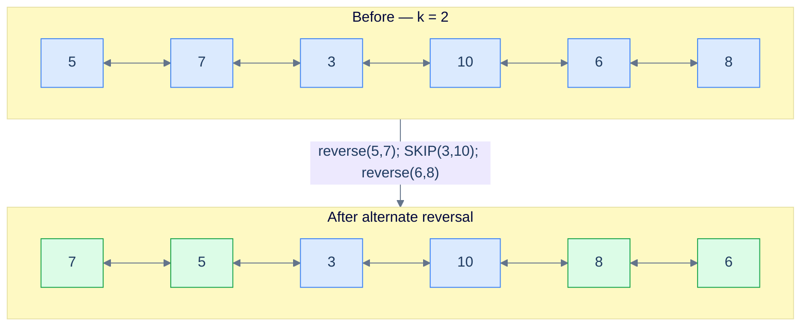
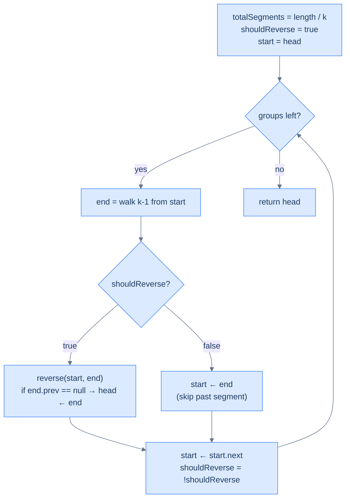

# Reverse alternate segments

## The Problem

Given the **head** of a doubly linked list and a positive integer **k**, reverse alternate `k`-node segments — reverse the first segment, **skip** the second, reverse the third, skip the fourth, and so on. Return the head. If the trailing fragment has fewer than `k` nodes, leave it.

```
Input : head = [5, 7, 3, 10, 6, 8], k = 2
Output:        [7, 5, 3, 10, 8, 6]
Explanation: reverse (5,7), skip (3,10), reverse (6,8).

Input : head = [5, 7, 3, 10, 6], k = 3
Output:        [3, 7, 5, 10, 6]
Explanation: reverse (5,7,3); next group would be (10,6,?) — only 2 nodes left,
             which is fewer than k=3, so loop ends. The "skip" never gets a turn.

Input : head = [5, 7, 3, 10, 6], k = 8
Output:        [5, 7, 3, 10, 6]
Explanation: list length 5 < k=8 → no reversal happens.
```

<details>
<summary><h2>What Does "Alternate Segments" Mean?</h2></summary>


Same template as K-segments, plus a boolean flag that flips each iteration. When the flag is `true`, reverse and advance one node (the same `start.next` move as before — because `start` is now the segment tail). When the flag is `false`, **don't** reverse — but still advance `start` past the entire untouched segment, then one more node to land at the next group's head.

> 🖼 Diagram — Reverse alternate segments — green = reversed, plain = skipped. The flag toggles every iteration.


<p align="center"><strong>Reverse alternate segments — green = reversed, plain = skipped. The flag toggles every iteration.</strong></p>

</details>
<details>
<summary><h2>Applying the Diagnostic Questions</h2></summary>


| Question | Answer |
|---|---|
| **Q1.** Can the problem be broken into smaller subproblems? | **Yes** — `length / k` segments, each either reversed or skipped |
| **Q2.** Can each "reverse" subproblem be solved by reversing a part? | **Yes** — same `reverse(start, end)`; "skip" is just a pointer hop |

### Q1 — Why "each segment is reverse-or-skip"?

Mental model: imagine alternating coloured tiles — odd tiles get flipped, even tiles stay. The grid is still defined by the same `length / k` formula; the only new state is "is this an odd or even tile?", tracked by a boolean.

Concrete numbers: `length = 6, k = 2 → 3 segments`. Iter 1: reverse `(5,7)`. Iter 2: skip `(3,10)`. Iter 3: reverse `(6,8)`. Three segments, two reversed, one skipped.

What breaks if the flag isn't toggled: the function reduces to plain `reverseKSegments` (every segment reversed) — wrong output.

### Q2 — Why "skip is a pointer hop"?

Mental model: when we reverse, `start` becomes the segment's *tail*, so `start.next` lands on the next group. When we skip, `start` is still the segment's *head*; we need to walk all the way past `end` ourselves, *then* one more step. That's `start = end.next` (or equivalently, set `start = end` then `start = start.next`).

Concrete numbers: skipping `(3, 10)` with `start = node(3), end = node(10)` → after the skip, `start = node(10).next = node(6)` — the head of the next group.

What breaks if you advance like the reverse case (`start = start.next`) without first moving `start` to `end`: you'd land on the second node of the just-skipped segment instead of past it. The next iteration would slice the list mid-segment and produce garbage.

> *Friction prompt — before reading on:* what's the answer for `head = [1, 2, 3, 4], k = 2` if you toggle the flag wrong (skip first, then reverse)? Predict the output.
>
> Answer: skip `(1, 2)` → list still `[1, 2, 3, 4]`. Reverse `(3, 4)` → `[1, 2, 4, 3]`. Different from "reverse first, skip second" which would give `[2, 1, 3, 4]`. The starting flag value matters — the spec says reverse first.

</details>
<details>
<summary><h2>The Alternating Strategy (Visualised)</h2></summary>


> 🖼 Diagram — The Alternating Strategy — the only branch is "reverse vs skip". Both paths end in the same advance-and-toggle.


<p align="center"><strong>The Alternating Strategy — the only branch is "reverse vs skip". Both paths end in the same advance-and-toggle.</strong></p>

</details>
<details>
<summary><h2>Solution &amp; Analysis</h2></summary>

### The Solution

```python run viz=linked-list viz-root=head
from typing import Optional

class ListNode:
    def __init__(self, val=0, prev=None, nxt=None):
        self.val = val
        self.prev = prev
        self.next = nxt


def from_list(values):
    if not values:
        return None
    head = ListNode(values[0])
    cur = head
    for v in values[1:]:
        node = ListNode(v, prev=cur)
        cur.next = node
        cur = node
    return head


def to_list(head):
    out = []
    while head is not None:
        out.append(head.val)
        head = head.next
    return out


class Solution:
    def find_length(self, head: Optional[ListNode]) -> int:
        length = 0
        while head is not None:
            length += 1
            head = head.next
        return length

    def get_node_at_position(
        self, head: Optional[ListNode], position: int
    ) -> Optional[ListNode]:
        current = head
        for _ in range(1, position):
            if current is None:
                break
            current = current.next
        return current

    def reverse(
        self, start: Optional[ListNode], end: Optional[ListNode]
    ) -> None:
        if start is None or start == end:
            return

        left_bound = start.prev
        right_bound = end.next if end else None
        current = start
        previous = left_bound

        while current != right_bound:
            next_node = current.next
            current.prev, current.next = current.next, current.prev
            previous = current
            current = next_node

        if start:
            start.next = right_bound
        if right_bound:
            right_bound.prev = start

        if end:
            end.prev = left_bound
        if left_bound:
            left_bound.next = end

    def reverse_alternate_segments(
        self, head: Optional[ListNode], k: int
    ) -> Optional[ListNode]:

        # If the list is empty, has only one node, or k is 1, no need to
        # reverse segments
        if head is None or head.next is None or k == 1:
            return head

        # Flag to determine whether to reverse the current segment.
        should_reverse = True

        # Start of the current segment to be reversed
        start = head

        # Find the total number of segments in the linked list
        total_segments = self.find_length(head) // k

        # Loop through the list to reverse every k-length segment
        for i in range(total_segments):

            # Get the end node of the current segment
            end = self.get_node_at_position(start, k)

            # Reverse the current segment if the flag is set.
            if should_reverse:

                # Reverse the segment
                self.reverse(start, end)

                # If previous pointer of the end node (which becomes
                # start after the swap) is null, it means we're at the
                # first segment. So, we need to update the head to the
                # new head node
                if end is not None and end.prev is None:
                    head = end

            # Otherwise skip reversing this segment, move start to the
            # end of the segment.
            else:
                start = end

            # Move start to the next segment
            start = start.next

            # Toggle the flag for the next segment
            should_reverse = not should_reverse

        # Return the head of the modified list
        return head


# Examples from the problem statement
head = from_list([5, 7, 3, 10, 6, 8])
print(to_list(Solution().reverse_alternate_segments(head, 2)))  # [7, 5, 3, 10, 8, 6]

head = from_list([5, 7, 3, 10, 6])
print(to_list(Solution().reverse_alternate_segments(head, 3)))  # [3, 7, 5, 10, 6]

head = from_list([5, 7, 3, 10, 6])
print(to_list(Solution().reverse_alternate_segments(head, 8)))  # [5, 7, 3, 10, 6]

# Edge cases
head = from_list([1])
print(to_list(Solution().reverse_alternate_segments(head, 1)))  # [1]

head = from_list([1, 2, 3, 4])
print(to_list(Solution().reverse_alternate_segments(head, 1)))  # [1, 2, 3, 4]

head = from_list([1, 2, 3, 4, 5, 6])
print(to_list(Solution().reverse_alternate_segments(head, 3)))  # [3, 2, 1, 4, 5, 6]

head = from_list([1, 2, 3, 4, 5, 6, 7, 8])
print(to_list(Solution().reverse_alternate_segments(head, 2)))  # [2, 1, 3, 4, 6, 5, 7, 8]
```

```java run
import java.util.*;

public class Main {
    static class ListNode {
        int val;
        ListNode prev;
        ListNode next;
        ListNode() {}
        ListNode(int val) { this.val = val; }
    }

    static ListNode fromList(int... values) {
        if (values.length == 0) return null;
        ListNode head = new ListNode(values[0]);
        ListNode cur = head;
        for (int i = 1; i < values.length; i++) {
            ListNode node = new ListNode(values[i]);
            node.prev = cur;
            cur.next = node;
            cur = node;
        }
        return head;
    }

    static java.util.List<Integer> toList(ListNode head) {
        java.util.List<Integer> out = new java.util.ArrayList<>();
        while (head != null) { out.add(head.val); head = head.next; }
        return out;
    }

    static class Solution {
        private int findLength(ListNode head) {
            int length = 0;
            while (head != null) {
                length++;
                head = head.next;
            }
            return length;
        }

        private ListNode getNodeAtPosition(ListNode head, int position) {
            ListNode current = head;
            for (int i = 1; i < position; i++) {
                current = current.next;
            }
            return current;
        }

        private void reverse(ListNode start, ListNode end) {
            if (start == null || start == end) {
                return;
            }

            ListNode leftBound = start.prev;
            ListNode rightBound = end.next;
            ListNode current = start;
            ListNode previous = leftBound;

            while (current != rightBound) {
                ListNode next = current.next;

                ListNode temp = current.prev;
                current.prev = current.next;
                current.next = temp;

                previous = current;
                current = next;
            }

            start.next = rightBound;
            if (rightBound != null) {
                rightBound.prev = start;
            }

            end.prev = leftBound;
            if (leftBound != null) {
                leftBound.next = end;
            }
        }

        public ListNode reverseAlternateSegments(ListNode head, int k) {

            // If the list is empty, has only one node, or k is 1, no need to
            // reverse segments
            if (head == null || head.next == null || k == 1) {
                return head;
            }

            // Flag to determine whether to reverse the current segment.
            boolean shouldReverse = true;

            // Start of the current segment to be reversed
            ListNode start = head;

            // Find the total number of segments in the linked list
            int totalSegments = findLength(head) / k;

            // Loop through the list to reverse every k-length segment
            for (int i = 0; i < totalSegments; i++) {

                // Get the end node of the current segment
                ListNode end = getNodeAtPosition(start, k);

                // Reverse the current segment if the flag is set.
                if (shouldReverse) {

                    // Reverse the segment
                    reverse(start, end);

                    // If previous pointer of the end node (which become
                    // start after the swap) is null, it means we're at
                    // the first segment. So, we need to update the head
                    // to the new head node
                    if (end.prev == null) {
                        head = end;
                    }

                }

                // Otherwise skip reversing this segment, move start to the
                // end of the segment.
                else {
                    start = end;
                }

                // Move start to the next segment
                start = start.next;

                // Toggle the flag for the next segment
                shouldReverse = !shouldReverse;
            }

            // Return the head of the modified list
            return head;
        }
    }

    public static void main(String[] args) {
        // Examples from the problem statement
        System.out.println(toList(new Solution().reverseAlternateSegments(fromList(5, 7, 3, 10, 6, 8), 2)));  // [7, 5, 3, 10, 8, 6]
        System.out.println(toList(new Solution().reverseAlternateSegments(fromList(5, 7, 3, 10, 6), 3)));     // [3, 7, 5, 10, 6]
        System.out.println(toList(new Solution().reverseAlternateSegments(fromList(5, 7, 3, 10, 6), 8)));     // [5, 7, 3, 10, 6]

        // Edge cases
        System.out.println(toList(new Solution().reverseAlternateSegments(fromList(1), 1)));                  // [1]
        System.out.println(toList(new Solution().reverseAlternateSegments(fromList(1, 2, 3, 4), 1)));         // [1, 2, 3, 4]
        System.out.println(toList(new Solution().reverseAlternateSegments(fromList(1, 2, 3, 4, 5, 6), 3)));   // [3, 2, 1, 4, 5, 6]
        System.out.println(toList(new Solution().reverseAlternateSegments(fromList(1, 2, 3, 4, 5, 6, 7, 8), 2))); // [2, 1, 3, 4, 6, 5, 7, 8]
    }
}
```


<details>
<summary><strong>Trace — head = [5, 7, 3, 10, 6, 8], k = 2</strong></summary>

```
length = 6, total_segments = 6 / 2 = 3, should_reverse = true, start = node(5)

Iter 1 │ should_reverse = true. end = get_node_at_position(5, 2) = node(7) → reverse(5, 7)
        │ list: 7 → 5 → 3 → 10 → 6 → 8
        │ left_bound is None → head = node(7)
        │ left_bound = start (node 5); start ← left_bound.next = node(3);  should_reverse = false

Iter 2 │ should_reverse = false. end = get_node_at_position(3, 2) = node(10) → SKIP
        │ left_bound = end (node 10); start ← left_bound.next = node(6)
        │ list unchanged. should_reverse = true

Iter 3 │ should_reverse = true. end = get_node_at_position(6, 2) = node(8) → reverse(6, 8)
        │ list: 7 → 5 → 3 → 10 → 8 → 6
        │ left_bound = node(10) → left_bound.next = node(8)
        │ left_bound = start (node 6); start ← left_bound.next = null;  should_reverse = false

Result: [7, 5, 3, 10, 8, 6] ✓
```

This trace highlights the key asymmetry in how `left_bound` advances: on a reversed segment, `start` becomes the tail, so `left_bound = start` then `start = left_bound.next` steps to the next segment. On a skipped segment, no reversal happens, so `left_bound = end` and `start = left_bound.next` jumps straight past the untouched run.

</details>

### Complexity Analysis

| Resource | Cost | Why |
|---|---|---|
| Time | **O(N)** | One length scan + each node touched at most twice (once by walker, once by reverse) |
| Space | **O(1)** | Constant working set |

### Edge Cases

| Case | Example | Expected | Reasoning |
|---|---|---|---|
| `k == 1` | `[1, 2, 3], k=1` | `[1, 2, 3]` | Each "group" is one node; reverse-or-skip is identical for both |
| `k > length` | `[1,2,3,4,5], k=8` | unchanged | `total = 0`; loop doesn't run |
| Length not multiple of `k` | `[5,7,3,10,6], k=3` | `[3,7,5,10,6]` | One reversal, then `length` runs out before the skip can fire |
| Even number of segments | `[1,2,3,4], k=2` | `[2,1,3,4]` | reverse, skip — final list has the second pair untouched |
| Odd number of segments | `[1,2,3,4,5,6], k=2` | `[2,1,3,4,6,5]` | reverse, skip, reverse — flag finishes at `false` |

</details>
<details>
<summary><h2>Final Takeaway</h2></summary>


The reversal-subproblem family looks intimidating from the outside — pairwise swap, k-segment reversal, increasing groups, alternate segments — and beginners write a different bespoke loop for each one. Don't. **They are the same algorithm with one knob turned.** Find the length, decide the window (`k = 2`, fixed `k`, growing `k`, or alternating `k`-with-skip), and call `reverse(start, end)` in a loop. Track the new head with the `end.prev == null` trick. That's it. The hardest part isn't the code — it's *seeing the windowing pattern*. Once you see it, dozens of "medium" linked-list problems collapse into a half-page solution you can write from memory.

> **Transfer challenge:** given a doubly linked list and an integer `m`, reverse every block of size `2m`, but **only the second half of each block** (so the first `m` nodes of each `2m`-block stay put, the next `m` nodes get reversed). Return the new head. Stop reversing once fewer than `2m` nodes remain.
>
> <details>
> <summary><strong>Hint</strong></summary>
>
> It's the alternate-segments problem in disguise. Set the effective window size to `m` and start with `shouldReverse = false` (skip the first `m`, reverse the next `m`, repeat). The "skip first half" branch advances `start = end; start = start.next` exactly like the alternate-segments skip path. The reversed-half branch does the usual `reverse(start, end)` + head check — except the head can never change here because every reversed segment lives strictly to the right of an un-reversed one.
>
> </details>

Next time you see a linked-list problem whose statement contains the words "groups", "segments", "alternate", "every other", or "in pairs" — you won't reach for a bespoke loop. You'll reach for **scan, window, reverse, advance**, and you'll know which one of these four templates fits before you've finished reading the problem.

</details>

<!-- ============================================== -->
<!-- SWEEP 2 — missing sections (placeholders only) -->
<!-- ============================================== -->

<!-- TODO: Examples — missing, needs to be written -->
<!--       Guidance: min 3 examples: basic / variant / edge -->

<!-- TODO: Intuition — missing, needs to be written -->
<!--       Guidance: 3 paragraphs: brute force / observation / pattern fit -->

<!-- TODO: Applying the Diagnostic Questions — missing, needs to be written -->
<!--       Guidance: REQUIRED, never optional -->
<!--       Guidance: 4-row table. Columns: 'Check' | 'Answer for [Problem Name]' -->
<!--       Guidance: Rows: two positions simultaneously / one near start one near end / both move inward / simple O(1) work at each step -->

<!-- TODO: Approach — missing, needs to be written -->
<!--       Guidance: numbered steps, no code -->

<!-- TODO: Dry Run — missing, needs to be written -->
<!--       Guidance: walk through a small example step by step -->

<!-- TODO: Key Takeaway — missing, needs to be written -->
<!--       Guidance: 1–2 sentences -->
