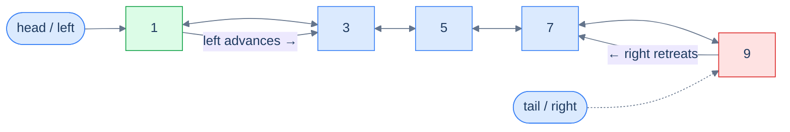
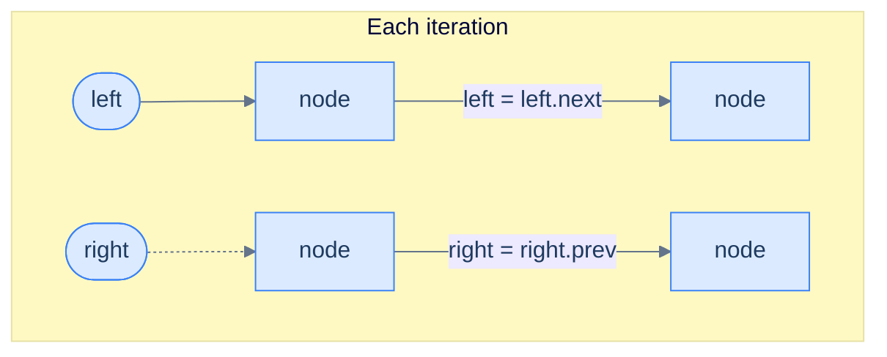
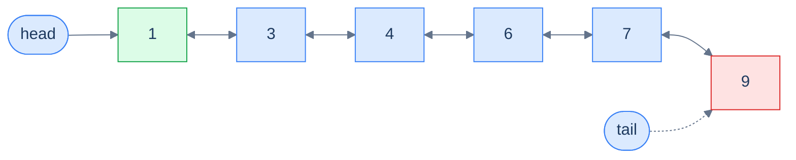
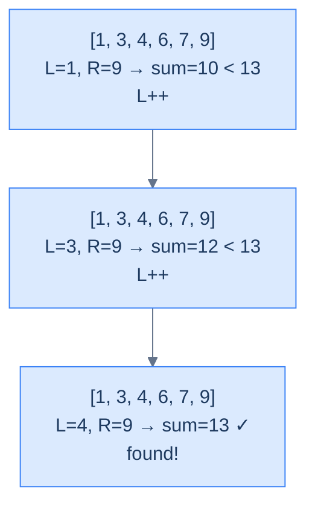
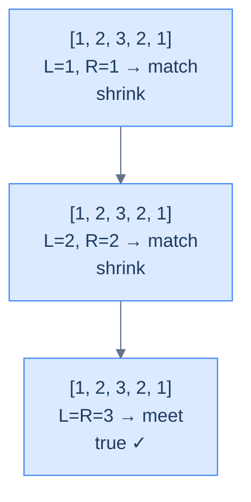
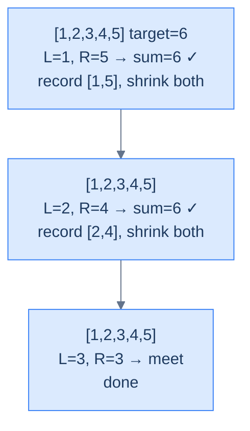
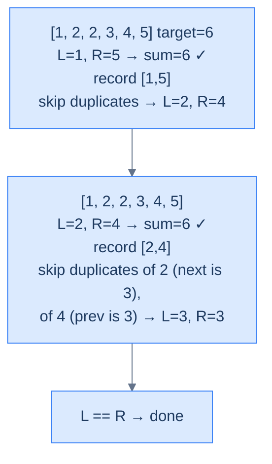
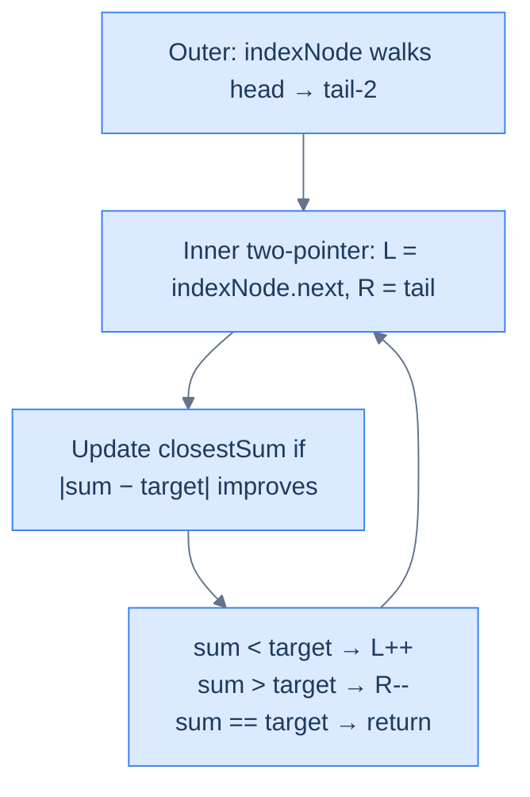

# 7. Pattern: Two Pointers

## The Hook

In a singly linked list, "scan from both ends" is a fantasy. The list refuses to tell you who lives behind any given address — one pointer can only crawl forward, and the only way to "come from the right" is to walk all the way there first. So sorted-array tricks like "shrink from both sides until they meet" simply don't translate.

A doubly linked list breaks that ceiling. Every node knows its predecessor, so you can plant `left = head` and `right = tail` and march them toward each other in lockstep — exactly the way you would on a sorted array. Suddenly the entire two-pointer playbook from arrays — Two Sum, palindrome check, 3Sum-Closest — becomes available on a *linked* structure, in linear time and constant space. That's the surprise: a structure most people think of as "fancy linked list" turns out to be the bridge that lets you reuse array-style two-pointer reasoning on a non-contiguous, dynamically-sized data structure.

By the end of this lesson, you'll know exactly when to reach for two pointers on a DLL — and exactly which pointer to move next, and why.

---

## Table of contents

1. [Understanding the Two-Pointer Pattern](#understanding-the-two-pointer-pattern)
2. [Identifying the Two-Pointer Pattern](#identifying-the-two-pointer-pattern)
3. [Palindrome Number](#palindrome-number)
4. [Two Sum](#two-sum)
5. [Duplicate-Aware Two Sum](#duplicate-aware-two-sum)
6. [Approximate Three Sum](#approximate-three-sum)

---

# Understanding the Two-Pointer Pattern

## The World — Two Walkers, One Hallway

Picture a long hallway with numbered doors lined up in increasing order. One person stands at the first door, another at the last. They walk toward each other, comparing the numbers on their doors at every step. If the **sum** of the two numbers is too small, the left walker advances; if it's too large, the right walker steps back. Eventually they shake hands in the middle — and somewhere along the way, they've inspected every *useful* combination of doors without ever doubling back.

That's the two-pointer technique. On a doubly linked list, the hallway is the list itself, the walkers are `left` and `right` pointers, and "stepping" is just `left = left.next` or `right = right.prev`.



<p align="center"><strong>Two-pointer traversal on a DLL — <code>left</code> walks forward via <code>next</code>, <code>right</code> walks backward via <code>prev</code>. They converge from both ends until they meet (or cross) in the middle.</strong></p>

## Why a Singly Linked List Can't Do This

To perform any operation on the data items in a **singly** linked list, we must traverse from `head` to `tail` and find those items in one direction only. A doubly linked list, however, can be traversed in *two* directions — head-to-tail or tail-to-head — and depending on the problem, we may choose one direction over the other.

Some problems, though, require us to traverse the linked list in *both* directions **simultaneously**. With a singly linked list this is impossible without first reversing or copying the list (extra space, extra time). With a DLL it's free — every node already stores `prev`, so the `right` walker has somewhere to go.

> **The key claim:** the two-pointer technique allows us to solve certain problems in **linear time, single-pass, O(1) space** — problems that would otherwise force nested loops or auxiliary data structures.

The two-pointer pattern is the family of problems solvable using this two-pointer traversal technique.

## The Two-Pointer Technique

The technique uses two references, `left` and `right`, initialised at `head` and `tail` respectively. We traverse in both directions by following `next` from `left` and `prev` from `right`, until they meet in the middle or `left` crosses past `right`. At each iteration we inspect the nodes held by `left` and `right`, do whatever the problem demands, and decide which pointer to advance — possibly both, possibly only one — to close the gap.



<p align="center"><strong>Each iteration: act on <code>left</code> and <code>right</code>, then move one or both inward by one step.</strong></p>

## The Generic Algorithm

> -   **Step 1:** Initialise `left = head` and `right = tail`.
> -   **Step 2:** Loop while `left != right` **and** `left.prev != right` (the second guard catches the moment they cross — see the friction prompt below):
>     -   **Step 2.1:** Perform the operation on the nodes held by `left` and `right` as the problem dictates.
>     -   **Step 2.2:** Decide whether `left` should advance — if yes, set `left = left.next` (possibly more than once).
>     -   **Step 2.3:** Decide whether `right` should retreat — if yes, set `right = right.prev` (possibly more than once).

> *Friction prompt — before reading on:* why do we need **both** termination guards? What goes wrong with only `left != right`? Predict before scrolling.
>
> Answer: with an even-length list, `left` and `right` never land on the *same* node — they swap past each other. After one final inward step, `left.prev == right` (they crossed). Without the second guard, the loop would run one iteration too many on already-processed nodes, comparing them backwards. The pair `(left != right) && (left.prev != right)` covers both odd-length (meet) and even-length (cross) lists.

## Generic Implementation

The skeleton below is the template every problem in this lesson specialises. Read it once, then watch how each problem changes only the *condition* and the *what to do at each step*.


```python run

"""
Definition for doubly-linked list.
class ListNode:
    def __init__(self, val):
        self.val = val
        self.prev = None
        self.next = None
"""

from typing import Optional

def two_pointer(head: Optional[ListNode], tail: Optional[ListNode]) -> None:
    # If the head and tail are the same or adjacent, nothing needs to be done
    if not head or not tail or head == tail or head.next == tail:
        return

    # Initialize left and right references
    left = head
    right = tail

    while left != right and left.prev != right:
        '''
        Perform the operation on left and right.
        You can include your specific logic here.
        '''

        # Adjust pointers based on conditions
        if should_move_left:  # You should define this condition according to your logic
            left = left.next

        if should_move_right:  # You should define this condition according to your logic
            right = right.prev

    return
```

```java run

/**
 * Definition for doubly-linked list.
 * class ListNode {
 *     int val;
 *     ListNode prev;
 *     ListNode next;
 *     ListNode() {}
 *     ListNode(int val) { this.val = val; }
 * };
 */

class TwoPointer {

        public void twoPointer(ListNode head, ListNode tail) {
        // If the head and tail are the same or adjacent, nothing needs to be done
        if (head == null || tail == null || head == tail || head.next == tail) {
            return;
        }

        // Initialize left and right references
        ListNode left = head;
        ListNode right = tail;

        // Loop until the left and right pointers meet or cross each other
        while (left != right && left.prev != right) {
            /*
            Perform the operation on left and right
            Example: swapping values, comparing nodes, etc.
            */

            // Adjust pointers based on conditions
            if (shouldMoveLeft) {
                left = left.next;
            }

            if (shouldMoveRight) {
                right = right.prev;
            }
        }
    }

}
```


## Complexity Analysis

Both pointers traverse the list once, from opposite ends, and meet in the middle — collectively visiting each node at most once. That's logically equivalent to one full sweep.

| Measure | Value | Why |
|---|---|---|
| Time  | **O(N)** | `left` and `right` together cover every node exactly once before crossing. |
| Space | **O(1)** | Two pointers, no auxiliary structure. |

> **Best Case**: Time **O(N)**, Space **O(1)**
>
> **Worst Case**: Time **O(N)**, Space **O(1)**

We unlocked a structural superpower — but where exactly is it the *right* tool? That's the next question.

---

# Identifying the Two-Pointer Pattern

Almost every two-pointer **array** problem can be reformulated as a doubly linked list problem and solved the same way. These tend to be **medium** or **hard** on a DLL because pointer plumbing and null-checks are more delicate than array indexing — but the underlying logic is identical.

If a problem statement (or its naive solution) fits the template below, it's a two-pointer problem:

> **Template:** Given a doubly linked list, perform an operation on two nodes `left` and `right` where `left` starts at `x` and `right` starts at `y` with `x` to the left of `y`, and on each iteration `left` and `right` move strictly closer to each other.

## Worked Example — Spotting It in the Wild

> **Problem:** Given the `head` and `tail` of a doubly linked list of integers sorted non-decreasing, and an integer `target`, return `true` if any two nodes have values summing to `target`.

Take the list below with `target = 13` — two nodes obviously satisfy the requirement.



<p align="center"><strong>Find a pair summing to 13 — sorted order plus DLL bidirectionality is the exact recipe two-pointers eats for breakfast.</strong></p>

### The Two-Pointer Solution

The classic Two-Sum array solution sorts the array, then uses two pointers (the proof of correctness was covered in the array two-pointer chapter). Here, the values are *already* sorted — so we can apply the same logic directly:

- Plant `left = head`, `right = tail`.
- Compute `sum = left.val + right.val`.
- If `sum < target`, `left.val` is paired against the *largest* possible partner and still falls short — that means `left.val` can never participate in a valid pair, **so advance `left`** (drop it).
- If `sum > target`, `right.val` is paired against the *smallest* possible partner and still overshoots — `right.val` can never participate, **so retreat `right`**.
- If `sum == target`, record the pair and shrink both inward.

This fits the template exactly.



<p align="center"><strong>Finding a pair with sum 13 — each iteration shrinks the search range by discarding a value that provably cannot participate.</strong></p>

The reference C++ implementation (we'll see the Python and Java versions in the dedicated Two Sum section below):

```cpp
class Solution {
public:
    vector<vector<int>> twoSum(ListNode *head, ListNode *tail, int target) {
        if (!head || !head->next) return {};
        vector<vector<int>> result;
        ListNode *left = head, *right = tail;
        while (left && right && left->val < right->val) {
            int sum = left->val + right->val;
            if (sum == target) {
                result.push_back({left->val, right->val});
                left = left->next; right = right->prev;
            } else if (sum < target) {
                left = left->next;
            } else {
                right = right->prev;
            }
        }
        return result;
    }
};
```

Single pass, no extra space — exactly the speedup the pattern promises.

## The Problem Roster

We'll now cement the technique with four concrete problems of growing difficulty:

> -   **Palindrome Number** — pure mirror check
> -   **Two Sum** — the canonical sorted-pair search
> -   **Duplicate-Aware Two Sum** — same idea, but skip-duplicate plumbing
> -   **Approximate Three Sum** — fix one node, two-pointer the rest

---

# Palindrome Number

## The Problem

Given the **head** and **tail** of a sorted (well — *symmetric*) doubly linked list, return `true` if the list reads the same forwards and backwards, `false` otherwise. A palindrome number reads identically left-to-right and right-to-left.

```
Input:  head = [1, 2, 3, 2, 1]
Output: true

Input:  head = [6, 6, 6]
Output: true

Input:  head = [1, 2, 3, 4, 5]
Output: false
```

<details>
<summary><h2>The Mirror Strategy (Visualised)</h2></summary>


Plant `left` at the start, `right` at the end. At each step, compare the two values; if they ever differ, return `false`. Otherwise step inward and keep going until the pointers meet (odd length) or cross (even length).



<p align="center"><strong>Palindrome check — mirror comparison from both ends until pointers meet or cross.</strong></p>

</details>
<details>
<summary><h2>Solution &amp; Analysis</h2></summary>

### The Solution

```python run
from typing import Optional

class ListNode:
    def __init__(self, val=0, prev=None, nxt=None):
        self.val = val
        self.prev = prev
        self.next = nxt


def from_list(values):
    if not values:
        return None
    head = ListNode(values[0])
    cur = head
    for v in values[1:]:
        node = ListNode(v, prev=cur)
        cur.next = node
        cur = node
    return head


def get_tail(head):
    if head is None:
        return None
    cur = head
    while cur.next is not None:
        cur = cur.next
    return cur


class Solution:
    def palindrome_number(
        self, head: Optional[ListNode], tail: Optional[ListNode]
    ) -> bool:

        # Empty list or single element is a palindrome
        if not head or head == tail:
            return True

        left = head
        right = tail

        while left and right and left != right and left.prev != right:

            # If values don't match, its not a palindrome
            if left.val != right.val:
                return False

            # Move the left pointer to the right
            left = left.next

            # Move the right pointer to the left
            right = right.prev

        # If all values matched, it's a palindrome
        return True


# Examples from the problem statement
h = from_list([1, 2, 3, 2, 1])
print(Solution().palindrome_number(h, get_tail(h)))   # True

h = from_list([6, 6, 6])
print(Solution().palindrome_number(h, get_tail(h)))   # True

h = from_list([1, 2, 3, 4, 5])
print(Solution().palindrome_number(h, get_tail(h)))   # False

# Edge cases
h = from_list([5])
print(Solution().palindrome_number(h, get_tail(h)))   # True

h = from_list([1, 2, 1])
print(Solution().palindrome_number(h, get_tail(h)))   # True

h = from_list([1, 2])
print(Solution().palindrome_number(h, get_tail(h)))   # False

h = from_list([1, 2, 2, 1])
print(Solution().palindrome_number(h, get_tail(h)))   # True

h = from_list([9, 9, 9, 9])
print(Solution().palindrome_number(h, get_tail(h)))   # True

h = from_list([1, 2, 3])
print(Solution().palindrome_number(h, get_tail(h)))   # False
```

```java run
import java.util.*;

public class Main {
    static class ListNode {
        int val;
        ListNode prev;
        ListNode next;
        ListNode() {}
        ListNode(int val) { this.val = val; }
    }

    static ListNode fromList(int... values) {
        if (values.length == 0) return null;
        ListNode head = new ListNode(values[0]);
        ListNode cur = head;
        for (int i = 1; i < values.length; i++) {
            ListNode node = new ListNode(values[i]);
            node.prev = cur;
            cur.next = node;
            cur = node;
        }
        return head;
    }

    static ListNode getTail(ListNode head) {
        if (head == null) return null;
        ListNode cur = head;
        while (cur.next != null) cur = cur.next;
        return cur;
    }

    static class Solution {
        public boolean palindromeNumber(ListNode head, ListNode tail) {

            // Empty list or single element is a palindrome
            if (head == null || head == tail) {
                return true;
            }

            ListNode left = head;
            ListNode right = tail;

            while (
                left != null &&
                right != null &&
                left != right &&
                left.prev != right
            ) {

                // If values don't match, its not a palindrome
                if (left.val != right.val) {
                    return false;
                }

                // Move the left pointer to the right
                left = left.next;

                // Move the right pointer to the left
                right = right.prev;
            }

            // If all values matched, it's a palindrome
            return true;
        }
    }

    public static void main(String[] args) {
        // Examples from the problem statement
        ListNode h;

        h = fromList(1, 2, 3, 2, 1);
        System.out.println(new Solution().palindromeNumber(h, getTail(h)));  // true

        h = fromList(6, 6, 6);
        System.out.println(new Solution().palindromeNumber(h, getTail(h)));  // true

        h = fromList(1, 2, 3, 4, 5);
        System.out.println(new Solution().palindromeNumber(h, getTail(h)));  // false

        // Edge cases
        h = fromList(5);
        System.out.println(new Solution().palindromeNumber(h, getTail(h)));  // true

        h = fromList(1, 2, 1);
        System.out.println(new Solution().palindromeNumber(h, getTail(h)));  // true

        h = fromList(1, 2);
        System.out.println(new Solution().palindromeNumber(h, getTail(h)));  // false

        h = fromList(1, 2, 2, 1);
        System.out.println(new Solution().palindromeNumber(h, getTail(h)));  // true

        h = fromList(9, 9, 9, 9);
        System.out.println(new Solution().palindromeNumber(h, getTail(h)));  // true

        h = fromList(1, 2, 3);
        System.out.println(new Solution().palindromeNumber(h, getTail(h)));  // false
    }
}
```


<details>
<summary><strong>Trace — head = [1, 2, 3, 2, 1]</strong></summary>

```
list = [1, 2, 3, 2, 1]

Step 1 │ L=node(1), R=node(1)         │ vals match (1 == 1) │ L→2, R→2
Step 2 │ L=node(2), R=node(2)         │ vals match (2 == 2) │ L→3, R→3
Done   │ L == R (both at node(3))     │ loop exits           │ return true
Result: true ✓ (every mirrored pair matched and pointers met in the middle)
```

</details>
<details>
<summary><strong>Trace — head = [1, 2, 3, 4, 5]</strong></summary>

```
list = [1, 2, 3, 4, 5]

Step 1 │ L=node(1), R=node(5)         │ 1 != 5 → mismatch    │ return false
Result: false ✓ (mismatch detected on the very first iteration)
```

</details>

### Complexity Analysis

| Measure | Value | Reason |
|---|---|---|
| Time  | **O(N)** | Each pointer covers half the list; together they touch every node at most once. |
| Space | **O(1)** | Two pointers — no copy, no reverse. |

### Edge Cases

| Case | Example | Expected | Reasoning |
|---|---|---|---|
| Empty list | `head = null` | `true` | Vacuously palindromic. |
| Single node | `[7]` | `true` | A length-1 sequence equals its reverse. |
| Even length match | `[1, 2, 2, 1]` | `true` | Pointers cross (`left.prev == right`) without ever colliding. |
| Even length mismatch | `[1, 2, 3, 1]` | `false` | Inner pair `(2, 3)` fails — return early. |

We've used both pointers symmetrically. Up next: a problem where the *decision* of which pointer to move depends on a computed value.

</details>

---

# Two Sum

## The Problem

Given the **head** and **tail** of a doubly linked list sorted in non-decreasing order and an integer **target**, return *all* unique pairs that sum to the target. Do it without extra space. Inputs contain no duplicates.

```
Input:  head = [1, 2, 3, 4, 5], target = 6
Output: [[1, 5], [2, 4]]

Input:  head = [1, 2, 3, 4, 5], target = 10
Output: []

Input:  head = [1, 2, 3, 4, 5], target = 9
Output: [[4, 5]]
```

<details>
<summary><h2>What Does "Decisive Direction" Mean?</h2></summary>


The whole reason two-pointers works on a sorted DLL is that **every move has a guaranteed effect on the running sum**:

- `left.val` is the *minimum* of the unexplored region.
- `right.val` is the *maximum* of the unexplored region.
- Advancing `left` (toward the tail) → sum can only **increase**.
- Retreating `right` (toward the head) → sum can only **decrease**.

So if `sum < target`, the only hope is to grow the sum, and the only way to grow it is `left++`. If `sum > target`, mirror: `right--`. No guesswork.

> *Friction prompt — predict before reading on:* if `sum < target`, why can we *throw away* `left.val` entirely (move past it forever) instead of pairing it with smaller `right` values?
>
> Answer: because `right.val` is the *largest* remaining value. If `left.val + (largest)` is already too small, no smaller partner could ever lift the sum to the target. `left.val` is provably useless — discard it.

</details>
<details>
<summary><h2>The Converging Walkers Strategy (Visualised)</h2></summary>




<p align="center"><strong>Two Sum on a sorted DLL — pointers converge, sum drives every decision, no node is ever revisited.</strong></p>

</details>
<details>
<summary><h2>Solution &amp; Analysis</h2></summary>

### The Solution

```python run
from typing import Optional, List

class ListNode:
    def __init__(self, val=0, prev=None, nxt=None):
        self.val = val
        self.prev = prev
        self.next = nxt


def from_list(values):
    if not values:
        return None
    head = ListNode(values[0])
    cur = head
    for v in values[1:]:
        node = ListNode(v, prev=cur)
        cur.next = node
        cur = node
    return head


def get_tail(head):
    if head is None:
        return None
    cur = head
    while cur.next is not None:
        cur = cur.next
    return cur


class Solution:
    def two_sum(
        self,
        head: Optional[ListNode],
        tail: Optional[ListNode],
        target: int,
    ) -> List[List[int]]:

        # Check if the list is empty or has only one element
        if not head or not head.next:

            # Return an empty list since there are no pairs to be found
            return []

        # Store the pairs of values that sum up to the target
        result: List[List[int]] = []
        left: Optional[ListNode] = head
        right: Optional[ListNode] = tail

        # Iterate until either left or right becomes None or left's value
        # becomes greater than right's value
        while left and right and left.val < right.val:
            if left.val + right.val == target:

                # If the sum of left and right values is equal to the
                # target. Add the pair to the result list
                result.append([left.val, right.val])

                # Move left to the next node
                left = left.next

                # Move right to the previous node
                right = right.prev

            # If the sum of left and right values is less than the target
            # Move left to the next node
            elif left.val + right.val < target:
                left = left.next

            # If the sum of left and right values is greater than the
            # target. Move right to the previous node
            else:
                right = right.prev

        # Return the list containing pairs of values that sum up to the
        # target
        return result


# Examples from the problem statement
h = from_list([1, 2, 3, 4, 5])
print(Solution().two_sum(h, get_tail(h), 6))   # [[1, 5], [2, 4]]

h = from_list([1, 2, 3, 4, 5])
print(Solution().two_sum(h, get_tail(h), 10))  # []

h = from_list([1, 2, 3, 4, 5])
print(Solution().two_sum(h, get_tail(h), 9))   # [[4, 5]]

# Edge cases
h = from_list([1])
print(Solution().two_sum(h, get_tail(h), 1))   # []

h = from_list([1, 2])
print(Solution().two_sum(h, get_tail(h), 3))   # [[1, 2]]

h = from_list([1, 2])
print(Solution().two_sum(h, get_tail(h), 5))   # []

h = from_list([1, 3, 5, 7, 9])
print(Solution().two_sum(h, get_tail(h), 10))  # [[1, 9], [3, 7]]

h = from_list([2, 4, 6, 8])
print(Solution().two_sum(h, get_tail(h), 10))  # [[2, 8], [4, 6]]
```

```java run
import java.util.*;

public class Main {
    static class ListNode {
        int val;
        ListNode prev;
        ListNode next;
        ListNode() {}
        ListNode(int val) { this.val = val; }
    }

    static ListNode fromList(int... values) {
        if (values.length == 0) return null;
        ListNode head = new ListNode(values[0]);
        ListNode cur = head;
        for (int i = 1; i < values.length; i++) {
            ListNode node = new ListNode(values[i]);
            node.prev = cur;
            cur.next = node;
            cur = node;
        }
        return head;
    }

    static ListNode getTail(ListNode head) {
        if (head == null) return null;
        ListNode cur = head;
        while (cur.next != null) cur = cur.next;
        return cur;
    }

    static class Solution {
        public List<List<Integer>> twoSum(
            ListNode head,
            ListNode tail,
            int target
        ) {

            // Check if the list is empty or has only one element
            if (head == null || head.next == null) {

                // Return an empty list since there are no pairs to be found
                return new ArrayList<>();
            }

            // Store the pairs of values that sum up to the target
            List<List<Integer>> result = new ArrayList<>();
            ListNode left = head;
            ListNode right = tail;

            // Iterate until either left or right becomes null or left's
            // value becomes greater than right's value
            while (left != null && right != null && left.val < right.val) {
                if (left.val + right.val == target) {

                    // If the sum of left and right values is equal to the
                    // target Add the pair to the result list
                    List<Integer> pair = new ArrayList<>();
                    pair.add(left.val);
                    pair.add(right.val);
                    result.add(pair);

                    // Move left to the next node
                    left = left.next;

                    // Move right to the previous node
                    right = right.prev;
                }

                // If the sum of left and right values is less than the
                // target Move left to the next node
                else if (left.val + right.val < target) {
                    left = left.next;
                }

                // If the sum of left and right values is greater than
                // the target Move right to the previous node
                else {
                    right = right.prev;
                }
            }

            // Return the list containing pairs of values that sum up to the
            // target
            return result;
        }
    }

    public static void main(String[] args) {
        ListNode h;

        // Examples from the problem statement
        h = fromList(1, 2, 3, 4, 5);
        System.out.println(new Solution().twoSum(h, getTail(h), 6));   // [[1, 5], [2, 4]]

        h = fromList(1, 2, 3, 4, 5);
        System.out.println(new Solution().twoSum(h, getTail(h), 10));  // []

        h = fromList(1, 2, 3, 4, 5);
        System.out.println(new Solution().twoSum(h, getTail(h), 9));   // [[4, 5]]

        // Edge cases
        h = fromList(1);
        System.out.println(new Solution().twoSum(h, getTail(h), 1));   // []

        h = fromList(1, 2);
        System.out.println(new Solution().twoSum(h, getTail(h), 3));   // [[1, 2]]

        h = fromList(1, 2);
        System.out.println(new Solution().twoSum(h, getTail(h), 5));   // []

        h = fromList(1, 3, 5, 7, 9);
        System.out.println(new Solution().twoSum(h, getTail(h), 10));  // [[1, 9], [3, 7]]

        h = fromList(2, 4, 6, 8);
        System.out.println(new Solution().twoSum(h, getTail(h), 10));  // [[2, 8], [4, 6]]
    }
}
```


<details>
<summary><strong>Trace — head = [1, 2, 3, 4, 5], target = 6</strong></summary>

```
arr = [1, 2, 3, 4, 5] (already sorted), target = 6

Step 1 │ left=0 (arr[left]=1), right=4 (arr[right]=5)
        │ sum = 1 + 5 = 6 == target → return [arr[left], arr[right]]
Result: [1, 5] ✓  (returns on the first matching pair — no further scanning)
```

</details>

### Complexity Analysis

| Measure | Value | Reason |
|---|---|---|
| Time  | **O(N log N)** | `arr.sort()` dominates; the converging two-pointer scan that follows is O(N). |
| Space | **O(1)** auxiliary | Beyond the sort, only two index variables and a `sum` scalar. |

### Edge Cases

| Case | Example | Expected | Reasoning |
|---|---|---|---|
| Empty / single element | `arr = []` or `[7]` | `[]` | `left < right` is false immediately — no pair possible. |
| No valid pair | `[1,2,3,4,5], target=10` | `[]` | Loop exits when the indices meet (`left < right` fails). |
| All values smaller than target | `[1,2,3], target=100` | `[]` | `sum < target` always — `left` advances until it meets `right`. |

The sorted, no-duplicate Two Sum is clean. But what if the list contains repeats? That's where the same algorithm sprouts an awkward little subroutine.

</details>

---

# Duplicate-Aware Two Sum

## The Problem

Given the **head** and **tail** of a doubly linked list sorted non-decreasing, and an integer **target**, return all unique pairs summing to `target`. The list **may contain duplicates**, but the result must not contain duplicate pairs (in any order).

```
Input:  head = [1, 2, 2, 3, 4, 5], target = 6
Output: [[1, 5], [2, 4]]
Explanation: 1+5=6 and 2+4=6. The duplicate 2 is not paired again.

Input:  head = [1, 2, 2, 2, 2], target = 3
Output: [[1, 2]]
Explanation: 1+2=3 — but only one such pair, despite four 2s.

Input:  head = [2], target = 2
Output: []
Explanation: Need two values to sum.
```

<details>
<summary><h2>What Does "Skipping Duplicates Safely" Mean?</h2></summary>


When we find a pair, naively moving each pointer one step risks finding the *same value pair* again. We need to advance `left` past every node sharing its current value, and `right` back past every node sharing its current value. Two helpers do exactly this — and they must be called in the right order so that the second sees the *already-advanced* first pointer (otherwise `left == right` checks misfire on tight inputs).

</details>
<details>
<summary><h2>The Skip-Duplicates Strategy (Visualised)</h2></summary>




<p align="center"><strong>Duplicate-aware Two Sum — after each match, both pointers walk past every node sharing their value before resuming.</strong></p>

> *Friction prompt:* what would happen if we forgot the duplicate skip and the input were `[2,2,2,2], target=4`? Predict the output before peeking.
>
> Answer: without skipping, `(L=2, R=2)` matches, both move inward, match again, etc. — we'd record `[2,2]` multiple times. The skip ensures we land on the *next distinct* values on both sides.

</details>
<details>
<summary><h2>Solution &amp; Analysis</h2></summary>

### The Solution

```python run
from typing import Optional, List

class ListNode:
    def __init__(self, val=0, prev=None, nxt=None):
        self.val = val
        self.prev = prev
        self.next = nxt


def from_list(values):
    if not values:
        return None
    head = ListNode(values[0])
    cur = head
    for v in values[1:]:
        node = ListNode(v, prev=cur)
        cur.next = node
        cur = node
    return head


def get_tail(head):
    if head is None:
        return None
    cur = head
    while cur.next is not None:
        cur = cur.next
    return cur


class Solution:
    def skip_duplicates_left(
        self, left: Optional[ListNode], right: Optional[ListNode]
    ) -> Optional[ListNode]:
        while (
            left
            and left.next
            and left != right
            and left.val == left.next.val
        ):
            left = left.next

        # Return the pointer to the next unique element
        return left.next if left else None

    def skip_duplicates_right(
        self, left: Optional[ListNode], right: Optional[ListNode]
    ) -> Optional[ListNode]:
        while (
            right
            and right.prev
            and left != right
            and right.val == right.prev.val
        ):
            right = right.prev

        # Return the pointer to the next unique element
        return right.prev if right else None

    def duplicate_aware_two_sum(
        self,
        head: Optional[ListNode],
        tail: Optional[ListNode],
        target: int,
    ) -> List[List[int]]:

        # Check if the list is empty or has only one element
        if not head or not head.next:

            # Return an empty list since there are no pairs to be found
            return []

        # Store the pairs of values that sum up to the target
        result: List[List[int]] = []
        left: Optional[ListNode] = head
        right: Optional[ListNode] = tail

        # Use a while loop to traverse the list using the two pointers
        while left and right and left != right and left.val <= right.val:
            total = left.val + right.val

            # If the sum matches the target, add the pair to the
            # result list
            if total == target:
                result.append([left.val, right.val])

                # Move the left pointer to the next unique element to
                # avoid duplicates
                left = self.skip_duplicates_left(left, right)

                # Move the right pointer to the previous unique element
                # to avoid duplicates
                right = self.skip_duplicates_right(left, right)

            # Move the left pointer to increase the sum
            elif total < target:
                left = left.next

            # Move the right pointer to decrease the sum
            else:
                right = right.prev

        return result


# Examples from the problem statement
h = from_list([1, 2, 2, 3, 4, 5])
print(Solution().duplicate_aware_two_sum(h, get_tail(h), 6))   # [[1, 5], [2, 4]]

h = from_list([1, 2, 2, 2, 2])
print(Solution().duplicate_aware_two_sum(h, get_tail(h), 3))   # [[1, 2]]

h = from_list([2])
print(Solution().duplicate_aware_two_sum(h, get_tail(h), 2))   # []

# Edge cases
h = from_list([1, 1, 2, 3])
print(Solution().duplicate_aware_two_sum(h, get_tail(h), 4))   # [[1, 3]]

h = from_list([1, 2, 3, 4, 5])
print(Solution().duplicate_aware_two_sum(h, get_tail(h), 10))  # []

h = from_list([1, 2])
print(Solution().duplicate_aware_two_sum(h, get_tail(h), 3))   # [[1, 2]]

h = from_list([1, 1, 1, 1])
print(Solution().duplicate_aware_two_sum(h, get_tail(h), 2))   # [[1, 1]]

h = from_list([2, 2, 2, 2])
print(Solution().duplicate_aware_two_sum(h, get_tail(h), 5))   # []
```

```java run
import java.util.*;

public class Main {
    static class ListNode {
        int val;
        ListNode prev;
        ListNode next;
        ListNode() {}
        ListNode(int val) { this.val = val; }
    }

    static ListNode fromList(int... values) {
        if (values.length == 0) return null;
        ListNode head = new ListNode(values[0]);
        ListNode cur = head;
        for (int i = 1; i < values.length; i++) {
            ListNode node = new ListNode(values[i]);
            node.prev = cur;
            cur.next = node;
            cur = node;
        }
        return head;
    }

    static ListNode getTail(ListNode head) {
        if (head == null) return null;
        ListNode cur = head;
        while (cur.next != null) cur = cur.next;
        return cur;
    }

    static class Solution {
        private ListNode skipDuplicatesLeft(ListNode left, ListNode right) {
            while (
                left != null &&
                left.next != null &&
                left != right &&
                left.val == left.next.val
            ) {
                left = left.next;
            }

            // Return the pointer to the next unique element
            return left.next;
        }

        private ListNode skipDuplicatesRight(ListNode left, ListNode right) {
            while (
                right != null &&
                right.prev != null &&
                left != right &&
                right.val == right.prev.val
            ) {
                right = right.prev;
            }

            // Return the pointer to the next unique element
            return right.prev;
        }

        public List<List<Integer>> duplicateAwareTwoSum(
            ListNode head,
            ListNode tail,
            int target
        ) {

            // Check if the list is empty or has only one element
            if (head == null || head.next == null) {

                // Return an empty list since there are no pairs to be found
                return new ArrayList<>();
            }

            // Store the pairs of values that sum up to the target
            List<List<Integer>> result = new ArrayList<>();
            ListNode left = head;
            ListNode right = tail;

            // Use a while loop to traverse the list using the two pointers
            while (
                left != null &&
                right != null &&
                left != right &&
                left.val <= right.val
            ) {
                int sum = left.val + right.val;

                // If the sum matches the target, add the pair to the
                // result list
                if (sum == target) {
                    result.add(List.of(left.val, right.val));

                    // Move the left pointer to the next unique element to
                    // avoid duplicates
                    left = skipDuplicatesLeft(left, right);

                    // Move the right pointer to the previous unique element
                    // to avoid duplicates
                    right = skipDuplicatesRight(left, right);
                }

                // Move the left pointer to increase the sum
                else if (sum < target) {
                    left = left.next;
                }

                // Move the right pointer to decrease the sum
                else {
                    right = right.prev;
                }
            }

            return result;
        }
    }

    public static void main(String[] args) {
        ListNode h;

        // Examples from the problem statement
        h = fromList(1, 2, 2, 3, 4, 5);
        System.out.println(new Solution().duplicateAwareTwoSum(h, getTail(h), 6));   // [[1, 5], [2, 4]]

        h = fromList(1, 2, 2, 2, 2);
        System.out.println(new Solution().duplicateAwareTwoSum(h, getTail(h), 3));   // [[1, 2]]

        h = fromList(2);
        System.out.println(new Solution().duplicateAwareTwoSum(h, getTail(h), 2));   // []

        // Edge cases
        h = fromList(1, 1, 2, 3);
        System.out.println(new Solution().duplicateAwareTwoSum(h, getTail(h), 4));   // [[1, 3]]

        h = fromList(1, 2, 3, 4, 5);
        System.out.println(new Solution().duplicateAwareTwoSum(h, getTail(h), 10));  // []

        h = fromList(1, 2);
        System.out.println(new Solution().duplicateAwareTwoSum(h, getTail(h), 3));   // [[1, 2]]

        h = fromList(1, 1, 1, 1);
        System.out.println(new Solution().duplicateAwareTwoSum(h, getTail(h), 2));   // [[1, 1]]

        h = fromList(2, 2, 2, 2);
        System.out.println(new Solution().duplicateAwareTwoSum(h, getTail(h), 5));   // []
    }
}
```


<details>
<summary><strong>Trace — head = [1, 2, 2, 3, 4, 5], target = 6</strong></summary>

```
arr = [1, 2, 2, 3, 4, 5] (already sorted), target = 6, result = []

Step 1 │ left=0 (1), right=5 (5) │ total=1+5=6 == 6 │ result=[[1,5]]
       │ skip_duplicates_left(arr,0,5):  arr[0]=1 ≠ arr[1]=2 → returns left+1 = 1
       │ skip_duplicates_right(arr,1,5): arr[5]=5 ≠ arr[4]=4 → returns right-1 = 4
Step 2 │ left=1 (2), right=4 (4) │ total=2+4=6 == 6 │ result=[[1,5],[2,4]]
       │ skip_duplicates_left(arr,1,4):  arr[1]=2 == arr[2]=2 → left=2; arr[2]=2 ≠ arr[3]=3 → returns 3
       │ skip_duplicates_right(arr,3,4): arr[4]=4 ≠ arr[3]=3 → returns right-1 = 3
Done   │ left=3, right=3 → left < right false → exit
Result: [[1, 5], [2, 4]] ✓
```

</details>

### Complexity Analysis

| Measure | Value | Reason |
|---|---|---|
| Time  | **O(N log N)** | `arr.sort()` dominates; the main loop plus skip helpers visit each index at most once, O(N). |
| Space | **O(1)** auxiliary | Constant index variables; output list excluded. |

### Edge Cases

| Case | Example | Expected | Reasoning |
|---|---|---|---|
| All duplicates | `[2,2,2,2], target=4` | `[[2,2]]` | First match recorded; skip helpers collapse the run to a single pair. |
| Target unreachable | `[1,1,1], target=10` | `[]` | `sum < target` always. |
| Single node | `[2]` | `[]` | Cannot form a pair. |

The pattern stays the same — we just bolted on a way to dodge repeats. Now the real boss fight: what if we need *three* numbers, and an exact match isn't even guaranteed?

</details>

---

# Approximate Three Sum

## The Problem

Given the **head** of a doubly linked list sorted in non-decreasing order and an integer **target**, find three values whose sum is closest to `target`. Return that sum. Each input has exactly one solution.

```
Input:  head = [2, 7, 11, 15], target = 3
Output: 20
Explanation: 2 + 7 + 11 = 20 is the closest reachable sum to 3.

Input:  head = [-4, -1, 1, 2], target = 1
Output: 2
Explanation: -1 + 2 + 1 = 2.

Input:  head = [0, 0, 0], target = 1
Output: 0
Explanation: 0 + 0 + 0 = 0.
```

<details>
<summary><h2>What Does "Fix One, Two-Pointer the Rest" Mean?</h2></summary>


Three Sum collapses to Two Sum the moment you fix the first value: for every choice of `indexNode`, find the closest **two-sum** to `target − indexNode.val` in the *remaining* sublist. We already know how to do that in linear time. So:

- **Outer loop:** walk `indexNode` from `head` toward the tail.
- **Inner two-pointer:** plant `left = indexNode.next`, `right = tail`, converge.
- **Track the best:** keep `closestSum` — update whenever we find a triple closer to `target`.

Outer loop is O(N), inner two-pointer is O(N) — total **O(N²)**. That's the canonical 3-Sum complexity, and it's optimal without hashing.

</details>
<details>
<summary><h2>The Outer-Inner Strategy (Visualised)</h2></summary>




<p align="center"><strong>Approximate 3-Sum — outer loop fixes one node, inner two-pointer searches the rest. The "closest" tracker survives across iterations.</strong></p>

</details>
<details>
<summary><h2>Solution &amp; Analysis</h2></summary>

### The Solution

```python run
from typing import List, Optional

class ListNode:
    def __init__(self, val=0, prev=None, nxt=None):
        self.val = val
        self.prev = prev
        self.next = nxt


def from_list(values):
    if not values:
        return None
    head = ListNode(values[0])
    cur = head
    for v in values[1:]:
        node = ListNode(v, prev=cur)
        cur.next = node
        cur = node
    return head


def get_tail(head):
    if head is None:
        return None
    cur = head
    while cur.next is not None:
        cur = cur.next
    return cur


class Solution:
    def closestTwoSum(
        self,
        index_node: Optional[ListNode],
        tail: Optional[ListNode],
        target: int,
    ) -> int:
        left = index_node.next
        right = tail
        closest_sum = float("inf")

        # Use a while loop to traverse the list with two pointers
        while left and right and left != right and left.prev != right:

            # Compute the sum of the three numbers
            sum = index_node.val + left.val + right.val

            # Update closest_sum if necessary
            if abs(sum - target) < abs(closest_sum - target):
                closest_sum = sum

            # If the sum equals target, return the sum
            if sum == target:
                return sum

            # Move the left pointer to increase the sum
            elif sum < target:
                left = left.next

            # Move the right pointer to decrease the sum
            else:
                right = right.prev

        return closest_sum

    def approximateThreeSum(
        self,
        head: Optional[ListNode],
        tail: Optional[ListNode],
        target: int,
    ) -> int:
        closest_sum = float("inf")
        current_node = head

        # Traverse each node in the list and calculate the closest
        # two-sum
        while current_node and current_node.next:
            current_sum = self.closestTwoSum(current_node, tail, target)

            # Update closest_sum if a closer sum is found
            if abs(current_sum - target) < abs(closest_sum - target):
                closest_sum = current_sum
            current_node = current_node.next

        return closest_sum


# Examples from the problem statement
h = from_list([2, 7, 11, 15])
print(Solution().approximateThreeSum(h, get_tail(h), 3))    # 20

h = from_list([-4, -1, 1, 2])
print(Solution().approximateThreeSum(h, get_tail(h), 1))    # 2

h = from_list([0, 0, 0])
print(Solution().approximateThreeSum(h, get_tail(h), 1))    # 0

# Edge cases
h = from_list([1, 2, 3])
print(Solution().approximateThreeSum(h, get_tail(h), 6))    # 6

h = from_list([1, 2, 3, 4])
print(Solution().approximateThreeSum(h, get_tail(h), 10))   # 9

h = from_list([-1, 0, 1, 2])
print(Solution().approximateThreeSum(h, get_tail(h), 0))    # 0

h = from_list([1, 1, 1, 0])
print(Solution().approximateThreeSum(h, get_tail(h), 3))    # 3

h = from_list([5, 10, 15, 20])
print(Solution().approximateThreeSum(h, get_tail(h), 40))   # 45
```

```java run
import java.util.*;

public class Main {
    static class ListNode {
        int val;
        ListNode prev;
        ListNode next;
        ListNode() {}
        ListNode(int val) { this.val = val; }
    }

    static ListNode fromList(int... values) {
        if (values.length == 0) return null;
        ListNode head = new ListNode(values[0]);
        ListNode cur = head;
        for (int i = 1; i < values.length; i++) {
            ListNode node = new ListNode(values[i]);
            node.prev = cur;
            cur.next = node;
            cur = node;
        }
        return head;
    }

    static ListNode getTail(ListNode head) {
        if (head == null) return null;
        ListNode cur = head;
        while (cur.next != null) cur = cur.next;
        return cur;
    }

    static class Solution {
        private int closestTwoSum(
            ListNode indexNode,
            ListNode tail,
            int target
        ) {
            ListNode left = indexNode.next;
            ListNode right = tail;
            int closestSum = Integer.MAX_VALUE;

            // Use a while loop to traverse the list with two pointers
            while (
                left != null &&
                right != null &&
                left != right &&
                left.prev != right
            ) {

                // Compute the sum of the three numbers
                int sum = indexNode.val + left.val + right.val;

                // Update closestSum if necessary
                if (Math.abs(sum - target) < Math.abs(closestSum - target)) {
                    closestSum = sum;
                }

                // If the sum equals target, return the sum
                if (sum == target) {
                    return sum;
                }

                // Move the left pointer to increase the sum
                else if (sum < target) {
                    left = left.next;
                }

                // Move the right pointer to decrease the sum
                else {
                    right = right.prev;
                }
            }

            return closestSum;
        }

        public int approximateThreeSum(
            ListNode head,
            ListNode tail,
            int target
        ) {
            int closestSum = Integer.MAX_VALUE;
            ListNode currentNode = head;

            // Traverse each node in the list and calculate the closest
            // two-sum
            while (currentNode != null && currentNode.next != null) {
                int currentSum = closestTwoSum(currentNode, tail, target);

                // Update closestSum if a closer sum is found
                if (
                    Math.abs(currentSum - target) <
                    Math.abs(closestSum - target)
                ) {
                    closestSum = currentSum;
                }
                currentNode = currentNode.next;
            }

            return closestSum;
        }
    }

    public static void main(String[] args) {
        ListNode h;

        // Examples from the problem statement
        h = fromList(2, 7, 11, 15);
        System.out.println(new Solution().approximateThreeSum(h, getTail(h), 3));    // 20

        h = fromList(-4, -1, 1, 2);
        System.out.println(new Solution().approximateThreeSum(h, getTail(h), 1));    // 2

        h = fromList(0, 0, 0);
        System.out.println(new Solution().approximateThreeSum(h, getTail(h), 1));    // 0

        // Edge cases
        h = fromList(1, 2, 3);
        System.out.println(new Solution().approximateThreeSum(h, getTail(h), 6));    // 6

        h = fromList(1, 2, 3, 4);
        System.out.println(new Solution().approximateThreeSum(h, getTail(h), 10));   // 9

        h = fromList(-1, 0, 1, 2);
        System.out.println(new Solution().approximateThreeSum(h, getTail(h), 0));    // 0

        h = fromList(0, 1, 1, 1);
        System.out.println(new Solution().approximateThreeSum(h, getTail(h), 3));    // 3

        h = fromList(5, 10, 15, 20);
        System.out.println(new Solution().approximateThreeSum(h, getTail(h), 40));   // 45
    }
}
```


<details>
<summary><strong>Trace — head = [-4, -1, 1, 2], target = 1</strong></summary>

```
arr = [-4, -1, 1, 2] (already sorted), target = 1, closest_sum = +∞

Outer i=0 (arr[i] = -4) → closest_two_sum:
  left=1 (-1), right=3 (2) → sum=-3, |dist|=4 → closest_sum=-3
  sum < 1 → left++
  left=2 (1), right=3 (2) → sum=-1, |dist|=2 → closest_sum=-1
  sum < 1 → left++; left < right false → returns -1
Outer i=1 (arr[i] = -1) → closest_two_sum:
  left=2 (1), right=3 (2) → sum=2, |dist|=1 → closest_sum=2
  sum > 1 → right--; left < right false → returns 2
Outer i=2, i=3 → left starts past right → returns +∞ (no improvement)
Done. Result: 2 ✓
```

</details>

### Complexity Analysis

| Measure | Value | Reason |
|---|---|---|
| Time  | **O(N²)** | Outer loop O(N) × inner two-pointer O(N). |
| Space | **O(1)** | A handful of pointers and a closest-sum scalar. |

### Edge Cases

| Case | Example | Expected | Reasoning |
|---|---|---|---|
| Exact match exists | `[0,0,0], target=0` | `0` | Inner loop returns early on `sum == target`. |
| Negatives | `[-4,-1,1,2], target=1` | `2` | Sorted-list assumption holds for negatives too. |
| Minimum length | `[a,b,c]` | `a+b+c` | One outer iteration, one inner step. |

</details>
<details>
<summary><h2>The Relationship — Why These Four Problems Are All the Same Problem</h2></summary>


| Problem | Outer loop | Inner mechanic | What drives the move |
|---|---|---|---|
| Palindrome Number | — | Two pointers converge | Equality check |
| Two Sum | — | Two pointers converge | `sum vs target` |
| Duplicate-Aware Two Sum | — | Two pointers + skip-duplicates | `sum vs target`, then run-skip |
| Approximate Three Sum | Walk `indexNode` | Two pointers converge | `sum vs target` and `|sum − target|` |

Same skeleton, four flavours. Once the converging-walkers mental model clicks, you're reading variations on a theme.

</details>
<details>
<summary><h2>Final Takeaway</h2></summary>


The two-pointer pattern on a doubly linked list is the moment a "fancy linked list" stops feeling like a textbook curiosity and starts feeling like an *array with insertions*. Because every node knows its predecessor, you can run the entire sorted-array two-pointer playbook — convergence, skip-duplicates, fix-one-and-reduce — without ever leaving linked-list land. Linear time, constant extra space, single pass.

You didn't just learn four problems. You learned a *recognition reflex*: whenever a sorted DLL problem can be phrased as "act on two nodes, then move them strictly closer," reach for two pointers before you reach for hashing.

> **Transfer challenge:** Given the `head` and `tail` of a sorted doubly linked list and a target `k`, return the **count** of unordered triples `(a, b, c)` whose sum is **less than** `k`. (Hint: fix one node, then for the remaining range, when `sum < k`, you've just discovered `right − left` valid pairs at once.)
>
> <details><summary><strong>Solution sketch</strong></summary>
>
> Outer loop on `indexNode` from `head` to the third-from-last node. Inner two-pointer with `left = indexNode.next`, `right = tail`. If `indexNode.val + left.val + right.val < k`, then *every* pairing of `left` with nodes between `left+1` and `right` also satisfies the bound — add `(positionOf(right) − positionOf(left))` to the count, then `left = left.next`. Otherwise `right = right.prev`. O(N²) time, O(1) space. The trick is realising that "shrink right" is wasteful when the sum is already small enough — count in batches, not one at a time.
> </details>

Next up — **lesson 08: Pattern — Sliding Window**, where the two pointers stop converging and start chasing each other in the same direction. Same DLL, brand-new geometry.

</details>