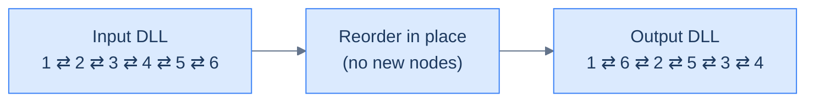
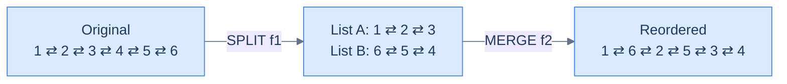
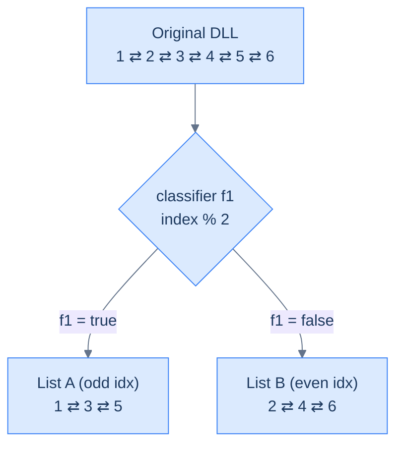
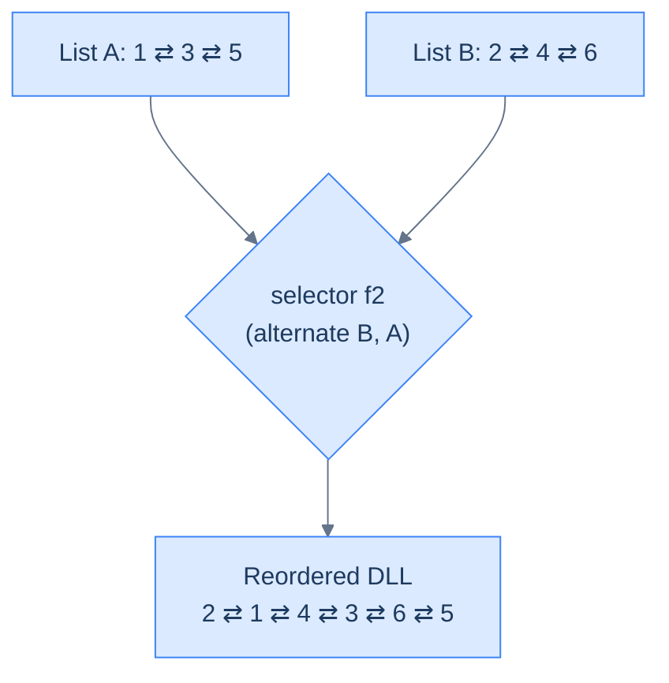
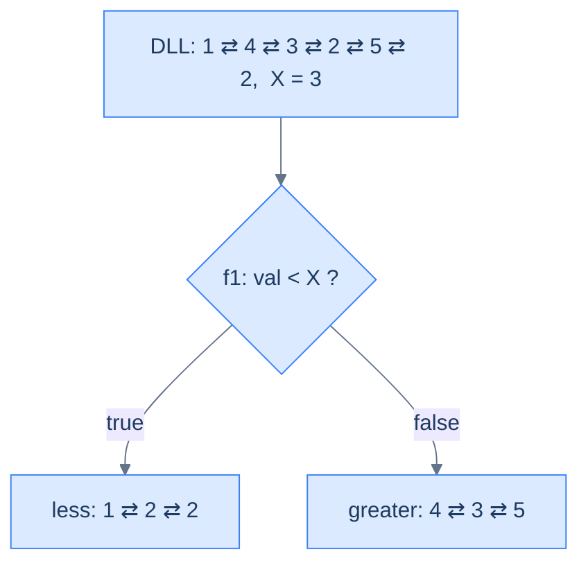
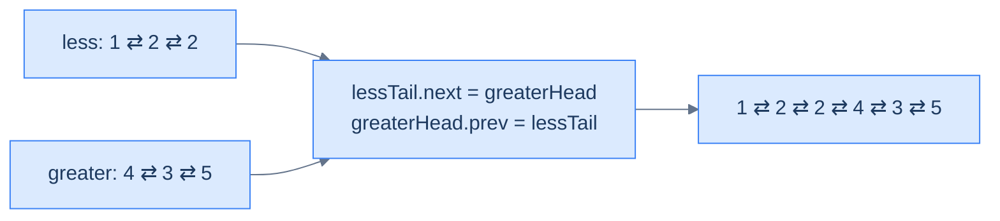
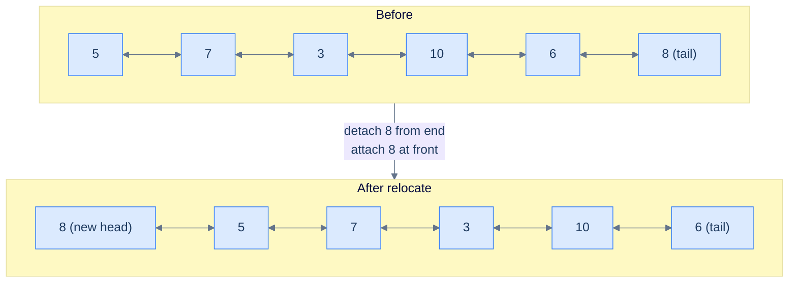
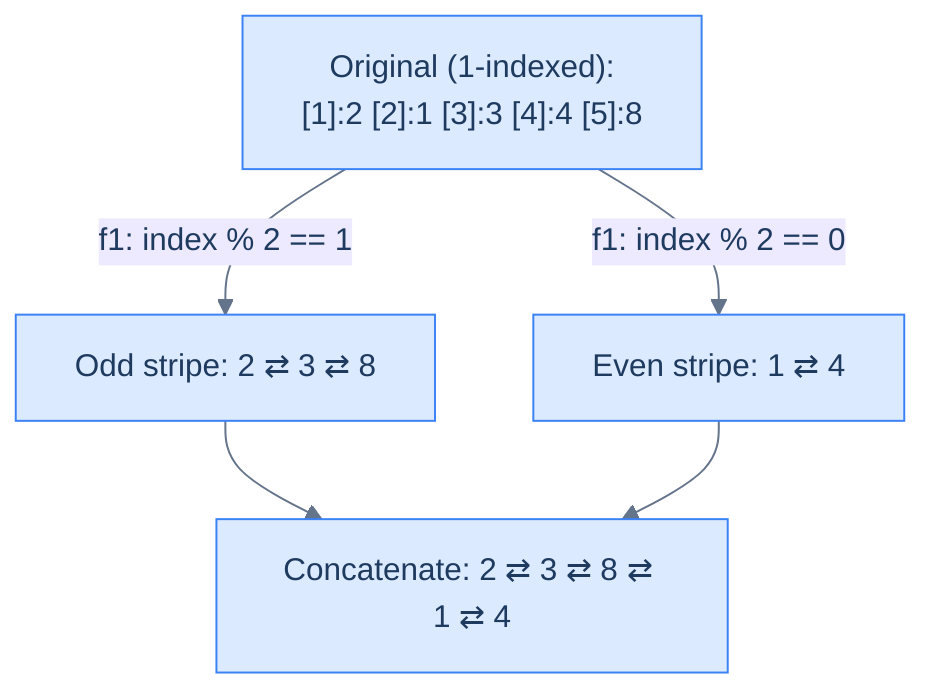
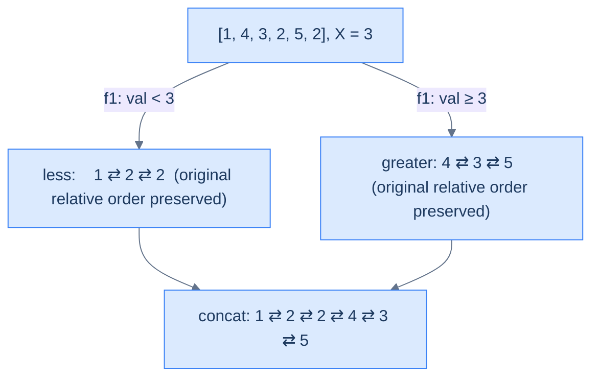
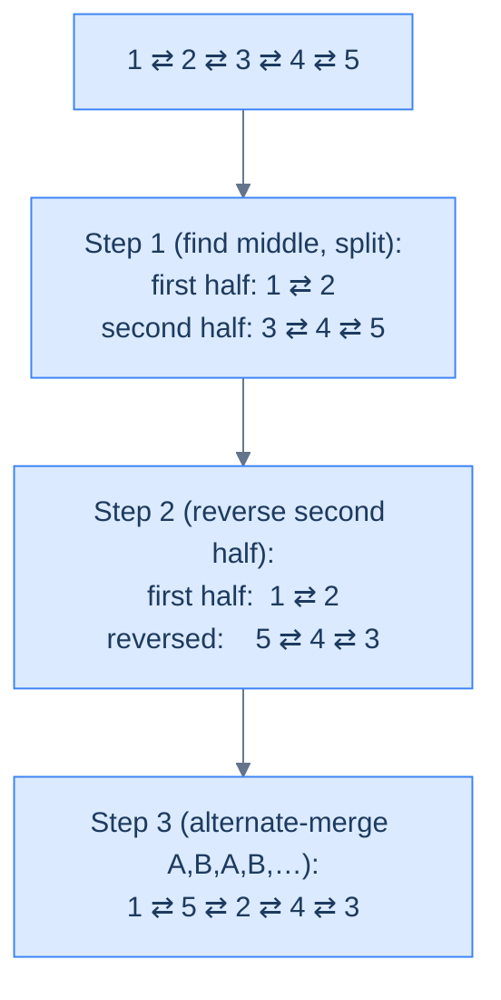

# 8. Pattern: Reorder

## The Hook

Reorder problems look like the scariest thing in the chapter — *"rewrite the entire list in this exotic shape"* — and then dissolve into something almost embarrassing once you see them right. **The choreography is the algorithm.** You're not inventing a new traversal; you're stacking three or four primitive moves you already own — split, reverse, find-the-middle, merge — in a particular order, and the new shape falls out for free.

In a doubly linked list every move costs you twice: forward link plus mirror. That sounds like extra work, but it's actually a gift — `prev` is a free `O(1)` rewind that singly lists have to walk for. Watch how a 50-line problem becomes "split + reverse + alternating-merge", three callable primitives standing on each other's shoulders. By the end of this lesson, you won't see *reorder problems* — you'll see *choreographies*.

---

## Table of contents

1. [Understanding the reorder pattern](#understanding-the-reorder-pattern)
2. [Identifying the reorder pattern](#identifying-the-reorder-pattern)
3. [Relocate node](#relocate-node)
4. [Parity order](#parity-order)
5. [Value partition](#value-partition)
6. [Shuffle list](#shuffle-list)

***

# Understanding the reorder pattern

Some linked list problems require us to reorder the nodes of a given list **in place** based on some condition. In most cases the recipe is the same: first **split** the list using a classifier function `f1` into two (or more) sub-lists, then **merge** them back — either by plain concatenation, or by a custom selector `f2` that picks one node at a time. These are usually **medium**-difficulty problems, and they often pull in helpers from earlier lessons: the **fast-and-slow pointer** trick to find the middle, and **reversal** when one of the sub-lists must be flipped.



<p align="center"><strong>Reorder problems rearrange the <em>same</em> nodes into a new sequence. No new allocations — every <code>next</code> and <code>prev</code> is rewired to produce the target order.</strong></p>



<p align="center"><strong>Every reorder decomposes into <strong>split</strong> + <strong>merge</strong>. The split routes nodes into temporary sub-lists; the merge weaves them back together. Two primitives you've already built — both upgraded to keep the <code>prev</code> pointers honest.</strong></p>

## Reordering technique

Consider a doubly linked list whose nodes must be reordered. The problem almost always has a **split function `f1`** that you use to split the list into two using the split technique. The split for a doubly list is *exactly* the same as for a singly list — with one extra line per move: every time you append a node to a sub-list, also wire its `prev` to the new tail.

Below is an example execution where `f1` routes nodes with odd indices to one list and even indices to the other.



<p align="center"><strong>Step 1 — <strong>split</strong> a DLL. The classifier <code>f1</code> routes nodes into temporary sub-lists. Every "append" updates both <code>tail.next = node</code> and <code>node.prev = tail</code> — the second line is the only difference from a singly-list split.</strong></p>

In most cases, **concatenating** the split lists is enough. Sometimes you need a real merge — a function `f2` that picks one node at a time from either sub-list. The merge for a doubly list is again the same as for a singly list with one extra line: every time you attach a node to the merged tail, also wire its `prev`.

Below is an example execution where `f2` alternates nodes from list B then list A — effectively interleaving them.



<p align="center"><strong>Step 2 — <strong>merge</strong> for a DLL. The selector <code>f2</code> weaves the sub-lists back into one. Every attachment updates <code>tail.next</code> AND <code>node.prev</code>. The combination of <code>f1</code> and <code>f2</code> IS the reorder algorithm.</strong></p>

The reorder technique is simply split + merge in tandem. Pick `f1`, pick `f2`, and the rest is mechanical.

## Algorithm

The algorithm below summarises the reorder technique for **two** lists. It generalises trivially to `k` lists by adding more buckets.

> **Algorithm**
>
> -   **Step 1:** Use the split technique to split the list in **two** using the function `f1`.
> -   **Step 2:** Use the merge technique to merge the **two** lists using the function `f2` (or simply concatenate when `f2` is trivial).
> -   **Step 3:** Return the head of the merged list.

## Implementation

Below is the generic implementation that splits a DLL into two using `f1` and merges them using `f2`. The structure is identical to the singly-list version with **one extra line per attachment** to keep `prev` correct.


```python run

"""
Definition for doubly-linked list.
class ListNode:
    def __init__(self, val):
        self.val = val
        self.prev = None
        self.next = None
"""

from typing import Optional

def reorder_nodes(head: Optional[ListNode], f1, f2) -> Optional[ListNode]:
    # Create dummy nodes and tail references for the two split lists
    dummyA = ListNode(0)
    tailA = dummyA

    dummyB = ListNode(0)
    tailB = dummyB

    # Create current reference to iterate through the list
    current = head

    while current is not None:
        # Use the function `f1` to decide which list this node should go to
        split_first = f1(current)

        if split_first:
            # `current` node goes to the first split list
            tailA.next = current
            current.prev = tailA
            tailA = tailA.next  # Move tailA forward
        else:
            # `current` node goes to the second split list
            tailB.next = current
            current.prev = tailB
            tailB = tailB.next  # Move tailB forward

        # Move to the next node in the original list
        current = current.next

    # Ensure the two split lists end properly
    tailA.next = None
    tailB.next = None

    # Move ahead dummy nodes of split lists to hold the real head
    currentA = dummyA.next
    currentB = dummyB.next

    # Set prev pointer of head of both lists to None
    if currentA:
        currentA.prev = None
    if currentB:
        currentB.prev = None

    # Create dummy node and tail reference for the merged list
    dummy = ListNode(0)
    tail = dummy

    while currentA is not None and currentB is not None:
        # Use the function `f2` to determine which node to merge
        merge_A = f2(currentA, currentB)

        if merge_A:
            tail.next = currentA  # Merge node from currentA
            currentA.prev = tail  # Connect the prev section to tail
            currentA = currentA.next  # Move currentA forward
        else:
            tail.next = currentB  # Merge node from currentB
            currentB.prev = tail  # Connect the prev section to tail
            currentB = currentB.next  # Move currentB forward

        # Move tail forward to the merged node
        tail = tail.next

    # If currentA is not completely traversed, attach remaining nodes
    if currentA is not None:
        tail.next = currentA
        currentA.prev = tail

    # If currentB is not completely traversed, attach remaining nodes
    if currentB is not None:
        tail.next = currentB
        currentB.prev = tail

    # Capture the merged list's head
    new_head = dummy.next
    if new_head:
        new_head.prev = None

    return new_head
```

```java run

/**
 * Definition for doubly-linked list.
 * class ListNode {
 *     int val;
 *     ListNode prev;
 *     ListNode next;
 *     ListNode() {}
 *     ListNode(int val) { this.val = val; }
 * };
 */

class ReorderNodes {
    // Function to reorder nodes based on conditions defined by f1 and f2
    public ListNode reorderNodes(ListNode head) {

        // Create dummy nodes and tail references for the two split lists
        ListNode dummyA = new ListNode(0);
        ListNode tailA = dummyA;

        ListNode dummyB = new ListNode(0);
        ListNode tailB = dummyB;

        // Create current reference to iterate through the list
        ListNode current = head;

        while (current != null) {
            // Use the function `f1` to decide which list this node should go to
            boolean splitFirst = f1(current);

            if (splitFirst) {
                // `current` node goes to the first split list
                tailA.next = current;
                current.prev = tailA;
                tailA = tailA.next; // Move tailA forward
            } else {
                // `current` node goes to the second split list
                tailB.next = current;
                current.prev = tailB;
                tailB = tailB.next; // Move tailB forward
            }

            // Move to the next node in the original list
            current = current.next;
        }

        // Ensure the two split lists end properly
        tailA.next = null;
        tailB.next = null;

        // Move ahead dummy nodes of split lists to hold the real head
        ListNode currentA = dummyA.next;
        ListNode currentB = dummyB.next;

        // Set prev pointer of head of both list to null
        if (currentA != null) currentA.prev = null;
        if (currentB != null) currentB.prev = null;

        // Create dummy node and tail reference for the merged list
        ListNode dummy = new ListNode(0);
        ListNode tail = dummy;

        while (currentA != null && currentB != null) {
            // Use the function `f2` to determine which node to merge
            boolean mergeA = f2(currentA, currentB);

            if (mergeA) {
                tail.next = currentA;     // Merge node from currentA
                currentA.prev = tail;     // Connect the prev section to tail
                currentA = currentA.next; // Move currentA forward
            } else {
                tail.next = currentB;     // Merge node from currentB
                currentB.prev = tail;     // Connect the prev section to tail
                currentB = currentB.next; // Move currentB forward
            }

            // Move tail forward to the merged node
            tail = tail.next;
        }

        // If currentA is not completely traversed, attach remaining nodes
        if (currentA != null) {
            tail.next = currentA;
            currentA.prev = tail;
        }

        // If currentB is not completely traversed, attach remaining nodes
        if (currentB != null) {
            tail.next = currentB;
            currentB.prev = tail;
        }

        // Capture the merged list's head
        ListNode newHead = dummy.next;
        if (newHead != null) newHead.prev = null;

        return newHead;
    }
}
```


## Complexity Analysis

The runtime and space complexity for the reorder technique that splits the list into **two** lists is straightforward. We traverse the entire list once to split — that's a linear **O(N)** pass. If we only need to concatenate, the merge is **O(1)**; otherwise we may traverse both sub-lists in the worst case, which is again **O(N)** total. We always traverse the full list during the split, so the runtime is **O(N)** in every case.

When we reorder a list by splitting into two, we only allocate a constant number of dummy nodes and update references — so the space complexity is **O(1)** in every case.

> **Best Case:**
>
> -   Space Complexity — **O(1)**
> -   Time Complexity — **O(N)**
>
> **Worst Case:**
>
> -   Space Complexity — **O(1)**
> -   Time Complexity — **O(N)**

> *Friction prompt — before reading on: try to predict the bug that bites you the first time you write this on a doubly-linked list. The forward pointers will look fine. What breaks?*

(Answer: the `prev` pointers. If you forget the mirror update on either the split or the merge, every backward traversal silently snaps somewhere — and the test harness that prints forward will tell you nothing is wrong.)

***

# Identifying the reorder pattern

The linked list problems that require reordering nodes **in place** are the ones the reorder technique was built for. They're usually **medium**: split using some classifier, merge using some selector. Smaller subproblems often use **reversal** or the **fast-and-slow pointer** trick to find the middle. If a problem statement (or its solution) follows the template below, you can solve it with reorder.

**Template:**

> Given a linked list, reorder its nodes.

## Example

Let's use this concrete problem to nail the pattern down.

> **Problem statement:** Given a doubly linked list and a value `x`, reorder its nodes so all nodes with values less than `x` come before the nodes with values greater than or equal to `x`, keeping the relative order between nodes in both parts the same.

### Reorder technique solution

We need to reorder nodes in place — that fits the generic template exactly.

**Template:**

> Given a linked list, reorder its nodes.

To reorder, we use the split technique to split the given list into two: the first list collects all nodes with values `< x`; the second collects all nodes with values `>= x`. We create two dummy nodes `dummyA`, `dummyB` and tail references `tailA` and `tailB` initialised with the dummies. We initialise `current` with the head and iterate from start to end.

In each iteration we compare `current.val` to `x` and append the node to the correct sub-list (with the mirror update on `current.prev`). Then we move on.



<p align="center"><strong>Split the list into two using <code>f1(node) = node.val &lt; X</code>. Each append wires both <code>tail.next</code> and <code>node.prev</code>.</strong></p>

We don't need a custom merge — concatenating the two lists is enough. We use the tail and dummy references from the split to wire `lessTail.next = greaterHead` and `greaterHead.prev = lessTail`.



<p align="center"><strong>Concatenate the two split lists by linking the less-tail to the greater-head — and (DLL-only) wiring the mirror back-edge so backward traversal still works end-to-end.</strong></p>

The implementation of the solution using the reorder technique is given below. Notice that this is the *same* code we'll re-use as the standalone "Value partition" problem later in the lesson.


```python run
"""
Definition for doubly-linked list.
class ListNode:
    def __init__(self, val):
        self.val = val
        self.prev = None
        self.next = None
"""

from typing import Optional

class Solution:
    def split_list_by_value(
        self, head: Optional[ListNode], X: int
    ) -> list:

        # Create dummy nodes to initialize the heads of two separate lists.
        # List for nodes with values less than X.
        less_dummy = ListNode(0)
        less_tail = less_dummy

        # List for nodes with values greater than or equal to X.
        greater_dummy = ListNode(0)
        greater_tail = greater_dummy

        # Start traversing the original list from the head.
        current = head

        # Traverse and split nodes based on the value of X.
        while current:

            # If the value of the current node is less than X, it should
            # be appended to the list for nodes < X.
            if current.val < X:

                # Append current node to list for nodes < X.
                less_tail.next = current

                # Set the previous pointer of the current node to
                # less_tail
                current.prev = less_tail

                # Move less_tail to the newly added node.
                less_tail = less_tail.next

            # Otherwise, the value of the current node is greater than
            # or equal to X, and it should be appended to the list for
            # nodes >= X.
            else:

                # Append current node to list for nodes >= X.
                greater_tail.next = current

                # Set the previous pointer of the current node to
                # greater_tail
                current.prev = greater_tail

                # Move greater_tail to the newly added node.
                greater_tail = greater_tail.next

            # Proceed to the next node in the original list.
            current = current.next

        # Terminate the less list from the beginning and end
        if less_dummy.next is not None:
            less_dummy.next.prev = None
        less_tail.next = None

        # Terminate the greater list from the beginning and end
        if greater_dummy.next is not None:
            greater_dummy.next.prev = None
        greater_tail.next = None

        # Return heads of both lists, excluding dummy nodes.
        return [less_dummy.next, greater_dummy.next]

    def merge_less_and_greater_lists(
        self,
        less_head: Optional[ListNode],
        greater_head: Optional[ListNode],
    ) -> Optional[ListNode]:

        # If the first list (less_head) is empty, return greater_head as
        # the concatenated list.
        if less_head is None:
            return greater_head

        # If the second list (greater_head) is empty, return less_head as
        # the concatenated list.
        if greater_head is None:
            return less_head

        # Find the end of the first list (less_head) to append
        # greater_head.
        current = less_head
        while current and current.next:
            current = current.next

        # Append greater_head to the end of less_head.
        current.next = greater_head

        # Set the previous pointer of the greater_head node to current
        greater_head.prev = current

        return less_head

    def value_partition(
        self, head: Optional[ListNode], X: int
    ) -> Optional[ListNode]:

        # Return the head if the list is empty or has only one node.
        if head is None or head.next is None:
            return head

        # Split the original list into two lists: nodes < X and nodes >=
        # X.
        heads = self.split_list_by_value(head, X)

        # Head of list with nodes < X.
        less_head = heads[0]

        # Head of list with nodes >= X.
        greater_head = heads[1]

        # Merge both lists and return the head of the combined list.
        return self.merge_less_and_greater_lists(less_head, greater_head)
```

```java run
import java.util.*;

/**
 * Definition for doubly-linked list.
 * class ListNode {
 *     int val;
 *     ListNode prev;
 *     ListNode next;
 *     ListNode() {}
 *     ListNode(int val) { this.val = val; }
 * };
 */

class Solution {
    public List<ListNode> splitListByValue(ListNode head, int X) {

        // Create dummy nodes to initialize the heads of two separate
        // lists. List for nodes with values less than X.
        ListNode lessDummy = new ListNode(0);
        ListNode lessTail = lessDummy;

        // List for nodes with values greater than or equal to X.
        ListNode greaterDummy = new ListNode(0);
        ListNode greaterTail = greaterDummy;

        // Start traversing the original list from the head.
        ListNode current = head;

        // Traverse and split nodes based on the value of X.
        while (current != null) {

            // If the value of the current node is less than X, it should
            // be appended to the list for nodes < X.
            if (current.val < X) {

                // Append current node to list for nodes < X.
                lessTail.next = current;

                // Set the previous pointer of the current node to
                // lessTail
                current.prev = lessTail;

                // Move lessTail to the newly added node.
                lessTail = lessTail.next;
            }

            // Otherwise, the value of the current node is greater than
            // or equal to X, and it should be appended to the list for
            // nodes >= X.
            else {

                // Append current node to list for nodes >= X.
                greaterTail.next = current;

                // Set the previous pointer of the current node to
                // greaterTail
                current.prev = greaterTail;

                // Move greaterTail to the newly added node.
                greaterTail = greaterTail.next;
            }

            // Proceed to the next node in the original list.
            current = current.next;
        }

        // Terminate the less list from the beginning and end
        if (lessDummy.next != null) {
            lessDummy.next.prev = null;
        }
        lessTail.next = null;

        // Terminate the greater list from the beginning and end
        if (greaterDummy.next != null) {
            greaterDummy.next.prev = null;
        }
        greaterTail.next = null;

        // Return heads of both lists, excluding dummy nodes.
        return Arrays.asList(lessDummy.next, greaterDummy.next);
    }

    public ListNode mergeLessAndGreaterLists(
        ListNode lessHead,
        ListNode greaterHead
    ) {

        // If the first list (lessHead) is empty, return greaterHead as
        // the concatenated list.
        if (lessHead == null) {
            return greaterHead;
        }

        // If the second list (greaterHead) is empty, return lessHead as
        // the concatenated list.
        if (greaterHead == null) {
            return lessHead;
        }

        // Find the end of the first list (lessHead) to append
        // greaterHead.
        ListNode current = lessHead;
        while (current != null && current.next != null) {
            current = current.next;
        }

        // Append greaterHead to the end of lessHead.
        current.next = greaterHead;

        // Set the previous pointer of the greaterHead node to current
        greaterHead.prev = current;

        return lessHead;
    }

    public ListNode valuePartition(ListNode head, int X) {

        // Return the head if the list is empty or has only one node.
        if (head == null || head.next == null) {
            return head;
        }

        // Split the original list into two lists: nodes < X and nodes >=
        // X.
        List<ListNode> heads = splitListByValue(head, X);

        // Head of list with nodes < X.
        ListNode lessHead = heads.get(0);

        // Head of list with nodes >= X.
        ListNode greaterHead = heads.get(1);

        // Merge both lists and return the head of the combined list.
        return mergeLessAndGreaterLists(lessHead, greaterHead);
    }
}
```


The implementation above uses the split list technique to split into two and then merges them by concatenation.

## Example problems

Most problems in this category are **medium**, and most are solved by splitting and concatenating. Sometimes you do need a real merge with a custom selector; sometimes you also need reversal or fast/slow pointers as a sub-routine. Here's the lineup:

> -   **[Relocate node](https://www.codeintuition.io/courses/doubly-linked-list/Iyg36jeWViatZO_Q2w3ge)**
> -   **[Parity order](https://www.codeintuition.io/courses/doubly-linked-list/jlvpNSWUKRJThq6HKI1_H)**
> -   **[Value partition](https://www.codeintuition.io/courses/doubly-linked-list/sKHcaBMvtdwBr48bD_7Ck)**
> -   **[Shuffle list](https://www.codeintuition.io/courses/doubly-linked-list/YNry5kVCX7k0WahSEcDUy)**

We'll now solve these to drill the technique. Watch how each one is just a different `(f1, f2)` plug-in to the same skeleton — until the last one, where reversal joins the dance.

***

# Relocate node

## The Problem

> Given the **head** of a doubly linked list, write a function to move the last node of the list to the start and return the head of the reordered list.

```
Example 1
  Input:  head = [5, 7, 3, 10, 6, 8]
  Output: [8, 5, 7, 3, 10, 6]
  Reason: The last node (8) is moved to the start.

Example 2
  Input:  head = [5, 7]
  Output: [7, 5]
  Reason: The last node (7) is moved to the start.

Example 3
  Input:  head = [5]
  Output: [5]
  Reason: A single node is both head and tail — nothing to move.
```

<details>
<summary><h2>What Does "Relocate" Mean Here?</h2></summary>


Picture the list as a chain of train cars. Relocate means: detach the last car, walk it to the front, and re-attach it as the new locomotive. Two splices: one at the back (uncouple the last car) and one at the front (couple it on). In a DLL, each "splice" is a forward link plus a mirror.



<p align="center"><strong>Relocate the last node — split = (head … penultimate, last); merge = concatenate(last, head). Two pointer splices, both with mirror updates.</strong></p>

</details>
<details>
<summary><h2>Strategy</h2></summary>


Reorder skeleton: `f1` selects the last node into bucket B and everything else into bucket A. `f2` is "B then A" (concatenate, with B on the left). For DLLs the only twist is the mirror: when we make the last node the new head, its `prev` must become `null`, and the old head's `prev` must point at it.

> **Algorithm**
>
> -   **Step 1:** Walk to the end keeping a `previous` reference. After the loop, `current` is the last node and `previous` is the second-to-last.
> -   **Step 2:** Detach the last node: `previous.next = null`, `current.prev = null`.
> -   **Step 3:** Splice it at the front: `current.next = head`, `head.prev = current`.
> -   **Step 4:** Return `current` as the new head.
> -   **Edge cases:** empty list and single node — return as-is.

</details>
<details>
<summary><h2>Solution &amp; Analysis</h2></summary>

### The Solution

```python run
from typing import Optional, Tuple

class ListNode:
    def __init__(self, val=0, prev=None, nxt=None):
        self.val = val
        self.prev = prev
        self.next = nxt


def from_list(values):
    if not values:
        return None
    head = ListNode(values[0])
    cur = head
    for v in values[1:]:
        node = ListNode(v, prev=cur)
        cur.next = node
        cur = node
    return head


def to_list(head):
    out = []
    while head is not None:
        out.append(head.val)
        head = head.next
    return out


class Solution:
    def split_last_node(
        self, head: ListNode
    ) -> Tuple[ListNode, ListNode]:
        current = head
        previous = None

        # Traverse the list until the last node is reached
        while current.next is not None:

            # Keep track of the previous node
            previous = current

            # Move to the next node
            current = current.next

        # Disconnect the last node
        if previous is not None:
            previous.next = None

        # Update last node's prev pointer
        if current is not None:
            current.prev = None

        # Return {head of remaining list, last node}
        return head, current

    def merge_last_node(
        self,
        last_node: Optional[ListNode],
        first_node: Optional[ListNode],
    ) -> Optional[ListNode]:

        # If there is no last node, return the first node
        if not last_node:
            return first_node

        # Connect the last node to the first node
        last_node.next = first_node

        # Update the first node's prev pointer
        if first_node is not None:
            first_node.prev = last_node

        return last_node

    def relocate_node(
        self, head: Optional[ListNode]
    ) -> Optional[ListNode]:

        # If the list is empty or contains only one node, no need to
        # modify it
        if not head or not head.next:
            return head

        # Split the last node from the list
        first_node, last_node = self.split_last_node(head)

        # Merge the last node at the front
        return self.merge_last_node(last_node, first_node)


# Examples from the problem statement
head = from_list([5, 7, 3, 10, 6, 8])
print(to_list(Solution().relocate_node(head)))   # [8, 5, 7, 3, 10, 6]

head = from_list([5, 7])
print(to_list(Solution().relocate_node(head)))   # [7, 5]

head = from_list([5])
print(to_list(Solution().relocate_node(head)))   # [5]

# Edge cases
head = from_list([1, 2, 3])
print(to_list(Solution().relocate_node(head)))   # [3, 1, 2]

head = from_list([1, 2, 3, 4, 5])
print(to_list(Solution().relocate_node(head)))   # [5, 1, 2, 3, 4]

head = from_list([9, 9])
print(to_list(Solution().relocate_node(head)))   # [9, 9]

head = from_list([1, 2, 3, 4])
print(to_list(Solution().relocate_node(head)))   # [4, 1, 2, 3]
```

```java run
import java.util.*;

public class Main {
    static class ListNode {
        int val;
        ListNode prev;
        ListNode next;
        ListNode() {}
        ListNode(int val) { this.val = val; }
    }

    static ListNode fromList(int... values) {
        if (values.length == 0) return null;
        ListNode head = new ListNode(values[0]);
        ListNode cur = head;
        for (int i = 1; i < values.length; i++) {
            ListNode node = new ListNode(values[i]);
            node.prev = cur;
            cur.next = node;
            cur = node;
        }
        return head;
    }

    static java.util.List<Integer> toList(ListNode head) {
        java.util.List<Integer> out = new java.util.ArrayList<>();
        while (head != null) { out.add(head.val); head = head.next; }
        return out;
    }

    static class Solution {
        private List<ListNode> splitLastNode(ListNode head) {
            ListNode current = head;
            ListNode previous = null;

            // Traverse the list until the last node is reached
            while (current.next != null) {

                // Keep track of the previous node
                previous = current;

                // Move to the next node
                current = current.next;
            }

            // Disconnect the last node
            if (previous != null) {
                previous.next = null;
            }

            // Update last node's prev pointer
            if (current != null) {
                current.prev = null;
            }

            // Return {head of remaining list, last node}
            return Arrays.asList(head, current);
        }

        private ListNode mergeLastNode(ListNode lastNode, ListNode firstNode) {

            // If there is no last node, return the first node
            if (lastNode == null) {
                return firstNode;
            }

            // Connect the last node to the first node
            lastNode.next = firstNode;

            // Update the first node's prev pointer
            if (firstNode != null) {
                firstNode.prev = lastNode;
            }

            return lastNode;
        }

        public ListNode relocateNode(ListNode head) {

            // If the list is empty or contains only one node, no need to
            // modify it
            if (head == null || head.next == null) {
                return head;
            }

            // Split the last node from the list
            List<ListNode> heads = splitLastNode(head);
            ListNode firstNode = heads.get(0);
            ListNode lastNode = heads.get(1);

            // Merge the last node at the front
            return mergeLastNode(lastNode, firstNode);
        }
    }

    public static void main(String[] args) {
        // Examples from the problem statement
        System.out.println(toList(new Solution().relocateNode(fromList(5, 7, 3, 10, 6, 8))));  // [8, 5, 7, 3, 10, 6]
        System.out.println(toList(new Solution().relocateNode(fromList(5, 7))));                // [7, 5]
        System.out.println(toList(new Solution().relocateNode(fromList(5))));                   // [5]

        // Edge cases
        System.out.println(toList(new Solution().relocateNode(fromList(1, 2, 3))));             // [3, 1, 2]
        System.out.println(toList(new Solution().relocateNode(fromList(1, 2, 3, 4, 5))));       // [5, 1, 2, 3, 4]
        System.out.println(toList(new Solution().relocateNode(fromList(9, 9))));                // [9, 9]
        System.out.println(toList(new Solution().relocateNode(fromList(1, 2, 3, 4))));          // [4, 1, 2, 3]
    }
}
```


<details>
<summary><strong>Trace — head = [5, 7, 3, 10, 6, 8]</strong></summary>

```
Walk to last (split_last_node):
  Step 1 │ current=5, previous=null  → advance
  Step 2 │ current=7, previous=5     → advance
  Step 3 │ current=3, previous=7     → advance
  Step 4 │ current=10, previous=3    → advance
  Step 5 │ current=6, previous=10    → advance
  Step 6 │ current=8 (next is null)  → STOP. previous=6.

Detach last (sever both directions):
  previous(6).next = null     →  5⇄7⇄3⇄10⇄6  +  8 (detached)
  current(8).prev = null      →  node 8 drops its back-link to node 6

Splice at front (merge_last_node — wire both directions):
  last_node(8).next = first_node(5)   →  8 → 5 ⇄ 7 ⇄ 3 ⇄ 10 ⇄ 6
  first_node(5).prev = last_node(8)   →  8 ⇄ 5 ⇄ 7 ⇄ 3 ⇄ 10 ⇄ 6
Result: [8, 5, 7, 3, 10, 6] ✓
```

</details>

### Complexity Analysis

| Metric | Cost | Why |
|---|---|---|
| Time  | **O(N)** | One pass to find the last node. |
| Space | **O(1)** | Two pointer variables; no allocation. |

### Edge Cases

| Case | Example | Expected | Reasoning |
|---|---|---|---|
| Empty list | `[]` | `[]` | `head == null` → return immediately. |
| Single node | `[5]` | `[5]` | `head.next == null` → already at front. |
| Two nodes | `[5, 7]` | `[7, 5]` | Just swap; `previous` stops at the first node. |

</details>

***

# Parity order

## The Problem

> Given the **head** of a doubly linked list, write a function to group all the nodes that appear at odd indices together, followed by the nodes that appear at even indices, and return the head of the reordered list. **The indices start with `1`.**

```
Example 1
  Input:  head = [2, 1, 3, 4, 8]      // indices: 1 2 3 4 5
  Output: [2, 3, 8, 1, 4]
  Reason: Odd indices (1,3,5) → 2, 3, 8. Even indices (2,4) → 1, 4.

Example 2
  Input:  head = []
  Output: []
  Reason: Empty in, empty out.
```

<details>
<summary><h2>What Does "Parity Order" Mean?</h2></summary>


Imagine numbering the nodes from 1 at the head. The **odd-indexed** nodes (positions 1, 3, 5, …) form one stripe; the **even-indexed** nodes (2, 4, 6, …) form the other. Parity order means: stripe-1 first, then stripe-2, in their original relative order.



<p align="center"><strong>Parity order — split by index parity, concatenate odd stripe before even stripe. The reorder skeleton with <code>f1 = counter is odd</code> and <code>f2 = simple concat</code>.</strong></p>

</details>
<details>
<summary><h2>Strategy</h2></summary>


This is the canonical reorder skeleton. `f1(node) = (counter % 2 == 1)`. `f2` is just concatenation. The only DLL-specific touch is wiring `prev` on every append and on the final concat join.

> **Algorithm**
>
> -   **Step 1:** Split — walk the list with a 1-based counter. Append each node to `oddDummy`'s tail or `evenDummy`'s tail based on `counter % 2`. Mirror `prev` on every append.
> -   **Step 2:** Terminate both sub-lists; null out the `prev` of each head.
> -   **Step 3:** Concatenate — `oddTail.next = evenHead; evenHead.prev = oddTail`.
> -   **Step 4:** Return `oddHead`.

</details>
<details>
<summary><h2>Solution &amp; Analysis</h2></summary>

### The Solution

```python run
from typing import Optional, Tuple

class ListNode:
    def __init__(self, val=0, prev=None, nxt=None):
        self.val = val
        self.prev = prev
        self.next = nxt


def from_list(values):
    if not values:
        return None
    head = ListNode(values[0])
    cur = head
    for v in values[1:]:
        node = ListNode(v, prev=cur)
        cur.next = node
        cur = node
    return head


def to_list(head):
    out = []
    while head is not None:
        out.append(head.val)
        head = head.next
    return out


class Solution:
    def split_by_parity(
        self, head: Optional[ListNode]
    ) -> Tuple[Optional[ListNode], Optional[ListNode]]:

        # Initialize head and tail references for the two split lists
        odd_dummy = ListNode(0)
        odd_tail = odd_dummy

        even_dummy = ListNode(0)
        even_tail = even_dummy

        # Create current reference to iterate through the list
        current = head

        # To track alternate positions
        counter = 1

        # Iterate through the list and split nodes into two lists
        while current:

            # If the counter is odd then the node goes to the odd list
            if counter % 2 == 1:

                # `current` node goes to the odd split list
                odd_tail.next = current
                current.prev = odd_tail
                odd_tail = odd_tail.next

            # Otherwise, the node goes to the even list
            else:

                # `current` node goes to the even split list
                even_tail.next = current
                current.prev = even_tail
                even_tail = even_tail.next

            # Move to the next node in the original list
            current = current.next
            counter += 1

        # Terminate the odd list from the beginning and end
        if odd_dummy.next is not None:
            odd_dummy.next.prev = None
        odd_tail.next = None

        # Terminate the even list from the beginning and end
        if even_dummy.next is not None:
            even_dummy.next.prev = None
        even_tail.next = None

        return odd_dummy.next, even_dummy.next

    def merge_odd_and_even_lists(
        self, odd_head: Optional[ListNode], even_head: Optional[ListNode]
    ) -> Optional[ListNode]:

        # If the odd list is empty return the even list
        if not odd_head:
            return even_head

        # If the even list is empty return the odd list
        if not even_head:
            return odd_head

        # Traverse to the end of the odd list
        current = odd_head
        while current.next:
            current = current.next

        # Connect the even list at the end of the odd list
        current.next = even_head
        even_head.prev = current

        return odd_head

    def parity_order(
        self, head: Optional[ListNode]
    ) -> Optional[ListNode]:

        # If the list is empty or contains only one node, no splitting is
        # necessary
        if not head or not head.next:
            return head

        # Split the list into odd and even lists
        odd_head, even_head = self.split_by_parity(head)

        # Append the  even list at the end of the odd list and
        # return the head of the merged list
        return self.merge_odd_and_even_lists(odd_head, even_head)


# Examples from the problem statement
head = from_list([2, 1, 3, 4, 8])
print(to_list(Solution().parity_order(head)))   # [2, 3, 8, 1, 4]

head = from_list([])
print(to_list(Solution().parity_order(head)))   # []

# Edge cases
head = from_list([1])
print(to_list(Solution().parity_order(head)))   # [1]

head = from_list([1, 2])
print(to_list(Solution().parity_order(head)))   # [1, 2]

head = from_list([1, 2, 3])
print(to_list(Solution().parity_order(head)))   # [1, 3, 2]

head = from_list([1, 2, 3, 4])
print(to_list(Solution().parity_order(head)))   # [1, 3, 2, 4]

head = from_list([5, 5, 5, 5, 5])
print(to_list(Solution().parity_order(head)))   # [5, 5, 5, 5, 5]

head = from_list([1, 2, 3, 4, 5, 6])
print(to_list(Solution().parity_order(head)))   # [1, 3, 5, 2, 4, 6]
```

```java run
import java.util.*;

public class Main {
    static class ListNode {
        int val;
        ListNode prev;
        ListNode next;
        ListNode() {}
        ListNode(int val) { this.val = val; }
    }

    static ListNode fromList(int... values) {
        if (values.length == 0) return null;
        ListNode head = new ListNode(values[0]);
        ListNode cur = head;
        for (int i = 1; i < values.length; i++) {
            ListNode node = new ListNode(values[i]);
            node.prev = cur;
            cur.next = node;
            cur = node;
        }
        return head;
    }

    static java.util.List<Integer> toList(ListNode head) {
        java.util.List<Integer> out = new java.util.ArrayList<>();
        while (head != null) { out.add(head.val); head = head.next; }
        return out;
    }

    static class Solution {
        private List<ListNode> splitByParity(ListNode head) {

            // Initialize head and tail references for the two split lists
            ListNode oddDummy = new ListNode(0);
            ListNode oddTail = oddDummy;

            ListNode evenDummy = new ListNode(0);
            ListNode evenTail = evenDummy;

            // Create current reference to iterate through the list
            ListNode current = head;

            // To track alternate positions
            int counter = 1;

            // Iterate through the list and split nodes into two lists
            while (current != null) {

                // If the counter is odd then the node goes to the odd list
                if (counter % 2 == 1) {

                    // `current` node goes to the odd split list
                    oddTail.next = current;
                    current.prev = oddTail;
                    oddTail = oddTail.next;
                }

                // Otherwise, the node goes to the even list
                else {

                    // `current` node goes to the even split list
                    evenTail.next = current;
                    current.prev = evenTail;
                    evenTail = evenTail.next;
                }

                // Move to the next node in the original list
                current = current.next;
                counter++;
            }

            // Terminate the odd list from the beginning and end
            if (oddDummy.next != null) {
                oddDummy.next.prev = null;
            }
            oddTail.next = null;

            // Terminate the even list from the beginning and end
            if (evenDummy.next != null) {
                evenDummy.next.prev = null;
            }
            evenTail.next = null;

            return Arrays.asList(oddDummy.next, evenDummy.next);
        }

        private ListNode mergeOddAndEvenLists(
            ListNode oddHead,
            ListNode evenHead
        ) {

            // If the odd list is empty return the even list
            if (oddHead == null) {
                return evenHead;
            }

            // If the even list is empty return the odd list
            if (evenHead == null) {
                return oddHead;
            }

            // Traverse to the end of the odd list
            ListNode current = oddHead;
            while (current.next != null) {
                current = current.next;
            }

            // Connect the even list at the end of the odd list
            current.next = evenHead;
            evenHead.prev = current;

            return oddHead;
        }

        public ListNode parityOrder(ListNode head) {

            // If the list is empty or contains only one node, no splitting
            // is necessary
            if (head == null || head.next == null) {
                return head;
            }

            // Split the list into odd and even lists
            List<ListNode> heads = splitByParity(head);
            ListNode oddHead = heads.get(0);
            ListNode evenHead = heads.get(1);

            // Append the  even list at the end of the odd list and
            // return the head of the merged list
            return mergeOddAndEvenLists(oddHead, evenHead);
        }
    }

    public static void main(String[] args) {
        // Examples from the problem statement
        System.out.println(toList(new Solution().parityOrder(fromList(2, 1, 3, 4, 8))));   // [2, 3, 8, 1, 4]
        System.out.println(toList(new Solution().parityOrder(fromList())));                // []

        // Edge cases
        System.out.println(toList(new Solution().parityOrder(fromList(1))));               // [1]
        System.out.println(toList(new Solution().parityOrder(fromList(1, 2))));            // [1, 2]
        System.out.println(toList(new Solution().parityOrder(fromList(1, 2, 3))));         // [1, 3, 2]
        System.out.println(toList(new Solution().parityOrder(fromList(1, 2, 3, 4))));      // [1, 3, 2, 4]
        System.out.println(toList(new Solution().parityOrder(fromList(5, 5, 5, 5, 5))));   // [5, 5, 5, 5, 5]
        System.out.println(toList(new Solution().parityOrder(fromList(1, 2, 3, 4, 5, 6)))); // [1, 3, 5, 2, 4, 6]
    }
}
```


<details>
<summary><strong>Trace — head = [2, 1, 3, 4, 8]</strong></summary>

```
Split (counter starts at 1) — each append wires tail.next AND current.prev:
  Step 1 │ counter=1, val=2 │ odd_tail.next=2,  2.prev=odd_tail  │ odd:  2
  Step 2 │ counter=2, val=1 │ even_tail.next=1, 1.prev=even_tail │ even: 1
  Step 3 │ counter=3, val=3 │ odd_tail.next=3,  3.prev=odd_tail  │ odd:  2 ⇄ 3
  Step 4 │ counter=4, val=4 │ even_tail.next=4, 4.prev=even_tail │ even: 1 ⇄ 4
  Step 5 │ counter=5, val=8 │ odd_tail.next=8,  8.prev=odd_tail  │ odd:  2 ⇄ 3 ⇄ 8

Terminate lists (null the head's prev, null the tail's next):
  odd:  2 ⇄ 3 ⇄ 8   (odd_dummy.next.prev = None; odd_tail.next = None)
  even: 1 ⇄ 4       (even_dummy.next.prev = None; even_tail.next = None)

Concat (merge_odd_and_even_lists — wire both directions):
  walk odd to 8.   8.next = 1;  1.prev = 8.
Result: [2, 3, 8, 1, 4] ✓
```

</details>

> *Friction prompt — predict before reading on: in the `merge_odd_and_even_lists` helper, what bug exists in the original singly-style code if `evenHead` is null but `oddHead` is not? Trace what `current.next = evenHead` does in that case.*

(Answer: nothing wrong — the early returns at the top guard against both being null. But notice we DON'T need to traverse to find `oddTail` here either; in real production code we'd just keep the `oddTail` reference from the split phase and skip the walk. The walk here is for clarity, not necessity.)

### Complexity Analysis

| Metric | Cost | Why |
|---|---|---|
| Time  | **O(N)** | One split pass + one walk to concat. |
| Space | **O(1)** | Two dummies and a fixed number of pointers. |

### Edge Cases

| Case | Example | Expected | Reasoning |
|---|---|---|---|
| Empty | `[]` | `[]` | Guard at top returns immediately. |
| Single node | `[5]` | `[5]` | One node is at index 1 — already in odd stripe alone. |
| Two nodes | `[5, 7]` | `[5, 7]` | Already partitioned: 5 odd, 7 even. |
| All odd-length | `[1,2,3]` | `[1, 3, 2]` | Odd stripe gets 2 nodes, even gets 1. |

</details>

***

# Value partition

## The Problem

> Given the **head** of a doubly linked list and a value **X**, write a function to partition the list such that all nodes less than X come before nodes greater than or equal to X, and return the head of the reordered list. The original relative order of the nodes in each of the two partitions should be preserved.

```
Example 1
  Input:  head = [1, 4, 3, 2, 5, 2], X = 3
  Output: [1, 2, 2, 4, 3, 5]
  Reason: <3 → 1,2,2  ;  ≥3 → 4,3,5

Example 2
  Input:  head = [2, 1], X = 2
  Output: [1, 2]
  Reason: <2 → 1  ;  ≥2 → 2
```

<details>
<summary><h2>What Does "Stable Partition" Mean?</h2></summary>


Stability is the catch. Sorting would also produce a valid partition, but it would scramble the relative order inside each part. Here we must preserve order: among nodes `< X`, the one that came first stays first; same for the `>= X` group. This is exactly what the split-and-concat skeleton gives us automatically — appending to a tail keeps insertion order intact.



<p align="center"><strong>Stable value partition — appending nodes in scan order to each tail preserves the original ordering inside each bucket. Concat with mirror gives the final DLL.</strong></p>

</details>
<details>
<summary><h2>Strategy</h2></summary>


This is the same template you saw at the top of the lesson. `f1(node) = (node.val < X)`. `f2` is plain concatenation. The DLL bookkeeping is what matters: every append wires `prev`, and the join between the two stripes wires both directions.

> **Algorithm**
>
> -   **Step 1:** Split — walk the list, route each node into `lessTail` if `node.val < X` else into `greaterTail`. Mirror `prev` on every append.
> -   **Step 2:** Terminate both sub-lists; null `prev` on each head.
> -   **Step 3:** Concatenate — walk to the end of less-list (or use the saved `lessTail`), then `lessTail.next = greaterHead; greaterHead.prev = lessTail`.
> -   **Step 4:** Return `lessHead` (or `greaterHead` if less-list is empty).

</details>
<details>
<summary><h2>Solution &amp; Analysis</h2></summary>

### The Solution

This is the same code we showed in the **Identifying the reorder pattern** section earlier — re-presented here as the dedicated problem solution.


```python run
from typing import Optional

class ListNode:
    def __init__(self, val=0, prev=None, nxt=None):
        self.val = val
        self.prev = prev
        self.next = nxt


def from_list(values):
    if not values:
        return None
    head = ListNode(values[0])
    cur = head
    for v in values[1:]:
        node = ListNode(v, prev=cur)
        cur.next = node
        cur = node
    return head


def to_list(head):
    out = []
    while head is not None:
        out.append(head.val)
        head = head.next
    return out


class Solution:
    def split_list_by_value(
        self, head: Optional[ListNode], X: int
    ) -> list:

        # Create dummy nodes to initialize the heads of two separate
        # lists. List for nodes with values less than X.
        less_dummy = ListNode(0)
        less_tail = less_dummy

        # List for nodes with values greater than or equal to X.
        greater_dummy = ListNode(0)
        greater_tail = greater_dummy

        # Start traversing the original list from the head.
        current = head

        # Traverse and split nodes based on the value of X.
        while current:

            # If the value of the current node is less than X, it should
            # be appended to the list for nodes < X.
            if current.val < X:

                # Append current node to list for nodes < X.
                less_tail.next = current

                # Set the previous pointer of the current node to
                # less_tail
                current.prev = less_tail

                # Move less_tail to the newly added node.
                less_tail = less_tail.next

            # Otherwise, the value of the current node is greater than
            # or equal to X, and it should be appended to the list for
            # nodes >= X.
            else:

                # Append current node to list for nodes >= X.
                greater_tail.next = current

                # Set the previous pointer of the current node to
                # greater_tail
                current.prev = greater_tail

                # Move greater_tail to the newly added node.
                greater_tail = greater_tail.next

            # Proceed to the next node in the original list.
            current = current.next

        # Terminate the odd list from the beginning and end
        if less_dummy.next is not None:
            less_dummy.next.prev = None
        less_tail.next = None

        # Terminate the even list from the beginning and end
        if greater_dummy.next is not None:
            greater_dummy.next.prev = None
        greater_tail.next = None

        # Return heads of both lists, excluding dummy nodes.
        return [less_dummy.next, greater_dummy.next]

    def merge_less_and_greater_lists(
        self,
        less_head: Optional[ListNode],
        greater_head: Optional[ListNode],
    ) -> Optional[ListNode]:

        # If the first list (less_head) is empty, return greater_head as
        # the concatenated list.
        if less_head is None:
            return greater_head

        # If the second list (greater_head) is empty, return less_head as
        # the concatenated list.
        if greater_head is None:
            return less_head

        # Find the end of the first list (less_head) to append
        # greater_head.
        current = less_head
        while current and current.next:
            current = current.next

        # Append greater_head to the end of less_head.
        current.next = greater_head

        # Set the previous pointer of the greater_tail node to current
        greater_head.prev = current

        return less_head

    def value_partition(
        self, head: Optional[ListNode], X: int
    ) -> Optional[ListNode]:

        # Return the head if the list is empty or has only one node.
        if head is None or head.next is None:
            return head

        # Split the original list into two lists: nodes < X and nodes >=
        # X.
        heads = self.split_list_by_value(head, X)

        # Head of list with nodes < X.
        less_head = heads[0]

        # Head of list with nodes >= X.
        greater_head = heads[1]

        # Merge both lists and return the head of the combined list.
        return self.merge_less_and_greater_lists(less_head, greater_head)


# Examples from the problem statement
head = from_list([1, 4, 3, 2, 5, 2])
print(to_list(Solution().value_partition(head, 3)))   # [1, 2, 2, 4, 3, 5]

head = from_list([2, 1])
print(to_list(Solution().value_partition(head, 2)))   # [1, 2]

# Edge cases
head = from_list([1])
print(to_list(Solution().value_partition(head, 5)))   # [1]

head = from_list([5, 6, 7])
print(to_list(Solution().value_partition(head, 3)))   # [5, 6, 7]

head = from_list([1, 2, 3])
print(to_list(Solution().value_partition(head, 10)))  # [1, 2, 3]

head = from_list([3, 1, 4, 1, 5, 9])
print(to_list(Solution().value_partition(head, 4)))   # [3, 1, 1, 4, 5, 9]

head = from_list([1, 2, 3, 4, 5])
print(to_list(Solution().value_partition(head, 3)))   # [1, 2, 3, 4, 5]

head = from_list([5, 4, 3, 2, 1])
print(to_list(Solution().value_partition(head, 3)))   # [2, 1, 5, 4, 3]
```

```java run
import java.util.*;

public class Main {
    static class ListNode {
        int val;
        ListNode prev;
        ListNode next;
        ListNode() {}
        ListNode(int val) { this.val = val; }
    }

    static ListNode fromList(int... values) {
        if (values.length == 0) return null;
        ListNode head = new ListNode(values[0]);
        ListNode cur = head;
        for (int i = 1; i < values.length; i++) {
            ListNode node = new ListNode(values[i]);
            node.prev = cur;
            cur.next = node;
            cur = node;
        }
        return head;
    }

    static java.util.List<Integer> toList(ListNode head) {
        java.util.List<Integer> out = new java.util.ArrayList<>();
        while (head != null) { out.add(head.val); head = head.next; }
        return out;
    }

    static class Solution {
        private List<ListNode> splitListByValue(ListNode head, int X) {

            // Create dummy nodes to initialize the heads of two separate
            // lists. List for nodes with values less than X.
            ListNode lessDummy = new ListNode(0);
            ListNode lessTail = lessDummy;

            // List for nodes with values greater than or equal to X.
            ListNode greaterDummy = new ListNode(0);
            ListNode greaterTail = greaterDummy;

            // Start traversing the original list from the head.
            ListNode current = head;

            // Traverse and split nodes based on the value of X.
            while (current != null) {

                // If the value of the current node is less than X, it should
                // be appended to the list for nodes < X.
                if (current.val < X) {

                    // Append current node to list for nodes < X.
                    lessTail.next = current;

                    // Set the previous pointer of the current node to
                    // lessTail
                    current.prev = lessTail;

                    // Move lessTail to the newly added node.
                    lessTail = lessTail.next;
                }

                // Otherwise, the value of the current node is greater than
                // or equal to X, and it should be appended to the list for
                // nodes >= X.
                else {

                    // Append current node to list for nodes >= X.
                    greaterTail.next = current;

                    // Set the previous pointer of the current node to
                    // greaterTail
                    current.prev = greaterTail;

                    // Move greaterTail to the newly added node.
                    greaterTail = greaterTail.next;
                }

                // Proceed to the next node in the original list.
                current = current.next;
            }

            // Terminate the odd list from the beginning and end
            if (lessDummy.next != null) {
                lessDummy.next.prev = null;
            }
            lessTail.next = null;

            // Terminate the even list from the beginning and end
            if (greaterDummy.next != null) {
                greaterDummy.next.prev = null;
            }
            greaterTail.next = null;

            // Return heads of both lists, excluding dummy nodes.
            return Arrays.asList(lessDummy.next, greaterDummy.next);
        }

        private ListNode mergeLessAndGreaterLists(
            ListNode lessHead,
            ListNode greaterHead
        ) {

            // If the first list (lessHead) is empty, return greaterHead as
            // the concatenated list.
            if (lessHead == null) {
                return greaterHead;
            }

            // If the second list (greaterHead) is empty, return lessHead as
            // the concatenated list.
            if (greaterHead == null) {
                return lessHead;
            }

            // Find the end of the first list (lessHead) to append
            // greaterHead.
            ListNode current = lessHead;
            while (current != null && current.next != null) {
                current = current.next;
            }

            // Append greaterHead to the end of lessHead.
            current.next = greaterHead;

            // Set the previous pointer of the greaterTail node to current
            greaterHead.prev = current;

            return lessHead;
        }

        public ListNode valuePartition(ListNode head, int X) {

            // Return the head if the list is empty or has only one node.
            if (head == null || head.next == null) {
                return head;
            }

            // Split the original list into two lists: nodes < X and nodes >=
            // X.
            List<ListNode> heads = splitListByValue(head, X);

            // Head of list with nodes < X.
            ListNode lessHead = heads.get(0);

            // Head of list with nodes >= X.
            ListNode greaterHead = heads.get(1);

            // Merge both lists and return the head of the combined list.
            return mergeLessAndGreaterLists(lessHead, greaterHead);
        }
    }

    public static void main(String[] args) {
        // Examples from the problem statement
        System.out.println(toList(new Solution().valuePartition(fromList(1, 4, 3, 2, 5, 2), 3)));  // [1, 2, 2, 4, 3, 5]
        System.out.println(toList(new Solution().valuePartition(fromList(2, 1), 2)));               // [1, 2]

        // Edge cases
        System.out.println(toList(new Solution().valuePartition(fromList(1), 5)));                  // [1]
        System.out.println(toList(new Solution().valuePartition(fromList(5, 6, 7), 3)));            // [5, 6, 7]
        System.out.println(toList(new Solution().valuePartition(fromList(1, 2, 3), 10)));           // [1, 2, 3]
        System.out.println(toList(new Solution().valuePartition(fromList(3, 1, 4, 1, 5, 9), 4)));   // [3, 1, 1, 4, 5, 9]
        System.out.println(toList(new Solution().valuePartition(fromList(1, 2, 3, 4, 5), 3)));      // [1, 2, 3, 4, 5]
        System.out.println(toList(new Solution().valuePartition(fromList(5, 4, 3, 2, 1), 3)));      // [2, 1, 5, 4, 3]
    }
}
```


<details>
<summary><strong>Trace — head = [1, 4, 3, 2, 5, 2], X = 3</strong></summary>

```
Split (split_list_by_value) — each append wires tail.next AND current.prev:
  Step 1 │ val=1, 1 < 3 │ less_tail.next=1,    1.prev=less_tail    │ less:    1
  Step 2 │ val=4, 4 ≥ 3 │ greater_tail.next=4, 4.prev=greater_tail │ greater: 4
  Step 3 │ val=3, 3 ≥ 3 │ greater_tail.next=3, 3.prev=greater_tail │ greater: 4 ⇄ 3
  Step 4 │ val=2, 2 < 3 │ less_tail.next=2,    2.prev=less_tail    │ less:    1 ⇄ 2
  Step 5 │ val=5, 5 ≥ 3 │ greater_tail.next=5, 5.prev=greater_tail │ greater: 4 ⇄ 3 ⇄ 5
  Step 6 │ val=2, 2 < 3 │ less_tail.next=2,    2.prev=less_tail    │ less:    1 ⇄ 2 ⇄ 2

Concat (merge_less_and_greater_lists — wire both directions):
  walk less to 2 (last). 2.next = 4;  4.prev = 2.
Result: [1, 2, 2, 4, 3, 5] ✓
```

</details>

### Complexity Analysis

| Metric | Cost | Why |
|---|---|---|
| Time  | **O(N)** | One split pass + one walk for the join. |
| Space | **O(1)** | Two dummies, no allocations. |

### Edge Cases

| Case | Example | Expected | Reasoning |
|---|---|---|---|
| All `< X` | `[1,2], X=5` | `[1,2]` | Greater list empty; return less list directly. |
| All `≥ X` | `[5,7], X=3` | `[5,7]` | Less list empty; return greater list directly. |
| `X` not present | `[1,4], X=3` | `[1,4]` | Already partitioned — output equals input. |
| Duplicates of `X` | `[1,3,3,2], X=3` | `[1,2,3,3]` | The two 3's go to greater (since `≥`), order preserved. |

</details>

***

# Shuffle list

## The Problem

> Given the **head** of a doubly linked list represented as **L₀ → L₁ → … → Lₙ₋₁ → Lₙ**, reorder the list **in place** to match: **L₀ → Lₙ → L₁ → Lₙ₋₁ → L₂ → Lₙ₋₂ → …**

```
Example 1
  Input:  head = [1, 2, 3, 4]
  Output: [1, 4, 2, 3]
  Reason: Pair the front with the back, walking inward.

Example 2
  Input:  head = [1, 2, 3, 4, 5]
  Output: [1, 5, 2, 4, 3]
  Reason: Same pattern; the middle (3) lands alone at the end.
```

<details>
<summary><h2>What Makes Shuffle Tricky?</h2></summary>


The output interleaves the **first half** with the **reversed second half**. That's the whole insight — and it's the moment three primitives stack: find the middle, reverse the right half, alternate-merge.



<p align="center"><strong>Shuffle = three primitives stacked. Each is something you've already mastered; the algorithm is the choreography of stacking them in order.</strong></p>

</details>
<details>
<summary><h2>Strategy</h2></summary>


This is the *boss fight* of the lesson. The reorder skeleton handles split (via fast/slow) and merge (alternate selector). What's new is the **reverse** in the middle — a primitive from the reversal lesson, where DLL reversal is gloriously short: just `swap(prev, next)` on every node.

> **Algorithm**
>
> -   **Step 1 — find the middle (fast/slow):** advance `slow` by 1 and `fast` by 2 each iteration; when `fast` falls off the end, `slow` is the middle.
> -   **Step 2 — split into two halves:** for **even-length** lists, `secondHalf = slow`; for **odd-length** lists, `secondHalf = slow.next`. Sever the boundary in both directions.
> -   **Step 3 — reverse the second half:** for each node, swap `prev` and `next`. The old tail becomes the new head.
> -   **Step 4 — alternate-merge:** weave nodes one-from-A, one-from-B, …, with mirror updates on every attach.

> *Friction prompt — predict before reading on: why does even-length use `slow` as the start of the second half, but odd-length uses `slow.next`?*

(Answer: with even length `n=4`, after the fast/slow walk `slow` ends on index `n/2 = 2`, which is the first node of the second half — split there. With odd length `n=5`, `slow` ends on the dead-centre middle (index `2`), which we want to **keep in the first half** so the lone middle ends up last in the shuffled output; the second half therefore starts at `slow.next`.)

</details>
<details>
<summary><h2>Solution &amp; Analysis</h2></summary>

### The Solution

```python run
from typing import Optional, List

class ListNode:
    def __init__(self, val=0, prev=None, nxt=None):
        self.val = val
        self.prev = prev
        self.next = nxt


def from_list(values):
    if not values:
        return None
    head = ListNode(values[0])
    cur = head
    for v in values[1:]:
        node = ListNode(v, prev=cur)
        cur.next = node
        cur = node
    return head


def to_list(head):
    out = []
    while head is not None:
        out.append(head.val)
        head = head.next
    return out


class Solution:
    def reverse(self, head: Optional[ListNode]) -> Optional[ListNode]:
        current = head
        previous = None

        while current is not None:
            next_node = current.next
            current.prev, current.next = current.next, current.prev
            previous = current
            current = next_node
        return previous

    def split_list_in_half(
        self, head: Optional[ListNode]
    ) -> List[Optional[ListNode]]:

        # Initialize slow and fast pointers to find the middle of the
        # list
        slow = head
        fast = head

        # Move slow by one and fast by two nodes until fast reaches the
        # end
        while fast is not None and fast.next is not None:
            slow = slow.next
            fast = fast.next.next

        second_half: Optional[ListNode] = None

        # Split for even length list
        if fast is None:
            second_half = slow
            slow.prev.next = None
            slow.prev = None

        # Split for odd length list
        else:
            second_half = slow.next
            slow.next.prev = None
            slow.next = None

        return [head, second_half]

    def merge_alternate_nodes(
        self,
        first_half: Optional[ListNode],
        second_half: Optional[ListNode],
    ) -> Optional[ListNode]:

        # Create a dummy node to form the merged list
        dummy = ListNode(0)
        tail = dummy

        # Boolean to switch between nodes from each list
        merge_first = True

        # Alternate between the nodes of each list
        while first_half is not None and second_half is not None:
            if merge_first:
                tail.next = first_half
                first_half.prev = tail
                first_half = first_half.next
                tail = tail.next
            else:
                tail.next = second_half
                second_half.prev = tail
                second_half = second_half.next
                tail = tail.next

            merge_first = not merge_first

        # Append any remaining nodes from first_half or second_half
        if first_half is not None:
            tail.next = first_half
            first_half.prev = tail
        elif second_half is not None:
            tail.next = second_half
            second_half.prev = tail

        # Disconnect the dummy node from the merged list
        dummy.next.prev = None
        return dummy.next

    def shuffle_list(self, head: Optional[ListNode]) -> None:

        # No need to reorder if the list is empty or has only one element
        if head is None or head.next is None:
            return

        # Split the list in two halves
        heads = self.split_list_in_half(head)
        first_half = heads[0]
        second_half = heads[1]

        # Reverse the second half of the list
        reversed_second_half = self.reverse(second_half)

        # Alternatively merge the first list and the reversed second list
        self.merge_alternate_nodes(first_half, reversed_second_half)


# Examples from the problem statement
head = from_list([1, 2, 3, 4])
sol = Solution()
sol.shuffle_list(head)
print(to_list(sol.merge_alternate_nodes(
    sol.split_list_in_half(from_list([1, 2, 3, 4]))[0],
    sol.reverse(sol.split_list_in_half(from_list([1, 2, 3, 4]))[1])
)))                                                              # [1, 4, 2, 3]

head = from_list([1, 2, 3, 4, 5])
sol = Solution()
halves = sol.split_list_in_half(head)
rev2 = sol.reverse(halves[1])
print(to_list(sol.merge_alternate_nodes(halves[0], rev2)))      # [1, 5, 2, 4, 3]

# Edge cases
head = from_list([1])
sol = Solution()
sol.shuffle_list(head)
print(to_list(head))                                             # [1]

head = from_list([1, 2])
sol = Solution()
halves = sol.split_list_in_half(head)
rev2 = sol.reverse(halves[1])
print(to_list(sol.merge_alternate_nodes(halves[0], rev2)))      # [1, 2]

head = from_list([1, 2, 3])
sol = Solution()
halves = sol.split_list_in_half(head)
rev2 = sol.reverse(halves[1])
print(to_list(sol.merge_alternate_nodes(halves[0], rev2)))      # [1, 3, 2]

head = from_list([1, 2, 3, 4, 5, 6])
sol = Solution()
halves = sol.split_list_in_half(head)
rev2 = sol.reverse(halves[1])
print(to_list(sol.merge_alternate_nodes(halves[0], rev2)))      # [1, 6, 2, 5, 3, 4]

head = from_list([1, 2, 3, 4, 5, 6, 7])
sol = Solution()
halves = sol.split_list_in_half(head)
rev2 = sol.reverse(halves[1])
print(to_list(sol.merge_alternate_nodes(halves[0], rev2)))      # [1, 7, 2, 6, 3, 5, 4]
```

```java run
import java.util.*;

public class Main {
    static class ListNode {
        int val;
        ListNode prev;
        ListNode next;
        ListNode() {}
        ListNode(int val) { this.val = val; }
    }

    static ListNode fromList(int... values) {
        if (values.length == 0) return null;
        ListNode head = new ListNode(values[0]);
        ListNode cur = head;
        for (int i = 1; i < values.length; i++) {
            ListNode node = new ListNode(values[i]);
            node.prev = cur;
            cur.next = node;
            cur = node;
        }
        return head;
    }

    static java.util.List<Integer> toList(ListNode head) {
        java.util.List<Integer> out = new java.util.ArrayList<>();
        while (head != null) { out.add(head.val); head = head.next; }
        return out;
    }

    static class Solution {
        private ListNode reverse(ListNode head) {
            ListNode current = head;
            ListNode previous = null;

            while (current != null) {
                ListNode next = current.next;
                ListNode temp = current.prev;
                current.prev = current.next;
                current.next = temp;
                previous = current;
                current = next;
            }

            return previous;
        }

        private List<ListNode> splitListInHalf(ListNode head) {

            // Initialize slow and fast pointers to find the middle of the
            // list
            ListNode slow = head;
            ListNode fast = head;

            // Move slow by one and fast by two nodes until fast reaches the
            // end
            while (fast != null && fast.next != null) {
                slow = slow.next;
                fast = fast.next.next;
            }

            ListNode secondHalf;

            // Split for even length list
            if (fast == null) {
                secondHalf = slow;
                slow.prev.next = null;
                slow.prev = null;
            }

            // Split for odd length list
            else {
                secondHalf = slow.next;
                slow.next.prev = null;
                slow.next = null;
            }

            // Return both halves
            List<ListNode> result = new ArrayList<>();
            result.add(head);
            result.add(secondHalf);
            return result;
        }

        private ListNode mergeAlternateNodes(
            ListNode firstHalf,
            ListNode secondHalf
        ) {

            // Create a dummy node to form the merged list
            ListNode dummy = new ListNode(0);
            ListNode tail = dummy;
            boolean mergeFirst = true;

            // Alternate between the nodes of each list
            while (firstHalf != null && secondHalf != null) {
                if (mergeFirst) {
                    tail.next = firstHalf;
                    firstHalf.prev = tail;
                    firstHalf = firstHalf.next;
                    tail = tail.next;
                } else {
                    tail.next = secondHalf;
                    secondHalf.prev = tail;
                    secondHalf = secondHalf.next;
                    tail = tail.next;
                }

                mergeFirst = !mergeFirst;
            }

            // Append any remaining nodes from firstHalf or secondHalf
            if (firstHalf != null) {
                tail.next = firstHalf;
                firstHalf.prev = tail;
            } else if (secondHalf != null) {
                tail.next = secondHalf;
                secondHalf.prev = tail;
            }

            // Disconnect the dummy node from the merged list
            dummy.next.prev = null;
            return dummy.next;
        }

        public void shuffleList(ListNode head) {

            // No need to reorder if the list is empty or has only one
            // element
            if (head == null || head.next == null) {
                return;
            }

            // Split the list in two halves
            List<ListNode> heads = splitListInHalf(head);
            ListNode firstHalf = heads.get(0);
            ListNode secondHalf = heads.get(1);

            // Reverse the second half of the list
            ListNode reversedSecondHalf = reverse(secondHalf);

            // Alternatively merge the first list and the reversed second
            // list
            mergeAlternateNodes(firstHalf, reversedSecondHalf);
        }

        // Convenience wrapper that returns the reordered head
        public ListNode shuffleAndReturn(ListNode head) {
            if (head == null || head.next == null) return head;
            List<ListNode> halves = splitListInHalf(head);
            ListNode rev2 = reverse(halves.get(1));
            return mergeAlternateNodes(halves.get(0), rev2);
        }
    }

    public static void main(String[] args) {
        // Examples from the problem statement
        System.out.println(toList(new Solution().shuffleAndReturn(fromList(1, 2, 3, 4))));      // [1, 4, 2, 3]
        System.out.println(toList(new Solution().shuffleAndReturn(fromList(1, 2, 3, 4, 5))));   // [1, 5, 2, 4, 3]

        // Edge cases
        System.out.println(toList(new Solution().shuffleAndReturn(fromList(1))));               // [1]
        System.out.println(toList(new Solution().shuffleAndReturn(fromList(1, 2))));            // [1, 2]
        System.out.println(toList(new Solution().shuffleAndReturn(fromList(1, 2, 3))));         // [1, 3, 2]
        System.out.println(toList(new Solution().shuffleAndReturn(fromList(1, 2, 3, 4, 5, 6)))); // [1, 6, 2, 5, 3, 4]
        System.out.println(toList(new Solution().shuffleAndReturn(fromList(1, 2, 3, 4, 5, 6, 7)))); // [1, 7, 2, 6, 3, 5, 4]
    }
}
```


<details>
<summary><strong>Trace — head = [1, 2, 3, 4, 5] (odd length)</strong></summary>

```
Find middle (fast/slow):
  Iter 1 │ fast(1).next=2 not null → slow=2, fast=3
  Iter 2 │ fast(3).next=4 not null → slow=3, fast=5
  Iter 3 │ fast(5).next is null   → STOP.
  After loop: slow=3, fast=5 (non-null) → ODD case.

Split (odd path uses slow.next):
  second_half = slow.next = node(4)
  slow.next.prev = None   → node(4).prev = None   (sever the back-edge)
  slow.next = None        → node(3).next = None   (sever the forward edge)
  first half:  1 ⇄ 2 ⇄ 3
  second half: 4 ⇄ 5

Reverse second half (reverse — swap prev/next on each node):
  current=4: next_node=5, swap 4 → prev=5, next=None, previous=4, current=5
  current=5: next_node=None, swap 5 → prev=None, next=4, previous=5, current=None
  reversed: 5 ⇄ 4

Alternate-merge (1⇄2⇄3) and (5⇄4) — each attach wires tail.next AND node.prev:
  Step 1 │ merge_first → tail.next=A(1), A(1).prev=tail  │ tail=1
  Step 2 │ else        → tail.next=B(5), B(5).prev=tail  │ tail=5
  Step 3 │ merge_first → tail.next=A(2), A(2).prev=tail  │ tail=2
  Step 4 │ else        → tail.next=B(4), B(4).prev=tail  │ tail=4
  Step 5 │ B exhausted → tail.next=remaining A(3), A(3).prev=tail

Result: [1, 5, 2, 4, 3] ✓
```

</details>
<details>
<summary><strong>Trace — head = [1, 2, 3, 4] (even length)</strong></summary>

```
Find middle:
  Iter 1 │ fast(1).next=2 not null → slow=2, fast=3
  Iter 2 │ fast(3).next=4 not null → slow=3, fast=null (since 3→4→null)
  STOP. fast == null → EVEN case.

Split (even path — second half starts at slow itself):
  second_half = slow = node(3)
  slow.prev.next = None   → node(2).next = None   (sever the forward edge)
  slow.prev = None        → node(3).prev = None   (sever the back-edge)
  first half:  1 ⇄ 2
  second half: 3 ⇄ 4

Reverse second half (reverse — swap prev/next on each node):
  current=3: next_node=4, swap 3 → prev=4, next=None, previous=3, current=4
  current=4: next_node=None, swap 4 → prev=None, next=3, previous=4, current=None
  reversed: 4 ⇄ 3

Alternate-merge (1⇄2) and (4⇄3) — each attach wires tail.next AND node.prev:
  Step 1 │ merge_first → tail.next=A(1), A(1).prev=tail │ tail=1
  Step 2 │ else        → tail.next=B(4), B(4).prev=tail │ tail=4
  Step 3 │ merge_first → tail.next=A(2), A(2).prev=tail │ tail=2
  Step 4 │ else        → tail.next=B(3), B(3).prev=tail │ tail=3
  Both exhausted.

Result: [1, 4, 2, 3] ✓
```

</details>

> *Friction prompt — predict before reading on: in `merge_alternate_nodes`, what would happen if you dropped the two `if first_half / elif second_half` lines that drain the leftover tail? Trace `[1, 2, 3, 4, 5]`.*

(Answer: the alternating `while` loop exits as soon as *either* half runs out. For an odd-length input the first half is one node longer, so node `3` would never be linked in — the result would be the truncated `[1, 5, 2, 4]`. The drain step is what reattaches whichever half still has nodes left.)

### Complexity Analysis

| Metric | Cost | Why |
|---|---|---|
| Time  | **O(N)** | Find middle = N/2; reverse second half = N/2; merge = N. Sum = O(N). |
| Space | **O(1)** | All three primitives are in-place; only a fixed number of pointers. |

### Edge Cases

| Case | Example | Expected | Reasoning |
|---|---|---|---|
| Empty | `[]` | `[]` | Guard at top returns. |
| Single | `[1]` | `[1]` | `head.next == null` — already shuffled. |
| Two | `[1,2]` | `[1,2]` | Even split: first=[1], second=[2]. Reverse [2]=[2]. Alternate-merge → [1,2]. |
| Three | `[1,2,3]` | `[1,3,2]` | Odd split: first=[1,2], second=[3]. Reverse=[3]. Alt-merge → [1,3,2]. |

</details>

***

# Final Takeaway

You started with what looked like four separate problems and ended with **one skeleton** — the reorder pattern — instantiated four times by varying `f1`, `f2`, and the optional in-between primitives. You didn't memorise four algorithms; you mastered a *stacking choreography*. Relocate-node was split + concat. Parity-order was split + concat. Value-partition was stable split + concat. And shuffle stacked three primitives — fast/slow, reverse, alternate-merge — each one of which you'd already built in earlier lessons.

The general lesson is bigger than the four problems: **"rewrite the linked list in this exotic shape" almost never means writing a new traversal**. It means picking the right two or three primitive moves and ordering them. In a doubly linked list every move costs you a mirror update — but `prev` is also your cheat code, giving you O(1) backward access that a singly list has to walk for. That's the whole story of the chapter so far: the same primitives, plus mirrors.

Next up — **lesson 09: Design** — we stop reordering and start *building*. We'll use the doubly linked list as the engine inside higher-level data structures: an LRU cache that needs O(1) move-to-front, a deque that needs O(1) at both ends, an iterator that needs to walk in either direction. Reorder taught you to choreograph; design will teach you to architect.

> **Transfer Challenge.** Given a doubly linked list and an integer `k`, reorder it so the first `k` nodes appear in their original order, followed by the remaining nodes **in reverse**. (Example: `[1,2,3,4,5,6,7]`, `k=3` → `[1,2,3,7,6,5,4]`.) Use only the primitives from this lesson — no new techniques.

<details>
<summary><strong>Hint</strong></summary>

Walk `k` steps to find the boundary node. Split there (sever both directions). The first part stays as-is. **Reverse** the second part using the swap-prev-next primitive. Then **concatenate** first.tail to reversed-second.head (with mirror). That's it: split + reverse + concat. No new code; just three primitives stacked.

</details>

Next time you see *"reorder the linked list into this weird shape"*, you won't search for a clever trick — you'll mentally write the choreography: *split by what?*, *do I need to reverse a half?*, *concat or alternate-merge?* That's the difference between solving a problem and recognising one.
