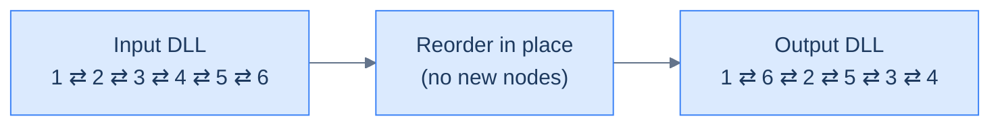
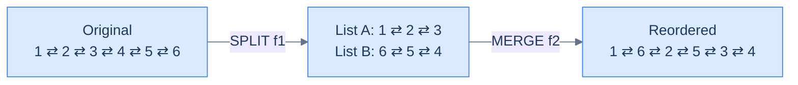
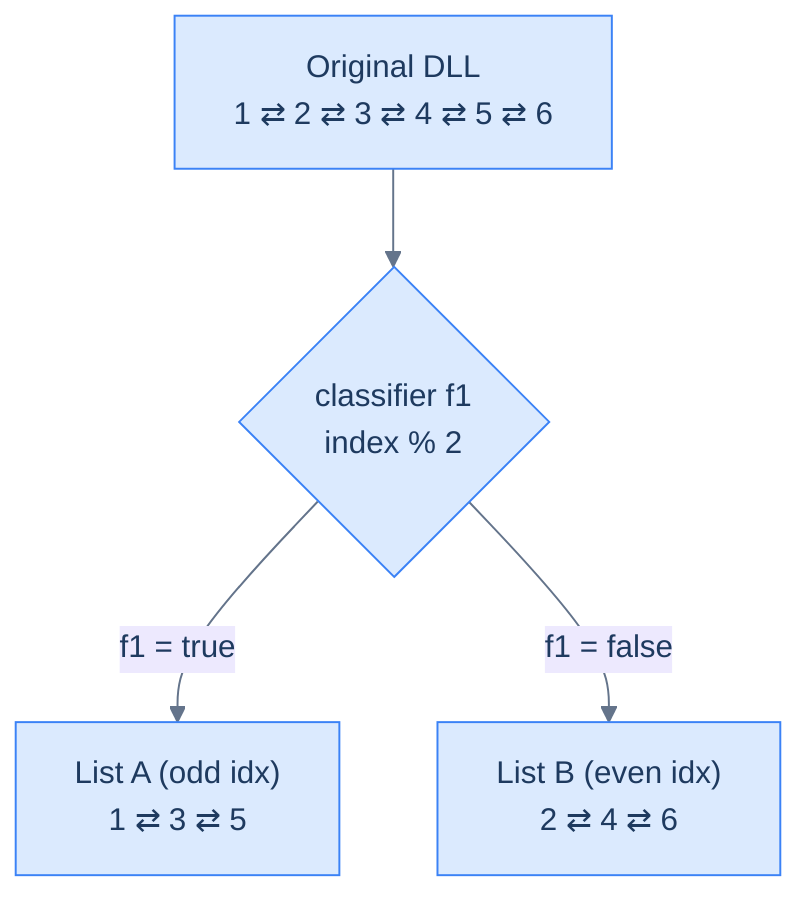
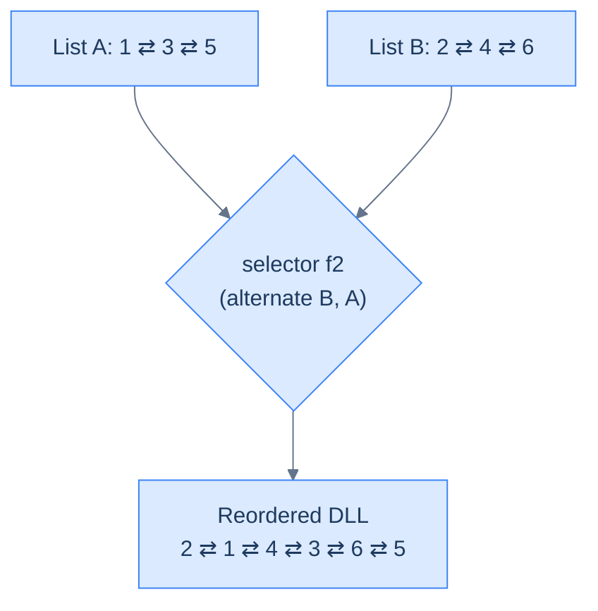
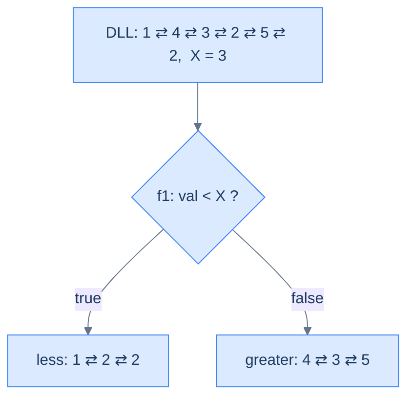
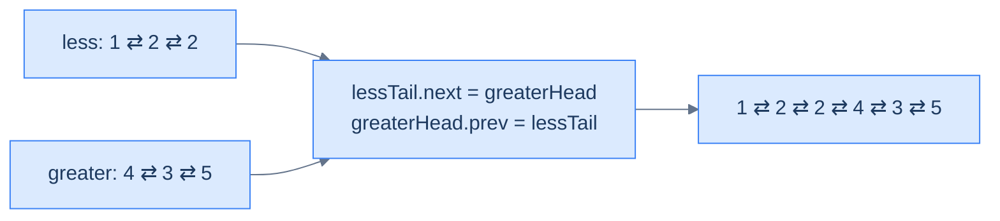
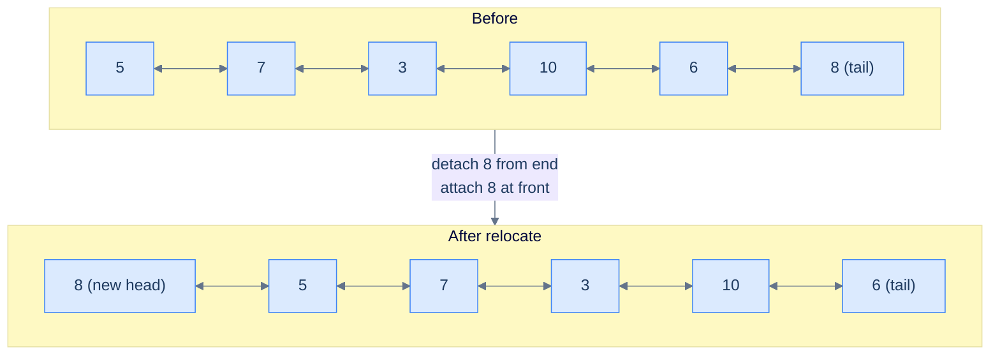
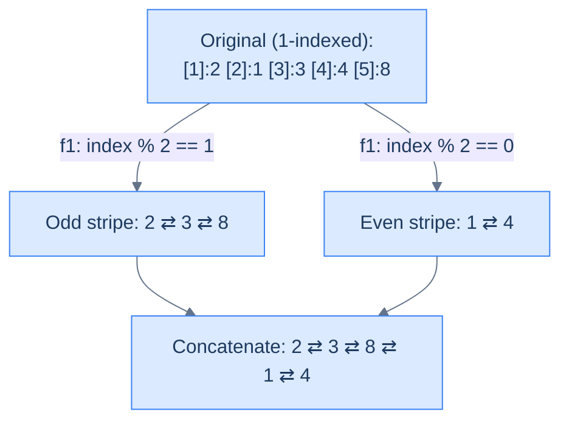
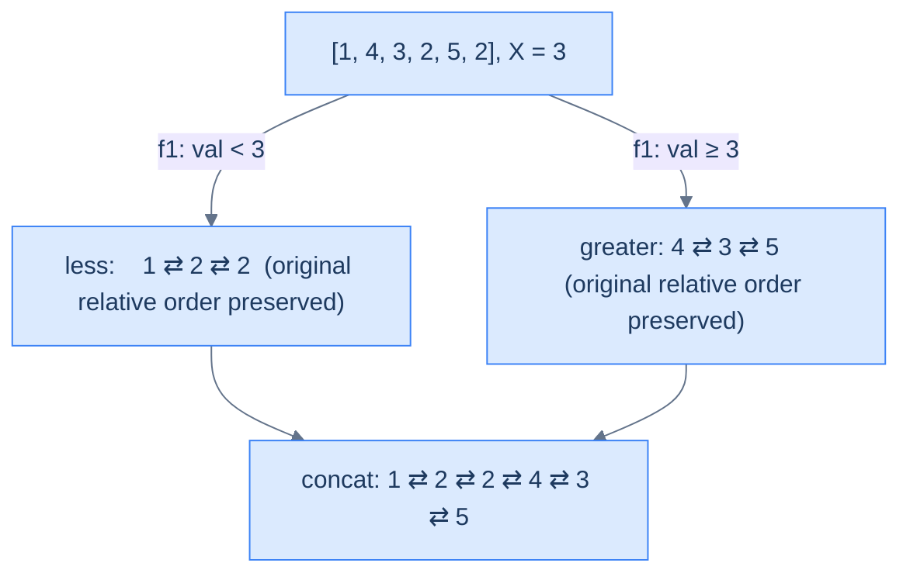
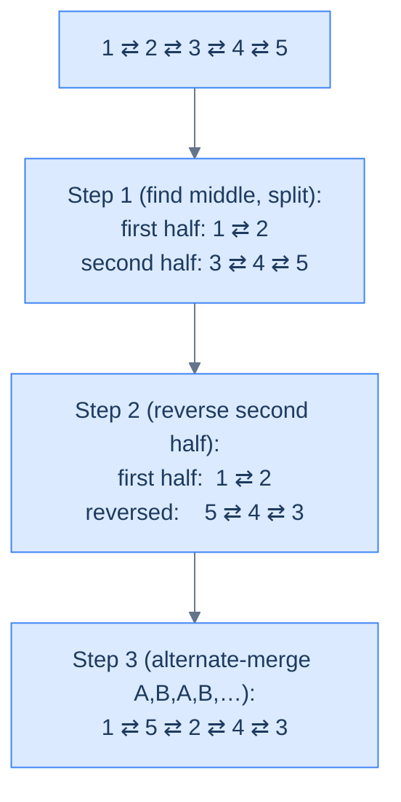

# 8. Pattern: Reorder

## The Hook

Reorder problems look like the scariest thing in the chapter — *"rewrite the entire list in this exotic shape"* — and then dissolve into something almost embarrassing once you see them right. **The choreography is the algorithm.** You're not inventing a new traversal; you're stacking three or four primitive moves you already own — split, reverse, find-the-middle, merge — in a particular order, and the new shape falls out for free.

In a doubly linked list every move costs you twice: forward link plus mirror. That sounds like extra work, but it's actually a gift — `prev` is a free `O(1)` rewind that singly lists have to walk for. Watch how a 50-line problem becomes "split + reverse + alternating-merge", three callable primitives standing on each other's shoulders. By the end of this lesson, you won't see *reorder problems* — you'll see *choreographies*.

---

## Table of contents

1. [Understanding the reorder pattern](#understanding-the-reorder-pattern)
2. [Identifying the reorder pattern](#identifying-the-reorder-pattern)
3. [Relocate node](#relocate-node)
4. [Parity order](#parity-order)
5. [Value partition](#value-partition)
6. [Shuffle list](#shuffle-list)

***

# Understanding the reorder pattern

Some linked list problems require us to reorder the nodes of a given list **in place** based on some condition. In most cases the recipe is the same: first **split** the list using a classifier function `f1` into two (or more) sub-lists, then **merge** them back — either by plain concatenation, or by a custom selector `f2` that picks one node at a time. These are usually **medium**-difficulty problems, and they often pull in helpers from earlier lessons: the **fast-and-slow pointer** trick to find the middle, and **reversal** when one of the sub-lists must be flipped.



<p align="center"><strong>Reorder problems rearrange the <em>same</em> nodes into a new sequence. No new allocations — every <code>next</code> and <code>prev</code> is rewired to produce the target order.</strong></p>



<p align="center"><strong>Every reorder decomposes into <strong>split</strong> + <strong>merge</strong>. The split routes nodes into temporary sub-lists; the merge weaves them back together. Two primitives you've already built — both upgraded to keep the <code>prev</code> pointers honest.</strong></p>

## Reordering technique

Consider a doubly linked list whose nodes must be reordered. The problem almost always has a **split function `f1`** that you use to split the list into two using the split technique. The split for a doubly list is *exactly* the same as for a singly list — with one extra line per move: every time you append a node to a sub-list, also wire its `prev` to the new tail.

Below is an example execution where `f1` routes nodes with odd indices to one list and even indices to the other.



<p align="center"><strong>Step 1 — <strong>split</strong> a DLL. The classifier <code>f1</code> routes nodes into temporary sub-lists. Every "append" updates both <code>tail.next = node</code> and <code>node.prev = tail</code> — the second line is the only difference from a singly-list split.</strong></p>

In most cases, **concatenating** the split lists is enough. Sometimes you need a real merge — a function `f2` that picks one node at a time from either sub-list. The merge for a doubly list is again the same as for a singly list with one extra line: every time you attach a node to the merged tail, also wire its `prev`.

Below is an example execution where `f2` alternates nodes from list B then list A — effectively interleaving them.



<p align="center"><strong>Step 2 — <strong>merge</strong> for a DLL. The selector <code>f2</code> weaves the sub-lists back into one. Every attachment updates <code>tail.next</code> AND <code>node.prev</code>. The combination of <code>f1</code> and <code>f2</code> IS the reorder algorithm.</strong></p>

The reorder technique is simply split + merge in tandem. Pick `f1`, pick `f2`, and the rest is mechanical.

## Algorithm

The algorithm below summarises the reorder technique for **two** lists. It generalises trivially to `k` lists by adding more buckets.

> **Algorithm**
>
> -   **Step 1:** Use the split technique to split the list in **two** using the function `f1`.
> -   **Step 2:** Use the merge technique to merge the **two** lists using the function `f2` (or simply concatenate when `f2` is trivial).
> -   **Step 3:** Return the head of the merged list.

## Implementation

Below is the generic implementation that splits a DLL into two using `f1` and merges them using `f2`. The structure is identical to the singly-list version with **one extra line per attachment** to keep `prev` correct.


```pseudocode
function reorder_nodes(head, f1, f2):
    # Phase 1 — split by classifier f1
    dummyA ← new node; tailA ← dummyA
    dummyB ← new node; tailB ← dummyB
    current ← head
    while current ≠ null:
        if f1(current):
            tailA.next ← current; current.prev ← tailA; tailA ← tailA.next
        else:
            tailB.next ← current; current.prev ← tailB; tailB ← tailB.next
        current ← current.next
    tailA.next ← null; tailB.next ← null
    currentA ← dummyA.next; currentB ← dummyB.next
    if currentA ≠ null: currentA.prev ← null
    if currentB ≠ null: currentB.prev ← null
    # Phase 2 — merge by selector f2
    dummy ← new node; tail ← dummy
    while currentA ≠ null AND currentB ≠ null:
        if f2(currentA, currentB):
            tail.next ← currentA; currentA.prev ← tail; currentA ← currentA.next
        else:
            tail.next ← currentB; currentB.prev ← tail; currentB ← currentB.next
        tail ← tail.next
    if currentA ≠ null: tail.next ← currentA; currentA.prev ← tail
    if currentB ≠ null: tail.next ← currentB; currentB.prev ← tail
    new_head ← dummy.next
    if new_head ≠ null: new_head.prev ← null
    return new_head
```

```python run
"""
Definition for doubly-linked list.
class ListNode:
    def __init__(self, val):
        self.val  = val
        self.prev = None
        self.next = None
"""
from typing import Optional, Callable

def reorder_nodes(head: Optional['ListNode'],
                  f1: Callable[['ListNode'], bool],
                  f2: Callable[['ListNode', 'ListNode'], bool]) -> Optional['ListNode']:
    # Phase 1 — SPLIT by classifier f1
    dummyA = ListNode(0); tailA = dummyA       # Bucket A: nodes where f1(node) is True
    dummyB = ListNode(0); tailB = dummyB       # Bucket B: nodes where f1(node) is False
    current = head
    while current is not None:
        if f1(current):
            tailA.next   = current             # Forward link
            current.prev = tailA               # Mirror — keeps backward chain intact
            tailA        = tailA.next
        else:
            tailB.next   = current
            current.prev = tailB
            tailB        = tailB.next
        current = current.next                 # Advance through original list
    tailA.next = None; tailB.next = None        # Terminate both sub-lists

    # Lift dummies off the heads and null out prev so each sub-list is a clean DLL
    currentA = dummyA.next
    currentB = dummyB.next
    if currentA: currentA.prev = None
    if currentB: currentB.prev = None

    # Phase 2 — MERGE by selector f2
    dummy = ListNode(0); tail = dummy
    while currentA is not None and currentB is not None:
        if f2(currentA, currentB):
            tail.next     = currentA           # Forward link
            currentA.prev = tail               # Mirror
            currentA      = currentA.next
        else:
            tail.next     = currentB
            currentB.prev = tail
            currentB      = currentB.next
        tail = tail.next
    # Drain the leftover sub-list (only one will be non-None)
    if currentA is not None:
        tail.next     = currentA
        currentA.prev = tail
    if currentB is not None:
        tail.next     = currentB
        currentB.prev = tail

    new_head = dummy.next
    if new_head: new_head.prev = None          # Detach the throwaway dummy
    return new_head
```

```java run
import java.util.function.Predicate;
import java.util.function.BiPredicate;

class Solution {
    public ListNode reorderNodes(ListNode head,
                                 Predicate<ListNode> f1,
                                 BiPredicate<ListNode, ListNode> f2) {
        // Phase 1 — split by classifier f1
        ListNode dummyA = new ListNode(0), tailA = dummyA;
        ListNode dummyB = new ListNode(0), tailB = dummyB;
        ListNode current = head;
        while (current != null) {
            if (f1.test(current)) {
                tailA.next   = current;          // forward link
                current.prev = tailA;            // mirror
                tailA        = tailA.next;
            } else {
                tailB.next   = current;
                current.prev = tailB;
                tailB        = tailB.next;
            }
            current = current.next;
        }
        tailA.next = null; tailB.next = null;

        ListNode ca = dummyA.next, cb = dummyB.next;
        if (ca != null) ca.prev = null;
        if (cb != null) cb.prev = null;

        // Phase 2 — merge by selector f2
        ListNode dummy = new ListNode(0), tail = dummy;
        while (ca != null && cb != null) {
            if (f2.test(ca, cb)) {
                tail.next = ca; ca.prev = tail; ca = ca.next;
            } else {
                tail.next = cb; cb.prev = tail; cb = cb.next;
            }
            tail = tail.next;
        }
        if (ca != null) { tail.next = ca; ca.prev = tail; }
        if (cb != null) { tail.next = cb; cb.prev = tail; }

        ListNode newHead = dummy.next;
        if (newHead != null) newHead.prev = null;
        return newHead;
    }
}
```

```c run
/* Doubly-linked: ListNode { int val; struct ListNode *prev, *next; } */
typedef int (*F1)(ListNode*);
typedef int (*F2)(ListNode*, ListNode*);

ListNode* reorderNodes(ListNode *head, F1 f1, F2 f2) {
    ListNode dummyA = {0,NULL,NULL}, dummyB = {0,NULL,NULL};
    ListNode *tailA = &dummyA, *tailB = &dummyB;
    for (ListNode *c = head; c != NULL; ) {
        ListNode *next = c->next;
        if (f1(c)) { tailA->next = c; c->prev = tailA; tailA = c; }
        else        { tailB->next = c; c->prev = tailB; tailB = c; }
        c = next;
    }
    tailA->next = NULL; tailB->next = NULL;

    ListNode *ca = dummyA.next, *cb = dummyB.next;
    if (ca) ca->prev = NULL;
    if (cb) cb->prev = NULL;

    ListNode dummy = {0,NULL,NULL};
    ListNode *tail = &dummy;
    while (ca && cb) {
        if (f2(ca, cb)) { tail->next = ca; ca->prev = tail; ca = ca->next; }
        else             { tail->next = cb; cb->prev = tail; cb = cb->next; }
        tail = tail->next;
    }
    if (ca) { tail->next = ca; ca->prev = tail; }
    if (cb) { tail->next = cb; cb->prev = tail; }

    ListNode *newHead = dummy.next;
    if (newHead) newHead->prev = NULL;
    return newHead;
}
```

```scala run
object Solution {
  def reorderNodes(head: ListNode,
                   f1: ListNode => Boolean,
                   f2: (ListNode, ListNode) => Boolean): ListNode = {
    val dummyA = new ListNode(0); var tailA: ListNode = dummyA
    val dummyB = new ListNode(0); var tailB: ListNode = dummyB
    var c = head
    while (c != null) {
      val nxt = c.next
      if (f1(c)) { tailA.next = c; c.prev = tailA; tailA = c }
      else        { tailB.next = c; c.prev = tailB; tailB = c }
      c = nxt
    }
    tailA.next = null; tailB.next = null

    var ca = dummyA.next; var cb = dummyB.next
    if (ca != null) ca.prev = null
    if (cb != null) cb.prev = null

    val dummy = new ListNode(0); var tail: ListNode = dummy
    while (ca != null && cb != null) {
      if (f2(ca, cb)) { tail.next = ca; ca.prev = tail; ca = ca.next }
      else             { tail.next = cb; cb.prev = tail; cb = cb.next }
      tail = tail.next
    }
    if (ca != null) { tail.next = ca; ca.prev = tail }
    if (cb != null) { tail.next = cb; cb.prev = tail }
    val newHead = dummy.next
    if (newHead != null) newHead.prev = null
    newHead
  }
}
```


## Complexity Analysis

The runtime and space complexity for the reorder technique that splits the list into **two** lists is straightforward. We traverse the entire list once to split — that's a linear **O(N)** pass. If we only need to concatenate, the merge is **O(1)**; otherwise we may traverse both sub-lists in the worst case, which is again **O(N)** total. We always traverse the full list during the split, so the runtime is **O(N)** in every case.

When we reorder a list by splitting into two, we only allocate a constant number of dummy nodes and update references — so the space complexity is **O(1)** in every case.

> **Best Case:**
>
> -   Space Complexity — **O(1)**
> -   Time Complexity — **O(N)**
>
> **Worst Case:**
>
> -   Space Complexity — **O(1)**
> -   Time Complexity — **O(N)**

> *Friction prompt — before reading on: try to predict the bug that bites you the first time you write this on a doubly-linked list. The forward pointers will look fine. What breaks?*

(Answer: the `prev` pointers. If you forget the mirror update on either the split or the merge, every backward traversal silently snaps somewhere — and the test harness that prints forward will tell you nothing is wrong.)

***

# Identifying the reorder pattern

The linked list problems that require reordering nodes **in place** are the ones the reorder technique was built for. They're usually **medium**: split using some classifier, merge using some selector. Smaller subproblems often use **reversal** or the **fast-and-slow pointer** trick to find the middle. If a problem statement (or its solution) follows the template below, you can solve it with reorder.

**Template:**

> Given a linked list, reorder its nodes.

## Example

Let's use this concrete problem to nail the pattern down.

> **Problem statement:** Given a doubly linked list and a value `x`, reorder its nodes so all nodes with values less than `x` come before the nodes with values greater than or equal to `x`, keeping the relative order between nodes in both parts the same.

### Reorder technique solution

We need to reorder nodes in place — that fits the generic template exactly.

**Template:**

> Given a linked list, reorder its nodes.

To reorder, we use the split technique to split the given list into two: the first list collects all nodes with values `< x`; the second collects all nodes with values `>= x`. We create two dummy nodes `dummyA`, `dummyB` and tail references `tailA` and `tailB` initialised with the dummies. We initialise `current` with the head and iterate from start to end.

In each iteration we compare `current.val` to `x` and append the node to the correct sub-list (with the mirror update on `current.prev`). Then we move on.



<p align="center"><strong>Split the list into two using <code>f1(node) = node.val &lt; X</code>. Each append wires both <code>tail.next</code> and <code>node.prev</code>.</strong></p>

We don't need a custom merge — concatenating the two lists is enough. We use the tail and dummy references from the split to wire `lessTail.next = greaterHead` and `greaterHead.prev = lessTail`.



<p align="center"><strong>Concatenate the two split lists by linking the less-tail to the greater-head — and (DLL-only) wiring the mirror back-edge so backward traversal still works end-to-end.</strong></p>

The implementation of the solution using the reorder technique is given below. Notice that this is the *same* code we'll re-use as the standalone "Value partition" problem later in the lesson.


```pseudocode
function split_list_by_value(head, X):
    lessDummy ← new node; lessTail ← lessDummy
    greaterDummy ← new node; greaterTail ← greaterDummy
    current ← head
    while current ≠ null:
        nxt ← current.next
        if current.val < X:
            lessTail.next ← current; current.prev ← lessTail; lessTail ← lessTail.next
        else:
            greaterTail.next ← current; current.prev ← greaterTail; greaterTail ← greaterTail.next
        current ← nxt
    if lessDummy.next ≠ null: lessDummy.next.prev ← null
    lessTail.next ← null
    if greaterDummy.next ≠ null: greaterDummy.next.prev ← null
    greaterTail.next ← null
    return [lessDummy.next, greaterDummy.next]

function merge_less_and_greater_lists(less_head, greater_head):
    if less_head = null: return greater_head
    if greater_head = null: return less_head
    current ← less_head
    while current.next ≠ null: current ← current.next
    current.next ← greater_head; greater_head.prev ← current
    return less_head

function value_partition(head, X):
    if head = null OR head.next = null: return head
    less_head, greater_head ← split_list_by_value(head, X)
    return merge_less_and_greater_lists(less_head, greater_head)
```

```python run
"""
Definition for doubly-linked list.
class ListNode:
    def __init__(self, val):
        self.val  = val
        self.prev = None
        self.next = None
"""
from typing import Optional, List

class Solution:
    def split_list_by_value(self, head: Optional['ListNode'], X: int) -> List[Optional['ListNode']]:
        # Two buckets: less-than-X, and greater-than-or-equal-to-X
        less_dummy   = ListNode(0); less_tail    = less_dummy
        greater_dummy = ListNode(0); greater_tail = greater_dummy
        current = head
        while current is not None:
            nxt = current.next                   # Save next before we overwrite current.next via tail
            if current.val < X:
                less_tail.next   = current
                current.prev     = less_tail     # Mirror — keeps backward chain intact
                less_tail        = less_tail.next
            else:
                greater_tail.next = current
                current.prev      = greater_tail
                greater_tail      = greater_tail.next
            current = nxt
        # Terminate both sub-lists; null prev on the heads to detach the dummies cleanly
        if less_dummy.next    is not None: less_dummy.next.prev    = None
        less_tail.next    = None
        if greater_dummy.next is not None: greater_dummy.next.prev = None
        greater_tail.next = None
        return [less_dummy.next, greater_dummy.next]

    def merge_less_and_greater_lists(self, less_head, greater_head):
        if less_head    is None: return greater_head        # one side empty → return the other
        if greater_head is None: return less_head
        # Walk to the end of less_head so we can append greater_head behind it
        current = less_head
        while current.next is not None:
            current = current.next
        current.next      = greater_head                    # forward link
        greater_head.prev = current                         # mirror
        return less_head

    def value_partition(self, head: Optional['ListNode'], X: int) -> Optional['ListNode']:
        if head is None or head.next is None:               # 0 or 1 node — nothing to do
            return head
        less_head, greater_head = self.split_list_by_value(head, X)
        return self.merge_less_and_greater_lists(less_head, greater_head)
```

```java run
import java.util.*;

class Solution {
    public List<ListNode> splitListByValue(ListNode head, int X) {
        ListNode lessDummy    = new ListNode(0), lessTail    = lessDummy;
        ListNode greaterDummy = new ListNode(0), greaterTail = greaterDummy;
        ListNode current = head;
        while (current != null) {
            ListNode nxt = current.next;
            if (current.val < X) {
                lessTail.next = current;
                current.prev  = lessTail;       // mirror
                lessTail      = lessTail.next;
            } else {
                greaterTail.next = current;
                current.prev     = greaterTail; // mirror
                greaterTail      = greaterTail.next;
            }
            current = nxt;
        }
        if (lessDummy.next    != null) lessDummy.next.prev    = null;
        lessTail.next    = null;
        if (greaterDummy.next != null) greaterDummy.next.prev = null;
        greaterTail.next = null;
        return Arrays.asList(lessDummy.next, greaterDummy.next);
    }

    public ListNode mergeLessAndGreaterLists(ListNode lessHead, ListNode greaterHead) {
        if (lessHead    == null) return greaterHead;
        if (greaterHead == null) return lessHead;
        ListNode current = lessHead;
        while (current.next != null) current = current.next;
        current.next      = greaterHead;
        greaterHead.prev  = current;
        return lessHead;
    }

    public ListNode valuePartition(ListNode head, int X) {
        if (head == null || head.next == null) return head;
        List<ListNode> heads = splitListByValue(head, X);
        return mergeLessAndGreaterLists(heads.get(0), heads.get(1));
    }
}
```

```c run
typedef struct ListNode { int val; struct ListNode *prev, *next; } ListNode;

static void splitListByValue(ListNode *head, int X, ListNode **lessHead, ListNode **greaterHead) {
    ListNode lessDummy = {0,NULL,NULL}, greaterDummy = {0,NULL,NULL};
    ListNode *lessTail = &lessDummy, *greaterTail = &greaterDummy;
    for (ListNode *c = head; c != NULL; ) {
        ListNode *nxt = c->next;
        if (c->val < X) { lessTail->next = c;    c->prev = lessTail;    lessTail    = c; }
        else             { greaterTail->next = c; c->prev = greaterTail; greaterTail = c; }
        c = nxt;
    }
    if (lessDummy.next)    lessDummy.next->prev    = NULL; lessTail->next    = NULL;
    if (greaterDummy.next) greaterDummy.next->prev = NULL; greaterTail->next = NULL;
    *lessHead    = lessDummy.next;
    *greaterHead = greaterDummy.next;
}

static ListNode* mergeLessAndGreaterLists(ListNode *lessHead, ListNode *greaterHead) {
    if (!lessHead)    return greaterHead;
    if (!greaterHead) return lessHead;
    ListNode *current = lessHead;
    while (current->next) current = current->next;
    current->next     = greaterHead;
    greaterHead->prev = current;
    return lessHead;
}

ListNode* valuePartition(ListNode *head, int X) {
    if (!head || !head->next) return head;
    ListNode *lh, *gh;
    splitListByValue(head, X, &lh, &gh);
    return mergeLessAndGreaterLists(lh, gh);
}
```

```scala run
class Solution {
  def splitListByValue(head: ListNode, X: Int): (ListNode, ListNode) = {
    val lessDummy    = new ListNode(0); var lessTail: ListNode    = lessDummy
    val greaterDummy = new ListNode(0); var greaterTail: ListNode = greaterDummy
    var c = head
    while (c != null) {
      val nxt = c.next
      if (c.value < X) { lessTail.next = c; c.prev = lessTail; lessTail = c }
      else              { greaterTail.next = c; c.prev = greaterTail; greaterTail = c }
      c = nxt
    }
    if (lessDummy.next    != null) lessDummy.next.prev    = null; lessTail.next    = null
    if (greaterDummy.next != null) greaterDummy.next.prev = null; greaterTail.next = null
    (lessDummy.next, greaterDummy.next)
  }

  def mergeLessAndGreaterLists(lessHead: ListNode, greaterHead: ListNode): ListNode = {
    if (lessHead    == null) return greaterHead
    if (greaterHead == null) return lessHead
    var current = lessHead
    while (current.next != null) current = current.next
    current.next     = greaterHead
    greaterHead.prev = current
    lessHead
  }

  def valuePartition(head: ListNode, X: Int): ListNode = {
    if (head == null || head.next == null) return head
    val (lh, gh) = splitListByValue(head, X)
    mergeLessAndGreaterLists(lh, gh)
  }
}
```


The implementation above uses the split list technique to split into two and then merges them by concatenation.

## Example problems

Most problems in this category are **medium**, and most are solved by splitting and concatenating. Sometimes you do need a real merge with a custom selector; sometimes you also need reversal or fast/slow pointers as a sub-routine. Here's the lineup:

> -   **[Relocate node](https://www.codeintuition.io/courses/doubly-linked-list/Iyg36jeWViatZO_Q2w3ge)**
> -   **[Parity order](https://www.codeintuition.io/courses/doubly-linked-list/jlvpNSWUKRJThq6HKI1_H)**
> -   **[Value partition](https://www.codeintuition.io/courses/doubly-linked-list/sKHcaBMvtdwBr48bD_7Ck)**
> -   **[Shuffle list](https://www.codeintuition.io/courses/doubly-linked-list/YNry5kVCX7k0WahSEcDUy)**

We'll now solve these to drill the technique. Watch how each one is just a different `(f1, f2)` plug-in to the same skeleton — until the last one, where reversal joins the dance.

***

# Relocate node

## The Problem

> Given the **head** of a doubly linked list, write a function to move the last node of the list to the start and return the head of the reordered list.

```
Example 1
  Input:  head = [5, 7, 3, 10, 6, 8]
  Output: [8, 5, 7, 3, 10, 6]
  Reason: The last node (8) is moved to the start.

Example 2
  Input:  head = [5, 7]
  Output: [7, 5]
  Reason: The last node (7) is moved to the start.

Example 3
  Input:  head = [5]
  Output: [5]
  Reason: A single node is both head and tail — nothing to move.
```

## What Does "Relocate" Mean Here?

Picture the list as a chain of train cars. Relocate means: detach the last car, walk it to the front, and re-attach it as the new locomotive. Two splices: one at the back (uncouple the last car) and one at the front (couple it on). In a DLL, each "splice" is a forward link plus a mirror.



<p align="center"><strong>Relocate the last node — split = (head … penultimate, last); merge = concatenate(last, head). Two pointer splices, both with mirror updates.</strong></p>

## Strategy

Reorder skeleton: `f1` selects the last node into bucket B and everything else into bucket A. `f2` is "B then A" (concatenate, with B on the left). For DLLs the only twist is the mirror: when we make the last node the new head, its `prev` must become `null`, and the old head's `prev` must point at it.

> **Algorithm**
>
> -   **Step 1:** Walk to the end keeping a `previous` reference. After the loop, `current` is the last node and `previous` is the second-to-last.
> -   **Step 2:** Detach the last node: `previous.next = null`, `current.prev = null`.
> -   **Step 3:** Splice it at the front: `current.next = head`, `head.prev = current`.
> -   **Step 4:** Return `current` as the new head.
> -   **Edge cases:** empty list and single node — return as-is.

## The Solution


```pseudocode
function split_last_node(head):
    current ← head; previous ← null
    while current.next ≠ null:
        previous ← current; current ← current.next
    if previous ≠ null: previous.next ← null
    current.prev ← null
    return [head, current]

function merge_last_node(last_node, first_node):
    if last_node = null: return first_node
    last_node.next ← first_node
    if first_node ≠ null: first_node.prev ← last_node
    return last_node

function relocate_node(head):
    if head = null OR head.next = null: return head
    first_node, last_node ← split_last_node(head)
    return merge_last_node(last_node, first_node)
```

```python run
"""
Definition for doubly-linked list.
class ListNode:
    def __init__(self, val):
        self.val  = val
        self.prev = None
        self.next = None
"""
from typing import Optional, List

class Solution:
    def split_last_node(self, head: 'ListNode') -> List[Optional['ListNode']]:
        # Walk to the last node, remembering the predecessor
        current  = head
        previous = None
        while current.next is not None:
            previous = current
            current  = current.next
        # Detach the last node from its predecessor (forward and mirror)
        if previous is not None:
            previous.next = None
        if current is not None:
            current.prev = None
        # Return [head of the remaining list, the detached last node]
        return [head, current]

    def merge_last_node(self, last_node, first_node):
        # No last node → first list is the answer (1-element original)
        if last_node is None:
            return first_node
        last_node.next = first_node            # Forward link from new head into old list
        if first_node is not None:
            first_node.prev = last_node        # Mirror — old head now points back to new head
        return last_node                       # New head of the relocated list

    def relocate_node(self, head: Optional['ListNode']) -> Optional['ListNode']:
        # 0 or 1 nodes — nothing to relocate
        if head is None or head.next is None:
            return head
        first_node, last_node = self.split_last_node(head)
        return self.merge_last_node(last_node, first_node)
```

```java run
class Solution {
    public ListNode[] splitLastNode(ListNode head) {
        ListNode current = head, previous = null;
        while (current.next != null) {
            previous = current;
            current  = current.next;
        }
        if (previous != null) previous.next = null;
        if (current  != null) current.prev  = null;
        return new ListNode[]{head, current};
    }

    public ListNode mergeLastNode(ListNode lastNode, ListNode firstNode) {
        if (lastNode == null) return firstNode;
        lastNode.next = firstNode;
        if (firstNode != null) firstNode.prev = lastNode;
        return lastNode;
    }

    public ListNode relocateNode(ListNode head) {
        if (head == null || head.next == null) return head;
        ListNode[] heads = splitLastNode(head);
        return mergeLastNode(heads[1], heads[0]);
    }
}
```

```c run
ListNode* relocateNode(ListNode *head) {
    if (!head || !head->next) return head;
    ListNode *current = head, *previous = NULL;
    while (current->next) { previous = current; current = current->next; }
    if (previous) previous->next = NULL;       /* detach forward */
    if (current)  current->prev  = NULL;       /* detach mirror   */
    current->next = head;                       /* splice at front */
    if (head)     head->prev = current;
    return current;
}
```

```scala run
class Solution {
  def relocateNode(head: ListNode): ListNode = {
    if (head == null || head.next == null) return head
    var current  = head
    var previous: ListNode = null
    while (current.next != null) { previous = current; current = current.next }
    if (previous != null) previous.next = null
    current.prev = null
    current.next = head
    head.prev    = current
    current
  }
}
```


<details>
<summary><strong>Trace — head = [5, 7, 3, 10, 6, 8]</strong></summary>

```
Walk to last:
  Step 1 │ current=5, previous=null  → advance
  Step 2 │ current=7, previous=5     → advance
  Step 3 │ current=3, previous=7     → advance
  Step 4 │ current=10, previous=3    → advance
  Step 5 │ current=6, previous=10    → advance
  Step 6 │ current=8 (next is null)  → STOP. previous=6.

Detach last:
  previous(6).next = null     →  …5⇄7⇄3⇄10⇄6 ⊥     8 (loose)
  current(8).prev  = null     →                     8 (fully loose)

Splice at front:
  current(8).next = head(5)   →  8 → 5⇄7⇄3⇄10⇄6
  head(5).prev    = current   →  8 ⇄ 5⇄7⇄3⇄10⇄6
Result: [8, 5, 7, 3, 10, 6] ✓
```

</details>

## Complexity Analysis

| Metric | Cost | Why |
|---|---|---|
| Time  | **O(N)** | One pass to find the last node. |
| Space | **O(1)** | Two pointer variables; no allocation. |

## Edge Cases

| Case | Example | Expected | Reasoning |
|---|---|---|---|
| Empty list | `[]` | `[]` | `head == null` → return immediately. |
| Single node | `[5]` | `[5]` | `head.next == null` → already at front. |
| Two nodes | `[5, 7]` | `[7, 5]` | Just swap; `previous` stops at the first node. |

***

# Parity order

## The Problem

> Given the **head** of a doubly linked list, write a function to group all the nodes that appear at odd indices together, followed by the nodes that appear at even indices, and return the head of the reordered list. **The indices start with `1`.**

```
Example 1
  Input:  head = [2, 1, 3, 4, 8]      // indices: 1 2 3 4 5
  Output: [2, 3, 8, 1, 4]
  Reason: Odd indices (1,3,5) → 2, 3, 8. Even indices (2,4) → 1, 4.

Example 2
  Input:  head = []
  Output: []
  Reason: Empty in, empty out.
```

## What Does "Parity Order" Mean?

Imagine numbering the nodes from 1 at the head. The **odd-indexed** nodes (positions 1, 3, 5, …) form one stripe; the **even-indexed** nodes (2, 4, 6, …) form the other. Parity order means: stripe-1 first, then stripe-2, in their original relative order.



<p align="center"><strong>Parity order — split by index parity, concatenate odd stripe before even stripe. The reorder skeleton with <code>f1 = counter is odd</code> and <code>f2 = simple concat</code>.</strong></p>

## Strategy

This is the canonical reorder skeleton. `f1(node) = (counter % 2 == 1)`. `f2` is just concatenation. The only DLL-specific touch is wiring `prev` on every append and on the final concat join.

> **Algorithm**
>
> -   **Step 1:** Split — walk the list with a 1-based counter. Append each node to `oddDummy`'s tail or `evenDummy`'s tail based on `counter % 2`. Mirror `prev` on every append.
> -   **Step 2:** Terminate both sub-lists; null out the `prev` of each head.
> -   **Step 3:** Concatenate — `oddTail.next = evenHead; evenHead.prev = oddTail`.
> -   **Step 4:** Return `oddHead`.

## The Solution


```pseudocode
function split_by_parity(head):
    oddDummy ← new node; oddTail ← oddDummy
    evenDummy ← new node; evenTail ← evenDummy
    current ← head; counter ← 1
    while current ≠ null:
        nxt ← current.next
        if counter mod 2 = 1:
            oddTail.next ← current; current.prev ← oddTail; oddTail ← oddTail.next
        else:
            evenTail.next ← current; current.prev ← evenTail; evenTail ← evenTail.next
        current ← nxt; counter ← counter + 1
    if oddDummy.next ≠ null: oddDummy.next.prev ← null
    oddTail.next ← null
    if evenDummy.next ≠ null: evenDummy.next.prev ← null
    evenTail.next ← null
    return [oddDummy.next, evenDummy.next]

function merge_odd_and_even_lists(odd_head, even_head):
    if odd_head = null: return even_head
    if even_head = null: return odd_head
    current ← odd_head
    while current.next ≠ null: current ← current.next
    current.next ← even_head; even_head.prev ← current
    return odd_head

function parity_order(head):
    if head = null OR head.next = null: return head
    odd_head, even_head ← split_by_parity(head)
    return merge_odd_and_even_lists(odd_head, even_head)
```

```python run
"""
Definition for doubly-linked list.
class ListNode:
    def __init__(self, val):
        self.val  = val
        self.prev = None
        self.next = None
"""
from typing import Optional, List

class Solution:
    def split_by_parity(self, head: Optional['ListNode']) -> List[Optional['ListNode']]:
        odd_dummy  = ListNode(0); odd_tail  = odd_dummy
        even_dummy = ListNode(0); even_tail = even_dummy
        current = head
        counter = 1                                        # 1-indexed positions
        while current is not None:
            nxt = current.next
            if counter % 2 == 1:                           # odd index → odd stripe
                odd_tail.next  = current
                current.prev   = odd_tail                  # mirror
                odd_tail       = odd_tail.next
            else:                                          # even index → even stripe
                even_tail.next = current
                current.prev   = even_tail                 # mirror
                even_tail      = even_tail.next
            current  = nxt
            counter += 1
        # Detach dummies cleanly: terminate tails and null the heads' prev
        if odd_dummy.next  is not None: odd_dummy.next.prev  = None
        odd_tail.next  = None
        if even_dummy.next is not None: even_dummy.next.prev = None
        even_tail.next = None
        return [odd_dummy.next, even_dummy.next]

    def merge_odd_and_even_lists(self, odd_head, even_head):
        if odd_head  is None: return even_head
        if even_head is None: return odd_head
        # Walk to the end of the odd stripe, then concat the even stripe
        current = odd_head
        while current.next is not None:
            current = current.next
        current.next   = even_head
        even_head.prev = current                          # mirror on the join
        return odd_head

    def parity_order(self, head: Optional['ListNode']) -> Optional['ListNode']:
        if head is None or head.next is None:
            return head
        odd_head, even_head = self.split_by_parity(head)
        return self.merge_odd_and_even_lists(odd_head, even_head)
```

```java run
import java.util.*;

class Solution {
    public List<ListNode> splitByParity(ListNode head) {
        ListNode oddDummy  = new ListNode(0), oddTail  = oddDummy;
        ListNode evenDummy = new ListNode(0), evenTail = evenDummy;
        ListNode current = head;
        int counter = 1;
        while (current != null) {
            ListNode nxt = current.next;
            if (counter % 2 == 1) {
                oddTail.next = current; current.prev = oddTail;  oddTail  = oddTail.next;
            } else {
                evenTail.next = current; current.prev = evenTail; evenTail = evenTail.next;
            }
            current = nxt; counter++;
        }
        if (oddDummy.next  != null) oddDummy.next.prev  = null; oddTail.next  = null;
        if (evenDummy.next != null) evenDummy.next.prev = null; evenTail.next = null;
        return Arrays.asList(oddDummy.next, evenDummy.next);
    }

    public ListNode mergeOddAndEvenLists(ListNode oddHead, ListNode evenHead) {
        if (oddHead  == null) return evenHead;
        if (evenHead == null) return oddHead;
        ListNode current = oddHead;
        while (current.next != null) current = current.next;
        current.next   = evenHead;
        evenHead.prev  = current;
        return oddHead;
    }

    public ListNode parityOrder(ListNode head) {
        if (head == null || head.next == null) return head;
        List<ListNode> heads = splitByParity(head);
        return mergeOddAndEvenLists(heads.get(0), heads.get(1));
    }
}
```

```c run
ListNode* parityOrder(ListNode *head) {
    if (!head || !head->next) return head;
    ListNode oddDummy = {0,NULL,NULL}, evenDummy = {0,NULL,NULL};
    ListNode *oddTail = &oddDummy, *evenTail = &evenDummy;
    ListNode *current = head;
    int counter = 1;
    while (current) {
        ListNode *nxt = current->next;
        if (counter & 1) { oddTail->next  = current; current->prev = oddTail;  oddTail  = current; }
        else              { evenTail->next = current; current->prev = evenTail; evenTail = current; }
        current = nxt; counter++;
    }
    if (oddDummy.next)  oddDummy.next->prev  = NULL; oddTail->next  = NULL;
    if (evenDummy.next) evenDummy.next->prev = NULL; evenTail->next = NULL;

    ListNode *oddHead = oddDummy.next, *evenHead = evenDummy.next;
    if (!oddHead)  return evenHead;
    if (!evenHead) return oddHead;
    ListNode *c = oddHead;
    while (c->next) c = c->next;
    c->next         = evenHead;
    evenHead->prev  = c;
    return oddHead;
}
```

```scala run
class Solution {
  def parityOrder(head: ListNode): ListNode = {
    if (head == null || head.next == null) return head
    val oddDummy  = new ListNode(0); var oddTail: ListNode  = oddDummy
    val evenDummy = new ListNode(0); var evenTail: ListNode = evenDummy
    var current = head
    var counter = 1
    while (current != null) {
      val nxt = current.next
      if (counter % 2 == 1) { oddTail.next  = current; current.prev = oddTail;  oddTail  = current }
      else                   { evenTail.next = current; current.prev = evenTail; evenTail = current }
      current = nxt; counter += 1
    }
    if (oddDummy.next  != null) oddDummy.next.prev  = null; oddTail.next  = null
    if (evenDummy.next != null) evenDummy.next.prev = null; evenTail.next = null

    val oddHead  = oddDummy.next
    val evenHead = evenDummy.next
    if (oddHead  == null) return evenHead
    if (evenHead == null) return oddHead
    var c = oddHead
    while (c.next != null) c = c.next
    c.next        = evenHead
    evenHead.prev = c
    oddHead
  }
}
```


<details>
<summary><strong>Trace — head = [2, 1, 3, 4, 8]</strong></summary>

```
Split (counter starts at 1):
  Step 1 │ counter=1, val=2 │ odd_tail.next=2,  2.prev=odd_dummy   │ odd:  2
  Step 2 │ counter=2, val=1 │ even_tail.next=1, 1.prev=even_dummy  │ even: 1
  Step 3 │ counter=3, val=3 │ odd_tail.next=3,  3.prev=2           │ odd:  2 ⇄ 3
  Step 4 │ counter=4, val=4 │ even_tail.next=4, 4.prev=1           │ even: 1 ⇄ 4
  Step 5 │ counter=5, val=8 │ odd_tail.next=8,  8.prev=3           │ odd:  2 ⇄ 3 ⇄ 8

Terminate + detach dummies:
  odd:  2 ⇄ 3 ⇄ 8   (heads have prev=null)
  even: 1 ⇄ 4

Concat:
  walk odd to 8.   8.next = 1.   1.prev = 8.
Result: [2, 3, 8, 1, 4] ✓ (forward AND backward chains both honest)
```

</details>

> *Friction prompt — predict before reading on: in the `merge_odd_and_even_lists` helper, what bug exists in the original singly-style code if `evenHead` is null but `oddHead` is not? Trace what `current.next = evenHead` does in that case.*

(Answer: nothing wrong — the early returns at the top guard against both being null. But notice we DON'T need to traverse to find `oddTail` here either; in real production code we'd just keep the `oddTail` reference from the split phase and skip the walk. The walk here is for clarity, not necessity.)

## Complexity Analysis

| Metric | Cost | Why |
|---|---|---|
| Time  | **O(N)** | One split pass + one walk to concat. |
| Space | **O(1)** | Two dummies and a fixed number of pointers. |

## Edge Cases

| Case | Example | Expected | Reasoning |
|---|---|---|---|
| Empty | `[]` | `[]` | Guard at top returns immediately. |
| Single node | `[5]` | `[5]` | One node is at index 1 — already in odd stripe alone. |
| Two nodes | `[5, 7]` | `[5, 7]` | Already partitioned: 5 odd, 7 even. |
| All odd-length | `[1,2,3]` | `[1, 3, 2]` | Odd stripe gets 2 nodes, even gets 1. |

***

# Value partition

## The Problem

> Given the **head** of a doubly linked list and a value **X**, write a function to partition the list such that all nodes less than X come before nodes greater than or equal to X, and return the head of the reordered list. The original relative order of the nodes in each of the two partitions should be preserved.

```
Example 1
  Input:  head = [1, 4, 3, 2, 5, 2], X = 3
  Output: [1, 2, 2, 4, 3, 5]
  Reason: <3 → 1,2,2  ;  ≥3 → 4,3,5

Example 2
  Input:  head = [2, 1], X = 2
  Output: [1, 2]
  Reason: <2 → 1  ;  ≥2 → 2
```

## What Does "Stable Partition" Mean?

Stability is the catch. Sorting would also produce a valid partition, but it would scramble the relative order inside each part. Here we must preserve order: among nodes `< X`, the one that came first stays first; same for the `>= X` group. This is exactly what the split-and-concat skeleton gives us automatically — appending to a tail keeps insertion order intact.



<p align="center"><strong>Stable value partition — appending nodes in scan order to each tail preserves the original ordering inside each bucket. Concat with mirror gives the final DLL.</strong></p>

## Strategy

This is the same template you saw at the top of the lesson. `f1(node) = (node.val < X)`. `f2` is plain concatenation. The DLL bookkeeping is what matters: every append wires `prev`, and the join between the two stripes wires both directions.

> **Algorithm**
>
> -   **Step 1:** Split — walk the list, route each node into `lessTail` if `node.val < X` else into `greaterTail`. Mirror `prev` on every append.
> -   **Step 2:** Terminate both sub-lists; null `prev` on each head.
> -   **Step 3:** Concatenate — walk to the end of less-list (or use the saved `lessTail`), then `lessTail.next = greaterHead; greaterHead.prev = lessTail`.
> -   **Step 4:** Return `lessHead` (or `greaterHead` if less-list is empty).

## The Solution

This is the same code we showed in the **Identifying the reorder pattern** section earlier — re-presented here as the dedicated problem solution.


```pseudocode
function split_list_by_value(head, X):
    lessDummy ← new node; lessTail ← lessDummy
    greaterDummy ← new node; greaterTail ← greaterDummy
    current ← head
    while current ≠ null:
        nxt ← current.next
        if current.val < X:
            lessTail.next ← current; current.prev ← lessTail; lessTail ← lessTail.next
        else:
            greaterTail.next ← current; current.prev ← greaterTail; greaterTail ← greaterTail.next
        current ← nxt
    if lessDummy.next ≠ null: lessDummy.next.prev ← null
    lessTail.next ← null
    if greaterDummy.next ≠ null: greaterDummy.next.prev ← null
    greaterTail.next ← null
    return [lessDummy.next, greaterDummy.next]

function merge_less_and_greater_lists(less_head, greater_head):
    if less_head = null: return greater_head
    if greater_head = null: return less_head
    current ← less_head
    while current.next ≠ null: current ← current.next
    current.next ← greater_head; greater_head.prev ← current
    return less_head

function value_partition(head, X):
    if head = null OR head.next = null: return head
    less_head, greater_head ← split_list_by_value(head, X)
    return merge_less_and_greater_lists(less_head, greater_head)
```

```python run
"""
Definition for doubly-linked list.
class ListNode:
    def __init__(self, val):
        self.val  = val
        self.prev = None
        self.next = None
"""
from typing import Optional, List

class Solution:
    def split_list_by_value(self, head: Optional['ListNode'], X: int) -> List[Optional['ListNode']]:
        less_dummy    = ListNode(0); less_tail    = less_dummy
        greater_dummy = ListNode(0); greater_tail = greater_dummy
        current = head
        while current is not None:
            nxt = current.next                     # save next before overwriting
            if current.val < X:
                less_tail.next = current
                current.prev   = less_tail         # mirror
                less_tail      = less_tail.next
            else:
                greater_tail.next = current
                current.prev      = greater_tail   # mirror
                greater_tail      = greater_tail.next
            current = nxt
        if less_dummy.next    is not None: less_dummy.next.prev    = None
        less_tail.next    = None
        if greater_dummy.next is not None: greater_dummy.next.prev = None
        greater_tail.next = None
        return [less_dummy.next, greater_dummy.next]

    def merge_less_and_greater_lists(self, less_head, greater_head):
        if less_head    is None: return greater_head
        if greater_head is None: return less_head
        current = less_head
        while current.next is not None:
            current = current.next
        current.next      = greater_head
        greater_head.prev = current                # mirror on the join
        return less_head

    def value_partition(self, head: Optional['ListNode'], X: int) -> Optional['ListNode']:
        if head is None or head.next is None:
            return head
        less_head, greater_head = self.split_list_by_value(head, X)
        return self.merge_less_and_greater_lists(less_head, greater_head)
```

```java run
import java.util.*;

class Solution {
    public List<ListNode> splitListByValue(ListNode head, int X) {
        ListNode lessDummy    = new ListNode(0), lessTail    = lessDummy;
        ListNode greaterDummy = new ListNode(0), greaterTail = greaterDummy;
        ListNode current = head;
        while (current != null) {
            ListNode nxt = current.next;
            if (current.val < X) {
                lessTail.next = current; current.prev = lessTail;    lessTail    = lessTail.next;
            } else {
                greaterTail.next = current; current.prev = greaterTail; greaterTail = greaterTail.next;
            }
            current = nxt;
        }
        if (lessDummy.next    != null) lessDummy.next.prev    = null; lessTail.next    = null;
        if (greaterDummy.next != null) greaterDummy.next.prev = null; greaterTail.next = null;
        return Arrays.asList(lessDummy.next, greaterDummy.next);
    }

    public ListNode mergeLessAndGreaterLists(ListNode lessHead, ListNode greaterHead) {
        if (lessHead    == null) return greaterHead;
        if (greaterHead == null) return lessHead;
        ListNode current = lessHead;
        while (current.next != null) current = current.next;
        current.next      = greaterHead;
        greaterHead.prev  = current;
        return lessHead;
    }

    public ListNode valuePartition(ListNode head, int X) {
        if (head == null || head.next == null) return head;
        List<ListNode> heads = splitListByValue(head, X);
        return mergeLessAndGreaterLists(heads.get(0), heads.get(1));
    }
}
```

```c run
ListNode* valuePartition(ListNode *head, int X) {
    if (!head || !head->next) return head;
    ListNode lessDummy = {0,NULL,NULL}, greaterDummy = {0,NULL,NULL};
    ListNode *lessTail = &lessDummy, *greaterTail = &greaterDummy;
    for (ListNode *c = head; c; ) {
        ListNode *nxt = c->next;
        if (c->val < X) { lessTail->next = c;    c->prev = lessTail;    lessTail    = c; }
        else             { greaterTail->next = c; c->prev = greaterTail; greaterTail = c; }
        c = nxt;
    }
    if (lessDummy.next)    lessDummy.next->prev    = NULL; lessTail->next    = NULL;
    if (greaterDummy.next) greaterDummy.next->prev = NULL; greaterTail->next = NULL;

    ListNode *lh = lessDummy.next, *gh = greaterDummy.next;
    if (!lh) return gh;
    if (!gh) return lh;
    ListNode *c = lh;
    while (c->next) c = c->next;
    c->next   = gh;
    gh->prev  = c;
    return lh;
}
```

```scala run
class Solution {
  def valuePartition(head: ListNode, X: Int): ListNode = {
    if (head == null || head.next == null) return head
    val lessDummy    = new ListNode(0); var lessTail: ListNode    = lessDummy
    val greaterDummy = new ListNode(0); var greaterTail: ListNode = greaterDummy
    var c = head
    while (c != null) {
      val nxt = c.next
      if (c.value < X) { lessTail.next = c; c.prev = lessTail; lessTail = c }
      else              { greaterTail.next = c; c.prev = greaterTail; greaterTail = c }
      c = nxt
    }
    if (lessDummy.next    != null) lessDummy.next.prev    = null; lessTail.next    = null
    if (greaterDummy.next != null) greaterDummy.next.prev = null; greaterTail.next = null

    val lh = lessDummy.next; val gh = greaterDummy.next
    if (lh == null) return gh
    if (gh == null) return lh
    var t = lh
    while (t.next != null) t = t.next
    t.next  = gh
    gh.prev = t
    lh
  }
}
```


<details>
<summary><strong>Trace — head = [1, 4, 3, 2, 5, 2], X = 3</strong></summary>

```
Split:
  Step 1 │ val=1, 1 < 3 │ less:    1
  Step 2 │ val=4, 4 ≥ 3 │ greater: 4
  Step 3 │ val=3, 3 ≥ 3 │ greater: 4 ⇄ 3
  Step 4 │ val=2, 2 < 3 │ less:    1 ⇄ 2
  Step 5 │ val=5, 5 ≥ 3 │ greater: 4 ⇄ 3 ⇄ 5
  Step 6 │ val=2, 2 < 3 │ less:    1 ⇄ 2 ⇄ 2

Concat:
  walk less to 2 (last). 2.next = 4. 4.prev = 2.
Result: [1, 2, 2, 4, 3, 5] ✓
```

</details>

## Complexity Analysis

| Metric | Cost | Why |
|---|---|---|
| Time  | **O(N)** | One split pass + one walk for the join. |
| Space | **O(1)** | Two dummies, no allocations. |

## Edge Cases

| Case | Example | Expected | Reasoning |
|---|---|---|---|
| All `< X` | `[1,2], X=5` | `[1,2]` | Greater list empty; return less list directly. |
| All `≥ X` | `[5,7], X=3` | `[5,7]` | Less list empty; return greater list directly. |
| `X` not present | `[1,4], X=3` | `[1,4]` | Already partitioned — output equals input. |
| Duplicates of `X` | `[1,3,3,2], X=3` | `[1,2,3,3]` | The two 3's go to greater (since `≥`), order preserved. |

***

# Shuffle list

## The Problem

> Given the **head** of a doubly linked list represented as **L₀ → L₁ → … → Lₙ₋₁ → Lₙ**, reorder the list **in place** to match: **L₀ → Lₙ → L₁ → Lₙ₋₁ → L₂ → Lₙ₋₂ → …**

```
Example 1
  Input:  head = [1, 2, 3, 4]
  Output: [1, 4, 2, 3]
  Reason: Pair the front with the back, walking inward.

Example 2
  Input:  head = [1, 2, 3, 4, 5]
  Output: [1, 5, 2, 4, 3]
  Reason: Same pattern; the middle (3) lands alone at the end.
```

## What Makes Shuffle Tricky?

The output interleaves the **first half** with the **reversed second half**. That's the whole insight — and it's the moment three primitives stack: find the middle, reverse the right half, alternate-merge.



<p align="center"><strong>Shuffle = three primitives stacked. Each is something you've already mastered; the algorithm is the choreography of stacking them in order.</strong></p>

## Strategy

This is the *boss fight* of the lesson. The reorder skeleton handles split (via fast/slow) and merge (alternate selector). What's new is the **reverse** in the middle — a primitive from the reversal lesson, where DLL reversal is gloriously short: just `swap(prev, next)` on every node.

> **Algorithm**
>
> -   **Step 1 — find the middle (fast/slow):** advance `slow` by 1 and `fast` by 2 each iteration; when `fast` falls off the end, `slow` is the middle.
> -   **Step 2 — split into two halves:** for **even-length** lists, `secondHalf = slow`; for **odd-length** lists, `secondHalf = slow.next`. Sever the boundary in both directions.
> -   **Step 3 — reverse the second half:** for each node, swap `prev` and `next`. The old tail becomes the new head.
> -   **Step 4 — alternate-merge:** weave nodes one-from-A, one-from-B, …, with mirror updates on every attach.

> *Friction prompt — predict before reading on: why does even-length use `slow` as the start of the second half, but odd-length uses `slow.next`?*

(Answer: with even length `n=4`, after the fast/slow walk `slow` ends on index `n/2 = 2`, which is the first node of the second half — split there. With odd length `n=5`, `slow` ends on the dead-centre middle (index `2`), which we want to **keep in the first half** so the lone middle ends up last in the shuffled output; the second half therefore starts at `slow.next`.)

## The Solution


```pseudocode
function reverse(head):
    current ← head; previous ← null
    while current ≠ null:
        nxt ← current.next
        swap current.next and current.prev
        previous ← current; current ← nxt
    return previous

function split_list_in_half(head):
    slow ← head; fast ← head
    while fast ≠ null AND fast.next ≠ null:
        slow ← slow.next; fast ← fast.next.next
    if fast = null:                      # even length: split AT slow
        second_half ← slow
        slow.prev.next ← null; slow.prev ← null
    else:                                # odd length: split AFTER slow
        second_half ← slow.next
        slow.next.prev ← null; slow.next ← null
    return [head, second_half]

function merge_alternate_nodes(first_half, second_half):
    dummy ← new node; tail ← dummy; take_first ← true
    while first_half ≠ null AND second_half ≠ null:
        if take_first:
            tail.next ← first_half; first_half.prev ← tail; first_half ← first_half.next
        else:
            tail.next ← second_half; second_half.prev ← tail; second_half ← second_half.next
        tail ← tail.next; take_first ← NOT take_first
    if first_half ≠ null: tail.next ← first_half; first_half.prev ← tail
    if second_half ≠ null: tail.next ← second_half; second_half.prev ← tail
    if dummy.next ≠ null: dummy.next.prev ← null
    return dummy.next

function shuffle_list(head):
    if head = null OR head.next = null: return
    first_half, second_half ← split_list_in_half(head)
    reversed_second ← reverse(second_half)
    merge_alternate_nodes(first_half, reversed_second)
```

```python run
"""
Definition for doubly-linked list.
class ListNode:
    def __init__(self, val):
        self.val  = val
        self.prev = None
        self.next = None
"""
from typing import Optional, List

class Solution:
    def reverse(self, head: Optional['ListNode']) -> Optional['ListNode']:
        # DLL reversal: swap prev/next on every node — that single swap
        # flips the direction without needing a temporary `previous`
        # pointer the way singly lists do.
        current  = head
        previous = None
        while current is not None:
            nxt = current.next
            current.next, current.prev = current.prev, current.next  # swap pointers
            previous = current
            current  = nxt                                            # advance using saved next
        return previous                                               # old tail = new head

    def split_list_in_half(self, head: 'ListNode') -> List[Optional['ListNode']]:
        # Fast/slow pointer to find the middle
        slow, fast = head, head
        while fast is not None and fast.next is not None:
            slow = slow.next
            fast = fast.next.next
        # After loop:
        #   even length → fast == None,  slow = first node of right half
        #   odd  length → fast != None,  slow = exact middle (keep with left)
        if fast is None:
            second_half = slow                                        # split AT slow
            slow.prev.next = None                                     # cut forward link
            slow.prev      = None                                     # cut mirror
        else:
            second_half = slow.next                                   # split AFTER slow
            slow.next.prev = None
            slow.next      = None
        return [head, second_half]

    def merge_alternate_nodes(self, first_half, second_half):
        dummy = ListNode(0); tail = dummy
        merge_first = True                                            # toggle: take from A, then B, then A, …
        while first_half is not None and second_half is not None:
            if merge_first:
                tail.next        = first_half
                first_half.prev  = tail                               # mirror
                first_half       = first_half.next
            else:
                tail.next        = second_half
                second_half.prev = tail                               # mirror
                second_half      = second_half.next
            tail = tail.next
            merge_first = not merge_first
        # Drain whichever side has leftovers (will be the longer half)
        if first_half is not None:
            tail.next       = first_half
            first_half.prev = tail
        elif second_half is not None:
            tail.next        = second_half
            second_half.prev = tail
        # Detach the dummy: null out the new head's prev
        if dummy.next is not None:
            dummy.next.prev = None
        return dummy.next

    def shuffle_list(self, head: Optional['ListNode']) -> None:
        # In-place; nothing to do for 0 or 1 nodes
        if head is None or head.next is None:
            return
        first_half, second_half = self.split_list_in_half(head)
        reversed_second_half    = self.reverse(second_half)
        self.merge_alternate_nodes(first_half, reversed_second_half)
```

```java run
class Solution {
    public ListNode reverse(ListNode head) {
        ListNode current = head, previous = null;
        while (current != null) {
            ListNode nxt = current.next;
            ListNode tmp = current.prev; current.prev = current.next; current.next = tmp; // swap
            previous = current;
            current  = nxt;
        }
        return previous;
    }

    public ListNode[] splitListInHalf(ListNode head) {
        ListNode slow = head, fast = head;
        while (fast != null && fast.next != null) { slow = slow.next; fast = fast.next.next; }
        ListNode secondHalf;
        if (fast == null) {                           // even length
            secondHalf      = slow;
            slow.prev.next  = null;
            slow.prev       = null;
        } else {                                       // odd length
            secondHalf      = slow.next;
            slow.next.prev  = null;
            slow.next       = null;
        }
        return new ListNode[]{head, secondHalf};
    }

    public ListNode mergeAlternateNodes(ListNode firstHalf, ListNode secondHalf) {
        ListNode dummy = new ListNode(0), tail = dummy;
        boolean mergeFirst = true;
        while (firstHalf != null && secondHalf != null) {
            if (mergeFirst) {
                tail.next       = firstHalf;
                firstHalf.prev  = tail;
                firstHalf       = firstHalf.next;
            } else {
                tail.next        = secondHalf;
                secondHalf.prev  = tail;
                secondHalf       = secondHalf.next;
            }
            tail = tail.next;
            mergeFirst = !mergeFirst;
        }
        if (firstHalf  != null) { tail.next = firstHalf;  firstHalf.prev  = tail; }
        if (secondHalf != null) { tail.next = secondHalf; secondHalf.prev = tail; }
        if (dummy.next != null) dummy.next.prev = null;
        return dummy.next;
    }

    public void shuffleList(ListNode head) {
        if (head == null || head.next == null) return;
        ListNode[] halves = splitListInHalf(head);
        ListNode reversedSecondHalf = reverse(halves[1]);
        mergeAlternateNodes(halves[0], reversedSecondHalf);
    }
}
```

```c run
static ListNode* reverse(ListNode *head) {
    ListNode *current = head, *previous = NULL;
    while (current) {
        ListNode *nxt = current->next;
        ListNode *tmp = current->prev; current->prev = current->next; current->next = tmp;
        previous = current; current = nxt;
    }
    return previous;
}

static void splitListInHalf(ListNode *head, ListNode **first, ListNode **second) {
    ListNode *slow = head, *fast = head;
    while (fast && fast->next) { slow = slow->next; fast = fast->next->next; }
    if (!fast) {
        *second = slow;
        slow->prev->next = NULL;
        slow->prev       = NULL;
    } else {
        *second = slow->next;
        slow->next->prev = NULL;
        slow->next       = NULL;
    }
    *first = head;
}

static ListNode* mergeAlternateNodes(ListNode *a, ListNode *b) {
    ListNode dummy = {0,NULL,NULL};
    ListNode *tail = &dummy;
    int mergeFirst = 1;
    while (a && b) {
        if (mergeFirst) { tail->next = a; a->prev = tail; a = a->next; }
        else             { tail->next = b; b->prev = tail; b = b->next; }
        tail = tail->next;
        mergeFirst = !mergeFirst;
    }
    if (a) { tail->next = a; a->prev = tail; }
    if (b) { tail->next = b; b->prev = tail; }
    if (dummy.next) dummy.next->prev = NULL;
    return dummy.next;
}

void shuffleList(ListNode *head) {
    if (!head || !head->next) return;
    ListNode *first, *second;
    splitListInHalf(head, &first, &second);
    second = reverse(second);
    mergeAlternateNodes(first, second);
}
```

```scala run
class Solution {
  def reverse(head: ListNode): ListNode = {
    var current = head; var previous: ListNode = null
    while (current != null) {
      val nxt = current.next
      val tmp = current.prev; current.prev = current.next; current.next = tmp
      previous = current; current = nxt
    }
    previous
  }

  def splitListInHalf(head: ListNode): (ListNode, ListNode) = {
    var slow = head; var fast = head
    while (fast != null && fast.next != null) { slow = slow.next; fast = fast.next.next }
    val second: ListNode =
      if (fast == null) { val s = slow;      slow.prev.next = null; slow.prev = null; s }
      else               { val s = slow.next; slow.next.prev = null; slow.next = null; s }
    (head, second)
  }

  def mergeAlternateNodes(aIn: ListNode, bIn: ListNode): ListNode = {
    var a = aIn; var b = bIn
    val dummy = new ListNode(0); var tail: ListNode = dummy
    var mergeFirst = true
    while (a != null && b != null) {
      if (mergeFirst) { tail.next = a; a.prev = tail; a = a.next }
      else             { tail.next = b; b.prev = tail; b = b.next }
      tail = tail.next; mergeFirst = !mergeFirst
    }
    if (a != null) { tail.next = a; a.prev = tail }
    if (b != null) { tail.next = b; b.prev = tail }
    if (dummy.next != null) dummy.next.prev = null
    dummy.next
  }

  def shuffleList(head: ListNode): Unit = {
    if (head == null || head.next == null) return
    val (first, second) = splitListInHalf(head)
    val rev = reverse(second)
    mergeAlternateNodes(first, rev)
  }
}
```


<details>
<summary><strong>Trace — head = [1, 2, 3, 4, 5] (odd length)</strong></summary>

```
Find middle (fast/slow):
  Step 1 │ slow=1, fast=1   → advance
  Step 2 │ slow=2, fast=3   → advance
  Step 3 │ slow=3, fast=5   → advance (fast.next = null after this)
  Step 4 │ slow=3, fast=null? No — fast was 5, fast.next is null → STOP.
  After loop: slow=3, fast=5 (non-null) → ODD case.

Split (odd path uses slow.next):
  second = slow.next = 4
  slow(3).next = null;  4.prev = null
  first half:  1 ⇄ 2 ⇄ 3
  second half: 4 ⇄ 5

Reverse second half:
  swap(4.prev, 4.next) → 4 now: prev=5, next=null
  swap(5.prev, 5.next) → 5 now: prev=null, next=4
  reversed: 5 ⇄ 4

Alternate-merge (1⇄2⇄3) and (5⇄4):
  Step 1 │ take A=1   │ tail=1
  Step 2 │ take B=5   │ tail=5
  Step 3 │ take A=2   │ tail=2
  Step 4 │ take B=4   │ tail=4
  Step 5 │ B exhausted, drain remainder of A=3 → tail.next=3, 3.prev=4

Result: [1, 5, 2, 4, 3] ✓
```

</details>

<details>
<summary><strong>Trace — head = [1, 2, 3, 4] (even length)</strong></summary>

```
Find middle:
  Step 1 │ slow=1, fast=1 → advance
  Step 2 │ slow=2, fast=3 → advance
  Step 3 │ slow=3, fast=null → STOP. (fast was 3, fast.next=4, so we DID advance:
           actually let's redo carefully)
           Iter 1: fast(1).next=2 not null → slow=2, fast=3
           Iter 2: fast(3).next=4 not null → slow=3, fast=null (since 3→4→null)
           STOP. fast == null → EVEN case.

Split (even path uses slow itself):
  second = slow = 3
  3.prev.next = null  (so 2.next = null)
  3.prev      = null
  first half:  1 ⇄ 2
  second half: 3 ⇄ 4

Reverse second half:
  swap(3.prev, 3.next) → 3: prev=4, next=null
  swap(4.prev, 4.next) → 4: prev=null, next=3
  reversed: 4 ⇄ 3

Alternate-merge (1⇄2) and (4⇄3):
  Step 1 │ take A=1 │ tail=1
  Step 2 │ take B=4 │ tail=4
  Step 3 │ take A=2 │ tail=2
  Step 4 │ take B=3 │ tail=3
  Both exhausted.

Result: [1, 4, 2, 3] ✓
```

</details>

> *Friction prompt — predict before reading on: what would happen if you forgot the line `if dummy.next is not None: dummy.next.prev = None` at the end of `merge_alternate_nodes`? The forward chain prints fine. What's broken?*

(Answer: backward traversal from any node would eventually walk into the throwaway `dummy` node and read garbage `val=0` as if it were part of the real list. Forward iteration, which most printers use, would never notice.)

## Complexity Analysis

| Metric | Cost | Why |
|---|---|---|
| Time  | **O(N)** | Find middle = N/2; reverse second half = N/2; merge = N. Sum = O(N). |
| Space | **O(1)** | All three primitives are in-place; only a fixed number of pointers. |

## Edge Cases

| Case | Example | Expected | Reasoning |
|---|---|---|---|
| Empty | `[]` | `[]` | Guard at top returns. |
| Single | `[1]` | `[1]` | `head.next == null` — already shuffled. |
| Two | `[1,2]` | `[1,2]` | Even split: first=[1], second=[2]. Reverse [2]=[2]. Alternate-merge → [1,2]. |
| Three | `[1,2,3]` | `[1,3,2]` | Odd split: first=[1,2], second=[3]. Reverse=[3]. Alt-merge → [1,3,2]. |

***

# Final Takeaway

You started with what looked like four separate problems and ended with **one skeleton** — the reorder pattern — instantiated four times by varying `f1`, `f2`, and the optional in-between primitives. You didn't memorise four algorithms; you mastered a *stacking choreography*. Relocate-node was split + concat. Parity-order was split + concat. Value-partition was stable split + concat. And shuffle stacked three primitives — fast/slow, reverse, alternate-merge — each one of which you'd already built in earlier lessons.

The general lesson is bigger than the four problems: **"rewrite the linked list in this exotic shape" almost never means writing a new traversal**. It means picking the right two or three primitive moves and ordering them. In a doubly linked list every move costs you a mirror update — but `prev` is also your cheat code, giving you O(1) backward access that a singly list has to walk for. That's the whole story of the chapter so far: the same primitives, plus mirrors.

Next up — **lesson 09: Design** — we stop reordering and start *building*. We'll use the doubly linked list as the engine inside higher-level data structures: an LRU cache that needs O(1) move-to-front, a deque that needs O(1) at both ends, an iterator that needs to walk in either direction. Reorder taught you to choreograph; design will teach you to architect.

> **Transfer Challenge.** Given a doubly linked list and an integer `k`, reorder it so the first `k` nodes appear in their original order, followed by the remaining nodes **in reverse**. (Example: `[1,2,3,4,5,6,7]`, `k=3` → `[1,2,3,7,6,5,4]`.) Use only the primitives from this lesson — no new techniques.

<details>
<summary><strong>Hint</strong></summary>

Walk `k` steps to find the boundary node. Split there (sever both directions). The first part stays as-is. **Reverse** the second part using the swap-prev-next primitive. Then **concatenate** first.tail to reversed-second.head (with mirror). That's it: split + reverse + concat. No new code; just three primitives stacked.

</details>

Next time you see *"reorder the linked list into this weird shape"*, you won't search for a clever trick — you'll mentally write the choreography: *split by what?*, *do I need to reverse a half?*, *concat or alternate-merge?* That's the difference between solving a problem and recognising one.
