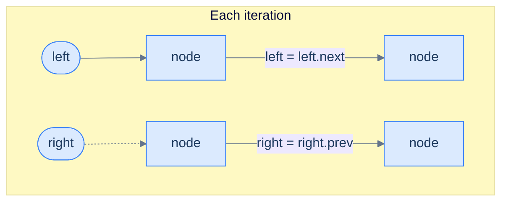
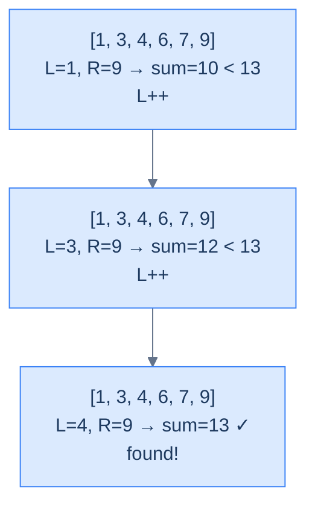

# Understanding the Two-Pointer Pattern

## The World — Two Walkers, One Hallway

Picture a long hallway with numbered doors lined up in increasing order. One person stands at the first door, another at the last. They walk toward each other, comparing the numbers on their doors at every step. If the **sum** of the two numbers is too small, the left walker advances; if it's too large, the right walker steps back. Eventually they shake hands in the middle — and somewhere along the way, they've inspected every *useful* combination of doors without ever doubling back.

That's the two-pointer technique. On a doubly linked list, the hallway is the list itself, the walkers are `left` and `right` pointers, and "stepping" is just `left = left.next` or `right = right.prev`.

> 🖼 Diagram — Two-pointer traversal on a DLL — left walks forward via next, right walks backward via prev. They converge from both ends until they meet (or cross) in the middle.


<p align="center"><strong>Two-pointer traversal on a DLL — <code>left</code> walks forward via <code>next</code>, <code>right</code> walks backward via <code>prev</code>. They converge from both ends until they meet (or cross) in the middle.</strong></p>

## Why a Singly Linked List Can't Do This

To perform any operation on the data items in a **singly** linked list, we must traverse from `head` to `tail` and find those items in one direction only. A doubly linked list, however, can be traversed in *two* directions — head-to-tail or tail-to-head — and depending on the problem, we may choose one direction over the other.

Some problems, though, require us to traverse the linked list in *both* directions **simultaneously**. With a singly linked list this is impossible without first reversing or copying the list (extra space, extra time). With a DLL it's free — every node already stores `prev`, so the `right` walker has somewhere to go.

> **The key claim:** the two-pointer technique allows us to solve certain problems in **linear time, single-pass, O(1) space** — problems that would otherwise force nested loops or auxiliary data structures.

The two-pointer pattern is the family of problems solvable using this two-pointer traversal technique.

## Why Naive Isn't Enough

The obvious first instinct for a "compare two ends" or "find a pair" problem on a linked list is to nest two walks — for each `outer` node, walk an `inner` cursor across the rest. That works, but it costs `O(n²)` time on a structure that should support a single sweep, and it ignores the very property that makes a DLL special: every node already knows its predecessor.

A second naive option is to copy values into an array, run the array two-pointer algorithm, then copy back. That clears the time bound — `O(n)` once the copy is done — but pays `O(n)` extra space and abandons the linked-list shape. It also doesn't generalise: as soon as the problem asks you to splice or relink nodes (`Pairwise Swap`, `Reverse k Segments`), the array detour cannot put pointers back the way it found them.

To make this concrete: a palindrome check on `1 ⇄ 2 ⇄ 3 ⇄ 2 ⇄ 1` with the nested-walk approach compares `1` against every other value, then `2` against every other value, etc. — five outer ticks × five inner ticks = 25 comparisons for a five-node list. The two-pointer pass needs three. The core insight is: when both ends matter and the structure permits backward steps, *one pointer at each end* is provably enough.

## The Core Idea

Two cursors — `left` and `right` — start at opposite ends of the doubly linked list and walk inward, doing constant-time work on the pair `(left, right)` at every step. The DLL's `prev` field is what makes the backward step on `right` an `O(1)` operation; without it, the second cursor would have to re-traverse from `head` each iteration, collapsing the algorithm back to `O(n²)`.

The pattern's correctness rests on a simple invariant: the unprocessed region of the list is exactly the open span `(left, right)` — every node outside that span has already been visited. Each iteration shrinks the span by one node on the left, one on the right, or both, and the loop terminates the moment the span is empty.

## The Two-Pointer Technique

The technique uses two references, `left` and `right`, initialised at `head` and `tail` respectively. We traverse in both directions by following `next` from `left` and `prev` from `right`, until they meet in the middle or `left` crosses past `right`. At each iteration we inspect the nodes held by `left` and `right`, do whatever the problem demands, and decide which pointer to advance — possibly both, possibly only one — to close the gap.

> 🖼 Diagram — Each iteration: act on left and right, then move one or both inward by one step.


<p align="center"><strong>Each iteration: act on <code>left</code> and <code>right</code>, then move one or both inward by one step.</strong></p>

## How the Pointers Move

Each iteration follows one rhythm — read, decide, step. The DLL gives both directions in `O(1)`, so the per-step choice is free:

- `left` advances **forward** via `left = left.next`.
- `right` retreats **backward** via `right = right.prev`.
- Both may advance in the same iteration (when both pointers are "done" with their current node), or just one (when only one side needs to move to make progress).

To make this concrete: on the sorted list `[1, 3, 4, 6, 9]` with `target = 10`, the pair `(left=1, right=9)` sums to `10` — both advance. The next pair `(left=3, right=6)` sums to `9` — only `left` advances, since `right.val = 6` could still pair with a larger left. The decision is local to each iteration, but the *invariant* is global: every step strictly shrinks the unprocessed span `(left, right)`.

So the key idea is: the pattern is not "move both pointers" — it is "move at least one pointer inward, chosen by the loop body's verdict on the current pair."

## The Generic Algorithm

> -   **Step 1:** Initialise `left = head` and `right = tail`.
> -   **Step 2:** Loop while `left != right` **and** `left.prev != right` (the second guard catches the moment they cross — see the friction prompt below):
>     -   **Step 2.1:** Perform the operation on the nodes held by `left` and `right` as the problem dictates.
>     -   **Step 2.2:** Decide whether `left` should advance — if yes, set `left = left.next` (possibly more than once).
>     -   **Step 2.3:** Decide whether `right` should retreat — if yes, set `right = right.prev` (possibly more than once).

> *Friction prompt — before reading on:* why do we need **both** termination guards? What goes wrong with only `left != right`? Predict before scrolling.
>
> Answer: with an even-length list, `left` and `right` never land on the *same* node — they swap past each other. After one final inward step, `left.prev == right` (they crossed). Without the second guard, the loop would run one iteration too many on already-processed nodes, comparing them backwards. The pair `(left != right) && (left.prev != right)` covers both odd-length (meet) and even-length (cross) lists.

## Generic Implementation

The skeleton below is the template every problem in this lesson specialises. Read it once, then watch how each problem changes only the *condition* and the *what to do at each step*.


```python run viz=linked-list viz-root=head
"""
Definition for doubly-linked list.
class ListNode:
    def __init__(self, val):
        self.val = val
        self.prev = None
        self.next = None
"""

from typing import Optional

def two_pointer(head: Optional[ListNode], tail: Optional[ListNode]) -> None:
    # If the head and tail are the same or adjacent, nothing needs to be done
    if not head or not tail or head == tail or head.next == tail:
        return

    # Initialize left and right references
    left = head
    right = tail

    while left != right and left.prev != right:
        '''
        Perform the operation on left and right.
        You can include your specific logic here.
        '''

        # Adjust pointers based on conditions
        if should_move_left:  # You should define this condition according to your logic
            left = left.next

        if should_move_right:  # You should define this condition according to your logic
            right = right.prev

    return
```

```java run viz=linked-list viz-root=head

/**
 * Definition for doubly-linked list.
 * class ListNode {
 *     int val;
 *     ListNode prev;
 *     ListNode next;
 *     ListNode() {}
 *     ListNode(int val) { this.val = val; }
 * };
 */

class TwoPointer {

        public void twoPointer(ListNode head, ListNode tail) {
        // If the head and tail are the same or adjacent, nothing needs to be done
        if (head == null || tail == null || head == tail || head.next == tail) {
            return;
        }

        // Initialize left and right references
        ListNode left = head;
        ListNode right = tail;

        // Loop until the left and right pointers meet or cross each other
        while (left != right && left.prev != right) {
            /*
            Perform the operation on left and right
            Example: swapping values, comparing nodes, etc.
            */

            // Adjust pointers based on conditions
            if (shouldMoveLeft) {
                left = left.next;
            }

            if (shouldMoveRight) {
                right = right.prev;
            }
        }
    }

}
```


## Complexity Analysis

Both pointers traverse the list once, from opposite ends, and meet in the middle — collectively visiting each node at most once. That's logically equivalent to one full sweep.

| Measure | Value | Why |
|---|---|---|
| Time  | **O(N)** | `left` and `right` together cover every node exactly once before crossing. |
| Space | **O(1)** | Two pointers, no auxiliary structure. |

> **Best Case**: Time **O(N)**, Space **O(1)**
>
> **Worst Case**: Time **O(N)**, Space **O(1)**

We unlocked a structural superpower — but where exactly is it the *right* tool? That's the next question.

## Variants / Taxonomy

The DLL two-pointer family splits into three sub-shapes, distinguished by how the *pair* relates to the answer:

- **Mirror check.** Compare `left.val` and `right.val` at every step; a single mismatch decides the result (`Palindrome Number`).
- **Pair search.** Maintain `sum = left.val + right.val` and steer the pointers based on `sum vs target` to find one or more pairs (`Two Sum`, `Duplicate-Aware Two Sum`).
- **Fix-one-reduce.** An outer loop pins a node, an inner two-pointer scan searches the remainder. The inner pass is unchanged; only an extra term enters the running sum (`Approximate Three Sum`).

Each sub-shape uses the same loop skeleton — only the *condition* and the *what to do at each step* change. The pair-search variant is the workhorse; the mirror-check variant is the simplest; the fix-one-reduce variant scales the family to `k`-sum problems by repeated reduction.

# Identifying the Two-Pointer Pattern

Almost every two-pointer **array** problem can be reformulated as a doubly linked list problem and solved the same way. These tend to be **medium** or **hard** on a DLL because pointer plumbing and null-checks are more delicate than array indexing — but the underlying logic is identical.

If a problem statement (or its naive solution) fits the template below, it's a two-pointer problem:

> **Template:** Given a doubly linked list, perform an operation on two nodes `left` and `right` where `left` starts at `x` and `right` starts at `y` with `x` to the left of `y`, and on each iteration `left` and `right` move strictly closer to each other.

## Recognition Checklist

Four questions to confirm a problem fits the DLL two-pointer pattern. If every answer is "yes," the skeleton applies as-is.

1. **Are two nodes inspected at the same time, one from each end?** Each iteration must read or compare `left` and `right` together — never one without the other.
2. **Does one pointer start near `head` and the other near `tail`?** The initial state is `left = head` (or close to it) and `right = tail` (or close to it), with `left` strictly before `right` in the chain.
3. **Do both pointers move strictly inward?** Every iteration moves `left = left.next`, `right = right.prev`, or both. Neither pointer ever reverses direction.
4. **Is the per-step work `O(1)`?** The loop body must be constant-time — a comparison, a sum check, an append. No inner scan of the remaining nodes.

These four questions reappear as the **Diagnostic Questions** table in every problem write-up that follows.

## Canonical Example — Spotting It in the Wild

> **Problem:** Given the `head` and `tail` of a doubly linked list of integers sorted non-decreasing, and an integer `target`, return `true` if any two nodes have values summing to `target`.

Take the list below with `target = 13` — two nodes obviously satisfy the requirement.

> 🖼 Diagram — Find a pair summing to 13 — sorted order plus DLL bidirectionality is the exact recipe two-pointers eats for breakfast.


<p align="center"><strong>Find a pair summing to 13 — sorted order plus DLL bidirectionality is the exact recipe two-pointers eats for breakfast.</strong></p>

### The Two-Pointer Solution

The classic Two-Sum array solution sorts the array, then uses two pointers (the proof of correctness was covered in the array two-pointer chapter). Here, the values are *already* sorted — so we can apply the same logic directly:

- Plant `left = head`, `right = tail`.
- Compute `sum = left.val + right.val`.
- If `sum < target`, `left.val` is paired against the *largest* possible partner and still falls short — that means `left.val` can never participate in a valid pair, **so advance `left`** (drop it).
- If `sum > target`, `right.val` is paired against the *smallest* possible partner and still overshoots — `right.val` can never participate, **so retreat `right`**.
- If `sum == target`, record the pair and shrink both inward.

This fits the template exactly.

> 🖼 Diagram — Finding a pair with sum 13 — each iteration shrinks the search range by discarding a value that provably cannot participate.


<p align="center"><strong>Finding a pair with sum 13 — each iteration shrinks the search range by discarding a value that provably cannot participate.</strong></p>

The reference C++ implementation (we'll see the Python and Java versions in the dedicated Two Sum section below):

```cpp
class Solution {
public:
    vector<vector<int>> twoSum(ListNode *head, ListNode *tail, int target) {
        if (!head || !head->next) return {};
        vector<vector<int>> result;
        ListNode *left = head, *right = tail;
        while (left && right && left->val < right->val) {
            int sum = left->val + right->val;
            if (sum == target) {
                result.push_back({left->val, right->val});
                left = left->next; right = right->prev;
            } else if (sum < target) {
                left = left->next;
            } else {
                right = right->prev;
            }
        }
        return result;
    }
};
```

Single pass, no extra space — exactly the speedup the pattern promises.

## Problems in This Category

The following four problems each apply the DLL two-pointer technique with a small twist on the same skeleton:

| # | Problem | Sub-shape | Work per step |
|---|---|---|---|
| 1 | [Palindrome Number](02-problems/01-palindrome-number) | Mirror check | Compare `left.val` and `right.val`; fail fast on mismatch |
| 2 | [Two Sum](02-problems/02-two-sum) | Pair search | Compare `sum = left.val + right.val` against `target` |
| 3 | [Duplicate-Aware Two Sum](02-problems/03-duplicate-aware-two-sum) | Pair search + skip | Pair search, then walk past every run of equal values |
| 4 | [Approximate Three Sum](02-problems/04-approximate-three-sum) | Fix-one-reduce | Outer loop pins a node; inner two-pointer tracks the closest sum |

Each is a small variation on the same skeleton — only the loop body and the move-decision change.
