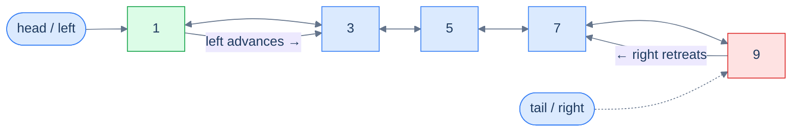
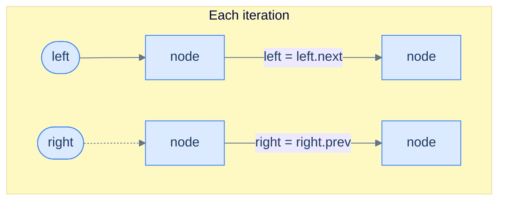
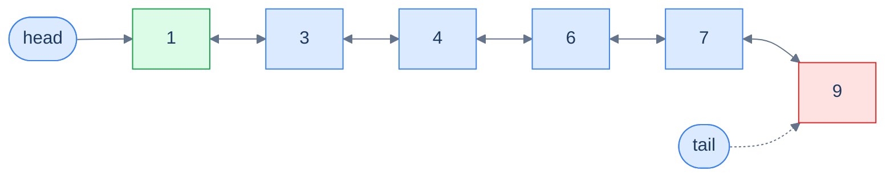
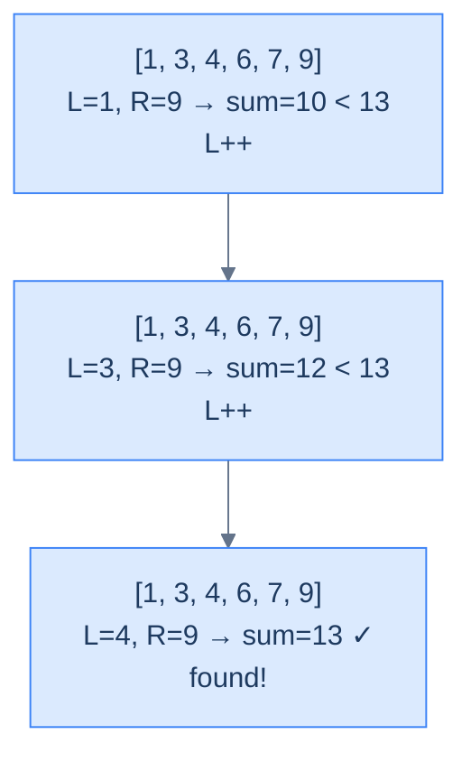

# Understanding the Two-Pointer Pattern

## The World — Two Walkers, One Hallway

Picture a long hallway with numbered doors lined up in increasing order. One person stands at the first door, another at the last. They walk toward each other, comparing the numbers on their doors at every step. If the **sum** of the two numbers is too small, the left walker advances; if it's too large, the right walker steps back. Eventually they shake hands in the middle — and somewhere along the way, they've inspected every *useful* combination of doors without ever doubling back.

That's the two-pointer technique. On a doubly linked list, the hallway is the list itself, the walkers are `left` and `right` pointers, and "stepping" is just `left = left.next` or `right = right.prev`.

> 🖼 Diagram — Two-pointer traversal on a DLL — left walks forward via next, right walks backward via prev. They converge from both ends until they meet (or cross) in the middle.


<p align="center"><strong>Two-pointer traversal on a DLL — <code>left</code> walks forward via <code>next</code>, <code>right</code> walks backward via <code>prev</code>. They converge from both ends until they meet (or cross) in the middle.</strong></p>

## Why a Singly Linked List Can't Do This

To perform any operation on the data items in a **singly** linked list, we must traverse from `head` to `tail` and find those items in one direction only. A doubly linked list, however, can be traversed in *two* directions — head-to-tail or tail-to-head — and depending on the problem, we may choose one direction over the other.

Some problems, though, require us to traverse the linked list in *both* directions **simultaneously**. With a singly linked list this is impossible without first reversing or copying the list (extra space, extra time). With a DLL it's free — every node already stores `prev`, so the `right` walker has somewhere to go.

> **The key claim:** the two-pointer technique allows us to solve certain problems in **linear time, single-pass, O(1) space** — problems that would otherwise force nested loops or auxiliary data structures.

The two-pointer pattern is the family of problems solvable using this two-pointer traversal technique.

## The Two-Pointer Technique

The technique uses two references, `left` and `right`, initialised at `head` and `tail` respectively. We traverse in both directions by following `next` from `left` and `prev` from `right`, until they meet in the middle or `left` crosses past `right`. At each iteration we inspect the nodes held by `left` and `right`, do whatever the problem demands, and decide which pointer to advance — possibly both, possibly only one — to close the gap.

> 🖼 Diagram — Each iteration: act on left and right, then move one or both inward by one step.


<p align="center"><strong>Each iteration: act on <code>left</code> and <code>right</code>, then move one or both inward by one step.</strong></p>

## The Generic Algorithm

> -   **Step 1:** Initialise `left = head` and `right = tail`.
> -   **Step 2:** Loop while `left != right` **and** `left.prev != right` (the second guard catches the moment they cross — see the friction prompt below):
>     -   **Step 2.1:** Perform the operation on the nodes held by `left` and `right` as the problem dictates.
>     -   **Step 2.2:** Decide whether `left` should advance — if yes, set `left = left.next` (possibly more than once).
>     -   **Step 2.3:** Decide whether `right` should retreat — if yes, set `right = right.prev` (possibly more than once).

> *Friction prompt — before reading on:* why do we need **both** termination guards? What goes wrong with only `left != right`? Predict before scrolling.
>
> Answer: with an even-length list, `left` and `right` never land on the *same* node — they swap past each other. After one final inward step, `left.prev == right` (they crossed). Without the second guard, the loop would run one iteration too many on already-processed nodes, comparing them backwards. The pair `(left != right) && (left.prev != right)` covers both odd-length (meet) and even-length (cross) lists.

## Generic Implementation

The skeleton below is the template every problem in this lesson specialises. Read it once, then watch how each problem changes only the *condition* and the *what to do at each step*.


```python run

"""
Definition for doubly-linked list.
class ListNode:
    def __init__(self, val):
        self.val = val
        self.prev = None
        self.next = None
"""

from typing import Optional

def two_pointer(head: Optional[ListNode], tail: Optional[ListNode]) -> None:
    # If the head and tail are the same or adjacent, nothing needs to be done
    if not head or not tail or head == tail or head.next == tail:
        return

    # Initialize left and right references
    left = head
    right = tail

    while left != right and left.prev != right:
        '''
        Perform the operation on left and right.
        You can include your specific logic here.
        '''

        # Adjust pointers based on conditions
        if should_move_left:  # You should define this condition according to your logic
            left = left.next

        if should_move_right:  # You should define this condition according to your logic
            right = right.prev

    return
```

```java run

/**
 * Definition for doubly-linked list.
 * class ListNode {
 *     int val;
 *     ListNode prev;
 *     ListNode next;
 *     ListNode() {}
 *     ListNode(int val) { this.val = val; }
 * };
 */

class TwoPointer {

        public void twoPointer(ListNode head, ListNode tail) {
        // If the head and tail are the same or adjacent, nothing needs to be done
        if (head == null || tail == null || head == tail || head.next == tail) {
            return;
        }

        // Initialize left and right references
        ListNode left = head;
        ListNode right = tail;

        // Loop until the left and right pointers meet or cross each other
        while (left != right && left.prev != right) {
            /*
            Perform the operation on left and right
            Example: swapping values, comparing nodes, etc.
            */

            // Adjust pointers based on conditions
            if (shouldMoveLeft) {
                left = left.next;
            }

            if (shouldMoveRight) {
                right = right.prev;
            }
        }
    }

}
```


## Complexity Analysis

Both pointers traverse the list once, from opposite ends, and meet in the middle — collectively visiting each node at most once. That's logically equivalent to one full sweep.

| Measure | Value | Why |
|---|---|---|
| Time  | **O(N)** | `left` and `right` together cover every node exactly once before crossing. |
| Space | **O(1)** | Two pointers, no auxiliary structure. |

> **Best Case**: Time **O(N)**, Space **O(1)**
>
> **Worst Case**: Time **O(N)**, Space **O(1)**

We unlocked a structural superpower — but where exactly is it the *right* tool? That's the next question.

# Identifying the Two-Pointer Pattern

Almost every two-pointer **array** problem can be reformulated as a doubly linked list problem and solved the same way. These tend to be **medium** or **hard** on a DLL because pointer plumbing and null-checks are more delicate than array indexing — but the underlying logic is identical.

If a problem statement (or its naive solution) fits the template below, it's a two-pointer problem:

> **Template:** Given a doubly linked list, perform an operation on two nodes `left` and `right` where `left` starts at `x` and `right` starts at `y` with `x` to the left of `y`, and on each iteration `left` and `right` move strictly closer to each other.

## Worked Example — Spotting It in the Wild

> **Problem:** Given the `head` and `tail` of a doubly linked list of integers sorted non-decreasing, and an integer `target`, return `true` if any two nodes have values summing to `target`.

Take the list below with `target = 13` — two nodes obviously satisfy the requirement.

> 🖼 Diagram — Find a pair summing to 13 — sorted order plus DLL bidirectionality is the exact recipe two-pointers eats for breakfast.


<p align="center"><strong>Find a pair summing to 13 — sorted order plus DLL bidirectionality is the exact recipe two-pointers eats for breakfast.</strong></p>

### The Two-Pointer Solution

The classic Two-Sum array solution sorts the array, then uses two pointers (the proof of correctness was covered in the array two-pointer chapter). Here, the values are *already* sorted — so we can apply the same logic directly:

- Plant `left = head`, `right = tail`.
- Compute `sum = left.val + right.val`.
- If `sum < target`, `left.val` is paired against the *largest* possible partner and still falls short — that means `left.val` can never participate in a valid pair, **so advance `left`** (drop it).
- If `sum > target`, `right.val` is paired against the *smallest* possible partner and still overshoots — `right.val` can never participate, **so retreat `right`**.
- If `sum == target`, record the pair and shrink both inward.

This fits the template exactly.

> 🖼 Diagram — Finding a pair with sum 13 — each iteration shrinks the search range by discarding a value that provably cannot participate.


<p align="center"><strong>Finding a pair with sum 13 — each iteration shrinks the search range by discarding a value that provably cannot participate.</strong></p>

The reference C++ implementation (we'll see the Python and Java versions in the dedicated Two Sum section below):

```cpp
class Solution {
public:
    vector<vector<int>> twoSum(ListNode *head, ListNode *tail, int target) {
        if (!head || !head->next) return {};
        vector<vector<int>> result;
        ListNode *left = head, *right = tail;
        while (left && right && left->val < right->val) {
            int sum = left->val + right->val;
            if (sum == target) {
                result.push_back({left->val, right->val});
                left = left->next; right = right->prev;
            } else if (sum < target) {
                left = left->next;
            } else {
                right = right->prev;
            }
        }
        return result;
    }
};
```

Single pass, no extra space — exactly the speedup the pattern promises.

## The Problem Roster

We'll now cement the technique with four concrete problems of growing difficulty:

> -   **Palindrome Number** — pure mirror check
> -   **Two Sum** — the canonical sorted-pair search
> -   **Duplicate-Aware Two Sum** — same idea, but skip-duplicate plumbing
> -   **Approximate Three Sum** — fix one node, two-pointer the rest

<!-- ============================================== -->
<!-- SWEEP 2 — missing sections (placeholders only) -->
<!-- ============================================== -->

<!-- TODO: Why Naive Isn't Enough — missing, needs to be written -->
<!--       Guidance: motivation for why the obvious approach fails -->

<!-- TODO: The Core Idea — missing, needs to be written -->
<!--       Guidance: one paragraph: the central trick -->

<!-- TODO: How the Pointers/Window Move — missing, needs to be written -->
<!--       Guidance: mechanics of the moving parts -->

<!-- TODO: Variants / Taxonomy — missing, needs to be written -->
<!--       Guidance: enumerate sub-shapes of this pattern -->

<!-- TODO: Recognition Checklist — missing, needs to be written -->
<!--       Guidance: 4-question diagnostic — the source of the Problem-section Diagnostic Questions -->

<!-- TODO: Canonical Example — missing, needs to be written -->
<!--       Guidance: fully worked example: brute force → optimised → template fit -->

<!-- TODO: Problems in This Category — missing, needs to be written -->
<!--       Guidance: table with links to the 02-problems/ files -->
