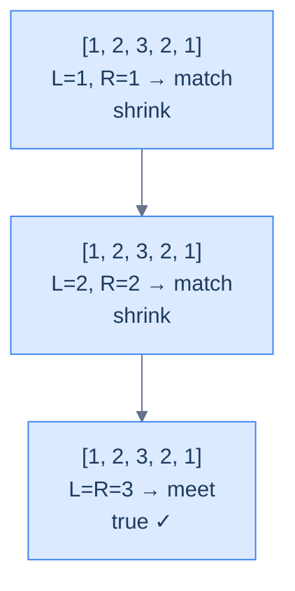

# Palindrome Number

## The Problem

Given the **head** and **tail** of a sorted (well — *symmetric*) doubly linked list, return `true` if the list reads the same forwards and backwards, `false` otherwise. A palindrome number reads identically left-to-right and right-to-left.

```
Input:  head = [1, 2, 3, 2, 1]
Output: true

Input:  head = [6, 6, 6]
Output: true

Input:  head = [1, 2, 3, 4, 5]
Output: false
```

<details>
<summary><h2>The Mirror Strategy (Visualised)</h2></summary>


Plant `left` at the start, `right` at the end. At each step, compare the two values; if they ever differ, return `false`. Otherwise step inward and keep going until the pointers meet (odd length) or cross (even length).

> 🖼 Diagram — Palindrome check — mirror comparison from both ends until pointers meet or cross.


<p align="center"><strong>Palindrome check — mirror comparison from both ends until pointers meet or cross.</strong></p>

</details>
<details>
<summary><h2>Solution &amp; Analysis</h2></summary>

### The Solution

```python run
from typing import Optional

class ListNode:
    def __init__(self, val=0, prev=None, nxt=None):
        self.val = val
        self.prev = prev
        self.next = nxt


def from_list(values):
    if not values:
        return None
    head = ListNode(values[0])
    cur = head
    for v in values[1:]:
        node = ListNode(v, prev=cur)
        cur.next = node
        cur = node
    return head


def get_tail(head):
    if head is None:
        return None
    cur = head
    while cur.next is not None:
        cur = cur.next
    return cur


class Solution:
    def palindrome_number(
        self, head: Optional[ListNode], tail: Optional[ListNode]
    ) -> bool:

        # Empty list or single element is a palindrome
        if not head or head == tail:
            return True

        left = head
        right = tail

        while left and right and left != right and left.prev != right:

            # If values don't match, its not a palindrome
            if left.val != right.val:
                return False

            # Move the left pointer to the right
            left = left.next

            # Move the right pointer to the left
            right = right.prev

        # If all values matched, it's a palindrome
        return True


# Examples from the problem statement
h = from_list([1, 2, 3, 2, 1])
print(Solution().palindrome_number(h, get_tail(h)))   # True

h = from_list([6, 6, 6])
print(Solution().palindrome_number(h, get_tail(h)))   # True

h = from_list([1, 2, 3, 4, 5])
print(Solution().palindrome_number(h, get_tail(h)))   # False

# Edge cases
h = from_list([5])
print(Solution().palindrome_number(h, get_tail(h)))   # True

h = from_list([1, 2, 1])
print(Solution().palindrome_number(h, get_tail(h)))   # True

h = from_list([1, 2])
print(Solution().palindrome_number(h, get_tail(h)))   # False

h = from_list([1, 2, 2, 1])
print(Solution().palindrome_number(h, get_tail(h)))   # True

h = from_list([9, 9, 9, 9])
print(Solution().palindrome_number(h, get_tail(h)))   # True

h = from_list([1, 2, 3])
print(Solution().palindrome_number(h, get_tail(h)))   # False
```

```java run
import java.util.*;

public class Main {
    static class ListNode {
        int val;
        ListNode prev;
        ListNode next;
        ListNode() {}
        ListNode(int val) { this.val = val; }
    }

    static ListNode fromList(int... values) {
        if (values.length == 0) return null;
        ListNode head = new ListNode(values[0]);
        ListNode cur = head;
        for (int i = 1; i < values.length; i++) {
            ListNode node = new ListNode(values[i]);
            node.prev = cur;
            cur.next = node;
            cur = node;
        }
        return head;
    }

    static ListNode getTail(ListNode head) {
        if (head == null) return null;
        ListNode cur = head;
        while (cur.next != null) cur = cur.next;
        return cur;
    }

    static class Solution {
        public boolean palindromeNumber(ListNode head, ListNode tail) {

            // Empty list or single element is a palindrome
            if (head == null || head == tail) {
                return true;
            }

            ListNode left = head;
            ListNode right = tail;

            while (
                left != null &&
                right != null &&
                left != right &&
                left.prev != right
            ) {

                // If values don't match, its not a palindrome
                if (left.val != right.val) {
                    return false;
                }

                // Move the left pointer to the right
                left = left.next;

                // Move the right pointer to the left
                right = right.prev;
            }

            // If all values matched, it's a palindrome
            return true;
        }
    }

    public static void main(String[] args) {
        // Examples from the problem statement
        ListNode h;

        h = fromList(1, 2, 3, 2, 1);
        System.out.println(new Solution().palindromeNumber(h, getTail(h)));  // true

        h = fromList(6, 6, 6);
        System.out.println(new Solution().palindromeNumber(h, getTail(h)));  // true

        h = fromList(1, 2, 3, 4, 5);
        System.out.println(new Solution().palindromeNumber(h, getTail(h)));  // false

        // Edge cases
        h = fromList(5);
        System.out.println(new Solution().palindromeNumber(h, getTail(h)));  // true

        h = fromList(1, 2, 1);
        System.out.println(new Solution().palindromeNumber(h, getTail(h)));  // true

        h = fromList(1, 2);
        System.out.println(new Solution().palindromeNumber(h, getTail(h)));  // false

        h = fromList(1, 2, 2, 1);
        System.out.println(new Solution().palindromeNumber(h, getTail(h)));  // true

        h = fromList(9, 9, 9, 9);
        System.out.println(new Solution().palindromeNumber(h, getTail(h)));  // true

        h = fromList(1, 2, 3);
        System.out.println(new Solution().palindromeNumber(h, getTail(h)));  // false
    }
}
```


<details>
<summary><strong>Trace — head = [1, 2, 3, 2, 1]</strong></summary>

```
list = [1, 2, 3, 2, 1]

Step 1 │ L=node(1), R=node(1)         │ vals match (1 == 1) │ L→2, R→2
Step 2 │ L=node(2), R=node(2)         │ vals match (2 == 2) │ L→3, R→3
Done   │ L == R (both at node(3))     │ loop exits           │ return true
Result: true ✓ (every mirrored pair matched and pointers met in the middle)
```

</details>
<details>
<summary><strong>Trace — head = [1, 2, 3, 4, 5]</strong></summary>

```
list = [1, 2, 3, 4, 5]

Step 1 │ L=node(1), R=node(5)         │ 1 != 5 → mismatch    │ return false
Result: false ✓ (mismatch detected on the very first iteration)
```

</details>

### Complexity Analysis

| Measure | Value | Reason |
|---|---|---|
| Time  | **O(N)** | Each pointer covers half the list; together they touch every node at most once. |
| Space | **O(1)** | Two pointers — no copy, no reverse. |

### Edge Cases

| Case | Example | Expected | Reasoning |
|---|---|---|---|
| Empty list | `head = null` | `true` | Vacuously palindromic. |
| Single node | `[7]` | `true` | A length-1 sequence equals its reverse. |
| Even length match | `[1, 2, 2, 1]` | `true` | Pointers cross (`left.prev == right`) without ever colliding. |
| Even length mismatch | `[1, 2, 3, 1]` | `false` | Inner pair `(2, 3)` fails — return early. |

We've used both pointers symmetrically. Up next: a problem where the *decision* of which pointer to move depends on a computed value.

</details>

<!-- ============================================== -->
<!-- SWEEP 2 — missing sections (placeholders only) -->
<!-- ============================================== -->

<!-- TODO: Examples — missing, needs to be written -->
<!--       Guidance: min 3 examples: basic / variant / edge -->

<!-- TODO: Intuition — missing, needs to be written -->
<!--       Guidance: 3 paragraphs: brute force / observation / pattern fit -->

<!-- TODO: Applying the Diagnostic Questions — missing, needs to be written -->
<!--       Guidance: REQUIRED, never optional -->
<!--       Guidance: 4-row table. Columns: 'Check' | 'Answer for [Problem Name]' -->
<!--       Guidance: Rows: two positions simultaneously / one near start one near end / both move inward / simple O(1) work at each step -->

<!-- TODO: Approach — missing, needs to be written -->
<!--       Guidance: numbered steps, no code -->

<!-- TODO: Dry Run — missing, needs to be written -->
<!--       Guidance: walk through a small example step by step -->

<!-- TODO: Key Takeaway — missing, needs to be written -->
<!--       Guidance: 1–2 sentences -->
