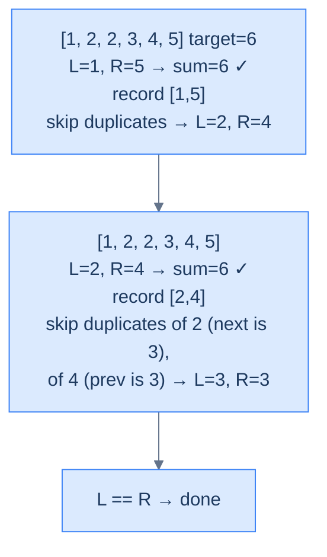

# Duplicate-Aware Two Sum

## The Problem

Given the **head** and **tail** of a doubly linked list sorted non-decreasing, and an integer **target**, return all unique pairs summing to `target`. The list **may contain duplicates**, but the result must not contain duplicate pairs (in any order).

```
Input:  head = [1, 2, 2, 3, 4, 5], target = 6
Output: [[1, 5], [2, 4]]
Explanation: 1+5=6 and 2+4=6. The duplicate 2 is not paired again.

Input:  head = [1, 2, 2, 2, 2], target = 3
Output: [[1, 2]]
Explanation: 1+2=3 — but only one such pair, despite four 2s.

Input:  head = [2], target = 2
Output: []
Explanation: Need two values to sum.
```

<details>
<summary><h2>What Does "Skipping Duplicates Safely" Mean?</h2></summary>


When we find a pair, naively moving each pointer one step risks finding the *same value pair* again. We need to advance `left` past every node sharing its current value, and `right` back past every node sharing its current value. Two helpers do exactly this — and they must be called in the right order so that the second sees the *already-advanced* first pointer (otherwise `left == right` checks misfire on tight inputs).

</details>
<details>
<summary><h2>The Skip-Duplicates Strategy (Visualised)</h2></summary>


> 🖼 Diagram — Duplicate-aware Two Sum — after each match, both pointers walk past every node sharing their value before resuming.


<p align="center"><strong>Duplicate-aware Two Sum — after each match, both pointers walk past every node sharing their value before resuming.</strong></p>

> *Friction prompt:* what would happen if we forgot the duplicate skip and the input were `[2,2,2,2], target=4`? Predict the output before peeking.
>
> Answer: without skipping, `(L=2, R=2)` matches, both move inward, match again, etc. — we'd record `[2,2]` multiple times. The skip ensures we land on the *next distinct* values on both sides.

</details>
<details>
<summary><h2>Solution &amp; Analysis</h2></summary>

### The Solution

```python run
from typing import Optional, List

class ListNode:
    def __init__(self, val=0, prev=None, nxt=None):
        self.val = val
        self.prev = prev
        self.next = nxt


def from_list(values):
    if not values:
        return None
    head = ListNode(values[0])
    cur = head
    for v in values[1:]:
        node = ListNode(v, prev=cur)
        cur.next = node
        cur = node
    return head


def get_tail(head):
    if head is None:
        return None
    cur = head
    while cur.next is not None:
        cur = cur.next
    return cur


class Solution:
    def skip_duplicates_left(
        self, left: Optional[ListNode], right: Optional[ListNode]
    ) -> Optional[ListNode]:
        while (
            left
            and left.next
            and left != right
            and left.val == left.next.val
        ):
            left = left.next

        # Return the pointer to the next unique element
        return left.next if left else None

    def skip_duplicates_right(
        self, left: Optional[ListNode], right: Optional[ListNode]
    ) -> Optional[ListNode]:
        while (
            right
            and right.prev
            and left != right
            and right.val == right.prev.val
        ):
            right = right.prev

        # Return the pointer to the next unique element
        return right.prev if right else None

    def duplicate_aware_two_sum(
        self,
        head: Optional[ListNode],
        tail: Optional[ListNode],
        target: int,
    ) -> List[List[int]]:

        # Check if the list is empty or has only one element
        if not head or not head.next:

            # Return an empty list since there are no pairs to be found
            return []

        # Store the pairs of values that sum up to the target
        result: List[List[int]] = []
        left: Optional[ListNode] = head
        right: Optional[ListNode] = tail

        # Use a while loop to traverse the list using the two pointers
        while left and right and left != right and left.val <= right.val:
            total = left.val + right.val

            # If the sum matches the target, add the pair to the
            # result list
            if total == target:
                result.append([left.val, right.val])

                # Move the left pointer to the next unique element to
                # avoid duplicates
                left = self.skip_duplicates_left(left, right)

                # Move the right pointer to the previous unique element
                # to avoid duplicates
                right = self.skip_duplicates_right(left, right)

            # Move the left pointer to increase the sum
            elif total < target:
                left = left.next

            # Move the right pointer to decrease the sum
            else:
                right = right.prev

        return result


# Examples from the problem statement
h = from_list([1, 2, 2, 3, 4, 5])
print(Solution().duplicate_aware_two_sum(h, get_tail(h), 6))   # [[1, 5], [2, 4]]

h = from_list([1, 2, 2, 2, 2])
print(Solution().duplicate_aware_two_sum(h, get_tail(h), 3))   # [[1, 2]]

h = from_list([2])
print(Solution().duplicate_aware_two_sum(h, get_tail(h), 2))   # []

# Edge cases
h = from_list([1, 1, 2, 3])
print(Solution().duplicate_aware_two_sum(h, get_tail(h), 4))   # [[1, 3]]

h = from_list([1, 2, 3, 4, 5])
print(Solution().duplicate_aware_two_sum(h, get_tail(h), 10))  # []

h = from_list([1, 2])
print(Solution().duplicate_aware_two_sum(h, get_tail(h), 3))   # [[1, 2]]

h = from_list([1, 1, 1, 1])
print(Solution().duplicate_aware_two_sum(h, get_tail(h), 2))   # [[1, 1]]

h = from_list([2, 2, 2, 2])
print(Solution().duplicate_aware_two_sum(h, get_tail(h), 5))   # []
```

```java run
import java.util.*;

public class Main {
    static class ListNode {
        int val;
        ListNode prev;
        ListNode next;
        ListNode() {}
        ListNode(int val) { this.val = val; }
    }

    static ListNode fromList(int... values) {
        if (values.length == 0) return null;
        ListNode head = new ListNode(values[0]);
        ListNode cur = head;
        for (int i = 1; i < values.length; i++) {
            ListNode node = new ListNode(values[i]);
            node.prev = cur;
            cur.next = node;
            cur = node;
        }
        return head;
    }

    static ListNode getTail(ListNode head) {
        if (head == null) return null;
        ListNode cur = head;
        while (cur.next != null) cur = cur.next;
        return cur;
    }

    static class Solution {
        private ListNode skipDuplicatesLeft(ListNode left, ListNode right) {
            while (
                left != null &&
                left.next != null &&
                left != right &&
                left.val == left.next.val
            ) {
                left = left.next;
            }

            // Return the pointer to the next unique element
            return left.next;
        }

        private ListNode skipDuplicatesRight(ListNode left, ListNode right) {
            while (
                right != null &&
                right.prev != null &&
                left != right &&
                right.val == right.prev.val
            ) {
                right = right.prev;
            }

            // Return the pointer to the next unique element
            return right.prev;
        }

        public List<List<Integer>> duplicateAwareTwoSum(
            ListNode head,
            ListNode tail,
            int target
        ) {

            // Check if the list is empty or has only one element
            if (head == null || head.next == null) {

                // Return an empty list since there are no pairs to be found
                return new ArrayList<>();
            }

            // Store the pairs of values that sum up to the target
            List<List<Integer>> result = new ArrayList<>();
            ListNode left = head;
            ListNode right = tail;

            // Use a while loop to traverse the list using the two pointers
            while (
                left != null &&
                right != null &&
                left != right &&
                left.val <= right.val
            ) {
                int sum = left.val + right.val;

                // If the sum matches the target, add the pair to the
                // result list
                if (sum == target) {
                    result.add(List.of(left.val, right.val));

                    // Move the left pointer to the next unique element to
                    // avoid duplicates
                    left = skipDuplicatesLeft(left, right);

                    // Move the right pointer to the previous unique element
                    // to avoid duplicates
                    right = skipDuplicatesRight(left, right);
                }

                // Move the left pointer to increase the sum
                else if (sum < target) {
                    left = left.next;
                }

                // Move the right pointer to decrease the sum
                else {
                    right = right.prev;
                }
            }

            return result;
        }
    }

    public static void main(String[] args) {
        ListNode h;

        // Examples from the problem statement
        h = fromList(1, 2, 2, 3, 4, 5);
        System.out.println(new Solution().duplicateAwareTwoSum(h, getTail(h), 6));   // [[1, 5], [2, 4]]

        h = fromList(1, 2, 2, 2, 2);
        System.out.println(new Solution().duplicateAwareTwoSum(h, getTail(h), 3));   // [[1, 2]]

        h = fromList(2);
        System.out.println(new Solution().duplicateAwareTwoSum(h, getTail(h), 2));   // []

        // Edge cases
        h = fromList(1, 1, 2, 3);
        System.out.println(new Solution().duplicateAwareTwoSum(h, getTail(h), 4));   // [[1, 3]]

        h = fromList(1, 2, 3, 4, 5);
        System.out.println(new Solution().duplicateAwareTwoSum(h, getTail(h), 10));  // []

        h = fromList(1, 2);
        System.out.println(new Solution().duplicateAwareTwoSum(h, getTail(h), 3));   // [[1, 2]]

        h = fromList(1, 1, 1, 1);
        System.out.println(new Solution().duplicateAwareTwoSum(h, getTail(h), 2));   // [[1, 1]]

        h = fromList(2, 2, 2, 2);
        System.out.println(new Solution().duplicateAwareTwoSum(h, getTail(h), 5));   // []
    }
}
```


<details>
<summary><strong>Trace — head = [1, 2, 2, 3, 4, 5], target = 6</strong></summary>

```
arr = [1, 2, 2, 3, 4, 5] (already sorted), target = 6, result = []

Step 1 │ left=0 (1), right=5 (5) │ total=1+5=6 == 6 │ result=[[1,5]]
       │ skip_duplicates_left(arr,0,5):  arr[0]=1 ≠ arr[1]=2 → returns left+1 = 1
       │ skip_duplicates_right(arr,1,5): arr[5]=5 ≠ arr[4]=4 → returns right-1 = 4
Step 2 │ left=1 (2), right=4 (4) │ total=2+4=6 == 6 │ result=[[1,5],[2,4]]
       │ skip_duplicates_left(arr,1,4):  arr[1]=2 == arr[2]=2 → left=2; arr[2]=2 ≠ arr[3]=3 → returns 3
       │ skip_duplicates_right(arr,3,4): arr[4]=4 ≠ arr[3]=3 → returns right-1 = 3
Done   │ left=3, right=3 → left < right false → exit
Result: [[1, 5], [2, 4]] ✓
```

</details>

### Complexity Analysis

| Measure | Value | Reason |
|---|---|---|
| Time  | **O(N log N)** | `arr.sort()` dominates; the main loop plus skip helpers visit each index at most once, O(N). |
| Space | **O(1)** auxiliary | Constant index variables; output list excluded. |

### Edge Cases

| Case | Example | Expected | Reasoning |
|---|---|---|---|
| All duplicates | `[2,2,2,2], target=4` | `[[2,2]]` | First match recorded; skip helpers collapse the run to a single pair. |
| Target unreachable | `[1,1,1], target=10` | `[]` | `sum < target` always. |
| Single node | `[2]` | `[]` | Cannot form a pair. |

The pattern stays the same — we just bolted on a way to dodge repeats. Now the real boss fight: what if we need *three* numbers, and an exact match isn't even guaranteed?

</details>

<!-- ============================================== -->
<!-- SWEEP 2 — missing sections (placeholders only) -->
<!-- ============================================== -->

<!-- TODO: Examples — missing, needs to be written -->
<!--       Guidance: min 3 examples: basic / variant / edge -->

<!-- TODO: Intuition — missing, needs to be written -->
<!--       Guidance: 3 paragraphs: brute force / observation / pattern fit -->

<!-- TODO: Applying the Diagnostic Questions — missing, needs to be written -->
<!--       Guidance: REQUIRED, never optional -->
<!--       Guidance: 4-row table. Columns: 'Check' | 'Answer for [Problem Name]' -->
<!--       Guidance: Rows: two positions simultaneously / one near start one near end / both move inward / simple O(1) work at each step -->

<!-- TODO: Approach — missing, needs to be written -->
<!--       Guidance: numbered steps, no code -->

<!-- TODO: Dry Run — missing, needs to be written -->
<!--       Guidance: walk through a small example step by step -->

<!-- TODO: Key Takeaway — missing, needs to be written -->
<!--       Guidance: 1–2 sentences -->
