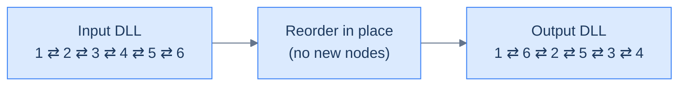
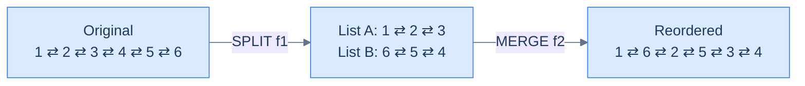
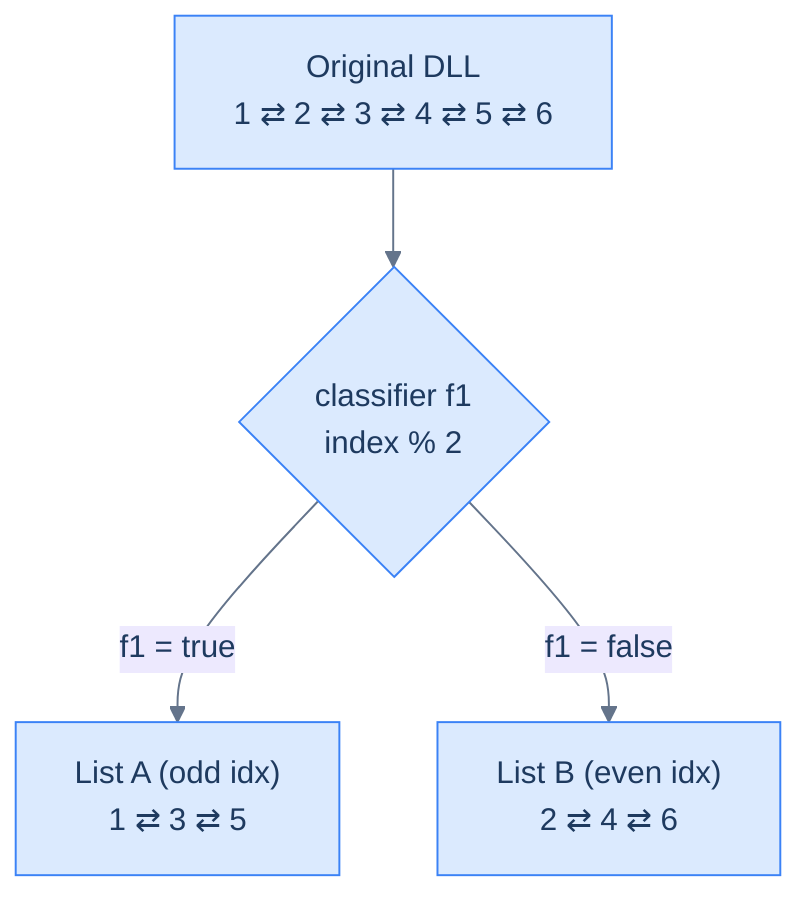
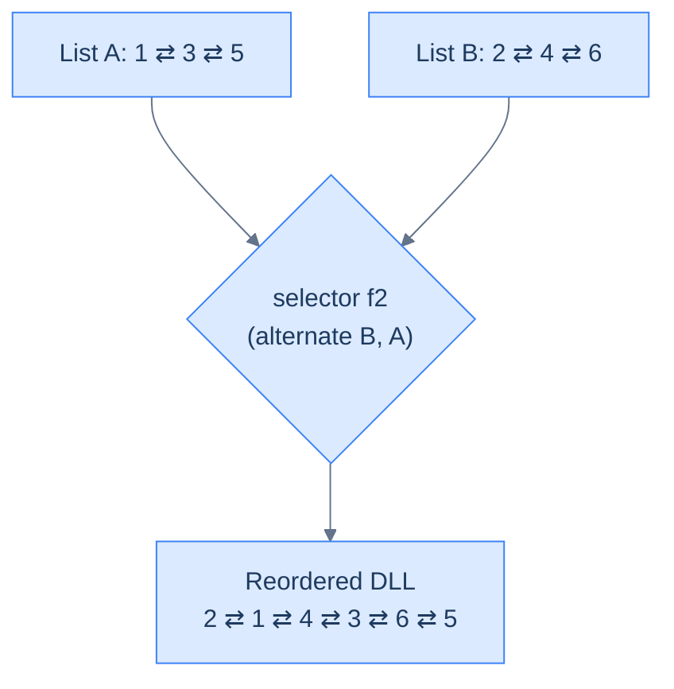
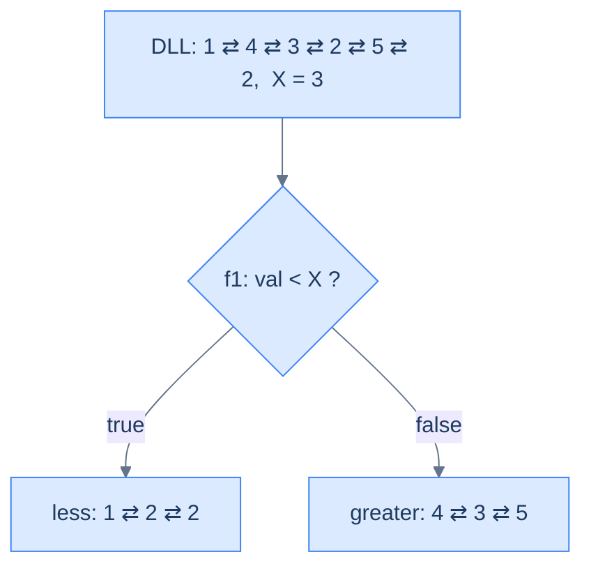
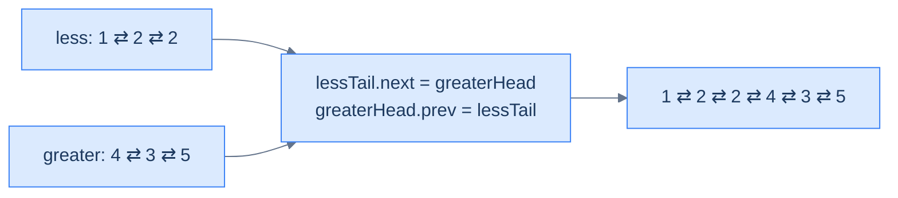

# Understanding the reorder pattern

Some linked list problems require us to reorder the nodes of a given list **in place** based on some condition. In most cases the recipe is the same: first **split** the list using a classifier function `f1` into two (or more) sub-lists, then **merge** them back — either by plain concatenation, or by a custom selector `f2` that picks one node at a time. These are usually **medium**-difficulty problems, and they often pull in helpers from earlier lessons: the **fast-and-slow pointer** trick to find the middle, and **reversal** when one of the sub-lists must be flipped.

> 🖼 Diagram — Reorder problems rearrange the same nodes into a new sequence. No new allocations — every next and prev is rewired to produce the target order.


<p align="center"><strong>Reorder problems rearrange the <em>same</em> nodes into a new sequence. No new allocations — every <code>next</code> and <code>prev</code> is rewired to produce the target order.</strong></p>

> 🖼 Diagram — Every reorder decomposes into split + merge. The split routes nodes into temporary sub-lists; the merge weaves them back together. Two primitives you've already built — both upgraded to keep the prev pointers honest.


<p align="center"><strong>Every reorder decomposes into <strong>split</strong> + <strong>merge</strong>. The split routes nodes into temporary sub-lists; the merge weaves them back together. Two primitives you've already built — both upgraded to keep the <code>prev</code> pointers honest.</strong></p>

## Reordering technique

Consider a doubly linked list whose nodes must be reordered. The problem almost always has a **split function `f1`** that you use to split the list into two using the split technique. The split for a doubly list is *exactly* the same as for a singly list — with one extra line per move: every time you append a node to a sub-list, also wire its `prev` to the new tail.

Below is an example execution where `f1` routes nodes with odd indices to one list and even indices to the other.

> 🖼 Diagram — Step 1 — split a DLL. The classifier f1 routes nodes into temporary sub-lists. Every "append" updates both tail.next = node and node.prev = tail — the second line is the only difference from a singly-list split.


<p align="center"><strong>Step 1 — <strong>split</strong> a DLL. The classifier <code>f1</code> routes nodes into temporary sub-lists. Every "append" updates both <code>tail.next = node</code> and <code>node.prev = tail</code> — the second line is the only difference from a singly-list split.</strong></p>

In most cases, **concatenating** the split lists is enough. Sometimes you need a real merge — a function `f2` that picks one node at a time from either sub-list. The merge for a doubly list is again the same as for a singly list with one extra line: every time you attach a node to the merged tail, also wire its `prev`.

Below is an example execution where `f2` alternates nodes from list B then list A — effectively interleaving them.

> 🖼 Diagram — Step 2 — merge for a DLL. The selector f2 weaves the sub-lists back into one. Every attachment updates tail.next AND node.prev. The combination of f1 and f2 IS the reorder algorithm.


<p align="center"><strong>Step 2 — <strong>merge</strong> for a DLL. The selector <code>f2</code> weaves the sub-lists back into one. Every attachment updates <code>tail.next</code> AND <code>node.prev</code>. The combination of <code>f1</code> and <code>f2</code> IS the reorder algorithm.</strong></p>

The reorder technique is simply split + merge in tandem. Pick `f1`, pick `f2`, and the rest is mechanical.

## Algorithm

The algorithm below summarises the reorder technique for **two** lists. It generalises trivially to `k` lists by adding more buckets.

> **Algorithm**
>
> -   **Step 1:** Use the split technique to split the list in **two** using the function `f1`.
> -   **Step 2:** Use the merge technique to merge the **two** lists using the function `f2` (or simply concatenate when `f2` is trivial).
> -   **Step 3:** Return the head of the merged list.

## Implementation

Below is the generic implementation that splits a DLL into two using `f1` and merges them using `f2`. The structure is identical to the singly-list version with **one extra line per attachment** to keep `prev` correct.


```python run

"""
Definition for doubly-linked list.
class ListNode:
    def __init__(self, val):
        self.val = val
        self.prev = None
        self.next = None
"""

from typing import Optional

def reorder_nodes(head: Optional[ListNode], f1, f2) -> Optional[ListNode]:
    # Create dummy nodes and tail references for the two split lists
    dummyA = ListNode(0)
    tailA = dummyA

    dummyB = ListNode(0)
    tailB = dummyB

    # Create current reference to iterate through the list
    current = head

    while current is not None:
        # Use the function `f1` to decide which list this node should go to
        split_first = f1(current)

        if split_first:
            # `current` node goes to the first split list
            tailA.next = current
            current.prev = tailA
            tailA = tailA.next  # Move tailA forward
        else:
            # `current` node goes to the second split list
            tailB.next = current
            current.prev = tailB
            tailB = tailB.next  # Move tailB forward

        # Move to the next node in the original list
        current = current.next

    # Ensure the two split lists end properly
    tailA.next = None
    tailB.next = None

    # Move ahead dummy nodes of split lists to hold the real head
    currentA = dummyA.next
    currentB = dummyB.next

    # Set prev pointer of head of both lists to None
    if currentA:
        currentA.prev = None
    if currentB:
        currentB.prev = None

    # Create dummy node and tail reference for the merged list
    dummy = ListNode(0)
    tail = dummy

    while currentA is not None and currentB is not None:
        # Use the function `f2` to determine which node to merge
        merge_A = f2(currentA, currentB)

        if merge_A:
            tail.next = currentA  # Merge node from currentA
            currentA.prev = tail  # Connect the prev section to tail
            currentA = currentA.next  # Move currentA forward
        else:
            tail.next = currentB  # Merge node from currentB
            currentB.prev = tail  # Connect the prev section to tail
            currentB = currentB.next  # Move currentB forward

        # Move tail forward to the merged node
        tail = tail.next

    # If currentA is not completely traversed, attach remaining nodes
    if currentA is not None:
        tail.next = currentA
        currentA.prev = tail

    # If currentB is not completely traversed, attach remaining nodes
    if currentB is not None:
        tail.next = currentB
        currentB.prev = tail

    # Capture the merged list's head
    new_head = dummy.next
    if new_head:
        new_head.prev = None

    return new_head
```

```java run

/**
 * Definition for doubly-linked list.
 * class ListNode {
 *     int val;
 *     ListNode prev;
 *     ListNode next;
 *     ListNode() {}
 *     ListNode(int val) { this.val = val; }
 * };
 */

class ReorderNodes {
    // Function to reorder nodes based on conditions defined by f1 and f2
    public ListNode reorderNodes(ListNode head) {

        // Create dummy nodes and tail references for the two split lists
        ListNode dummyA = new ListNode(0);
        ListNode tailA = dummyA;

        ListNode dummyB = new ListNode(0);
        ListNode tailB = dummyB;

        // Create current reference to iterate through the list
        ListNode current = head;

        while (current != null) {
            // Use the function `f1` to decide which list this node should go to
            boolean splitFirst = f1(current);

            if (splitFirst) {
                // `current` node goes to the first split list
                tailA.next = current;
                current.prev = tailA;
                tailA = tailA.next; // Move tailA forward
            } else {
                // `current` node goes to the second split list
                tailB.next = current;
                current.prev = tailB;
                tailB = tailB.next; // Move tailB forward
            }

            // Move to the next node in the original list
            current = current.next;
        }

        // Ensure the two split lists end properly
        tailA.next = null;
        tailB.next = null;

        // Move ahead dummy nodes of split lists to hold the real head
        ListNode currentA = dummyA.next;
        ListNode currentB = dummyB.next;

        // Set prev pointer of head of both list to null
        if (currentA != null) currentA.prev = null;
        if (currentB != null) currentB.prev = null;

        // Create dummy node and tail reference for the merged list
        ListNode dummy = new ListNode(0);
        ListNode tail = dummy;

        while (currentA != null && currentB != null) {
            // Use the function `f2` to determine which node to merge
            boolean mergeA = f2(currentA, currentB);

            if (mergeA) {
                tail.next = currentA;     // Merge node from currentA
                currentA.prev = tail;     // Connect the prev section to tail
                currentA = currentA.next; // Move currentA forward
            } else {
                tail.next = currentB;     // Merge node from currentB
                currentB.prev = tail;     // Connect the prev section to tail
                currentB = currentB.next; // Move currentB forward
            }

            // Move tail forward to the merged node
            tail = tail.next;
        }

        // If currentA is not completely traversed, attach remaining nodes
        if (currentA != null) {
            tail.next = currentA;
            currentA.prev = tail;
        }

        // If currentB is not completely traversed, attach remaining nodes
        if (currentB != null) {
            tail.next = currentB;
            currentB.prev = tail;
        }

        // Capture the merged list's head
        ListNode newHead = dummy.next;
        if (newHead != null) newHead.prev = null;

        return newHead;
    }
}
```


## Complexity Analysis

The runtime and space complexity for the reorder technique that splits the list into **two** lists is straightforward. We traverse the entire list once to split — that's a linear **O(N)** pass. If we only need to concatenate, the merge is **O(1)**; otherwise we may traverse both sub-lists in the worst case, which is again **O(N)** total. We always traverse the full list during the split, so the runtime is **O(N)** in every case.

When we reorder a list by splitting into two, we only allocate a constant number of dummy nodes and update references — so the space complexity is **O(1)** in every case.

> **Best Case:**
>
> -   Space Complexity — **O(1)**
> -   Time Complexity — **O(N)**
>
> **Worst Case:**
>
> -   Space Complexity — **O(1)**
> -   Time Complexity — **O(N)**

> *Friction prompt — before reading on: try to predict the bug that bites you the first time you write this on a doubly-linked list. The forward pointers will look fine. What breaks?*

(Answer: the `prev` pointers. If you forget the mirror update on either the split or the merge, every backward traversal silently snaps somewhere — and the test harness that prints forward will tell you nothing is wrong.)

# Identifying the reorder pattern

The linked list problems that require reordering nodes **in place** are the ones the reorder technique was built for. They're usually **medium**: split using some classifier, merge using some selector. Smaller subproblems often use **reversal** or the **fast-and-slow pointer** trick to find the middle. If a problem statement (or its solution) follows the template below, you can solve it with reorder.

**Template:**

> Given a linked list, reorder its nodes.

## Example

Let's use this concrete problem to nail the pattern down.

> **Problem statement:** Given a doubly linked list and a value `x`, reorder its nodes so all nodes with values less than `x` come before the nodes with values greater than or equal to `x`, keeping the relative order between nodes in both parts the same.

### Reorder technique solution

We need to reorder nodes in place — that fits the generic template exactly.

**Template:**

> Given a linked list, reorder its nodes.

To reorder, we use the split technique to split the given list into two: the first list collects all nodes with values `< x`; the second collects all nodes with values `>= x`. We create two dummy nodes `dummyA`, `dummyB` and tail references `tailA` and `tailB` initialised with the dummies. We initialise `current` with the head and iterate from start to end.

In each iteration we compare `current.val` to `x` and append the node to the correct sub-list (with the mirror update on `current.prev`). Then we move on.

> 🖼 Diagram — Split the list into two using f1(node) = node.val &lt; X. Each append wires both tail.next and node.prev.


<p align="center"><strong>Split the list into two using <code>f1(node) = node.val &lt; X</code>. Each append wires both <code>tail.next</code> and <code>node.prev</code>.</strong></p>

We don't need a custom merge — concatenating the two lists is enough. We use the tail and dummy references from the split to wire `lessTail.next = greaterHead` and `greaterHead.prev = lessTail`.

> 🖼 Diagram — Concatenate the two split lists by linking the less-tail to the greater-head — and (DLL-only) wiring the mirror back-edge so backward traversal still works end-to-end.


<p align="center"><strong>Concatenate the two split lists by linking the less-tail to the greater-head — and (DLL-only) wiring the mirror back-edge so backward traversal still works end-to-end.</strong></p>

The implementation of the solution using the reorder technique is given below. Notice that this is the *same* code we'll re-use as the standalone "Value partition" problem later in the lesson.


```python run
"""
Definition for doubly-linked list.
class ListNode:
    def __init__(self, val):
        self.val = val
        self.prev = None
        self.next = None
"""

from typing import Optional

class Solution:
    def split_list_by_value(
        self, head: Optional[ListNode], X: int
    ) -> list:

        # Create dummy nodes to initialize the heads of two separate lists.
        # List for nodes with values less than X.
        less_dummy = ListNode(0)
        less_tail = less_dummy

        # List for nodes with values greater than or equal to X.
        greater_dummy = ListNode(0)
        greater_tail = greater_dummy

        # Start traversing the original list from the head.
        current = head

        # Traverse and split nodes based on the value of X.
        while current:

            # If the value of the current node is less than X, it should
            # be appended to the list for nodes < X.
            if current.val < X:

                # Append current node to list for nodes < X.
                less_tail.next = current

                # Set the previous pointer of the current node to
                # less_tail
                current.prev = less_tail

                # Move less_tail to the newly added node.
                less_tail = less_tail.next

            # Otherwise, the value of the current node is greater than
            # or equal to X, and it should be appended to the list for
            # nodes >= X.
            else:

                # Append current node to list for nodes >= X.
                greater_tail.next = current

                # Set the previous pointer of the current node to
                # greater_tail
                current.prev = greater_tail

                # Move greater_tail to the newly added node.
                greater_tail = greater_tail.next

            # Proceed to the next node in the original list.
            current = current.next

        # Terminate the less list from the beginning and end
        if less_dummy.next is not None:
            less_dummy.next.prev = None
        less_tail.next = None

        # Terminate the greater list from the beginning and end
        if greater_dummy.next is not None:
            greater_dummy.next.prev = None
        greater_tail.next = None

        # Return heads of both lists, excluding dummy nodes.
        return [less_dummy.next, greater_dummy.next]

    def merge_less_and_greater_lists(
        self,
        less_head: Optional[ListNode],
        greater_head: Optional[ListNode],
    ) -> Optional[ListNode]:

        # If the first list (less_head) is empty, return greater_head as
        # the concatenated list.
        if less_head is None:
            return greater_head

        # If the second list (greater_head) is empty, return less_head as
        # the concatenated list.
        if greater_head is None:
            return less_head

        # Find the end of the first list (less_head) to append
        # greater_head.
        current = less_head
        while current and current.next:
            current = current.next

        # Append greater_head to the end of less_head.
        current.next = greater_head

        # Set the previous pointer of the greater_head node to current
        greater_head.prev = current

        return less_head

    def value_partition(
        self, head: Optional[ListNode], X: int
    ) -> Optional[ListNode]:

        # Return the head if the list is empty or has only one node.
        if head is None or head.next is None:
            return head

        # Split the original list into two lists: nodes < X and nodes >=
        # X.
        heads = self.split_list_by_value(head, X)

        # Head of list with nodes < X.
        less_head = heads[0]

        # Head of list with nodes >= X.
        greater_head = heads[1]

        # Merge both lists and return the head of the combined list.
        return self.merge_less_and_greater_lists(less_head, greater_head)
```

```java run
import java.util.*;

/**
 * Definition for doubly-linked list.
 * class ListNode {
 *     int val;
 *     ListNode prev;
 *     ListNode next;
 *     ListNode() {}
 *     ListNode(int val) { this.val = val; }
 * };
 */

class Solution {
    public List<ListNode> splitListByValue(ListNode head, int X) {

        // Create dummy nodes to initialize the heads of two separate
        // lists. List for nodes with values less than X.
        ListNode lessDummy = new ListNode(0);
        ListNode lessTail = lessDummy;

        // List for nodes with values greater than or equal to X.
        ListNode greaterDummy = new ListNode(0);
        ListNode greaterTail = greaterDummy;

        // Start traversing the original list from the head.
        ListNode current = head;

        // Traverse and split nodes based on the value of X.
        while (current != null) {

            // If the value of the current node is less than X, it should
            // be appended to the list for nodes < X.
            if (current.val < X) {

                // Append current node to list for nodes < X.
                lessTail.next = current;

                // Set the previous pointer of the current node to
                // lessTail
                current.prev = lessTail;

                // Move lessTail to the newly added node.
                lessTail = lessTail.next;
            }

            // Otherwise, the value of the current node is greater than
            // or equal to X, and it should be appended to the list for
            // nodes >= X.
            else {

                // Append current node to list for nodes >= X.
                greaterTail.next = current;

                // Set the previous pointer of the current node to
                // greaterTail
                current.prev = greaterTail;

                // Move greaterTail to the newly added node.
                greaterTail = greaterTail.next;
            }

            // Proceed to the next node in the original list.
            current = current.next;
        }

        // Terminate the less list from the beginning and end
        if (lessDummy.next != null) {
            lessDummy.next.prev = null;
        }
        lessTail.next = null;

        // Terminate the greater list from the beginning and end
        if (greaterDummy.next != null) {
            greaterDummy.next.prev = null;
        }
        greaterTail.next = null;

        // Return heads of both lists, excluding dummy nodes.
        return Arrays.asList(lessDummy.next, greaterDummy.next);
    }

    public ListNode mergeLessAndGreaterLists(
        ListNode lessHead,
        ListNode greaterHead
    ) {

        // If the first list (lessHead) is empty, return greaterHead as
        // the concatenated list.
        if (lessHead == null) {
            return greaterHead;
        }

        // If the second list (greaterHead) is empty, return lessHead as
        // the concatenated list.
        if (greaterHead == null) {
            return lessHead;
        }

        // Find the end of the first list (lessHead) to append
        // greaterHead.
        ListNode current = lessHead;
        while (current != null && current.next != null) {
            current = current.next;
        }

        // Append greaterHead to the end of lessHead.
        current.next = greaterHead;

        // Set the previous pointer of the greaterHead node to current
        greaterHead.prev = current;

        return lessHead;
    }

    public ListNode valuePartition(ListNode head, int X) {

        // Return the head if the list is empty or has only one node.
        if (head == null || head.next == null) {
            return head;
        }

        // Split the original list into two lists: nodes < X and nodes >=
        // X.
        List<ListNode> heads = splitListByValue(head, X);

        // Head of list with nodes < X.
        ListNode lessHead = heads.get(0);

        // Head of list with nodes >= X.
        ListNode greaterHead = heads.get(1);

        // Merge both lists and return the head of the combined list.
        return mergeLessAndGreaterLists(lessHead, greaterHead);
    }
}
```


The implementation above uses the split list technique to split into two and then merges them by concatenation.

## Example problems

Most problems in this category are **medium**, and most are solved by splitting and concatenating. Sometimes you do need a real merge with a custom selector; sometimes you also need reversal or fast/slow pointers as a sub-routine. Here's the lineup:

> -   **[Relocate node](https://www.codeintuition.io/courses/doubly-linked-list/Iyg36jeWViatZO_Q2w3ge)**
> -   **[Parity order](https://www.codeintuition.io/courses/doubly-linked-list/jlvpNSWUKRJThq6HKI1_H)**
> -   **[Value partition](https://www.codeintuition.io/courses/doubly-linked-list/sKHcaBMvtdwBr48bD_7Ck)**
> -   **[Shuffle list](https://www.codeintuition.io/courses/doubly-linked-list/YNry5kVCX7k0WahSEcDUy)**

We'll now solve these to drill the technique. Watch how each one is just a different `(f1, f2)` plug-in to the same skeleton — until the last one, where reversal joins the dance.

# Final Takeaway

You started with what looked like four separate problems and ended with **one skeleton** — the reorder pattern — instantiated four times by varying `f1`, `f2`, and the optional in-between primitives. You didn't memorise four algorithms; you mastered a *stacking choreography*. Relocate-node was split + concat. Parity-order was split + concat. Value-partition was stable split + concat. And shuffle stacked three primitives — fast/slow, reverse, alternate-merge — each one of which you'd already built in earlier lessons.

The general lesson is bigger than the four problems: **"rewrite the linked list in this exotic shape" almost never means writing a new traversal**. It means picking the right two or three primitive moves and ordering them. In a doubly linked list every move costs you a mirror update — but `prev` is also your cheat code, giving you O(1) backward access that a singly list has to walk for. That's the whole story of the chapter so far: the same primitives, plus mirrors.

Next up — **lesson 09: Design** — we stop reordering and start *building*. We'll use the doubly linked list as the engine inside higher-level data structures: an LRU cache that needs O(1) move-to-front, a deque that needs O(1) at both ends, an iterator that needs to walk in either direction. Reorder taught you to choreograph; design will teach you to architect.

> **Transfer Challenge.** Given a doubly linked list and an integer `k`, reorder it so the first `k` nodes appear in their original order, followed by the remaining nodes **in reverse**. (Example: `[1,2,3,4,5,6,7]`, `k=3` → `[1,2,3,7,6,5,4]`.) Use only the primitives from this lesson — no new techniques.

<details>
<summary><strong>Hint</strong></summary>

Walk `k` steps to find the boundary node. Split there (sever both directions). The first part stays as-is. **Reverse** the second part using the swap-prev-next primitive. Then **concatenate** first.tail to reversed-second.head (with mirror). That's it: split + reverse + concat. No new code; just three primitives stacked.

</details>

Next time you see *"reorder the linked list into this weird shape"*, you won't search for a clever trick — you'll mentally write the choreography: *split by what?*, *do I need to reverse a half?*, *concat or alternate-merge?* That's the difference between solving a problem and recognising one.

<!-- ============================================== -->
<!-- SWEEP 2 — missing sections (placeholders only) -->
<!-- ============================================== -->

<!-- TODO: Why Naive Isn't Enough — missing, needs to be written -->
<!--       Guidance: motivation for why the obvious approach fails -->

<!-- TODO: The Core Idea — missing, needs to be written -->
<!--       Guidance: one paragraph: the central trick -->

<!-- TODO: How the Pointers/Window Move — missing, needs to be written -->
<!--       Guidance: mechanics of the moving parts -->

<!-- TODO: The Generic Algorithm — missing, needs to be written -->
<!--       Guidance: numbered steps, no code -->

<!-- TODO: Generic Implementation — missing, needs to be written -->
<!--       Guidance: Python block + Java block of the skeleton -->

<!-- TODO: Variants / Taxonomy — missing, needs to be written -->
<!--       Guidance: enumerate sub-shapes of this pattern -->

<!-- TODO: Recognition Checklist — missing, needs to be written -->
<!--       Guidance: 4-question diagnostic — the source of the Problem-section Diagnostic Questions -->

<!-- TODO: Canonical Example — missing, needs to be written -->
<!--       Guidance: fully worked example: brute force → optimised → template fit -->

<!-- TODO: Problems in This Category — missing, needs to be written -->
<!--       Guidance: table with links to the 02-problems/ files -->
