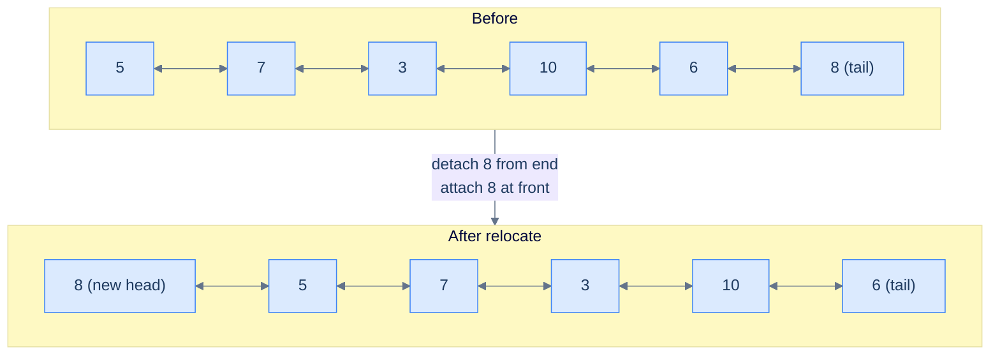

# Relocate node

## The Problem

> Given the **head** of a doubly linked list, write a function to move the last node of the list to the start and return the head of the reordered list.

```
Example 1
  Input:  head = [5, 7, 3, 10, 6, 8]
  Output: [8, 5, 7, 3, 10, 6]
  Reason: The last node (8) is moved to the start.

Example 2
  Input:  head = [5, 7]
  Output: [7, 5]
  Reason: The last node (7) is moved to the start.

Example 3
  Input:  head = [5]
  Output: [5]
  Reason: A single node is both head and tail — nothing to move.
```

<details>
<summary><h2>What Does "Relocate" Mean Here?</h2></summary>


Picture the list as a chain of train cars. Relocate means: detach the last car, walk it to the front, and re-attach it as the new locomotive. Two splices: one at the back (uncouple the last car) and one at the front (couple it on). In a DLL, each "splice" is a forward link plus a mirror.

> 🖼 Diagram — Relocate the last node — split = (head … penultimate, last); merge = concatenate(last, head). Two pointer splices, both with mirror updates.


<p align="center"><strong>Relocate the last node — split = (head … penultimate, last); merge = concatenate(last, head). Two pointer splices, both with mirror updates.</strong></p>

</details>
<details>
<summary><h2>Strategy</h2></summary>


Reorder skeleton: `f1` selects the last node into bucket B and everything else into bucket A. `f2` is "B then A" (concatenate, with B on the left). For DLLs the only twist is the mirror: when we make the last node the new head, its `prev` must become `null`, and the old head's `prev` must point at it.

> **Algorithm**
>
> -   **Step 1:** Walk to the end keeping a `previous` reference. After the loop, `current` is the last node and `previous` is the second-to-last.
> -   **Step 2:** Detach the last node: `previous.next = null`, `current.prev = null`.
> -   **Step 3:** Splice it at the front: `current.next = head`, `head.prev = current`.
> -   **Step 4:** Return `current` as the new head.
> -   **Edge cases:** empty list and single node — return as-is.

</details>
<details>
<summary><h2>Solution &amp; Analysis</h2></summary>

### The Solution

```python run viz=linked-list viz-root=head
from typing import Optional, Tuple

class ListNode:
    def __init__(self, val=0, prev=None, nxt=None):
        self.val = val
        self.prev = prev
        self.next = nxt


def from_list(values):
    if not values:
        return None
    head = ListNode(values[0])
    cur = head
    for v in values[1:]:
        node = ListNode(v, prev=cur)
        cur.next = node
        cur = node
    return head


def to_list(head):
    out = []
    while head is not None:
        out.append(head.val)
        head = head.next
    return out


class Solution:
    def split_last_node(
        self, head: ListNode
    ) -> Tuple[ListNode, ListNode]:
        current = head
        previous = None

        # Traverse the list until the last node is reached
        while current.next is not None:

            # Keep track of the previous node
            previous = current

            # Move to the next node
            current = current.next

        # Disconnect the last node
        if previous is not None:
            previous.next = None

        # Update last node's prev pointer
        if current is not None:
            current.prev = None

        # Return {head of remaining list, last node}
        return head, current

    def merge_last_node(
        self,
        last_node: Optional[ListNode],
        first_node: Optional[ListNode],
    ) -> Optional[ListNode]:

        # If there is no last node, return the first node
        if not last_node:
            return first_node

        # Connect the last node to the first node
        last_node.next = first_node

        # Update the first node's prev pointer
        if first_node is not None:
            first_node.prev = last_node

        return last_node

    def relocate_node(
        self, head: Optional[ListNode]
    ) -> Optional[ListNode]:

        # If the list is empty or contains only one node, no need to
        # modify it
        if not head or not head.next:
            return head

        # Split the last node from the list
        first_node, last_node = self.split_last_node(head)

        # Merge the last node at the front
        return self.merge_last_node(last_node, first_node)


# Examples from the problem statement
head = from_list([5, 7, 3, 10, 6, 8])
print(to_list(Solution().relocate_node(head)))   # [8, 5, 7, 3, 10, 6]

head = from_list([5, 7])
print(to_list(Solution().relocate_node(head)))   # [7, 5]

head = from_list([5])
print(to_list(Solution().relocate_node(head)))   # [5]

# Edge cases
head = from_list([1, 2, 3])
print(to_list(Solution().relocate_node(head)))   # [3, 1, 2]

head = from_list([1, 2, 3, 4, 5])
print(to_list(Solution().relocate_node(head)))   # [5, 1, 2, 3, 4]

head = from_list([9, 9])
print(to_list(Solution().relocate_node(head)))   # [9, 9]

head = from_list([1, 2, 3, 4])
print(to_list(Solution().relocate_node(head)))   # [4, 1, 2, 3]
```

```java run
import java.util.*;

public class Main {
    static class ListNode {
        int val;
        ListNode prev;
        ListNode next;
        ListNode() {}
        ListNode(int val) { this.val = val; }
    }

    static ListNode fromList(int... values) {
        if (values.length == 0) return null;
        ListNode head = new ListNode(values[0]);
        ListNode cur = head;
        for (int i = 1; i < values.length; i++) {
            ListNode node = new ListNode(values[i]);
            node.prev = cur;
            cur.next = node;
            cur = node;
        }
        return head;
    }

    static java.util.List<Integer> toList(ListNode head) {
        java.util.List<Integer> out = new java.util.ArrayList<>();
        while (head != null) { out.add(head.val); head = head.next; }
        return out;
    }

    static class Solution {
        private List<ListNode> splitLastNode(ListNode head) {
            ListNode current = head;
            ListNode previous = null;

            // Traverse the list until the last node is reached
            while (current.next != null) {

                // Keep track of the previous node
                previous = current;

                // Move to the next node
                current = current.next;
            }

            // Disconnect the last node
            if (previous != null) {
                previous.next = null;
            }

            // Update last node's prev pointer
            if (current != null) {
                current.prev = null;
            }

            // Return {head of remaining list, last node}
            return Arrays.asList(head, current);
        }

        private ListNode mergeLastNode(ListNode lastNode, ListNode firstNode) {

            // If there is no last node, return the first node
            if (lastNode == null) {
                return firstNode;
            }

            // Connect the last node to the first node
            lastNode.next = firstNode;

            // Update the first node's prev pointer
            if (firstNode != null) {
                firstNode.prev = lastNode;
            }

            return lastNode;
        }

        public ListNode relocateNode(ListNode head) {

            // If the list is empty or contains only one node, no need to
            // modify it
            if (head == null || head.next == null) {
                return head;
            }

            // Split the last node from the list
            List<ListNode> heads = splitLastNode(head);
            ListNode firstNode = heads.get(0);
            ListNode lastNode = heads.get(1);

            // Merge the last node at the front
            return mergeLastNode(lastNode, firstNode);
        }
    }

    public static void main(String[] args) {
        // Examples from the problem statement
        System.out.println(toList(new Solution().relocateNode(fromList(5, 7, 3, 10, 6, 8))));  // [8, 5, 7, 3, 10, 6]
        System.out.println(toList(new Solution().relocateNode(fromList(5, 7))));                // [7, 5]
        System.out.println(toList(new Solution().relocateNode(fromList(5))));                   // [5]

        // Edge cases
        System.out.println(toList(new Solution().relocateNode(fromList(1, 2, 3))));             // [3, 1, 2]
        System.out.println(toList(new Solution().relocateNode(fromList(1, 2, 3, 4, 5))));       // [5, 1, 2, 3, 4]
        System.out.println(toList(new Solution().relocateNode(fromList(9, 9))));                // [9, 9]
        System.out.println(toList(new Solution().relocateNode(fromList(1, 2, 3, 4))));          // [4, 1, 2, 3]
    }
}
```


<details>
<summary><strong>Trace — head = [5, 7, 3, 10, 6, 8]</strong></summary>

```
Walk to last (split_last_node):
  Step 1 │ current=5, previous=null  → advance
  Step 2 │ current=7, previous=5     → advance
  Step 3 │ current=3, previous=7     → advance
  Step 4 │ current=10, previous=3    → advance
  Step 5 │ current=6, previous=10    → advance
  Step 6 │ current=8 (next is null)  → STOP. previous=6.

Detach last (sever both directions):
  previous(6).next = null     →  5⇄7⇄3⇄10⇄6  +  8 (detached)
  current(8).prev = null      →  node 8 drops its back-link to node 6

Splice at front (merge_last_node — wire both directions):
  last_node(8).next = first_node(5)   →  8 → 5 ⇄ 7 ⇄ 3 ⇄ 10 ⇄ 6
  first_node(5).prev = last_node(8)   →  8 ⇄ 5 ⇄ 7 ⇄ 3 ⇄ 10 ⇄ 6
Result: [8, 5, 7, 3, 10, 6] ✓
```

</details>

### Complexity Analysis

| Metric | Cost | Why |
|---|---|---|
| Time  | **O(N)** | One pass to find the last node. |
| Space | **O(1)** | Two pointer variables; no allocation. |

### Edge Cases

| Case | Example | Expected | Reasoning |
|---|---|---|---|
| Empty list | `[]` | `[]` | `head == null` → return immediately. |
| Single node | `[5]` | `[5]` | `head.next == null` → already at front. |
| Two nodes | `[5, 7]` | `[7, 5]` | Just swap; `previous` stops at the first node. |

</details>

<!-- ============================================== -->
<!-- SWEEP 2 — missing sections (placeholders only) -->
<!-- ============================================== -->

<!-- TODO: Examples — missing, needs to be written -->
<!--       Guidance: min 3 examples: basic / variant / edge -->

<!-- TODO: Intuition — missing, needs to be written -->
<!--       Guidance: 3 paragraphs: brute force / observation / pattern fit -->

<!-- TODO: Applying the Diagnostic Questions — missing, needs to be written -->
<!--       Guidance: REQUIRED, never optional -->
<!--       Guidance: 4-row table. Columns: 'Check' | 'Answer for [Problem Name]' -->
<!--       Guidance: Rows: two positions simultaneously / one near start one near end / both move inward / simple O(1) work at each step -->

<!-- TODO: Approach — missing, needs to be written -->
<!--       Guidance: numbered steps, no code -->

<!-- TODO: Dry Run — missing, needs to be written -->
<!--       Guidance: walk through a small example step by step -->

<!-- TODO: Key Takeaway — missing, needs to be written -->
<!--       Guidance: 1–2 sentences -->
