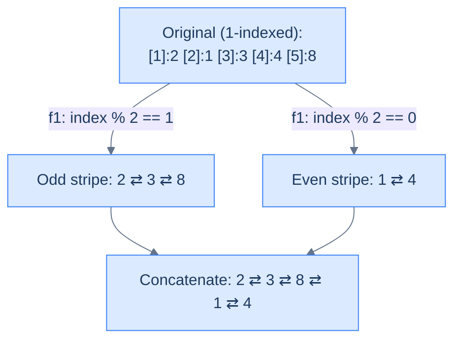

# Parity order

## The Problem

> Given the **head** of a doubly linked list, write a function to group all the nodes that appear at odd indices together, followed by the nodes that appear at even indices, and return the head of the reordered list. **The indices start with `1`.**

```
Example 1
  Input:  head = [2, 1, 3, 4, 8]      // indices: 1 2 3 4 5
  Output: [2, 3, 8, 1, 4]
  Reason: Odd indices (1,3,5) → 2, 3, 8. Even indices (2,4) → 1, 4.

Example 2
  Input:  head = []
  Output: []
  Reason: Empty in, empty out.
```

<details>
<summary><h2>What Does "Parity Order" Mean?</h2></summary>


Imagine numbering the nodes from 1 at the head. The **odd-indexed** nodes (positions 1, 3, 5, …) form one stripe; the **even-indexed** nodes (2, 4, 6, …) form the other. Parity order means: stripe-1 first, then stripe-2, in their original relative order.

> 🖼 Diagram — Parity order — split by index parity, concatenate odd stripe before even stripe. The reorder skeleton with f1 = counter is odd and f2 = simple concat.


<p align="center"><strong>Parity order — split by index parity, concatenate odd stripe before even stripe. The reorder skeleton with <code>f1 = counter is odd</code> and <code>f2 = simple concat</code>.</strong></p>

</details>
<details>
<summary><h2>Strategy</h2></summary>


This is the canonical reorder skeleton. `f1(node) = (counter % 2 == 1)`. `f2` is just concatenation. The only DLL-specific touch is wiring `prev` on every append and on the final concat join.

> **Algorithm**
>
> -   **Step 1:** Split — walk the list with a 1-based counter. Append each node to `oddDummy`'s tail or `evenDummy`'s tail based on `counter % 2`. Mirror `prev` on every append.
> -   **Step 2:** Terminate both sub-lists; null out the `prev` of each head.
> -   **Step 3:** Concatenate — `oddTail.next = evenHead; evenHead.prev = oddTail`.
> -   **Step 4:** Return `oddHead`.

</details>
<details>
<summary><h2>Solution &amp; Analysis</h2></summary>

### The Solution

```python run viz=linked-list viz-root=head
from typing import Optional, Tuple

class ListNode:
    def __init__(self, val=0, prev=None, nxt=None):
        self.val = val
        self.prev = prev
        self.next = nxt


def from_list(values):
    if not values:
        return None
    head = ListNode(values[0])
    cur = head
    for v in values[1:]:
        node = ListNode(v, prev=cur)
        cur.next = node
        cur = node
    return head


def to_list(head):
    out = []
    while head is not None:
        out.append(head.val)
        head = head.next
    return out


class Solution:
    def split_by_parity(
        self, head: Optional[ListNode]
    ) -> Tuple[Optional[ListNode], Optional[ListNode]]:

        # Initialize head and tail references for the two split lists
        odd_dummy = ListNode(0)
        odd_tail = odd_dummy

        even_dummy = ListNode(0)
        even_tail = even_dummy

        # Create current reference to iterate through the list
        current = head

        # To track alternate positions
        counter = 1

        # Iterate through the list and split nodes into two lists
        while current:

            # If the counter is odd then the node goes to the odd list
            if counter % 2 == 1:

                # `current` node goes to the odd split list
                odd_tail.next = current
                current.prev = odd_tail
                odd_tail = odd_tail.next

            # Otherwise, the node goes to the even list
            else:

                # `current` node goes to the even split list
                even_tail.next = current
                current.prev = even_tail
                even_tail = even_tail.next

            # Move to the next node in the original list
            current = current.next
            counter += 1

        # Terminate the odd list from the beginning and end
        if odd_dummy.next is not None:
            odd_dummy.next.prev = None
        odd_tail.next = None

        # Terminate the even list from the beginning and end
        if even_dummy.next is not None:
            even_dummy.next.prev = None
        even_tail.next = None

        return odd_dummy.next, even_dummy.next

    def merge_odd_and_even_lists(
        self, odd_head: Optional[ListNode], even_head: Optional[ListNode]
    ) -> Optional[ListNode]:

        # If the odd list is empty return the even list
        if not odd_head:
            return even_head

        # If the even list is empty return the odd list
        if not even_head:
            return odd_head

        # Traverse to the end of the odd list
        current = odd_head
        while current.next:
            current = current.next

        # Connect the even list at the end of the odd list
        current.next = even_head
        even_head.prev = current

        return odd_head

    def parity_order(
        self, head: Optional[ListNode]
    ) -> Optional[ListNode]:

        # If the list is empty or contains only one node, no splitting is
        # necessary
        if not head or not head.next:
            return head

        # Split the list into odd and even lists
        odd_head, even_head = self.split_by_parity(head)

        # Append the  even list at the end of the odd list and
        # return the head of the merged list
        return self.merge_odd_and_even_lists(odd_head, even_head)


# Examples from the problem statement
head = from_list([2, 1, 3, 4, 8])
print(to_list(Solution().parity_order(head)))   # [2, 3, 8, 1, 4]

head = from_list([])
print(to_list(Solution().parity_order(head)))   # []

# Edge cases
head = from_list([1])
print(to_list(Solution().parity_order(head)))   # [1]

head = from_list([1, 2])
print(to_list(Solution().parity_order(head)))   # [1, 2]

head = from_list([1, 2, 3])
print(to_list(Solution().parity_order(head)))   # [1, 3, 2]

head = from_list([1, 2, 3, 4])
print(to_list(Solution().parity_order(head)))   # [1, 3, 2, 4]

head = from_list([5, 5, 5, 5, 5])
print(to_list(Solution().parity_order(head)))   # [5, 5, 5, 5, 5]

head = from_list([1, 2, 3, 4, 5, 6])
print(to_list(Solution().parity_order(head)))   # [1, 3, 5, 2, 4, 6]
```

```java run
import java.util.*;

public class Main {
    static class ListNode {
        int val;
        ListNode prev;
        ListNode next;
        ListNode() {}
        ListNode(int val) { this.val = val; }
    }

    static ListNode fromList(int... values) {
        if (values.length == 0) return null;
        ListNode head = new ListNode(values[0]);
        ListNode cur = head;
        for (int i = 1; i < values.length; i++) {
            ListNode node = new ListNode(values[i]);
            node.prev = cur;
            cur.next = node;
            cur = node;
        }
        return head;
    }

    static java.util.List<Integer> toList(ListNode head) {
        java.util.List<Integer> out = new java.util.ArrayList<>();
        while (head != null) { out.add(head.val); head = head.next; }
        return out;
    }

    static class Solution {
        private List<ListNode> splitByParity(ListNode head) {

            // Initialize head and tail references for the two split lists
            ListNode oddDummy = new ListNode(0);
            ListNode oddTail = oddDummy;

            ListNode evenDummy = new ListNode(0);
            ListNode evenTail = evenDummy;

            // Create current reference to iterate through the list
            ListNode current = head;

            // To track alternate positions
            int counter = 1;

            // Iterate through the list and split nodes into two lists
            while (current != null) {

                // If the counter is odd then the node goes to the odd list
                if (counter % 2 == 1) {

                    // `current` node goes to the odd split list
                    oddTail.next = current;
                    current.prev = oddTail;
                    oddTail = oddTail.next;
                }

                // Otherwise, the node goes to the even list
                else {

                    // `current` node goes to the even split list
                    evenTail.next = current;
                    current.prev = evenTail;
                    evenTail = evenTail.next;
                }

                // Move to the next node in the original list
                current = current.next;
                counter++;
            }

            // Terminate the odd list from the beginning and end
            if (oddDummy.next != null) {
                oddDummy.next.prev = null;
            }
            oddTail.next = null;

            // Terminate the even list from the beginning and end
            if (evenDummy.next != null) {
                evenDummy.next.prev = null;
            }
            evenTail.next = null;

            return Arrays.asList(oddDummy.next, evenDummy.next);
        }

        private ListNode mergeOddAndEvenLists(
            ListNode oddHead,
            ListNode evenHead
        ) {

            // If the odd list is empty return the even list
            if (oddHead == null) {
                return evenHead;
            }

            // If the even list is empty return the odd list
            if (evenHead == null) {
                return oddHead;
            }

            // Traverse to the end of the odd list
            ListNode current = oddHead;
            while (current.next != null) {
                current = current.next;
            }

            // Connect the even list at the end of the odd list
            current.next = evenHead;
            evenHead.prev = current;

            return oddHead;
        }

        public ListNode parityOrder(ListNode head) {

            // If the list is empty or contains only one node, no splitting
            // is necessary
            if (head == null || head.next == null) {
                return head;
            }

            // Split the list into odd and even lists
            List<ListNode> heads = splitByParity(head);
            ListNode oddHead = heads.get(0);
            ListNode evenHead = heads.get(1);

            // Append the  even list at the end of the odd list and
            // return the head of the merged list
            return mergeOddAndEvenLists(oddHead, evenHead);
        }
    }

    public static void main(String[] args) {
        // Examples from the problem statement
        System.out.println(toList(new Solution().parityOrder(fromList(2, 1, 3, 4, 8))));   // [2, 3, 8, 1, 4]
        System.out.println(toList(new Solution().parityOrder(fromList())));                // []

        // Edge cases
        System.out.println(toList(new Solution().parityOrder(fromList(1))));               // [1]
        System.out.println(toList(new Solution().parityOrder(fromList(1, 2))));            // [1, 2]
        System.out.println(toList(new Solution().parityOrder(fromList(1, 2, 3))));         // [1, 3, 2]
        System.out.println(toList(new Solution().parityOrder(fromList(1, 2, 3, 4))));      // [1, 3, 2, 4]
        System.out.println(toList(new Solution().parityOrder(fromList(5, 5, 5, 5, 5))));   // [5, 5, 5, 5, 5]
        System.out.println(toList(new Solution().parityOrder(fromList(1, 2, 3, 4, 5, 6)))); // [1, 3, 5, 2, 4, 6]
    }
}
```


<details>
<summary><strong>Trace — head = [2, 1, 3, 4, 8]</strong></summary>

```
Split (counter starts at 1) — each append wires tail.next AND current.prev:
  Step 1 │ counter=1, val=2 │ odd_tail.next=2,  2.prev=odd_tail  │ odd:  2
  Step 2 │ counter=2, val=1 │ even_tail.next=1, 1.prev=even_tail │ even: 1
  Step 3 │ counter=3, val=3 │ odd_tail.next=3,  3.prev=odd_tail  │ odd:  2 ⇄ 3
  Step 4 │ counter=4, val=4 │ even_tail.next=4, 4.prev=even_tail │ even: 1 ⇄ 4
  Step 5 │ counter=5, val=8 │ odd_tail.next=8,  8.prev=odd_tail  │ odd:  2 ⇄ 3 ⇄ 8

Terminate lists (null the head's prev, null the tail's next):
  odd:  2 ⇄ 3 ⇄ 8   (odd_dummy.next.prev = None; odd_tail.next = None)
  even: 1 ⇄ 4       (even_dummy.next.prev = None; even_tail.next = None)

Concat (merge_odd_and_even_lists — wire both directions):
  walk odd to 8.   8.next = 1;  1.prev = 8.
Result: [2, 3, 8, 1, 4] ✓
```

</details>

> *Friction prompt — predict before reading on: in the `merge_odd_and_even_lists` helper, what bug exists in the original singly-style code if `evenHead` is null but `oddHead` is not? Trace what `current.next = evenHead` does in that case.*

(Answer: nothing wrong — the early returns at the top guard against both being null. But notice we DON'T need to traverse to find `oddTail` here either; in real production code we'd just keep the `oddTail` reference from the split phase and skip the walk. The walk here is for clarity, not necessity.)

### Complexity Analysis

| Metric | Cost | Why |
|---|---|---|
| Time  | **O(N)** | One split pass + one walk to concat. |
| Space | **O(1)** | Two dummies and a fixed number of pointers. |

### Edge Cases

| Case | Example | Expected | Reasoning |
|---|---|---|---|
| Empty | `[]` | `[]` | Guard at top returns immediately. |
| Single node | `[5]` | `[5]` | One node is at index 1 — already in odd stripe alone. |
| Two nodes | `[5, 7]` | `[5, 7]` | Already partitioned: 5 odd, 7 even. |
| All odd-length | `[1,2,3]` | `[1, 3, 2]` | Odd stripe gets 2 nodes, even gets 1. |

</details>

<!-- ============================================== -->
<!-- SWEEP 2 — missing sections (placeholders only) -->
<!-- ============================================== -->

<!-- TODO: Examples — missing, needs to be written -->
<!--       Guidance: min 3 examples: basic / variant / edge -->

<!-- TODO: Intuition — missing, needs to be written -->
<!--       Guidance: 3 paragraphs: brute force / observation / pattern fit -->

<!-- TODO: Applying the Diagnostic Questions — missing, needs to be written -->
<!--       Guidance: REQUIRED, never optional -->
<!--       Guidance: 4-row table. Columns: 'Check' | 'Answer for [Problem Name]' -->
<!--       Guidance: Rows: two positions simultaneously / one near start one near end / both move inward / simple O(1) work at each step -->

<!-- TODO: Approach — missing, needs to be written -->
<!--       Guidance: numbered steps, no code -->

<!-- TODO: Dry Run — missing, needs to be written -->
<!--       Guidance: walk through a small example step by step -->

<!-- TODO: Key Takeaway — missing, needs to be written -->
<!--       Guidance: 1–2 sentences -->
