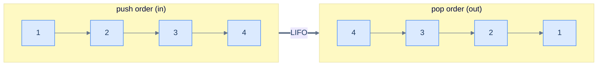
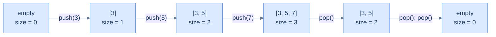

# 1. Introduction to Stacks

## The Hook

You hit Ctrl-Z. The last word you typed disappears. Hit it again — the previous word is back. Again — the punctuation you'd just changed reverts. Each press undoes *exactly the most recent* thing, and never anything else. The first word you typed today is still safely behind every other change, waiting at the very bottom of the pile, accessible only after every later change has been undone.

That ordered "most recent first" behaviour is everywhere in computing once you start looking. Your browser's **back** button. Your editor's **undo** stack. The **call stack** the CPU uses to remember which function called which. The bracket matcher in your IDE. Function-return addresses. Recursion itself. Every one of them is the same idea wearing a different costume: **last in, first out** — *LIFO*.

The data structure that makes all of these work is called, fittingly, a **stack**. It's so simple it feels like cheating: a container that lets you add to one end (the **top**) and remove from one end (the same top), and that's it. No "insert in the middle". No "remove from the back". No "search by index". Just push and pop. Out of those two operations falls a *cascade* of programs that would be a nightmare to write any other way.

This is the easiest data structure in the entire course, and the one whose ideas — *recency matters, deferred work belongs on a stack, the most-recent thing has the highest priority* — surface in more interview questions, parser implementations, and CPU architectures than almost any other. Master it cold; the next ten lessons will weaponise it.

---

## Table of contents

1. [Understanding the problem](#understanding-the-problem)
2. [Exploring a possible solution](#exploring-a-possible-solution)
3. [Key properties of a stack](#key-properties-of-a-stack)
4. [Overview of supported operations](#overview-of-supported-operations)
5. [Internal mechanics](#internal-mechanics)
6. [Working example](#working-example)
7. [Edge cases and pitfalls](#edge-cases-and-pitfalls)
8. [Production reality](#production-reality)
9. [Quiz](#quiz)
10. [Practice ladder](#practice-ladder)
11. [Further reading](#further-reading)
12. [Cross-links](#cross-links)
13. [Final takeaway](#final-takeaway)

***

# Understanding the problem

Some problems demand that data be processed in **reverse order of arrival**. Whatever went in last must come out first; whatever went in first waits until everything above it has been dealt with. The technical name is **Last In, First Out (LIFO)** — sometimes equivalently called **First In, Last Out (FILO)**. The two names mean the same thing; they emphasise different ends of the same rule.



<p align="center"><strong>LIFO in one picture — items 1, 2, 3, 4 went in <em>in that order</em>; they come out in the <em>reverse</em> order. The most recent insertion is always the next one out.</strong></p>

> **Last In, First Out (LIFO)** — also called **First In, Last Out (FILO)** — is a discipline of processing data in the reverse order of insertion. The item added last is the first one removed.

Why does anyone need this? Three real-world examples that almost certainly run on your computer right now.

## Web browsers

The **back** button is a LIFO machine. Every time you click a link, the new page is pushed onto a hidden stack of "places I've been". Every time you click *back*, the top page is popped off and you land on the previous one. Click *back* again — pop again. The pages return in the *exact reverse* of the order in which you visited them.

```d2
direction: right

before: "after visiting home → blog → article" {
  grid-rows: 3
  grid-gap: 0
  s0: "article ← top"
  s1: "blog"
  s2: "home ← bot"
}

after: "after one click of back" {
  grid-rows: 2
  grid-gap: 0
  t0: "blog ← top"
  t1: "home ← bot"
}

before -> after: "pop"
```

<p align="center"><strong>Web browser history — every page visit is a push; every <em>back</em> click is a pop. The most recently visited page is always at the top, and that's exactly the page <em>back</em> needs to return.</strong></p>

## Text editors

Ctrl-Z is the same machine in disguise. Every keystroke you make pushes a "what changed" record onto an undo stack. Every Ctrl-Z pops the most recent record and reverts that change. You can't skip backwards over recent edits to undo something from five minutes ago without first undoing everything since — exactly the LIFO contract.

```d2
direction: right

stk: "undo stack" {
  grid-rows: 4
  grid-gap: 0
  e0: "typed '!' ← top"
  e1: "typed 'world'"
  e2: "typed 'hello'"
  e3: "opened file ← bot"
}

after: "top now: typed 'world'" {
  shape: text
}

stk -> after: "Ctrl-Z pops 'typed !'"
```

<p align="center"><strong>Text editor undo — every action is a push; <em>Ctrl-Z</em> is a pop. The very first action of the session sits at the bottom and only surfaces after everything above it is undone.</strong></p>

## Nested function calls

The deepest example of all. When function `A` calls function `B`, and `B` calls function `C`, the CPU has to remember to return to `B` after `C` finishes, and to `A` after `B` finishes. That memory is kept on **the call stack** — a real, hardware-supported stack of "where to go next". Each `call` instruction pushes a return address; each `ret` pops one. Recursion, exception handling, async-await unwinding — all of it sits on top of this one structure.

```d2
call: "call stack while inside C()" {
  grid-rows: 3
  grid-gap: 0
  f0: "C() ← top (currently executing)"
  f1: "B()"
  f2: "A() ← bot (root caller)"
}

note: |md
  When C returns, B resumes (top is popped).

  When B returns, A resumes.

  Same machine, different costume.
|

note -> call: "" {style.stroke-dash: 3}
```

<p align="center"><strong>The call stack — every function call is a push; every <em>return</em> is a pop. The CPU literally uses a register (<code>rsp</code> on x86-64) that points to the top of this stack. Every program you run, in every language, leans on this.</strong></p>

These three are tip-of-the-iceberg examples. Bracket matching, expression evaluation, depth-first traversal, infinite undo, history navigation, parser stacks, the JVM operand stack — once you spot the pattern, you'll see it weekly. The data structure that makes all of them tractable is the **stack**.

***

# Exploring a possible solution

A stack is a **linear container** with one ruthless restriction: data may be added or removed only at **one end**. That end is called the *top*. The opposite end (the *bottom*) is sealed — you cannot read it, modify it, or even reach it without first emptying everything above. The restriction is what *creates* the LIFO property; without it, we'd have a list, not a stack.

## Stack of plates

The image is right there in the kitchen. A stack of clean plates on a countertop:

- You place new plates **on top**. (push)
- You take plates **from the top**. (pop)
- You can't slide a plate out of the middle without lifting everything above it. (no random access)

```d2
plates: stack of plates {
  grid-rows: 5
  grid-gap: 0
  p5: "plate 5 ← top (last placed)" {style.fill: "#fef9c3"; style.stroke: "#f59e0b"}
  p4: "plate 4"
  p3: "plate 3"
  p2: "plate 2"
  p1: "plate 1 ← bottom (first placed)"
}
```

<p align="center"><strong>A stack of plates follows the LIFO rule by physical necessity — gravity makes the top accessible and the bottom unreachable. The data-structure version of a stack enforces the same restriction by design.</strong></p>

The kitchen analogy is more than cute — it predicts every property of the data structure. The plate placed last is the one in your hand. To get to the plate at the bottom, you have to go through every plate above it. Add a plate, the stack gets taller; remove one, the stack gets shorter. We're going to translate every one of those facts into code.

## Stack data structure

A **stack** is a linear data structure that stores items in an ordered sequence and permits two operations on them: **push** (add to top) and **pop** (remove from top). Auxiliary read-only operations (peek at the top, ask for the size) are conventional but neither inserts nor reorders the data. The whole interface fits on the back of a napkin.

```d2
direction: right

push: "push(7)" { shape: oval }
pop: "pop() → 7" { shape: oval }
peek: "peek() → 7" { shape: oval }
size: "size() → 1" { shape: oval }

stk: "stack [3, 5, 7] (top is right)" {
  grid-columns: 3
  grid-gap: 0
  b: "3"
  m: "5"
  t: "7 ← top" {style.fill: "#fef9c3"; style.stroke: "#f59e0b"}
}

push -> stk
pop -> stk
peek -> stk
size -> stk
```

<p align="center"><strong>Stack interface in one diagram — only <code>push</code> changes the data; <code>pop</code> changes data and returns the removed item; <code>peek</code> and <code>size</code> just inspect. Four operations, total.</strong></p>

A stack is conventionally drawn vertically, with the top at the *top* of the page to match the kitchen analogy. In code you'll see it stored as a horizontal array where the *last index* is the top. The orientation is only notation; the LIFO contract is identical either way.

```d2
arr: stack as array {
  grid-columns: 4
  grid-gap: 0
  v0: |md
    **3**

    `0`
  |
  v1: |md
    **5**

    `1`
  |
  v2: |md
    **7**

    `2`
  |
  v3: |md
    **9 ← top**

    `3`
  | {style.fill: "#fef9c3"; style.stroke: "#f59e0b"}
}
```

<p align="center"><strong>Same stack laid out as an array — the rightmost element is the top. <code>push(11)</code> would extend the array to index 4; <code>pop()</code> would shrink it back to index 2.</strong></p>

> *Predict before reading on — if "the top is just the last element of an array", what's the time complexity of push and pop on a dynamic-array-backed stack? And what's the cost of <em>peeking</em> at the bottom of the stack?*
>
> Push and pop are amortised `O(1)` time and `O(1)` space — appending to the end of a dynamic array and removing from the end are both constant-time on average. Peeking at the *bottom* is `O(1)` too in principle (read index `0`), but it is *not part of the stack interface* — the data structure refuses to expose it. The restriction is what makes it a stack.

***

# Key properties of a stack

A stack has three quantities worth naming. None of them surprise you after the kitchen analogy.

## Capacity

The stack's **capacity** is the maximum number of items it can hold. Two flavours:

- **Bounded** stack — capacity is fixed at construction. Pushing onto a full bounded stack is an error (often called *stack overflow* — yes, that's where the website name comes from).
- **Unbounded** stack — capacity grows on demand, limited only by available memory. Most language standard-library stacks are unbounded.

```d2
direction: right

bnd: "bounded stack — capacity 4" {
  grid-rows: 5
  grid-gap: 0
  b3: "[3] 9 ← top"
  b2: "[2] 7"
  b1: "[1] 5"
  b0: "[0] 3"
  cap: "push next → OVERFLOW" {style.fill: "#fee2e2"; style.stroke: "#ef4444"}
}

unb: "unbounded stack — capacity = memory" {
  grid-rows: 5
  grid-gap: 0
  u3: "..."
  u2: "[2] 7"
  u1: "[1] 5"
  u0: "[0] 3"
  cap: "push next → grow & continue" {style.fill: "#dcfce7"; style.stroke: "#16a34a"}
}
```

<p align="center"><strong>Bounded vs. unbounded — bounded stacks reject overflow; unbounded stacks lazily expand. The choice depends on whether the upper bound is known and whether you can afford the resize cost. Most container library stacks (<code>std::stack</code>, Java <code>Deque</code>, Python <code>list</code>) are unbounded.</strong></p>

## Size

The **size** is the number of items currently in the stack. It's bounded above by the capacity. Push increments it by 1; pop decrements it by 1; size is independent of the type or value of the data inside.

A size of zero means the stack is **empty**. Calling `pop` or `peek` on an empty stack is a programming error in most implementations — you must check `size > 0` (or `isEmpty()`) first.



<p align="center"><strong>Size tracks the number of items — it goes up on push, down on pop. <code>size == 0</code> is the canonical "empty" check; pop on empty is undefined and must be guarded against.</strong></p>

## Top

The **top** is the most recently inserted item — the only item the stack will let you read or remove. If the stack is empty, the top is undefined.

The top is what makes a stack a stack. Every operation, without exception, manipulates the top: push *creates* a new top; pop *removes* the current top; peek *reports* the current top.

```d2
stk: stack {
  grid-rows: 4
  grid-gap: 0
  t1: "9 ← top" {style.fill: "#fef9c3"; style.stroke: "#f59e0b"}
  t2: "7"
  t3: "5"
  t4: "3 ← bot"
}
```

<p align="center"><strong>The top is the only window into a stack — every operation is defined relative to it. The bottom exists, but the data structure deliberately gives no way to reach it directly.</strong></p>

***

# Overview of supported operations

A stack exposes a tiny, sharp interface. Two **mutators** (push, pop) and two **inspectors** (size, peek). That's the whole API. Whole books on parser theory, expression evaluation, and graph algorithms are built on these four operations.

## Push

`push(x)` adds `x` to the top of the stack. The size increases by 1. `x` becomes the new top.

```d2
direction: right

before: "before push(9)" {
  grid-rows: 3
  grid-gap: 0
  b1: "7 ← top"
  b2: "5"
  b3: "3 ← bot"
}

after: "after push(9)" {
  grid-rows: 4
  grid-gap: 0
  a1: "9 ← top" {style.fill: "#dcfce7"; style.stroke: "#22c55e"}
  a2: "7"
  a3: "5"
  a4: "3 ← bot"
}

before -> after: "push(9)"
```

<p align="center"><strong>Push — the new item lands on top, and the stack's size grows by one. Everything that was already in the stack stays where it was; only the top moves.</strong></p>

> **Why doesn't a stack support insertion in the middle, like a linked list?**
>
> Because the *whole point* of a stack is the LIFO contract. The moment you allow "insert at position k", you have a list, not a stack. The restriction isn't a missing feature — it's the feature. It's what guarantees that the next pop returns the most recent push, and what lets every algorithm built on a stack rely on that guarantee.

## Pop

`pop()` removes and returns the item at the top. The size decreases by 1. The previous second-from-top becomes the new top.

```d2
direction: right

before: "before pop()" {
  grid-rows: 4
  grid-gap: 0
  b1: "9 ← top" {style.fill: "#fee2e2"; style.stroke: "#ef4444"}
  b2: "7"
  b3: "5"
  b4: "3 ← bot"
}

after: "after pop() → 9" {
  grid-rows: 3
  grid-gap: 0
  a1: "7 ← top"
  a2: "5"
  a3: "3 ← bot"
}

before -> after: "pop()"
```

<p align="center"><strong>Pop — removes and returns the top item. Calling <code>pop()</code> on an empty stack is an error; always check <code>size > 0</code> first.</strong></p>

> **Why doesn't a stack support removing from the middle?**
>
> Same reason as push — the LIFO contract demands that the *only* removable item is the most recent one. Allowing arbitrary removal turns a stack into a deque or list. Production stacks deliberately refuse the operation to *prevent* well-meaning callers from breaking algorithms that rely on the LIFO order.

## Size

`size()` returns the number of items currently on the stack. It is always `O(1)` time and `O(1)` space — implementations maintain a counter that push and pop keep up to date.

```d2
direction: right

stk: "[3, 5, 7]" { shape: oval }
res: "3" { shape: oval; style.fill: "#dcfce7"; style.stroke: "#22c55e" }

stk -> res: "size()"
```

<p align="center"><strong>Size — a constant-time read. Mostly used as the predicate for <code>isEmpty()</code> (size == 0) or for guarding pop/peek calls (size &gt; 0).</strong></p>

## Top (peek)

`peek()` (sometimes `top()`) returns the value at the top **without removing it**. Useful when you want to look at the most recent item but aren't ready to consume it yet — pattern-matching parsers do this constantly.

```d2
direction: right

stk: "[3, 5, 7, 9]" { shape: oval }
res: "9" { shape: oval; style.fill: "#dcfce7"; style.stroke: "#22c55e" }

stk -> res: "peek()"
note: "stack is unchanged after peek" {shape: text}
note -> stk: "" {style.stroke-dash: 3}
```

<p align="center"><strong>Peek — returns the top without removing it. The stack is still <code>[3, 5, 7, 9]</code> after the call. <code>pop</code> = peek + remove; sometimes you only need the peek.</strong></p>

> **Why doesn't a stack support traversal, like a linked list?**
>
> A stack and a linked list serve different purposes. A linked list is a *sequence* — its job is to expose every element in order. A stack is a *workspace* — its job is to remember which item to deal with next. Iterating over a stack would violate the abstraction the data structure is selling: that the only meaningful element is the top. (In practice, some standard libraries *do* let you iterate a stack — for debugging — but the algorithms you'll write on top of stacks should never rely on it.)

***

# Internal Mechanics

A stack is not a primitive type — it is an *interface* layered over a storage structure, and the storage is almost always one of two things: a dynamic array or a singly linked list. The LIFO contract is identical in both; only the bookkeeping differs. Two facts about that bookkeeping explain why the interface stays `O(1)` no matter which backing you pick:

- **Array-backed stack** — one buffer plus a single integer, the `topIndex`. The index starts at `-1` for an empty stack and always points at the current top. `push` increments `topIndex`, then writes the value at that slot; `pop` reads the slot at `topIndex`, then decrements. The current size is `topIndex + 1`, so a separate size field is redundant. Both operations touch one array slot and one integer — `O(1)` time, `O(1)` extra space.
- **Linked-list-backed stack** — a chain of heap nodes plus a single `head` reference that *is* the top. `push` allocates a node, points its `next` at the old head, and reassigns `head`; `pop` reads `head.val`, then advances `head` to `head.next`. No element ever moves, so even the worst case is `O(1)` time — but each node pays one pointer of overhead and one allocator round-trip.

The array version is the more revealing one, because it shows why the bottom is unreachable by design rather than by accident. The data lives between index `0` and `topIndex`; anything past `topIndex` is stale and gets overwritten on the next push, so a popped value is never explicitly cleared. To reach the bottom you would have to read index `0` directly — which the interface refuses to expose, precisely so that no caller can depend on it.

To make this concrete: start with an array-backed stack of capacity `4` and `topIndex = -1`. `push(3)` sets `topIndex = 0` and writes `3`. `push(5)` sets `topIndex = 1` and writes `5`. `push(7)` sets `topIndex = 2`. Now `pop()` reads `arr[2]` (returns `7`) and sets `topIndex = 1`. The `7` is still physically in `arr[2]`, but it is no longer part of the stack — the next `push` will clobber it.

So the key idea is: a stack is a discipline imposed on ordinary storage, not a new kind of storage. One integer index (array) or one head pointer (linked list) is the entire state that turns a buffer or a chain into a LIFO container, and that single piece of state is what keeps every operation `O(1)`.

---

## Key Takeaway

A stack is an interface over a dynamic array or a singly linked list. A single piece of state — the `topIndex` for an array, the `head` pointer for a linked list — is all that distinguishes the top from everything beneath it. That one variable is why push, pop, peek, and size are all `O(1)`.

***

# Working Example

Trace an array-backed stack through one full life cycle — empty, three pushes, a peek, two pops — and watch the `topIndex` carry the entire story.

**Step 1 — start empty.** The backing array has capacity `4`; every slot is unused and `topIndex = -1`. The size is `topIndex + 1 = 0`, so `isEmpty()` returns `true`. Any `pop()` or `peek()` here is a programming error and must be guarded against.

**Step 2 — `push(3)`.** Increment `topIndex` to `0`, then write `3` into `arr[0]`. The stack is now `[3]`, the top is `3`, and the size is `1`. Cost: one integer increment and one array write — `O(1)` time, `O(1)` space.

**Step 3 — `push(5)` then `push(7)`.** Each push repeats the same two motions. After `push(5)`: `topIndex = 1`, `arr[1] = 5`, stack `[3, 5]`. After `push(7)`: `topIndex = 2`, `arr[2] = 7`, stack `[3, 5, 7]`. The top is now `7`, the size is `3`, and the bottom value `3` has not moved since step 2.

**Step 4 — `peek()`.** Read `arr[topIndex]`, which is `arr[2] = 7`, and return it *without* touching `topIndex`. The stack is unchanged: still `[3, 5, 7]`, size still `3`. This is the only difference between `peek` and `pop` — `peek` reads, `pop` reads *and* shrinks.

**Step 5 — `pop()` twice.** The first `pop()` reads `arr[2]` (returns `7`) and decrements `topIndex` to `1`; the stack is `[3, 5]`. The second `pop()` reads `arr[1]` (returns `5`) and decrements `topIndex` to `0`; the stack is `[3]`. Each pop returns the most recently pushed survivor — `7` before `5` — which is the LIFO contract made literal.

> 🖼 Diagram — TODO: 6-frame trace of an array-backed stack (capacity 4) — empty (topIndex = -1), after push(3)/push(5)/push(7), after peek (unchanged), after two pops — with topIndex highlighted in every frame.

The core insight is: the `topIndex` is the whole machine. Every push moves it up one and writes; every pop reads and moves it down one; peek reads without moving it; size is one plus its value. Trace those four rules on any input and you can predict the stack's state at every step.

---

## Key Takeaway

The full life cycle is push (increment then write), peek (read only), pop (read then decrement), with size derived as `topIndex + 1` throughout. Master the index arithmetic on a four-element array and the same logic scales to any stack you will ever implement.

***

# Edge Cases and Pitfalls

Almost every stack bug is one of two mistakes: operating on an empty stack, or overflowing a bounded one. Both come from forgetting that the top is the *only* legal point of access and that it may not exist. Train your eye to check the boundary before every read.

- **Pop or peek on an empty stack.** When `topIndex == -1` (array) or `head == null` (linked list), there is no top to return. Reading `arr[topIndex]` indexes `arr[-1]`; dereferencing a null `head` faults. Guard every `pop`/`peek` with an `isEmpty()` check — some implementations return a sentinel like `-1`, others throw, but none may read a non-existent top.
- **Overflow on a bounded stack.** A fixed-capacity stack is full when `topIndex == capacity - 1`. Pushing anyway writes past the buffer — undefined behaviour in C, an `IndexOutOfBounds` exception in Java, silent corruption elsewhere. Check fullness before every push, or use an unbounded stack that resizes instead.
- **The resize hides an `O(n)` push.** An unbounded array-backed stack is amortised `O(1)` per push, but the occasional growth step copies all `n` elements into a larger buffer — that single push is `O(n)` time and allocates `O(n)` new space. Fine on average; a problem under a hard real-time deadline, where a linked-list stack's worst-case `O(1)` push is safer.
- **Assuming popped data is erased.** An array-backed `pop` typically only decrements `topIndex`; the value still sits in the slot until the next push overwrites it. If the stack holds references to large objects or secrets, the stale slot pins that memory (a leak) or leaves sensitive data readable. Null the slot explicitly when that matters.
- **Reaching for the bottom or the middle.** The interface exposes only the top — by design. Code that wants "the element under the top" or "the third item down" is using the wrong structure; that desire is the signal to reach for an array or a deque instead. Forcing it by popping into a temporary buffer and pushing back is `O(n)` and a sign the abstraction is being abused.
- **Forgetting LIFO reverses order.** Pushing a sequence and popping it returns the sequence *reversed*. This surprises people who expect first-in-first-out — that is a queue, not a stack. The reversal is a feature when you want it (string reversal, backtracking) and a bug when you did not.

So the key idea is: before any `pop` or `peek`, ask "is there a top?"; before any `push`, ask "is there room?". Empty and full are the two states where the top is undefined or unavailable, and every classic stack bug lives in skipping one of those two checks.

***

# Production Reality

Stacks are everywhere a system needs to remember "deal with the most recent thing first" — deferred work, nesting, and reversal all reduce to a stack. The places below are worth knowing by name.

**[The CPU call stack]** — uses **a hardware-supported stack of activation records, addressed by the stack-pointer register (`rsp` on x86-64)** — because every function `call` must push a return address and every `ret` must pop it in `O(1)`, and nesting is strictly last-called-first-returned.

**[The JVM operand stack]** — uses **a per-frame evaluation stack inside each method invocation** — because bytecode is stack-based: instructions push operands and pop results, so expression evaluation needs `O(1)` push/pop with no register allocation.

**[Compilers and parsers]** — uses **an explicit stack for bracket matching and shift-reduce parsing** — because nested constructs (`(`, `[`, `{`, opening tags) must be closed in reverse order, which is exactly the LIFO contract.

**[Editor undo/redo]** — uses **two stacks of edit deltas** — because undo must revert the *most recent* change first, and redo replays from the other stack, each step an `O(1)` push or pop.

**[Browser back navigation]** — uses **a stack of visited page entries** — because *back* always returns the most recently visited page, and pushing each visit keeps the history in `O(1)` per click.

**[Depth-first traversal]** — uses **an explicit stack (or the recursion call stack) of nodes to visit** — because DFS must fully explore the most recently discovered branch before backtracking, which a stack enforces by construction.

***

# Quiz

Test your grip before moving on. Commit to an answer before revealing it.

**[Recall] Q: What two operations define a stack, and at which end do they act?**
`push` adds an item to the top and `pop` removes the item from the top — both act at the same single end, which is what creates the LIFO order.

**[Recall] Q: In an array-backed stack, what value does `topIndex` hold when the stack is empty, and how is the size derived?**
`topIndex` holds `-1` when empty, and the size is always `topIndex + 1`, so no separate size field is needed.

**[Reasoning] Q: Why are push and pop `O(1)` time on both an array-backed and a linked-list-backed stack?**
Both operate only at one end — the array touches the slot at `topIndex` and a linked list touches the `head` node — so no element ever shifts and the work is constant regardless of how many items the stack holds.

**[Reasoning] Q: Why does the stack interface deliberately refuse to expose the bottom or the middle?**
Exposing any element other than the top would break the LIFO guarantee that every algorithm built on a stack relies on, so the restriction is the feature, not a missing one.

**[Tradeoff] Q: When would you back a stack with a linked list instead of a dynamic array?**
Choose the linked list when you need worst-case `O(1)` push (no amortised resize copy, which matters under hard real-time deadlines); choose the array when you want cache locality and lower per-item memory, accepting the occasional `O(n)` resize.

***

# Practice Ladder

Five problems to turn push and pop into reflexes before the pattern chapters take over. Try each unaided; reach for the hint after ten minutes; do not peek at solutions until you have written something runnable.

| # | Problem | Pattern | Difficulty | Hint |
|---|---------|---------|------------|------|
| 1 | [Reverse the String](./08-pattern-reversal/02-problems/02-reverse-the-string.md) | [Reversal](./08-pattern-reversal/01-pattern.md) | Easy | Push every character, then pop them all — the LIFO order returns the string reversed. `O(n)` time, `O(n)` space. |
| 2 | [Reverse an Array](./08-pattern-reversal/02-problems/03-reverse-an-array.md) | [Reversal](./08-pattern-reversal/01-pattern.md) | Easy | Same push-then-pop trick on array elements; notice it costs `O(n)` extra space, unlike the in-place two-pointer reverse from the arrays chapter. |
| 3 | [Parentheses Checker](./11-pattern-sequence-validation/02-problems/01-parentheses-checker.md) | [Sequence Validation](./11-pattern-sequence-validation/01-pattern.md) | Easy | Push each opening bracket; on a closing bracket, pop and check it matches. A non-empty stack at the end means unclosed brackets. |
| 4 | [Preceding Superior Element](./09-pattern-previous-closest-occurrence/02-problems/01-preceding-superior-element.md) | [Previous Closest Occurrence](./09-pattern-previous-closest-occurrence/01-pattern.md) | Medium | Keep a stack of candidates; pop everything smaller than the current value before reading the top as the answer. This is the monotonic-stack idea in seed form. |
| 5 | [Succeeding Superior Element](./10-pattern-next-closest-occurrence/02-problems/01-succeeding-superior-element.md) | [Next Closest Occurrence](./10-pattern-next-closest-occurrence/01-pattern.md) | Medium | Walk left to right keeping a stack of indices waiting for a larger value; each pop resolves one answer in amortised `O(1)`. |

Once these feel automatic, push and pop have stopped being syntax and become structural reflexes — and the pattern chapters can land their punches.

***

# Further Reading

Curated paths in, not a syllabus. Read in order of the annotation; come back for the rest when you need depth.

- **[CLRS — Section 10.1: Stacks and Queues](https://mitpress.mit.edu/9780262046305/introduction-to-algorithms/)**
  ★ Essential — the canonical reference, with the array-backed `PUSH`/`POP` pseudocode and the overflow/underflow conditions stated as invariants.
- **[Array Implementation of Stacks](/cortex/data-structures-and-algorithms/linear-structures-stack-array-implementation-of-stacks)**
  ★ Essential — the next lesson; builds the `topIndex` machine from this chapter into real, runnable code.
- **[Linked List Implementation of Stacks](/cortex/data-structures-and-algorithms/linear-structures-stack-linked-list-implementation-of-stacks)**
  ◆ Advanced — the head-pointer variant, and the case for worst-case `O(1)` push over the array's amortised `O(1)`.
- **[Python `list` as a stack — official tutorial](https://docs.python.org/3/tutorial/datastructures.html#using-lists-as-stacks)**
  → Reference — why `list.append` / `list.pop` are the idiomatic stack in Python, and when `collections.deque` is the better choice.
- **[Java `Deque` / `ArrayDeque` API](https://docs.oracle.com/en/java/javase/21/docs/api/java.base/java/util/Deque.html)**
  → Reference — the modern Java stack. The legacy `java.util.Stack` is synchronised and discouraged; `ArrayDeque` is the recommended replacement.

***

# Cross-Links

**Prerequisites**

- [Introduction to Arrays](/cortex/data-structures-and-algorithms/linear-structures-arrays-introduction) — the contiguous buffer that backs the array implementation of a stack, and the source of the amortised-`O(1)` append behind push.
- [Asymptotic Analysis](/cortex/data-structures-and-algorithms/foundations-asymptotic-analysis) — what `O(1)` push/pop and an amortised `O(n)` resize actually mean, and how to read them off a loop.

**What comes next**

- [Array Implementation of Stacks](/cortex/data-structures-and-algorithms/linear-structures-stack-array-implementation-of-stacks) — turns the `topIndex` model into runnable code; the natural choice when capacity is bounded or cache locality matters.
- [Linked List Implementation of Stacks](/cortex/data-structures-and-algorithms/linear-structures-stack-linked-list-implementation-of-stacks) — the head-pointer build; the natural choice when push and pop must be worst-case `O(1)` without amortisation.
- [Infix, Postfix, and Prefix Notations](/cortex/data-structures-and-algorithms/linear-structures-stack-infix-postfix-and-prefix-notations) — the first real payoff: expression notation, where a stack turns nested arithmetic into a single linear pass.

***

## Final Takeaway

1. **Core mechanic:** a stack is a linear container restricted to one end (the top), exposing `push` (add to top) and `pop` (remove from top) — both `O(1)` time and `O(1)` space — so the next item out is always the most recent item in.
2. **Dominant tradeoff:** you gain a clean LIFO guarantee and constant-time access to the most recent item; you give up all access to the bottom and middle, and a bounded stack can overflow while an unbounded array-backed one pays an occasional `O(n)` resize.
3. **One thing to remember:** the restriction *is* the feature — refusing every operation except push and pop at one end is exactly what lets every algorithm built on a stack trust that the next pop returns the most recent push.
