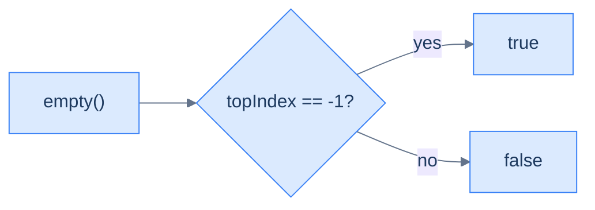
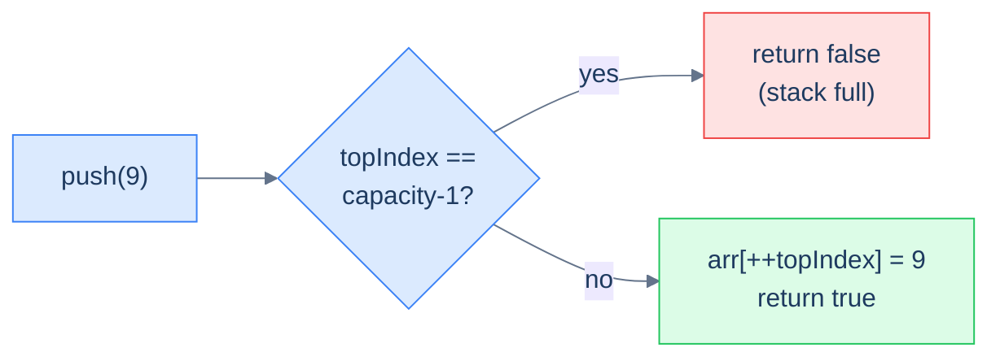

# 2. Array Implementation of Stacks

## The Hook

A stack needs to push, pop, and peek in **O(1)** — and you already own the perfect tool: an array. Treat the *last index* of the array as the top, and every stack operation collapses to a one-liner. Push? Write to `arr[topIndex+1]` and bump `topIndex`. Pop? Read `arr[topIndex]` and decrement. Peek? Read `arr[topIndex]`. Size? `topIndex + 1`. The whole stack interface, three integers and a one-dimensional buffer, no allocator dance per operation, no pointer chasing — just contiguous memory the CPU's prefetcher loves.

Two reasons array-backed stacks dominate in practice: **cache locality** (sequential access patterns blow linked-list stacks out of the water on real hardware), and **predictable cost** (no per-operation `malloc`, no fragmentation). The trade-off is a fixed capacity: once the array fills, you either reject new pushes (a *bounded* stack — what we'll build) or pay an occasional O(N) cost to copy into a larger buffer (a *growable* stack — what `std::stack`, Java's `ArrayDeque`, and Python's `list` do under the hood).

This lesson builds the bounded version end-to-end in Python and Java, then closes with a beautiful interview question — *can you fit two stacks into a single array of length N without wasting any slots?* The answer is yes, and the trick is one of those "wait, that's clever" moments worth carrying around.

---

## Table of contents

1. [Structure of an array-based stack](#structure-of-an-array-based-stack)
2. [Implementing the stack class](#implementing-the-stack-class)
3. [Determining the size of the stack](#determining-the-size-of-the-stack)
4. [Checking if the stack is empty](#checking-if-the-stack-is-empty)
5. [Accessing the top of the stack](#accessing-the-top-of-the-stack)
6. [Pushing an item onto the stack](#pushing-an-item-onto-the-stack)
7. [Popping an item from the stack](#popping-an-item-from-the-stack)
8. [Design a stack using an array](#design-a-stack-using-an-array)
9. [Design two stacks in an array](#design-two-stacks-in-an-array)

***

# Structure of an array-based stack

Three fields and a buffer. That's it.

```d2
cls: "Stack (array-backed)" {
  grid-rows: 3
  grid-gap: 0
  a: "arr: fixed-size array of capacity slots"
  t: "topIndex: index of the topmost item (−1 if empty)"
  c: "capacity: max items the stack can hold"
}
```

<p align="center"><strong>An array-backed stack is just three things — the buffer, the top-of-stack index, and the buffer's capacity. Everything else (size, empty, push, pop, peek) is computed from these.</strong></p>

## State information

### Top index

`topIndex` points at the array slot that currently holds the top of the stack. The convention used everywhere in this lesson:

- **Empty** stack ⇒ `topIndex = -1` (no valid index points at anything).
- **One element** stack ⇒ `topIndex = 0`.
- **Full** stack ⇒ `topIndex = capacity - 1`.

```d2
direction: right

arr: "capacity-4 array" {
  grid-columns: 4
  grid-gap: 0
  v0: |md
    **3**

    `0`
  |
  v1: |md
    **5**

    `1`
  |
  v2: |md
    **7**

    `2`
  | {style.fill: "#fef9c3"; style.stroke: "#f59e0b"}
  v3: |md
    **—**

    `3`
  |
}

tip: "topIndex = 2" {
  shape: oval
}
tip -> arr.v2
```

<p align="center"><strong>Capacity-4 array, three items stored — <code>topIndex = 2</code>. The slot at index 3 is unused but allocated. Push will write at index 3 and bump <code>topIndex</code> to 3; pop will read index 2 and drop <code>topIndex</code> to 1.</strong></p>

### Size

The number of currently-stored items is **`topIndex + 1`**. A separate counter is unnecessary — the index already tells us. This is the single most common identity in array-backed stacks; if it doesn't feel obvious yet, pause and run the numbers on a few example states until it does.

### Capacity

`capacity` is the length of the underlying buffer — the maximum number of items the stack can ever hold. Fixed at construction; checked on every push to detect overflow.

> *Predict before reading on — if <code>topIndex == capacity − 1</code>, what does the next push attempt do? And if <code>topIndex == −1</code>, what does <code>pop()</code> return?*
>
> Push on a full stack rejects (returns false / throws). Pop on an empty stack returns the sentinel `-1` (or throws, depending on convention). These two boundary checks are the only "interesting" code in the entire implementation; everything else is a one-liner.

## Representation in memory

Stacks drawn vertically in textbook diagrams are stored *horizontally* in memory — a single contiguous buffer where the rightmost-used index is the top. This compactness is the whole performance argument: pushing or popping touches one cache line; iterating an N-item stack iterates N adjacent bytes; `realloc` can grow the buffer in place if the OS has room behind it.

```d2
mem: "Memory layout — capacity 6, 3 items" {
  grid-columns: 6
  grid-gap: 0
  m0: |md
    `@1000`

    **3**
  |
  m1: |md
    `@1004`

    **5**
  |
  m2: |md
    `@1008`

    **7**
  | {style.fill: "#fef9c3"; style.stroke: "#f59e0b"}
  m3: |md
    `@1012`

    **—**
  |
  m4: |md
    `@1016`

    **—**
  |
  m5: |md
    `@1020`

    **—**
  |
}

note: |md
  topIndex = 2 → @1008.

  Adjacent bytes; CPU prefetches them for free.
|
note -> mem.m2: "" {style.stroke-dash: 3}
```

<p align="center"><strong>An array-backed stack in actual memory — six 4-byte int slots laid out contiguously. The CPU loads cache lines of 64 bytes, so 16 ints come along for the ride on every push or pop. This is why array stacks beat linked-list stacks in wall-clock time despite identical asymptotic complexity.</strong></p>

***

# Implementing the stack class

We'll build the class incrementally — first the skeleton (constructor + stub methods), then fill in size, empty, top, push, pop in order. Each operation is a one-liner; the only "logic" is the boundary checks for empty and full.

```d2
cls: "Stack class" {
  grid-columns: 2
  grid-gap: 24
  pub: "public API" {
    grid-rows: 5
    grid-gap: 0
    s: "size()"
    e: "empty()"
    p: "top()"
    psh: "push(val) → bool"
    pop: "pop() → val"
  }
  priv: "private internals" {
    grid-rows: 3
    grid-gap: 0
    a: "arr"
    t: "topIndex"
    c: "capacity"
  }
}
```

<p align="center"><strong>The class as we'll build it — three private fields, five public methods. Encapsulation hides <code>topIndex</code>; callers see only the operations.</strong></p>

## Stack class — skeleton


```python run viz=array viz-root=arr
class Stack:
    def __init__(self, capacity: int):
        self.capacity = capacity
        self.arr      = [0] * capacity      # fixed-size buffer
        self.top_idx  = -1                  # -1 = empty

    def size(self):  pass
    def empty(self): pass
    def top(self):   pass
    def push(self, val): pass
    def pop(self):   pass

s = Stack(4)
print("created stack with capacity 4")
```

```java run
public class Main {
    static class Stack {
        private int[] arr;
        private int   capacity;
        private int   topIndex;
        Stack(int capacity) {
            this.capacity = capacity;
            this.arr      = new int[capacity];
            this.topIndex = -1;
        }
        int     size()  { return 0; }
        boolean empty() { return true; }
        int     top()   { return -1; }
        boolean push(int val) { return false; }
        int     pop()   { return -1; }
    }
    public static void main(String[] args) {
        Stack s = new Stack(4);
        System.out.println("created stack with capacity 4");
    }
}
```


***

# Determining the size of the stack

The cleverness of `topIndex = -1 means empty` pays off here: **`size() = topIndex + 1`**. No counter, no traversal, no allocation. One add, return.

```d2
direction: right

e1: |md
  topIndex = -1

  (empty)
|
s1: "size = 0"
e1 -> s1

e2: |md
  topIndex = 0

  (one item)
|
s2: "size = 1"
e2 -> s2

e3: |md
  topIndex = 3

  (four items)
|
s3: "size = 4"
e3 -> s3
```

<p align="center"><strong>Why <code>size() = topIndex + 1</code> works — the indices 0..topIndex hold valid data, so the count of valid entries is <code>topIndex + 1</code>. The −1 sentinel for empty makes the formula uniform across all states (including empty, where 0 + (−1) = 0).</strong></p>

> **Algorithm**
>
> -   **Step 1:** Return `topIndex + 1`.

<details>
<summary><h2>Solution &amp; Analysis</h2></summary>

### Implementation

```python run
from typing import Optional, List, Any

class Stack:
    def __init__(self, capacity: int) -> None:

        # Array to store the stack elements
        self.arr: List[int] = [0] * capacity

        # Maximum capacity of the stack
        self.capacity: int = capacity

        # Index of the top element in the stack
        self.top_index: int = -1

    def size(self) -> int:

        # Size of the stack is the index of the top element plus 1
        return self.top_index + 1
```

```java run
class Stack {

    // Array to store the stack elements
    public int[] arr;

    // Maximum capacity of the stack
    public int capacity;

    // Index of the top element in the stack
    public int topIndex;

    public Stack(int capacity) {
        this.capacity = capacity;

        // Dynamically allocate memory for the stack array
        arr = new int[capacity];

        // Set initial top index to -1 (indicating an empty stack)
        topIndex = -1;
    }

    public int size() {

        // Size of the stack is the index of the top element plus 1
        return topIndex + 1;
    }
}
```

### Complexity Analysis

> **All cases**
>
> -   Time: **O(1)** | Space: **O(1)**

</details>

***

# Checking if the stack is empty

A direct application of the size formula. The stack is empty iff `size() == 0`, equivalently iff `topIndex == -1`.



<p align="center"><strong>Empty check — one comparison. Most callers use this as a guard before <code>top()</code> or <code>pop()</code> to avoid the empty-stack sentinel.</strong></p>

> **Algorithm**
>
> -   **Step 1:** Return `topIndex == -1`.

<details>
<summary><h2>Solution &amp; Analysis</h2></summary>

### Implementation

```python run
from typing import Optional, List, Any

class Stack:
    def __init__(self, capacity: int) -> None:

        # Array to store the stack elements
        self.arr: List[int] = [0] * capacity

        # Maximum capacity of the stack
        self.capacity: int = capacity

        # Index of the top element in the stack
        self.top_index: int = -1

    def size(self) -> int:

        # Size of the stack is the index of the top element plus 1
        return self.top_index + 1

    def empty(self) -> bool:

        # If top index is -1, the stack is empty
        return self.top_index == -1
```

```java run
class Stack {

    // Array to store the stack elements
    public int[] arr;

    // Maximum capacity of the stack
    public int capacity;

    // Index of the top element in the stack
    public int topIndex;

    public Stack(int capacity) {
        this.capacity = capacity;

        // Dynamically allocate memory for the stack array
        arr = new int[capacity];

        // Set initial top index to -1 (indicating an empty stack)
        topIndex = -1;
    }

    public int size() {

        // Size of the stack is the index of the top element plus 1
        return topIndex + 1;
    }

    public boolean empty() {

        // If top index is -1, the stack is empty
        return topIndex == -1;
    }
}
```

### Complexity Analysis

> **All cases** — Time: **O(1)** | Space: **O(1)**

</details>

***

# Accessing the top of the stack

`top()` reads the top element *without removing it*. Two cases:

<details>
<summary><h2>1. Stack is empty</h2></summary>


`topIndex == -1`. Return the sentinel `-1` (or throw, depending on the API). There's no top to return.

</details>
<details>
<summary><h2>2. Stack is not empty</h2></summary>


`topIndex >= 0`. Return `arr[topIndex]`. One memory read, done.

```mermaid
---
config:
  theme: base
  themeVariables:
    primaryColor: "#dbeafe"
    primaryBorderColor: "#3b82f6"
    primaryTextColor: "#1e3a5f"
    lineColor: "#64748b"
    secondaryColor: "#ede9fe"
    tertiaryColor: "#fef9c3"
---
flowchart LR
    Q["top()"] --> E{"empty?"}
    E -->|"yes"| R1["return -1"]
    E -->|"no"|  R2["return arr[topIndex]"]
```

<p align="center"><strong>Top — one branch on the empty case, one array read on the populated case. Constant-time peek; the stack's contents are unchanged after the call.</strong></p>

> **Algorithm**
>
> -   **Step 1:** If `empty()` is true, return `-1`.
> -   **Step 2:** Return `arr[topIndex]`.

</details>
<details>
<summary><h2>Solution &amp; Analysis</h2></summary>

### Implementation

```python run
from typing import Optional, List, Any

class Stack:
    def __init__(self, capacity: int) -> None:

        # Array to store the stack elements
        self.arr: List[int] = [0] * capacity

        # Maximum capacity of the stack
        self.capacity: int = capacity

        # Index of the top element in the stack
        self.top_index: int = -1

    def size(self) -> int:

        # Size of the stack is the index of the top element plus 1
        return self.top_index + 1

    def empty(self) -> bool:

        # If top index is -1, the stack is empty
        return self.top_index == -1

    def top(self) -> int:
        if self.empty():

            # Return -1 if the stack is empty
            return -1

        # Return the element at the top index of the stack
        return self.arr[self.top_index]
```

```java run
class Stack {

    // Array to store the stack elements
    public int[] arr;

    // Maximum capacity of the stack
    public int capacity;

    // Index of the top element in the stack
    public int topIndex;

    public Stack(int capacity) {
        this.capacity = capacity;

        // Dynamically allocate memory for the stack array
        arr = new int[capacity];

        // Set initial top index to -1 (indicating an empty stack)
        topIndex = -1;
    }

    public int size() {

        // Size of the stack is the index of the top element plus 1
        return topIndex + 1;
    }

    public boolean empty() {

        // If top index is -1, the stack is empty
        return topIndex == -1;
    }

    public int top() {
        if (empty()) {

            // Return -1 if the stack is empty
            return -1;
        }

        // Return the element at the top index of the stack
        return arr[topIndex];
    }
}
```

### Complexity Analysis

> **All cases** — Time: **O(1)** | Space: **O(1)**

</details>

***

# Pushing an item onto the stack

Push adds an item to the top. Two cases:

<details>
<summary><h2>1. Stack is full</h2></summary>


`topIndex == capacity - 1`. Reject the push — return `false`. Bounded stacks don't grow.

</details>
<details>
<summary><h2>2. Stack is not full</h2></summary>


Increment `topIndex` and write into the new slot. One increment, one write. Return `true`.



<p align="center"><strong>Push — one boundary check, one pre-incremented write. The pre-increment <code>++topIndex</code> bumps the index <em>before</em> using it, which is exactly the right slot to write into.</strong></p>

> **Algorithm**
>
> -   **Step 1:** If `topIndex == capacity - 1`, return `false`.
> -   **Step 2:** Increment `topIndex`, set `arr[topIndex] = val`, return `true`.

</details>
<details>
<summary><h2>Solution &amp; Analysis</h2></summary>

### Implementation

```python run
from typing import Optional, List, Any

class Stack:
    def __init__(self, capacity: int) -> None:

        # Array to store the stack elements
        self.arr: List[int] = [0] * capacity

        # Maximum capacity of the stack
        self.capacity: int = capacity

        # Index of the top element in the stack
        self.top_index: int = -1

    def size(self) -> int:

        # Size of the stack is the index of the top element plus 1
        return self.top_index + 1

    def empty(self) -> bool:

        # If top index is -1, the stack is empty
        return self.top_index == -1

    def top(self) -> int:
        if self.empty():

            # Return -1 if the stack is empty
            return -1

        # Return the element at the top index of the stack
        return self.arr[self.top_index]

    def push(self, val: int) -> bool:
        if self.top_index == self.capacity - 1:

            # Return False if the stack is already full
            return False

        # Increment top index and add the val to the new top position
        self.top_index += 1
        self.arr[self.top_index] = val

        # Return True to indicate successful push operation
        return True
```

```java run
class Stack {

    // Array to store the stack elements
    public int[] arr;

    // Maximum capacity of the stack
    public int capacity;

    // Index of the top element in the stack
    public int topIndex;

    public Stack(int capacity) {
        this.capacity = capacity;

        // Dynamically allocate memory for the stack array
        arr = new int[capacity];

        // Set initial top index to -1 (indicating an empty stack)
        topIndex = -1;
    }

    public int size() {

        // Size of the stack is the index of the top element plus 1
        return topIndex + 1;
    }

    public boolean empty() {

        // If top index is -1, the stack is empty
        return topIndex == -1;
    }

    public int top() {
        if (empty()) {

            // Return -1 if the stack is empty
            return -1;
        }

        // Return the element at the top index of the stack
        return arr[topIndex];
    }

    public boolean push(int val) {
        if (topIndex == capacity - 1) {

            // Return false if the stack is already full
            return false;
        }

        // Increment top index and add the val to the new top position
        arr[++topIndex] = val;

        // Return true to indicate successful push operation
        return true;
    }
}
```

### Complexity Analysis

> **All cases** — Time: **O(1)** | Space: **O(1)**

</details>

***

# Popping an item from the stack

Pop removes and returns the top item. Two cases:

<details>
<summary><h2>1. Stack is empty</h2></summary>


`topIndex == -1`. Return the sentinel `-1`.

</details>
<details>
<summary><h2>2. Stack is not empty</h2></summary>


Read `arr[topIndex]`, decrement `topIndex`, return the read value. The slot we just "freed" is still in memory — there's nothing to physically erase. The next push will overwrite it.

```mermaid
---
config:
  theme: base
  themeVariables:
    primaryColor: "#dbeafe"
    primaryBorderColor: "#3b82f6"
    primaryTextColor: "#1e3a5f"
    lineColor: "#64748b"
    secondaryColor: "#ede9fe"
    tertiaryColor: "#fef9c3"
---
flowchart LR
    Q["pop()"] --> E{"empty?"}
    E -->|"yes"| R["return -1"]
    E -->|"no"|  ACT["v = arr[topIndex]<br/>topIndex--<br/>return v"]
    style ACT fill:#dcfce7,stroke:#22c55e
```

<p align="center"><strong>Pop — read the slot, decrement the index. The stale value at the old top stays in the buffer but is now <em>logically gone</em> (size and topIndex no longer cover it). Next push overwrites it.</strong></p>

> **Algorithm**
>
> -   **Step 1:** If `empty()`, return `-1`.
> -   **Step 2:** Return `arr[topIndex--]` (read at old top, then decrement).

</details>
<details>
<summary><h2>Solution &amp; Analysis</h2></summary>

### Implementation

```python run viz=array viz-root=arr
class Stack:
    def __init__(self, c): self.capacity, self.arr, self.top_idx = c, [0]*c, -1
    def empty(self): return self.top_idx == -1
    def push(self, v):
        if self.top_idx == self.capacity - 1: return False
        self.top_idx += 1; self.arr[self.top_idx] = v
        return True
    def pop(self):
        if self.empty(): return -1
        v = self.arr[self.top_idx]; self.top_idx -= 1
        return v

s = Stack(3)
s.push(1); s.push(2); s.push(3)
print(s.pop(), s.pop(), s.pop(), s.pop())   # 3 2 1 -1
```

```java run
public class Main {
    static class Stack {
        private final int[] arr; private final int capacity; private int topIndex;
        Stack(int c){ this.capacity = c; arr = new int[c]; topIndex = -1; }
        boolean empty() { return topIndex == -1; }
        boolean push(int v) {
            if (topIndex == capacity - 1) return false;
            arr[++topIndex] = v;
            return true;
        }
        int pop() {
            if (empty()) return -1;
            return arr[topIndex--];
        }
    }
    public static void main(String[] args) {
        Stack s = new Stack(3);
        s.push(1); s.push(2); s.push(3);
        System.out.println(s.pop() + " " + s.pop() + " " + s.pop() + " " + s.pop());
    }
}
```

### Complexity Analysis

> **All cases** — Time: **O(1)** | Space: **O(1)**

</details>

***

# Design a stack using an array

## Problem Statement

Implement a `Stack` class with the operations from this lesson, backed by an array.

> -   **`Stack(int capacity)`** — initialise with the given capacity.
> -   **`size()`** — current size.
> -   **`empty()`** — is the stack empty?
> -   **`top()`** — value at the top, or `-1` if empty.
> -   **`push(int val)`** — push onto the top; return `true` on success, `false` if full.
> -   **`pop()`** — pop and return the top, or `-1` if empty.

> **Constraint:** Use an **array** as the internal data structure.

> **Example:**
>
> -   **Input ops:** `[Stack, push, push, top, empty, pop, top, push, push, empty]`
> -   **Input args:** `[[2], [2], [3], [], [], [], [], [8], [9], []]`
> -   **Output:** `[null, true, true, 3, false, 3, 2, true, false, false]`

<details>
<summary><h2>Solution</h2></summary>


The full implementation is exactly what we built incrementally above, in Python and Java.


```python run viz=array viz-root=arr
from typing import Optional, List, Any

class Stack:
    def __init__(self, capacity: int) -> None:

        # Array to store the stack elements
        self.arr: List[int] = [0] * capacity

        # Maximum capacity of the stack
        self.capacity: int = capacity

        # Index of the top element in the stack
        self.top_index: int = -1

    def size(self) -> int:

        # Size of the stack is the index of the top element plus 1
        return self.top_index + 1

    def empty(self) -> bool:

        # If top index is -1, the stack is empty
        return self.top_index == -1

    def top(self) -> int:
        if self.empty():

            # Return -1 if the stack is empty
            return -1

        # Return the element at the top index of the stack
        return self.arr[self.top_index]

    def push(self, val: int) -> bool:
        if self.top_index == self.capacity - 1:

            # Return False if the stack is already full
            return False

        # Increment top index and add the val to the new top position
        self.top_index += 1
        self.arr[self.top_index] = val

        # Return True to indicate successful push operation
        return True

    def pop(self) -> int:
        if self.empty():

            # Return -1 if the stack is empty (nothing to pop)
            return -1

        # Return the element at the top index and decrement top index
        val = self.arr[self.top_index]
        self.top_index -= 1
        return val


# Example from the problem statement
s = Stack(2)
print(s.push(2))   # True
print(s.push(3))   # True
print(s.top())     # 3
print(s.empty())   # False
print(s.pop())     # 3
print(s.top())     # 2
print(s.push(8))   # True
print(s.push(9))   # False — stack is full
print(s.empty())   # False
```

```java run
import java.util.*;

public class Main {
    static class Stack {

        // Array to store the stack elements
        private int[] arr;

        // Maximum capacity of the stack
        private int capacity;

        // Index of the top element in the stack
        private int topIndex;

        public Stack(int capacity) {
            this.capacity = capacity;

            // Dynamically allocate memory for the stack array
            arr = new int[capacity];

            // Set initial top index to -1 (indicating an empty stack)
            topIndex = -1;
        }

        public int size() {

            // Size of the stack is the index of the top element plus 1
            return topIndex + 1;
        }

        public boolean empty() {

            // If top index is -1, the stack is empty
            return topIndex == -1;
        }

        public int top() {
            if (empty()) {

                // Return -1 if the stack is empty
                return -1;
            }

            // Return the element at the top index of the stack
            return arr[topIndex];
        }

        public boolean push(int val) {
            if (topIndex == capacity - 1) {

                // Return false if the stack is already full
                return false;
            }

            // Increment top index and add the val to the new top position
            arr[++topIndex] = val;

            // Return true to indicate successful push operation
            return true;
        }

        public int pop() {
            if (empty()) {

                // Return -1 if the stack is empty (nothing to pop)
                return -1;
            }

            // Return the element at the top index and decrement top index
            return arr[topIndex--];
        }
    }

    public static void main(String[] args) {
        // Example from the problem statement
        Stack s = new Stack(2);
        System.out.println(s.push(2));   // true
        System.out.println(s.push(3));   // true
        System.out.println(s.top());     // 3
        System.out.println(s.empty());   // false
        System.out.println(s.pop());     // 3
        System.out.println(s.top());     // 2
        System.out.println(s.push(8));   // true
        System.out.println(s.push(9));   // false — stack is full
        System.out.println(s.empty());   // false
    }
}
```

</details>


***

# Design two stacks in an array

## Problem Statement

Pack **two stacks** into a single shared array. The two stacks together must use no more total capacity than the array provides — and ideally, neither stack should run out of room while the *other* one still has free slots.

> -   **`TwoStack(int capacity)`** — initialise; total capacity shared between the two stacks.
> -   **`top1()`, `top2()`** — read the top of stack 1 / stack 2 (or `-1` if empty).
> -   **`push1(int val)`, `push2(int val)`** — push onto stack 1 / stack 2; return `false` if no room.
> -   **`pop1()`, `pop2()`** — pop from stack 1 / stack 2; return `-1` if empty.

> **Constraint:** Use a **single array** to back both stacks. No second array, no linked nodes — one buffer, two stacks.

<details>
<summary><h2>The Twist — *grow them toward each other*</h2></summary>


The naïve approach is to split the array down the middle: stack 1 owns indices `[0..N/2-1]`, stack 2 owns `[N/2..N-1]`. That works, but it wastes capacity — if stack 1 is full and stack 2 is empty, you can't push onto stack 1 even though half the array is free.

The clever approach: let stack 1 grow **rightward from index 0** (top1 starts at −1) and stack 2 grow **leftward from index capacity−1** (top2 starts at `capacity`). They meet in the middle, but only when the *combined* size hits the array's length. Either stack can use up to N − 1 of the slots, as long as the other stays small.

```d2
direction: right

arr: "two stacks in one array (capacity 5)" {
  grid-columns: 5
  grid-gap: 0
  v0: |md
    **3**

    `0`
  | {style.fill: "#dbeafe"; style.stroke: "#3b82f6"}
  v1: |md
    **5**

    `1`
  | {style.fill: "#dbeafe"; style.stroke: "#3b82f6"}
  v2: |md
    **—**

    `2`
  |
  v3: |md
    **7**

    `3`
  | {style.fill: "#ede9fe"; style.stroke: "#7c3aed"}
  v4: |md
    **11**

    `4`
  | {style.fill: "#ede9fe"; style.stroke: "#7c3aed"}
}

t1: "top1 = 1" { shape: oval; style.fill: "#dbeafe"; style.stroke: "#3b82f6" }
t2: "top2 = 3" { shape: oval; style.fill: "#ede9fe"; style.stroke: "#7c3aed" }

t1 -> arr.v1
t2 -> arr.v3
```

<p align="center"><strong>Two stacks in one array — stack 1 (blue) grows right from index 0; stack 2 (purple) grows left from index capacity−1. They collide only when <code>top1 + 1 == top2</code>, which means the array is genuinely full.</strong></p>

The "full" check changes from "is *my* stack full?" to "are the two tops about to overlap?":

- **`push1` is rejected when** `topIndex1 + 1 >= topIndex2` (no room to advance into).
- **`push2` is rejected when** `topIndex2 - 1 <= topIndex1` (same condition, mirrored).

Initial sentinels:
- `topIndex1 = -1` → stack 1 empty (would-write at index 0 next).
- `topIndex2 = capacity` → stack 2 empty (would-write at index capacity−1 next).

> *Predict before reading on — with capacity 6, all 6 in stack 1, none in stack 2: top1 = ?, top2 = ?, and what does push2 do?*
>
> top1 = 5, top2 = 6 (still its empty sentinel). push2 checks `top2 - 1 <= top1` → `5 <= 5` → true → reject. The array is fully consumed by stack 1, so stack 2 has no room. The check is exactly the same shape as a single-stack "full" check, generalised to the meeting point of two stacks.

</details>
<details>
<summary><h2>Solution</h2></summary>


```python run viz=array viz-root=arr
from typing import List

class TwoStack:
    def __init__(self, capacity: int) -> None:

        # Array to store elements
        self.arr: List[int] = [0] * capacity

        # Capacity of the array
        self.capacity: int = capacity

        # Top index of the first stack
        self.top_index_1: int = -1

        # Top index of the second stack
        self.top_index_2: int = capacity

    def top1(self) -> int:
        if self.top_index_1 == -1:

            # Stack 1 is empty, return -1
            return -1

        # Return the element at the top of Stack 1
        return self.arr[self.top_index_1]

    def top2(self) -> int:
        if self.top_index_2 == self.capacity:

            # Stack 2 is empty, return -1
            return -1

        # Return the element at the top of Stack 2
        return self.arr[self.top_index_2]

    def push1(self, val: int) -> bool:
        if self.top_index_1 + 1 >= self.top_index_2:

            # Stack 1 is full, cannot push more elements
            return False

        # Increment top index of Stack 1 and assign val to that position
        self.top_index_1 += 1
        self.arr[self.top_index_1] = val

        # Push operation was successful
        return True

    def push2(self, val: int) -> bool:
        if self.top_index_2 - 1 <= self.top_index_1:

            # Stack 2 is full, cannot push more elements
            return False

        # Decrement top index of Stack 2 and assign val to that position
        self.top_index_2 -= 1
        self.arr[self.top_index_2] = val

        # Push operation was successful
        return True

    def pop1(self) -> int:
        if self.top_index_1 == -1:

            # Stack 1 is empty, cannot pop any element, return -1
            return -1

        # Return the element at the top of Stack 1 and decrement top
        # index
        result = self.arr[self.top_index_1]
        self.top_index_1 -= 1
        return result

    def pop2(self) -> int:
        if self.top_index_2 == self.capacity:

            # Stack 2 is empty, cannot pop any element, return -1
            return -1

        # Return the element at the top of Stack 2 and increment top
        # index
        result = self.arr[self.top_index_2]
        self.top_index_2 += 1
        return result


# Example from the problem statement
ts = TwoStack(6)
print(ts.push1(2))   # True
print(ts.push2(3))   # True
print(ts.pop1())     # 2
print(ts.pop2())     # 3
print(ts.top1())     # -1
print(ts.top2())     # -1
print(ts.push1(8))   # True
print(ts.push1(9))   # True
print(ts.top1())     # 9
```

```java run
import java.util.*;

public class Main {
    static class TwoStack {

        // Array to store elements
        private int[] arr;

        // Capacity of the array
        private int capacity;

        // Top index of the first stack
        private int topIndex1;

        // Top index of the second stack
        private int topIndex2;

        public TwoStack(int capacity) {
            this.capacity = capacity;
            arr = new int[capacity];

            // Initialize top index of the first stack as -1 (empty)
            topIndex1 = -1;

            // Initialize top index of the second stack as capacity (empty)
            topIndex2 = capacity;
        }

        public int top1() {
            if (topIndex1 == -1) {

                // Stack 1 is empty, return -1
                return -1;
            }

            // Return the element at the top of Stack 1
            return arr[topIndex1];
        }

        public int top2() {
            if (topIndex2 == capacity) {

                // Stack 2 is empty, return -1
                return -1;
            }

            // Return the element at the top of Stack 2
            return arr[topIndex2];
        }

        public boolean push1(int val) {
            if (topIndex1 + 1 >= topIndex2) {

                // Stack 1 is full, cannot push more elements
                return false;
            }

            // Increment top index of Stack 1 and assign val to that position
            arr[++topIndex1] = val;

            // Push operation was successful
            return true;
        }

        public boolean push2(int val) {
            if (topIndex2 - 1 <= topIndex1) {

                // Stack 2 is full, cannot push more elements
                return false;
            }

            // Decrement top index of Stack 2 and assign val to that position
            arr[--topIndex2] = val;

            // Push operation was successful
            return true;
        }

        public int pop1() {
            if (topIndex1 == -1) {

                // Stack 1 is empty, cannot pop any element
                return -1;
            }

            // Return the element at the top of Stack 1 and decrement top
            // index
            return arr[topIndex1--];
        }

        public int pop2() {
            if (topIndex2 == capacity) {

                // Stack 2 is empty, cannot pop any element
                return -1;
            }

            // Return the element at the top of Stack 2 and increment top
            // index
            return arr[topIndex2++];
        }
    }

    public static void main(String[] args) {
        // Example from the problem statement
        TwoStack ts = new TwoStack(6);
        System.out.println(ts.push1(2));   // true
        System.out.println(ts.push2(3));   // true
        System.out.println(ts.pop1());     // 2
        System.out.println(ts.pop2());     // 3
        System.out.println(ts.top1());     // -1
        System.out.println(ts.top2());     // -1
        System.out.println(ts.push1(8));   // true
        System.out.println(ts.push1(9));   // true
        System.out.println(ts.top1());     // 9
    }
}
```

</details>
<details>
<summary><h2>Final Takeaway</h2></summary>


An array-backed stack is the most straightforward data-structure implementation you'll ever write — *every* operation is O(1), the entire interface fits in one screen, and the buffer's contiguity gives you cache locality the linked-list version can't match.

Three lessons:

1. **Treat the last index as the top.** With `topIndex = -1` for empty, `size = topIndex + 1` is the universal identity that drives every other formula.
2. **Boundary checks are the only logic.** Pop-on-empty and push-on-full are the only conditions that aren't trivially constant time. Everything else is one increment, one read or write.
3. **Bidirectional growth is the trick that packs two stacks into one array.** Stack 1 rightward from 0, stack 2 leftward from N−1, both end at the meeting point. The single shared array lets either stack consume up to N−1 of the slots as long as the other stays small — far more flexible than splitting the array in halves.

> *Coming up — the **linked-list implementation**. The trade-off flips: no fixed capacity (push never fails for "full"), no resize cost ever, but every node is its own allocation and the memory layout is whatever the heap gives you. The same five operations, the same complexities, but a different set of trade-offs and a different "default choice" for different use cases.*

</details>

<!-- ============================================== -->
<!-- SWEEP 2 — missing sections (placeholders only) -->
<!-- ============================================== -->

<!-- TODO: Understanding the Problem — missing, needs to be written -->
<!--       Guidance: frame the gap the structure/algorithm fills -->

<!-- TODO: Supported Operations — missing, needs to be written -->
<!--       Guidance: table: operation / time / notes -->

<!-- TODO: Internal Mechanics — missing, needs to be written -->
<!--       Guidance: how it actually works under the hood -->

<!-- TODO: Working Example — missing, needs to be written -->
<!--       Guidance: one fully worked end-to-end example -->

<!-- TODO: Edge Cases & Pitfalls — missing, needs to be written -->
<!--       Guidance: bulleted list of gotchas -->

<!-- TODO: Production Reality — missing, needs to be written -->
<!--       Guidance: 4–6 entries: System — uses X — because Y -->

<!-- TODO: Quiz — missing, needs to be written -->
<!--       Guidance: 3–5 questions, each labeled [Recall]/[Reasoning]/[Tradeoff] -->

<!-- TODO: Practice Ladder — missing, needs to be written -->
<!--       Guidance: table: 5 links into pattern problems + hints -->

<!-- TODO: Further Reading — missing, needs to be written -->
<!--       Guidance: annotated: ★ Essential / ◆ Advanced / → Reference -->

<!-- TODO: Cross-Links — missing, needs to be written -->
<!--       Guidance: Prerequisites | What comes next -->

<!-- TODO: Final Takeaway — missing, needs to be written -->
<!--       Guidance: exactly 3 typed bullets: Core mechanic / Dominant tradeoff / One thing to remember -->
