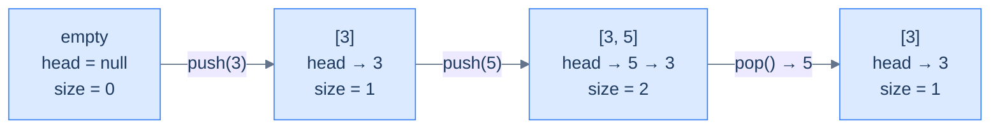

# 3. Linked-List Implementation of Stacks

## The Hook

Imagine the array-backed stack from the last lesson, but instead of pre-allocating a fixed-size buffer, every push *creates a brand-new node on the fly* and links it onto the front of a singly-linked list. The "top of the stack" is whatever the `head` pointer is currently pointing at. Push? Allocate a new node, point it at the old head, swing the head to the new node — three pointer moves, all O(1). Pop? Read the head's value, swing the head to `head.next`, free the old node — three pointer moves, all O(1).

There's no fixed capacity. There's no resize cost. There's no "stack overflow" until the operating system itself runs out of memory. Every push is the same constant-time work; every pop is the same constant-time work; the asymptotics are *identical* to the array version, but the trade-offs are different in ways that matter on real hardware:

- **No upfront allocation** — a million-capacity array reserves a million slots even if you only ever push five. A linked list grows one node at a time.
- **No resize spikes** — array stacks that grow by doubling pay an occasional O(N) cost; linked-list stacks pay O(1) every time, predictably.
- **But: no cache locality** — every node is a separate heap allocation, scattered across RAM. The CPU can't prefetch the "next" item on pop because it doesn't know where it lives until it dereferences `head.next`.

This lesson builds the linked-list stack end-to-end in Python and Java — same five operations, same O(1) cost, but a completely different memory model. The kind of trade-off you make consciously in production code: array stacks for speed-on-known-workloads, linked-list stacks for unbounded-or-bursty-workloads.

---

## Table of contents

1. [Understanding the problem](#understanding-the-problem)
2. [Structure of a linked-list-based stack](#structure-of-a-linked-list-based-stack)
3. [Supported operations](#supported-operations)
4. [Internal mechanics](#internal-mechanics)
5. [Implementing the stack class using a linked list](#implementing-the-stack-class-using-a-linked-list)
6. [Determining the size of the stack](#determining-the-size-of-the-stack)
7. [Checking if the stack is empty](#checking-if-the-stack-is-empty)
8. [Accessing the top of the stack](#accessing-the-top-of-the-stack)
9. [Pushing an item onto the stack](#pushing-an-item-onto-the-stack)
10. [Popping an item from the stack](#popping-an-item-from-the-stack)
11. [Working example](#working-example)
12. [Design a stack using a linked list](#design-a-stack-using-a-linked-list)
13. [Edge cases and pitfalls](#edge-cases-and-pitfalls)
14. [Production reality](#production-reality)
15. [Quiz](#quiz)
16. [Practice ladder](#practice-ladder)
17. [Further reading](#further-reading)
18. [Cross-links](#cross-links)
19. [Final takeaway](#final-takeaway)

***

# Understanding the Problem

An array backs a stack well, but it forces one decision up front: how big can the stack get? A bounded array reserves every slot at construction and refuses the push that would exceed it. A growable array resizes by copying into a larger buffer, paying an occasional `O(n)` cost. A linked list sidesteps both — it grows one node at a time, with no buffer to size and no copy to amortise.

The difference comes from what "the top" refers to in each implementation:

- **Array stack** — the top is an `index` into a contiguous buffer; capacity is the buffer's length.
- **Linked-list stack** — the top is a **pointer** to a node; capacity is whatever the machine's memory allows.

Using a linked list, a stack created with no capacity ceiling keeps accepting pushes until the operating system itself runs out of memory. Each push allocates exactly one node and links it to the front; nothing is reserved in advance, so five pushes cost five nodes' worth of memory rather than a million-slot buffer. So the key idea is: a linked list backs a stack when you want unbounded or bursty growth with no resize spikes — trading the array's cache locality for one heap allocation per push.

***

# Structure of a linked-list-based stack

A linked-list stack stores its top at the **head** of a singly linked list. Three fields wrap that list:

```d2
direction: right

cls: "Stack (linked-list-backed)" {
  grid-rows: 3
  grid-gap: 0
  h: "head: pointer to top node (null if empty)"
  s: "currentSize: number of nodes"
  c: "capacity: max nodes allowed"
}

n1: |md
  **val: 9**

  next: ●
| {style.fill: "#fef9c3"; style.stroke: "#f59e0b"}

n2: |md
  val: 7

  next: ●
|

n3: |md
  val: 5

  next: null
|

cls.h -> n1
n1 -> n2
n2 -> n3
```

<p align="center"><strong>Linked-list stack — <code>head</code> always points at the top. To push, allocate a new node and make it the new head; to pop, advance head to <code>head.next</code> and free the old head. Both are O(1) regardless of the stack's depth.</strong></p>

## State information

### Top

In the array version, "top" was an index. Here, it's a **pointer**. `head` references the most-recently-pushed node, or is `null` if the stack is empty. Every operation that touches the top — `push`, `pop`, `top()` — does so through this pointer.

> *Why is the top at the* head *of the list and not the tail?*
>
> Because head insertion and head deletion are O(1) — no traversal required. Tail insertion and tail deletion are O(N) without a tail pointer (you'd have to walk the list to find the second-to-last node before you could re-link). For a stack, where every operation is on the top, putting the top at the head is the only choice that keeps the implementation O(1).

### Current size

A linked list doesn't know its own length unless someone counts. We could compute size by walking the list — that's O(N). Or we maintain an integer `currentSize` that's incremented on push and decremented on pop. We'll do the latter — `size()` becomes O(1).

### Capacity

`capacity` is the maximum allowed size. A *bounded* linked-list stack rejects pushes when `currentSize == capacity`; an *unbounded* one ignores capacity entirely. We'll build the bounded version to mirror the array stack's interface — same contract, different storage.



<p align="center"><strong>Lifecycle — every push prepends a node at the head and bumps size; every pop removes the head and drops size. The list grows and shrinks at the same end, perfectly mirroring the LIFO contract.</strong></p>

***

# Supported Operations

Five operations make up the whole interface, and every one is `O(1)` time and `O(1)` extra space. The set matches the array implementation exactly — same contract, different storage — because a stack is defined by its LIFO behaviour, not by how the nodes are laid out. What changes underneath is the mechanism: an `index` slide becomes a pointer swing.

| Operation | Time | Space | What it does |
|---|---|---|---|
| `size()` | `O(1)` | `O(1)` | Returns `currentSize` — the counter bumped on push, dropped on pop |
| `empty()` | `O(1)` | `O(1)` | Returns whether `currentSize == 0` (equivalently `head == null`) |
| `top()` | `O(1)` | `O(1)` | Reads `head.val` without unlinking it (peek) |
| `push(val)` | `O(1)` | `O(1)` | Prepends a new node at the head; returns `false` if full |
| `pop()` | `O(1)` | `O(1)` | Unlinks and returns the head node; returns `-1` if empty |

The two reads differ in intent: `top()` inspects, `pop()` consumes. Using a stack holding `head → 9 → 7 → 5`, `top()` returns `9` and leaves the list intact, while `pop()` returns `9` and advances `head` to the node holding `7`. So the core insight is: every operation touches only the head, which is exactly why none of the five depends on how many nodes the list holds.

***

# Internal Mechanics

Every operation is a rule expressed in terms of the `head` pointer, and the list nodes are the passive storage those rules read and re-link. Unlike the array version, where a single `index` slides over a fixed buffer, the linked-list version allocates or frees a node on each mutation and rewires one pointer:

- **Push** allocates a node, sets its `next` to the old `head`, then moves `head` to the new node.
- **Pop** reads `head.val`, advances `head` to `head.next`, then frees the old head.
- **Top** reads `head.val` and leaves `head` alone.

The order of pointer assignments is the only delicate part. On push, the new node's `next` must be wired to the old `head` *before* `head` moves — reverse the two and the node points at itself, forming a one-element cycle. On pop, the old head must be saved *before* `head` advances, or the node becomes unreachable before it can be freed. Using a three-node list `head → 9 → 7 → 5`: a pop reads `9`, swings `head` to the `7` node, and the former head is now garbage. So the core insight is: the nodes are passive storage and `head` is the only live state — correctness reduces to rewiring pointers in the order that never strands a node.

***

# Implementing the stack class using a linked list

Two pieces: a tiny `ListNode` type for the chain, and the `Stack` class that wraps it.

<details>
<summary><h2>Linked list node</h2></summary>


A node holds a value and a pointer to the next node. That's the entire definition. The first lesson of the linked-list section already covered this, so we'll keep it minimal.

```d2
direction: right

n: ListNode {
  grid-columns: 2
  grid-gap: 0
  v: |md
    val

    (int)
  |
  nx: |md
    next

    (pointer)
  |
}
```

<p align="center"><strong>The chain node — one value plus one pointer. Push allocates one of these; pop frees one.</strong></p>

</details>
<details>
<summary><h2>Stack class — skeleton</h2></summary>


The class encapsulates `head`, `currentSize`, and `capacity`, exposing the same five operations as the array version.


```python run
# Instantiate a stack object from the stack class
st = Stack(9)

# Push some data into the stack
st.push(1)
st.push(4)
st.push(5)
st.push(9)

# Pop data from the stack
st.pop()

# Get the top value
x = st.top()
```

```java run
// Instantiate a stack object from the stack class
Stack st = new Stack(9);

// Push some data into the stack
st.push(1);
st.push(4);
st.push(5);
st.push(9);

// Pop data from the stack
st.pop();

// Get the top value
int x = st.top();
```

</details>


***

# Determining the size of the stack

We maintain `currentSize` as a counter that's bumped on push and dropped on pop, so `size()` is a single integer read.

> *Why a counter and not a list walk?*
>
> Walking the list is O(N). Maintaining a counter is O(1) per mutation, O(1) per query. The extra integer is a tiny memory cost for a huge speed win — and it lets us cheaply check capacity on every push.

> **Algorithm**
>
> -   **Step 1:** Return `currentSize`.

<details>
<summary><h2>Solution &amp; Analysis</h2></summary>

### Implementation

```python run
from typing import Optional

"""
Definition for singly-linked list.
class ListNode:
    def __init__(self, val):
        self.val = val
        self.next = None
"""

class Stack:
    def __init__(self, capacity: int):

        # Reference to the head of the stack
        self.head: Optional[ListNode] = None

        # Maximum capacity of the stack
        self.capacity: int = capacity

        # Current number of elements in the stack
        self.current_size: int = 0

    def size(self) -> int:

        # Return the current number of elements in the stack
        return self.current_size
```

```java run
/**
 * Definition for singly-linked list.
 * class ListNode {
 *     int val;
 *     ListNode next;
 *     ListNode() {}
 *     ListNode(int val) { this.val = val; }
 * };
 */

class Stack {

    // Reference to the head of the stack
    public ListNode head;

    // Maximum capacity of the stack
    public int capacity;

    // Current number of elements in the stack
    public int currentSize;

    public Stack(int capacity) {

        // Initialize the capacity of the stack
        this.capacity = capacity;

        // Initialize the currentSize to zero
        this.currentSize = 0;

        // Initialize the head reference to null
        this.head = null;
    }

    public int size() {

        // Return the current number of elements in the stack
        return currentSize;
    }
}
```

### Complexity Analysis

> **All cases** — Time: **O(1)** | Space: **O(1)**

</details>

***

# Checking if the stack is empty

Same approach as before — directly compare against the size counter, or equivalently check whether `head == null`. Either works; the counter check is more uniform.

> **Algorithm**
>
> -   **Step 1:** Return `currentSize == 0` (equivalently, `head == null`).

<details>
<summary><h2>Solution &amp; Analysis</h2></summary>

### Implementation

```python run
from typing import Optional

"""
Definition for singly-linked list.
class ListNode:
    def __init__(self, val):
        self.val = val
        self.next = None
"""

class Stack:
    def __init__(self, capacity: int):

        # Reference to the head of the stack
        self.head: Optional[ListNode] = None

        # Maximum capacity of the stack
        self.capacity: int = capacity

        # Current number of elements in the stack
        self.current_size: int = 0

    def size(self) -> int:

        # Return the current number of elements in the stack
        return self.current_size

    def empty(self) -> bool:

        # Return True if the stack is empty, False otherwise
        return self.current_size == 0
```

```java run
/**
 * Definition for singly-linked list.
 * class ListNode {
 *     int val;
 *     ListNode next;
 *     ListNode() {}
 *     ListNode(int val) { this.val = val; }
 * };
 */

class Stack {

    // Reference to the head of the stack
    public ListNode head;

    // Maximum capacity of the stack
    public int capacity;

    // Current number of elements in the stack
    public int currentSize;

    public Stack(int capacity) {

        // Initialize the capacity of the stack
        this.capacity = capacity;

        // Initialize the currentSize to zero
        this.currentSize = 0;

        // Initialize the head reference to null
        this.head = null;
    }

    public int size() {

        // Return the current number of elements in the stack
        return currentSize;
    }

    public boolean empty() {

        // Return true if the stack is empty, false otherwise
        return currentSize == 0;
    }
}
```

### Complexity Analysis

> **All cases** — Time: **O(1)** | Space: **O(1)**

</details>

***

# Accessing the top of the stack

`head` *is* the top, so reading it is one pointer dereference. Two cases:

<details>
<summary><h2>1. Stack is empty</h2></summary>


`head == null`. There's no top to return — return `-1`.

</details>
<details>
<summary><h2>2. Stack is not empty</h2></summary>


Return `head.val`. The list and head pointer are unchanged.

```mermaid
---
config:
  theme: base
  themeVariables:
    primaryColor: "#dbeafe"
    primaryBorderColor: "#3b82f6"
    primaryTextColor: "#1e3a5f"
    lineColor: "#64748b"
    secondaryColor: "#ede9fe"
    tertiaryColor: "#fef9c3"
---
flowchart LR
    Q["top()"] --> E{"head == null?"}
    E -->|"yes"| R1["return -1"]
    E -->|"no"|  R2["return head.val"]
```

<p align="center"><strong>Top — peek through the head pointer. The list itself is untouched, so back-to-back <code>top()</code> calls are idempotent.</strong></p>

> **Algorithm**
>
> -   **Step 1:** If `empty()`, return `-1`.
> -   **Step 2:** Return `head.val`.

</details>
<details>
<summary><h2>Solution &amp; Analysis</h2></summary>

### Implementation

```python run
from typing import Optional

"""
Definition for singly-linked list.
class ListNode:
    def __init__(self, val):
        self.val = val
        self.next = None
"""

class Stack:
    def __init__(self, capacity: int):

        # Reference to the head of the stack
        self.head: Optional[ListNode] = None

        # Maximum capacity of the stack
        self.capacity: int = capacity

        # Current number of elements in the stack
        self.current_size: int = 0

    def size(self) -> int:

        # Return the current number of elements in the stack
        return self.current_size

    def empty(self) -> bool:

        # Return True if the stack is empty, False otherwise
        return self.current_size == 0

    def top(self) -> int:
        if self.empty():

            # If the stack is empty, return -1 (an invalid value)
            return -1

        # Return the value of the element at the top of the stack
        if self.head:
            return self.head.val
        return -1
```

```java run
/**
 * Definition for singly-linked list.
 * class ListNode {
 *     int val;
 *     ListNode next;
 *     ListNode() {}
 *     ListNode(int val) { this.val = val; }
 * };
 */

class Stack {

    // Reference to the head of the stack
    public ListNode head;

    // Maximum capacity of the stack
    public int capacity;

    // Current number of elements in the stack
    public int currentSize;

    public Stack(int capacity) {

        // Initialize the capacity of the stack
        this.capacity = capacity;

        // Initialize the currentSize to zero
        this.currentSize = 0;

        // Initialize the head reference to null
        this.head = null;
    }

    public int size() {

        // Return the current number of elements in the stack
        return currentSize;
    }

    public boolean empty() {

        // Return true if the stack is empty, false otherwise
        return currentSize == 0;
    }

    public int top() {
        if (empty()) {

            // If the stack is empty, return -1 (an invalid value)
            return -1;
        }

        // Return the value of the element at the top of the stack
        return head.val;
    }
}
```

### Complexity Analysis

> **All cases** — Time: **O(1)** | Space: **O(1)**

</details>

***

# Pushing an item onto the stack

Push allocates a new node, links it to the old head, and makes it the new head.

<details>
<summary><h2>1. Stack is full</h2></summary>


`currentSize == capacity`. Reject the push — return `false`.

</details>
<details>
<summary><h2>2. Stack is not full</h2></summary>


Three steps, all O(1):

1. Allocate a new node `newNode` with the given value.
2. Set `newNode.next = head` (the old top is now the second element).
3. Set `head = newNode` and increment `currentSize`.

The order of those three steps matters: if you set `head = newNode` *before* setting `newNode.next = head`, you'll set `newNode.next` to itself, creating a cycle of length 1. Always rewire the new node's `next` *first*, then update `head`.

```d2
direction: right

before: "before push(9)" {
  direction: right
  h1: head
  n1: "7"
  n2: "5"
  nul1: null
  h1 -> n1
  n1 -> n2
  n2 -> nul1
}

after: "after push(9)" {
  direction: right
  h2: head
  n3: "9" {style.fill: "#dcfce7"; style.stroke: "#22c55e"}
  n4: "7"
  n5: "5"
  nul2: null
  h2 -> n3
  n3 -> n4
  n4 -> n5
  n5 -> nul2
}

before -> after
```

<p align="center"><strong>Push — the new node lands at the head; the old head becomes <code>newNode.next</code>. Three pointer assignments, regardless of how many nodes are already in the list.</strong></p>

> **Algorithm**
>
> -   **Step 1:** If `currentSize == capacity`, return `false`.
> -   **Step 2:** Create a new node `newNode` with the given value.
> -   **Step 3:** `newNode.next = head; head = newNode; currentSize++`.
> -   **Step 4:** Return `true`.

</details>
<details>
<summary><h2>Solution &amp; Analysis</h2></summary>

### Implementation

```python run
from typing import Optional

"""
Definition for singly-linked list.
class ListNode:
    def __init__(self, val):
        self.val = val
        self.next = None
"""

class Stack:
    def __init__(self, capacity: int):

        # Reference to the head of the stack
        self.head: Optional[ListNode] = None

        # Maximum capacity of the stack
        self.capacity: int = capacity

        # Current number of elements in the stack
        self.current_size: int = 0

    def size(self) -> int:

        # Return the current number of elements in the stack
        return self.current_size

    def empty(self) -> bool:

        # Return True if the stack is empty, False otherwise
        return self.current_size == 0

    def top(self) -> int:
        if self.empty():

            # If the stack is empty, return -1 (an invalid value)
            return -1

        # Return the value of the element at the top of the stack
        if self.head:
            return self.head.val
        return -1

    def push(self, val: int) -> bool:
        if self.current_size == self.capacity:

            # If the stack is already full, return False
            return False

        # Create a new node with the given val
        new_node = ListNode(val)

        # Set the next reference of the new node to the current head
        new_node.next = self.head

        # Update the head reference to the new node
        self.head = new_node

        # Increment the count of elements in the stack
        self.current_size += 1

        # Return True to indicate a successful push operation
        return True
```

```java run
/**
 * Definition for singly-linked list.
 * class ListNode {
 *     int val;
 *     ListNode next;
 *     ListNode() {}
 *     ListNode(int val) { this.val = val; }
 * };
 */

class Stack {

    // Reference to the head of the stack
    public ListNode head;

    // Maximum capacity of the stack
    public int capacity;

    // Current number of elements in the stack
    public int currentSize;

    public Stack(int capacity) {

        // Initialize the capacity of the stack
        this.capacity = capacity;

        // Initialize the currentSize to zero
        this.currentSize = 0;

        // Initialize the head reference to null
        this.head = null;
    }

    public int size() {

        // Return the current number of elements in the stack
        return currentSize;
    }

    public boolean empty() {

        // Return true if the stack is empty, false otherwise
        return currentSize == 0;
    }

    public int top() {
        if (empty()) {

            // If the stack is empty, return -1 (an invalid value)
            return -1;
        }

        // Return the value of the element at the top of the stack
        return head.val;
    }

    public boolean push(int val) {
        if (currentSize == capacity) {

            // If the stack is already full, return false
            return false;
        }

        // Create a new node with the given val
        ListNode newNode = new ListNode(val);

        // Set the next reference of the new node to the current head
        newNode.next = head;

        // Update the head reference to the new node
        head = newNode;

        // Increment the count of elements in the stack
        currentSize++;

        // Return true to indicate a successful push operation
        return true;
    }
}
```

### Complexity Analysis

> **All cases** — Time: **O(1)** | Space: **O(1)** (one node allocated per push)

</details>

***

# Popping an item from the stack

Pop removes the head node, returns its value, and frees the memory.

<details>
<summary><h2>1. Stack is empty</h2></summary>


`head == null`. Return `-1`.

</details>
<details>
<summary><h2>2. Stack is not empty</h2></summary>


Three steps:

1. Save `head.val` into a temporary.
2. Save the old head pointer (so we can free it).
3. Advance `head = head.next` and decrement `currentSize`.
4. Free (delete) the saved old head and return the saved value.

The "save old head before moving" sequence matters in languages with manual memory management — if you advance `head` first and *then* try to delete the old head, you've already lost the pointer to it.

```d2
direction: right

before: "before pop()" {
  direction: right
  h1: head
  n1: "9 ← will be freed" {style.fill: "#fee2e2"; style.stroke: "#ef4444"}
  n2: "7"
  n3: "5"
  nul1: null
  h1 -> n1
  n1 -> n2
  n2 -> n3
  n3 -> nul1
}

after: "after pop() → 9" {
  direction: right
  h2: head
  n4: "7"
  n5: "5"
  nul2: null
  h2 -> n4
  n4 -> n5
  n5 -> nul2
}

before -> after
```

<p align="center"><strong>Pop — read the head's value, advance head, free the old head. The list shrinks by one node from the front.</strong></p>

> **Algorithm**
>
> -   **Step 1:** If `empty()`, return `-1`.
> -   **Step 2:** Save `value = head.val` and `temp = head`.
> -   **Step 3:** `head = head.next; currentSize--`.
> -   **Step 4:** Free `temp` (in languages without GC); return `value`.

</details>
<details>
<summary><h2>Solution &amp; Analysis</h2></summary>

### Implementation

```python run viz=linked-list viz-root=head
class _ListNode:
    def __init__(self, v): self.val, self.next = v, None

class Stack:
    def __init__(self, c): self.capacity, self.head, self.current_size = c, None, 0
    def empty(self): return self.current_size == 0
    def push(self, v):
        if self.current_size == self.capacity: return False
        n = _ListNode(v); n.next = self.head; self.head = n
        self.current_size += 1
        return True
    def pop(self):
        if self.empty(): return -1
        value     = self.head.val
        self.head = self.head.next      # GC reclaims the old head node
        self.current_size -= 1
        return value

s = Stack(3); s.push(1); s.push(2); s.push(3)
print(s.pop(), s.pop(), s.pop(), s.pop())   # 3 2 1 -1
```

```java run viz=linked-list viz-root=head
public class Main {
    static class ListNode { int val; ListNode next; ListNode(int v){ val=v; } }
    static class Stack {
        private ListNode head; private int currentSize, capacity;
        Stack(int c){ capacity = c; }
        boolean empty(){ return currentSize == 0; }
        boolean push(int v){
            if (currentSize == capacity) return false;
            ListNode n = new ListNode(v); n.next = head; head = n;
            currentSize++; return true;
        }
        int pop(){
            if (empty()) return -1;
            int value = head.val;
            head      = head.next;       // old head becomes garbage
            currentSize--;
            return value;
        }
    }
    public static void main(String[] args){
        Stack s = new Stack(3);
        s.push(1); s.push(2); s.push(3);
        System.out.println(s.pop() + " " + s.pop() + " " + s.pop() + " " + s.pop());
    }
}
```

### Complexity Analysis

> **All cases** — Time: **O(1)** | Space: **O(1)** (one node freed per pop)

</details>

***

# Working Example

Watching the `head` pointer move through a full push-then-pop cycle is the fastest way to make the five operations click. Start with `Stack(3)` — capacity `3`, `head = null`, `currentSize = 0` marking it empty. Each step below allocates or frees exactly one node and rewires `head`:

1. **`push(1)`** — not full, so allocate a node `1`, set its `next` to `null` (the old head), move `head` to it. List `head → 1`, `currentSize == 1`.
2. **`push(2)`** — allocate node `2`, set its `next` to the `1` node, move `head` to it. List `head → 2 → 1`, `currentSize == 2`.
3. **`push(3)`** — allocate node `3`, set its `next` to the `2` node, move `head` to it. List `head → 3 → 2 → 1`, `currentSize == 3` — the stack is now full (`currentSize == capacity`).
4. **`pop()`** — not empty, so read `head.val == 3`, save the head node, advance `head` to the `2` node, free the saved node. Return `3`. List `head → 2 → 1`, `currentSize == 2`.
5. **`pop()`** — read `head.val == 2`, advance `head` to the `1` node, free the old head. Return `2`. List `head → 1`.
6. **`pop()`** — read `head.val == 1`, advance `head` to `null`, free the old head. Return `1` — the stack is empty again.
7. **`pop()`** — `empty()` is now true (`head == null`), so return the sentinel `-1` without touching any node.

The return sequence is `3 2 1 -1` — the three values in reverse insertion order, then the empty sentinel. That reversal is LIFO made literal. The last value pushed (`3`) is the first popped; the first value pushed (`1`) waits at the bottom of the list until everything above it is unlinked. So the core insight is: a push-pop cycle is a node-by-node build-up and tear-down at the head, and the values return in exactly reverse order regardless of how deep the list grew.

***

# Design a stack using a linked list

## Problem Statement

Implement the same `Stack` class from the array-implementation lesson, but **backed by a singly linked list** instead of an array.

> -   **`Stack(int capacity)`** — initialise with the given capacity.
> -   **`size()`** — current size.
> -   **`empty()`** — is the stack empty?
> -   **`top()`** — value at the top, or `-1` if empty.
> -   **`push(int val)`** — push onto the top; return `true` on success, `false` if full.
> -   **`pop()`** — pop and return the top, or `-1` if empty.

> **Constraint:** Use a **linked list** as the internal data structure.

> **Example:** identical to the array version. Same input, same output.

<details>
<summary><h2>Solution</h2></summary>


The full implementation, in Python and Java, combining everything we built incrementally above.


```python run viz=linked-list viz-root=head
from typing import Optional

class ListNode:
    def __init__(self, val):
        self.val = val
        self.next = None


class Stack:
    def __init__(self, capacity: int):

        # Reference to the head of the stack
        self.head: Optional[ListNode] = None

        # Maximum capacity of the stack
        self.capacity: int = capacity

        # Current number of elements in the stack
        self.current_size: int = 0

    def size(self) -> int:

        # Return the current number of elements in the stack
        return self.current_size

    def empty(self) -> bool:

        # Return True if the stack is empty, False otherwise
        return self.current_size == 0

    def top(self) -> int:
        if self.empty():

            # If the stack is empty, return -1 (an invalid value)
            return -1

        # Return the value of the element at the top of the stack
        if self.head:
            return self.head.val
        return -1

    def push(self, val: int) -> bool:
        if self.current_size == self.capacity:

            # If the stack is already full, return False
            return False

        # Create a new node with the given val
        new_node = ListNode(val)

        # Set the next reference of the new node to the current head
        new_node.next = self.head

        # Update the head reference to the new node
        self.head = new_node

        # Increment the count of elements in the stack
        self.current_size += 1

        # Return True to indicate a successful push operation
        return True

    def pop(self) -> int:
        if self.empty():

            # If the stack is empty, return -1 (an invalid value)
            return -1

        # Store the value of the element at the top of the stack
        if self.head:
            value: int = self.head.val

        # Create a temporary reference to the current head
        temp: Optional[ListNode] = self.head

        # Update the head reference to the next node
        if self.head:
            self.head = self.head.next

        # Delete the old head node to free memory (automatically handled
        # in Python)
        del temp

        # Decrement the count of elements in the stack
        self.current_size -= 1

        # Return the value of the popped element
        return value


# Example from the problem statement
s = Stack(2)
print(s.push(2))   # True
print(s.push(3))   # True
print(s.top())     # 3
print(s.empty())   # False
print(s.pop())     # 3
print(s.top())     # 2
print(s.push(8))   # True
print(s.push(9))   # False — stack is full
print(s.empty())   # False
```

```java run viz=linked-list viz-root=head
import java.util.*;

public class Main {
    static class ListNode {
        int val;
        ListNode next;
        ListNode() {}
        ListNode(int val) { this.val = val; }
    }

    static class Stack {

        // Reference to the head of the stack
        private ListNode head;

        // Maximum capacity of the stack
        private int capacity;

        // Current number of elements in the stack
        private int currentSize;

        public Stack(int capacity) {

            // Initialize the capacity of the stack
            this.capacity = capacity;

            // Initialize the currentSize to zero
            this.currentSize = 0;

            // Initialize the head reference to null
            this.head = null;
        }

        public int size() {

            // Return the current number of elements in the stack
            return currentSize;
        }

        public boolean empty() {

            // Return true if the stack is empty, false otherwise
            return currentSize == 0;
        }

        public int top() {
            if (empty()) {

                // If the stack is empty, return -1 (an invalid value)
                return -1;
            }

            // Return the value of the element at the top of the stack
            return head.val;
        }

        public boolean push(int val) {
            if (currentSize == capacity) {

                // If the stack is already full, return false
                return false;
            }

            // Create a new node with the given val
            ListNode newNode = new ListNode(val);

            // Set the next reference of the new node to the current head
            newNode.next = head;

            // Update the head reference to the new node
            head = newNode;

            // Increment the count of elements in the stack
            currentSize++;

            // Return true to indicate a successful push operation
            return true;
        }

        public int pop() {
            if (empty()) {

                // If the stack is empty, return -1 (an invalid value)
                return -1;
            }

            // Store the value of the element at the top of the stack
            int value = head.val;

            // Create a temporary reference to the current head
            ListNode temp = head;

            // Update the head reference to the next node
            head = head.next;

            // Delete the old head node to free memory
            temp = null;

            // Decrement the count of elements in the stack
            currentSize--;

            // Return the value of the popped element
            return value;
        }
    }

    public static void main(String[] args) {
        // Example from the problem statement
        Stack s = new Stack(2);
        System.out.println(s.push(2));   // true
        System.out.println(s.push(3));   // true
        System.out.println(s.top());     // 3
        System.out.println(s.empty());   // false
        System.out.println(s.pop());     // 3
        System.out.println(s.top());     // 2
        System.out.println(s.push(8));   // true
        System.out.println(s.push(9));   // false — stack is full
        System.out.println(s.empty());   // false
    }
}
```

</details>
<details>
<summary><h2>Array vs. linked-list — choosing a backing store</h2></summary>


Linked-list and array stacks implement the same interface with the same asymptotic costs but different real-world behaviour. Three lessons:

1. **Same complexity, different memory model.** Both implementations are O(1) per operation. The difference is in *how* that constant cost is realised: an array stack writes to one slot of a contiguous buffer (cache-friendly, requires up-front allocation); a linked-list stack allocates and frees one node per operation (no upfront allocation, no cache locality).
2. **Maintain `currentSize` explicitly.** Walking the list to count nodes is O(N); a counter makes `size()` and `empty()` constant time at the cost of one integer.
3. **Wire the new node's `next` first, then move `head`.** The order of those three pointer assignments is the most common bug in linked-list pushes — get it wrong and you create a self-loop.

> **Choosing between array and linked-list stacks:**
>
> | Need | Pick |
> |---|---|
> | Predictable upper bound on size, performance-critical | array |
> | Bursty workload, unknown maximum size | linked list (or growable array) |
> | Memory-constrained, can afford one buffer | array |
> | Many short-lived stacks (one per call site, etc.) | array (small fixed-size for stack-allocated speed) |
> | Want guaranteed O(1) push (no occasional resize spike) | linked list |
>
> Most language standard libraries default to growable arrays (`std::stack` over `std::deque`, Python `list`, Java `ArrayDeque`) because the amortised cost wins on most workloads. Linked-list stacks shine when you have many small stacks, when allocation cost is dominated by something else (a GC tier, a slab allocator), or when you want predictable per-operation latency.

> *Coming up — we shift gears from implementations to *applications*. The next three lessons cover **expression evaluation**: infix vs. postfix vs. prefix notation, evaluating a postfix expression with a stack, and converting infix to postfix using two stacks. These are some of the most beautiful uses of a stack in all of computer science — and the foundation of every calculator, every parser, and every compiler you'll ever read about.*

</details>

# Edge Cases and Pitfalls

The linked-list stack has no buffer to overrun, so its bugs move from index arithmetic to **pointer order** and **bookkeeping**. Almost every one clusters around the two pointer rewrites — push and pop — and the `currentSize` counter that shadows the list. Keep this list open the next time a linked-list stack misbehaves:

- **Rewiring `head` before the new node's `next`.** On push, set `newNode.next = head` *first*, then `head = newNode`. Reverse the order and `newNode.next` points at `newNode` itself — a one-element cycle that strands the rest of the list. The push still returns `true`, so the bug surfaces later as a `pop()` that never terminates or returns the wrong node.
- **Advancing `head` before saving the old head.** On pop, capture `value = head.val` and `temp = head` *before* `head = head.next`. Advance first and the old node leaks: the only pointer to it is gone and it can never be freed. A garbage collector reclaims it automatically, but reading `head.val` after the advance still returns the wrong value.
- **Letting `size()` walk the list.** Computing size by traversing every node is `O(n)` time. Maintain `currentSize` as an integer bumped on push and dropped on pop so `size()` and `empty()` stay `O(1)`. Forgetting one increment or decrement desyncs the counter from the list, and the capacity check on the next push reads a stale count.
- **The `-1` sentinel collides with real data.** Returning `-1` from `top()` or `pop()` to mean "empty" is only unambiguous when `-1` cannot be a stored value. A stack of arbitrary integers makes `-1` indistinguishable from a popped `-1`. Guard with `empty()` before every `pop()`, or raise an exception instead of returning a sentinel.
- **Assuming "linked list" means "unbounded".** The version built here is bounded — it rejects the push when `currentSize == capacity` and returns `false`. Code that assumes a linked-list stack always accepts a push silently drops data when the return value is ignored. Either honour the boolean return or drop the capacity check to build the genuinely unbounded variant.
- **Treating the head pointer as cheap to lose.** `head` is the only live reference into the entire list. Overwrite it without first wiring its replacement and every node below becomes unreachable in one assignment. The whole list then leaks under manual memory, or is silently collected under a garbage collector. Every mutation must leave `head` pointing at the true top before it returns.

***

# Production Reality

The linked-list stack is the default wherever growth is unbounded or bursty and a resize spike is unacceptable. The systems below are worth knowing by name.

**[A garbage-collected language's allocator free-list]** — uses **a linked stack of reclaimed memory blocks** — because freed blocks already carry a header that can hold the `next` pointer, so pushing a block back costs one pointer write with zero extra allocation.

**[An OS kernel's free-page list]** — uses **a singly linked stack of available physical page frames** — because the page count is unknown and unbounded at boot, and the most-recently-freed page is the warmest in cache, so LIFO reuse improves locality for free.

**[A lock-free concurrent stack (Treiber stack)]** — uses **a linked list with an atomic compare-and-swap on `head`** — because a single head pointer is the only shared state, so one `CAS` swings the top atomically without locking the whole structure.

**[An undo history with no fixed cap]** — uses **a linked stack of edit records** — because a document's edit count is open-ended, and a linked list grows one record per keystroke without ever pausing to copy a full buffer.

**[A recursive interpreter's continuation stack]** — uses **heap-allocated linked frames instead of the native call stack** — because deep or unbounded recursion would overflow a fixed call stack, and linked frames grow until the heap itself is exhausted.

***

# Quiz

Test your grip before moving on. One answer per question; reveal only after you have committed to one.

**[Recall] Q: In the linked-list stack, what does `head` point at, and what value marks an empty stack?**
`head` points at the most-recently-pushed node — the top of the stack — and `head == null` marks an empty stack (equivalently `currentSize == 0`).

**[Reasoning] Q: Why must `newNode.next = head` run before `head = newNode` on a push?**
If `head = newNode` runs first, then `newNode.next = head` wires the node to itself, creating a one-element cycle that strands every node below the new top.

**[Reasoning] Q: Why does the stack keep a `currentSize` counter instead of computing size on demand?**
A linked list has no length field, so computing size means walking every node at `O(n)` time; an integer bumped on push and dropped on pop keeps `size()` and `empty()` at `O(1)`.

**[Tradeoff] Q: Both the array and linked-list stacks are `O(1)` per operation — so when do you reach for the linked-list version, and what do you give up?**
Reach for it when growth is unbounded or bursty and you need worst-case `O(1)` push with no resize spike; you give up cache locality, since every node is a separate heap allocation the CPU cannot prefetch.

**[Recall] Q: On a pop, why is the old head saved into a temporary before `head` advances?**
So the node can still be freed in a language with manual memory management — once `head` advances, the only pointer to the old node is gone and it can never be reclaimed.

***

# Practice Ladder

Five problems that exercise the stack as a tool, easiest first. Try each unaided; hit the hint after ten minutes; do not peek at solutions until you have written something runnable.

| # | Problem | Pattern | Difficulty | Hint |
|---|---------|---------|------------|------|
| 1 | [Stack Inversion](./08-pattern-reversal/02-problems/01-stack-inversion.md) | [Reversal](./08-pattern-reversal/01-pattern.md) | Easy | Pop every node off one stack and push it onto a second — the order flips for free. `O(n)` time, `O(n)` space. |
| 2 | [Reverse the String](./08-pattern-reversal/02-problems/02-reverse-the-string.md) | [Reversal](./08-pattern-reversal/01-pattern.md) | Easy | Push each character, then pop them all — LIFO reverses the sequence. The stack is the whole algorithm. |
| 3 | [Parentheses Checker](./11-pattern-sequence-validation/02-problems/01-parentheses-checker.md) | [Sequence Validation](./11-pattern-sequence-validation/01-pattern.md) | Easy | Push every opener; on a closer, pop and check it matches. A leftover or mismatched pop means unbalanced. `O(n)` time. |
| 4 | [Preceding Superior Element](./09-pattern-previous-closest-occurrence/02-problems/01-preceding-superior-element.md) | [Previous Closest Occurrence](./09-pattern-previous-closest-occurrence/01-pattern.md) | Medium | Keep a stack of candidates; pop everything smaller than the current value before reading the answer off the top. Monotonic-stack reflex. |
| 5 | [Largest Rectangle Area](./10-pattern-next-closest-occurrence/02-problems/07-largest-rectangle-area.md) | [Next Closest Occurrence](./10-pattern-next-closest-occurrence/01-pattern.md) | Hard | Maintain an increasing stack of bar indices; when a shorter bar arrives, pop and compute the area each popped bar bounds. `O(n)` with one pass. |

Once these feel automatic, push and pop have stopped being syntax and become a structural reflex. The backing store — array or linked list — then stops mattering to the algorithm on top.

***

# Further Reading

Curated paths in, not a syllabus. Read in order of the annotation; come back for the rest when you need depth.

- **[CLRS — Chapter 10.1 (Stacks) and 10.2 (Linked Lists)](https://mitpress.mit.edu/9780262046305/introduction-to-algorithms/)**
  ★ Essential — the canonical stack interface alongside the singly linked list with its `head` pointer and `O(1)` head insertion, the two primitives this lesson combines.
- **[R. Kent Dybvig — "The Development of Chez Scheme" (free-list allocation)](https://legacy.cs.indiana.edu/~dyb/pubs/hocs.pdf)**
  ◆ Advanced — a real allocator that pushes and pops reclaimed memory blocks on a linked free-list; this lesson's head-pointer design carrying live system memory.
- **[R. K. Treiber — "Systems Programming: Coping with Parallelism" (the Treiber stack)](https://dominoweb.draco.res.ibm.com/58319a2ed2b1078985257003004617ef.html)**
  ◆ Advanced — the lock-free linked stack that swings `head` with a single atomic compare-and-swap; shows why one head pointer is exactly the right shared state for concurrency.
- **[The Linux Kernel — buddy allocator free lists](https://www.kernel.org/doc/gorman/html/understand/understand009.html)**
  → Reference — how the kernel keeps free physical page frames on linked lists and reuses the most-recently-freed page first; a production LIFO over linked nodes.

***

# Cross-Links

**Prerequisites**

- [Introduction to Stacks](/cortex/data-structures-and-algorithms/linear-structures-stack-introduction-to-stacks) — the LIFO contract and the push / pop / top / empty / size interface this lesson implements over a singly linked list.
- [Introduction to Singly Linked Lists](/cortex/data-structures-and-algorithms/linear-structures-singly-linked-list-introduction-to-singly-linked-lists) — the `head` pointer, the node-with-`next` layout, and the `O(1)` head insertion and deletion that make every stack operation constant time.
- [Array Implementation of Stacks](/cortex/data-structures-and-algorithms/linear-structures-stack-array-implementation-of-stacks) — the same five operations over a contiguous buffer; read it first to feel the tradeoff this lesson flips.

**What comes next**

- [Infix, Postfix, and Prefix Notations](/cortex/data-structures-and-algorithms/linear-structures-stack-infix-postfix-and-prefix-notations) — the first real application: how arithmetic notation determines whether a stack can evaluate an expression in one linear pass.

***

## Final Takeaway

1. **Core mechanic:** keep the top at the `head` of a singly linked list, push by prepending a node and swinging `head` to it, pop by reading `head.val` and advancing `head` to `head.next` — every operation is `O(1)` time and `O(1)` extra space, with a `currentSize` counter so `size()` stays `O(1)` too.
2. **Dominant tradeoff:** you gain unbounded growth and worst-case `O(1)` push with no resize spike; you give up cache locality, since each node is a separate heap allocation the CPU cannot prefetch on the way to the next pop.
3. **One thing to remember:** wire the new node's `next` before moving `head` on push, and save the old head before advancing it on pop — `head` is the only live reference, so the entire stack is correct exactly when no rewrite ever strands a node.
