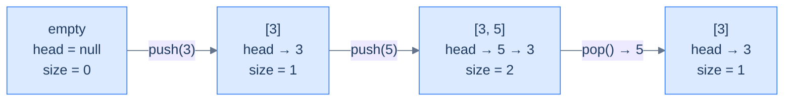

# 3. Linked-List Implementation of Stacks

## The Hook

Imagine the array-backed stack from the last lesson, but instead of pre-allocating a fixed-size buffer, every push *creates a brand-new node on the fly* and links it onto the front of a singly-linked list. The "top of the stack" is whatever the `head` pointer is currently pointing at. Push? Allocate a new node, point it at the old head, swing the head to the new node — three pointer moves, all O(1). Pop? Read the head's value, swing the head to `head.next`, free the old node — three pointer moves, all O(1).

There's no fixed capacity. There's no resize cost. There's no "stack overflow" until the operating system itself runs out of memory. Every push is the same constant-time work; every pop is the same constant-time work; the asymptotics are *identical* to the array version, but the trade-offs are different in ways that matter on real hardware:

- **No upfront allocation** — a million-capacity array reserves a million slots even if you only ever push five. A linked list grows one node at a time.
- **No resize spikes** — array stacks that grow by doubling pay an occasional O(N) cost; linked-list stacks pay O(1) every time, predictably.
- **But: no cache locality** — every node is a separate heap allocation, scattered across RAM. The CPU can't prefetch the "next" item on pop because it doesn't know where it lives until it dereferences `head.next`.

This lesson builds the linked-list stack end-to-end in Python and Java — same five operations, same O(1) cost, but a completely different memory model. The kind of trade-off you make consciously in production code: array stacks for speed-on-known-workloads, linked-list stacks for unbounded-or-bursty-workloads.

---

## Table of contents

1. [Structure of a linked-list-based stack](#structure-of-a-linked-list-based-stack)
2. [Implementing the stack class using a linked list](#implementing-the-stack-class-using-a-linked-list)
3. [Determining the size of the stack](#determining-the-size-of-the-stack)
4. [Checking if the stack is empty](#checking-if-the-stack-is-empty)
5. [Accessing the top of the stack](#accessing-the-top-of-the-stack)
6. [Pushing an item onto the stack](#pushing-an-item-onto-the-stack)
7. [Popping an item from the stack](#popping-an-item-from-the-stack)
8. [Design a stack using a linked list](#design-a-stack-using-a-linked-list)

***

# Structure of a linked-list-based stack

A linked-list stack stores its top at the **head** of a singly linked list. Three fields wrap that list:

```d2
direction: right

cls: "Stack (linked-list-backed)" {
  grid-rows: 3
  grid-gap: 0
  h: "head: pointer to top node (null if empty)"
  s: "currentSize: number of nodes"
  c: "capacity: max nodes allowed"
}

n1: |md
  **val: 9**

  next: ●
| {style.fill: "#fef9c3"; style.stroke: "#f59e0b"}

n2: |md
  val: 7

  next: ●
|

n3: |md
  val: 5

  next: null
|

cls.h -> n1
n1 -> n2
n2 -> n3
```

<p align="center"><strong>Linked-list stack — <code>head</code> always points at the top. To push, allocate a new node and make it the new head; to pop, advance head to <code>head.next</code> and free the old head. Both are O(1) regardless of the stack's depth.</strong></p>

## State information

### Top

In the array version, "top" was an index. Here, it's a **pointer**. `head` references the most-recently-pushed node, or is `null` if the stack is empty. Every operation that touches the top — `push`, `pop`, `top()` — does so through this pointer.

> *Why is the top at the* head *of the list and not the tail?*
>
> Because head insertion and head deletion are O(1) — no traversal required. Tail insertion and tail deletion are O(N) without a tail pointer (you'd have to walk the list to find the second-to-last node before you could re-link). For a stack, where every operation is on the top, putting the top at the head is the only choice that keeps the implementation O(1).

### Current size

A linked list doesn't know its own length unless someone counts. We could compute size by walking the list — that's O(N). Or we maintain an integer `currentSize` that's incremented on push and decremented on pop. We'll do the latter — `size()` becomes O(1).

### Capacity

`capacity` is the maximum allowed size. A *bounded* linked-list stack rejects pushes when `currentSize == capacity`; an *unbounded* one ignores capacity entirely. We'll build the bounded version to mirror the array stack's interface — same contract, different storage.



<p align="center"><strong>Lifecycle — every push prepends a node at the head and bumps size; every pop removes the head and drops size. The list grows and shrinks at the same end, perfectly mirroring the LIFO contract.</strong></p>

***

# Implementing the stack class using a linked list

Two pieces: a tiny `ListNode` type for the chain, and the `Stack` class that wraps it.

<details>
<summary><h2>Linked list node</h2></summary>


A node holds a value and a pointer to the next node. That's the entire definition. The first lesson of the linked-list section already covered this, so we'll keep it minimal.

```d2
direction: right

n: ListNode {
  grid-columns: 2
  grid-gap: 0
  v: |md
    val

    (int)
  |
  nx: |md
    next

    (pointer)
  |
}
```

<p align="center"><strong>The chain node — one value plus one pointer. Push allocates one of these; pop frees one.</strong></p>

</details>
<details>
<summary><h2>Stack class — skeleton</h2></summary>


The class encapsulates `head`, `currentSize`, and `capacity`, exposing the same five operations as the array version.


```python run
# Instantiate a stack object from the stack class
st = Stack(9)

# Push some data into the stack
st.push(1)
st.push(4)
st.push(5)
st.push(9)

# Pop data from the stack
st.pop()

# Get the top value
x = st.top()
```

```java run
// Instantiate a stack object from the stack class
Stack st = new Stack(9);

// Push some data into the stack
st.push(1);
st.push(4);
st.push(5);
st.push(9);

// Pop data from the stack
st.pop();

// Get the top value
int x = st.top();
```

</details>


***

# Determining the size of the stack

We maintain `currentSize` as a counter that's bumped on push and dropped on pop, so `size()` is a single integer read.

> *Why a counter and not a list walk?*
>
> Walking the list is O(N). Maintaining a counter is O(1) per mutation, O(1) per query. The extra integer is a tiny memory cost for a huge speed win — and it lets us cheaply check capacity on every push.

> **Algorithm**
>
> -   **Step 1:** Return `currentSize`.

<details>
<summary><h2>Solution &amp; Analysis</h2></summary>

### Implementation

```python run
from typing import Optional

"""
Definition for singly-linked list.
class ListNode:
    def __init__(self, val):
        self.val = val
        self.next = None
"""

class Stack:
    def __init__(self, capacity: int):

        # Reference to the head of the stack
        self.head: Optional[ListNode] = None

        # Maximum capacity of the stack
        self.capacity: int = capacity

        # Current number of elements in the stack
        self.current_size: int = 0

    def size(self) -> int:

        # Return the current number of elements in the stack
        return self.current_size
```

```java run
/**
 * Definition for singly-linked list.
 * class ListNode {
 *     int val;
 *     ListNode next;
 *     ListNode() {}
 *     ListNode(int val) { this.val = val; }
 * };
 */

class Stack {

    // Reference to the head of the stack
    public ListNode head;

    // Maximum capacity of the stack
    public int capacity;

    // Current number of elements in the stack
    public int currentSize;

    public Stack(int capacity) {

        // Initialize the capacity of the stack
        this.capacity = capacity;

        // Initialize the currentSize to zero
        this.currentSize = 0;

        // Initialize the head reference to null
        this.head = null;
    }

    public int size() {

        // Return the current number of elements in the stack
        return currentSize;
    }
}
```

### Complexity Analysis

> **All cases** — Time: **O(1)** | Space: **O(1)**

</details>

***

# Checking if the stack is empty

Same approach as before — directly compare against the size counter, or equivalently check whether `head == null`. Either works; the counter check is more uniform.

> **Algorithm**
>
> -   **Step 1:** Return `currentSize == 0` (equivalently, `head == null`).

<details>
<summary><h2>Solution &amp; Analysis</h2></summary>

### Implementation

```python run
from typing import Optional

"""
Definition for singly-linked list.
class ListNode:
    def __init__(self, val):
        self.val = val
        self.next = None
"""

class Stack:
    def __init__(self, capacity: int):

        # Reference to the head of the stack
        self.head: Optional[ListNode] = None

        # Maximum capacity of the stack
        self.capacity: int = capacity

        # Current number of elements in the stack
        self.current_size: int = 0

    def size(self) -> int:

        # Return the current number of elements in the stack
        return self.current_size

    def empty(self) -> bool:

        # Return True if the stack is empty, False otherwise
        return self.current_size == 0
```

```java run
/**
 * Definition for singly-linked list.
 * class ListNode {
 *     int val;
 *     ListNode next;
 *     ListNode() {}
 *     ListNode(int val) { this.val = val; }
 * };
 */

class Stack {

    // Reference to the head of the stack
    public ListNode head;

    // Maximum capacity of the stack
    public int capacity;

    // Current number of elements in the stack
    public int currentSize;

    public Stack(int capacity) {

        // Initialize the capacity of the stack
        this.capacity = capacity;

        // Initialize the currentSize to zero
        this.currentSize = 0;

        // Initialize the head reference to null
        this.head = null;
    }

    public int size() {

        // Return the current number of elements in the stack
        return currentSize;
    }

    public boolean empty() {

        // Return true if the stack is empty, false otherwise
        return currentSize == 0;
    }
}
```

### Complexity Analysis

> **All cases** — Time: **O(1)** | Space: **O(1)**

</details>

***

# Accessing the top of the stack

`head` *is* the top, so reading it is one pointer dereference. Two cases:

<details>
<summary><h2>1. Stack is empty</h2></summary>


`head == null`. There's no top to return — return `-1`.

</details>
<details>
<summary><h2>2. Stack is not empty</h2></summary>


Return `head.val`. The list and head pointer are unchanged.

```mermaid
---
config:
  theme: base
  themeVariables:
    primaryColor: "#dbeafe"
    primaryBorderColor: "#3b82f6"
    primaryTextColor: "#1e3a5f"
    lineColor: "#64748b"
    secondaryColor: "#ede9fe"
    tertiaryColor: "#fef9c3"
---
flowchart LR
    Q["top()"] --> E{"head == null?"}
    E -->|"yes"| R1["return -1"]
    E -->|"no"|  R2["return head.val"]
```

<p align="center"><strong>Top — peek through the head pointer. The list itself is untouched, so back-to-back <code>top()</code> calls are idempotent.</strong></p>

> **Algorithm**
>
> -   **Step 1:** If `empty()`, return `-1`.
> -   **Step 2:** Return `head.val`.

</details>
<details>
<summary><h2>Solution &amp; Analysis</h2></summary>

### Implementation

```python run
from typing import Optional

"""
Definition for singly-linked list.
class ListNode:
    def __init__(self, val):
        self.val = val
        self.next = None
"""

class Stack:
    def __init__(self, capacity: int):

        # Reference to the head of the stack
        self.head: Optional[ListNode] = None

        # Maximum capacity of the stack
        self.capacity: int = capacity

        # Current number of elements in the stack
        self.current_size: int = 0

    def size(self) -> int:

        # Return the current number of elements in the stack
        return self.current_size

    def empty(self) -> bool:

        # Return True if the stack is empty, False otherwise
        return self.current_size == 0

    def top(self) -> int:
        if self.empty():

            # If the stack is empty, return -1 (an invalid value)
            return -1

        # Return the value of the element at the top of the stack
        if self.head:
            return self.head.val
        return -1
```

```java run
/**
 * Definition for singly-linked list.
 * class ListNode {
 *     int val;
 *     ListNode next;
 *     ListNode() {}
 *     ListNode(int val) { this.val = val; }
 * };
 */

class Stack {

    // Reference to the head of the stack
    public ListNode head;

    // Maximum capacity of the stack
    public int capacity;

    // Current number of elements in the stack
    public int currentSize;

    public Stack(int capacity) {

        // Initialize the capacity of the stack
        this.capacity = capacity;

        // Initialize the currentSize to zero
        this.currentSize = 0;

        // Initialize the head reference to null
        this.head = null;
    }

    public int size() {

        // Return the current number of elements in the stack
        return currentSize;
    }

    public boolean empty() {

        // Return true if the stack is empty, false otherwise
        return currentSize == 0;
    }

    public int top() {
        if (empty()) {

            // If the stack is empty, return -1 (an invalid value)
            return -1;
        }

        // Return the value of the element at the top of the stack
        return head.val;
    }
}
```

### Complexity Analysis

> **All cases** — Time: **O(1)** | Space: **O(1)**

</details>

***

# Pushing an item onto the stack

Push allocates a new node, links it to the old head, and makes it the new head.

<details>
<summary><h2>1. Stack is full</h2></summary>


`currentSize == capacity`. Reject the push — return `false`.

</details>
<details>
<summary><h2>2. Stack is not full</h2></summary>


Three steps, all O(1):

1. Allocate a new node `newNode` with the given value.
2. Set `newNode.next = head` (the old top is now the second element).
3. Set `head = newNode` and increment `currentSize`.

The order of those three steps matters: if you set `head = newNode` *before* setting `newNode.next = head`, you'll set `newNode.next` to itself, creating a cycle of length 1. Always rewire the new node's `next` *first*, then update `head`.

```d2
direction: right

before: "before push(9)" {
  direction: right
  h1: head
  n1: "7"
  n2: "5"
  nul1: null
  h1 -> n1
  n1 -> n2
  n2 -> nul1
}

after: "after push(9)" {
  direction: right
  h2: head
  n3: "9" {style.fill: "#dcfce7"; style.stroke: "#22c55e"}
  n4: "7"
  n5: "5"
  nul2: null
  h2 -> n3
  n3 -> n4
  n4 -> n5
  n5 -> nul2
}

before -> after
```

<p align="center"><strong>Push — the new node lands at the head; the old head becomes <code>newNode.next</code>. Three pointer assignments, regardless of how many nodes are already in the list.</strong></p>

> **Algorithm**
>
> -   **Step 1:** If `currentSize == capacity`, return `false`.
> -   **Step 2:** Create a new node `newNode` with the given value.
> -   **Step 3:** `newNode.next = head; head = newNode; currentSize++`.
> -   **Step 4:** Return `true`.

</details>
<details>
<summary><h2>Solution &amp; Analysis</h2></summary>

### Implementation

```python run
from typing import Optional

"""
Definition for singly-linked list.
class ListNode:
    def __init__(self, val):
        self.val = val
        self.next = None
"""

class Stack:
    def __init__(self, capacity: int):

        # Reference to the head of the stack
        self.head: Optional[ListNode] = None

        # Maximum capacity of the stack
        self.capacity: int = capacity

        # Current number of elements in the stack
        self.current_size: int = 0

    def size(self) -> int:

        # Return the current number of elements in the stack
        return self.current_size

    def empty(self) -> bool:

        # Return True if the stack is empty, False otherwise
        return self.current_size == 0

    def top(self) -> int:
        if self.empty():

            # If the stack is empty, return -1 (an invalid value)
            return -1

        # Return the value of the element at the top of the stack
        if self.head:
            return self.head.val
        return -1

    def push(self, val: int) -> bool:
        if self.current_size == self.capacity:

            # If the stack is already full, return False
            return False

        # Create a new node with the given val
        new_node = ListNode(val)

        # Set the next reference of the new node to the current head
        new_node.next = self.head

        # Update the head reference to the new node
        self.head = new_node

        # Increment the count of elements in the stack
        self.current_size += 1

        # Return True to indicate a successful push operation
        return True
```

```java run
/**
 * Definition for singly-linked list.
 * class ListNode {
 *     int val;
 *     ListNode next;
 *     ListNode() {}
 *     ListNode(int val) { this.val = val; }
 * };
 */

class Stack {

    // Reference to the head of the stack
    public ListNode head;

    // Maximum capacity of the stack
    public int capacity;

    // Current number of elements in the stack
    public int currentSize;

    public Stack(int capacity) {

        // Initialize the capacity of the stack
        this.capacity = capacity;

        // Initialize the currentSize to zero
        this.currentSize = 0;

        // Initialize the head reference to null
        this.head = null;
    }

    public int size() {

        // Return the current number of elements in the stack
        return currentSize;
    }

    public boolean empty() {

        // Return true if the stack is empty, false otherwise
        return currentSize == 0;
    }

    public int top() {
        if (empty()) {

            // If the stack is empty, return -1 (an invalid value)
            return -1;
        }

        // Return the value of the element at the top of the stack
        return head.val;
    }

    public boolean push(int val) {
        if (currentSize == capacity) {

            // If the stack is already full, return false
            return false;
        }

        // Create a new node with the given val
        ListNode newNode = new ListNode(val);

        // Set the next reference of the new node to the current head
        newNode.next = head;

        // Update the head reference to the new node
        head = newNode;

        // Increment the count of elements in the stack
        currentSize++;

        // Return true to indicate a successful push operation
        return true;
    }
}
```

### Complexity Analysis

> **All cases** — Time: **O(1)** | Space: **O(1)** (one node allocated per push)

</details>

***

# Popping an item from the stack

Pop removes the head node, returns its value, and frees the memory.

<details>
<summary><h2>1. Stack is empty</h2></summary>


`head == null`. Return `-1`.

</details>
<details>
<summary><h2>2. Stack is not empty</h2></summary>


Three steps:

1. Save `head.val` into a temporary.
2. Save the old head pointer (so we can free it).
3. Advance `head = head.next` and decrement `currentSize`.
4. Free (delete) the saved old head and return the saved value.

The "save old head before moving" sequence matters in languages with manual memory management — if you advance `head` first and *then* try to delete the old head, you've already lost the pointer to it.

```d2
direction: right

before: "before pop()" {
  direction: right
  h1: head
  n1: "9 ← will be freed" {style.fill: "#fee2e2"; style.stroke: "#ef4444"}
  n2: "7"
  n3: "5"
  nul1: null
  h1 -> n1
  n1 -> n2
  n2 -> n3
  n3 -> nul1
}

after: "after pop() → 9" {
  direction: right
  h2: head
  n4: "7"
  n5: "5"
  nul2: null
  h2 -> n4
  n4 -> n5
  n5 -> nul2
}

before -> after
```

<p align="center"><strong>Pop — read the head's value, advance head, free the old head. The list shrinks by one node from the front.</strong></p>

> **Algorithm**
>
> -   **Step 1:** If `empty()`, return `-1`.
> -   **Step 2:** Save `value = head.val` and `temp = head`.
> -   **Step 3:** `head = head.next; currentSize--`.
> -   **Step 4:** Free `temp` (in languages without GC); return `value`.

</details>
<details>
<summary><h2>Solution &amp; Analysis</h2></summary>

### Implementation

```python run
class _ListNode:
    def __init__(self, v): self.val, self.next = v, None

class Stack:
    def __init__(self, c): self.capacity, self.head, self.current_size = c, None, 0
    def empty(self): return self.current_size == 0
    def push(self, v):
        if self.current_size == self.capacity: return False
        n = _ListNode(v); n.next = self.head; self.head = n
        self.current_size += 1
        return True
    def pop(self):
        if self.empty(): return -1
        value     = self.head.val
        self.head = self.head.next      # GC reclaims the old head node
        self.current_size -= 1
        return value

s = Stack(3); s.push(1); s.push(2); s.push(3)
print(s.pop(), s.pop(), s.pop(), s.pop())   # 3 2 1 -1
```

```java run
public class Main {
    static class ListNode { int val; ListNode next; ListNode(int v){ val=v; } }
    static class Stack {
        private ListNode head; private int currentSize, capacity;
        Stack(int c){ capacity = c; }
        boolean empty(){ return currentSize == 0; }
        boolean push(int v){
            if (currentSize == capacity) return false;
            ListNode n = new ListNode(v); n.next = head; head = n;
            currentSize++; return true;
        }
        int pop(){
            if (empty()) return -1;
            int value = head.val;
            head      = head.next;       // old head becomes garbage
            currentSize--;
            return value;
        }
    }
    public static void main(String[] args){
        Stack s = new Stack(3);
        s.push(1); s.push(2); s.push(3);
        System.out.println(s.pop() + " " + s.pop() + " " + s.pop() + " " + s.pop());
    }
}
```

### Complexity Analysis

> **All cases** — Time: **O(1)** | Space: **O(1)** (one node freed per pop)

</details>

***

# Design a stack using a linked list

## Problem Statement

Implement the same `Stack` class from the array-implementation lesson, but **backed by a singly linked list** instead of an array.

> -   **`Stack(int capacity)`** — initialise with the given capacity.
> -   **`size()`** — current size.
> -   **`empty()`** — is the stack empty?
> -   **`top()`** — value at the top, or `-1` if empty.
> -   **`push(int val)`** — push onto the top; return `true` on success, `false` if full.
> -   **`pop()`** — pop and return the top, or `-1` if empty.

> **Constraint:** Use a **linked list** as the internal data structure.

> **Example:** identical to the array version. Same input, same output.

<details>
<summary><h2>Solution</h2></summary>


The full implementation, in Python and Java, combining everything we built incrementally above.


```python run
from typing import Optional

class ListNode:
    def __init__(self, val):
        self.val = val
        self.next = None


class Stack:
    def __init__(self, capacity: int):

        # Reference to the head of the stack
        self.head: Optional[ListNode] = None

        # Maximum capacity of the stack
        self.capacity: int = capacity

        # Current number of elements in the stack
        self.current_size: int = 0

    def size(self) -> int:

        # Return the current number of elements in the stack
        return self.current_size

    def empty(self) -> bool:

        # Return True if the stack is empty, False otherwise
        return self.current_size == 0

    def top(self) -> int:
        if self.empty():

            # If the stack is empty, return -1 (an invalid value)
            return -1

        # Return the value of the element at the top of the stack
        if self.head:
            return self.head.val
        return -1

    def push(self, val: int) -> bool:
        if self.current_size == self.capacity:

            # If the stack is already full, return False
            return False

        # Create a new node with the given val
        new_node = ListNode(val)

        # Set the next reference of the new node to the current head
        new_node.next = self.head

        # Update the head reference to the new node
        self.head = new_node

        # Increment the count of elements in the stack
        self.current_size += 1

        # Return True to indicate a successful push operation
        return True

    def pop(self) -> int:
        if self.empty():

            # If the stack is empty, return -1 (an invalid value)
            return -1

        # Store the value of the element at the top of the stack
        if self.head:
            value: int = self.head.val

        # Create a temporary reference to the current head
        temp: Optional[ListNode] = self.head

        # Update the head reference to the next node
        if self.head:
            self.head = self.head.next

        # Delete the old head node to free memory (automatically handled
        # in Python)
        del temp

        # Decrement the count of elements in the stack
        self.current_size -= 1

        # Return the value of the popped element
        return value


# Example from the problem statement
s = Stack(2)
print(s.push(2))   # True
print(s.push(3))   # True
print(s.top())     # 3
print(s.empty())   # False
print(s.pop())     # 3
print(s.top())     # 2
print(s.push(8))   # True
print(s.push(9))   # False — stack is full
print(s.empty())   # False
```

```java run
import java.util.*;

public class Main {
    static class ListNode {
        int val;
        ListNode next;
        ListNode() {}
        ListNode(int val) { this.val = val; }
    }

    static class Stack {

        // Reference to the head of the stack
        private ListNode head;

        // Maximum capacity of the stack
        private int capacity;

        // Current number of elements in the stack
        private int currentSize;

        public Stack(int capacity) {

            // Initialize the capacity of the stack
            this.capacity = capacity;

            // Initialize the currentSize to zero
            this.currentSize = 0;

            // Initialize the head reference to null
            this.head = null;
        }

        public int size() {

            // Return the current number of elements in the stack
            return currentSize;
        }

        public boolean empty() {

            // Return true if the stack is empty, false otherwise
            return currentSize == 0;
        }

        public int top() {
            if (empty()) {

                // If the stack is empty, return -1 (an invalid value)
                return -1;
            }

            // Return the value of the element at the top of the stack
            return head.val;
        }

        public boolean push(int val) {
            if (currentSize == capacity) {

                // If the stack is already full, return false
                return false;
            }

            // Create a new node with the given val
            ListNode newNode = new ListNode(val);

            // Set the next reference of the new node to the current head
            newNode.next = head;

            // Update the head reference to the new node
            head = newNode;

            // Increment the count of elements in the stack
            currentSize++;

            // Return true to indicate a successful push operation
            return true;
        }

        public int pop() {
            if (empty()) {

                // If the stack is empty, return -1 (an invalid value)
                return -1;
            }

            // Store the value of the element at the top of the stack
            int value = head.val;

            // Create a temporary reference to the current head
            ListNode temp = head;

            // Update the head reference to the next node
            head = head.next;

            // Delete the old head node to free memory
            temp = null;

            // Decrement the count of elements in the stack
            currentSize--;

            // Return the value of the popped element
            return value;
        }
    }

    public static void main(String[] args) {
        // Example from the problem statement
        Stack s = new Stack(2);
        System.out.println(s.push(2));   // true
        System.out.println(s.push(3));   // true
        System.out.println(s.top());     // 3
        System.out.println(s.empty());   // false
        System.out.println(s.pop());     // 3
        System.out.println(s.top());     // 2
        System.out.println(s.push(8));   // true
        System.out.println(s.push(9));   // false — stack is full
        System.out.println(s.empty());   // false
    }
}
```

</details>
<details>
<summary><h2>Final Takeaway</h2></summary>


Linked-list and array stacks implement the same interface with the same asymptotic costs but different real-world behaviour. Three lessons:

1. **Same complexity, different memory model.** Both implementations are O(1) per operation. The difference is in *how* that constant cost is realised: an array stack writes to one slot of a contiguous buffer (cache-friendly, requires up-front allocation); a linked-list stack allocates and frees one node per operation (no upfront allocation, no cache locality).
2. **Maintain `currentSize` explicitly.** Walking the list to count nodes is O(N); a counter makes `size()` and `empty()` constant time at the cost of one integer.
3. **Wire the new node's `next` first, then move `head`.** The order of those three pointer assignments is the most common bug in linked-list pushes — get it wrong and you create a self-loop.

> **Choosing between array and linked-list stacks:**
>
> | Need | Pick |
> |---|---|
> | Predictable upper bound on size, performance-critical | array |
> | Bursty workload, unknown maximum size | linked list (or growable array) |
> | Memory-constrained, can afford one buffer | array |
> | Many short-lived stacks (one per call site, etc.) | array (small fixed-size for stack-allocated speed) |
> | Want guaranteed O(1) push (no occasional resize spike) | linked list |
>
> Most language standard libraries default to growable arrays (`std::stack` over `std::deque`, Python `list`, Java `ArrayDeque`) because the amortised cost wins on most workloads. Linked-list stacks shine when you have many small stacks, when allocation cost is dominated by something else (a GC tier, a slab allocator), or when you want predictable per-operation latency.

> *Coming up — we shift gears from implementations to *applications*. The next three lessons cover **expression evaluation**: infix vs. postfix vs. prefix notation, evaluating a postfix expression with a stack, and converting infix to postfix using two stacks. These are some of the most beautiful uses of a stack in all of computer science — and the foundation of every calculator, every parser, and every compiler you'll ever read about.*

</details>