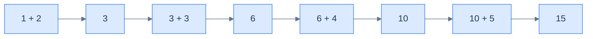
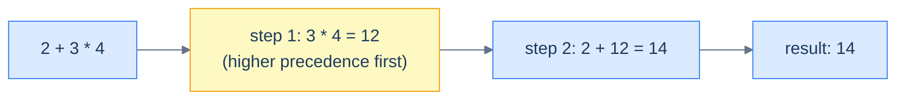
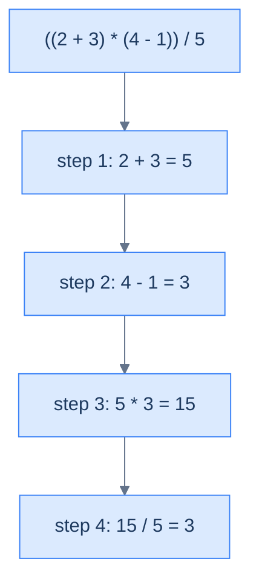
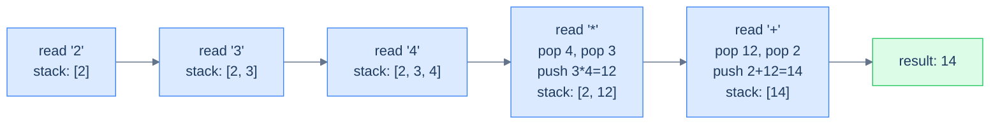
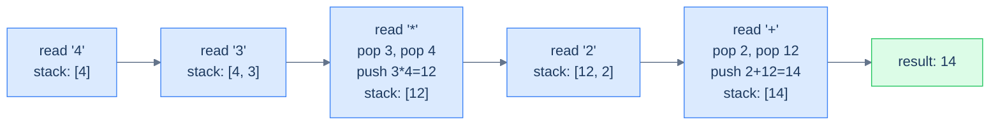

# 4. Infix, Postfix, and Prefix Notations

## The Hook

Type `2 + 3 * 4` into a calculator. The answer is **14**, not **20**. Somewhere between your keystrokes and the display, the calculator reordered the work — it solved the multiplication before the addition, even though the addition came first in the input. That reordering is *easy* for humans (we just "see" the precedence), but it's a surprisingly hard problem for a computer. The CPU can only do one binary operation at a time. It has to *plan* — pick which operation to do first, save the partial result somewhere, come back later for the rest.

What if we could write the same expression so that the order of operations is **encoded by position alone** — no precedence rules, no parentheses, no jumping around? `2 3 4 * +` says: take 3 and 4, multiply them, take the result and 2, add them. Read left-to-right, evaluate as you go, never look back. The CPU loves this; a stack-based evaluator handles it in 10 lines of code with O(N) time.

That's **postfix notation** — operators *after* the operands. There's also **prefix** notation (operators *before*), and the human-friendly **infix** notation (operators *between*). Three ways to write the same maths; three different complexity profiles for *evaluation*. The next two lessons will show you how to evaluate postfix with a stack (lesson 5) and how to convert infix to postfix using *two* stacks (lesson 6) — but first, we need to feel why infix is so painful for computers and why postfix and prefix are such elegant cures.

This lesson is the smallest in the section. There's no code. Just three notations and a clear understanding of why one of them was the best thing that happened to compiler design in the 20th century.

---

## Table of contents

1. [Understanding the infix notation](#understanding-the-infix-notation)
2. [Understanding the postfix notation](#understanding-the-postfix-notation)
3. [Understanding the prefix notation](#understanding-the-prefix-notation)

***

# Understanding the infix notation

The notation we all learned in school: the operator sits **between** its two operands. `2 + 3` reads as "two plus three". `a * b - c` reads naturally left-to-right. This is **infix notation**, and it's the format every human-facing expression you'll ever see uses.

```d2
direction: right

row: "" {
  grid-columns: 3
  grid-gap: 0
  l: "operand₁"
  o: "operator" {style.fill: "#fef9c3"; style.stroke: "#f59e0b"}
  r: "operand₂"
}
```

<p align="center"><strong>Infix layout — operator sits <em>between</em> the operands. Natural to read; ambiguous without precedence rules and parentheses.</strong></p>

A few examples:

| Infix expression | Meaning |
|---|---|
| `3 + 4` | three plus four |
| `2 + 3 * 4` | two plus (three times four), thanks to precedence |
| `(2 + 3) * 4` | (two plus three), all times four |
| `a + b * c - d` | mixes precedence; `*` binds tighter than `+`/`-` |
| `2 ^ 3 ^ 2` | right-associative; `^` binds right-to-left |

Infix is intuitive for *us*, but it's a nightmare for a CPU. Let's see why.

## Challenges with the infix notation

A typical CPU performs one binary operation at a time — it consumes two operands, runs `add` (or `mul`, or `sub`), and produces one result. To evaluate any expression with more than one operator, the CPU has to break the work into a *sequence* of binary operations, in the *correct order*, saving partial results between steps.

```d2
direction: right

a: "a"
b: "b"
cpu: |md
  CPU

  (add)
|
r: "result = a + b"

a -> cpu
b -> cpu
cpu -> r
```

<p align="center"><strong>The atomic CPU operation — two operands in, one result out. Anything more complicated has to be decomposed into a chain of these.</strong></p>

For a single-operator expression like `1 + 2 + 3 + 4 + 5`, the decomposition is mechanical: just chain additions left-to-right.



<p align="center"><strong>Single-operator expression — chain left-to-right, store the running result, repeat. The CPU does <code>n − 1</code> additions for <code>n</code> operands. Easy.</strong></p>

But once you mix operators of different *precedence*, the order is no longer left-to-right. `2 + 3 * 4` requires the multiplication first — even though it appears later in the expression — because `*` has higher precedence than `+`.

| Operator | Precedence (high → low) | Associativity |
|---|---|---|
| `^` (power) | 1 (highest) | right-to-left |
| `*`, `/` | 2 | left-to-right |
| `+`, `-` | 3 (lowest) | left-to-right |



<p align="center"><strong>Mixed-precedence infix — the CPU has to <em>jump</em> to the multiplication, evaluate it, store 12 somewhere, then come back to do the addition. Three steps, two of them in non-source order.</strong></p>

Add parentheses and the problem gets worse. `(2 + 3) * 4` overrides the natural precedence — now the addition has to happen first because the parentheses say so. Worse still, parentheses can nest arbitrarily deep: `((a + b) * (c - d)) / e`. To evaluate this, the CPU has to *parse* the expression into a tree, walk the tree in post-order, and stitch the partial results back together.



<p align="center"><strong>Nested-parenthesised infix — every level of parens is a context switch. The CPU has to remember partial results from inner parens while it evaluates the surrounding expression. The expression looks linear; the evaluation is a tree walk.</strong></p>

The summary: **infix is easy for humans because we can see the whole thing at once and skip around. It's hard for computers because they read linearly and can only do one operation per step.** Compilers do solve this — but the solution involves parsing the infix into a *different* representation that's easier to evaluate. That different representation is what the next two notations buy us.

> *Predict before reading on — what if there were a notation where you could just read left-to-right, never look back, and the order of operations was guaranteed correct without any precedence rules or parentheses? Would that even be possible?*

***

# Understanding the postfix notation

Yes, it's possible. In 1924 the Polish mathematician **Jan Łukasiewicz** discovered that you could move the operator *after* its operands and the resulting notation needs *no precedence rules and no parentheses*. The notation became known as **Polish notation**; the variant where operators come *after* operands is called **reverse Polish** — but in computer science we usually call it **postfix**.

```d2
direction: right

row: "" {
  grid-columns: 3
  grid-gap: 0
  l: "operand₁"
  r: "operand₂"
  o: "operator" {style.fill: "#fef9c3"; style.stroke: "#f59e0b"}
}
```

<p align="center"><strong>Postfix layout — operands first, operator last. The operator "applies to the two most recent operands". Position encodes order; no parentheses needed.</strong></p>

## Examples

| Infix | Postfix |
|---|---|
| `3 + 4` | `3 4 +` |
| `2 + 3 * 4` | `2 3 4 * +` |
| `(2 + 3) * 4` | `2 3 + 4 *` |
| `a + b * c - d` | `a b c * + d -` |
| `(a + b) * (c - d) / e` | `a b + c d - * e /` |

Notice two beautiful properties of postfix:

1. **No parentheses anywhere.** They simply aren't needed — position alone determines order.
2. **No precedence rules.** `2 3 4 * +` and `2 3 + 4 *` use the same characters in different orders, and *the order itself* tells you which to do first. There's no ambiguity about whether `*` or `+` comes first; it's whatever appears first in the postfix stream.

## How postfix works

The evaluation rule is comically simple: **scan left-to-right; when you see an operand, remember it; when you see an operator, apply it to the two most-recently-remembered operands and remember the result.** That "remember the most-recent operands" pattern should sound familiar — it's exactly what a *stack* does.

Let's walk through `2 3 4 * +` step by step:



<p align="center"><strong>Postfix evaluation of <code>2 3 4 * +</code> — operands push, operators pop two and push one. The final stack contents <em>are</em> the answer. Notice the multiplication happens before the addition without any precedence rule — the postfix order encoded it.</strong></p>

Three properties of this algorithm matter:

- **Single pass, no look-ahead.** Read each token exactly once. Never go back.
- **The stack is the only memory.** Partial results live there until consumed by the next operator.
- **Precedence is encoded by position.** The operator that comes first in postfix is evaluated first — full stop.

Even brutally complex expressions are linear-time to evaluate this way. We'll build the actual evaluator in lesson 5.

***

# Understanding the prefix notation

If postfix is operators-after-operands, **prefix** is operators-*before*-operands. Same Polish-notation idea, mirrored. `+ 3 4` reads as "add 3 and 4". This is also called **Polish notation** (without the "reverse").

```d2
direction: right

row: "" {
  grid-columns: 3
  grid-gap: 0
  o: "operator" {style.fill: "#fef9c3"; style.stroke: "#f59e0b"}
  l: "operand₁"
  r: "operand₂"
}
```

<p align="center"><strong>Prefix layout — operator first, then operands. The operator "applies to the two operands that follow it". Same parenthesis-free, precedence-free advantages as postfix; opposite scan direction.</strong></p>

> **Important caveat** — prefix is **not** simply the reverse of postfix. Reversing `2 3 4 * +` gives `+ * 4 3 2`, which is *not* a valid prefix expression. The correct prefix for `2 + 3 * 4` is `+ 2 * 3 4`. The two notations are mirror images conceptually, but converting between them requires actual rewriting, not bit-flipping.

## Examples

| Infix | Prefix |
|---|---|
| `3 + 4` | `+ 3 4` |
| `2 + 3 * 4` | `+ 2 * 3 4` |
| `(2 + 3) * 4` | `* + 2 3 4` |
| `a + b * c - d` | `- + a * b c d` |
| `(a + b) * (c - d) / e` | `/ * + a b - c d e` |

## How prefix works

Same idea as postfix, but **scan right-to-left** instead of left-to-right. When you see an operand, remember it. When you see an operator, apply it to the two most-recently-remembered operands and remember the result.

`+ 2 * 3 4` evaluated right-to-left:



<p align="center"><strong>Prefix evaluation of <code>+ 2 * 3 4</code> — same single-pass, single-stack idea as postfix, but the scan goes right-to-left. The operator combines the two operands <em>after</em> it (which, when scanning right-to-left, are the two most recently seen operands).</strong></p>

> **Why does the operand order matter when popping?**
>
> For commutative operators (`+`, `*`) the popping order doesn't matter — `3 + 4` and `4 + 3` give the same result. But for non-commutative operators (`-`, `/`, `^`), it does. In **postfix**, the second operand popped is the *left* operand of the operator (because it was pushed first); in **prefix**, the second operand popped is the *right* operand (because the scan is reversed). Watch out for this when implementing the evaluator — getting it wrong gives correct answers for `+` and `*` but silently wrong answers for `-` and `/`.

## Postfix vs. prefix

In practice, **postfix is the more common choice**. Why?

- The natural left-to-right reading direction matches every other text scan in computing.
- The Forth and PostScript languages use postfix; Reverse Polish HP calculators use postfix; the JVM's bytecode operand stack is essentially postfix.
- LISP famously uses *prefix* (every form is `(op arg1 arg2 ...)`), but with explicit parentheses — which is closer to *parenthesised prefix* than to bare prefix.

For the rest of this section, we'll focus on postfix evaluation and infix-to-postfix conversion. The prefix versions are direct mirror images; once you understand postfix, prefix is a 5-minute extension.

***

## Final Takeaway

Three notations, one piece of mathematics, three different evaluation profiles:

| Notation | Operator placement | Needs parentheses? | Precedence rules? | Scan direction |
|---|---|---|---|---|
| **Infix** | between operands (`a + b`) | yes, for ambiguity | yes, fundamental | bidirectional / tree walk |
| **Postfix** | after operands (`a b +`) | no | no | left → right |
| **Prefix** | before operands (`+ a b`) | no | no | right → left |

The takeaway:

1. **Infix is for humans, postfix/prefix are for machines.** Compilers and calculators take infix in, parse it into postfix (or an equivalent abstract syntax tree), and evaluate the postfix.
2. **Postfix evaluation is a stack.** Operands push; operators pop two, compute, push one. Single pass, O(N), no precedence rules anywhere in sight.
3. **Position is the precedence.** What makes postfix and prefix work is that the *order* of tokens fully determines the order of evaluation. We don't *need* parens or precedence — they're baked in.

> *Coming up — we build the postfix evaluator. Read each token, push or pop on a stack, return the lone item left at the end. Lesson 5 turns this lesson's idea into running code in Python and Java, with edge cases (operand order for non-commutative operators, malformed expressions, single-operand expressions) handled cleanly.*
