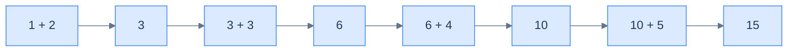
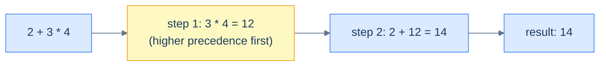
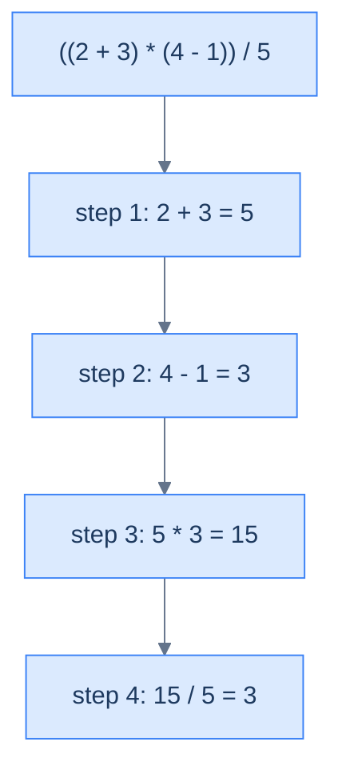
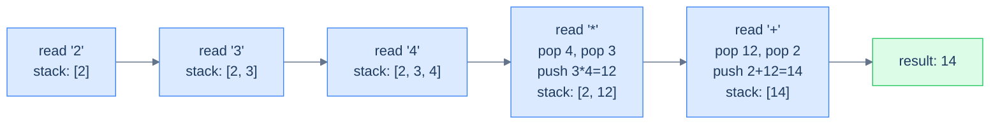
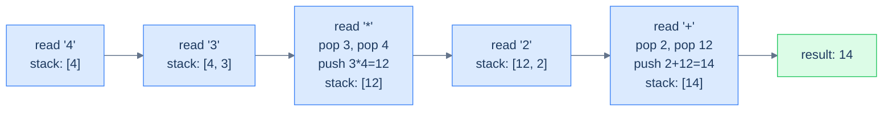

# 4. Infix, Postfix, and Prefix Notations

## The Hook

Type `2 + 3 * 4` into a calculator. The answer is **14**, not **20**. Somewhere between your keystrokes and the display, the calculator reordered the work. It solved the multiplication before the addition, even though the addition appeared first. That reordering is *easy* for a human — we just "see" the precedence — but it is a surprisingly hard problem for a computer. The CPU can only do one binary operation at a time. So it has to *plan*: pick which operation to run first, save the partial result somewhere, come back later for the rest.

What if we could write the same expression so the order of operations is **encoded by position alone** — no precedence rules, no parentheses, no jumping around? `2 3 4 * +` says: take 3 and 4, multiply them, then take the result and 2 and add them. Read left-to-right, evaluate as you go, never look back. The CPU loves this. A stack-based evaluator handles it in ten lines of code, in `O(N)` time and `O(N)` space.

That's **postfix notation** — operators *after* the operands. There's also **prefix** notation (operators *before*) and the human-friendly **infix** notation (operators *between*). Three ways to write the same maths; three different complexity profiles for *evaluation*. Lesson 5 will show you how to evaluate postfix with a stack, and lesson 6 how to convert infix to postfix using *two* stacks. First, we need to feel why infix is so painful for computers and why postfix and prefix are such elegant cures.

This lesson is the smallest in the section. There is no code here — just three notations, and a clear understanding of why one of them was the best thing that happened to compiler design in the 20th century.

---

## Table of contents

1. [Understanding the problem](#understanding-the-problem)
2. [Understanding the infix notation](#understanding-the-infix-notation)
3. [Understanding the postfix notation](#understanding-the-postfix-notation)
4. [Understanding the prefix notation](#understanding-the-prefix-notation)
5. [Supported operations](#supported-operations)
6. [Internal mechanics](#internal-mechanics)
7. [Working example](#working-example)
8. [Edge cases and pitfalls](#edge-cases-and-pitfalls)
9. [Production reality](#production-reality)
10. [Practice ladder](#practice-ladder)
11. [Quiz](#quiz)
12. [Further reading](#further-reading)
13. [Cross-links](#cross-links)
14. [Final takeaway](#final-takeaway)

***

# Understanding the Problem

A computer evaluates arithmetic one binary operation at a time, but the way humans write that arithmetic hides the order those operations must run in. The gap between "how the expression is written" and "the sequence of two-operand steps the CPU can actually execute" is the problem these three notations exist to bridge.

The hard part is not the arithmetic — it is recovering the *order*. In `2 + 3 * 4`, nothing in the left-to-right token stream says "do the multiply first". That ordering comes from two layers of rules the reader applies silently:

- **Precedence** — `*` and `/` bind tighter than `+` and `-`, so they evaluate first regardless of position.
- **Associativity** — same-precedence operators have a tie-break direction; `-` is left-to-right, `^` is right-to-left.
- **Parentheses** — an explicit override that can nest to any depth and outrank everything else.

To make this concrete: a human reads `(2 + 3) * 4`, jumps to the inner parentheses, evaluates `5`, then multiplies — three glances, two of them out of source order. A CPU cannot glance. It reads tokens in a line and must be *told* the order by an algorithm that parses precedence, associativity, and nesting first.

So the key idea is: **infix optimises for human reading; postfix and prefix optimise for machine evaluation.** The rest of this lesson defines all three notations. It shows why infix is expensive to mechanise, and how moving the operator to one side makes the evaluation order fall out for free.

# Understanding the infix notation

**Infix notation** places the operator **between** its two operands — the format every human-facing expression uses. `2 + 3` reads as "two plus three"; `a * b - c` reads naturally left-to-right. It is the notation taught in every school and printed in every textbook. That is exactly why a CPU cannot use it directly: the layout that helps a human read an expression is the layout that hides the evaluation order from a machine.

```d2
direction: right

row: "" {
  grid-columns: 3
  grid-gap: 0
  l: "operand₁"
  o: "operator" {style.fill: "#fef9c3"; style.stroke: "#f59e0b"}
  r: "operand₂"
}
```

<p align="center"><strong>Infix layout — operator sits <em>between</em> the operands. Natural to read; ambiguous without precedence rules and parentheses.</strong></p>

A few examples:

| Infix expression | Meaning |
|---|---|
| `3 + 4` | three plus four |
| `2 + 3 * 4` | two plus (three times four), thanks to precedence |
| `(2 + 3) * 4` | (two plus three), all times four |
| `a + b * c - d` | mixes precedence; `*` binds tighter than `+`/`-` |
| `2 ^ 3 ^ 2` | right-associative; `^` binds right-to-left |

Infix is intuitive for a human and hostile to a CPU. The next section shows why.

## Challenges with the infix notation

A typical CPU performs one binary operation at a time. It consumes two operands, runs `add` (or `mul`, or `sub`), and produces one result. To evaluate any expression with more than one operator, the CPU must break the work into a *sequence* of binary operations, in the *correct order*, saving partial results between steps.

```d2
direction: right

a: "a"
b: "b"
cpu: |md
  CPU

  (add)
|
r: "result = a + b"

a -> cpu
b -> cpu
cpu -> r
```

<p align="center"><strong>The atomic CPU operation — two operands in, one result out. Anything more complicated has to be decomposed into a chain of these.</strong></p>

For a single-operator expression like `1 + 2 + 3 + 4 + 5`, the decomposition is mechanical — chain the additions left-to-right.



<p align="center"><strong>Single-operator expression — chain left-to-right, store the running result, repeat. The CPU does <code>n − 1</code> additions for <code>n</code> operands. Easy.</strong></p>

But once you mix operators of different *precedence*, the order is no longer left-to-right. `2 + 3 * 4` requires the multiplication first — even though it appears later in the expression — because `*` has higher precedence than `+`.

| Operator | Precedence (high → low) | Associativity |
|---|---|---|
| `^` (power) | 1 (highest) | right-to-left |
| `*`, `/` | 2 | left-to-right |
| `+`, `-` | 3 (lowest) | left-to-right |



<p align="center"><strong>Mixed-precedence infix — the CPU has to <em>jump</em> to the multiplication, evaluate it, store 12 somewhere, then come back to do the addition. Three steps, two of them in non-source order.</strong></p>

Add parentheses and the problem gets worse. `(2 + 3) * 4` overrides the natural precedence — now the addition has to happen first because the parentheses say so. Worse still, parentheses can nest arbitrarily deep: `((a + b) * (c - d)) / e`. To evaluate this, the CPU has to *parse* the expression into a tree, walk the tree in post-order, and stitch the partial results back together.



<p align="center"><strong>Nested-parenthesised infix — every level of parens is a context switch. The CPU has to remember partial results from inner parens while it evaluates the surrounding expression. The expression looks linear; the evaluation is a tree walk.</strong></p>

So the tradeoff is: infix is easy for a human because we see the whole expression at once and skip around it; it is hard for a computer because a computer reads linearly and runs one operation per step. Compilers do solve this — but the solution is to parse the infix into a *different* representation that evaluates left-to-right. That different representation is exactly what the next two notations buy us.

> *Predict before reading on — what if there were a notation where you could just read left-to-right, never look back, and the order of operations was guaranteed correct without any precedence rules or parentheses? Would that even be possible?*

***

# Understanding the postfix notation

Yes, it's possible. The Polish mathematician **Jan Łukasiewicz** showed that moving the operator *after* its operands produces a notation that needs *no precedence rules and no parentheses*. The original form became known as **Polish notation**; the variant where operators come *after* the operands is called **reverse Polish** — but in computer science we usually call it **postfix**. <!-- VERIFY: Łukasiewicz introduced Polish notation around 1924; reverse Polish (postfix) is the later operator-after-operands variant. -->

```d2
direction: right

row: "" {
  grid-columns: 3
  grid-gap: 0
  l: "operand₁"
  r: "operand₂"
  o: "operator" {style.fill: "#fef9c3"; style.stroke: "#f59e0b"}
}
```

<p align="center"><strong>Postfix layout — operands first, operator last. The operator "applies to the two most recent operands". Position encodes order; no parentheses needed.</strong></p>

## Examples

| Infix | Postfix |
|---|---|
| `3 + 4` | `3 4 +` |
| `2 + 3 * 4` | `2 3 4 * +` |
| `(2 + 3) * 4` | `2 3 + 4 *` |
| `a + b * c - d` | `a b c * + d -` |
| `(a + b) * (c - d) / e` | `a b + c d - * e /` |

Notice two beautiful properties of postfix:

1. **No parentheses anywhere.** They are not needed at all — position alone determines order.
2. **No precedence rules.** `2 3 4 * +` and `2 3 + 4 *` use the same characters in different orders, and *the order itself* tells you which to do first. There's no ambiguity about whether `*` or `+` comes first; it's whatever appears first in the postfix stream.

## How postfix works

The evaluation rule is short: scan left-to-right; on an operand, remember it; on an operator, apply it to the two most-recently-remembered operands and remember the result. That "remember the most recent operands, consume them last" pattern is exactly what a **stack** does — last-in, first-out. The stack is not an optimisation bolted on afterwards; it is the natural shape of postfix evaluation.

Here is `2 3 4 * +` traced step by step:



<p align="center"><strong>Postfix evaluation of <code>2 3 4 * +</code> — operands push, operators pop two and push one. The final stack contents <em>are</em> the answer. Notice the multiplication happens before the addition without any precedence rule — the postfix order encoded it.</strong></p>

Three properties of this algorithm matter:

- **Single pass, no look-ahead.** Read each token exactly once. Never go back.
- **The stack is the only memory.** Partial results live there until consumed by the next operator.
- **Precedence is encoded by position.** The operator that comes first in postfix is evaluated first — full stop.

Even deeply nested expressions evaluate in `O(N)` time and `O(N)` space this way — `N` tokens scanned once, the stack holding at most `O(N)` operands. Lesson 5 builds the actual evaluator.

***

# Understanding the prefix notation

**Prefix notation** places the operator *before* its operands — the mirror image of postfix. `+ 3 4` reads as "add 3 and 4". This is the original **Polish notation**, without the "reverse". It shares postfix's two wins — no parentheses, no precedence rules — and differs in exactly one thing: the scan runs the other way.

```d2
direction: right

row: "" {
  grid-columns: 3
  grid-gap: 0
  o: "operator" {style.fill: "#fef9c3"; style.stroke: "#f59e0b"}
  l: "operand₁"
  r: "operand₂"
}
```

<p align="center"><strong>Prefix layout — operator first, then operands. The operator "applies to the two operands that follow it". Same parenthesis-free, precedence-free advantages as postfix; opposite scan direction.</strong></p>

> **Important caveat** — prefix is **not** the reverse of postfix. Reversing `2 3 4 * +` gives `+ * 4 3 2`, which is *not* a valid prefix expression. The correct prefix for `2 + 3 * 4` is `+ 2 * 3 4`. The two notations are mirror images conceptually, but converting between them requires actual rewriting, not bit-flipping.

## Examples

| Infix | Prefix |
|---|---|
| `3 + 4` | `+ 3 4` |
| `2 + 3 * 4` | `+ 2 * 3 4` |
| `(2 + 3) * 4` | `* + 2 3 4` |
| `a + b * c - d` | `- + a * b c d` |
| `(a + b) * (c - d) / e` | `/ * + a b - c d e` |

## How prefix works

The rule is postfix's rule with the scan reversed: walk right-to-left; on an operand, remember it; on an operator, apply it to the two most-recently-remembered operands and remember the result. The same stack does the remembering. Reversing the scan direction is the only change — the evaluation cost stays `O(N)` time and `O(N)` space.

Here is `+ 2 * 3 4` traced right-to-left:



<p align="center"><strong>Prefix evaluation of <code>+ 2 * 3 4</code> — same single-pass, single-stack idea as postfix, but the scan goes right-to-left. The operator combines the two operands <em>after</em> it (which, when scanning right-to-left, are the two most recently seen operands).</strong></p>

> **Why does the operand order matter when popping?**
>
> For commutative operators (`+`, `*`) the popping order doesn't matter — `3 + 4` and `4 + 3` give the same result. But for non-commutative operators (`-`, `/`, `^`), it does. In **postfix**, the second operand popped is the *left* operand of the operator (because it was pushed first); in **prefix**, the second operand popped is the *right* operand (because the scan is reversed). Watch out for this when implementing the evaluator — getting it wrong gives correct answers for `+` and `*` but silently wrong answers for `-` and `/`.

## Postfix vs. prefix

Postfix is the more common choice in practice, for three reasons:

- **Scan direction matches everything else.** Left-to-right is how every other text and byte stream in computing is read; right-to-left prefix evaluation needs a reversed pass that fits the rest of the pipeline less cleanly.
- **The tooling already speaks postfix.** Forth and PostScript are postfix languages; Reverse Polish HP calculators take postfix input; the JVM's bytecode operand stack is essentially postfix.
- **The famous prefix case is parenthesised.** LISP uses prefix — every form is `(op arg1 arg2 ...)` — but with explicit parentheses, which is closer to *parenthesised prefix* than to the bare, parenthesis-free prefix here.

So the rest of this section focuses on postfix evaluation and infix-to-postfix conversion. The prefix versions are direct mirror images: once postfix is clear, prefix is a five-minute extension.

***

# Supported Operations

A notation is not a data structure, so the "operations" worth comparing are the things you *do* to an expression: read it, evaluate it, and convert it to another form. The table below scores all three notations on those operations, and the differences map directly to the placement of the operator.

| Operation | Infix | Postfix | Prefix |
|---|---|---|---|
| **Human reading** | natural | awkward | awkward |
| **Parentheses needed?** | yes, for ambiguity | no | no |
| **Precedence rules needed?** | yes, fundamental | no | no |
| **Evaluation** | parse to a tree, then walk it | single left→right scan | single right→left scan |
| **Evaluation cost** | `O(N)` time after parsing; parsing itself is `O(N)` | `O(N)` time, `O(N)` space | `O(N)` time, `O(N)` space |
| **Data structure used** | stack(s) to parse, then a tree | one stack | one stack |

Two rows carry the whole lesson. **Parentheses needed** and **Precedence rules needed** are both "yes" for infix and both "no" for postfix and prefix — because moving the operator to one side bakes the order into the token positions.

To make this concrete: evaluating infix `(2 + 3) * 4` requires first detecting the parentheses, then applying precedence, then walking the resulting structure. Evaluating postfix `2 3 + 4 *` requires none of that — push `2`, push `3`, hit `+` and fold them to `5`, push `4`, hit `*` and fold to `20`. The infix evaluator needs a parser; the postfix evaluator needs only a stack.

So the key idea is: **every advantage of postfix and prefix over infix is the same advantage — order encoded by position removes the need to parse precedence and parentheses at evaluation time.**

***

# Internal Mechanics

The engine underneath both postfix and prefix is one stack, used the same way regardless of scan direction. Operands wait on the stack until an operator consumes them; the operator that the scan reaches first is the operator that fires first. That ordering — *reach-order equals evaluate-order* — is exactly what infix lacks and what position-based notation supplies.

The mechanism has three moving parts, and they are identical for postfix and prefix:

- **Operand → push.** A value has nothing to compute yet, so it is set aside on the stack as a pending operand.
- **Operator → pop two, compute, push one.** A binary operator needs its two most recent operands. They sit on top of the stack by construction, so it pops them, computes, and pushes the single result back as a new pending operand.
- **End of scan → the lone survivor is the answer.** A well-formed expression collapses to exactly one value on the stack.

To make this concrete: in postfix `2 3 4 * +`, the scan reaches `*` before `+`, so the multiplication fires first — the stack holds `[2, 3, 4]`, `*` folds the top two into `12`, leaving `[2, 12]`, then `+` folds those into `14`. No precedence rule was consulted; the position of `*` ahead of `+` *was* the precedence.

One subtlety separates correct from subtly-broken evaluators: **operand order on the pop**. For commutative operators (`+`, `*`) the two pops can come back in either order and the answer is the same. For non-commutative operators (`-`, `/`, `^`) the order is load-bearing, and it differs by notation — in postfix the second value popped is the *left* operand, while in prefix the second value popped is the *right* operand. The Edge Cases section lists this as the single most common evaluator bug.

So the core insight is: **one stack, two scan directions — postfix scans left-to-right, prefix scans right-to-left, and both let the reach-order of operators decide the evaluation order with no parsing.**

***

# Working Example

One expression, carried through all three notations, makes the differences tangible. Take the infix expression `(2 + 3) * (4 - 1)`, whose value is `5 * 3 = 15`.

The three notations write the same computation like this:

| Notation | Expression | How to read it |
|---|---|---|
| **Infix** | `(2 + 3) * (4 - 1)` | parentheses force both additions/subtractions before the multiply |
| **Postfix** | `2 3 + 4 1 - *` | the two folds appear first, the multiply last |
| **Prefix** | `* + 2 3 - 4 1` | the multiply leads, its two sub-expressions follow |

Evaluating the **postfix** form `2 3 + 4 1 - *` left-to-right with one stack:

- Read `2`, `3` → stack `[2, 3]`.
- Read `+` → pop `3` and `2`, push `5` → stack `[5]`.
- Read `4`, `1` → stack `[5, 4, 1]`.
- Read `-` → pop `1` (right) and `4` (left), push `4 - 1 = 3` → stack `[5, 3]`.
- Read `*` → pop `3` and `5`, push `5 * 3 = 15` → stack `[15]`.
- End of scan → the lone value `15` is the answer.

The same expression in **infix** never gets this clean walk. An evaluator has to find the inner parentheses, evaluate `2 + 3` and `4 - 1` as separate sub-expressions, hold both partial results, then multiply — a tree walk, not a single scan. The postfix form removed every one of those decisions by fixing the order in the token stream.

So the key idea is: **the same arithmetic is `O(N)` to evaluate in any notation, but postfix and prefix reach `O(N)` with a single scan and one stack, while infix reaches it only after a separate parsing pass.**

***

# Edge Cases and Pitfalls

The notations are simple; the evaluators written against them are where the bugs live. Keep this checklist open when you implement the evaluator in lesson 5.

- **Operand order on non-commutative operators.** This is the single most common bug. `+` and `*` survive a swapped pop; `-`, `/`, and `^` do not. In **postfix**, the second value popped is the *left* operand (`a b -` means `a - b`, and `b` pops first). In **prefix**, the second value popped is the *right* operand. Get this wrong and `+`/`*` look correct while `-`/`/` silently return garbage.
- **Prefix is not the reverse of postfix.** Reversing `2 3 4 * +` gives `+ * 4 3 2`, which is not valid prefix. The correct prefix for `2 + 3 * 4` is `+ 2 * 3 4`. Converting between the two requires real rewriting, not string reversal.
- **Multi-digit and multi-character tokens.** `12 3 +` is three tokens, not four characters. An evaluator that scans character-by-character reads `1`, `2`, `3` as three separate operands. Tokenise on whitespace (or by an explicit lexer) before evaluating.
- **Unary operators break the two-operand assumption.** A unary minus (negation) consumes one operand, not two. An evaluator that always pops two will underflow the stack or grab an unrelated operand. Either disallow unary operators or detect them explicitly.
- **Malformed expressions underflow or overflow the stack.** Too many operators (`2 + +`) pops an empty stack; too few (`2 3 4 +`) leaves more than one value at the end. A correct evaluator checks the stack has at least two operands before each operator and exactly one value at the end.
- **Empty input.** An empty token stream leaves an empty stack, so "the lone survivor" does not exist. Decide whether this is an error or returns a neutral value before the first pop runs.
- **Associativity of `^`.** Power is right-associative: `2 ^ 3 ^ 2` is `2 ^ (3 ^ 2) = 512`, not `(2 ^ 3) ^ 2 = 64`. Conversion from infix must respect this, or the postfix it produces evaluates the wrong way.

***

# Production Reality

Postfix and the position-encodes-order idea are not academic curiosities — they sit inside compilers, calculators, and virtual machines that run billions of times a day. The five systems below put the notation on a hot path.

**[The JVM bytecode interpreter]** — uses **a postfix operand stack** — because compiling infix source into stack-based bytecode turns expression evaluation into a single linear pass with no runtime precedence parsing.

`javac` compiles `a + b * c` into bytecode that pushes operands and applies operators in postfix order (`iload`, `iload`, `iload`, `imul`, `iadd`). The interpreter then runs a plain stack machine — the exact algorithm from this lesson. The same design powers the CPython and .NET CLR evaluation stacks. Source: [The Java Virtual Machine Specification — Chapter 2.6.2, Operand Stacks](https://docs.oracle.com/javase/specs/jvms/se21/html/jvms-2.html#jvms-2.6.2).

**[PostScript and PDF rendering]** — uses **postfix (reverse Polish) as the language syntax itself** — because a printer's interpreter stays small and cheap when every operator consumes the operands already on the stack.

A PostScript program literally is a postfix stream: `2 3 add` pushes `2` and `3`, then `add` folds them. Every PDF you open is rendered by an interpreter built on this stack model. Source: [Adobe PostScript Language Reference](https://www.adobe.com/jp/print/postscript/pdfs/PLRM.pdf).

**[Reverse Polish calculators (HP-12C and successors)]** — uses **postfix entry with a four-register stack** — because RPN lets the user evaluate any expression without parentheses keys, one operator at a time.

The HP-12C, still sold decades after launch, takes input as `2 ENTER 3 +`. There is no `=` key and no parenthesis key, because postfix needs neither. Reference: [Wikipedia — Reverse Polish notation](https://en.wikipedia.org/wiki/Reverse_Polish_notation).

**[Spreadsheet and database formula engines]** — uses **the shunting-yard algorithm to convert infix formulas to postfix, then a stack to evaluate** — because users type infix but the engine wants a parse-free evaluation step.

A cell formula like `=(A1+B1)*C1` is parsed once into postfix and cached, so recalculation is a fast stack walk rather than a re-parse. The same two-stage design appears in SQL expression evaluators. <!-- VERIFY: many spreadsheet engines compile formulas to an internal postfix/bytecode form; exact representation varies by implementation. -->

**[Forth-based embedded firmware]** — uses **postfix as the entire programming model** — because a postfix interpreter fits in a few kilobytes, which matters on constrained microcontrollers and boot ROMs.

Forth runs the OpenFirmware boot environment used by older Sun and Apple hardware, where the whole language is a stack of postfix words. The minimal interpreter is the lesson's evaluator generalised to user-defined operators. Reference: [Wikipedia — Forth (programming language)](https://en.wikipedia.org/wiki/Forth_(programming_language)).

***

# Practice Ladder

This lesson has no problems of its own — it is the conceptual setup for the evaluation and conversion lessons. The five problems below are the closest stack-pattern exercises in this chapter; each rehearses the "scan once, let a stack remember the pending work" move that postfix evaluation depends on.

| # | Problem | Pattern | Difficulty | Hint |
|---|---------|---------|------------|------|
| 1 | [Reverse the String](./08-pattern-reversal/02-problems/02-reverse-the-string.md) | [Reversal](./08-pattern-reversal/01-pattern.md) | Easy | Push every character, then pop them all. LIFO order is the reversal — `O(n)` time, `O(n)` space. The same push-then-pop instinct underlies a postfix scan. |
| 2 | [Parentheses Checker](./11-pattern-sequence-validation/02-problems/01-parentheses-checker.md) | [Sequence Validation](./11-pattern-sequence-validation/01-pattern.md) | Easy | Push openers, pop on closers, check the match. A balanced expression empties the stack — the precondition every notation evaluator assumes about its parentheses. |
| 3 | [Redundant Parentheses](./11-pattern-sequence-validation/02-problems/03-redundant-parentheses.md) | [Sequence Validation](./11-pattern-sequence-validation/01-pattern.md) | Medium | A pair with no operator between its borders is redundant. Tracking operators on the stack between brackets is a direct cousin of infix-to-postfix conversion. |
| 4 | [Formula Parsing](./12-pattern-linear-evaluation/02-problems/04-formula-parsing.md) | [Linear Evaluation](./12-pattern-linear-evaluation/01-pattern.md) | Hard | Scan left-to-right, hold operands and a running operator on stacks, fold on precedence boundaries. This *is* postfix evaluation fused with the shunting-yard idea. |
| 5 | [String Expansion](./12-pattern-linear-evaluation/02-problems/03-string-expansion.md) | [Linear Evaluation](./12-pattern-linear-evaluation/01-pattern.md) | Medium | Push context on `[`, fold it on `]`. The stack stores deferred work exactly as a notation evaluator stores pending operands until an operator fires. |

Work these until the push/pop reflex is automatic; then lesson 5's postfix evaluator reads as one more application of the same move.

***

# Quiz

Commit to an answer before reading the response — that is the test of whether the idea has landed.

**[Recall] Q: In which notation does the operator sit after both its operands, and what is that notation also called?**
Postfix, also called reverse Polish notation.

**[Recall] Q: What are the time and space complexities of evaluating a postfix expression of `N` tokens with a stack?**
`O(N)` time (each token is scanned once) and `O(N)` space (the stack holds up to `O(N)` pending operands).

**[Reasoning] Q: Why do postfix and prefix need neither parentheses nor precedence rules, while infix needs both?**
The token *position* fixes the evaluation order — the operator reached first is applied first — so there is nothing for parentheses or precedence rules to disambiguate.

**[Reasoning] Q: Why does the order in which you pop the two operands matter for `-` but not for `+`?**
`+` is commutative, so `a + b == b + a` regardless of pop order; `-` is not, so swapping the operands computes `b - a` instead of `a - b`.

**[Tradeoff] Q: Postfix and prefix evaluate in a single scan, yet infix is the notation everyone uses. What is the tradeoff that keeps infix dominant?**
Infix optimises for human reading at the cost of machine evaluation; the fix is to parse infix to postfix once (e.g. shunting-yard), so humans keep the readable form and machines get the scannable one.

***

# Further Reading

Curated entries, not a syllabus. The annotation tells you which to open first.

- **[Edsger Dijkstra — the shunting-yard algorithm (original report, MR 35)](https://www.cs.utexas.edu/~EWD/MCReps/MR35.PDF)**
  ◆ Advanced — Dijkstra's own description of converting infix to postfix with two stacks; the algorithm lesson 6 builds, in the words of its inventor.
- **[CLRS — Chapter 10: Elementary Data Structures](https://mitpress.mit.edu/9780262046305/introduction-to-algorithms/)**
  ★ Essential — the canonical treatment of stacks, the structure that makes postfix and prefix evaluation `O(N)`.
- **[The Java Virtual Machine Specification — Operand Stacks](https://docs.oracle.com/javase/specs/jvms/se21/html/jvms-2.html#jvms-2.6.2)**
  → Reference — how a real production stack machine evaluates compiled expressions in postfix order; read alongside the Production Reality section.
- **[Wikipedia — Reverse Polish notation](https://en.wikipedia.org/wiki/Reverse_Polish_notation)**
  ★ Essential — a concise, example-heavy tour of postfix with the calculator and Forth history in one place.
- **[Sedgewick & Wayne — *Algorithms* (4th ed), §1.3 Stacks and Queues](https://algs4.cs.princeton.edu/13stacks/)**
  ◆ Advanced — Dijkstra's two-stack evaluator implemented and analysed; the cleanest companion before lesson 5.

***

# Cross-Links

**Prerequisites**

- [Introduction to Stacks](/cortex/data-structures-and-algorithms/linear-structures-stack-introduction-to-stacks) — the LIFO structure whose push/pop is the entire engine behind postfix and prefix evaluation.
- [Array Implementation of Stacks](/cortex/data-structures-and-algorithms/linear-structures-stack-array-implementation-of-stacks) — the concrete stack the evaluator in lesson 5 will run on.

**What comes next**

- [Evaluating Expressions Using Stack](/cortex/data-structures-and-algorithms/linear-structures-stack-evaluating-expressions-using-stack) — turns this lesson's push/pop rule into a running postfix and prefix evaluator in Python and Java.
- [Converting Expressions Using Stack](/cortex/data-structures-and-algorithms/linear-structures-stack-converting-expressions-using-stack) — the two-stack shunting-yard algorithm that rewrites human-friendly infix into machine-friendly postfix and prefix.

***

## Final Takeaway

Three notations, one piece of mathematics, three different evaluation profiles:

| Notation | Operator placement | Needs parentheses? | Precedence rules? | Scan direction |
|---|---|---|---|---|
| **Infix** | between operands (`a + b`) | yes, for ambiguity | yes, fundamental | bidirectional / tree walk |
| **Postfix** | after operands (`a b +`) | no | no | left → right |
| **Prefix** | before operands (`+ a b`) | no | no | right → left |

The three things to keep:

1. **Core mechanic:** the operator's placement encodes evaluation order — between operands needs precedence and parentheses, after or before operands needs neither, because the token position alone fixes which operator fires first.
2. **Dominant tradeoff:** infix buys human readability at the cost of a parsing pass, while postfix and prefix buy single-scan machine evaluation (`O(N)` time, `O(N)` space on one stack) at the cost of being awkward to read.
3. **One thing to remember:** postfix evaluation is a stack — operands push, operators pop two and push one result, and the lone survivor is the answer; everything in lessons 5 and 6 is that move plus tokenising and conversion.

> *Coming up — we build the postfix evaluator. Read each token, push or pop on a stack, return the lone item left at the end. Lesson 5 turns this lesson's idea into running code in Python and Java, with edge cases (operand order for non-commutative operators, malformed expressions, single-operand expressions) handled cleanly.*
