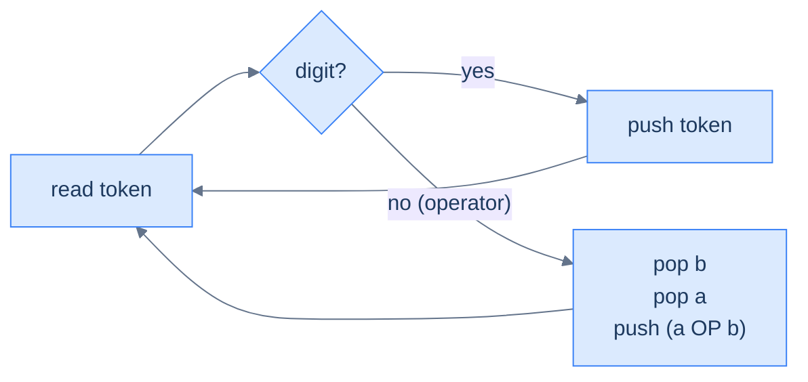
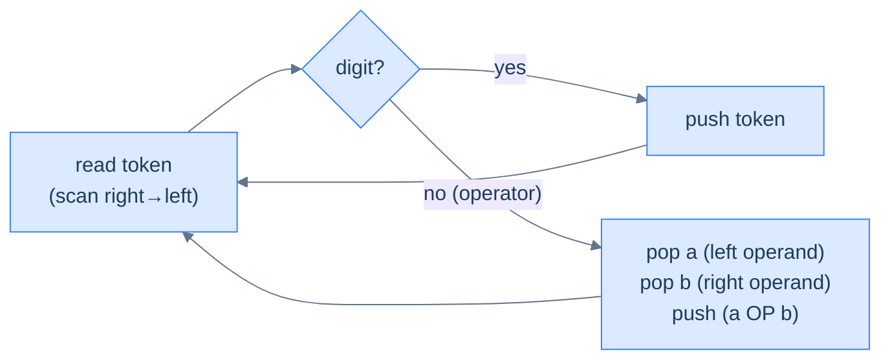
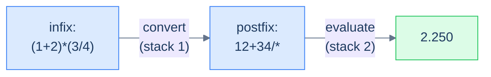

# 5. Evaluating Expressions Using a Stack

## The Hook

We just learned that postfix and prefix encode the order of operations *by position alone* — no parentheses, no precedence rules. That's a beautiful property, but it's only useful if we can actually *evaluate* such expressions efficiently. The good news: with a stack in our toolbox, the evaluator is one of the cleanest, most satisfying algorithms in the whole course. **Single pass over the string. One stack. No look-ahead. No backtracking. No special cases.** Push when you see an operand; pop two and push the result when you see an operator. The final number sitting alone on the stack is your answer.

That's it. Twelve lines of code. Linear time. Constant code complexity. The same pattern that runs inside every Reverse-Polish HP calculator, the inner loop of Forth interpreters, and the operand stack of the JVM.

This lesson builds three evaluators:

1. **Postfix evaluator** — the canonical one; left-to-right scan.
2. **Prefix evaluator** — same idea, scan right-to-left (or reverse the string and reuse the postfix logic with operand-order flipped).
3. **Infix evaluator** — the cheat: convert to postfix using the algorithm from the next lesson, then evaluate. Two stacks total, but each one is doing one thing well.

By the end you'll have a calculator core that handles `(2+3)*(4/2)` with the same code path as `23*4/+`. Same engine, three input dialects.

---

## Table of contents

1. [Understanding the problem](#understanding-the-problem)
2. [Understanding the evaluation of postfix expressions](#understanding-the-evaluation-of-postfix-expressions)
3. [Evaluate a postfix expression](#evaluate-a-postfix-expression)
4. [Understanding the evaluation of prefix expressions](#understanding-the-evaluation-of-prefix-expressions)
5. [Evaluate a prefix expression](#evaluate-a-prefix-expression)
6. [Evaluate an infix expression](#evaluate-an-infix-expression)
7. [Supported operations](#supported-operations)
8. [Internal mechanics](#internal-mechanics)
9. [Working example](#working-example)
10. [Edge cases and pitfalls](#edge-cases-and-pitfalls)
11. [Production reality](#production-reality)
12. [Practice ladder](#practice-ladder)
13. [Quiz](#quiz)
14. [Further reading](#further-reading)
15. [Cross-links](#cross-links)
16. [Final takeaway](#final-takeaway)

***

# Understanding the Problem

A stack-based evaluator exists to close one gap: humans write arithmetic for reading, but a CPU runs one binary operation at a time and needs the operations handed to it in execution order. The previous lesson defined postfix and prefix as notations that encode that order by position alone. This lesson turns that property into running code — an evaluator that reads a notation once and returns its numeric value.

The job splits into two distinct difficulties, and they map onto the three notations:

- **Reading the order off the tokens** — postfix and prefix already encode it, so the evaluator is a single scan with one stack.
- **Recovering the order first** — infix hides it behind precedence and parentheses, so the evaluator needs a conversion pass before it can scan.

To make this concrete: evaluating postfix `231*+9-` is a left-to-right walk that folds `(2 + 3*1) - 9` to `-4` with no precedence lookups. Evaluating infix `(1+2)*(3/4)` cannot start until the parentheses and precedence are resolved into postfix `12+34/*` first. The notation decides whether evaluation is one pass or two.

So the key idea is: **the stack is the working memory of an arithmetic evaluator, and the input notation decides how much work happens before the stack can do its job** — none for postfix and prefix, one conversion pass for infix.

***

# Understanding the evaluation of postfix expressions

The recipe — three sentences:

1. Walk the string left to right.
2. If the token is an **operand**, push it onto the stack.
3. If the token is an **operator**, pop the top two values, apply the operator, push the result.

When the walk ends, the lone item on the stack is the answer.



<p align="center"><strong>Postfix evaluator — every iteration is either a push (operand) or a pop-two-push-one (operator). At end-of-input, the stack holds exactly one element: the result.</strong></p>

> **Crucial: operand order matters.**
>
> When you see `a b -` and pop in order, the *first* value popped is `b` (it was pushed second, so it's on top), and the *second* value popped is `a` (pushed first, now exposed). The operation is `a − b`, not `b − a`. Convention: name them `operand2 = stack.pop()` (popped first), then `operand1 = stack.pop()` (popped second), and call `op(operand1, operand2)`. For commutative operators (`+`, `*`) the order doesn't matter; for `-`, `/`, `^` it does, and getting it backwards silently produces wrong answers.

## Walkthrough — `2 3 1 * + 9 -`

The input is the postfix form of `(2 + 3*1) - 9 = -4`. Walk it:

| Step | Token | Action | Stack (top right) |
|---:|:---:|---|---|
| 1 | `2` | push | `[2]` |
| 2 | `3` | push | `[2, 3]` |
| 3 | `1` | push | `[2, 3, 1]` |
| 4 | `*` | pop 1, pop 3, push `3*1=3` | `[2, 3]` |
| 5 | `+` | pop 3, pop 2, push `2+3=5` | `[5]` |
| 6 | `9` | push | `[5, 9]` |
| 7 | `-` | pop 9, pop 5, push `5-9=-4` | `[-4]` |
| — | end | result is the lone item | **`-4`** |

<p align="center"><strong>Walking <code>2 3 1 * + 9 -</code> step by step — every operator collapses two stack entries into one, so the stack never grows past O(operands). The final element is the answer.</strong></p>

## Algorithm

> **Algorithm**
>
> -   **Step 1:** Initialise an empty stack.
> -   **Step 2:** For each character `ch` in the postfix string, left to right:
>     -   **2.1** If `ch` is a digit, push its numeric value.
>     -   **2.2** Else (`ch` is an operator):
>         -   `op2 = stack.pop()` (popped first → right operand)
>         -   `op1 = stack.pop()` (popped second → left operand)
>         -   push `apply(op1, ch, op2)`
> -   **Step 3:** Return `stack.top()`.

## Implementation


```python run viz=array viz-root=stack viz-kind=stack
from typing import List

class Solution:

    # Function to perform arithmetic operations
    def perform_operation(
        self, operand1: float, operand2: float, operation: str
    ) -> float:
        if operation == "+":
            return operand1 + operand2
        elif operation == "-":
            return operand1 - operand2
        elif operation == "*":
            return operand1 * operand2
        elif operation == "/":
            return operand1 / operand2
        else:
            return 0

    def evaluate_a_postfix_expression(self, postfix: str) -> float:

        # Stack to store operands
        stack: List[float] = []

        # Iterate through each character in the postfix expression
        for ch in postfix:

            # If the character is an operand (a digit)
            if ch.isdigit():

                # Convert it to a float and push it onto the stack
                stack.append(float(ch))

            # If the character is an operator (an arithmetic symbol)
            # perform the operation on the top two operands in the stack
            # and push the result back onto the stack
            else:

                # Get the top operand from the stack
                operand2 = stack.pop()

                # Get the second top operand from the stack
                operand1 = stack.pop()

                # Apply the arithmetic operation and push the result back
                # to the stack
                stack.append(
                    self.perform_operation(operand1, operand2, ch)
                )

        # Return the final result
        return stack[-1]
```

```java run viz=array viz-root=stack viz-kind=stack
import java.util.*;

class Solution {

    // Function to perform arithmetic operations
    public float performOperation(
        float operand1,
        float operand2,
        char operation
    ) {
        switch (operation) {
            case '+':
                return operand1 + operand2;
            case '-':
                return operand1 - operand2;
            case '*':
                return operand1 * operand2;
            case '/':
                return operand1 / operand2;
            default:
                return 0;
        }
    }

    public float evaluateAPostfixExpression(String postfix) {

        // Stack to store operands
        Stack<Float> stack = new Stack<>();

        // Iterate through each character in the postfix expression
        for (char ch : postfix.toCharArray()) {

            // If the character is an operand (a digit)
            if (Character.isDigit(ch)) {

                // Convert it to a float and push it onto the stack
                stack.push((float) (ch - '0'));
            }

            // If the character is an operator (an arithmetic symbol)
            // perform the operation on the top two operands in the stack
            // and push the result back onto the stack
            else {

                // Get the top operand from the stack
                float operand2 = stack.pop();

                // Get the second top operand from the stack
                float operand1 = stack.pop();

                // Apply the arithmetic operation and push the result
                // back to the stack
                stack.push(performOperation(operand1, operand2, ch));
            }
        }

        // Return the final result
        return stack.peek();
    }
}
```


## Complexity Analysis

Every character is processed once. Each operator triggers at most three stack operations (two pops, one push). The stack's maximum depth is bounded by the number of operands, which is bounded by the input length.

> **All cases** — Time: **O(N)** | Space: **O(N)**

***

# Evaluate a postfix expression

## Problem Statement

Given a string `postfix` representing a postfix expression with single-digit operands and the operators `+`, `-`, `*`, `/`, evaluate it and return the result as a float.

### Example

> -   **Input:** `postfix = "231*+9-"`
> -   **Output:** `-4.000`
> -   **Explanation:** Equivalent infix is `(2 + 3*1) - 9 = -4`.

<details>
<summary><h2>Solution</h2></summary>


The full evaluator from above, written compactly. Same code, just packaged as the answer to the problem.


```python run viz=array viz-root=stack viz-kind=stack
from typing import List

class Solution:

    # Function to perform arithmetic operations
    def perform_operation(
        self, operand1: float, operand2: float, operation: str
    ) -> float:
        if operation == "+":
            return operand1 + operand2
        elif operation == "-":
            return operand1 - operand2
        elif operation == "*":
            return operand1 * operand2
        elif operation == "/":
            return operand1 / operand2
        else:
            return 0

    def evaluate_a_postfix_expression(self, postfix: str) -> float:

        # Stack to store operands
        stack: List[float] = []

        # Iterate through each character in the postfix expression
        for ch in postfix:

            # If the character is an operand (a digit)
            if ch.isdigit():

                # Convert it to a float and push it onto the stack
                stack.append(float(ch))

            # If the character is an operator (an arithmetic symbol)
            # perform the operation on the top two operands in the stack
            # and push the result back onto the stack
            else:

                # Get the top operand from the stack
                operand2 = stack.pop()

                # Get the second top operand from the stack
                operand1 = stack.pop()

                # Apply the arithmetic operation and push the result back
                # to the stack
                stack.append(
                    self.perform_operation(operand1, operand2, ch)
                )

        # Return the final result
        return stack[-1]


# Example from the problem statement
print(Solution().evaluate_a_postfix_expression("231*+9-"))   # -4.0

# Edge cases
print(Solution().evaluate_a_postfix_expression("23+"))       # 5.0 — simple addition
print(Solution().evaluate_a_postfix_expression("92-"))       # 7.0 — simple subtraction
print(Solution().evaluate_a_postfix_expression("82*"))       # 16.0 — multiplication
print(Solution().evaluate_a_postfix_expression("84/"))       # 2.0 — division
print(Solution().evaluate_a_postfix_expression("5"))         # 5.0 — single operand
print(Solution().evaluate_a_postfix_expression("34+2*"))     # 14.0 — (3+4)*2
print(Solution().evaluate_a_postfix_expression("72+3*"))     # 27.0 — (7+2)*3
```

```java run viz=array viz-root=stack viz-kind=stack
import java.util.*;

public class Main {
    static class Solution {

        // Function to perform arithmetic operations
        private float performOperation(
            float operand1,
            float operand2,
            char operation
        ) {
            switch (operation) {
                case '+':
                    return operand1 + operand2;
                case '-':
                    return operand1 - operand2;
                case '*':
                    return operand1 * operand2;
                case '/':
                    return operand1 / operand2;
                default:
                    return 0;
            }
        }

        public float evaluateAPostfixExpression(String postfix) {

            // Stack to store operands
            Stack<Float> stack = new Stack<>();

            // Iterate through each character in the postfix expression
            for (char ch : postfix.toCharArray()) {

                // If the character is an operand (a digit)
                if (Character.isDigit(ch)) {

                    // Convert it to a float and push it onto the stack
                    stack.push((float) (ch - '0'));
                }

                // If the character is an operator (an arithmetic symbol)
                // perform the operation on the top two operands in the stack
                // and push the result back onto the stack
                else {

                    // Get the top operand from the stack
                    float operand2 = stack.pop();

                    // Get the second top operand from the stack
                    float operand1 = stack.pop();

                    // Apply the arithmetic operation and push the result
                    // back to the stack
                    stack.push(performOperation(operand1, operand2, ch));
                }
            }

            // Return the final result
            return stack.peek();
        }
    }

    public static void main(String[] args) {
        // Example from the problem statement
        System.out.println(new Solution().evaluateAPostfixExpression("231*+9-"));  // -4.0

        // Edge cases
        System.out.println(new Solution().evaluateAPostfixExpression("23+"));      // 5.0
        System.out.println(new Solution().evaluateAPostfixExpression("92-"));      // 7.0
        System.out.println(new Solution().evaluateAPostfixExpression("82*"));      // 16.0
        System.out.println(new Solution().evaluateAPostfixExpression("84/"));      // 2.0
        System.out.println(new Solution().evaluateAPostfixExpression("5"));        // 5.0 — single operand
        System.out.println(new Solution().evaluateAPostfixExpression("34+2*"));    // 14.0
        System.out.println(new Solution().evaluateAPostfixExpression("72+3*"));    // 27.0
    }
}
```

</details>


***

# Understanding the evaluation of prefix expressions

Prefix is postfix's mirror. Same algorithm with two changes:

1. **Scan right to left** instead of left to right.
2. **Operand order is flipped.** When we hit an operator, the *first* value popped is the *left* operand (because under right-to-left scan, the most recently seen operand is the leftmost one), and the second pop is the *right* operand. This is the opposite of postfix.



<p align="center"><strong>Prefix evaluator — same shape as postfix; only the scan direction and the operand-pop order change. Easiest to implement by reversing the input string and reusing the postfix loop, taking care to flip the order of operand assignment.</strong></p>

## Walkthrough — `- + 8 / 6 3 2`

Equivalent infix: `(8 + 6/3) - 2 = 8`. Reversed string: `2 3 6 / 8 + -`. Walk the reversed string left-to-right, treating the first pop as the left operand:

| Step | Token | Action (first pop = left operand) | Stack (top right) |
|---:|:---:|---|---|
| 1 | `2` | push | `[2]` |
| 2 | `3` | push | `[2, 3]` |
| 3 | `6` | push | `[2, 3, 6]` |
| 4 | `/` | pop a=6, pop b=3, push `6/3=2` | `[2, 2]` |
| 5 | `8` | push | `[2, 2, 8]` |
| 6 | `+` | pop a=8, pop b=2, push `8+2=10` | `[2, 10]` |
| 7 | `-` | pop a=10, pop b=2, push `10-2=8` | `[8]` |
| — | end | result is the lone item | **`8`** |

<p align="center"><strong>Prefix evaluation, after reversing the input — same single-pass shape as postfix, but the first pop is the <em>left</em> operand. Notice <code>6/3=2</code>, not <code>3/6</code>; the operand order matters and the swap is the only thing that's changed from postfix.</strong></p>

***

# Evaluate a prefix expression

## Problem Statement

Given a string `prefix` (single-digit operands, operators `+`, `-`, `*`, `/`), evaluate and return the result.

### Example

> -   **Input:** `prefix = "-+8/632"`
> -   **Output:** `8.000`
> -   **Explanation:** Equivalent infix is `(8 + 6/3) - 2 = 8`.

<details>
<summary><h2>Solution &amp; Analysis</h2></summary>

### Solution

```python run viz=array viz-root=stack viz-kind=stack
from typing import List

class Solution:

    # Function to perform arithmetic operations
    def perform_operation(
        self, operand1: float, operand2: float, operation: str
    ) -> float:
        if operation == "+":
            return operand1 + operand2
        elif operation == "-":
            return operand1 - operand2
        elif operation == "*":
            return operand1 * operand2
        elif operation == "/":
            return operand1 / operand2
        else:
            return 0

    def evaluate_a_prefix_expression(self, prefix: str) -> float:

        # Initialize an empty stack to store operands
        stack: List[float] = []

        # Reverse the prefix expression
        reversed_prefix = prefix[::-1]

        # Iterate through each character in the reversed prefix
        # expression
        for ch in reversed_prefix:

            # If the character is an operand (a digit)
            if ch.isdigit():

                # Convert it to a float and push it onto the stack
                stack.append(float(ch))

            # If the character is an operator (an arithmetic symbol)
            # perform the operation on the top two operands in the stack
            # and push the result back onto the stack
            else:

                # Pop the top element from the stack as the first operand
                operand1 = stack.pop()

                # Pop the top element from the stack as the second
                # operand
                operand2 = stack.pop()

                # Apply the arithmetic operation and push the result back
                # to the stack
                stack.append(
                    self.perform_operation(operand1, operand2, ch)
                )

        # Return the final result
        return stack.pop()


# Example from the problem statement
print(Solution().evaluate_a_prefix_expression("-+8/632"))   # 8.0

# Edge cases
print(Solution().evaluate_a_prefix_expression("+23"))       # 5.0 — simple addition
print(Solution().evaluate_a_prefix_expression("-92"))       # 7.0 — subtraction
print(Solution().evaluate_a_prefix_expression("*82"))       # 16.0 — multiplication
print(Solution().evaluate_a_prefix_expression("/84"))       # 2.0 — division
print(Solution().evaluate_a_prefix_expression("5"))         # 5.0 — single operand
print(Solution().evaluate_a_prefix_expression("*+342"))     # 14.0 — (3+4)*2
print(Solution().evaluate_a_prefix_expression("*+723"))     # 27.0 — (7+2)*3
```

```java run viz=array viz-root=stack viz-kind=stack
import java.util.*;

public class Main {
    static class Solution {

        // Function to perform arithmetic operations
        private float performOperation(
            float operand1,
            float operand2,
            char operation
        ) {
            switch (operation) {
                case '+':
                    return operand1 + operand2;
                case '-':
                    return operand1 - operand2;
                case '*':
                    return operand1 * operand2;
                case '/':
                    return operand1 / operand2;
                default:
                    return 0;
            }
        }

        public float evaluateAPrefixExpression(String prefix) {

            // Initialize an empty stack to store operands
            Stack<Float> stack = new Stack<>();

            // Reverse the prefix expression
            String reversedPrefix = new StringBuilder(prefix)
                .reverse()
                .toString();

            // Iterate through each character in the reversed prefix
            // expression
            for (char ch : reversedPrefix.toCharArray()) {

                // If the character is an operand (a digit)
                if (Character.isDigit(ch)) {

                    // Convert it to a float and push it onto the stack
                    stack.push((float) (ch - '0'));
                }

                // If the character is an operator (an arithmetic symbol)
                // perform the operation on the top two operands in the stack
                // and push the result back onto the stack
                else {

                    // Pop the top element from the stack as the first
                    // operand
                    float operand1 = stack.pop();

                    // Pop the top element from the stack as the second
                    // operand
                    float operand2 = stack.pop();

                    // Apply the arithmetic operation and push the result
                    // back to the stack
                    stack.push(performOperation(operand1, operand2, ch));
                }
            }

            // Return the final result
            return stack.pop();
        }
    }

    public static void main(String[] args) {
        // Example from the problem statement
        System.out.println(new Solution().evaluateAPrefixExpression("-+8/632"));  // 8.0

        // Edge cases
        System.out.println(new Solution().evaluateAPrefixExpression("+23"));      // 5.0
        System.out.println(new Solution().evaluateAPrefixExpression("-92"));      // 7.0
        System.out.println(new Solution().evaluateAPrefixExpression("*82"));      // 16.0
        System.out.println(new Solution().evaluateAPrefixExpression("/84"));      // 2.0
        System.out.println(new Solution().evaluateAPrefixExpression("5"));        // 5.0 — single operand
        System.out.println(new Solution().evaluateAPrefixExpression("*+342"));    // 14.0
        System.out.println(new Solution().evaluateAPrefixExpression("*+723"));    // 27.0
    }
}
```


> **Algorithm**
>
> -   **Step 1:** Initialise an empty stack.
> -   **Step 2:** For each character `ch` in the prefix string, **right to left**:
>     -   **2.1** If `ch` is a digit, push its numeric value.
>     -   **2.2** Else: `op1 = stack.pop()` (LEFT), `op2 = stack.pop()` (RIGHT), push `apply(op1, ch, op2)`.
> -   **Step 3:** Return `stack.top()`.

### Complexity Analysis

> **All cases** — Time: **O(N)** | Space: **O(N)**

</details>

***

# Evaluate an infix expression

## Problem Statement

Given an infix expression like `(1+2)*(3/4)`, evaluate it and return the result.

### Example

> -   **Input:** `infix = "(1+2)*(3/4)"`
> -   **Output:** `2.250`

<details>
<summary><h2>Approach</h2></summary>


The trick: **don't evaluate infix directly** — *convert it to postfix* (using the algorithm in the next lesson, which uses one stack), and then evaluate the postfix (using the algorithm we just built, which uses one stack). Two passes; two stacks; same overall O(N).

The full conversion from infix to postfix gets its own lesson because there's quite a bit of nuance — operator precedence comparisons, parentheses handling, the fact that `^` is right-associative while `*` and `/` are left-associative. We'll show the converter inline below for completeness, but the *teaching* of how it works is in lesson 6.



<p align="center"><strong>Infix evaluator — convert first (lesson 6 covers the converter), then evaluate. Each stage is a simple single-stack algorithm; combined, they handle parentheses, precedence, and associativity in two linear passes.</strong></p>

</details>
<details>
<summary><h2>Solution</h2></summary>


```python run viz=array viz-root=stack viz-kind=stack
from typing import List

class Solution:

    # Function to check if the character is an operator
    def is_operator(self, ch: str) -> bool:
        return not ch.isalpha() and not ch.isdigit()

    # Function to get the priority of operators
    def get_precedence(self, operator: str) -> int:

        # Assign precedence values to different operators
        if operator == "^":
            return 3
        elif operator == "*" or operator == "/":
            return 2
        elif operator == "+" or operator == "-":
            return 1

        # Default value for unknown operators
        return -1

    # Function to convert infix expression to postfix expression
    def convert_infix_to_postfix(self, infix: str) -> str:

        # Stack to hold operators and parentheses
        stack: List[str] = []

        # Final postfix expression
        postfix: str = ""

        for ch in infix:

            # If the character is not an operator or parentheses, add
            # it to the postfix string
            if not self.is_operator(ch) and ch != "(" and ch != ")":
                postfix += ch

            # If the character is an opening parentheses, push it
            # onto the stack
            elif ch == "(":
                stack.append(ch)

            # If the character is a closing parentheses, pop operators
            # from the stack and add them to the postfix string until an
            # opening parentheses is encountered
            elif ch == ")":
                while stack and stack[-1] != "(":
                    postfix += stack.pop()

                # Remove the opening parentheses from the stack
                if stack and stack[-1] == "(":
                    stack.pop()

            # If the character is an operator, compare its precedence
            # with the top of the stack and add higher or equal
            # precedence operators to the postfix string
            else:
                while stack and self.get_precedence(
                    ch
                ) <= self.get_precedence(stack[-1]):
                    if stack[-1] != "(":
                        postfix += stack.pop()

                # Push the current operator onto the stack
                stack.append(ch)

        # Pop any remaining operators from the stack and add them to the
        # postfix string
        while stack:
            postfix += stack.pop()

        return postfix

    # Function to perform arithmetic operations
    def perform_operation(
        self, operand1: float, operand2: float, operation: str
    ) -> float:
        if operation == "+":
            return operand1 + operand2
        elif operation == "-":
            return operand1 - operand2
        elif operation == "*":
            return operand1 * operand2
        elif operation == "/":
            return operand1 / operand2
        else:
            return 0

    # Function to evaluate a postfix expression
    def evaluate_a_postfix_expression(self, postfix: str) -> float:

        # Stack to store operands
        stack: List[float] = []

        # Iterate through each character in the postfix expression
        for ch in postfix:

            # If the character is an operand (a digit)
            if ch.isdigit():

                # Convert it to a float and push it onto the stack
                stack.append(float(ch))

            # If the character is an operator (an arithmetic symbol)
            # perform the operation on the top two operands in the stack
            # and push the result back onto the stack
            else:

                # Pop the top element from the stack as the second
                # operand
                operand2 = stack.pop()

                # Pop the top element from the stack as the first
                # operand
                operand1 = stack.pop()

                # Apply the arithmetic operation and push the result back
                # to the stack
                stack.append(
                    self.perform_operation(operand1, operand2, ch)
                )

        # Return the final result
        return stack[-1]

    def evaluate_an_infix_expression(self, infix: str) -> float:

        # Convert the infix expression to postfix notation
        postfix: str = self.convert_infix_to_postfix(infix)

        # Evaluate the postfix expression and return the result
        return self.evaluate_a_postfix_expression(postfix)


# Example from the problem statement
print(Solution().evaluate_an_infix_expression("(1+2)*(3/4)"))   # 2.25

# Edge cases
print(Solution().evaluate_an_infix_expression("2+3"))           # 5.0 — no parentheses
print(Solution().evaluate_an_infix_expression("(2+3)"))         # 5.0 — simple grouped
print(Solution().evaluate_an_infix_expression("8-2"))           # 6.0 — subtraction
print(Solution().evaluate_an_infix_expression("4*2"))           # 8.0 — multiplication
print(Solution().evaluate_an_infix_expression("9/3"))           # 3.0 — division
print(Solution().evaluate_an_infix_expression("2+3*4"))         # 14.0 — precedence
print(Solution().evaluate_an_infix_expression("(2+3)*4"))       # 20.0 — parens override precedence
```

```java run viz=array viz-root=stack viz-kind=stack
import java.util.*;

public class Main {
    static class Solution {

        // Function to check if the character is an operator
        private boolean isOperator(char ch) {
            return (!Character.isLetter(ch) && !Character.isDigit(ch));
        }

        // Function to get the priority of operators
        private int getPrecedence(char operator) {

            // Assign precedence values to different operators
            if (operator == '^') {
                return 3;
            } else if (operator == '*' || operator == '/') {
                return 2;
            } else if (operator == '+' || operator == '-') {
                return 1;
            }

            // Default value for unknown operators
            return -1;
        }

        // Function to convert infix expression to postfix expression
        private String convertInfixToPostfix(String infix) {

            // Stack to hold operators and parentheses
            Stack<Character> stack = new Stack<>();

            // Final postfix expression
            StringBuilder postfix = new StringBuilder();

            for (char ch : infix.toCharArray()) {

                // If the character is not an operator or parentheses,
                // add it to the postfix string
                if (!isOperator(ch) && ch != '(' && ch != ')') {
                    postfix.append(ch);
                }

                // If the character is an opening parentheses, push it
                // onto the stack
                else if (ch == '(') {
                    stack.push(ch);
                }

                // If the character is a closing parentheses, pop
                // operators from the stack and add them to the postfix
                // string until an opening parentheses is encountered
                else if (ch == ')') {
                    while (!stack.empty() && stack.peek() != '(') {
                        postfix.append(stack.peek());
                        stack.pop();
                    }

                    // Remove the opening parentheses from the stack
                    if (!stack.empty() && stack.peek() == '(') {
                        stack.pop();
                    }
                }

                // If the character is an operator, compare its
                // precedence with the top of the stack and add higher or
                // equal precedence operators to the postfix string
                else {
                    while (
                        !stack.empty() &&
                        getPrecedence(ch) <= getPrecedence(stack.peek())
                    ) {
                        if (stack.peek() != '(') {
                            postfix.append(stack.peek());
                        }
                        stack.pop();
                    }

                    // Push the current operator onto the stack
                    stack.push(ch);
                }
            }

            // Pop any remaining operators from the stack and add them to the
            // postfix string
            while (!stack.empty()) {
                postfix.append(stack.peek());
                stack.pop();
            }

            return postfix.toString();
        }

        // Function to perform arithmetic operations
        private float performOperation(
            float operand1,
            float operand2,
            char operation
        ) {
            switch (operation) {
                case '+':
                    return operand1 + operand2;
                case '-':
                    return operand1 - operand2;
                case '*':
                    return operand1 * operand2;
                case '/':
                    return operand1 / operand2;
                default:
                    return 0;
            }
        }

        // Function to evaluate a postfix expression
        private float evaluateAPostfixExpression(String postfix) {

            // Stack to store operands
            Stack<Float> stack = new Stack<>();

            // Iterate through each character in the postfix expression
            for (char ch : postfix.toCharArray()) {

                // If the character is an operand (a digit)
                if (Character.isDigit(ch)) {

                    // Convert it to a float and push it onto the stack
                    stack.push((float) (ch - '0'));
                }

                // If the character is an operator (an arithmetic symbol)
                // perform the operation on the top two operands in the stack
                // and push the result back onto the stack
                else {

                    // Pop the top element from the stack as the second
                    // operand
                    float operand2 = stack.peek();
                    stack.pop();

                    // Pop the top element from the stack as the first
                    // operand
                    float operand1 = stack.peek();
                    stack.pop();

                    // Apply the arithmetic operation and push the result
                    // back to the stack
                    stack.push(performOperation(operand1, operand2, ch));
                }
            }

            // Return the final result
            return stack.peek();
        }

        public float evaluateAnInfixExpression(String infix) {

            // Convert the infix expression to postfix notation
            String postfix = convertInfixToPostfix(infix);

            // Evaluate the postfix expression and return the result
            return evaluateAPostfixExpression(postfix);
        }
    }

    public static void main(String[] args) {
        // Example from the problem statement
        System.out.println(new Solution().evaluateAnInfixExpression("(1+2)*(3/4)"));  // 2.25

        // Edge cases
        System.out.println(new Solution().evaluateAnInfixExpression("2+3"));          // 5.0
        System.out.println(new Solution().evaluateAnInfixExpression("(2+3)"));        // 5.0
        System.out.println(new Solution().evaluateAnInfixExpression("8-2"));          // 6.0
        System.out.println(new Solution().evaluateAnInfixExpression("4*2"));          // 8.0
        System.out.println(new Solution().evaluateAnInfixExpression("9/3"));          // 3.0
        System.out.println(new Solution().evaluateAnInfixExpression("2+3*4"));        // 14.0
        System.out.println(new Solution().evaluateAnInfixExpression("(2+3)*4"));      // 20.0
    }
}
```

</details>
<details>
<summary><h2>Final Takeaway</h2></summary>


Three evaluators, one architecture: **a stack of operands plus a left-to-right or right-to-left scan**. The differences between the three notations collapse to a few lines of code.

Three lessons:

1. **The stack is the working memory.** Every partial result lives there until the next operator consumes it. The maximum stack depth is bounded by the number of nested operations; for sane expressions, that's tiny.
2. **Operand order matters for non-commutative operators.** Postfix: first pop = right operand. Prefix: first pop = left operand. Get this backwards and `+` and `*` will still be correct, but `-` and `/` will silently produce wrong answers.
3. **Infix is a wrapper, not a primitive.** Real infix evaluators don't try to evaluate infix directly — they convert to postfix (or to an AST, which is just a tree-shaped postfix) and evaluate that. Two simple stages compose into a calculator that handles arbitrary precedence and parentheses.

> *Coming up — the **infix-to-postfix converter** that this lesson skipped over. Lesson 6 is the formal Shunting-Yard algorithm: one stack of operators, one output buffer, careful precedence comparisons, parentheses handling. It's the algorithm Edsger Dijkstra invented in 1961 and that every serious calculator and parser still uses today. Once you have it, you have a complete arithmetic evaluator.*

</details>

***

# Supported Operations

An evaluator is not a data structure, so the operations worth comparing are the moves the algorithm makes on each token, plus the arithmetic each operator triggers. Two token classes and one terminal read cover the whole engine, and their costs are identical across all three notations.

| Operation | What it does | Time | Space |
|---|---|---|---|
| **Read operand** | push the numeric value onto the stack | `O(1)` | `O(1)` per push |
| **Read operator** | pop two values, apply `+`/`-`/`*`/`/`, push the result | `O(1)` | `O(1)` net (two off, one on) |
| **Apply operator** | one binary arithmetic op on the popped pair | `O(1)` | `O(1)` |
| **Return result** | read the lone survivor on the stack | `O(1)` | `O(1)` |
| **Full evaluation** | scan all `N` tokens once, folding as it goes | `O(N)` | `O(N)` |

The per-token operations are all constant. Each operand is pushed exactly once, and each operator pops twice and pushes once, so the total work is bounded by the token count `N`. The stack's depth never exceeds the number of operands, which is itself bounded by `N`.

To make this concrete: evaluating postfix `2 3 1 * + 9 -` performs four pushes (`2`, `3`, `1`, `9`), three operator folds (`*`, `+`, `-`), and one final read. Every one of those eight moves is `O(1)`, and the stack peaks at three entries — never more than the operand count.

So the key idea is: **an evaluator has exactly two per-token moves — push an operand or fold an operator — and both are `O(1)`, which is why the whole scan is `O(N)` time and `O(N)` space regardless of notation.**

***

# Internal Mechanics

The engine underneath all three evaluators is one stack of operands, driven by a single scan that classifies each token as operand or operator. An operand has nothing to compute yet, so it waits on the stack; an operator needs its two most recent operands, which sit on top by construction. That "most recent operands are on top" guarantee is what makes the stack the natural — not bolted-on — shape for evaluation.

The mechanism has three moving parts, identical for postfix and prefix:

- **Operand → push.** The value is set aside on the stack as a pending operand. No arithmetic happens yet.
- **Operator → pop two, apply, push one.** The operator pops its two operands off the top, applies itself, and pushes the single result back as a new pending operand.
- **End of scan → the lone survivor is the answer.** A well-formed expression collapses to exactly one value on the stack, which the evaluator returns.

To make this concrete: in postfix `2 3 1 * + 9 -`, the scan reaches `*` while the stack holds `[2, 3, 1]`. The `*` folds the top two (`3` and `1`) into `3`, leaving `[2, 3]`; then `+` folds those into `5`; then `9` pushes; then `-` folds `5` and `9` into `-4`. No precedence rule was consulted — the position of each operator in the stream *was* the precedence.

One subtlety separates a correct evaluator from a subtly-broken one: **operand order on the pop**. For commutative operators (`+`, `*`) the two pops can return in either order with the same result. For non-commutative operators (`-`, `/`, `^`) the order is load-bearing, and it flips between notations. Under a **left-to-right postfix scan**, the most recent operand seen is the *rightmost*, so the first value popped is the *right* operand and the second pop is the *left* operand. Under a **right-to-left prefix scan**, the most recent operand seen is the *leftmost*, so the first value popped is the *left* operand and the second pop is the *right* operand. Infix sidesteps the question entirely by converting to postfix first, then reusing the postfix rule.

So the core insight is: **one stack, two scan directions — postfix scans left-to-right and pops right-then-left, prefix scans right-to-left and pops left-then-right, and infix converts to postfix before scanning at all.**

***

# Working Example

One expression carried end-to-end makes the mechanics tangible. Take the infix expression `(1+2)*(3/4)`, whose value is `3 * 0.75 = 2.25`. The infix evaluator cannot scan it directly — it converts to postfix first, then runs the postfix scan on the result.

**Stage 1 — convert `(1+2)*(3/4)` to postfix.** The converter (lesson 6's algorithm) walks the infix string with an operator stack, emitting operands immediately and deferring operators by precedence. The output is `12+34/*`. The two parenthesised folds appear first, the top-level multiply last.

**Stage 2 — evaluate the postfix `12+34/*` left-to-right with one operand stack:**

| Step | Token | Action (first pop = right operand) | Stack (top right) |
|---:|:---:|---|---|
| 1 | `1` | push | `[1]` |
| 2 | `2` | push | `[1, 2]` |
| 3 | `+` | pop `2`, pop `1`, push `1+2=3` | `[3]` |
| 4 | `3` | push | `[3, 3]` |
| 5 | `4` | push | `[3, 3, 4]` |
| 6 | `/` | pop `4`, pop `3`, push `3/4=0.75` | `[3, 0.75]` |
| 7 | `*` | pop `0.75`, pop `3`, push `3*0.75=2.25` | `[2.25]` |
| — | end | result is the lone item | **`2.25`** |

<p align="center"><strong>Evaluating <code>(1+2)*(3/4)</code> — convert to postfix <code>12+34/*</code>, then fold left-to-right. Each operator collapses two stack entries into one, so the stack peaks at three entries and the lone survivor <code>2.25</code> is the answer.</strong></p>

Notice the division at step 6: the first pop (`4`) is the right operand and the second pop (`3`) is the left, so the operation is `3 / 4`, not `4 / 3`. Reverse that and the answer becomes `1.33`, silently wrong. The same expression in raw infix never gets this clean walk. An evaluator would have to find the two parenthesised groups, evaluate each as a sub-expression, hold both partial results, then multiply.

So the key idea is: **infix evaluation is two stages — convert once, then scan once — and both stages are `O(N)` time and `O(N)` space, so the composite handles parentheses and precedence in two linear passes over one stack each.**

***

# Edge Cases and Pitfalls

The algorithm is short; the bugs cluster in a handful of places. Keep this checklist open when you write or review an evaluator.

- **Operand order on non-commutative operators.** This is the single most common bug. `+` and `*` survive a swapped pop; `-`, `/`, and `^` do not. In **postfix** (left-to-right scan), the first value popped is the *right* operand, so `a b -` means `a - b`. In **prefix** (right-to-left scan), the first value popped is the *left* operand. Get it wrong and `+`/`*` look correct while `-`/`/` silently return garbage.
- **Single-digit assumption.** These evaluators read one character per operand, so `42 3 +` is read as `4`, `2`, `3` — three operands, not two. Multi-digit operands need an explicit tokenizer that groups consecutive digits before the scan. The single-digit contract is a teaching simplification, not a production-ready parser.
- **Division semantics.** `/` here is float division, so `8 4 /` returns `2.0` and `3 4 /` returns `0.75`. An integer-division evaluator would truncate `3 / 4` to `0` — a different answer for the same tokens. Decide float vs. integer before the first `/` runs.
- **Malformed expressions underflow or overflow the stack.** Too many operators (`2 + +`) pops an empty stack; too few (`2 3 4 +`) leaves more than one value at the end. A hardened evaluator checks the stack has at least two operands before each operator and exactly one value at the end; the teaching version assumes well-formed input.
- **Empty input.** An empty token stream leaves an empty stack, so the final `stack[-1]` read fails — there is no lone survivor. Decide whether empty input is an error or returns a neutral value before the first read runs.
- **Prefix is not the reverse of postfix.** Reversing the *string* and reusing the postfix loop works only because the prefix evaluator also flips its operand-pop order. Reversing without flipping the pop order gives correct `+`/`*` and wrong `-`/`/`. The reversal and the pop-order swap are a matched pair.
- **Unary operators break the two-operand assumption.** A unary minus consumes one operand, not two. An evaluator that always pops two will underflow the stack or grab an unrelated operand. Either disallow unary operators or detect them explicitly before the pop.

***

# Production Reality

Stack-based evaluation is not an academic exercise — it runs inside compilers, calculators, and virtual machines billions of times a day. The systems below put the operand-stack scan on a hot path.

**[The JVM bytecode interpreter]** — uses **a per-frame operand stack evaluated in postfix order** — because `javac` compiles infix source into postfix bytecode (`iload`, `iload`, `imul`, `iadd`), so the interpreter is exactly the pop-two-push-one scan from this lesson with no runtime precedence parsing.

**[Reverse Polish calculators (HP-12C and successors)]** — uses **postfix entry over a four-register operand stack** — because RPN lets the user evaluate any expression with no parenthesis or equals key, feeding one operand or operator at a time straight into the scan.

**[Spreadsheet formula engines]** — uses **shunting-yard conversion to postfix, then a stack evaluator** — because users type infix in a cell, but the engine caches the postfix form so recalculation is a fast stack walk rather than a re-parse. <!-- VERIFY: many spreadsheet engines compile formulas to an internal postfix/bytecode form; exact representation varies by implementation. -->

**[Forth and PostScript interpreters]** — uses **postfix as the language syntax itself, with the operand stack as the execution model** — because a stack machine interpreter fits in a few kilobytes, which is why PostScript drives printers and Forth drives boot ROMs and constrained firmware.

**[Database SQL expression evaluators]** — uses **a parse-to-postfix step then a stack-based fold per row** — because a `WHERE` or `SELECT` arithmetic expression is parsed once and then evaluated row-by-row, where a precompiled postfix scan beats re-parsing the infix every time. <!-- VERIFY: query engines compile scalar expressions to an internal evaluable form; postfix/bytecode/tree-walk representation varies by engine. -->

***

# Practice Ladder

This lesson turns the notation rules into running evaluators, so the closest practice is the stack problems that scan once and let the stack remember pending work. Try each unaided; reach for the hint after ten minutes; do not open a solution until you have written something runnable.

| # | Problem | Pattern | Difficulty | Hint |
|---|---------|---------|------------|------|
| 1 | [Reverse the String](./08-pattern-reversal/02-problems/02-reverse-the-string.md) | [Reversal](./08-pattern-reversal/01-pattern.md) | Easy | Push every character, then pop them all. The LIFO order is the reversal — `O(n)` time, `O(n)` space. Same push-then-pop reflex the evaluator runs on operands. |
| 2 | [Parentheses Checker](./11-pattern-sequence-validation/02-problems/01-parentheses-checker.md) | [Sequence Validation](./11-pattern-sequence-validation/01-pattern.md) | Easy | Push openers, pop on closers, check the match. A balanced expression empties the stack — the well-formed precondition every evaluator assumes about its input. |
| 3 | [Redundant Parentheses](./11-pattern-sequence-validation/02-problems/03-redundant-parentheses.md) | [Sequence Validation](./11-pattern-sequence-validation/01-pattern.md) | Medium | A bracket pair with no operator between its borders is redundant. Tracking operators on the stack between brackets is a direct cousin of the infix-to-postfix conversion this lesson leans on. |
| 4 | [Formula Parsing](./12-pattern-linear-evaluation/02-problems/04-formula-parsing.md) | [Linear Evaluation](./12-pattern-linear-evaluation/01-pattern.md) | Hard | Scan left-to-right, hold operands and a running operator on stacks, fold on precedence boundaries. This *is* postfix evaluation fused with the shunting-yard idea. |
| 5 | [String Expansion](./12-pattern-linear-evaluation/02-problems/03-string-expansion.md) | [Linear Evaluation](./12-pattern-linear-evaluation/01-pattern.md) | Medium | Push context on `[`, fold it on `]`. The stack stores deferred work exactly as the evaluator stores pending operands until an operator fires. |

Work these until the push-then-fold reflex is automatic; the postfix evaluator then reads as one more application of the same move.

***

# Quiz

Commit to an answer before reading the response — that is the test of whether the idea has landed.

**[Recall] Q: After the scan finishes on a well-formed expression, how many values are left on the stack, and what is it?**
Exactly one — the result of the whole expression, which the evaluator returns.

**[Recall] Q: What are the time and space complexities of evaluating an `N`-token postfix expression with a stack?**
`O(N)` time (each token is scanned once and triggers `O(1)` work) and `O(N)` space (the stack holds up to `O(N)` pending operands).

**[Reasoning] Q: Why does the first value popped represent the *right* operand in postfix but the *left* operand in prefix?**
Operands are always written left-to-right, so the left-to-right scan pops the right operand first and the right-to-left scan pops the left operand first.

**[Reasoning] Q: Why can the prefix evaluator reverse the input string and reuse the postfix loop, yet still produce correct answers?**
The reversal makes the scan effectively right-to-left, and the loop also swaps which pop is the left operand — the reversal and the pop-order flip are a matched pair.

**[Tradeoff] Q: Why convert infix to postfix and evaluate, instead of building a direct infix evaluator?**
A direct infix evaluator must parse precedence and parentheses while evaluating; converting to postfix first splits the work into two simple single-stack passes of `O(N)` time and `O(N)` space.

***

# Further Reading

Curated entries, not a syllabus. The annotation tells you which to open first.

- **[Converting Expressions Using Stack](/cortex/data-structures-and-algorithms/linear-structures-stack-converting-expressions-using-stack)**
  ★ Essential — the next lesson; builds the infix-to-postfix converter that the infix evaluator here calls but does not teach.
- **[Wikipedia — Reverse Polish notation](https://en.wikipedia.org/wiki/Reverse_Polish_notation)**
  ★ Essential — a concise, example-heavy tour of postfix evaluation with the calculator and Forth history in one place.
- **[The Java Virtual Machine Specification — Operand Stacks](https://docs.oracle.com/javase/specs/jvms/se21/html/jvms-2.html#jvms-2.6.2)**
  → Reference — how a real production stack machine evaluates compiled expressions in postfix order; read alongside the Production Reality section.
- **[Sedgewick & Wayne — *Algorithms* (4th ed), §1.3 Stacks and Queues](https://algs4.cs.princeton.edu/13stacks/)**
  ◆ Advanced — Dijkstra's two-stack evaluator implemented and analysed; the cleanest companion to both this lesson and lesson 6.
- **[CLRS — Chapter 10: Elementary Data Structures](https://mitpress.mit.edu/9780262046305/introduction-to-algorithms/)**
  → Reference — the canonical treatment of the stack, the structure that makes postfix and prefix evaluation `O(N)` time and `O(N)` space.

***

# Cross-Links

**Prerequisites**

- [Infix, Postfix, and Prefix Notations](/cortex/data-structures-and-algorithms/linear-structures-stack-infix-postfix-and-prefix-notations) — defines the three notations and why position-based ones need no precedence rules; this lesson turns that property into code.
- [Introduction to Stacks](/cortex/data-structures-and-algorithms/linear-structures-stack-introduction-to-stacks) — the LIFO push/pop contract that is the entire engine behind every evaluator here.
- [Array Implementation of Stacks](/cortex/data-structures-and-algorithms/linear-structures-stack-array-implementation-of-stacks) — the concrete operand stack the evaluators run on.

**What comes next**

- [Converting Expressions Using Stack](/cortex/data-structures-and-algorithms/linear-structures-stack-converting-expressions-using-stack) — the two-stack shunting-yard algorithm that produces the postfix this lesson's infix evaluator depends on.

***

## Final Takeaway

1. **Core mechanic:** evaluate an expression by scanning its tokens once over a single operand stack — push each operand, pop two and push the result on each operator, and return the lone survivor — in `O(N)` time and `O(N)` space.
2. **Dominant tradeoff:** postfix and prefix evaluate in one direct scan, while infix needs a conversion pass first; you trade infix's human readability for the position-based notations' parse-free, single-stack evaluation.
3. **One thing to remember:** operand order on the pop is load-bearing for `-`, `/`, and `^` — postfix pops the right operand first, prefix pops the left operand first — and getting it backwards leaves `+` and `*` correct while silently breaking the rest.
