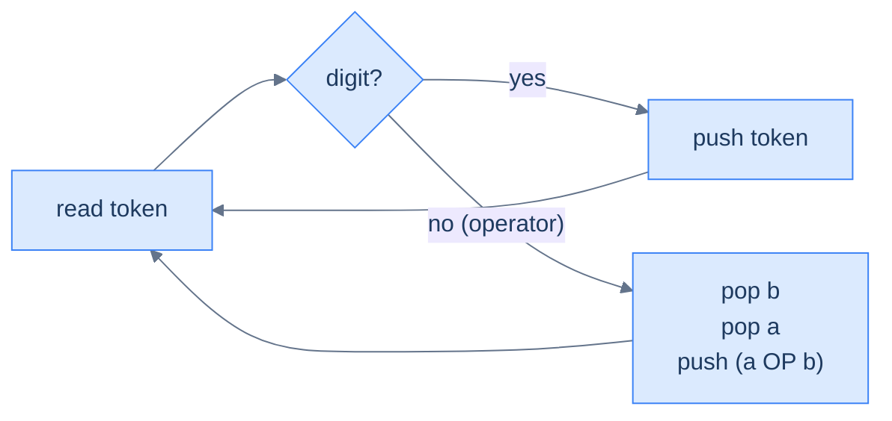
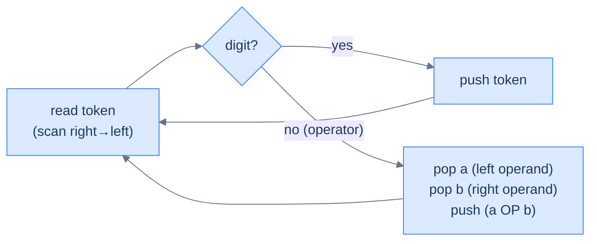
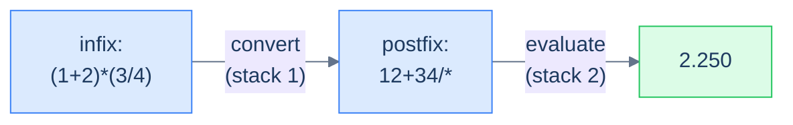

# 5. Evaluating Expressions Using a Stack

## The Hook

We just learned that postfix and prefix encode the order of operations *by position alone* — no parentheses, no precedence rules. That's a beautiful property, but it's only useful if we can actually *evaluate* such expressions efficiently. The good news: with a stack in our toolbox, the evaluator is one of the cleanest, most satisfying algorithms in the whole course. **Single pass over the string. One stack. No look-ahead. No backtracking. No special cases.** Push when you see an operand; pop two and push the result when you see an operator. The final number sitting alone on the stack is your answer.

That's it. Twelve lines of code. Linear time. Constant code complexity. The same pattern that runs inside every Reverse-Polish HP calculator, the inner loop of Forth interpreters, and the operand stack of the JVM.

This lesson builds three evaluators:

1. **Postfix evaluator** — the canonical one; left-to-right scan.
2. **Prefix evaluator** — same idea, scan right-to-left (or reverse the string and reuse the postfix logic with operand-order flipped).
3. **Infix evaluator** — the cheat: convert to postfix using the algorithm from the next lesson, then evaluate. Two stacks total, but each one is doing one thing well.

By the end you'll have a calculator core that handles `(2+3)*(4/2)` with the same code path as `23*4/+`. Same engine, three input dialects.

---

## Table of contents

1. [Understanding the evaluation of postfix expressions](#understanding-the-evaluation-of-postfix-expressions)
2. [Evaluate a postfix expression](#evaluate-a-postfix-expression)
3. [Understanding the evaluation of prefix expressions](#understanding-the-evaluation-of-prefix-expressions)
4. [Evaluate a prefix expression](#evaluate-a-prefix-expression)
5. [Evaluate an infix expression](#evaluate-an-infix-expression)

***

# Understanding the evaluation of postfix expressions

The recipe — three sentences:

1. Walk the string left to right.
2. If the token is an **operand**, push it onto the stack.
3. If the token is an **operator**, pop the top two values, apply the operator, push the result.

When the walk ends, the lone item on the stack is the answer.



<p align="center"><strong>Postfix evaluator — every iteration is either a push (operand) or a pop-two-push-one (operator). At end-of-input, the stack holds exactly one element: the result.</strong></p>

> **Crucial: operand order matters.**
>
> When you see `a b -` and pop in order, the *first* value popped is `b` (it was pushed second, so it's on top), and the *second* value popped is `a` (pushed first, now exposed). The operation is `a − b`, not `b − a`. Convention: name them `operand2 = stack.pop()` (popped first), then `operand1 = stack.pop()` (popped second), and call `op(operand1, operand2)`. For commutative operators (`+`, `*`) the order doesn't matter; for `-`, `/`, `^` it does, and getting it backwards silently produces wrong answers.

## Walkthrough — `2 3 1 * + 9 -`

The input is the postfix form of `(2 + 3*1) - 9 = -4`. Walk it:

| Step | Token | Action | Stack (top right) |
|---:|:---:|---|---|
| 1 | `2` | push | `[2]` |
| 2 | `3` | push | `[2, 3]` |
| 3 | `1` | push | `[2, 3, 1]` |
| 4 | `*` | pop 1, pop 3, push `3*1=3` | `[2, 3]` |
| 5 | `+` | pop 3, pop 2, push `2+3=5` | `[5]` |
| 6 | `9` | push | `[5, 9]` |
| 7 | `-` | pop 9, pop 5, push `5-9=-4` | `[-4]` |
| — | end | result is the lone item | **`-4`** |

<p align="center"><strong>Walking <code>2 3 1 * + 9 -</code> step by step — every operator collapses two stack entries into one, so the stack never grows past O(operands). The final element is the answer.</strong></p>

## Algorithm

> **Algorithm**
>
> -   **Step 1:** Initialise an empty stack.
> -   **Step 2:** For each character `ch` in the postfix string, left to right:
>     -   **2.1** If `ch` is a digit, push its numeric value.
>     -   **2.2** Else (`ch` is an operator):
>         -   `op2 = stack.pop()` (popped first → right operand)
>         -   `op1 = stack.pop()` (popped second → left operand)
>         -   push `apply(op1, ch, op2)`
> -   **Step 3:** Return `stack.top()`.

## Implementation


```python run
from typing import List

class Solution:

    # Function to perform arithmetic operations
    def perform_operation(
        self, operand1: float, operand2: float, operation: str
    ) -> float:
        if operation == "+":
            return operand1 + operand2
        elif operation == "-":
            return operand1 - operand2
        elif operation == "*":
            return operand1 * operand2
        elif operation == "/":
            return operand1 / operand2
        else:
            return 0

    def evaluate_a_postfix_expression(self, postfix: str) -> float:

        # Stack to store operands
        stack: List[float] = []

        # Iterate through each character in the postfix expression
        for ch in postfix:

            # If the character is an operand (a digit)
            if ch.isdigit():

                # Convert it to a float and push it onto the stack
                stack.append(float(ch))

            # If the character is an operator (an arithmetic symbol)
            # perform the operation on the top two operands in the stack
            # and push the result back onto the stack
            else:

                # Get the top operand from the stack
                operand2 = stack.pop()

                # Get the second top operand from the stack
                operand1 = stack.pop()

                # Apply the arithmetic operation and push the result back
                # to the stack
                stack.append(
                    self.perform_operation(operand1, operand2, ch)
                )

        # Return the final result
        return stack[-1]
```

```java run
import java.util.*;

class Solution {

    // Function to perform arithmetic operations
    public float performOperation(
        float operand1,
        float operand2,
        char operation
    ) {
        switch (operation) {
            case '+':
                return operand1 + operand2;
            case '-':
                return operand1 - operand2;
            case '*':
                return operand1 * operand2;
            case '/':
                return operand1 / operand2;
            default:
                return 0;
        }
    }

    public float evaluateAPostfixExpression(String postfix) {

        // Stack to store operands
        Stack<Float> stack = new Stack<>();

        // Iterate through each character in the postfix expression
        for (char ch : postfix.toCharArray()) {

            // If the character is an operand (a digit)
            if (Character.isDigit(ch)) {

                // Convert it to a float and push it onto the stack
                stack.push((float) (ch - '0'));
            }

            // If the character is an operator (an arithmetic symbol)
            // perform the operation on the top two operands in the stack
            // and push the result back onto the stack
            else {

                // Get the top operand from the stack
                float operand2 = stack.pop();

                // Get the second top operand from the stack
                float operand1 = stack.pop();

                // Apply the arithmetic operation and push the result
                // back to the stack
                stack.push(performOperation(operand1, operand2, ch));
            }
        }

        // Return the final result
        return stack.peek();
    }
}
```


## Complexity Analysis

Every character is processed once. Each operator triggers at most three stack operations (two pops, one push). The stack's maximum depth is bounded by the number of operands, which is bounded by the input length.

> **All cases** — Time: **O(N)** | Space: **O(N)**

***

# Evaluate a postfix expression

## Problem Statement

Given a string `postfix` representing a postfix expression with single-digit operands and the operators `+`, `-`, `*`, `/`, evaluate it and return the result as a float.

### Example

> -   **Input:** `postfix = "231*+9-"`
> -   **Output:** `-4.000`
> -   **Explanation:** Equivalent infix is `(2 + 3*1) - 9 = -4`.

<details>
<summary><h2>Solution</h2></summary>


The full evaluator from above, written compactly. Same code, just packaged as the answer to the problem.


```python run
from typing import List

class Solution:

    # Function to perform arithmetic operations
    def perform_operation(
        self, operand1: float, operand2: float, operation: str
    ) -> float:
        if operation == "+":
            return operand1 + operand2
        elif operation == "-":
            return operand1 - operand2
        elif operation == "*":
            return operand1 * operand2
        elif operation == "/":
            return operand1 / operand2
        else:
            return 0

    def evaluate_a_postfix_expression(self, postfix: str) -> float:

        # Stack to store operands
        stack: List[float] = []

        # Iterate through each character in the postfix expression
        for ch in postfix:

            # If the character is an operand (a digit)
            if ch.isdigit():

                # Convert it to a float and push it onto the stack
                stack.append(float(ch))

            # If the character is an operator (an arithmetic symbol)
            # perform the operation on the top two operands in the stack
            # and push the result back onto the stack
            else:

                # Get the top operand from the stack
                operand2 = stack.pop()

                # Get the second top operand from the stack
                operand1 = stack.pop()

                # Apply the arithmetic operation and push the result back
                # to the stack
                stack.append(
                    self.perform_operation(operand1, operand2, ch)
                )

        # Return the final result
        return stack[-1]


# Example from the problem statement
print(Solution().evaluate_a_postfix_expression("231*+9-"))   # -4.0

# Edge cases
print(Solution().evaluate_a_postfix_expression("23+"))       # 5.0 — simple addition
print(Solution().evaluate_a_postfix_expression("92-"))       # 7.0 — simple subtraction
print(Solution().evaluate_a_postfix_expression("82*"))       # 16.0 — multiplication
print(Solution().evaluate_a_postfix_expression("84/"))       # 2.0 — division
print(Solution().evaluate_a_postfix_expression("5"))         # 5.0 — single operand
print(Solution().evaluate_a_postfix_expression("34+2*"))     # 14.0 — (3+4)*2
print(Solution().evaluate_a_postfix_expression("72+3*"))     # 27.0 — (7+2)*3
```

```java run
import java.util.*;

public class Main {
    static class Solution {

        // Function to perform arithmetic operations
        private float performOperation(
            float operand1,
            float operand2,
            char operation
        ) {
            switch (operation) {
                case '+':
                    return operand1 + operand2;
                case '-':
                    return operand1 - operand2;
                case '*':
                    return operand1 * operand2;
                case '/':
                    return operand1 / operand2;
                default:
                    return 0;
            }
        }

        public float evaluateAPostfixExpression(String postfix) {

            // Stack to store operands
            Stack<Float> stack = new Stack<>();

            // Iterate through each character in the postfix expression
            for (char ch : postfix.toCharArray()) {

                // If the character is an operand (a digit)
                if (Character.isDigit(ch)) {

                    // Convert it to a float and push it onto the stack
                    stack.push((float) (ch - '0'));
                }

                // If the character is an operator (an arithmetic symbol)
                // perform the operation on the top two operands in the stack
                // and push the result back onto the stack
                else {

                    // Get the top operand from the stack
                    float operand2 = stack.pop();

                    // Get the second top operand from the stack
                    float operand1 = stack.pop();

                    // Apply the arithmetic operation and push the result
                    // back to the stack
                    stack.push(performOperation(operand1, operand2, ch));
                }
            }

            // Return the final result
            return stack.peek();
        }
    }

    public static void main(String[] args) {
        // Example from the problem statement
        System.out.println(new Solution().evaluateAPostfixExpression("231*+9-"));  // -4.0

        // Edge cases
        System.out.println(new Solution().evaluateAPostfixExpression("23+"));      // 5.0
        System.out.println(new Solution().evaluateAPostfixExpression("92-"));      // 7.0
        System.out.println(new Solution().evaluateAPostfixExpression("82*"));      // 16.0
        System.out.println(new Solution().evaluateAPostfixExpression("84/"));      // 2.0
        System.out.println(new Solution().evaluateAPostfixExpression("5"));        // 5.0 — single operand
        System.out.println(new Solution().evaluateAPostfixExpression("34+2*"));    // 14.0
        System.out.println(new Solution().evaluateAPostfixExpression("72+3*"));    // 27.0
    }
}
```

</details>


***

# Understanding the evaluation of prefix expressions

Prefix is postfix's mirror. Same algorithm with two changes:

1. **Scan right to left** instead of left to right.
2. **Operand order is flipped.** When we hit an operator, the *first* value popped is the *left* operand (because under right-to-left scan, the most recently seen operand is the leftmost one), and the second pop is the *right* operand. This is the opposite of postfix.



<p align="center"><strong>Prefix evaluator — same shape as postfix; only the scan direction and the operand-pop order change. Easiest to implement by reversing the input string and reusing the postfix loop, taking care to flip the order of operand assignment.</strong></p>

## Walkthrough — `- + 8 / 6 3 2`

Equivalent infix: `(8 + 6/3) - 2 = 8`. Reversed string: `2 3 6 / 8 + -`. Walk the reversed string left-to-right, treating the first pop as the left operand:

| Step | Token | Action (first pop = left operand) | Stack (top right) |
|---:|:---:|---|---|
| 1 | `2` | push | `[2]` |
| 2 | `3` | push | `[2, 3]` |
| 3 | `6` | push | `[2, 3, 6]` |
| 4 | `/` | pop a=6, pop b=3, push `6/3=2` | `[2, 2]` |
| 5 | `8` | push | `[2, 2, 8]` |
| 6 | `+` | pop a=8, pop b=2, push `8+2=10` | `[2, 10]` |
| 7 | `-` | pop a=10, pop b=2, push `10-2=8` | `[8]` |
| — | end | result is the lone item | **`8`** |

<p align="center"><strong>Prefix evaluation, after reversing the input — same single-pass shape as postfix, but the first pop is the <em>left</em> operand. Notice <code>6/3=2</code>, not <code>3/6</code>; the operand order matters and the swap is the only thing that's changed from postfix.</strong></p>

***

# Evaluate a prefix expression

## Problem Statement

Given a string `prefix` (single-digit operands, operators `+`, `-`, `*`, `/`), evaluate and return the result.

### Example

> -   **Input:** `prefix = "-+8/632"`
> -   **Output:** `8.000`
> -   **Explanation:** Equivalent infix is `(8 + 6/3) - 2 = 8`.

<details>
<summary><h2>Solution &amp; Analysis</h2></summary>

### Solution

```python run
from typing import List

class Solution:

    # Function to perform arithmetic operations
    def perform_operation(
        self, operand1: float, operand2: float, operation: str
    ) -> float:
        if operation == "+":
            return operand1 + operand2
        elif operation == "-":
            return operand1 - operand2
        elif operation == "*":
            return operand1 * operand2
        elif operation == "/":
            return operand1 / operand2
        else:
            return 0

    def evaluate_a_prefix_expression(self, prefix: str) -> float:

        # Initialize an empty stack to store operands
        stack: List[float] = []

        # Reverse the prefix expression
        reversed_prefix = prefix[::-1]

        # Iterate through each character in the reversed prefix
        # expression
        for ch in reversed_prefix:

            # If the character is an operand (a digit)
            if ch.isdigit():

                # Convert it to a float and push it onto the stack
                stack.append(float(ch))

            # If the character is an operator (an arithmetic symbol)
            # perform the operation on the top two operands in the stack
            # and push the result back onto the stack
            else:

                # Pop the top element from the stack as the first operand
                operand1 = stack.pop()

                # Pop the top element from the stack as the second
                # operand
                operand2 = stack.pop()

                # Apply the arithmetic operation and push the result back
                # to the stack
                stack.append(
                    self.perform_operation(operand1, operand2, ch)
                )

        # Return the final result
        return stack.pop()


# Example from the problem statement
print(Solution().evaluate_a_prefix_expression("-+8/632"))   # 8.0

# Edge cases
print(Solution().evaluate_a_prefix_expression("+23"))       # 5.0 — simple addition
print(Solution().evaluate_a_prefix_expression("-92"))       # 7.0 — subtraction
print(Solution().evaluate_a_prefix_expression("*82"))       # 16.0 — multiplication
print(Solution().evaluate_a_prefix_expression("/84"))       # 2.0 — division
print(Solution().evaluate_a_prefix_expression("5"))         # 5.0 — single operand
print(Solution().evaluate_a_prefix_expression("*+342"))     # 14.0 — (3+4)*2
print(Solution().evaluate_a_prefix_expression("*+723"))     # 27.0 — (7+2)*3
```

```java run
import java.util.*;

public class Main {
    static class Solution {

        // Function to perform arithmetic operations
        private float performOperation(
            float operand1,
            float operand2,
            char operation
        ) {
            switch (operation) {
                case '+':
                    return operand1 + operand2;
                case '-':
                    return operand1 - operand2;
                case '*':
                    return operand1 * operand2;
                case '/':
                    return operand1 / operand2;
                default:
                    return 0;
            }
        }

        public float evaluateAPrefixExpression(String prefix) {

            // Initialize an empty stack to store operands
            Stack<Float> stack = new Stack<>();

            // Reverse the prefix expression
            String reversedPrefix = new StringBuilder(prefix)
                .reverse()
                .toString();

            // Iterate through each character in the reversed prefix
            // expression
            for (char ch : reversedPrefix.toCharArray()) {

                // If the character is an operand (a digit)
                if (Character.isDigit(ch)) {

                    // Convert it to a float and push it onto the stack
                    stack.push((float) (ch - '0'));
                }

                // If the character is an operator (an arithmetic symbol)
                // perform the operation on the top two operands in the stack
                // and push the result back onto the stack
                else {

                    // Pop the top element from the stack as the first
                    // operand
                    float operand1 = stack.pop();

                    // Pop the top element from the stack as the second
                    // operand
                    float operand2 = stack.pop();

                    // Apply the arithmetic operation and push the result
                    // back to the stack
                    stack.push(performOperation(operand1, operand2, ch));
                }
            }

            // Return the final result
            return stack.pop();
        }
    }

    public static void main(String[] args) {
        // Example from the problem statement
        System.out.println(new Solution().evaluateAPrefixExpression("-+8/632"));  // 8.0

        // Edge cases
        System.out.println(new Solution().evaluateAPrefixExpression("+23"));      // 5.0
        System.out.println(new Solution().evaluateAPrefixExpression("-92"));      // 7.0
        System.out.println(new Solution().evaluateAPrefixExpression("*82"));      // 16.0
        System.out.println(new Solution().evaluateAPrefixExpression("/84"));      // 2.0
        System.out.println(new Solution().evaluateAPrefixExpression("5"));        // 5.0 — single operand
        System.out.println(new Solution().evaluateAPrefixExpression("*+342"));    // 14.0
        System.out.println(new Solution().evaluateAPrefixExpression("*+723"));    // 27.0
    }
}
```


> **Algorithm**
>
> -   **Step 1:** Initialise an empty stack.
> -   **Step 2:** For each character `ch` in the prefix string, **right to left**:
>     -   **2.1** If `ch` is a digit, push its numeric value.
>     -   **2.2** Else: `op1 = stack.pop()` (LEFT), `op2 = stack.pop()` (RIGHT), push `apply(op1, ch, op2)`.
> -   **Step 3:** Return `stack.top()`.

### Complexity Analysis

> **All cases** — Time: **O(N)** | Space: **O(N)**

</details>

***

# Evaluate an infix expression

## Problem Statement

Given an infix expression like `(1+2)*(3/4)`, evaluate it and return the result.

### Example

> -   **Input:** `infix = "(1+2)*(3/4)"`
> -   **Output:** `2.250`

<details>
<summary><h2>Approach</h2></summary>


The trick: **don't evaluate infix directly** — *convert it to postfix* (using the algorithm in the next lesson, which uses one stack), and then evaluate the postfix (using the algorithm we just built, which uses one stack). Two passes; two stacks; same overall O(N).

The full conversion from infix to postfix gets its own lesson because there's quite a bit of nuance — operator precedence comparisons, parentheses handling, the fact that `^` is right-associative while `*` and `/` are left-associative. We'll show the converter inline below for completeness, but the *teaching* of how it works is in lesson 6.



<p align="center"><strong>Infix evaluator — convert first (lesson 6 covers the converter), then evaluate. Each stage is a simple single-stack algorithm; combined, they handle parentheses, precedence, and associativity in two linear passes.</strong></p>

</details>
<details>
<summary><h2>Solution</h2></summary>


```python run
from typing import List

class Solution:

    # Function to check if the character is an operator
    def is_operator(self, ch: str) -> bool:
        return not ch.isalpha() and not ch.isdigit()

    # Function to get the priority of operators
    def get_precedence(self, operator: str) -> int:

        # Assign precedence values to different operators
        if operator == "^":
            return 3
        elif operator == "*" or operator == "/":
            return 2
        elif operator == "+" or operator == "-":
            return 1

        # Default value for unknown operators
        return -1

    # Function to convert infix expression to postfix expression
    def convert_infix_to_postfix(self, infix: str) -> str:

        # Stack to hold operators and parentheses
        stack: List[str] = []

        # Final postfix expression
        postfix: str = ""

        for ch in infix:

            # If the character is not an operator or parentheses, add
            # it to the postfix string
            if not self.is_operator(ch) and ch != "(" and ch != ")":
                postfix += ch

            # If the character is an opening parentheses, push it
            # onto the stack
            elif ch == "(":
                stack.append(ch)

            # If the character is a closing parentheses, pop operators
            # from the stack and add them to the postfix string until an
            # opening parentheses is encountered
            elif ch == ")":
                while stack and stack[-1] != "(":
                    postfix += stack.pop()

                # Remove the opening parentheses from the stack
                if stack and stack[-1] == "(":
                    stack.pop()

            # If the character is an operator, compare its precedence
            # with the top of the stack and add higher or equal
            # precedence operators to the postfix string
            else:
                while stack and self.get_precedence(
                    ch
                ) <= self.get_precedence(stack[-1]):
                    if stack[-1] != "(":
                        postfix += stack.pop()

                # Push the current operator onto the stack
                stack.append(ch)

        # Pop any remaining operators from the stack and add them to the
        # postfix string
        while stack:
            postfix += stack.pop()

        return postfix

    # Function to perform arithmetic operations
    def perform_operation(
        self, operand1: float, operand2: float, operation: str
    ) -> float:
        if operation == "+":
            return operand1 + operand2
        elif operation == "-":
            return operand1 - operand2
        elif operation == "*":
            return operand1 * operand2
        elif operation == "/":
            return operand1 / operand2
        else:
            return 0

    # Function to evaluate a postfix expression
    def evaluate_a_postfix_expression(self, postfix: str) -> float:

        # Stack to store operands
        stack: List[float] = []

        # Iterate through each character in the postfix expression
        for ch in postfix:

            # If the character is an operand (a digit)
            if ch.isdigit():

                # Convert it to a float and push it onto the stack
                stack.append(float(ch))

            # If the character is an operator (an arithmetic symbol)
            # perform the operation on the top two operands in the stack
            # and push the result back onto the stack
            else:

                # Pop the top element from the stack as the second
                # operand
                operand2 = stack.pop()

                # Pop the top element from the stack as the first
                # operand
                operand1 = stack.pop()

                # Apply the arithmetic operation and push the result back
                # to the stack
                stack.append(
                    self.perform_operation(operand1, operand2, ch)
                )

        # Return the final result
        return stack[-1]

    def evaluate_an_infix_expression(self, infix: str) -> float:

        # Convert the infix expression to postfix notation
        postfix: str = self.convert_infix_to_postfix(infix)

        # Evaluate the postfix expression and return the result
        return self.evaluate_a_postfix_expression(postfix)


# Example from the problem statement
print(Solution().evaluate_an_infix_expression("(1+2)*(3/4)"))   # 2.25

# Edge cases
print(Solution().evaluate_an_infix_expression("2+3"))           # 5.0 — no parentheses
print(Solution().evaluate_an_infix_expression("(2+3)"))         # 5.0 — simple grouped
print(Solution().evaluate_an_infix_expression("8-2"))           # 6.0 — subtraction
print(Solution().evaluate_an_infix_expression("4*2"))           # 8.0 — multiplication
print(Solution().evaluate_an_infix_expression("9/3"))           # 3.0 — division
print(Solution().evaluate_an_infix_expression("2+3*4"))         # 14.0 — precedence
print(Solution().evaluate_an_infix_expression("(2+3)*4"))       # 20.0 — parens override precedence
```

```java run
import java.util.*;

public class Main {
    static class Solution {

        // Function to check if the character is an operator
        private boolean isOperator(char ch) {
            return (!Character.isLetter(ch) && !Character.isDigit(ch));
        }

        // Function to get the priority of operators
        private int getPrecedence(char operator) {

            // Assign precedence values to different operators
            if (operator == '^') {
                return 3;
            } else if (operator == '*' || operator == '/') {
                return 2;
            } else if (operator == '+' || operator == '-') {
                return 1;
            }

            // Default value for unknown operators
            return -1;
        }

        // Function to convert infix expression to postfix expression
        private String convertInfixToPostfix(String infix) {

            // Stack to hold operators and parentheses
            Stack<Character> stack = new Stack<>();

            // Final postfix expression
            StringBuilder postfix = new StringBuilder();

            for (char ch : infix.toCharArray()) {

                // If the character is not an operator or parentheses,
                // add it to the postfix string
                if (!isOperator(ch) && ch != '(' && ch != ')') {
                    postfix.append(ch);
                }

                // If the character is an opening parentheses, push it
                // onto the stack
                else if (ch == '(') {
                    stack.push(ch);
                }

                // If the character is a closing parentheses, pop
                // operators from the stack and add them to the postfix
                // string until an opening parentheses is encountered
                else if (ch == ')') {
                    while (!stack.empty() && stack.peek() != '(') {
                        postfix.append(stack.peek());
                        stack.pop();
                    }

                    // Remove the opening parentheses from the stack
                    if (!stack.empty() && stack.peek() == '(') {
                        stack.pop();
                    }
                }

                // If the character is an operator, compare its
                // precedence with the top of the stack and add higher or
                // equal precedence operators to the postfix string
                else {
                    while (
                        !stack.empty() &&
                        getPrecedence(ch) <= getPrecedence(stack.peek())
                    ) {
                        if (stack.peek() != '(') {
                            postfix.append(stack.peek());
                        }
                        stack.pop();
                    }

                    // Push the current operator onto the stack
                    stack.push(ch);
                }
            }

            // Pop any remaining operators from the stack and add them to the
            // postfix string
            while (!stack.empty()) {
                postfix.append(stack.peek());
                stack.pop();
            }

            return postfix.toString();
        }

        // Function to perform arithmetic operations
        private float performOperation(
            float operand1,
            float operand2,
            char operation
        ) {
            switch (operation) {
                case '+':
                    return operand1 + operand2;
                case '-':
                    return operand1 - operand2;
                case '*':
                    return operand1 * operand2;
                case '/':
                    return operand1 / operand2;
                default:
                    return 0;
            }
        }

        // Function to evaluate a postfix expression
        private float evaluateAPostfixExpression(String postfix) {

            // Stack to store operands
            Stack<Float> stack = new Stack<>();

            // Iterate through each character in the postfix expression
            for (char ch : postfix.toCharArray()) {

                // If the character is an operand (a digit)
                if (Character.isDigit(ch)) {

                    // Convert it to a float and push it onto the stack
                    stack.push((float) (ch - '0'));
                }

                // If the character is an operator (an arithmetic symbol)
                // perform the operation on the top two operands in the stack
                // and push the result back onto the stack
                else {

                    // Pop the top element from the stack as the second
                    // operand
                    float operand2 = stack.peek();
                    stack.pop();

                    // Pop the top element from the stack as the first
                    // operand
                    float operand1 = stack.peek();
                    stack.pop();

                    // Apply the arithmetic operation and push the result
                    // back to the stack
                    stack.push(performOperation(operand1, operand2, ch));
                }
            }

            // Return the final result
            return stack.peek();
        }

        public float evaluateAnInfixExpression(String infix) {

            // Convert the infix expression to postfix notation
            String postfix = convertInfixToPostfix(infix);

            // Evaluate the postfix expression and return the result
            return evaluateAPostfixExpression(postfix);
        }
    }

    public static void main(String[] args) {
        // Example from the problem statement
        System.out.println(new Solution().evaluateAnInfixExpression("(1+2)*(3/4)"));  // 2.25

        // Edge cases
        System.out.println(new Solution().evaluateAnInfixExpression("2+3"));          // 5.0
        System.out.println(new Solution().evaluateAnInfixExpression("(2+3)"));        // 5.0
        System.out.println(new Solution().evaluateAnInfixExpression("8-2"));          // 6.0
        System.out.println(new Solution().evaluateAnInfixExpression("4*2"));          // 8.0
        System.out.println(new Solution().evaluateAnInfixExpression("9/3"));          // 3.0
        System.out.println(new Solution().evaluateAnInfixExpression("2+3*4"));        // 14.0
        System.out.println(new Solution().evaluateAnInfixExpression("(2+3)*4"));      // 20.0
    }
}
```

</details>
<details>
<summary><h2>Final Takeaway</h2></summary>


Three evaluators, one architecture: **a stack of operands plus a left-to-right or right-to-left scan**. The differences between the three notations collapse to a few lines of code.

Three lessons:

1. **The stack is the working memory.** Every partial result lives there until the next operator consumes it. The maximum stack depth is bounded by the number of nested operations; for sane expressions, that's tiny.
2. **Operand order matters for non-commutative operators.** Postfix: first pop = right operand. Prefix: first pop = left operand. Get this backwards and `+` and `*` will still be correct, but `-` and `/` will silently produce wrong answers.
3. **Infix is a wrapper, not a primitive.** Real infix evaluators don't try to evaluate infix directly — they convert to postfix (or to an AST, which is just a tree-shaped postfix) and evaluate that. Two simple stages compose into a calculator that handles arbitrary precedence and parentheses.

> *Coming up — the **infix-to-postfix converter** that this lesson skipped over. Lesson 6 is the formal Shunting-Yard algorithm: one stack of operators, one output buffer, careful precedence comparisons, parentheses handling. It's the algorithm Edsger Dijkstra invented in 1961 and that every serious calculator and parser still uses today. Once you have it, you have a complete arithmetic evaluator.*

</details>

<!-- ============================================== -->
<!-- SWEEP 2 — missing sections (placeholders only) -->
<!-- ============================================== -->

<!-- TODO: Understanding the Problem — missing, needs to be written -->
<!--       Guidance: frame the gap the structure/algorithm fills -->

<!-- TODO: Supported Operations — missing, needs to be written -->
<!--       Guidance: table: operation / time / notes -->

<!-- TODO: Internal Mechanics — missing, needs to be written -->
<!--       Guidance: how it actually works under the hood -->

<!-- TODO: Working Example — missing, needs to be written -->
<!--       Guidance: one fully worked end-to-end example -->

<!-- TODO: Edge Cases & Pitfalls — missing, needs to be written -->
<!--       Guidance: bulleted list of gotchas -->

<!-- TODO: Production Reality — missing, needs to be written -->
<!--       Guidance: 4–6 entries: System — uses X — because Y -->

<!-- TODO: Quiz — missing, needs to be written -->
<!--       Guidance: 3–5 questions, each labeled [Recall]/[Reasoning]/[Tradeoff] -->

<!-- TODO: Practice Ladder — missing, needs to be written -->
<!--       Guidance: table: 5 links into pattern problems + hints -->

<!-- TODO: Further Reading — missing, needs to be written -->
<!--       Guidance: annotated: ★ Essential / ◆ Advanced / → Reference -->

<!-- TODO: Cross-Links — missing, needs to be written -->
<!--       Guidance: Prerequisites | What comes next -->

<!-- TODO: Final Takeaway — missing, needs to be written -->
<!--       Guidance: exactly 3 typed bullets: Core mechanic / Dominant tradeoff / One thing to remember -->
