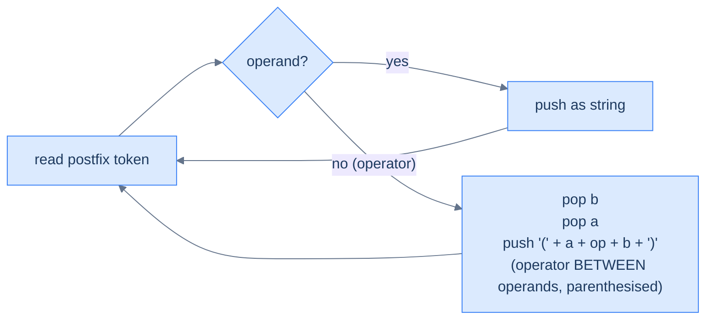
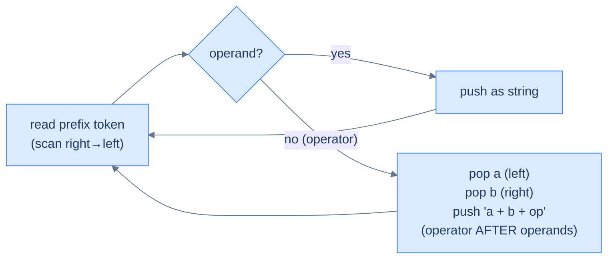
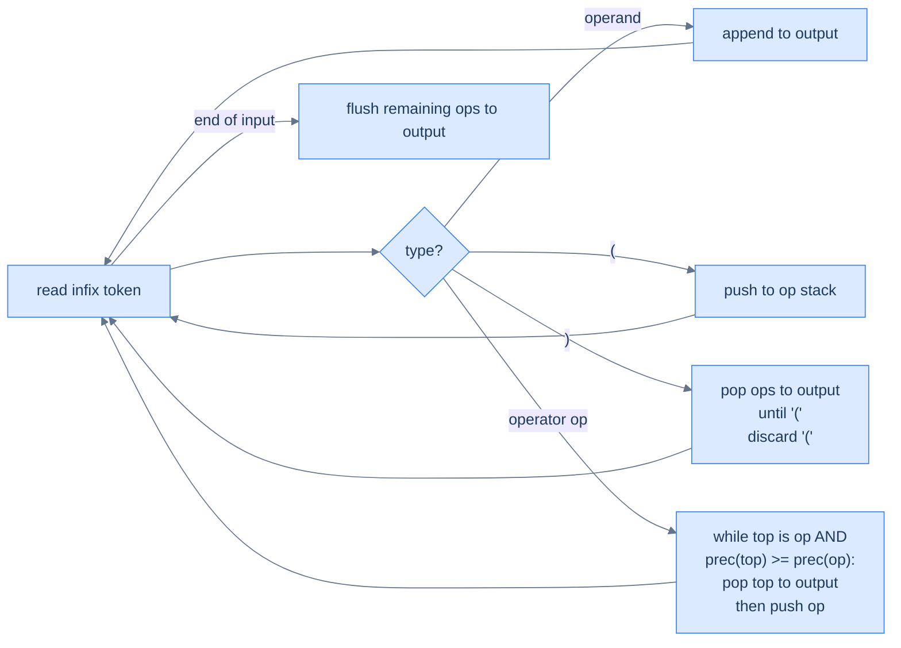
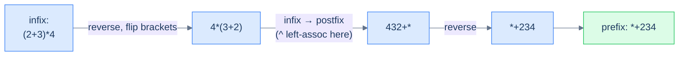

# 6. Converting Expressions Using a Stack

## The Hook

Three notations, six possible conversions. You might *expect* that converting between them is a six-different-algorithms ordeal. **It's not.** Once you see the pattern, all six conversions reduce to two ideas, each of which uses one stack:

1. **Postfix-or-prefix → anything else**: scan the source linearly (left-to-right for postfix, right-to-left for prefix), push operands onto a *string* stack, and on every operator pop two strings and glue them together with the operator between (or before, or after) them. The operator placement determines the output notation; the scanning direction determines whether you're reading postfix or prefix.

2. **Infix → postfix**: a slightly cleverer dance called the **Shunting-Yard algorithm** (Edsger Dijkstra, 1961), where operators wait on a stack until something with lower-or-equal precedence shows up to push them out into the output. Parentheses become temporary "fences" that block this eviction. Once you have infix→postfix, infix→prefix is one extra reverse-and-flip-brackets trick away.

The same handful of moves — *push operand, pop-two-and-combine, peek-and-compare-precedence, flush-on-paren* — appears in every parser, every compiler, and every spreadsheet evaluator you'll ever read about. This lesson is the most code-dense in the entire stack section, but the patterns recur enough that by the third conversion you'll be writing the fourth from memory.

---

## Table of contents

1. [Understanding the problem](#understanding-the-problem)
2. [Postfix → Prefix](#understanding-postfix-to-prefix-conversion)
3. [Convert postfix to prefix](#convert-postfix-to-prefix)
4. [Postfix → Infix](#understanding-postfix-to-infix-conversion)
5. [Convert postfix to infix](#convert-postfix-to-infix)
6. [Prefix → Postfix](#understanding-prefix-to-postfix-conversion)
7. [Convert prefix to postfix](#convert-prefix-to-postfix)
8. [Prefix → Infix](#understanding-prefix-to-infix-conversion)
9. [Convert prefix to infix](#convert-prefix-to-infix)
10. [Infix → Postfix](#understanding-infix-to-postfix-conversion)
11. [Convert infix to postfix](#convert-infix-to-postfix)
12. [Infix → Prefix](#understanding-infix-to-prefix-conversion)
13. [Convert infix to prefix](#convert-infix-to-prefix)
14. [Supported operations](#supported-operations)
15. [Internal mechanics](#internal-mechanics)
16. [Working example](#working-example)
17. [Edge cases and pitfalls](#edge-cases-and-pitfalls)
18. [Production reality](#production-reality)
19. [Practice ladder](#practice-ladder)
20. [Quiz](#quiz)
21. [Further reading](#further-reading)
22. [Cross-links](#cross-links)
23. [Final takeaway](#final-takeaway)

***

# Understanding the Problem

A conversion routine exists to move an expression between notations without changing what it computes — and the trap is that the notations are not related by any string operation. Reversing a postfix string does not give prefix; flipping operators in place does not give infix. The operand order is always left-to-right in every notation, but the operator positions move, and moving them correctly requires rebuilding the operator–operand grouping rather than shuffling characters.

The six conversions split by what the source notation already tells you:

- **From postfix or prefix** — the source already encodes evaluation order by position, so one linear scan with a string stack rebuilds any target. Pop two sub-expressions, glue the operator on, push the combined string back.
- **From infix** — the source hides order behind precedence and parentheses, so the conversion must *recover* that order first. That recovery is the Shunting-Yard algorithm, and `infix → prefix` reuses it after a reverse-and-flip.

To make this concrete: converting postfix `231*+9-` to prefix is a single left-to-right walk that folds the string into `-+2*319`. Converting infix `(2+3)*4` to postfix cannot relocate the `*` and `+` in place — it has to let `+` wait on a stack behind the `(` fence, emit it when `)` arrives, then emit `*` at end of input to produce `23+4*`.

So the key idea is: **conversion preserves operand order and re-places operators, and the source notation decides whether one scan suffices (postfix/prefix) or a precedence-aware pass is needed first (infix).**

***

# Understanding postfix to prefix conversion

Postfix and prefix look like mirror images, but **simply reversing a postfix string does not produce the equivalent prefix string**. Reversing `2 3 1 * + 9 -` gives `9 - + * 1 3 2`, which isn't a valid prefix expression — the operands and operators are now in the wrong relative pairing. Operator–operand grouping must be preserved across the conversion, and a stack of *partial expressions* is the tool that does it.


<p align="center"><strong>Postfix → prefix — same loop shape as the postfix evaluator, but the stack holds <em>strings</em> (sub-expressions in prefix form) rather than numbers, and an operator combines them with itself <em>at the front</em>.</strong></p>

## Walkthrough — `2 3 1 * + 9 -`

| Step | Token | Action | Stack (top right) |
|---:|:---:|---|---|
| 1 | `2` | push `'2'` | `['2']` |
| 2 | `3` | push `'3'` | `['2','3']` |
| 3 | `1` | push `'1'` | `['2','3','1']` |
| 4 | `*` | pop `'1'`, pop `'3'`, push `'*31'` | `['2','*31']` |
| 5 | `+` | pop `'*31'`, pop `'2'`, push `'+2*31'` | `['+2*31']` |
| 6 | `9` | push `'9'` | `['+2*31','9']` |
| 7 | `-` | pop `'9'`, pop `'+2*31'`, push `'-+2*319'` | `['-+2*319']` |
| — | end | result is the lone item | **`-+2*319`** |

<p align="center"><strong>Postfix <code>231*+9-</code> → prefix <code>-+2*319</code>. The stack is a <em>string</em> stack — every operator combines two existing prefix sub-expressions into a larger one. Operand order: first pop is right; second pop is left.</strong></p>

## Algorithm

> -   **Step 1:** Initialise an empty string stack.
> -   **Step 2:** For each character of the postfix string left to right:
>     -   If operand, push it (as a one-character string).
>     -   Else (operator): `b = pop()`, `a = pop()`, push `op + a + b`.
> -   **Step 3:** Return the lone string on the stack.

***

# Convert postfix to prefix

## Problem Statement

Given a postfix expression `postfix`, return the equivalent prefix expression. Operands are single-character (digit or letter); operators are `+`, `-`, `*`, `/`, `^`.

### Example
> -   **Input:** `postfix = "231*+9-"` → **Output:** `"-+2*319"`

<details>
<summary><h2>Solution</h2></summary>


```python run viz=array viz-root=stack viz-kind=stack
from typing import List

class Solution:

    # Function to check if a character is an operator
    def is_operator(self, ch: str) -> bool:
        return not ch.isalpha() and not ch.isdigit()

    def convert_postfix_to_prefix(self, postfix: str) -> str:
        stack: List[str] = []
        length: int = len(postfix)

        for i in range(length):

            # If the character is an operator, pop the top two
            # elements from the stack
            if self.is_operator(postfix[i]):

                # Pop the top element from the stack as the second
                # operand
                operand2 = stack.pop()

                # Pop the top element from the stack as the first
                # operand
                operand1 = stack.pop()

                # Construct the prefix expression by placing the operator
                # before the operands
                expr = postfix[i] + operand1 + operand2
                stack.append(expr)

            # If the character is not an operator, push it to the
            # stack as a single-character string
            else:
                stack.append(postfix[i])

        # The final element in the stack will be the prefix expression
        return stack.pop()


# Example from the problem statement
print(Solution().convert_postfix_to_prefix("783/-52/6-*"))   # *-7/83-/526

# Edge cases
print(Solution().convert_postfix_to_prefix("ab+"))           # +ab — single operation
print(Solution().convert_postfix_to_prefix("abc**"))         # *a*bc — right-associative chain
print(Solution().convert_postfix_to_prefix("ab+c-"))         # -+abc — two operators
print(Solution().convert_postfix_to_prefix("ab-cd+*"))       # *-ab+cd
print(Solution().convert_postfix_to_prefix("abcd-+*"))       # *a+-bcd
print(Solution().convert_postfix_to_prefix("ab+cd+*"))       # *+ab+cd
```

```java run viz=array viz-root=stack viz-kind=stack
import java.util.*;

public class Main {
    static class Solution {

        // Function to check if a character is an operator
        private boolean isOperator(char ch) {
            return (!Character.isLetter(ch) && !Character.isDigit(ch));
        }

        public String convertPostfixToPrefix(String postfix) {
            Stack<String> stack = new Stack<>();
            int length = postfix.length();

            for (int i = 0; i < length; i++) {

                // If the character is an operator, pop the top two
                // elements from the stack
                if (isOperator(postfix.charAt(i))) {

                    // Pop the top element from the stack as the second
                    // operand
                    String operand2 = stack.pop();

                    // Pop the top element from the stack as the first
                    // operand
                    String operand1 = stack.pop();

                    // Construct the prefix expression by placing the
                    // operator before the operands
                    String expr = postfix.charAt(i) + operand1 + operand2;
                    stack.push(expr);
                }

                // If the character is not an operator, push it to the
                // stack as a single-character string
                else {
                    stack.push(String.valueOf(postfix.charAt(i)));
                }
            }

            // The final element in the stack will be the prefix expression
            return stack.pop();
        }
    }

    public static void main(String[] args) {
        // Example from the problem statement
        System.out.println(new Solution().convertPostfixToPrefix("783/-52/6-*"));  // *-7/83-/526

        // Edge cases
        System.out.println(new Solution().convertPostfixToPrefix("ab+"));          // +ab
        System.out.println(new Solution().convertPostfixToPrefix("abc**"));        // *a*bc
        System.out.println(new Solution().convertPostfixToPrefix("ab+c-"));        // -+abc
        System.out.println(new Solution().convertPostfixToPrefix("ab-cd+*"));      // *-ab+cd
        System.out.println(new Solution().convertPostfixToPrefix("abcd-+*"));      // *a+-bcd
        System.out.println(new Solution().convertPostfixToPrefix("ab+cd+*"));      // *+ab+cd
    }
}
```


> **All cases** — Time: **O(N²)** worst-case (string concatenation), Space: **O(N²)** worst-case. With efficient string-builders this drops to **O(N)** time and **O(N)** space.

</details>

***

# Understanding postfix to infix conversion

Same algorithm — only the combine step changes. Where prefix wrote `op + a + b`, **infix wraps the operator in parentheses around the two operands**: `( a + op + b )`. The parentheses are necessary because we don't track precedence inside the stack — they ensure the produced expression evaluates the same way regardless of where it gets nested.



<p align="center"><strong>Postfix → infix — operand pops as before, but the combine step wraps the result in parentheses to preserve precedence. The output may have <em>more</em> parentheses than strictly needed, but it's always correct.</strong></p>

## Algorithm

> -   **Step 1:** Initialise an empty string stack.
> -   **Step 2:** For each character of the postfix string left to right:
>     -   If operand, push it.
>     -   Else: `b = pop()`, `a = pop()`, push `(a + op + b)`.
> -   **Step 3:** Return the lone string on the stack.

***

# Convert postfix to infix

<details>
<summary><h2>Example</h2></summary>


> -   **Input:** `postfix = "231*+9-"` → **Output:** `"((2+(3*1))-9)"`

</details>
<details>
<summary><h2>Solution</h2></summary>


```python run viz=array viz-root=stack viz-kind=stack
from typing import List

class Solution:

    # Function to check if a character is an operator
    def is_operator(self, ch: str) -> bool:
        return not ch.isalpha() and not ch.isdigit()

    def convert_postfix_to_infix(self, postfix: str) -> str:
        stack: List[str] = []
        length: int = len(postfix)

        for i in range(length):

            # If the character is an operator, pop the top two elements
            # from the stack and construct the infix expression by
            # placing the operands and operator within parentheses
            if self.is_operator(postfix[i]):

                # Pop the top element from the stack as the second
                # operand
                operand2 = stack.pop()

                # Pop the top element from the stack as the first operand
                operand1 = stack.pop()

                # Construct the infix expression by placing the operands
                # and operator within parentheses
                expr: str = "(" + operand1 + postfix[i] + operand2 + ")"
                stack.append(expr)

            # If the character is not an operator, push it to the
            # stack as a single-character string
            else:
                stack.append(postfix[i])

        # The final element in the stack will be the infix expression
        return stack.pop()


# Example from the problem statement
print(Solution().convert_postfix_to_infix("5647^9-326*+^*+2-"))   # ((5+(6*(((4^7)-9)^(3+(2*6)))))-2)

# Edge cases
print(Solution().convert_postfix_to_infix("ab+"))                  # (a+b)
print(Solution().convert_postfix_to_infix("abc**"))                # (a*(b*c))
print(Solution().convert_postfix_to_infix("ab+c-"))                # ((a+b)-c)
print(Solution().convert_postfix_to_infix("ab-cd+*"))              # ((a-b)*(c+d))
print(Solution().convert_postfix_to_infix("ab+cd+*"))              # ((a+b)*(c+d))
print(Solution().convert_postfix_to_infix("abcd-+*"))              # (a*(b+(c-d)))
```

```java run viz=array viz-root=stack viz-kind=stack
import java.util.*;

public class Main {
    static class Solution {

        // Function to check if a character is an operator
        private boolean isOperator(char ch) {
            return (!Character.isLetter(ch) && !Character.isDigit(ch));
        }

        public String convertPostfixToInfix(String postfix) {
            Stack<String> stack = new Stack<>();
            int length = postfix.length();

            for (int i = 0; i < length; i++) {

                // If the character is an operator, pop the top two elements
                // from the stack and construct the infix expression by
                // placing the operands and operator within parentheses
                if (isOperator(postfix.charAt(i))) {

                    // Pop the top element from the stack as the second
                    // operand
                    String operand2 = stack.pop();

                    // Pop the top element from the stack as the first
                    // operand
                    String operand1 = stack.pop();

                    // Construct the infix expression by placing the operands
                    // and operator within parentheses
                    String expr =
                        "(" + operand1 + postfix.charAt(i) + operand2 + ")";
                    stack.push(expr);
                }

                // If the character is not an operator, push it to the
                // stack as a single-character string
                else {
                    stack.push(String.valueOf(postfix.charAt(i)));
                }
            }

            // The final element in the stack will be the infix expression
            return stack.pop();
        }
    }

    public static void main(String[] args) {
        // Example from the problem statement
        System.out.println(new Solution().convertPostfixToInfix("5647^9-326*+^*+2-"));
        // ((5+(6*(((4^7)-9)^(3+(2*6)))))-2)

        // Edge cases
        System.out.println(new Solution().convertPostfixToInfix("ab+"));          // (a+b)
        System.out.println(new Solution().convertPostfixToInfix("abc**"));        // (a*(b*c))
        System.out.println(new Solution().convertPostfixToInfix("ab+c-"));        // ((a+b)-c)
        System.out.println(new Solution().convertPostfixToInfix("ab-cd+*"));      // ((a-b)*(c+d))
        System.out.println(new Solution().convertPostfixToInfix("ab+cd+*"));      // ((a+b)*(c+d))
        System.out.println(new Solution().convertPostfixToInfix("abcd-+*"));      // (a*(b+(c-d)))
    }
}
```


> **Complexity** — Time: **O(N²)** with naïve string concat, **O(N)** with builders; Space: **O(N²)** / **O(N)** respectively.

</details>

***

# Understanding prefix to postfix conversion

Mirror image of postfix → prefix. Same idea, but **scan the input right-to-left** (because in prefix the operator appears *before* its operands, so we encounter the operands first when scanning backwards), and the combine step puts the operator **after** the operands.



<p align="center"><strong>Prefix → postfix — right-to-left scan; first pop is the LEFT operand; combine step appends the operator at the end.</strong></p>

## Algorithm

> -   **Step 1:** Initialise an empty string stack.
> -   **Step 2:** For each character of the prefix string **right to left**:
>     -   If operand, push it.
>     -   Else: `a = pop()` (LEFT), `b = pop()` (RIGHT), push `a + b + op`.
> -   **Step 3:** Return the lone string on the stack.

***

# Convert prefix to postfix

<details>
<summary><h2>Example</h2></summary>


> -   **Input:** `prefix = "-+2*319"` → **Output:** `"231*+9-"`

</details>
<details>
<summary><h2>Solution</h2></summary>


```python run viz=array viz-root=stack viz-kind=stack
from typing import List

class Solution:

    # Function to check if a character is an operator
    def is_operator(self, ch: str) -> bool:
        return not ch.isalpha() and not ch.isdigit()

    def convert_prefix_to_postfix(self, prefix: str) -> str:
        stack: List[str] = []
        length: int = len(prefix)

        for i in range(length - 1, -1, -1):

            # If the character is an operator, pop the top two
            # elements from the stack
            if self.is_operator(prefix[i]):

                # Pop the top element from the stack as the first
                # operand
                operand1: str = stack.pop()

                # Pop the top element from the stack as the second
                # operand
                operand2: str = stack.pop()

                # Construct the postfix expression by placing the
                # operands followed by the operator
                expr: str = operand1 + operand2 + prefix[i]
                stack.append(expr)

            # If the character is not an operator, push it to the
            # stack as a single-character string
            else:
                stack.append(prefix[i])

        # The final element in the stack will be the postfix expression
        return stack.pop()


# Example from the problem statement
print(Solution().convert_prefix_to_postfix("*-7/83-/526"))   # 783/-52/6-*

# Edge cases
print(Solution().convert_prefix_to_postfix("+ab"))           # ab+ — single operation
print(Solution().convert_prefix_to_postfix("*a*bc"))         # abc** — right chain
print(Solution().convert_prefix_to_postfix("-+abc"))         # ab+c-
print(Solution().convert_prefix_to_postfix("*-ab+cd"))       # ab-cd+*
print(Solution().convert_prefix_to_postfix("*+ab+cd"))       # ab+cd+*
print(Solution().convert_prefix_to_postfix("*a+-bcd"))       # abcd-+*
```

```java run viz=array viz-root=stack viz-kind=stack
import java.util.*;

public class Main {
    static class Solution {

        // Function to check if a character is an operator
        private boolean isOperator(char ch) {
            return !Character.isLetter(ch) && !Character.isDigit(ch);
        }

        public String convertPrefixToPostfix(String prefix) {
            Stack<String> stack = new Stack<>();
            int length = prefix.length();

            for (int i = length - 1; i >= 0; i--) {

                // If the character is an operator, pop the top two
                // elements from the stack
                if (isOperator(prefix.charAt(i))) {

                    // Pop the top element from the stack as the first
                    // operand
                    String operand1 = stack.pop();

                    // Pop the top element from the stack as the second
                    // operand
                    String operand2 = stack.pop();

                    // Construct the postfix expression by placing the
                    // operands followed by the operator
                    String expr = operand1 + operand2 + prefix.charAt(i);
                    stack.push(expr);
                }

                // If the character is not an operator, push it to the
                // stack as a single-character string
                else {
                    stack.push(String.valueOf(prefix.charAt(i)));
                }
            }

            // The final element in the stack will be the postfix expression
            return stack.pop();
        }
    }

    public static void main(String[] args) {
        // Example from the problem statement
        System.out.println(new Solution().convertPrefixToPostfix("*-7/83-/526"));  // 783/-52/6-*

        // Edge cases
        System.out.println(new Solution().convertPrefixToPostfix("+ab"));          // ab+
        System.out.println(new Solution().convertPrefixToPostfix("*a*bc"));        // abc**
        System.out.println(new Solution().convertPrefixToPostfix("-+abc"));        // ab+c-
        System.out.println(new Solution().convertPrefixToPostfix("*-ab+cd"));      // ab-cd+*
        System.out.println(new Solution().convertPrefixToPostfix("*+ab+cd"));      // ab+cd+*
        System.out.println(new Solution().convertPrefixToPostfix("*a+-bcd"));      // abcd-+*
    }
}
```

</details>


***

# Understanding prefix to infix conversion

Right-to-left scan, infix combine step `(a op b)`.

## Algorithm

> -   **Step 1:** Initialise an empty string stack.
> -   **Step 2:** For each character of the prefix string **right to left**:
>     -   If operand, push it.
>     -   Else: `a = pop()` (LEFT), `b = pop()` (RIGHT), push `(a + op + b)`.
> -   **Step 3:** Return the lone string on the stack.

***

# Convert prefix to infix

<details>
<summary><h2>Example</h2></summary>


> -   **Input:** `prefix = "-+2*319"` → **Output:** `"((2+(3*1))-9)"`

</details>
<details>
<summary><h2>Solution</h2></summary>


```python run viz=array viz-root=stack viz-kind=stack
from typing import List

class Solution:

    # Function to check if a character is an operator
    def is_operator(self, ch: str) -> bool:
        return not ch.isalpha() and not ch.isdigit()

    def convert_prefix_to_infix(self, prefix: str) -> str:
        stack: List[str] = []
        length: int = len(prefix)

        for i in range(length - 1, -1, -1):

            # If the character is an operator, pop the top two
            # elements from the stack and construct the infix expression
            # by placing the operator in between the operands
            if self.is_operator(prefix[i]):

                # Pop the top element from the stack as the first
                # operand
                operand1 = stack.pop()

                # Pop the top element from the stack as the second
                # operand
                operand2 = stack.pop()

                # Construct the infix expression by placing the operator
                # in between the operands
                expr = "(" + operand1 + prefix[i] + operand2 + ")"
                stack.append(expr)

            # If the character is not an operator, push it to the
            # stack as a single-character string
            else:
                stack.append(prefix[i])

        # The final element in the stack will be the infix expression
        return stack.pop()


# Example from the problem statement
print(Solution().convert_prefix_to_infix("*-7/83-/526"))   # ((7-(8/3))*((5/2)-6))

# Edge cases
print(Solution().convert_prefix_to_infix("+ab"))           # (a+b)
print(Solution().convert_prefix_to_infix("*a*bc"))         # (a*(b*c))
print(Solution().convert_prefix_to_infix("-+abc"))         # ((a+b)-c)
print(Solution().convert_prefix_to_infix("*-ab+cd"))       # ((a-b)*(c+d))
print(Solution().convert_prefix_to_infix("*+ab+cd"))       # ((a+b)*(c+d))
print(Solution().convert_prefix_to_infix("*a+-bcd"))       # (a*(b+(c-d)))
```

```java run viz=array viz-root=stack viz-kind=stack
import java.util.*;

public class Main {
    static class Solution {

        // Function to check if a character is an operator
        private boolean isOperator(char ch) {
            return !Character.isLetter(ch) && !Character.isDigit(ch);
        }

        public String convertPrefixToInfix(String prefix) {
            Stack<String> stack = new Stack<>();
            int length = prefix.length();

            for (int i = length - 1; i >= 0; i--) {

                // If the character is an operator, pop the top two
                // elements from the stack and construct the infix expression
                // by placing the operator in between the operands
                if (isOperator(prefix.charAt(i))) {

                    // Pop the top element from the stack as the first
                    // operand
                    String operand1 = stack.pop();

                    // Pop the top element from the stack as the second
                    // operand
                    String operand2 = stack.pop();

                    // Construct the infix expression by placing the operator
                    // in between the operands
                    String expr =
                        "(" + operand1 + prefix.charAt(i) + operand2 + ")";
                    stack.push(expr);
                }

                // If the character is not an operator, push it to the
                // stack as a single-character string
                else {
                    stack.push(String.valueOf(prefix.charAt(i)));
                }
            }

            // The final element in the stack will be the infix expression
            return stack.pop();
        }
    }

    public static void main(String[] args) {
        // Example from the problem statement
        System.out.println(new Solution().convertPrefixToInfix("*-7/83-/526"));
        // ((7-(8/3))*((5/2)-6))

        // Edge cases
        System.out.println(new Solution().convertPrefixToInfix("+ab"));          // (a+b)
        System.out.println(new Solution().convertPrefixToInfix("*a*bc"));        // (a*(b*c))
        System.out.println(new Solution().convertPrefixToInfix("-+abc"));        // ((a+b)-c)
        System.out.println(new Solution().convertPrefixToInfix("*-ab+cd"));      // ((a-b)*(c+d))
        System.out.println(new Solution().convertPrefixToInfix("*+ab+cd"));      // ((a+b)*(c+d))
        System.out.println(new Solution().convertPrefixToInfix("*a+-bcd"));      // (a*(b+(c-d)))
    }
}
```

</details>


***

# Understanding infix to postfix conversion

The big one. **Infix → postfix** is the famous **Shunting-Yard algorithm** (Edsger Dijkstra, 1961). The trick: maintain a stack of *operators waiting to be emitted*, and an output buffer. As we scan the infix expression left-to-right:

- **Operands** go directly to the output (they don't need to wait — they're already in the right relative order).
- **Operators** push onto the operator stack — but *before* pushing, **flush** any operator on top of the stack whose precedence is `≥` the incoming operator's. This guarantees that higher-precedence operators emerge from the stack first, exactly matching their evaluation order.
- **`(`** pushes onto the operator stack as a *fence* that prevents lower-precedence operators from being flushed past it.
- **`)`** pops everything off until the matching `(`, then discards the `(`.
- **End of input** flushes whatever's left on the operator stack.



<p align="center"><strong>Shunting-Yard infix → postfix — operands flow straight through; operators wait on the stack until something with lower-or-equal precedence pushes them out. Parentheses act as fences. The algorithm is one pass, two structures (op stack + output buffer), no backtracking.</strong></p>

## Why does this work?

The key invariant: **at any point during the scan, the operator stack contains operators in strictly increasing precedence from bottom to top.** Each new operator either fits this invariant (push it) or violates it (flush down until it fits, then push).

> **Note on `^` (power):** `^` is right-associative — `2^3^2` means `2^(3^2)`, not `(2^3)^2`. To handle this, change the precedence comparison from `>=` to strictly `>` for the right-associative operator: when an `^` is incoming and `^` is on top, *don't* flush — push the new `^` on top so it'll be evaluated first. The implementations below use a generalised `is_right_assoc` helper for clarity.

## Walkthrough — `(2 + 3) * 4`

| Step | Token | Action | Op stack | Output |
|---:|:---:|---|---|---|
| 1 | `(` | push `(` | `['(']` | `''` |
| 2 | `2` | append to output | `['(']` | `'2'` |
| 3 | `+` | push (top is `(`, no flush) | `['(', '+']` | `'2'` |
| 4 | `3` | append to output | `['(', '+']` | `'23'` |
| 5 | `)` | flush `+` to output, discard `(` | `[]` | `'23+'` |
| 6 | `*` | push | `['*']` | `'23+'` |
| 7 | `4` | append to output | `['*']` | `'23+4'` |
| — | EOF | flush remaining ops | `[]` | **`'23+4*'`** |

<p align="center"><strong>Shunting-Yard on <code>(2+3)*4</code> — the parenthesis fences off <code>+</code> until <code>)</code> is seen; then <code>+</code> flushes. <code>*</code> waits on the stack until end-of-input. Result: <code>23+4*</code>.</strong></p>

## Algorithm

> -   **Step 1:** Initialise an empty operator stack and an empty output buffer.
> -   **Step 2:** For each character of the infix string left to right:
>     -   **Operand** → append to output.
>     -   **`(`** → push to op stack.
>     -   **`)`** → pop ops to output until `(`; discard `(`.
>     -   **operator** → while top of op stack is an operator with `prec(top) >= prec(op)` (strict `>` for right-associative): pop top to output. Then push op.
> -   **Step 3:** Flush remaining op stack to output.

***

# Convert infix to postfix

<details>
<summary><h2>Example</h2></summary>


> -   **Input:** `infix = "(2+3)*4"` → **Output:** `"23+4*"`

</details>
<details>
<summary><h2>Solution</h2></summary>


```python run viz=array viz-root=stack viz-kind=stack
from typing import List

class Solution:

    # Function to check if the character is an operator
    def is_operator(self, ch: str) -> bool:
        return not ch.isalpha() and not ch.isdigit()

    # Function to get the priority of operators
    def get_precedence(self, operator: str) -> int:

        # Assign precedence values to different operators
        if operator == "^":
            return 3
        elif operator in ["*", "/"]:
            return 2
        elif operator in ["+", "-"]:
            return 1

        # Default value for unknown operators
        return -1

    def convert_infix_to_postfix(self, infix: str) -> str:

        # Stack to hold operators and parentheses
        stack: List[str] = []

        # Final postfix expression
        postfix: str = ""

        for ch in infix:

            # If the character is not an operator or parentheses, add
            # it to the postfix string
            if not self.is_operator(ch) and ch != "(" and ch != ")":
                postfix += ch

            # If the character is an opening parentheses, push it
            # onto the stack
            elif ch == "(":
                stack.append(ch)

            # If the character is a closing parentheses, pop operators
            # from the stack and add them to the postfix string until an
            # opening parentheses is encountered
            elif ch == ")":
                while stack and stack[-1] != "(":
                    postfix += stack.pop()

                # Remove the opening parentheses from the stack
                if stack and stack[-1] == "(":
                    stack.pop()

            # If the character is an operator, compare its precedence
            # with the top of the stack and add higher or equal
            # precedence operators to the postfix string
            else:
                while stack and self.get_precedence(
                    ch
                ) <= self.get_precedence(stack[-1]):
                    if stack[-1] != "(":
                        postfix += stack.pop()

                # Push the current operator onto the stack
                stack.append(ch)

        # Pop any remaining operators from the stack and add them to the
        # postfix string
        while stack:
            postfix += stack.pop()

        return postfix


# Example from the problem statement
print(Solution().convert_infix_to_postfix("5+6*(4^7-9)^(3+2*6)-2"))   # 5647^9-326*+^*+2-

# Edge cases
print(Solution().convert_infix_to_postfix("a+b"))                      # ab+
print(Solution().convert_infix_to_postfix("a+b*c"))                    # abc*+
print(Solution().convert_infix_to_postfix("(a+b)*c"))                  # ab+c*
print(Solution().convert_infix_to_postfix("a+b+c"))                    # ab+c+
print(Solution().convert_infix_to_postfix("(a+b)*(c-d)"))              # ab+cd-*
print(Solution().convert_infix_to_postfix("a^b^c"))                    # ab^c^ (right-assoc handled)
```

```java run viz=array viz-root=stack viz-kind=stack
import java.util.*;

public class Main {
    static class Solution {

        // Function to check if the character is an operator
        private boolean isOperator(char ch) {
            return (!Character.isLetter(ch) && !Character.isDigit(ch));
        }

        // Function to get the priority of operators
        private int getPrecedence(char operator) {

            // Assign precedence values to different operators
            if (operator == '^') {
                return 3;
            } else if (operator == '*' || operator == '/') {
                return 2;
            } else if (operator == '+' || operator == '-') {
                return 1;
            }

            // Default value for unknown operators
            return -1;
        }

        public String convertInfixToPostfix(String infix) {

            // Stack to hold operators and parentheses
            Stack<Character> stack = new Stack<>();

            // Final postfix expression
            StringBuilder postfix = new StringBuilder();

            for (char ch : infix.toCharArray()) {

                // If the character is not an operator or parentheses,
                // add it to the postfix string
                if (!isOperator(ch) && ch != '(' && ch != ')') {
                    postfix.append(ch);
                }

                // If the character is an opening parentheses, push it
                // onto the stack
                else if (ch == '(') {
                    stack.push(ch);
                }

                // If the character is a closing parentheses, pop
                // operators from the stack and add them to the postfix
                // string until an opening parentheses is encountered
                else if (ch == ')') {
                    while (!stack.empty() && stack.peek() != '(') {
                        postfix.append(stack.peek());
                        stack.pop();
                    }

                    // Remove the opening parentheses from the stack
                    if (!stack.empty() && stack.peek() == '(') {
                        stack.pop();
                    }
                }

                // If the character is an operator, compare its
                // precedence with the top of the stack and add higher or
                // equal precedence operators to the postfix string
                else {
                    while (
                        !stack.empty() &&
                        getPrecedence(ch) <= getPrecedence(stack.peek())
                    ) {
                        if (stack.peek() != '(') {
                            postfix.append(stack.peek());
                        }
                        stack.pop();
                    }

                    // Push the current operator onto the stack
                    stack.push(ch);
                }
            }

            // Pop any remaining operators from the stack and add them to the
            // postfix string
            while (!stack.empty()) {
                postfix.append(stack.peek());
                stack.pop();
            }

            return postfix.toString();
        }
    }

    public static void main(String[] args) {
        // Example from the problem statement
        System.out.println(new Solution().convertInfixToPostfix("5+6*(4^7-9)^(3+2*6)-2"));
        // 5647^9-326*+^*+2-

        // Edge cases
        System.out.println(new Solution().convertInfixToPostfix("a+b"));           // ab+
        System.out.println(new Solution().convertInfixToPostfix("a+b*c"));         // abc*+
        System.out.println(new Solution().convertInfixToPostfix("(a+b)*c"));       // ab+c*
        System.out.println(new Solution().convertInfixToPostfix("a+b+c"));         // ab+c+
        System.out.println(new Solution().convertInfixToPostfix("(a+b)*(c-d)"));   // ab+cd-*
        System.out.println(new Solution().convertInfixToPostfix("a^b^c"));         // ab^c^
    }
}
```


> **Complexity** — Time: **O(N)** | Space: **O(N)** for the operator stack and output buffer.

</details>

***

# Understanding infix to prefix conversion

The cleverest of the bunch — and a one-line reduction:

1. **Reverse** the infix string.
2. **Swap** every `(` with `)` and vice versa (because the bracket directions invert under reversal).
3. Run the **infix-to-postfix** converter on this reversed/flipped string, but with one rule change: **`^` is now left-associative** for this step (because the reversal flipped its associativity).
4. **Reverse** the resulting postfix to get the prefix.



<p align="center"><strong>Infix → prefix as a four-step reduction — reverse, flip brackets, run Shunting-Yard with right-associativity flipped, reverse the result. Builds on infix→postfix without a separate algorithm.</strong></p>

***

# Convert infix to prefix

<details>
<summary><h2>Example</h2></summary>


> -   **Input:** `infix = "(2+3)*4"` → **Output:** `"*+234"`

</details>
<details>
<summary><h2>Solution</h2></summary>


```python run viz=array viz-root=stack viz-kind=stack
from typing import List

class Solution:

    # Function to check if the character is an operator
    def is_operator(self, ch: str) -> bool:
        return not ch.isalpha() and not ch.isdigit()

    # Function to get the priority of operators
    def get_precedence(self, operator: str) -> int:

        # Assign precedence values to different operators
        if operator == "^":
            return 3
        elif operator in ["*", "/"]:
            return 2
        elif operator in ["+", "-"]:
            return 1

        # Default value for unknown operators
        return -1

    def convert_infix_to_prefix(self, infix: str) -> str:

        # Stack to hold operators and parentheses
        stack: List[str] = []

        # Final prefix expression
        prefix: str = ""

        # Reverse the infix string for easier processing
        reversed_infix: str = infix[::-1]

        for ch in reversed_infix:

            # If the character is not an operator or parentheses, add
            # it to the prefix string
            if not self.is_operator(ch) and ch != ")" and ch != "(":
                prefix += ch

            # If the character is a closing parentheses, push it onto
            # the stack
            elif ch == ")":
                stack.append(ch)

            # If the character is an opening parentheses, pop operators
            # from the stack and add them to the prefix string until a
            # closing parentheses is encountered
            elif ch == "(":
                while stack and stack[-1] != ")":
                    prefix += stack.pop()

                # Remove the closing parentheses from the stack
                if stack and stack[-1] == ")":
                    stack.pop()

            # If the character is an operator, compare its precedence
            # with the top of the stack and add higher precedence
            # operators to the prefix string
            else:
                while (
                    stack
                    and self.get_precedence(ch)
                    < self.get_precedence(stack[-1])
                    and stack[-1] != ")"
                ):
                    prefix += stack.pop()

                # Push the current operator onto the stack
                stack.append(ch)

        # Pop any remaining operators from the stack and add them to the
        # prefix string
        while stack:
            prefix += stack.pop()

        # Reverse the prefix string to get the final result
        return prefix[::-1]


# Example from the problem statement
print(Solution().convert_infix_to_prefix("(7-8/3)*(5/2-6)"))   # *-7/83-/526

# Edge cases
print(Solution().convert_infix_to_prefix("a+b"))                # +ab
print(Solution().convert_infix_to_prefix("a+b*c"))              # +a*bc
print(Solution().convert_infix_to_prefix("(a+b)*c"))            # *+abc
print(Solution().convert_infix_to_prefix("a+b+c"))              # ++abc
print(Solution().convert_infix_to_prefix("(a+b)*(c-d)"))        # *+ab-cd
print(Solution().convert_infix_to_prefix("a*(b+c)"))            # *a+bc
```

```java run viz=array viz-root=stack viz-kind=stack
import java.util.*;

public class Main {
    static class Solution {

        // Function to check if the character is an operator
        private boolean isOperator(char ch) {
            return (!Character.isLetter(ch) && !Character.isDigit(ch));
        }

        // Function to get the priority of operators
        private int getPrecedence(char operator) {

            // Assign precedence values to different operators
            if (operator == '^') {
                return 3;
            } else if (operator == '*' || operator == '/') {
                return 2;
            } else if (operator == '+' || operator == '-') {
                return 1;
            }

            // Default value for unknown operators
            return -1;
        }

        public String convertInfixToPrefix(String infix) {

            // Stack to hold operators and parentheses
            Stack<Character> stack = new Stack<>();

            // Final prefix expression
            StringBuilder prefix = new StringBuilder();
            String reversedInfix = new StringBuilder(infix)
                .reverse()
                .toString();

            // Reverse the infix string for easier processing

            for (char ch : reversedInfix.toCharArray()) {

                // If the character is not an operator or parentheses,
                // add it to the prefix string
                if (!isOperator(ch) && ch != ')' && ch != '(') {
                    prefix.append(ch);
                }

                // If the character is a closing parentheses, push it
                // onto the stack
                else if (ch == ')') {
                    stack.push(ch);
                }

                // If the character is an opening parentheses, pop
                // operators from the stack and add them to the prefix
                // string until a closing parentheses is encountered
                else if (ch == '(') {
                    while (!stack.empty() && stack.peek() != ')') {
                        prefix.append(stack.peek());
                        stack.pop();
                    }

                    // Remove the closing parentheses from the stack
                    if (!stack.empty() && stack.peek() == ')') {
                        stack.pop();
                    }
                }

                // If the character is an operator, compare its
                // precedence with the top of the stack and add higher
                // precedence operators to the prefix string
                else {
                    while (
                        !stack.empty() &&
                        getPrecedence(ch) < getPrecedence(stack.peek()) &&
                        stack.peek() != ')'
                    ) {
                        prefix.append(stack.peek());
                        stack.pop();
                    }

                    // Push the current operator onto the stack
                    stack.push(ch);
                }
            }

            // Pop any remaining operators from the stack and add them to the
            // prefix string
            while (!stack.empty()) {
                prefix.append(stack.peek());
                stack.pop();
            }

            // Reverse the prefix string to get the final result
            return prefix.reverse().toString();
        }
    }

    public static void main(String[] args) {
        // Example from the problem statement
        System.out.println(new Solution().convertInfixToPrefix("(7-8/3)*(5/2-6)"));
        // *-7/83-/526

        // Edge cases
        System.out.println(new Solution().convertInfixToPrefix("a+b"));          // +ab
        System.out.println(new Solution().convertInfixToPrefix("a+b*c"));        // +a*bc
        System.out.println(new Solution().convertInfixToPrefix("(a+b)*c"));      // *+abc
        System.out.println(new Solution().convertInfixToPrefix("a+b+c"));        // ++abc
        System.out.println(new Solution().convertInfixToPrefix("(a+b)*(c-d)")); // *+ab-cd
        System.out.println(new Solution().convertInfixToPrefix("a*(b+c)"));      // *a+bc
    }
}
```


> **Complexity** — Time: **O(N)** | Space: **O(N)**. The reverse + flip is O(N), the Shunting-Yard is O(N), the final reverse is O(N).

</details>
<details>
<summary><h2>Final Takeaway</h2></summary>


Six conversions, two algorithms (one for postfix/prefix scans, one Shunting-Yard for infix), one stack each. The matrix:

| From → To | Strategy |
|---|---|
| **Postfix → Prefix** | scan L→R, combine `op + a + b` |
| **Postfix → Infix**  | scan L→R, combine `(a + op + b)` |
| **Prefix → Postfix** | scan R→L, combine `a + b + op` |
| **Prefix → Infix**   | scan R→L, combine `(a + op + b)` |
| **Infix → Postfix**  | Shunting-Yard (one operator stack + output buffer) |
| **Infix → Prefix**   | reverse + flip brackets, infix→postfix, reverse |

Three lessons:

1. **Operand order is the trap.** Postfix scans L→R: first pop = right operand. Prefix scans R→L: first pop = left operand. Get this wrong and `+`/`*` appear correct while `-`/`/` silently produce wrong answers. Triple-check the order in every implementation.
2. **Right-associativity is `^`'s special.** Standard Shunting-Yard uses `>=` for the precedence comparison (left-associative). For right-associative operators, switch to strict `>` so an incoming `^` doesn't flush the `^` already on the stack — that's what makes `2^3^2` parse as `2^(3^2)`.
3. **Reverse + flip is a free conversion.** Going infix → prefix without writing a new algorithm is one of the most elegant tricks in compiler design. Reversing the string changes the scan direction; flipping brackets re-aligns parenthesisation; running infix→postfix on the reversed string and reversing the result lands you in prefix.

> *Coming up — we leave expression parsing and shift to **stack as a problem-solving pattern**. Lessons 7–11 cover five recurring shapes that appear in interview questions and production code: reversal, previous/next closest occurrence, sequence validation, and linear evaluation. Each one uses a stack as the *thinking tool* — a way to remember "the most recent thing not yet resolved" — and once you internalise the pattern, the solutions write themselves.*

</details>

# Supported Operations

A conversion is not a data structure, so the "operations" worth comparing are the six rewrites and the two stacks they run on. The table scores each conversion on its scan direction, its combine step, and its cost, and the differences map directly to where the operator lands in the output.

| Conversion | Scan | Combine step | Stack holds | Time | Space |
|---|---|---|---|---|---|
| **Postfix → Prefix** | left → right | `op + a + b` | strings | `O(N)` | `O(N)` |
| **Postfix → Infix** | left → right | `(a + op + b)` | strings | `O(N)` | `O(N)` |
| **Prefix → Postfix** | right → left | `a + b + op` | strings | `O(N)` | `O(N)` |
| **Prefix → Infix** | right → left | `(a + op + b)` | strings | `O(N)` | `O(N)` |
| **Infix → Postfix** | left → right | precedence flush | operators | `O(N)` | `O(N)` |
| **Infix → Prefix** | reverse, then L→R | precedence flush | operators | `O(N)` | `O(N)` |

The `O(N)` time and space figures assume a string builder for the output. The frozen Python and Java above use naive `+` concatenation, which copies the accumulated string on each combine. That lifts the worst case to `O(N²)` time and `O(N²)` space, as each implementation's complexity note states. Switching to `StringBuilder` (Java) or a list-join (Python) restores `O(N)`.

So the key idea is: **two combine recipes cover the four scan conversions, and one precedence-flush recipe covers both infix conversions — every cell in the table is `O(N)` once the output uses a builder instead of repeated concatenation.**

***

# Internal Mechanics

Two distinct engines do all six conversions, and the split is the same one from Understanding the Problem. The scan conversions run a **string stack**; the infix conversions run an **operator stack** plus an output buffer. Neither engine backtracks, and both touch every character a constant number of times.

The string-stack engine — used by all four postfix/prefix conversions — has three moving parts:

- **Operand → push.** A single character has no operator yet, so it goes onto the stack as a one-character sub-expression.
- **Operator → pop two, combine, push one.** The operator needs its two most recent sub-expressions. They sit on top of the stack, so it pops both, glues them with the operator in the target position, and pushes the larger sub-expression back.
- **End of scan → the lone survivor is the answer.** A well-formed source collapses to exactly one string.

The operator-stack engine — the Shunting-Yard algorithm used by infix conversions — keeps operators waiting in increasing precedence order from bottom to top, with an output buffer for operands. An operand appends straight to output. An incoming operator first flushes every stacked operator whose precedence is `≥` its own (strict `>` for the right-associative `^`), then pushes itself. A `(` pushes as a fence; a `)` flushes back to that fence and discards it.

To make this concrete: converting infix `2+3*4` to postfix appends `2`, pushes `+`, then meets `*`. Because `prec(*) = 2` exceeds `prec(+) = 1`, no flush happens and `*` pushes on top; the output ends `234*+`, so the multiply fires before the add. The precedence comparison, not the token order, decided the operator emission order.

One subtlety separates correct from subtly-broken conversions: **operand order on the pop**. Under a left-to-right scan (postfix source), the first pop is the *right* operand and the second pop is the *left*. Under a right-to-left scan (prefix source), the first pop is the *left* operand and the second pop is the *right*. The operand-write order is always left-to-right in the output regardless of notation — only the pop order flips with the scan direction.

So the core insight is: **a string stack rebuilds sub-expressions for the four scan conversions, while an operator stack with precedence flushing recovers order for the two infix conversions — and the only conversion-specific detail beyond the combine string is which pop is the left operand.**

***

# Working Example

One infix expression, carried into postfix and then prefix, makes both engines tangible. Take `(2+3)*4`, whose value is `5 * 4 = 20`.

The Shunting-Yard pass turns `(2+3)*4` into postfix `23+4*` — the parenthesis fences off `+` until `)` arrives, then `*` waits on the stack until end of input. That trace is the frozen walkthrough in the infix-to-postfix section above; the result is `23+4*`.

Now convert that postfix `23+4*` to prefix with the string-stack engine, scanning left to right (first pop = right operand):

- Read `2`, `3` → stack `['2', '3']`.
- Read `+` → pop `'3'` (right), pop `'2'` (left), push `'+23'` → stack `['+23']`.
- Read `4` → stack `['+23', '4']`.
- Read `*` → pop `'4'` (right), pop `'+23'` (left), push `'*+234'` → stack `['*+234']`.
- End of scan → the lone string `*+234` is the prefix form.

The same `(2+3)*4` converts to prefix `*+234` directly through the reverse-and-flip route in the infix-to-prefix section, and the two agree. The operands kept their `2 3 4` left-to-right order in every notation; only the operators `+` and `*` moved.

So the key idea is: **each conversion is `O(N)` and rebuilds the same expression in a new notation, preserving operand order — the postfix and prefix forms of `(2+3)*4` differ only in where `+` and `*` sit relative to `2`, `3`, and `4`.**

***

# Edge Cases and Pitfalls

The algorithms are short; the bugs cluster in operand order, associativity, and string cost. Keep this checklist open when you implement any converter.

- **Operand order on non-commutative operators.** This is the single most common bug. `+` and `*` survive a swapped pop; `-`, `/`, and `^` do not. Left-to-right scans (postfix source) pop the *right* operand first; right-to-left scans (prefix source) pop the *left* operand first. Get it wrong and `+`/`*` look correct while `-`/`/` silently produce a wrong expression.
- **`^` is right-associative.** `2^3^2` means `2^(3^2) = 512`, not `(2^3)^2 = 64`. In Shunting-Yard, use strict `>` (not `≥`) when comparing an incoming `^` against a stacked `^`, so the new `^` pushes on top and evaluates first. Using `≥` for `^` flips the association and corrupts the output.
- **Naive string concatenation is `O(N²)`.** Building the result with repeated `+` copies the whole accumulated string on each combine, so a length-`N` output costs `O(N²)` time and `O(N²)` space. Use a `StringBuilder` (Java) or list-join (Python) to keep it `O(N)`.
- **Parenthesis fences must not be flushed as operators.** A `(` sits on the operator stack but has no precedence; the flush loop must stop at it, not emit it. Emitting the `(` into the output leaves a stray bracket and breaks the postfix.
- **Unbalanced parentheses.** A missing `)` leaves a `(` stranded on the stack at end of input; a surplus `)` flushes to an empty stack. A robust converter checks that every `(` is matched before trusting the output.
- **Infix → prefix flips bracket handling as well as the scan.** After reversing the infix string, the code pushes `)` and flushes on `(` — the brackets swap roles because reversal inverts their direction. Reversing the scan without swapping the bracket logic mismatches every parenthesis.
- **Single-operand input.** A source of one operand and no operator (`"5"`) must return that operand unchanged. An engine that assumes at least one operator never pushes the lone survivor to the output.

***

# Production Reality

Expression conversion is not an academic exercise — it is the front half of every compiler, calculator, and formula engine, where human-written infix is rewritten into a position-encoded form before evaluation. The five systems below put a converter on a hot path.

**[The `javac` compiler front-end]** — uses **infix-to-postfix-style parsing into a bytecode operand stack** — because turning source expressions into stack-ordered bytecode lets the JVM evaluate them in one linear pass with no runtime precedence parsing.

`javac` parses `a + b * c` respecting precedence and emits `iload`, `iload`, `iload`, `imul`, `iadd` — the postfix order this lesson produces. The conversion happens once at compile time; every later execution is a plain stack walk. Source: [The Java Virtual Machine Specification — Chapter 2.6.2, Operand Stacks](https://docs.oracle.com/javase/specs/jvms/se21/html/jvms-2.html#jvms-2.6.2).

**[Spreadsheet formula engines (Excel, Google Sheets)]** — uses **the Shunting-Yard algorithm to convert infix formulas to postfix, cached per cell** — because users type infix but recalculation must be a fast parse-free stack walk.

A formula like `=(A1+B1)*C1` is converted to postfix once and stored. When a dependency changes, the engine re-evaluates the cached postfix rather than re-parsing the text. <!-- VERIFY: many spreadsheet engines compile formulas to an internal postfix/bytecode form; exact representation varies by implementation. -->

**[Reverse Polish calculators (HP-12C and successors)]** — uses **direct postfix entry, sidestepping infix-to-postfix conversion entirely** — because accepting postfix input means the device never needs a parser or parenthesis keys.

The HP-12C takes `2 ENTER 3 +` and runs the string-stack evaluator with no conversion step. It is the counter-example that shows *why* conversion exists: skip it only by pushing the postfix burden onto the user. Reference: [Wikipedia — Reverse Polish notation](https://en.wikipedia.org/wiki/Reverse_Polish_notation).

**[Database SQL expression planners]** — uses **infix-to-tree/postfix conversion of `WHERE` and `SELECT` expressions** — because the optimiser needs a structured, precedence-resolved form to reorder and evaluate predicates efficiently.

A predicate like `price * qty > 100 AND in_stock` is parsed into an expression tree (a tree-shaped postfix) so the planner can push filters down and short-circuit. The conversion is the same precedence-aware pass as Shunting-Yard. <!-- VERIFY: SQL planners typically build an expression tree rather than a flat postfix string; the precedence-resolution step is equivalent. -->

**[Scientific calculator apps and `eval`-free math parsers]** — uses **Shunting-Yard to convert typed infix to postfix, then a stack evaluator** — because evaluating user infix safely means converting it rather than calling a language `eval`.

A calculator that accepts `(7-8/3)*(5/2-6)` converts to postfix and evaluates on a stack, avoiding the security and correctness hazards of a raw `eval`. The conversion plus evaluation is exactly lessons 6 and 5 composed. Reference: [Dijkstra's Shunting-Yard algorithm (Wikipedia)](https://en.wikipedia.org/wiki/Shunting_yard_algorithm).

***

# Practice Ladder

This lesson has no problems of its own — it is the algorithm-dense core of the expression section. The five problems below are the closest stack exercises in this chapter; each rehearses a move the converters depend on: holding deferred work on a stack, tracking operators between parentheses, or folding sub-expressions on a boundary.

| # | Problem | Pattern | Difficulty | Hint |
|---|---------|---------|------------|------|
| 1 | [Parentheses Checker](./11-pattern-sequence-validation/02-problems/01-parentheses-checker.md) | [Sequence Validation](./11-pattern-sequence-validation/01-pattern.md) | Easy | Push openers, pop on closers, check the match — `O(n)` time, `O(n)` space. This is the balanced-parenthesis precondition every infix converter assumes about its fences. |
| 2 | [Redundant Parentheses](./11-pattern-sequence-validation/02-problems/03-redundant-parentheses.md) | [Sequence Validation](./11-pattern-sequence-validation/01-pattern.md) | Medium | A pair wrapping no operator is redundant. Tracking operators on the stack between brackets is the same bookkeeping Shunting-Yard does when a `)` flushes back to its `(`. |
| 3 | [Bracketed Reversal](./12-pattern-linear-evaluation/02-problems/02-bracketed-reversal.md) | [Linear Evaluation](./12-pattern-linear-evaluation/01-pattern.md) | Medium | Push characters until `[`, reverse on `]`, fold back. The stack stores deferred context exactly as a string-stack converter holds partial sub-expressions until an operator fires. |
| 4 | [String Expansion](./12-pattern-linear-evaluation/02-problems/03-string-expansion.md) | [Linear Evaluation](./12-pattern-linear-evaluation/01-pattern.md) | Medium | Push context on `[`, fold it on `]`. The fold-on-boundary move mirrors the combine step that glues two sub-expressions when a converter reaches an operator. |
| 5 | [Formula Parsing](./12-pattern-linear-evaluation/02-problems/04-formula-parsing.md) | [Linear Evaluation](./12-pattern-linear-evaluation/01-pattern.md) | Hard | Scan once, hold counts and a multiplier stack, fold on `)`. This is the precedence-aware, parenthesis-fencing structure of Shunting-Yard applied to chemical formulas. |

Work these until the push-deferred-work-and-fold-on-boundary reflex is automatic; the six converters then read as variations on the same move.

***

# Quiz

Commit to an answer before reading the response — that is the test of whether the idea has landed.

**[Recall] Q: What precedence values do the implementations assign to `^`, `*`/`/`, and `+`/`-`?**
`^` is `3` (highest), `*` and `/` are `2`, and `+` and `-` are `1`.

**[Recall] Q: For a postfix source scanned left to right, which operand does the first pop give — the left or the right?**
The right operand; the second pop gives the left operand, because the right operand was pushed most recently.

**[Reasoning] Q: Why does converting `2^3^2` need a strict `>` precedence comparison instead of `≥`?**
`^` is right-associative, so an incoming `^` must push on top of a stacked `^` rather than flush it, which only `>` allows — giving `2^(3^2)` instead of `(2^3)^2`.

**[Reasoning] Q: Why is naive `+` string concatenation `O(N²)` for these converters, and how do you fix it?**
Each combine copies the entire accumulated string, so `N` combines cost `O(N²)`; a `StringBuilder` or list-join appends in amortised `O(1)`, restoring `O(N)` time and space.

**[Tradeoff] Q: Infix-to-prefix could be written as its own algorithm, but the lesson reuses infix-to-postfix via reverse-and-flip. What is the tradeoff?**
Reusing Shunting-Yard avoids a second algorithm and its separate bug surface, at the cost of three extra `O(N)` passes (reverse, flip brackets, reverse the result) that a dedicated converter would skip.

***

# Further Reading

Curated entries, not a syllabus. The annotation tells you which to open first.

- **[Dijkstra's Shunting-Yard algorithm (Wikipedia)](https://en.wikipedia.org/wiki/Shunting_yard_algorithm)**
  ★ Essential — the canonical write-up of infix-to-postfix with worked precedence and associativity cases; read it alongside this lesson's infix sections.
- **[Edsger Dijkstra — original report (MR 35)](https://www.cs.utexas.edu/~EWD/MCReps/MR35.PDF)**
  ◆ Advanced — the converter in the words of its 1961 inventor; the historical source for the two-stack design.
- **[Sedgewick & Wayne — *Algorithms* (4th ed), §1.3 Stacks and Queues](https://algs4.cs.princeton.edu/13stacks/)**
  ◆ Advanced — Dijkstra's two-stack evaluator implemented and analysed; the cleanest companion for the string-stack engine.
- **[Reverse Polish notation (Wikipedia)](https://en.wikipedia.org/wiki/Reverse_Polish_notation)**
  ★ Essential — why postfix needs neither parentheses nor precedence, with the calculator history that motivates the conversion target.
- **[The Java Virtual Machine Specification — Operand Stacks](https://docs.oracle.com/javase/specs/jvms/se21/html/jvms-2.html#jvms-2.6.2)**
  → Reference — how a production compiler converts infix source into postfix-ordered bytecode; pairs with the Production Reality section.

***

# Cross-Links

**Prerequisites**

- [Infix, Postfix, and Prefix Notations](/cortex/data-structures-and-algorithms/linear-structures-stack-infix-postfix-and-prefix-notations) — defines the three notations and why position-encoded forms need no precedence rules; this lesson rewrites between them.
- [Evaluating Expressions Using Stack](/cortex/data-structures-and-algorithms/linear-structures-stack-evaluating-expressions-using-stack) — the string-stack scan here is the conversion twin of that lesson's value-stack evaluator.

**What comes next**

- [Pattern: Reversal](/cortex/data-structures-and-algorithms/linear-structures-stack-pattern-reversal) — the first stack *pattern*; the section pivots from expression parsing to stack as a reusable problem-solving shape.
- [Pattern: Sequence Validation](/cortex/data-structures-and-algorithms/linear-structures-stack-pattern-sequence-validation) — the parenthesis-matching pattern that the infix converters rely on for well-formed fences.

***

## Final Takeaway

Six conversions reduce to two engines: a string stack for the four postfix/prefix scans, and the Shunting-Yard operator stack for the two infix rewrites.

1. **Core mechanic:** a string stack pops two sub-expressions and glues the operator in the target position for postfix/prefix conversions, while an operator stack flushes by precedence and fences on parentheses for infix conversions.
2. **Dominant tradeoff:** all six conversions run in `O(N)` time and `O(N)` space with a string builder, but naive `+` concatenation degrades the scan conversions to `O(N²)`, trading code simplicity for quadratic cost.
3. **One thing to remember:** operand order is always left-to-right in the output, but the pop order flips with scan direction — left-to-right scans pop the right operand first, right-to-left scans pop the left operand first, and getting it backwards silently breaks `-`, `/`, and `^`.
