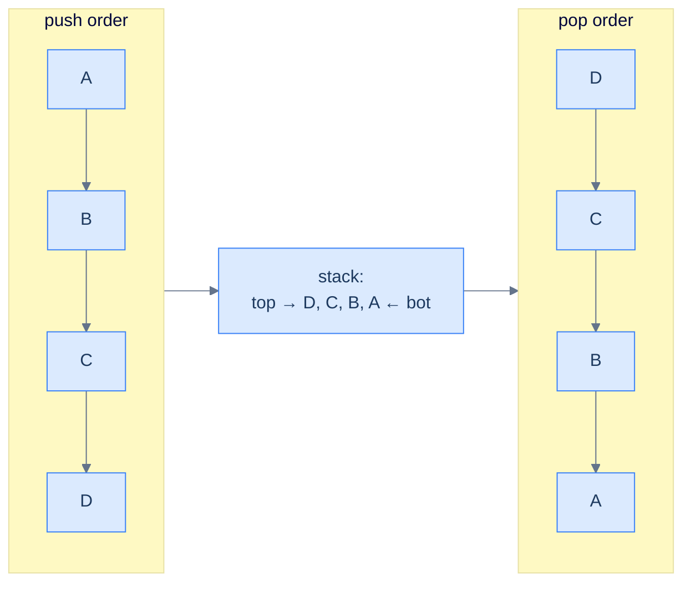
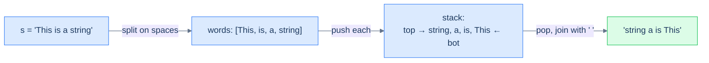

# 7. Pattern: Reversal

## The Hook

A stack is a *natural reverser*. Push five things in, pop them out, and the order is exactly reversed — for free, no extra logic. The whole trick is built into the LIFO contract: the *last* thing you push is the *first* thing you pop. That single property is enough to reverse a string, an array, a linked list of words, the order of items in another stack — anything you can iterate.

Yes, you could reverse with two pointers, or with a recursive call (which uses the *call* stack — same trick in disguise), or with `arr[::-1]` in Python. But understanding **why a stack reverses** is the gateway to recognising the deeper pattern: *anytime the answer depends on processing items in reverse order of arrival*, a stack is your tool. Reversal is the simplest member of that family. The next four lessons will progressively layer more sophistication on top — previous-closest, next-closest, sequence validation, linear evaluation — and every one of them is "the stack remembers things until later".

This lesson is short and punchy. Four problems, all on the easy end, each demonstrating one face of the reversal pattern: invert a stack, reverse a string, reverse an array in place, reverse the *word order* of a sentence (without reversing the words themselves).

---

## Table of contents

1. [Understanding the reversal pattern](#understanding-the-reversal-pattern)
2. [Identifying the reversal pattern](#identifying-the-reversal-pattern)
3. [Stack inversion](#stack-inversion)
4. [Reverse the string](#reverse-the-string)
5. [Reverse an array](#reverse-an-array)
6. [Reverse word order](#reverse-word-order)

***

# Understanding the reversal pattern

Push everything in. Pop everything out. Done.



<p align="center"><strong>The reversal technique — every push goes onto the top; every pop comes off the top; the resulting pop sequence is the input sequence backwards. The stack does the reversal "for free".</strong></p>

## The reversal technique

Two passes:

1. **Pass 1 — load the stack.** Iterate the input from start to end; push each element. After this pass, the stack holds the input with the last element on top.
2. **Pass 2 — unload into the destination.** Pop the stack until empty; write each popped element into the next slot of the result. After this pass, the destination is the input reversed.

For *in-place* reversal of an array, the destination is the same array — pass 2 overwrites positions 0, 1, 2, ... in order with stack pops, and the array ends up reversed.

## Algorithm

> **Algorithm**
>
> -   **Step 1:** Initialise an empty stack.
> -   **Step 2:** Iterate over the input; push each element.
> -   **Step 3:** Iterate over the output positions (or write to the result); for each, pop the stack and write the popped value.

## Implementation — generic array reverser


```python run
from collections import deque
from typing import List

def reverse_using_stack(arr: List[int]) -> None:

    # Initialize a stack to hold array items
    stack: deque = deque()

    # Traverse the array and push items onto the stack
    for item in arr:
        stack.append(item)

    # Traverse the array again and overwrite the items with the
    # top of the stack
    for i in range(len(arr)):
        arr[i] = stack.pop()
```

```java run

class Solution {
    public void reverseUsingStack(List<Integer> arr) {

        // Initialize a stack to hold array items
        Stack<Integer> stack = new Stack<>();

        // Traverse the list and push items onto the stack
        for (int item : arr) {
            stack.push(item);
        }

        // Traverse the list again and overwrite the items with the
        // top of the stack
        for (int i = 0; i < arr.size(); i++) {
            arr.set(i, stack.pop());
        }
    }
}
```


## Complexity Analysis

> **All cases** — Time: **O(N)** | Space: **O(N)** (the stack holds a copy of the input)

***

# Identifying the reversal pattern

Anywhere the problem says — implicitly or explicitly — *"give me this back in the opposite order"*, the reversal pattern fits.

**Template:**
> Given a sequence (string, array, list, words), produce its reverse using a stack.

The pattern is *the* canonical use of a stack as a reverser. In the problems below it shows up four ways:

- **Stack inversion** — reverse the contents of one stack into another stack.
- **Reverse the string** — reverse a character sequence.
- **Reverse an array** — reverse an integer sequence in place.
- **Reverse word order** — reverse the *order of words*, leaving each word's internal letters intact.

The fourth is the most subtle: the stack stores *complete words*, not characters. The unit of reversal is whatever you push.

***

# Stack inversion

## Problem Statement

Given a stack `s`, return a new stack containing the same elements in *reversed* order.

### Example
> -   **Input:** `s = [9, 5, 1, 2]` (top is `2`)
> -   **Output:** `[2, 1, 5, 9]` (top is `9`)

<details>
<summary><h2>Approach</h2></summary>


Two stacks. Pop everything from the input and push onto the output — *that single transfer reverses the order, because the topmost element of the input is pushed first onto the output, ending up at the bottom*.

```d2
direction: right

inp: "input stack" {
  grid-rows: 4
  grid-gap: 0
  i1: "2 ← top"
  i2: "1"
  i3: "5"
  i4: "9 ← bot"
}

out: "output stack" {
  grid-rows: 4
  grid-gap: 0
  o1: "9 ← top"
  o2: "5"
  o3: "1"
  o4: "2 ← bot"
}

inp -> out: "pop, push"
```

<p align="center"><strong>Stack inversion — pop the input top, push to output. The first popped item lands at the bottom of the output, which is exactly where it started in the input. The whole stack flips.</strong></p>

</details>
<details>
<summary><h2>Solution</h2></summary>


```python run
from typing import List

class Solution:
    def stack_inversion(self, s: List[int]) -> List[int]:
        reversed_stack: List[int] = []

        # Transfer elements from original stack to reversed stack
        while s:

            # Get the top element from the original stack
            top = s[-1]

            # Remove the top element from the original stack
            s.pop()

            # Push the element onto the reversed stack
            reversed_stack.append(top)

        # Return the reversed stack
        return reversed_stack


# Example from the problem statement
print(Solution().stack_inversion([9, 5, 1, 2]))     # [2, 1, 5, 9]

# Edge cases
print(Solution().stack_inversion([]))               # [] — empty stack
print(Solution().stack_inversion([7]))              # [7] — single element
print(Solution().stack_inversion([1, 2]))           # [2, 1] — two elements
print(Solution().stack_inversion([3, 3, 3]))        # [3, 3, 3] — all same
print(Solution().stack_inversion([1, 2, 3, 4, 5])) # [5, 4, 3, 2, 1]
print(Solution().stack_inversion([-1, 0, 1]))       # [1, 0, -1] — negatives
```

```java run
import java.util.*;

public class Main {
    static class Solution {
        public Stack<Integer> stackInversion(Stack<Integer> s) {
            Stack<Integer> reversedStack = new Stack<>();

            // Transfer elements from original stack to reversed stack
            while (!s.empty()) {

                // Get the top element from the original stack
                int top = s.peek();

                // Remove the top element from the original stack
                s.pop();

                // Push the element onto the reversed stack
                reversedStack.push(top);
            }

            // Return the reversed stack
            return reversedStack;
        }
    }

    public static void main(String[] args) {
        // Example from the problem statement
        Stack<Integer> s1 = new Stack<>();
        for (int v : new int[]{9, 5, 1, 2}) s1.push(v);
        System.out.println(new Solution().stackInversion(s1));     // [2, 1, 5, 9]

        // Edge cases
        Stack<Integer> s2 = new Stack<>();
        System.out.println(new Solution().stackInversion(s2));     // [] — empty

        Stack<Integer> s3 = new Stack<>();
        s3.push(7);
        System.out.println(new Solution().stackInversion(s3));     // [7]

        Stack<Integer> s4 = new Stack<>();
        s4.push(1); s4.push(2);
        System.out.println(new Solution().stackInversion(s4));     // [1, 2] — top was 2

        Stack<Integer> s5 = new Stack<>();
        for (int v : new int[]{1, 2, 3, 4, 5}) s5.push(v);
        System.out.println(new Solution().stackInversion(s5));     // [1, 2, 3, 4, 5]

        Stack<Integer> s6 = new Stack<>();
        for (int v : new int[]{-1, 0, 1}) s6.push(v);
        System.out.println(new Solution().stackInversion(s6));     // [-1, 0, 1]
    }
}
```


> **Complexity** — Time: **O(N)** | Space: **O(N)**.

</details>

***

# Reverse the string

## Problem Statement

Given a string `s`, return its reverse using a stack.

### Example 1
> -   **Input:** `s = "abcdefgh"` → **Output:** `"hgfedcba"`

### Example 2
> -   **Input:** `s = "c"` → **Output:** `"c"`

<details>
<summary><h2>Solution</h2></summary>


The textbook two-pass: push every character, then pop until empty into a result string.


```python run
from typing import List

class Solution:
    def reverse_the_string(self, s: str) -> str:

        # Create a stack to store characters
        stack: List[str] = []

        # Create an empty string to store the reversed string
        result: str = ""

        # Push each character into the stack
        for ch in s:
            stack.append(ch)

        # Pop characters from the stack to form the reversed string
        while stack:

            # Append the top character to the result string
            result += stack.pop()

        # Return the reversed string
        return result


# Examples from the problem statement
print(Solution().reverse_the_string("abcdefgh"))   # hgfedcba
print(Solution().reverse_the_string("c"))          # c

# Edge cases
print(Solution().reverse_the_string(""))           # "" — empty string
print(Solution().reverse_the_string("ab"))         # ba — two characters
print(Solution().reverse_the_string("aba"))        # aba — palindrome unchanged
print(Solution().reverse_the_string("12345"))      # 54321 — digits
print(Solution().reverse_the_string("aAbB"))       # BbAa — mixed case
```

```java run
import java.util.*;

public class Main {
    static class Solution {
        public String reverseTheString(String s) {

            // Create a stack to store characters
            Stack<Character> stack = new Stack<>();

            // Create an empty string to store the reversed string
            StringBuilder result = new StringBuilder();

            // Push each character into the stack
            for (char ch : s.toCharArray()) {
                stack.push(ch);
            }

            // Pop characters from the stack to form the reversed string
            while (!stack.empty()) {

                // Append the top character to the result string
                result.append(stack.pop());
            }

            // Return the reversed string
            return result.toString();
        }
    }

    public static void main(String[] args) {
        // Examples from the problem statement
        System.out.println(new Solution().reverseTheString("abcdefgh"));   // hgfedcba
        System.out.println(new Solution().reverseTheString("c"));          // c

        // Edge cases
        System.out.println(new Solution().reverseTheString(""));           // "" — empty
        System.out.println(new Solution().reverseTheString("ab"));         // ba
        System.out.println(new Solution().reverseTheString("aba"));        // aba — palindrome
        System.out.println(new Solution().reverseTheString("12345"));      // 54321
        System.out.println(new Solution().reverseTheString("aAbB"));       // BbAa
    }
}
```

</details>


***

# Reverse an array

## Problem Statement

Given an integer array `arr`, reverse its elements **in place** using a stack. Don't return a new array — mutate the input.

### Example 1
> -   **Input:** `arr = [1, 2, 3, 4, 5, 6]` → after the call `arr = [6, 5, 4, 3, 2, 1]`

### Example 2
> -   **Input:** `arr = []` → still `[]`

<details>
<summary><h2>Solution</h2></summary>


Same recipe; the destination is the input array itself. Pass 1 pushes; pass 2 overwrites positions 0..n−1 with stack pops.


```python run
from typing import List

class Solution:
    def reverse_an_array(self, arr: List[int]) -> None:

        # Create a stack to store elements of arr
        stack: List[int] = []

        # Pushing elements of arr into the stack
        for num in arr:
            stack.append(num)

        counter: int = 0

        # Popping elements from the stack and storing them back into arr
        # in reverse order
        while stack:
            arr[counter] = stack.pop()
            counter += 1


# Examples from the problem statement
a1 = [1, 2, 3, 4, 5, 6]
Solution().reverse_an_array(a1); print(a1)   # [6, 5, 4, 3, 2, 1]

a2: List[int] = []
Solution().reverse_an_array(a2); print(a2)   # []

# Edge cases
a3 = [7]
Solution().reverse_an_array(a3); print(a3)   # [7] — single element

a4 = [1, 2]
Solution().reverse_an_array(a4); print(a4)   # [2, 1] — two elements

a5 = [5, 5, 5]
Solution().reverse_an_array(a5); print(a5)   # [5, 5, 5] — all same

a6 = [-3, 0, 3]
Solution().reverse_an_array(a6); print(a6)   # [3, 0, -3] — negatives

a7 = [1, 2, 3]
Solution().reverse_an_array(a7); print(a7)   # [3, 2, 1]
```

```java run
import java.util.*;

public class Main {
    static class Solution {
        public void reverseAnArray(int[] arr) {

            // Create a stack to store elements of arr
            Stack<Integer> stack = new Stack<>();

            // Pushing elements of arr into the stack
            for (int i = 0; i < arr.length; i++) {
                stack.push(arr[i]);
            }

            int counter = 0;

            // Popping elements from the stack and storing them back into arr
            // in reverse order
            while (!stack.empty()) {
                arr[counter++] = stack.pop();
            }
        }
    }

    public static void main(String[] args) {
        // Examples from the problem statement
        int[] a1 = {1, 2, 3, 4, 5, 6};
        new Solution().reverseAnArray(a1);
        System.out.println(Arrays.toString(a1));   // [6, 5, 4, 3, 2, 1]

        int[] a2 = {};
        new Solution().reverseAnArray(a2);
        System.out.println(Arrays.toString(a2));   // []

        // Edge cases
        int[] a3 = {7};
        new Solution().reverseAnArray(a3);
        System.out.println(Arrays.toString(a3));   // [7]

        int[] a4 = {1, 2};
        new Solution().reverseAnArray(a4);
        System.out.println(Arrays.toString(a4));   // [2, 1]

        int[] a5 = {5, 5, 5};
        new Solution().reverseAnArray(a5);
        System.out.println(Arrays.toString(a5));   // [5, 5, 5]

        int[] a6 = {-3, 0, 3};
        new Solution().reverseAnArray(a6);
        System.out.println(Arrays.toString(a6));   // [3, 0, -3]

        int[] a7 = {1, 2, 3};
        new Solution().reverseAnArray(a7);
        System.out.println(Arrays.toString(a7));   // [3, 2, 1]
    }
}
```

</details>


***

# Reverse word order

## Problem Statement

Given a string `s` containing multiple space-separated words, reverse the **order of words** without reversing the letters within each word.

### Example 1
> -   **Input:** `s = "This is a string"` → **Output:** `"string a is This"`

### Example 2
> -   **Input:** `s = "abc"` → **Output:** `"abc"`

<details>
<summary><h2>Approach</h2></summary>


Same reversal pattern, **but the unit is a word, not a character**. Tokenise on spaces, push each word, pop into a result with single-space separators. The trailing-space cleanup at the end is the only fiddly part.



<p align="center"><strong>Reverse word order — push <em>whole words</em>, not characters; the stack reverses their order, while each word's internal letters are untouched. The unit of reversal is whatever you push.</strong></p>

</details>
<details>
<summary><h2>Solution</h2></summary>


```python run
from typing import List

class Solution:
    def build_stack_of_words(self, s: str) -> List[str]:

        # Create a stack to store words
        stack: List[str] = []

        # Variable to store each word
        word = ""

        # Iterate through each character in the input string
        for ch in s:

            # If the character is not a space, add it to the word
            if ch != " ":
                word += ch

            # If a space is encountered and the word is not empty
            # Push the word onto the stack
            elif word:
                stack.append(word)

                # Reset the word
                word = ""

        # Push the last word onto the stack if it's not empty
        if word:
            stack.append(word)

        return stack

    def reverse_word_order(self, s: str) -> str:
        stack_of_words = self.build_stack_of_words(s)

        # Variable to store the reversed string
        reversed_string = ""

        # Pop words from the stack and append them to the reversed_string
        while stack_of_words:
            reversed_string += stack_of_words.pop() + " "

        # Remove the trailing space at the end
        if reversed_string:
            reversed_string = reversed_string.rstrip()

        # Return the reversed string without reversing the words
        return reversed_string


# Examples from the problem statement
print(Solution().reverse_word_order("This is a string"))   # string a is This
print(Solution().reverse_word_order("abc"))                # abc

# Edge cases
print(Solution().reverse_word_order(""))                   # "" — empty string
print(Solution().reverse_word_order("hello world"))        # world hello
print(Solution().reverse_word_order("a b c"))              # c b a
print(Solution().reverse_word_order("one"))                # one — single word
print(Solution().reverse_word_order("x y"))                # y x — two words
```

```java run
import java.util.*;

public class Main {
    static class Solution {
        private Stack<String> buildStackOfWords(String s) {

            // Create a stack to store words
            Stack<String> stack = new Stack<>();

            // Variable to store each word
            StringBuilder word = new StringBuilder();

            // Iterate through each character in the input string
            for (char ch : s.toCharArray()) {

                // If the character is not a space, add it to the word
                if (ch != ' ') {
                    word.append(ch);
                }

                // If a space is encountered and the word is not empty
                // Push the word onto the stack
                else if (word.length() > 0) {
                    stack.push(word.toString());

                    // Reset the word
                    word.setLength(0);
                }
            }

            // Push the last word onto the stack if it's not empty
            if (word.length() > 0) {
                stack.push(word.toString());
            }

            return stack;
        }

        public String reverseWordOrder(String s) {
            Stack<String> stackOfWords = buildStackOfWords(s);

            // Variable to store the reversed string
            StringBuilder reversedString = new StringBuilder();

            // Pop words from the stack and append them to the reversedString
            while (!stackOfWords.isEmpty()) {
                reversedString.append(stackOfWords.pop()).append(" ");
            }

            // Remove the trailing space at the end
            if (reversedString.length() > 0) {
                reversedString.setLength(reversedString.length() - 1);
            }

            // Return the reversed string without reversing the words
            return reversedString.toString();
        }
    }

    public static void main(String[] args) {
        // Examples from the problem statement
        System.out.println(new Solution().reverseWordOrder("This is a string"));  // string a is This
        System.out.println(new Solution().reverseWordOrder("abc"));               // abc

        // Edge cases
        System.out.println(new Solution().reverseWordOrder(""));                  // ""
        System.out.println(new Solution().reverseWordOrder("hello world"));       // world hello
        System.out.println(new Solution().reverseWordOrder("a b c"));             // c b a
        System.out.println(new Solution().reverseWordOrder("one"));               // one
        System.out.println(new Solution().reverseWordOrder("x y"));               // y x
    }
}
```

</details>
<details>
<summary><h2>Final Takeaway</h2></summary>


Three lessons:

1. **A stack is a free reverser.** Push N items in, pop N items out, and the order is inverted with no extra logic — it's the LIFO contract doing the work.
2. **The unit of reversal is whatever you push.** Push characters → reverses characters. Push words → reverses word order without disturbing letters. Push entire sub-arrays → reverses chunk order. The same algorithm reshapes itself by changing what counts as one item.
3. **Reversal alone is rarely the *whole* problem.** It's almost always a sub-step inside something bigger: reverse the operator part of a string, reverse a path in a tree, reverse the order in which items get processed. Recognise reversal as a *building block*, not an answer.

> *Coming up — the reversal pattern was the gentlest stack pattern. The next four progressively get harder by combining "remember the most recent thing not yet resolved" with one or two extra constraints. Lesson 8 — **previous closest occurrence** — uses a stack to find, for each element, the nearest earlier element that satisfies some condition (e.g. the previous greater element). It's the canonical "monotonic stack" problem and powers stock-span calculations, histogram problems, and a hundred interview questions.*

</details>