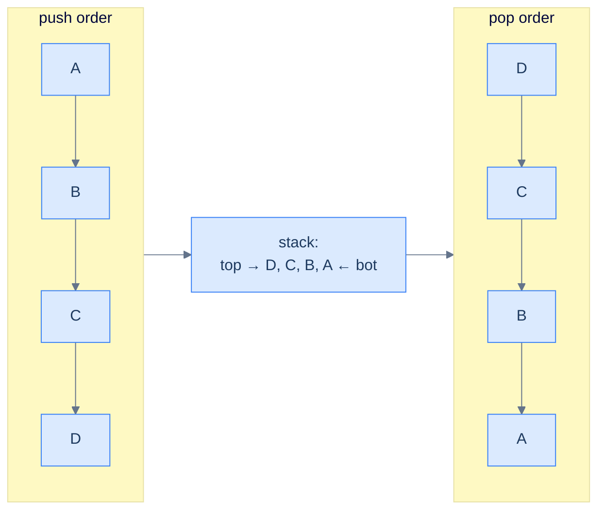
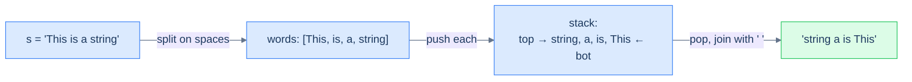

# 7. Pattern: Reversal

## The Hook

A stack is a *natural reverser*. Push five things in, pop them out, and the order is exactly reversed — for free, no extra logic. The whole trick is built into the LIFO contract: the *last* thing you push is the *first* thing you pop. That single property is enough to reverse a string, an array, a linked list of words, the order of items in another stack — anything you can iterate.

Yes, you could reverse with two pointers, or with a recursive call (which uses the *call* stack — same trick in disguise), or with `arr[::-1]` in Python. But understanding **why a stack reverses** is the gateway to recognising the deeper pattern: *anytime the answer depends on processing items in reverse order of arrival*, a stack is your tool. Reversal is the simplest member of that family. The next four lessons will progressively layer more sophistication on top — previous-closest, next-closest, sequence validation, linear evaluation — and every one of them is "the stack remembers things until later".

This lesson is short and punchy. Four problems, all on the easy end, each demonstrating one face of the reversal pattern: invert a stack, reverse a string, reverse an array in place, reverse the *word order* of a sentence (without reversing the words themselves).

---

## Table of contents

1. [Understanding the reversal pattern](#understanding-the-reversal-pattern)
2. [Identifying the reversal pattern](#identifying-the-reversal-pattern)
3. [Stack inversion](#stack-inversion)
4. [Reverse the string](#reverse-the-string)
5. [Reverse an array](#reverse-an-array)
6. [Reverse word order](#reverse-word-order)

***

# Understanding the reversal pattern

Push everything in. Pop everything out. Done.



<p align="center"><strong>The reversal technique — every push goes onto the top; every pop comes off the top; the resulting pop sequence is the input sequence backwards. The stack does the reversal "for free".</strong></p>

## The reversal technique

Two passes:

1. **Pass 1 — load the stack.** Iterate the input from start to end; push each element. After this pass, the stack holds the input with the last element on top.
2. **Pass 2 — unload into the destination.** Pop the stack until empty; write each popped element into the next slot of the result. After this pass, the destination is the input reversed.

For *in-place* reversal of an array, the destination is the same array — pass 2 overwrites positions 0, 1, 2, ... in order with stack pops, and the array ends up reversed.

## Algorithm

> **Algorithm**
>
> -   **Step 1:** Initialise an empty stack.
> -   **Step 2:** Iterate over the input; push each element.
> -   **Step 3:** Iterate over the output positions (or write to the result); for each, pop the stack and write the popped value.

## Implementation — generic array reverser


```pseudocode
function reverseViaStack(arr):
    stack ← empty stack
    for each x in arr: push x           # pass 1: load
    for i from 0 to length(arr) − 1:
        arr[i] ← pop()                  # pass 2: unload in reverse
    return arr
```

```python run
def reverse_via_stack(arr: list) -> list:
    stack = []
    for x in arr: stack.append(x)         # pass 1
    for i in range(len(arr)):              # pass 2
        arr[i] = stack.pop()
    return arr

print(reverse_via_stack([1, 2, 3, 4, 5]))   # [5, 4, 3, 2, 1]
```

```java run
import java.util.*;
public class Main {
    static int[] reverse(int[] arr) {
        Deque<Integer> st = new ArrayDeque<>();
        for (int x : arr) st.push(x);
        for (int i = 0; i < arr.length; i++) arr[i] = st.pop();
        return arr;
    }
    public static void main(String[] args) {
        int[] r = reverse(new int[]{1,2,3,4,5});
        System.out.println(Arrays.toString(r));
    }
}
```

```c run
#include <stdio.h>
void reverse_via_stack(int *arr, int n) {
    int st[256]; int top = -1;
    for (int i = 0; i < n; i++) st[++top] = arr[i];
    for (int i = 0; i < n; i++) arr[i] = st[top--];
}
int main() {
    int a[] = {1,2,3,4,5};
    reverse_via_stack(a, 5);
    for (int i = 0; i < 5; i++) printf("%d ", a[i]); printf("\n");
}
```

```scala run
import scala.collection.mutable
def reverseViaStack(arr: Array[Int]): Array[Int] = {
  val st = mutable.Stack[Int]()
  for (x <- arr) st.push(x)
  for (i <- arr.indices) arr(i) = st.pop()
  arr
}
object Main extends App {
  println(reverseViaStack(Array(1,2,3,4,5)).mkString(", "))
}
```


## Complexity Analysis

> **All cases** — Time: **O(N)** | Space: **O(N)** (the stack holds a copy of the input)

***

# Identifying the reversal pattern

Anywhere the problem says — implicitly or explicitly — *"give me this back in the opposite order"*, the reversal pattern fits.

**Template:**
> Given a sequence (string, array, list, words), produce its reverse using a stack.

The pattern is *the* canonical use of a stack as a reverser. In the problems below it shows up four ways:

- **Stack inversion** — reverse the contents of one stack into another stack.
- **Reverse the string** — reverse a character sequence.
- **Reverse an array** — reverse an integer sequence in place.
- **Reverse word order** — reverse the *order of words*, leaving each word's internal letters intact.

The fourth is the most subtle: the stack stores *complete words*, not characters. The unit of reversal is whatever you push.

***

# Stack inversion

## Problem Statement

Given a stack `s`, return a new stack containing the same elements in *reversed* order.

### Example
> -   **Input:** `s = [9, 5, 1, 2]` (top is `2`)
> -   **Output:** `[2, 1, 5, 9]` (top is `9`)

## Approach

Two stacks. Pop everything from the input and push onto the output — *that single transfer reverses the order, because the topmost element of the input is pushed first onto the output, ending up at the bottom*.

```d2
direction: right

inp: "input stack" {
  grid-rows: 4
  grid-gap: 0
  i1: "2 ← top"
  i2: "1"
  i3: "5"
  i4: "9 ← bot"
}

out: "output stack" {
  grid-rows: 4
  grid-gap: 0
  o1: "9 ← top"
  o2: "5"
  o3: "1"
  o4: "2 ← bot"
}

inp -> out: "pop, push"
```

<p align="center"><strong>Stack inversion — pop the input top, push to output. The first popped item lands at the bottom of the output, which is exactly where it started in the input. The whole stack flips.</strong></p>

## Solution


```pseudocode
function stackInversion(s):
    out ← empty stack
    while s is not empty: push pop(s) onto out
    return out
```

```python run
def stack_inversion(s: list) -> list:
    """s is a list used as a stack (last element is the top)."""
    out = []
    while s:
        out.append(s.pop())     # transfer top → top, but flipped order
    return out

# Demo: input represented as list, top = last element
print(stack_inversion([9, 5, 1, 2]))   # [2, 1, 5, 9]
```

```java run
import java.util.*;
public class Main {
    static Deque<Integer> stackInversion(Deque<Integer> s) {
        Deque<Integer> out = new ArrayDeque<>();
        while (!s.isEmpty()) out.push(s.pop());
        return out;
    }
    public static void main(String[] args) {
        Deque<Integer> s = new ArrayDeque<>();
        // bottom-first push so 2 ends up on top
        for (int x : new int[]{9, 5, 1, 2}) s.push(x);
        Deque<Integer> r = stackInversion(s);
        // print top-to-bottom
        while (!r.isEmpty()) System.out.print(r.pop() + " ");
        System.out.println();
    }
}
```

```c run
#include <stdio.h>
void stack_inversion(int *src, int *src_top, int *dst, int *dst_top) {
    while (*src_top >= 0) dst[++(*dst_top)] = src[(*src_top)--];
}
int main() {
    int src[] = {9, 5, 1, 2}; int src_top = 3;
    int dst[16]; int dst_top = -1;
    stack_inversion(src, &src_top, dst, &dst_top);
    for (int i = dst_top; i >= 0; i--) printf("%d ", dst[i]);
    printf("\n");
}
```

```scala run
import scala.collection.mutable
def stackInversion(s: mutable.Stack[Int]): mutable.Stack[Int] = {
  val out = mutable.Stack[Int]()
  while (s.nonEmpty) out.push(s.pop())
  out
}
object Main extends App {
  val s = mutable.Stack[Int](); for (x <- Array(9,5,1,2)) s.push(x)
  val r = stackInversion(s)
  while (r.nonEmpty) print(s"${r.pop()} ")
  println()
}
```


> **Complexity** — Time: **O(N)** | Space: **O(N)**.

***

# Reverse the string

## Problem Statement

Given a string `s`, return its reverse using a stack.

### Example 1
> -   **Input:** `s = "abcdefgh"` → **Output:** `"hgfedcba"`

### Example 2
> -   **Input:** `s = "c"` → **Output:** `"c"`

## Solution

The textbook two-pass: push every character, then pop until empty into a result string.


```pseudocode
function reverseString(s):
    stack ← empty stack
    for each ch in s: push ch
    out ← empty list
    while stack not empty: append pop() to out
    return join(out)
```

```python run
def reverse_string(s: str) -> str:
    stack = []
    for ch in s: stack.append(ch)         # pass 1: push every char
    out = []
    while stack: out.append(stack.pop())  # pass 2: pop into result
    return ''.join(out)

print(reverse_string("abcdefgh"))   # hgfedcba
print(reverse_string("c"))          # c
```

```java run
import java.util.*;
public class Main {
    static String reverseString(String s) {
        Deque<Character> st = new ArrayDeque<>();
        for (char ch : s.toCharArray()) st.push(ch);
        StringBuilder out = new StringBuilder();
        while (!st.isEmpty()) out.append(st.pop());
        return out.toString();
    }
    public static void main(String[] args) {
        System.out.println(reverseString("abcdefgh"));
        System.out.println(reverseString("c"));
    }
}
```

```c run
#include <stdio.h>
#include <string.h>

void reverse_string(const char *s, char *out) {
    int n = (int)strlen(s);
    char st[1024]; int top = -1;
    for (int i = 0; i < n; i++) st[++top] = s[i];
    int o = 0;
    while (top >= 0) out[o++] = st[top--];
    out[o] = 0;
}

int main() {
    char buf[16];
    reverse_string("abcdefgh", buf); printf("%s\n", buf);
    reverse_string("c", buf);        printf("%s\n", buf);
}
```

```scala run
import scala.collection.mutable
def reverseString(s: String): String = {
  val st = mutable.Stack[Char]()
  for (ch <- s) st.push(ch)
  val out = new StringBuilder
  while (st.nonEmpty) out.append(st.pop())
  out.toString
}
object Main extends App {
  println(reverseString("abcdefgh"))
  println(reverseString("c"))
}
```


***

# Reverse an array

## Problem Statement

Given an integer array `arr`, reverse its elements **in place** using a stack. Don't return a new array — mutate the input.

### Example 1
> -   **Input:** `arr = [1, 2, 3, 4, 5, 6]` → after the call `arr = [6, 5, 4, 3, 2, 1]`

### Example 2
> -   **Input:** `arr = []` → still `[]`

## Solution

Same recipe; the destination is the input array itself. Pass 1 pushes; pass 2 overwrites positions 0..n−1 with stack pops.


```pseudocode
function reverseArray(arr):
    stack ← empty stack
    for each x in arr: push x
    for i from 0 to length(arr) − 1: arr[i] ← pop()
```

```python run
def reverse_array(arr: list) -> None:
    stack = list(arr)                  # pass 1: copy in (push order)
    for i in range(len(arr)):          # pass 2: overwrite in pop order
        arr[i] = stack.pop()

a = [1, 2, 3, 4, 5, 6]; reverse_array(a); print(a)   # [6, 5, 4, 3, 2, 1]
b = [];                  reverse_array(b); print(b)   # []
```

```java run
import java.util.*;
public class Main {
    static void reverseArray(int[] arr) {
        Deque<Integer> st = new ArrayDeque<>();
        for (int x : arr) st.push(x);
        for (int i = 0; i < arr.length; i++) arr[i] = st.pop();
    }
    public static void main(String[] args) {
        int[] a = {1,2,3,4,5,6}; reverseArray(a);
        System.out.println(Arrays.toString(a));
    }
}
```

```c run
#include <stdio.h>
void reverse_array(int *arr, int n) {
    int st[256]; int top = -1;
    for (int i = 0; i < n; i++) st[++top] = arr[i];
    for (int i = 0; i < n; i++) arr[i] = st[top--];
}
int main() {
    int a[] = {1,2,3,4,5,6};
    reverse_array(a, 6);
    for (int i = 0; i < 6; i++) printf("%d ", a[i]); printf("\n");
}
```

```scala run
import scala.collection.mutable
def reverseArray(arr: Array[Int]): Unit = {
  val st = mutable.Stack[Int]()
  for (x <- arr) st.push(x)
  for (i <- arr.indices) arr(i) = st.pop()
}
object Main extends App {
  val a = Array(1,2,3,4,5,6); reverseArray(a)
  println(a.mkString(", "))
}
```


***

# Reverse word order

## Problem Statement

Given a string `s` containing multiple space-separated words, reverse the **order of words** without reversing the letters within each word.

### Example 1
> -   **Input:** `s = "This is a string"` → **Output:** `"string a is This"`

### Example 2
> -   **Input:** `s = "abc"` → **Output:** `"abc"`

## Approach

Same reversal pattern, **but the unit is a word, not a character**. Tokenise on spaces, push each word, pop into a result with single-space separators. The trailing-space cleanup at the end is the only fiddly part.



<p align="center"><strong>Reverse word order — push <em>whole words</em>, not characters; the stack reverses their order, while each word's internal letters are untouched. The unit of reversal is whatever you push.</strong></p>

## Solution


```pseudocode
function reverseWordOrder(s):
    words ← split s on whitespace
    stack ← empty stack
    for each w in words: push w
    out ← empty list
    while stack not empty: append pop() to out
    return join(out, " ")
```

```python run
def reverse_word_order(s: str) -> str:
    stack = s.split()                  # tokenise on whitespace
    out = []
    while stack: out.append(stack.pop())
    return ' '.join(out)

print(reverse_word_order("This is a string"))   # string a is This
print(reverse_word_order("abc"))                # abc
```

```java run
import java.util.*;
public class Main {
    static String reverseWordOrder(String s) {
        String[] words = s.trim().split("\\s+");
        Deque<String> st = new ArrayDeque<>();
        for (String w : words) st.push(w);
        StringBuilder out = new StringBuilder();
        while (!st.isEmpty()) {
            out.append(st.pop());
            if (!st.isEmpty()) out.append(' ');
        }
        return out.toString();
    }
    public static void main(String[] args) {
        System.out.println(reverseWordOrder("This is a string"));
        System.out.println(reverseWordOrder("abc"));
    }
}
```

```c run
#include <stdio.h>
#include <string.h>

void reverse_word_order(const char *s, char *out) {
    char buf[256]; strncpy(buf, s, sizeof(buf)-1); buf[sizeof(buf)-1]=0;
    char *words[64]; int top = -1;
    char *tok = strtok(buf, " ");
    while (tok) { words[++top] = tok; tok = strtok(NULL, " "); }
    int o = 0;
    while (top >= 0) {
        int len = (int)strlen(words[top]);
        memcpy(out + o, words[top], len); o += len;
        if (top > 0) out[o++] = ' ';
        top--;
    }
    out[o] = 0;
}

int main() {
    char buf[128];
    reverse_word_order("This is a string", buf); printf("%s\n", buf);
    reverse_word_order("abc", buf);              printf("%s\n", buf);
}
```

```scala run
import scala.collection.mutable
def reverseWordOrder(s: String): String = {
  val st = mutable.Stack[String]()
  for (w <- s.trim.split("\\s+")) st.push(w)
  val out = new StringBuilder
  while (st.nonEmpty) {
    out.append(st.pop())
    if (st.nonEmpty) out.append(' ')
  }
  out.toString
}
object Main extends App {
  println(reverseWordOrder("This is a string"))
  println(reverseWordOrder("abc"))
}
```


***

## Final Takeaway

Three lessons:

1. **A stack is a free reverser.** Push N items in, pop N items out, and the order is inverted with no extra logic — it's the LIFO contract doing the work.
2. **The unit of reversal is whatever you push.** Push characters → reverses characters. Push words → reverses word order without disturbing letters. Push entire sub-arrays → reverses chunk order. The same algorithm reshapes itself by changing what counts as one item.
3. **Reversal alone is rarely the *whole* problem.** It's almost always a sub-step inside something bigger: reverse the operator part of a string, reverse a path in a tree, reverse the order in which items get processed. Recognise reversal as a *building block*, not an answer.

> *Coming up — the reversal pattern was the gentlest stack pattern. The next four progressively get harder by combining "remember the most recent thing not yet resolved" with one or two extra constraints. Lesson 8 — **previous closest occurrence** — uses a stack to find, for each element, the nearest earlier element that satisfies some condition (e.g. the previous greater element). It's the canonical "monotonic stack" problem and powers stock-span calculations, histogram problems, and a hundred interview questions.*
