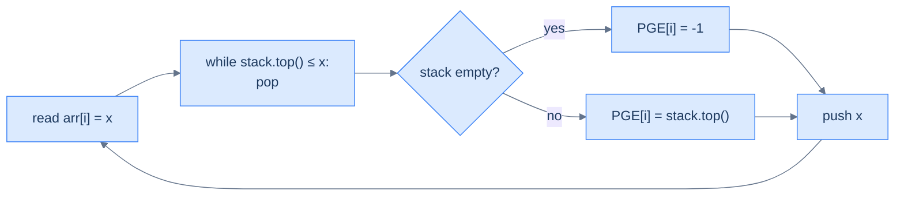
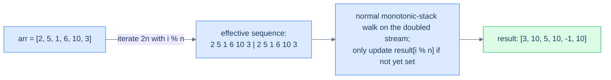

# 8. Pattern: Previous Closest Occurrence

## The Hook

Stocks. Yesterday's closing price was $48. Today's is $52. You want to know — *for every day in the entire trading history* — **the most recent earlier day whose price was higher**. That's the "previous greater" problem, and the brute-force solution is `for each day, walk backwards looking for a higher price` — O(N²) work that doesn't scale past a few thousand days.

But here's the trick. Once you encounter a *higher* price on day `i`, **every previous day with a price ≤ today's is now irrelevant** for future queries. Why? Because today's price *also* exceeds them, and today is more recent — any future day looking for a "previous greater" will hit today's price before ever reaching theirs. We can throw those obsolete prices away. **Forever.**

That "throw away dominated prices" rule is enforced by a **monotonic stack** — a stack whose values stay in decreasing order from bottom to top. Each element is pushed once, popped at most once, so the total work across all N elements is O(N). The same algorithm computes:

- *Previous greater element* — the most recent earlier value that's strictly bigger.
- *Previous smaller element* — the most recent earlier value that's strictly smaller.
- *Stock span* — for each day, how many consecutive previous days had price ≤ today's.
- *Largest rectangle in histogram* (with both previous- and next-smaller).
- *Daily temperatures*, *next greater element*, half the trick questions in any FAANG interview...

This is **monotonic-stack** territory, and once you internalise the *"the stack stores candidates that haven't been disqualified yet"* mental model, a startling number of problems open up. This lesson covers four variants — superior (greater), inferior (smaller), and both with circular arrays — with complete 10-language implementations.

---

## Table of contents

1. [Understanding the previous closest occurrence pattern](#understanding-the-previous-closest-occurrence-pattern)
2. [Identifying the previous closest occurrence pattern](#identifying-the-previous-closest-occurrence-pattern)
3. [Preceding superior element](#preceding-superior-element)
4. [Preceding inferior element](#preceding-inferior-element)
5. [Preceding superior element II](#preceding-superior-element-ii)
6. [Preceding inferior element II](#preceding-inferior-element-ii)

***

# Understanding the previous closest occurrence pattern

The pattern: for each index `i`, find the *closest preceding* index `j < i` whose value satisfies some predicate (`> arr[i]`, `< arr[i]`, etc.). The naive nested loop is O(N²). The monotonic-stack solution is O(N).

```d2
direction: right

arr: arr {
  grid-columns: 6
  grid-gap: 0
  i0: "3"
  i1: "5"
  i2: "1"
  i3: "6"
  i4: "8"
  i5: "7"
}

out: "previous greater (PGE)" {
  grid-columns: 6
  grid-gap: 0
  o0: "−1"
  o1: "−1"
  o2: "5" {style.fill: "#fef9c3"; style.stroke: "#f59e0b"}
  o3: "−1"
  o4: "−1"
  o5: "8"
}

note: "e.g. arr[2]=1: closest earlier value > 1 is 5" {shape: text}
note -> out.o2: "" {style.stroke-dash: 3}

arr -> out
```

<p align="center"><strong>Previous-greater-element (PGE) for an array — for every position, the most recent strictly-greater value to its left, or −1 if none exists. The brute force is O(N²); the monotonic-stack solution is O(N).</strong></p>

## The previous closest occurrence technique

Walk the array left to right. Maintain a **monotonic decreasing stack** of values seen so far (top = smallest, bottom = largest). For each new element `x`:

1. **Pop** every value `≤ x` from the top of the stack. These values can never again be a "previous greater" for any future element — `x` itself is between them and any future query, and `x ≥ them`.
2. **The new top** (if any) is `x`'s **previous greater** — the closest earlier value that's still strictly greater. If the stack is empty, no such value exists; record `-1`.
3. **Push `x`** so it's a candidate for elements to come.



<p align="center"><strong>Monotonic-stack core loop — pop everything that's been "dominated" by the current element, then the new top is the answer. Each value enters the stack at most once and leaves at most once → total work is O(N).</strong></p>

## Why is this O(N)?

The operations look unbounded — there's a `while` loop nested inside the `for` loop — but the **amortised analysis** says otherwise. Across the entire run, every array element is **pushed exactly once** and **popped at most once**. Total stack operations: at most 2N. The outer loop runs N times. Total work: O(N).

This is one of the most beautiful amortised arguments in algorithms — a nested `while` masquerading as O(N²) but actually O(N) when you count operations across the whole input rather than per iteration.

## Algorithm

> **Algorithm — previous greater element (PGE)**
>
> -   **Step 1:** Initialise an empty stack and a result array `pge[0..n-1]` filled with `-1`.
> -   **Step 2:** For `i` from 0 to n−1:
>     -   While the stack is non-empty and `stack.top() <= arr[i]`: pop.
>     -   If the stack is non-empty: `pge[i] = stack.top()`.
>     -   Push `arr[i]`.
> -   **Step 3:** Return `pge`.

For **previous smaller element (PSE)**, swap the comparison: pop while `stack.top() >= arr[i]`.

## Implementation — generic PGE walker


```pseudocode
function previousGreater(arr):
    pge   ← array of −1, length n
    stack ← empty stack       # monotonic decreasing
    for i from 0 to n − 1:
        while stack not empty AND top ≤ arr[i]: pop
        if stack not empty: pge[i] ← top
        push arr[i]
    return pge
```

```python run
def previous_greater(arr: list) -> list:
    """For each i, the closest earlier value > arr[i]; -1 if none."""
    pge = [-1] * len(arr)
    stack = []
    for i, x in enumerate(arr):
        # Pop everything that current x has dominated
        while stack and stack[-1] <= x:
            stack.pop()
        if stack:
            pge[i] = stack[-1]
        stack.append(x)
    return pge

print(previous_greater([3, 5, 1, 6, 8, 7]))   # [-1, -1, 5, -1, -1, 8]
```

```java run
import java.util.*;
public class Main {
    static int[] previousGreater(int[] arr) {
        int n = arr.length;
        int[] pge = new int[n]; Arrays.fill(pge, -1);
        Deque<Integer> st = new ArrayDeque<>();
        for (int i = 0; i < n; i++) {
            while (!st.isEmpty() && st.peek() <= arr[i]) st.pop();
            if (!st.isEmpty()) pge[i] = st.peek();
            st.push(arr[i]);
        }
        return pge;
    }
    public static void main(String[] args) {
        System.out.println(Arrays.toString(previousGreater(new int[]{3,5,1,6,8,7})));
    }
}
```

```c run
#include <stdio.h>
void previous_greater(int *arr, int n, int *pge) {
    int st[256]; int top = -1;
    for (int i = 0; i < n; i++) pge[i] = -1;
    for (int i = 0; i < n; i++) {
        while (top >= 0 && st[top] <= arr[i]) top--;
        if (top >= 0) pge[i] = st[top];
        st[++top] = arr[i];
    }
}
int main() {
    int a[] = {3,5,1,6,8,7}; int pge[6];
    previous_greater(a, 6, pge);
    for (int i = 0; i < 6; i++) printf("%d ", pge[i]); printf("\n");
}
```

```scala run
import scala.collection.mutable

def previousGreater(arr: Array[Int]): Array[Int] = {
  val pge = Array.fill(arr.length)(-1)
  val st = mutable.Stack[Int]()
  for (i <- arr.indices) {
    while (st.nonEmpty && st.top <= arr(i)) st.pop()
    if (st.nonEmpty) pge(i) = st.top
    st.push(arr(i))
  }
  pge
}
object Main extends App {
  println(previousGreater(Array(3,5,1,6,8,7)).mkString(", "))
}
```


## Complexity Analysis

> **All cases** — Time: **O(N)** amortised | Space: **O(N)** for the stack and result.

***

# Identifying the previous closest occurrence pattern

The pattern fits whenever the answer for each position depends on **the closest earlier position satisfying some monotone condition** (greater than, smaller than, equal to, …). The decision rule for the stack:

- Looking for **previous greater**? Maintain a **decreasing** stack; pop while top `≤` current.
- Looking for **previous smaller**? Maintain an **increasing** stack; pop while top `≥` current.

**Template:**
> Walk the array; maintain a monotonic stack of un-disqualified candidates; for each new element, pop the dominated ones; the new top is the answer.

***

# Preceding superior element

## Problem Statement

Given two arrays `arr1` and `arr2` (where `arr2` is a subset of `arr1` and all elements are unique), return for each value in `arr2` its **preceding superior element** in `arr1` — the first strictly-greater element to its left in `arr1`. Return `-1` for values with no preceding superior.

### Example 1
> -   **Input:** `arr1 = [3, 5, 1, 6, 8, 7]`, `arr2 = [3, 1, 8, 7]`
> -   **Output:** `[-1, 5, -1, 8]`

### Example 2
> -   **Input:** `arr1 = [5, 9, 7, 8, 1]`, `arr2 = [5, 9, 7]`
> -   **Output:** `[-1, -1, 9]`

## Approach

Two passes:

1. Compute the previous-greater-element array `pge` for `arr1` using the monotonic stack (O(N)).
2. Build a `value → index` map for `arr1`. Then for each query in `arr2`, look up its index and read `pge[index]`.

Total: O(N + M) time, O(N) space.

## Solution


```pseudocode
function precedingSuperiorElement(arr1, arr2):
    pge   ← array of −1, length n
    stack ← empty stack; idx ← empty Map
    for i from 0 to n − 1:
        while stack not empty AND top ≤ arr1[i]: pop
        if stack not empty: pge[i] ← top
        push arr1[i]; idx[arr1[i]] ← i
    return [pge[idx[v]] if v is in idx else −1  for v in arr2]
```

```python run
def preceding_superior_element(arr1: list, arr2: list) -> list:
    n = len(arr1)
    pge = [-1] * n
    st = []
    for i, x in enumerate(arr1):
        while st and st[-1] <= x: st.pop()
        if st: pge[i] = st[-1]
        st.append(x)
    index_of = {x: i for i, x in enumerate(arr1)}
    return [pge[index_of[v]] if v in index_of else -1 for v in arr2]

print(preceding_superior_element([3,5,1,6,8,7], [3,1,8,7]))   # [-1, 5, -1, 8]
print(preceding_superior_element([5,9,7,8,1], [5,9,7]))       # [-1, -1, 9]
```

```java run
import java.util.*;
public class Main {
    static int[] precedingSuperiorElement(int[] arr1, int[] arr2) {
        int n = arr1.length;
        int[] pge = new int[n]; Arrays.fill(pge, -1);
        Deque<Integer> st = new ArrayDeque<>();
        Map<Integer, Integer> idx = new HashMap<>();
        for (int i = 0; i < n; i++) {
            while (!st.isEmpty() && st.peek() <= arr1[i]) st.pop();
            if (!st.isEmpty()) pge[i] = st.peek();
            st.push(arr1[i]);
            idx.put(arr1[i], i);
        }
        int[] out = new int[arr2.length];
        for (int j = 0; j < arr2.length; j++) {
            Integer i = idx.get(arr2[j]);
            out[j] = (i == null) ? -1 : pge[i];
        }
        return out;
    }
    public static void main(String[] args) {
        System.out.println(Arrays.toString(precedingSuperiorElement(new int[]{3,5,1,6,8,7}, new int[]{3,1,8,7})));
        System.out.println(Arrays.toString(precedingSuperiorElement(new int[]{5,9,7,8,1}, new int[]{5,9,7})));
    }
}
```

```c run
#include <stdio.h>

void preceding_superior_element(int *arr1, int n, int *arr2, int m, int *out) {
    int pge[256]; int st[256]; int top = -1;
    for (int i = 0; i < n; i++) pge[i] = -1;
    int idx_keys[256], idx_vals[256], idx_n = 0;
    for (int i = 0; i < n; i++) {
        while (top >= 0 && st[top] <= arr1[i]) top--;
        if (top >= 0) pge[i] = st[top];
        st[++top] = arr1[i];
        idx_keys[idx_n] = arr1[i]; idx_vals[idx_n] = i; idx_n++;
    }
    for (int j = 0; j < m; j++) {
        int found = -1;
        for (int k = 0; k < idx_n; k++) if (idx_keys[k] == arr2[j]) { found = pge[idx_vals[k]]; break; }
        out[j] = found;
    }
}

int main() {
    int a[] = {3,5,1,6,8,7}; int q[] = {3,1,8,7}; int r[4];
    preceding_superior_element(a, 6, q, 4, r);
    for (int i = 0; i < 4; i++) printf("%d ", r[i]); printf("\n");
}
```

```scala run
import scala.collection.mutable

def precedingSuperiorElement(arr1: Array[Int], arr2: Array[Int]): Array[Int] = {
  val pge = Array.fill(arr1.length)(-1)
  val st  = mutable.Stack[Int]()
  val idx = mutable.Map[Int, Int]()
  for (i <- arr1.indices) {
    while (st.nonEmpty && st.top <= arr1(i)) st.pop()
    if (st.nonEmpty) pge(i) = st.top
    st.push(arr1(i)); idx(arr1(i)) = i
  }
  arr2.map(v => idx.get(v).map(pge(_)).getOrElse(-1))
}
object Main extends App {
  println(precedingSuperiorElement(Array(3,5,1,6,8,7), Array(3,1,8,7)).mkString(", "))
  println(precedingSuperiorElement(Array(5,9,7,8,1), Array(5,9,7)).mkString(", "))
}
```


***

# Preceding inferior element

## Problem Statement

Same as above but **inferior** = strictly smaller. Maintain an *increasing* monotonic stack; pop while top `≥` current.

### Example 1
> -   **Input:** `arr1 = [3, 5, 1, 6, 8, 2]`, `arr2 = [3, 1, 8, 2]`
> -   **Output:** `[-1, -1, 6, 1]`

### Example 2
> -   **Input:** `arr1 = [5, 9, 7, 8, 1]`, `arr2 = [5, 9, 7]`
> -   **Output:** `[-1, 5, 5]`

## Solution


```pseudocode
function precedingInferiorElement(arr1, arr2):
    pse   ← array of −1, length n
    stack ← empty stack; idx ← empty Map   # monotonic increasing
    for i from 0 to n − 1:
        while stack not empty AND top ≥ arr1[i]: pop
        if stack not empty: pse[i] ← top
        push arr1[i]; idx[arr1[i]] ← i
    return [pse[idx[v]] if v is in idx else −1  for v in arr2]
```

```python run
def preceding_inferior_element(arr1: list, arr2: list) -> list:
    n = len(arr1)
    pse = [-1] * n
    st = []
    for i, x in enumerate(arr1):
        while st and st[-1] >= x: st.pop()    # increasing monotonic
        if st: pse[i] = st[-1]
        st.append(x)
    idx = {x: i for i, x in enumerate(arr1)}
    return [pse[idx[v]] if v in idx else -1 for v in arr2]

print(preceding_inferior_element([3,5,1,6,8,2], [3,1,8,2]))   # [-1, -1, 6, 1]
print(preceding_inferior_element([5,9,7,8,1], [5,9,7]))       # [-1, 5, 5]
```

```java run
import java.util.*;
public class Main {
    static int[] precedingInferiorElement(int[] arr1, int[] arr2) {
        int n = arr1.length;
        int[] pse = new int[n]; Arrays.fill(pse, -1);
        Deque<Integer> st = new ArrayDeque<>();
        Map<Integer, Integer> idx = new HashMap<>();
        for (int i = 0; i < n; i++) {
            while (!st.isEmpty() && st.peek() >= arr1[i]) st.pop();
            if (!st.isEmpty()) pse[i] = st.peek();
            st.push(arr1[i]); idx.put(arr1[i], i);
        }
        int[] out = new int[arr2.length];
        for (int j = 0; j < arr2.length; j++) {
            Integer i = idx.get(arr2[j]);
            out[j] = (i == null) ? -1 : pse[i];
        }
        return out;
    }
    public static void main(String[] args) {
        System.out.println(Arrays.toString(precedingInferiorElement(new int[]{3,5,1,6,8,2}, new int[]{3,1,8,2})));
        System.out.println(Arrays.toString(precedingInferiorElement(new int[]{5,9,7,8,1}, new int[]{5,9,7})));
    }
}
```

```c run
#include <stdio.h>
void preceding_inferior_element(int *arr1, int n, int *arr2, int m, int *out) {
    int pse[256], st[256]; int top = -1;
    for (int i = 0; i < n; i++) pse[i] = -1;
    int kk[256], vv[256], nn = 0;
    for (int i = 0; i < n; i++) {
        while (top >= 0 && st[top] >= arr1[i]) top--;
        if (top >= 0) pse[i] = st[top];
        st[++top] = arr1[i];
        kk[nn] = arr1[i]; vv[nn] = i; nn++;
    }
    for (int j = 0; j < m; j++) {
        int found = -1;
        for (int k = 0; k < nn; k++) if (kk[k] == arr2[j]) { found = pse[vv[k]]; break; }
        out[j] = found;
    }
}
int main() {
    int a[] = {3,5,1,6,8,2}; int q[] = {3,1,8,2}; int r[4];
    preceding_inferior_element(a, 6, q, 4, r);
    for (int i = 0; i < 4; i++) printf("%d ", r[i]); printf("\n");
}
```

```scala run
import scala.collection.mutable
def precedingInferiorElement(arr1: Array[Int], arr2: Array[Int]): Array[Int] = {
  val pse = Array.fill(arr1.length)(-1)
  val st  = mutable.Stack[Int]()
  val idx = mutable.Map[Int, Int]()
  for (i <- arr1.indices) {
    while (st.nonEmpty && st.top >= arr1(i)) st.pop()
    if (st.nonEmpty) pse(i) = st.top
    st.push(arr1(i)); idx(arr1(i)) = i
  }
  arr2.map(v => idx.get(v).map(pse(_)).getOrElse(-1))
}
object Main extends App {
  println(precedingInferiorElement(Array(3,5,1,6,8,2), Array(3,1,8,2)).mkString(", "))
  println(precedingInferiorElement(Array(5,9,7,8,1), Array(5,9,7)).mkString(", "))
}
```


***

# Preceding superior element II

## Problem Statement

Same as preceding superior element, but the array is **circular** — when looking for a "preceding greater" you may wrap around past the start to the end of the array. If no greater exists even after a full circle, return `-1`.

### Example 1
> -   **Input:** `arr = [2, 5, 1, 6, 10, 3]`
> -   **Output:** `[3, 10, 5, 10, -1, 10]`

### Example 2
> -   **Input:** `arr = [6, 7, 8, 9, 8]`
> -   **Output:** `[8, 8, 9, -1, 9]`

## Approach — the doubled-array trick

A circular array can be linearised by **iterating over `2n` indices**, mapping each index `i` to `i % n`. Each element gets two chances at finding its preceding greater — once on the "natural" pass and once with the wrap-around in play. Because every original element is processed twice, the time is still O(N).



<p align="center"><strong>Doubled-array trick — iterate <code>2n</code> times with <code>i % n</code> indexing. The first pass establishes most answers; the second pass catches values whose "previous greater" is on the other side of the wrap. Result is O(N) with O(N) extra space.</strong></p>

## Solution


```pseudocode
function precedingSuperiorElementII(arr):
    n ← length(arr); res ← array of −1; stack ← empty stack
    for i from 0 to 2n − 1:
        idx ← i mod n
        while stack not empty AND top ≤ arr[idx]: pop
        if stack not empty AND res[idx] = −1: res[idx] ← top
        push arr[idx]
    return res
```

```python run
def preceding_superior_element_ii(arr: list) -> list:
    n = len(arr)
    res = [-1] * n
    st = []                                  # holds VALUES
    for i in range(2 * n):
        idx = i % n
        while st and st[-1] <= arr[idx]: st.pop()
        if st and res[idx] == -1: res[idx] = st[-1]
        st.append(arr[idx])
    return res

print(preceding_superior_element_ii([2,5,1,6,10,3]))   # [3, 10, 5, 10, -1, 10]
print(preceding_superior_element_ii([6,7,8,9,8]))      # [8, 8, 9, -1, 9]
```

```java run
import java.util.*;
public class Main {
    static int[] precedingSuperiorElementII(int[] arr) {
        int n = arr.length;
        int[] res = new int[n]; Arrays.fill(res, -1);
        Deque<Integer> st = new ArrayDeque<>();
        for (int i = 0; i < 2 * n; i++) {
            int idx = i % n;
            while (!st.isEmpty() && st.peek() <= arr[idx]) st.pop();
            if (!st.isEmpty() && res[idx] == -1) res[idx] = st.peek();
            st.push(arr[idx]);
        }
        return res;
    }
    public static void main(String[] args) {
        System.out.println(Arrays.toString(precedingSuperiorElementII(new int[]{2,5,1,6,10,3})));
        System.out.println(Arrays.toString(precedingSuperiorElementII(new int[]{6,7,8,9,8})));
    }
}
```

```c run
#include <stdio.h>
void preceding_superior_element_ii(int *arr, int n, int *res) {
    int st[512]; int top = -1;
    for (int i = 0; i < n; i++) res[i] = -1;
    for (int i = 0; i < 2 * n; i++) {
        int idx = i % n;
        while (top >= 0 && st[top] <= arr[idx]) top--;
        if (top >= 0 && res[idx] == -1) res[idx] = st[top];
        st[++top] = arr[idx];
    }
}
int main() {
    int a[] = {2,5,1,6,10,3}; int r[6];
    preceding_superior_element_ii(a, 6, r);
    for (int i = 0; i < 6; i++) printf("%d ", r[i]); printf("\n");
}
```

```scala run
import scala.collection.mutable
def precedingSuperiorElementII(arr: Array[Int]): Array[Int] = {
  val n = arr.length
  val res = Array.fill(n)(-1)
  val st = mutable.Stack[Int]()
  for (i <- 0 until 2 * n) {
    val idx = i % n
    while (st.nonEmpty && st.top <= arr(idx)) st.pop()
    if (st.nonEmpty && res(idx) == -1) res(idx) = st.top
    st.push(arr(idx))
  }
  res
}
object Main extends App {
  println(precedingSuperiorElementII(Array(2,5,1,6,10,3)).mkString(", "))
  println(precedingSuperiorElementII(Array(6,7,8,9,8)).mkString(", "))
}
```


***

# Preceding inferior element II

## Problem Statement

Circular variant of preceding inferior. Same approach with the comparison flipped.

### Example 1
> -   **Input:** `arr = [2, 5, 1, 6, 10, 3]`
> -   **Output:** `[1, 2, -1, 1, 6, 1]`

### Example 2
> -   **Input:** `arr = [6, 7, 8, 9, 8]`
> -   **Output:** `[-1, 6, 7, 8, 7]`

## Solution


```pseudocode
function precedingInferiorElementII(arr):
    n ← length(arr); res ← array of −1; stack ← empty stack
    for i from 0 to 2n − 1:
        idx ← i mod n
        while stack not empty AND top ≥ arr[idx]: pop
        if stack not empty AND res[idx] = −1: res[idx] ← top
        push arr[idx]
    return res
```

```python run
def preceding_inferior_element_ii(arr: list) -> list:
    n = len(arr)
    res = [-1] * n
    st = []
    for i in range(2 * n):
        idx = i % n
        while st and st[-1] >= arr[idx]: st.pop()
        if st and res[idx] == -1: res[idx] = st[-1]
        st.append(arr[idx])
    return res

print(preceding_inferior_element_ii([2,5,1,6,10,3]))    # [1, 2, -1, 1, 6, 1]
print(preceding_inferior_element_ii([6,7,8,9,8]))       # [-1, 6, 7, 8, 7]
```

```java run
import java.util.*;
public class Main {
    static int[] precedingInferiorElementII(int[] arr) {
        int n = arr.length;
        int[] res = new int[n]; Arrays.fill(res, -1);
        Deque<Integer> st = new ArrayDeque<>();
        for (int i = 0; i < 2 * n; i++) {
            int idx = i % n;
            while (!st.isEmpty() && st.peek() >= arr[idx]) st.pop();
            if (!st.isEmpty() && res[idx] == -1) res[idx] = st.peek();
            st.push(arr[idx]);
        }
        return res;
    }
    public static void main(String[] args) {
        System.out.println(Arrays.toString(precedingInferiorElementII(new int[]{2,5,1,6,10,3})));
        System.out.println(Arrays.toString(precedingInferiorElementII(new int[]{6,7,8,9,8})));
    }
}
```

```c run
#include <stdio.h>
void preceding_inferior_element_ii(int *arr, int n, int *res) {
    int st[512]; int top = -1;
    for (int i = 0; i < n; i++) res[i] = -1;
    for (int i = 0; i < 2 * n; i++) {
        int idx = i % n;
        while (top >= 0 && st[top] >= arr[idx]) top--;
        if (top >= 0 && res[idx] == -1) res[idx] = st[top];
        st[++top] = arr[idx];
    }
}
int main() {
    int a[] = {2,5,1,6,10,3}; int r[6];
    preceding_inferior_element_ii(a, 6, r);
    for (int i = 0; i < 6; i++) printf("%d ", r[i]); printf("\n");
}
```

```scala run
import scala.collection.mutable
def precedingInferiorElementII(arr: Array[Int]): Array[Int] = {
  val n = arr.length
  val res = Array.fill(n)(-1)
  val st = mutable.Stack[Int]()
  for (i <- 0 until 2 * n) {
    val idx = i % n
    while (st.nonEmpty && st.top >= arr(idx)) st.pop()
    if (st.nonEmpty && res(idx) == -1) res(idx) = st.top
    st.push(arr(idx))
  }
  res
}
object Main extends App {
  println(precedingInferiorElementII(Array(2,5,1,6,10,3)).mkString(", "))
  println(precedingInferiorElementII(Array(6,7,8,9,8)).mkString(", "))
}
```


***

## Final Takeaway

Three lessons:

1. **A monotonic stack stores un-disqualified candidates.** The moment a new element arrives that "dominates" something on the stack (greater or smaller, depending on the variant), the dominated value is no longer a viable answer for any future query. Pop it. The stack stays clean.
2. **Amortised O(N) is the magic.** A nested `while` looks like O(N²) but each element enters and leaves the stack at most once, capping total stack ops at 2N.
3. **Circular arrays double the iteration, not the memory.** Iterate `2*n` times with `i % n` indexing; the second pass catches answers that need to wrap around the start.

> *Coming up — same machinery, opposite direction. **Lesson 9** does **next-closest** — for each element, find the closest <em>later</em> element satisfying the condition. Two ways to set this up: scan right-to-left with the same stack rules as previous-closest, or scan left-to-right and resolve answers retroactively when an element pops. The latter is more elegant; the former is more straightforward. Both come up in interviews.*
