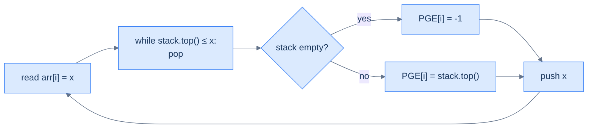
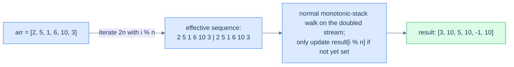

# 8. Pattern: Previous Closest Occurrence

## The Hook

Stocks. Yesterday's closing price was $48. Today's is $52. You want to know — *for every day in the entire trading history* — **the most recent earlier day whose price was higher**. That's the "previous greater" problem, and the brute-force solution is `for each day, walk backwards looking for a higher price` — O(N²) work that doesn't scale past a few thousand days.

But here's the trick. Once you encounter a *higher* price on day `i`, **every previous day with a price ≤ today's is now irrelevant** for future queries. Why? Because today's price *also* exceeds them, and today is more recent — any future day looking for a "previous greater" will hit today's price before ever reaching theirs. We can throw those obsolete prices away. **Forever.**

That "throw away dominated prices" rule is enforced by a **monotonic stack** — a stack whose values stay in decreasing order from bottom to top. Each element is pushed once, popped at most once, so the total work across all N elements is O(N). The same algorithm computes:

- *Previous greater element* — the most recent earlier value that's strictly bigger.
- *Previous smaller element* — the most recent earlier value that's strictly smaller.
- *Stock span* — for each day, how many consecutive previous days had price ≤ today's.
- *Largest rectangle in histogram* (with both previous- and next-smaller).
- *Daily temperatures*, *next greater element*, half the trick questions in any FAANG interview...

This is **monotonic-stack** territory, and once you internalise the *"the stack stores candidates that haven't been disqualified yet"* mental model, a startling number of problems open up. This lesson covers four variants — superior (greater), inferior (smaller), and both with circular arrays — with complete Python and Java implementations.

---

## Table of contents

1. [Understanding the previous closest occurrence pattern](#understanding-the-previous-closest-occurrence-pattern)
2. [Identifying the previous closest occurrence pattern](#identifying-the-previous-closest-occurrence-pattern)
3. [Preceding superior element](#preceding-superior-element)
4. [Preceding inferior element](#preceding-inferior-element)
5. [Preceding superior element II](#preceding-superior-element-ii)
6. [Preceding inferior element II](#preceding-inferior-element-ii)

***

# Understanding the previous closest occurrence pattern

The pattern: for each index `i`, find the *closest preceding* index `j < i` whose value satisfies some predicate (`> arr[i]`, `< arr[i]`, etc.). The naive nested loop is O(N²). The monotonic-stack solution is O(N).

```d2
direction: right

arr: arr {
  grid-columns: 6
  grid-gap: 0
  i0: "3"
  i1: "5"
  i2: "1"
  i3: "6"
  i4: "8"
  i5: "7"
}

out: "previous greater (PGE)" {
  grid-columns: 6
  grid-gap: 0
  o0: "−1"
  o1: "−1"
  o2: "5" {style.fill: "#fef9c3"; style.stroke: "#f59e0b"}
  o3: "−1"
  o4: "−1"
  o5: "8"
}

note: "e.g. arr[2]=1: closest earlier value > 1 is 5" {shape: text}
note -> out.o2: "" {style.stroke-dash: 3}

arr -> out
```

<p align="center"><strong>Previous-greater-element (PGE) for an array — for every position, the most recent strictly-greater value to its left, or −1 if none exists. The brute force is O(N²); the monotonic-stack solution is O(N).</strong></p>

## The previous closest occurrence technique

Walk the array left to right. Maintain a **monotonic decreasing stack** of values seen so far (top = smallest, bottom = largest). For each new element `x`:

1. **Pop** every value `≤ x` from the top of the stack. These values can never again be a "previous greater" for any future element — `x` itself is between them and any future query, and `x ≥ them`.
2. **The new top** (if any) is `x`'s **previous greater** — the closest earlier value that's still strictly greater. If the stack is empty, no such value exists; record `-1`.
3. **Push `x`** so it's a candidate for elements to come.



<p align="center"><strong>Monotonic-stack core loop — pop everything that's been "dominated" by the current element, then the new top is the answer. Each value enters the stack at most once and leaves at most once → total work is O(N).</strong></p>

## Why is this O(N)?

The operations look unbounded — there's a `while` loop nested inside the `for` loop — but the **amortised analysis** says otherwise. Across the entire run, every array element is **pushed exactly once** and **popped at most once**. Total stack operations: at most 2N. The outer loop runs N times. Total work: O(N).

This is one of the most beautiful amortised arguments in algorithms — a nested `while` masquerading as O(N²) but actually O(N) when you count operations across the whole input rather than per iteration.

## Algorithm

> **Algorithm — previous greater element (PGE)**
>
> -   **Step 1:** Initialise an empty stack and a result array `pge[0..n-1]` filled with `-1`.
> -   **Step 2:** For `i` from 0 to n−1:
>     -   While the stack is non-empty and `stack.top() <= arr[i]`: pop.
>     -   If the stack is non-empty: `pge[i] = stack.top()`.
>     -   Push `arr[i]`.
> -   **Step 3:** Return `pge`.

For **previous smaller element (PSE)**, swap the comparison: pop while `stack.top() >= arr[i]`.

## Implementation — generic PGE walker


```python run
from typing import List

def previous_greater_occurrence(arr: List[int]) -> List[int]:
    """
    Find the previous greater occurrence for each element in the array.

    :param arr: A list of integers.
    :return: A list of integers where each element represents the previous greater element
             in the input array, or -1 if no such element exists.
    """
    # List to store the previous greater elements for arr
    previous_greater: List[int] = [-1] * len(arr)

    # Stack to hold the chain of previous greater items
    stack: List[int] = []

    # Iterate over the array
    for i in range(len(arr)):
        # Keep popping elements from the stack
        # until we find an item greater than the current item
        while stack and stack[-1] < arr[i]:
            stack.pop()

        # If the stack is not empty, the top item is the previous greater item
        if stack:
            previous_greater[i] = stack[-1]

        # Push the current element onto the stack
        stack.append(arr[i])

    return previous_greater
```

```java run
class Solution {
    public List<Integer> previousGreaterOccurrence(List<Integer> arr) {

        // Array to store the previous greater elements for arr
        List<Integer> previousGreater = new ArrayList<>();
        for (int i = 0; i < arr.size(); i++) {
            previousGreater.add(-1);
        }

        // Stack to hold the chain of previous greater items
        Stack<Integer> stack = new Stack<>();

        // Iterate over the array
        for (int i = 0; i < arr.size(); i++) {
            // Keep popping elements from the stack
            // until we find an item greater than the current item
            while (!stack.isEmpty() && stack.peek() < arr.get(i)) {
                stack.pop();
            }

            // If the stack is not empty, the top item is the previous greater item
            if (!stack.isEmpty()) {
                previousGreater.set(i, stack.peek());
            }

            // Push the current element onto the stack
            stack.push(arr.get(i));
        }

        return previousGreater;
    }
}
```


## Complexity Analysis

> **All cases** — Time: **O(N)** amortised | Space: **O(N)** for the stack and result.

***

# Identifying the previous closest occurrence pattern

The pattern fits whenever the answer for each position depends on **the closest earlier position satisfying some monotone condition** (greater than, smaller than, equal to, …). The decision rule for the stack:

- Looking for **previous greater**? Maintain a **decreasing** stack; pop while top `≤` current.
- Looking for **previous smaller**? Maintain an **increasing** stack; pop while top `≥` current.

**Template:**
> Walk the array; maintain a monotonic stack of un-disqualified candidates; for each new element, pop the dominated ones; the new top is the answer.

***

# Preceding superior element

## Problem Statement

Given two arrays `arr1` and `arr2` (where `arr2` is a subset of `arr1` and all elements are unique), return for each value in `arr2` its **preceding superior element** in `arr1` — the first strictly-greater element to its left in `arr1`. Return `-1` for values with no preceding superior.

### Example 1
> -   **Input:** `arr1 = [3, 5, 1, 6, 8, 7]`, `arr2 = [3, 1, 8, 7]`
> -   **Output:** `[-1, 5, -1, 8]`

### Example 2
> -   **Input:** `arr1 = [5, 9, 7, 8, 1]`, `arr2 = [5, 9, 7]`
> -   **Output:** `[-1, -1, 9]`

<details>
<summary><h2>Approach</h2></summary>


Two passes:

1. Compute the previous-greater-element array `pge` for `arr1` using the monotonic stack (O(N)).
2. Build a `value → index` map for `arr1`. Then for each query in `arr2`, look up its index and read `pge[index]`.

Total: O(N + M) time, O(N) space.

</details>
<details>
<summary><h2>Solution</h2></summary>


```python run
from typing import List

class Solution:
    def preceding_superior_element(
        self, arr_1: List[int], arr_2: List[int]
    ) -> List[int]:

        # Array to store the previous greater elements for arr_1
        previous_greater = [-1] * len(arr_1)

        # Map to store the last index of each element in arr_1
        index_map = {}

        # Stack to help find the previous greater element efficiently
        stack = []

        # Step 1: Build the previous greater elements array for arr_1
        for i, num in enumerate(arr_1):

            # Remove elements from the stack that are smaller than or
            # equal to the current element
            while stack and stack[-1] <= num:
                stack.pop()

            # If the stack is not empty, set the previous greater element
            if stack:
                previous_greater[i] = stack[-1]

            # Push the current element onto the stack for future elements
            stack.append(num)

            # Store the index of the current element in the index map
            index_map[num] = i

        # Step 2: Process arr_2 to generate the result
        result = []
        for num in arr_2:

            # Push the previous greater element if found, otherwise -1
            result.append(
                previous_greater[index_map[num]]
                if num in index_map
                else -1
            )

        return result


# Examples from the problem statement
print(Solution().preceding_superior_element([3,5,1,6,8,7], [3,1,8,7]))   # [-1, 5, -1, 8]
print(Solution().preceding_superior_element([5,9,7,8,1], [5,9,7]))       # [-1, -1, 9]

# Edge cases
print(Solution().preceding_superior_element([1,2,3], [1,2,3]))           # [-1, -1, -1] — sorted ascending
print(Solution().preceding_superior_element([3,2,1], [3,2,1]))           # [-1, 3, 2] — sorted descending
print(Solution().preceding_superior_element([5], [5]))                   # [-1] — single element
print(Solution().preceding_superior_element([1,3,2], [3,2]))             # [-1, 3]
print(Solution().preceding_superior_element([4,1,2], [1,2]))             # [4, 4]
```

```java run
import java.util.*;

public class Main {
    static class Solution {
        public int[] precedingSuperiorElement(int[] arr1, int[] arr2) {

            // Array to store the previous greater elements for arr1
            int[] previousGreater = new int[arr1.length];
            Arrays.fill(previousGreater, -1);

            // Map to store the last index of each element in arr1
            Map<Integer, Integer> indexMap = new HashMap<>();

            // Stack to help find the previous greater element efficiently
            Stack<Integer> stack = new Stack<>();

            // Step 1: Build the previous greater elements array for arr1
            for (int i = 0; i < arr1.length; i++) {
                int num = arr1[i];

                // Remove elements from the stack that are smaller than or
                // equal to the current element
                while (!stack.isEmpty() && stack.peek() <= num) {
                    stack.pop();
                }

                // If the stack is not empty, set the previous greater
                // element
                if (!stack.isEmpty()) {
                    previousGreater[i] = stack.peek();
                }

                // Push the current element onto the stack for future
                // elements
                stack.push(num);

                // Store the index of the current element in the index map
                indexMap.put(num, i);
            }

            // Step 2: Process arr2 to generate the result
            int[] result = new int[arr2.length];
            for (int i = 0; i < arr2.length; i++) {
                int num = arr2[i];

                // Push the previous greater element if found, otherwise -1
                result[i] = indexMap.containsKey(num)
                    ? previousGreater[indexMap.get(num)]
                    : -1;
            }

            return result;
        }
    }

    public static void main(String[] args) {
        // Examples from the problem statement
        System.out.println(Arrays.toString(
            new Solution().precedingSuperiorElement(new int[]{3,5,1,6,8,7}, new int[]{3,1,8,7})
        ));  // [-1, 5, -1, 8]
        System.out.println(Arrays.toString(
            new Solution().precedingSuperiorElement(new int[]{5,9,7,8,1}, new int[]{5,9,7})
        ));  // [-1, -1, 9]

        // Edge cases
        System.out.println(Arrays.toString(
            new Solution().precedingSuperiorElement(new int[]{1,2,3}, new int[]{1,2,3})
        ));  // [-1, -1, -1]
        System.out.println(Arrays.toString(
            new Solution().precedingSuperiorElement(new int[]{3,2,1}, new int[]{3,2,1})
        ));  // [-1, 3, 2]
        System.out.println(Arrays.toString(
            new Solution().precedingSuperiorElement(new int[]{5}, new int[]{5})
        ));  // [-1]
        System.out.println(Arrays.toString(
            new Solution().precedingSuperiorElement(new int[]{1,3,2}, new int[]{3,2})
        ));  // [-1, 3]
        System.out.println(Arrays.toString(
            new Solution().precedingSuperiorElement(new int[]{4,1,2}, new int[]{1,2})
        ));  // [4, 4]
    }
}
```

</details>


***

# Preceding inferior element

## Problem Statement

Same as above but **inferior** = strictly smaller. Maintain an *increasing* monotonic stack; pop while top `≥` current.

### Example 1
> -   **Input:** `arr1 = [3, 5, 1, 6, 8, 2]`, `arr2 = [3, 1, 8, 2]`
> -   **Output:** `[-1, -1, 6, 1]`

### Example 2
> -   **Input:** `arr1 = [5, 9, 7, 8, 1]`, `arr2 = [5, 9, 7]`
> -   **Output:** `[-1, 5, 5]`

<details>
<summary><h2>Solution</h2></summary>


```python run
from typing import List

class Solution:
    def preceding_inferior_element(
        self, arr_1: List[int], arr_2: List[int]
    ) -> List[int]:

        # Array to store the previous smaller elements for arr_1
        previous_smaller = [-1] * len(arr_1)

        # Map to store the last index of each element in arr_1
        index_map = {}

        # Stack to help find the previous smaller element efficiently
        stack = []

        # Step 1: Build the previous smaller elements array for arr_1
        for i, num in enumerate(arr_1):

            # Remove elements from the stack that are greater than or
            # equal to the current element
            while stack and stack[-1] >= num:
                stack.pop()

            # If the stack is not empty, set the previous smaller element
            if stack:
                previous_smaller[i] = stack[-1]

            # Push the current element onto the stack for future elements
            stack.append(num)

            # Store the index of the current element in the index map
            index_map[num] = i

        # Step 2: Process arr_2 to generate the result
        result = []
        for num in arr_2:

            # Push the previous smaller element if found, otherwise -1
            result.append(
                previous_smaller[index_map[num]]
                if num in index_map
                else -1
            )

        return result


# Examples from the problem statement
print(Solution().preceding_inferior_element([3,5,1,6,8,2], [3,1,8,2]))   # [-1, -1, 6, 1]
print(Solution().preceding_inferior_element([5,9,7,8,1], [5,9,7]))       # [-1, 5, 5]

# Edge cases
print(Solution().preceding_inferior_element([1,2,3], [1,2,3]))           # [-1, 1, 2] — ascending
print(Solution().preceding_inferior_element([3,2,1], [3,2,1]))           # [-1, -1, -1] — descending
print(Solution().preceding_inferior_element([5], [5]))                   # [-1] — single element
print(Solution().preceding_inferior_element([2,5,3], [5,3]))             # [2, 2]
print(Solution().preceding_inferior_element([4,1,3], [1,3]))             # [-1, 1]
```

```java run
import java.util.*;

public class Main {
    static class Solution {
        public int[] precedingInferiorElement(int[] arr1, int[] arr2) {

            // Array to store the previous smaller elements for arr1
            int[] previousSmaller = new int[arr1.length];
            Arrays.fill(previousSmaller, -1);

            // Map to store the last index of each element in arr1
            Map<Integer, Integer> indexMap = new HashMap<>();

            // Stack to help find the previous smaller element efficiently
            Stack<Integer> stack = new Stack<>();

            // Step 1: Build the previous smaller elements array for arr1
            for (int i = 0; i < arr1.length; i++) {
                int num = arr1[i];

                // Remove elements from the stack that are greater than or
                // equal to the current element
                while (!stack.isEmpty() && stack.peek() >= num) {
                    stack.pop();
                }

                // If the stack is not empty, set the previous smaller
                // element
                if (!stack.isEmpty()) {
                    previousSmaller[i] = stack.peek();
                }

                // Push the current element onto the stack for future
                // elements
                stack.push(num);

                // Store the index of the current element in the index map
                indexMap.put(num, i);
            }

            // Step 2: Process arr2 to generate the result
            int[] result = new int[arr2.length];
            for (int i = 0; i < arr2.length; i++) {
                int num = arr2[i];

                // Push the previous smaller element if found, otherwise -1
                result[i] = indexMap.containsKey(num)
                    ? previousSmaller[indexMap.get(num)]
                    : -1;
            }

            return result;
        }
    }

    public static void main(String[] args) {
        // Examples from the problem statement
        System.out.println(Arrays.toString(
            new Solution().precedingInferiorElement(new int[]{3,5,1,6,8,2}, new int[]{3,1,8,2})
        ));  // [-1, -1, 6, 1]
        System.out.println(Arrays.toString(
            new Solution().precedingInferiorElement(new int[]{5,9,7,8,1}, new int[]{5,9,7})
        ));  // [-1, 5, 5]

        // Edge cases
        System.out.println(Arrays.toString(
            new Solution().precedingInferiorElement(new int[]{1,2,3}, new int[]{1,2,3})
        ));  // [-1, 1, 2]
        System.out.println(Arrays.toString(
            new Solution().precedingInferiorElement(new int[]{3,2,1}, new int[]{3,2,1})
        ));  // [-1, -1, -1]
        System.out.println(Arrays.toString(
            new Solution().precedingInferiorElement(new int[]{5}, new int[]{5})
        ));  // [-1]
        System.out.println(Arrays.toString(
            new Solution().precedingInferiorElement(new int[]{2,5,3}, new int[]{5,3})
        ));  // [2, 2]
        System.out.println(Arrays.toString(
            new Solution().precedingInferiorElement(new int[]{4,1,3}, new int[]{1,3})
        ));  // [-1, 1]
    }
}
```

</details>


***

# Preceding superior element II

## Problem Statement

Same as preceding superior element, but the array is **circular** — when looking for a "preceding greater" you may wrap around past the start to the end of the array. If no greater exists even after a full circle, return `-1`.

### Example 1
> -   **Input:** `arr = [2, 5, 1, 6, 10, 3]`
> -   **Output:** `[3, 10, 5, 10, -1, 10]`

### Example 2
> -   **Input:** `arr = [6, 7, 8, 9, 8]`
> -   **Output:** `[8, 8, 9, -1, 9]`

<details>
<summary><h2>Approach — the doubled-array trick</h2></summary>


A circular array can be linearised by **iterating over `2n` indices**, mapping each index `i` to `i % n`. Each element gets two chances at finding its preceding greater — once on the "natural" pass and once with the wrap-around in play. Because every original element is processed twice, the time is still O(N).



<p align="center"><strong>Doubled-array trick — iterate <code>2n</code> times with <code>i % n</code> indexing. The first pass establishes most answers; the second pass catches values whose "previous greater" is on the other side of the wrap. Result is O(N) with O(N) extra space.</strong></p>

</details>
<details>
<summary><h2>Solution</h2></summary>


```python run
from typing import List

class Solution:
    def preceding_superior_element_ii(self, arr: List[int]) -> List[int]:
        n = len(arr)
        result = [-1] * n

        # Stack to store elements
        stack = []

        # Iterate twice through the array (circularly)
        for i in range(2 * n):

            # Circular index
            index = i % n
            num = arr[index]

            # Check if we can pop elements from the stack
            # (i.e., find the preceding greater element)
            while stack and stack[-1] <= num:
                stack.pop()

            # If stack is not empty, the top element is the preceding
            # superior element
            if stack:
                result[index] = stack[-1]

            # Always push the element to the stack
            stack.append(num)

        return result


# Examples from the problem statement
print(Solution().preceding_superior_element_ii([2,5,1,6,10,3]))   # [3, 10, 5, 10, -1, 10]
print(Solution().preceding_superior_element_ii([6,7,8,9,8]))      # [8, 8, 9, -1, 9]

# Edge cases
print(Solution().preceding_superior_element_ii([1]))              # [-1] — single element
print(Solution().preceding_superior_element_ii([5,5,5]))          # [-1, -1, -1] — all same
print(Solution().preceding_superior_element_ii([1,2]))            # [2, -1]
print(Solution().preceding_superior_element_ii([3,1,2]))          # [3, 3, 3]
print(Solution().preceding_superior_element_ii([5,4,3,2,1]))      # [-1, 5, 4, 3, 2]
```

```java run
import java.util.*;

public class Main {
    static class Solution {
        public int[] precedingSuperiorElementII(int[] arr) {
            int n = arr.length;
            int[] result = new int[n];

            // Initialize result with -1
            for (int i = 0; i < n; i++) {
                result[i] = -1;
            }

            // Stack to store elements
            Stack<Integer> stack = new Stack<>();

            // Iterate twice through the array (circularly)
            for (int i = 0; i < 2 * n; i++) {

                // Circular index
                int index = i % n;
                int num = arr[index];

                // Check if we can pop elements from the stack
                // (i.e., find the preceding greater element)
                while (!stack.isEmpty() && stack.peek() <= num) {
                    stack.pop();
                }

                // If stack is not empty, the top element is the preceding
                // superior element
                if (!stack.isEmpty()) {
                    result[index] = stack.peek();
                }

                // Always push the element to the stack
                stack.push(num);
            }

            return result;
        }
    }

    public static void main(String[] args) {
        // Examples from the problem statement
        System.out.println(Arrays.toString(
            new Solution().precedingSuperiorElementII(new int[]{2,5,1,6,10,3})
        ));  // [3, 10, 5, 10, -1, 10]
        System.out.println(Arrays.toString(
            new Solution().precedingSuperiorElementII(new int[]{6,7,8,9,8})
        ));  // [8, 8, 9, -1, 9]

        // Edge cases
        System.out.println(Arrays.toString(
            new Solution().precedingSuperiorElementII(new int[]{1})
        ));  // [-1]
        System.out.println(Arrays.toString(
            new Solution().precedingSuperiorElementII(new int[]{5,5,5})
        ));  // [-1, -1, -1]
        System.out.println(Arrays.toString(
            new Solution().precedingSuperiorElementII(new int[]{1,2})
        ));  // [2, -1]
        System.out.println(Arrays.toString(
            new Solution().precedingSuperiorElementII(new int[]{3,1,2})
        ));  // [3, 3, 3]
        System.out.println(Arrays.toString(
            new Solution().precedingSuperiorElementII(new int[]{5,4,3,2,1})
        ));  // [-1, 5, 4, 3, 2]
    }
}
```

</details>


***

# Preceding inferior element II

## Problem Statement

Circular variant of preceding inferior. Same approach with the comparison flipped.

### Example 1
> -   **Input:** `arr = [2, 5, 1, 6, 10, 3]`
> -   **Output:** `[1, 2, -1, 1, 6, 1]`

### Example 2
> -   **Input:** `arr = [6, 7, 8, 9, 8]`
> -   **Output:** `[-1, 6, 7, 8, 7]`

<details>
<summary><h2>Solution</h2></summary>


```python run
from typing import List

class Solution:
    def preceding_inferior_element_ii(self, arr: List[int]) -> List[int]:
        n = len(arr)
        result = [-1] * n

        # Stack to store elements
        stack = []

        # Iterate twice through the array (circularly)
        for i in range(2 * n):

            # Circular index
            index = i % n
            num = arr[index]

            # Check if we can pop elements from the stack
            # (i.e., find the preceding smaller element)
            while stack and stack[-1] >= num:
                stack.pop()

            # If stack is not empty, the top element is the preceding
            # inferior element
            if stack:
                result[index] = stack[-1]

            # Always push the element to the stack
            stack.append(num)

        return result


# Examples from the problem statement
print(Solution().preceding_inferior_element_ii([2, 5, 1, 6, 10, 3]))  # [1, 2, -1, 1, 6, 1]
print(Solution().preceding_inferior_element_ii([6, 7, 8, 9, 8]))      # [-1, 6, 7, 8, 7]

# Edge cases
print(Solution().preceding_inferior_element_ii([]))                    # []
print(Solution().preceding_inferior_element_ii([5]))                   # [-1]
print(Solution().preceding_inferior_element_ii([3, 1]))                # [1, -1]
print(Solution().preceding_inferior_element_ii([1, 2, 3]))             # [-1, 1, 2]
print(Solution().preceding_inferior_element_ii([3, 2, 1]))             # [1, 1, -1]
print(Solution().preceding_inferior_element_ii([5, 5, 5]))             # [-1, -1, -1]
```

```java run
import java.util.*;

public class Main {
    static class Solution {
        public int[] precedingInferiorElementII(int[] arr) {
            int n = arr.length;
            int[] result = new int[n];

            // Initialize result with -1
            for (int i = 0; i < n; i++) {
                result[i] = -1;
            }

            // Stack to store elements
            Stack<Integer> stack = new Stack<>();

            // Iterate twice through the array (circularly)
            for (int i = 0; i < 2 * n; i++) {

                // Circular index
                int index = i % n;
                int num = arr[index];

                // Check if we can pop elements from the stack
                // (i.e., find the preceding smaller element)
                while (!stack.isEmpty() && stack.peek() >= num) {
                    stack.pop();
                }

                // If stack is not empty, the top element is the preceding
                // inferior element
                if (!stack.isEmpty()) {
                    result[index] = stack.peek();
                }

                // Always push the element to the stack
                stack.push(num);
            }

            return result;
        }
    }

    public static void main(String[] args) {
        // Examples from the problem statement
        System.out.println(Arrays.toString(new Solution().precedingInferiorElementII(new int[]{2, 5, 1, 6, 10, 3})));  // [1, 2, -1, 1, 6, 1]
        System.out.println(Arrays.toString(new Solution().precedingInferiorElementII(new int[]{6, 7, 8, 9, 8})));      // [-1, 6, 7, 8, 7]

        // Edge cases
        System.out.println(Arrays.toString(new Solution().precedingInferiorElementII(new int[]{})));                   // []
        System.out.println(Arrays.toString(new Solution().precedingInferiorElementII(new int[]{5})));                  // [-1]
        System.out.println(Arrays.toString(new Solution().precedingInferiorElementII(new int[]{3, 1})));               // [1, -1]
        System.out.println(Arrays.toString(new Solution().precedingInferiorElementII(new int[]{1, 2, 3})));            // [-1, 1, 2]
        System.out.println(Arrays.toString(new Solution().precedingInferiorElementII(new int[]{3, 2, 1})));            // [1, 1, -1]
        System.out.println(Arrays.toString(new Solution().precedingInferiorElementII(new int[]{5, 5, 5})));            // [-1, -1, -1]
    }
}
```

</details>
<details>
<summary><h2>Final Takeaway</h2></summary>


Three lessons:

1. **A monotonic stack stores un-disqualified candidates.** The moment a new element arrives that "dominates" something on the stack (greater or smaller, depending on the variant), the dominated value is no longer a viable answer for any future query. Pop it. The stack stays clean.
2. **Amortised O(N) is the magic.** A nested `while` looks like O(N²) but each element enters and leaves the stack at most once, capping total stack ops at 2N.
3. **Circular arrays double the iteration, not the memory.** Iterate `2*n` times with `i % n` indexing; the second pass catches answers that need to wrap around the start.

> *Coming up — same machinery, opposite direction. **Lesson 9** does **next-closest** — for each element, find the closest <em>later</em> element satisfying the condition. Two ways to set this up: scan right-to-left with the same stack rules as previous-closest, or scan left-to-right and resolve answers retroactively when an element pops. The latter is more elegant; the former is more straightforward. Both come up in interviews.*

</details>