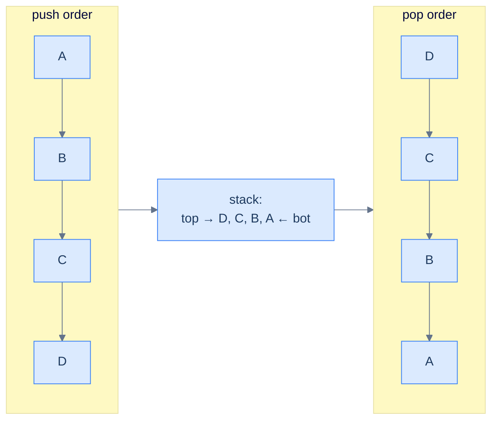

# Understanding the reversal pattern

Push everything in. Pop everything out. Done.

A stack reverses a sequence as a side effect of its own contract. The last element you push is the first you pop, so reading the stack back drains it in the opposite order to the way it filled. That single property — **Last In, First Out** — is the whole pattern. You do not write a reversal step; the data structure performs it for you.

> 🖼 Diagram — The reversal technique — every push goes onto the top; every pop comes off the top; the resulting pop sequence is the input sequence backwards. The stack does the reversal "for free".


<p align="center"><strong>The reversal technique — every push goes onto the top; every pop comes off the top; the resulting pop sequence is the input sequence backwards. The stack does the reversal "for free".</strong></p>

## Why Naive Isn't Enough

The naive way to reverse a sequence is index arithmetic: read the input back-to-front, or swap the two ends and walk inward. Both work, and for a plain array both are genuinely better than a stack — `O(1)` extra space instead of `O(N)`. So why learn the stack version at all?

The answer is the cases where index arithmetic has nothing to grip. Three situations break the back-to-front read:

- **The source has no index.** A stack exposes only its top — you cannot ask it for "the element at position `n-1`". To reverse a stack into another stack, popping is the only legal read, and popping already yields reverse order.
- **The unit of reversal is not a character.** "Reverse the word order, not the letters" needs you to reverse a stream of *words*. Index arithmetic over characters cannot express that; you would have to tokenise first anyway.
- **Reversal is a sub-step, not the whole problem.** When reversal is buried inside a larger stack algorithm — undo a sequence of operations, replay events newest-first — the data is already arriving through pushes. Reading it back off the stack is free.

To make this concrete: reversing the stack `[9, 5, 1, 2]` (top `2`) by index would require random access the stack refuses to give. Popping `2, 1, 5, 9` and pushing each onto a second stack lands `9` at the bottom and `2` on top — reversed, using only the operations a stack actually offers.

So the key idea is: the stack reversal pattern earns its keep precisely when the input is index-free, the reversal unit is coarser than a character, or the order has to flip as part of a bigger LIFO algorithm.

## The Core Idea

A stack is a reverser because **the order you read it is forced to be the reverse of the order you wrote it**. Push `A, B, C, D`; the top is `D`; popping drains `D, C, B, A`. No comparison, no bookkeeping, no second data structure decides this — it falls directly out of the LIFO contract. The pattern is one observation applied over and over: *route a sequence through a stack and the output is reversed*.

The core insight is: whatever you choose to push becomes the unit that gets reversed. Push characters and you reverse a string. Push integers and you reverse an array. Push whole words and you reverse word order while every word's internal letters stay intact. The algorithm never changes — only the granularity of one "item" does.

## How the Pointers Move

There are no two-ended pointers here; the moving parts are two sequential passes over the data with the stack sitting between them. They run in a fixed order:

1. **Pass 1 — load the stack.** A single cursor walks the input from start to end and pushes each item. After this pass, the stack holds the input with the last-seen item on top.
2. **Pass 2 — unload into the destination.** Pop the stack until empty; write each popped item into the next free slot of the destination. After this pass, the destination is the input reversed.

The destination is the only knob. When you want a fresh reversed copy, the destination is a brand-new container and the two passes never overlap. When you want an *in-place* reversal of an array, the destination is the same array. The unload pass overwrites index `0`, then `1`, then `2`, and so on; because the pops arrive in reverse order, the array ends up reversed with no second *result* array. The stack itself is still `O(N)` extra space, so in-place here means "no second result array", not "no auxiliary memory".

## The Generic Algorithm

Three numbered steps, with zero comparison logic — load the stack, then unload it into the destination.

> **Algorithm**
>
> -   **Step 1:** Initialise an empty stack.
> -   **Step 2:** Iterate over the input; push each element.
> -   **Step 3:** Iterate over the output positions (or write to the result); for each, pop the stack and write the popped value.

## Implementation — generic array reverser


```python run
from collections import deque
from typing import List

def reverse_using_stack(arr: List[int]) -> None:

    # Initialize a stack to hold array items
    stack: deque = deque()

    # Traverse the array and push items onto the stack
    for item in arr:
        stack.append(item)

    # Traverse the array again and overwrite the items with the
    # top of the stack
    for i in range(len(arr)):
        arr[i] = stack.pop()
```

```java run

class Solution {
    public void reverseUsingStack(List<Integer> arr) {

        // Initialize a stack to hold array items
        Stack<Integer> stack = new Stack<>();

        // Traverse the list and push items onto the stack
        for (int item : arr) {
            stack.push(item);
        }

        // Traverse the list again and overwrite the items with the
        // top of the stack
        for (int i = 0; i < arr.size(); i++) {
            arr.set(i, stack.pop());
        }
    }
}
```


## Complexity Analysis

> **All cases** — Time: **O(N)** | Space: **O(N)** (the stack holds a copy of the input)

The runtime is `O(N)` time: the load pass touches every item once and the unload pass touches every item once, and a push or a pop is `O(1)`. The space is `O(N)`: the stack holds a full copy of the input between the two passes. Even the in-place array variant pays this `O(N)` space — "in place" there means no second *result* array, not zero auxiliary memory.

## Variants / Taxonomy

The pattern shows up in four recognisable variants in this section. Each pushes a different *unit*, but every one runs the same load-then-unload loop.

- **Stack inversion** — push the popped elements of one stack onto a second stack. The unit is a stack element; the single transfer reverses order because the input's top is pushed first and ends up at the output's bottom.
- **Reverse a string** — push each character, then pop into a result string. The unit is a character; the textbook two-pass.
- **Reverse an array (in place)** — push each integer, then pop while overwriting indices `0..n-1`. The unit is an integer; the destination is the input array itself.
- **Reverse word order** — push each whole word, then pop with single-space separators. The unit is a *word*, so the letters inside each word are never disturbed — only the word order flips.

The variants share an invariant: every item pushed is popped exactly once, and the pop sequence is the push sequence reversed. The only thing that distinguishes them is what counts as one item and where the unload pass writes.

## Recognition Checklist

The pattern fits when **all four** answers are "yes". The first asks whether the problem wants reverse order at all; the next three check that a stack is the natural tool rather than index arithmetic.

- Does the problem ask for a sequence — string, array, list, words — to be returned in the opposite order?
- Is the input read through one end only, or is its natural unit coarser than a single index (whole words, whole sub-arrays)?
- Is a single linear pass to load and a single linear pass to unload enough — with no comparison between items?
- Is `O(N)` auxiliary space acceptable (the stack holds a full copy of the input)?

Common surface signals: "return the reversed string," "reverse the array using a stack," "reverse the order of words," "invert this stack," or reversal showing up as one step inside a larger expression- or undo-handling algorithm.

## Canonical Example: Reverse a String

**Problem Statement.** Given a string `s`, return its characters in reverse order using a stack.

```
Input:  s = "abcdefgh"
Output: "hgfedcba"
```

### Brute Force

Index from the back: build the result by reading `s[len(s)-1]`, `s[len(s)-2]`, down to `s[0]`, appending each to an output buffer. This is `O(N)` time and `O(N)` space for the output, with no auxiliary structure. It is correct and, for a plain string, perfectly fine — but it leans on random access by index, which the stack version deliberately avoids so the same code survives when the source is index-free.

### Key Insight

Route every character through a stack. Pushing `a, b, c, d, e, f, g, h` leaves `h` on top; popping drains `h, g, f, e, d, c, b, a`. The reversed order is not computed — it is the order the stack hands the characters back. The character is the unit, so the letters reverse; push words instead and the same loop would reverse word order.

### Optimized Solution

Two passes over the string. Pass 1 pushes each character; pass 2 pops until the stack is empty, appending each popped character to a result string. The work is the same `O(N)` time and `O(N)` space as the brute force, but the read pattern is pop-only — it transfers unchanged to the stack-inversion problem, where indexing is illegal. The Python and Java implementations are shown in the **Reverse the String** problem file.

### Trace

```
s = "abc"

Pass 1 — load the stack:
  push 'a'  → stack (bottom→top): a
  push 'b'  → stack: a b
  push 'c'  → stack: a b c        (top is 'c')

Pass 2 — unload into result:
  pop 'c'   → result = "c"        stack: a b
  pop 'b'   → result = "cb"       stack: a
  pop 'a'   → result = "cba"      stack: (empty)

Return "cba" ✓
```

### Fitting the Template

| Check | Answer for Reverse a String |
|---|---|
| **Q1.** Does the problem ask for the sequence in opposite order? | **Yes** — return the characters of `s` reversed. |
| **Q2.** Is the input read through one end only, or its unit coarser than an index? | **Acceptable** — characters can be indexed, but pop-only reading is the transferable skill this pattern teaches. |
| **Q3.** Are two linear passes (load, unload) enough with no comparison? | **Yes** — push every character, pop every character; no item is ever compared. |
| **Q4.** Is `O(N)` auxiliary space acceptable? | **Yes** — the stack holds all `N` characters; `O(N)` time, `O(N)` space total. |

All four answers are "yes", so the reversal pattern applies. The load pass fills the stack; the unload pass drains it into the result in reversed order.

## Problems in This Category

| Problem | Variant | What gets pushed |
|---|---|---|
| **[Stack Inversion](02-problems/01-stack-inversion.md)** | Stack-to-stack | Each popped element of the input stack; the transfer reverses order in one pass |
| **[Reverse the String](02-problems/02-reverse-the-string.md)** | Character reversal | Each character; pop into a result string |
| **[Reverse an Array](02-problems/03-reverse-an-array.md)** | In-place integer reversal | Each integer; pop while overwriting indices `0..n-1` of the input array |
| **[Reverse Word Order](02-problems/04-reverse-word-order.md)** | Word-unit reversal | Each whole word; pop with single-space separators, leaving letters intact |

Difficulty rises with what counts as one item. The first three push atoms straight from the input; the fourth must tokenise the string into words first, which is the only extra bookkeeping in the section.
