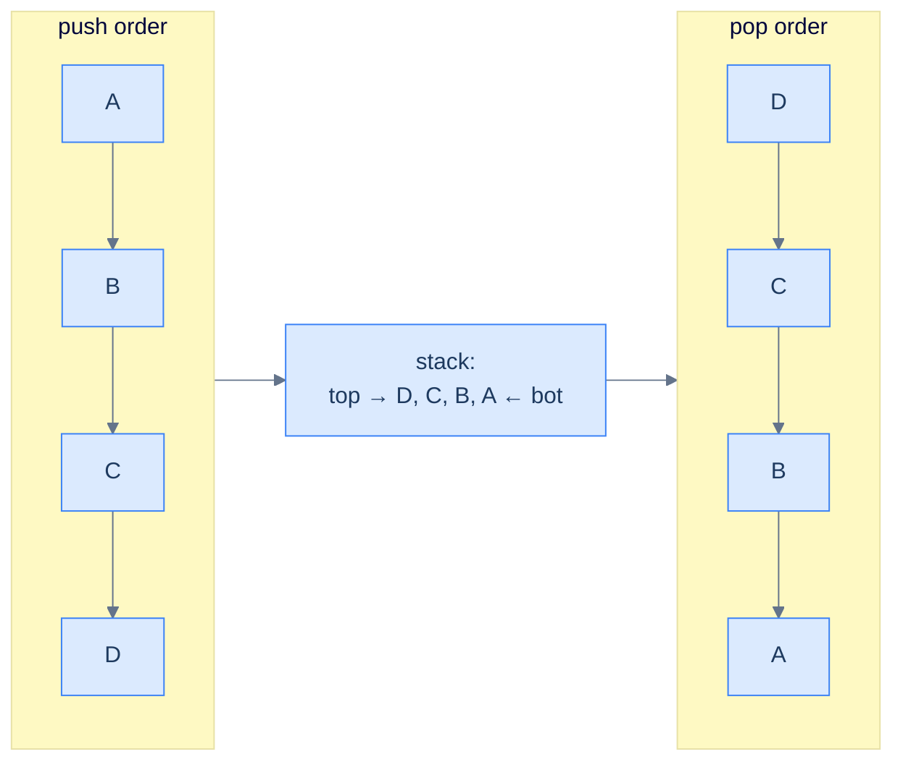

# Understanding the reversal pattern

Push everything in. Pop everything out. Done.

> 🖼 Diagram — The reversal technique — every push goes onto the top; every pop comes off the top; the resulting pop sequence is the input sequence backwards. The stack does the reversal "for free".


<p align="center"><strong>The reversal technique — every push goes onto the top; every pop comes off the top; the resulting pop sequence is the input sequence backwards. The stack does the reversal "for free".</strong></p>

## The reversal technique

Two passes:

1. **Pass 1 — load the stack.** Iterate the input from start to end; push each element. After this pass, the stack holds the input with the last element on top.
2. **Pass 2 — unload into the destination.** Pop the stack until empty; write each popped element into the next slot of the result. After this pass, the destination is the input reversed.

For *in-place* reversal of an array, the destination is the same array — pass 2 overwrites positions 0, 1, 2, ... in order with stack pops, and the array ends up reversed.

## Algorithm

> **Algorithm**
>
> -   **Step 1:** Initialise an empty stack.
> -   **Step 2:** Iterate over the input; push each element.
> -   **Step 3:** Iterate over the output positions (or write to the result); for each, pop the stack and write the popped value.

## Implementation — generic array reverser


```python run
from collections import deque
from typing import List

def reverse_using_stack(arr: List[int]) -> None:

    # Initialize a stack to hold array items
    stack: deque = deque()

    # Traverse the array and push items onto the stack
    for item in arr:
        stack.append(item)

    # Traverse the array again and overwrite the items with the
    # top of the stack
    for i in range(len(arr)):
        arr[i] = stack.pop()
```

```java run

class Solution {
    public void reverseUsingStack(List<Integer> arr) {

        // Initialize a stack to hold array items
        Stack<Integer> stack = new Stack<>();

        // Traverse the list and push items onto the stack
        for (int item : arr) {
            stack.push(item);
        }

        // Traverse the list again and overwrite the items with the
        // top of the stack
        for (int i = 0; i < arr.size(); i++) {
            arr.set(i, stack.pop());
        }
    }
}
```


## Complexity Analysis

> **All cases** — Time: **O(N)** | Space: **O(N)** (the stack holds a copy of the input)

# Identifying the reversal pattern

Anywhere the problem says — implicitly or explicitly — *"give me this back in the opposite order"*, the reversal pattern fits.

**Template:**
> Given a sequence (string, array, list, words), produce its reverse using a stack.

The pattern is *the* canonical use of a stack as a reverser. In the problems below it shows up four ways:

- **Stack inversion** — reverse the contents of one stack into another stack.
- **Reverse the string** — reverse a character sequence.
- **Reverse an array** — reverse an integer sequence in place.
- **Reverse word order** — reverse the *order of words*, leaving each word's internal letters intact.

The fourth is the most subtle: the stack stores *complete words*, not characters. The unit of reversal is whatever you push.

<!-- ============================================== -->
<!-- SWEEP 2 — missing sections (placeholders only) -->
<!-- ============================================== -->

<!-- TODO: Why Naive Isn't Enough — missing, needs to be written -->
<!--       Guidance: motivation for why the obvious approach fails -->

<!-- TODO: The Core Idea — missing, needs to be written -->
<!--       Guidance: one paragraph: the central trick -->

<!-- TODO: How the Pointers/Window Move — missing, needs to be written -->
<!--       Guidance: mechanics of the moving parts -->

<!-- TODO: The Generic Algorithm — missing, needs to be written -->
<!--       Guidance: numbered steps, no code -->

<!-- TODO: Generic Implementation — missing, needs to be written -->
<!--       Guidance: Python block + Java block of the skeleton -->

<!-- TODO: Variants / Taxonomy — missing, needs to be written -->
<!--       Guidance: enumerate sub-shapes of this pattern -->

<!-- TODO: Recognition Checklist — missing, needs to be written -->
<!--       Guidance: 4-question diagnostic — the source of the Problem-section Diagnostic Questions -->

<!-- TODO: Canonical Example — missing, needs to be written -->
<!--       Guidance: fully worked example: brute force → optimised → template fit -->

<!-- TODO: Problems in This Category — missing, needs to be written -->
<!--       Guidance: table with links to the 02-problems/ files -->
