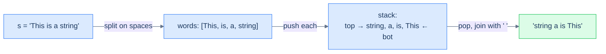

# Reverse word order

## Problem Statement

Given a string `s` containing multiple space-separated words, reverse the **order of words** without reversing the letters within each word.

### Example 1
> -   **Input:** `s = "This is a string"` → **Output:** `"string a is This"`

### Example 2
> -   **Input:** `s = "abc"` → **Output:** `"abc"`

<details>
<summary><h2>Approach</h2></summary>


Same reversal pattern, **but the unit is a word, not a character**. Tokenise on spaces, push each word, pop into a result with single-space separators. The trailing-space cleanup at the end is the only fiddly part.

> 🖼 Diagram — Reverse word order — push whole words, not characters; the stack reverses their order, while each word's internal letters are untouched. The unit of reversal is whatever you push.


<p align="center"><strong>Reverse word order — push <em>whole words</em>, not characters; the stack reverses their order, while each word's internal letters are untouched. The unit of reversal is whatever you push.</strong></p>

</details>
<details>
<summary><h2>Solution</h2></summary>


```python run
from typing import List

class Solution:
    def build_stack_of_words(self, s: str) -> List[str]:

        # Create a stack to store words
        stack: List[str] = []

        # Variable to store each word
        word = ""

        # Iterate through each character in the input string
        for ch in s:

            # If the character is not a space, add it to the word
            if ch != " ":
                word += ch

            # If a space is encountered and the word is not empty
            # Push the word onto the stack
            elif word:
                stack.append(word)

                # Reset the word
                word = ""

        # Push the last word onto the stack if it's not empty
        if word:
            stack.append(word)

        return stack

    def reverse_word_order(self, s: str) -> str:
        stack_of_words = self.build_stack_of_words(s)

        # Variable to store the reversed string
        reversed_string = ""

        # Pop words from the stack and append them to the reversed_string
        while stack_of_words:
            reversed_string += stack_of_words.pop() + " "

        # Remove the trailing space at the end
        if reversed_string:
            reversed_string = reversed_string.rstrip()

        # Return the reversed string without reversing the words
        return reversed_string


# Examples from the problem statement
print(Solution().reverse_word_order("This is a string"))   # string a is This
print(Solution().reverse_word_order("abc"))                # abc

# Edge cases
print(Solution().reverse_word_order(""))                   # "" — empty string
print(Solution().reverse_word_order("hello world"))        # world hello
print(Solution().reverse_word_order("a b c"))              # c b a
print(Solution().reverse_word_order("one"))                # one — single word
print(Solution().reverse_word_order("x y"))                # y x — two words
```

```java run
import java.util.*;

public class Main {
    static class Solution {
        private Stack<String> buildStackOfWords(String s) {

            // Create a stack to store words
            Stack<String> stack = new Stack<>();

            // Variable to store each word
            StringBuilder word = new StringBuilder();

            // Iterate through each character in the input string
            for (char ch : s.toCharArray()) {

                // If the character is not a space, add it to the word
                if (ch != ' ') {
                    word.append(ch);
                }

                // If a space is encountered and the word is not empty
                // Push the word onto the stack
                else if (word.length() > 0) {
                    stack.push(word.toString());

                    // Reset the word
                    word.setLength(0);
                }
            }

            // Push the last word onto the stack if it's not empty
            if (word.length() > 0) {
                stack.push(word.toString());
            }

            return stack;
        }

        public String reverseWordOrder(String s) {
            Stack<String> stackOfWords = buildStackOfWords(s);

            // Variable to store the reversed string
            StringBuilder reversedString = new StringBuilder();

            // Pop words from the stack and append them to the reversedString
            while (!stackOfWords.isEmpty()) {
                reversedString.append(stackOfWords.pop()).append(" ");
            }

            // Remove the trailing space at the end
            if (reversedString.length() > 0) {
                reversedString.setLength(reversedString.length() - 1);
            }

            // Return the reversed string without reversing the words
            return reversedString.toString();
        }
    }

    public static void main(String[] args) {
        // Examples from the problem statement
        System.out.println(new Solution().reverseWordOrder("This is a string"));  // string a is This
        System.out.println(new Solution().reverseWordOrder("abc"));               // abc

        // Edge cases
        System.out.println(new Solution().reverseWordOrder(""));                  // ""
        System.out.println(new Solution().reverseWordOrder("hello world"));       // world hello
        System.out.println(new Solution().reverseWordOrder("a b c"));             // c b a
        System.out.println(new Solution().reverseWordOrder("one"));               // one
        System.out.println(new Solution().reverseWordOrder("x y"));               // y x
    }
}
```

</details>
<details>
<summary><h2>Final Takeaway</h2></summary>


Three lessons:

1. **A stack is a free reverser.** Push N items in, pop N items out, and the order is inverted with no extra logic — it's the LIFO contract doing the work.
2. **The unit of reversal is whatever you push.** Push characters → reverses characters. Push words → reverses word order without disturbing letters. Push entire sub-arrays → reverses chunk order. The same algorithm reshapes itself by changing what counts as one item.
3. **Reversal alone is rarely the *whole* problem.** It's almost always a sub-step inside something bigger: reverse the operator part of a string, reverse a path in a tree, reverse the order in which items get processed. Recognise reversal as a *building block*, not an answer.

> *Coming up — the reversal pattern was the gentlest stack pattern. The next four progressively get harder by combining "remember the most recent thing not yet resolved" with one or two extra constraints. Lesson 8 — **previous closest occurrence** — uses a stack to find, for each element, the nearest earlier element that satisfies some condition (e.g. the previous greater element). It's the canonical "monotonic stack" problem and powers stock-span calculations, histogram problems, and a hundred interview questions.*

</details>

<!-- ============================================== -->
<!-- SWEEP 2 — missing sections (placeholders only) -->
<!-- ============================================== -->

<!-- TODO: Examples — missing, needs to be written -->
<!--       Guidance: min 3 examples: basic / variant / edge -->

<!-- TODO: Intuition — missing, needs to be written -->
<!--       Guidance: 3 paragraphs: brute force / observation / pattern fit -->

<!-- TODO: Applying the Diagnostic Questions — missing, needs to be written -->
<!--       Guidance: REQUIRED, never optional -->
<!--       Guidance: 4-row table. Columns: 'Check' | 'Answer for [Problem Name]' -->
<!--       Guidance: Rows: two positions simultaneously / one near start one near end / both move inward / simple O(1) work at each step -->

<!-- TODO: Approach — missing, needs to be written -->
<!--       Guidance: numbered steps, no code -->

<!-- TODO: Solution — missing, needs to be written -->
<!--       Guidance: Python block then Java block -->

<!-- TODO: Dry Run — missing, needs to be written -->
<!--       Guidance: walk through a small example step by step -->

<!-- TODO: Complexity Analysis — missing, needs to be written -->
<!--       Guidance: table: time / space / why -->

<!-- TODO: Edge Cases — missing, needs to be written -->
<!--       Guidance: table, min 5 rows -->

<!-- TODO: Key Takeaway — missing, needs to be written -->
<!--       Guidance: 1–2 sentences -->
