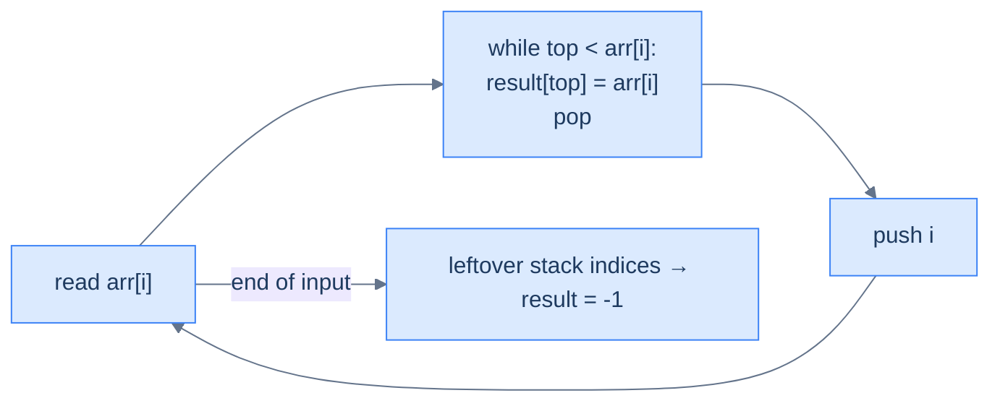
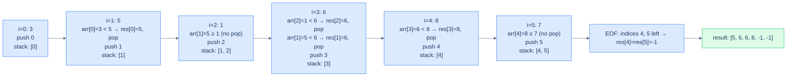
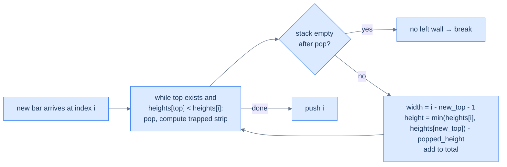
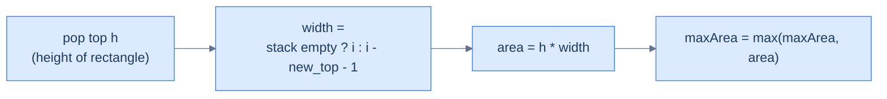

# 9. Pattern: Next Closest Occurrence

## The Hook

Same idea as the previous lesson, mirrored in time. Instead of "the closest **earlier** element greater than me", it's "the closest **later** element greater than me". Daily-temperatures, stock-span, monotonic-queue scheduling, water-trapping, the largest rectangle in a histogram — all of them are next-closest queries with a monotonic stack at their core.

There are two equally clean ways to implement next-closest. Each way is the inverse of the other:

- **Scan right-to-left** with the same monotonic-stack rule as previous-closest. The "previous" of the reversed array *is* the "next" of the original.
- **Scan left-to-right**, but **resolve answers retroactively** when an element pops. While walking forward, the current element is everyone's potential "next greater"; whenever it dominates something on the stack, that something's answer is *the current element*. The element you're holding **fills in answers for old elements** as it climbs the stack.

The second style is more elegant and is the one you'll see in real codebases — it's the same pattern that powers the "largest rectangle in histogram" closing-bracket flush, the "trapping rain water" two-bar reduction, and the linked-list-flavoured next-greater problem. This lesson covers seven problems building on it: the basic four (next greater, next smaller, both circular variants), one linked-list variant, and two classic monotonic-stack puzzles — *retained rainwater* and *largest rectangle in a histogram*.

---

## Table of contents

1. [Understanding the next closest occurrence pattern](#understanding-the-next-closest-occurrence-pattern)
2. [Identifying the next closest occurrence pattern](#identifying-the-next-closest-occurrence-pattern)
3. [Succeeding superior element](#succeeding-superior-element)
4. [Succeeding inferior element](#succeeding-inferior-element)
5. [Succeeding superior element II](#succeeding-superior-element-ii)
6. [Succeeding inferior element II](#succeeding-inferior-element-ii)
7. [Succeeding superior nodes](#succeeding-superior-nodes)
8. [Retained rainwater](#retained-rainwater)
9. [Largest rectangle area](#largest-rectangle-area)

***

# Understanding the next closest occurrence pattern

Two equivalent algorithms.

## Approach 1 — right-to-left scan (mirror of previous-closest)

Walk the array from right to left, maintaining a monotonic decreasing stack. For each `arr[i]`:

1. Pop all stack values `≤ arr[i]`.
2. The new top (if any) is `arr[i]`'s **next greater**.
3. Push `arr[i]`.

This is *literally the previous-closest algorithm with the loop reversed*. Same proof of correctness, same O(N) cost.

## Approach 2 — left-to-right with retroactive resolution

Walk left to right with a monotonic decreasing stack of **indices**. For each `arr[i]`:

1. While the stack is non-empty and `arr[stack.top()] < arr[i]`: the current element `arr[i]` is the **next greater** for `arr[stack.top()]`. Record `result[stack.top()] = arr[i]` and pop.
2. Push `i`.

Anyone left on the stack at end-of-input has *no* next-greater — leave their answer as `-1`.



<p align="center"><strong>Left-to-right next-greater — the current element <em>resolves the answers</em> of old elements as it climbs the stack. Each index is pushed once and popped at most once → O(N) total.</strong></p>

This is the more idiomatic style. Most production monotonic-stack code uses left-to-right with retroactive resolution because it generalises better to "find the next position where some predicate flips" without having to first reverse the array.

## Walkthrough — `arr = [3, 5, 1, 6, 8, 7]` (left-to-right NGE)



<p align="center"><strong>Left-to-right NGE on <code>[3, 5, 1, 6, 8, 7]</code> — when 5 arrives, it resolves index 0; when 6 arrives, it resolves indices 2 and 1; when 8 arrives, it resolves index 3. Indices 4 and 5 never get resolved → their NGE is -1.</strong></p>

## Algorithm

> **Algorithm — next greater element (NGE), left-to-right with retroactive resolution**
>
> -   **Step 1:** Initialise an empty stack and `nge[0..n-1] = -1`.
> -   **Step 2:** For `i` from 0 to n−1:
>     -   While stack non-empty and `arr[stack.top()] < arr[i]`: `nge[stack.pop()] = arr[i]`.
>     -   Push `i`.
> -   **Step 3:** Return `nge`.

For **next smaller**, swap the comparison: `arr[stack.top()] > arr[i]`.

## Implementation — generic NGE walker


```python run
from typing import List

def next_greater_occurrence(arr: List[int]) -> List[int]:
    # List to store the next greater elements for arr
    next_greater: List[int] = [-1] * len(arr)

    # Stack to track indices of elements in decreasing order
    stack: List[int] = []

    # Iterate over the array
    for i, num in enumerate(arr):
        # While the stack is not empty and the current element is greater than
        # the element at the index stored at the top of the stack
        while stack and arr[stack[-1]] < num:
            # Set the next greater element for the index at the top of the stack
            prev_index = stack.pop()
            next_greater[prev_index] = num

        # Push the current index onto the stack
        stack.append(i)

    return next_greater
```

```java run
public class NextGreaterOccurrence {

    public List<Integer> nextGreaterOccurrence(List<Integer> arr) {

        // List to store the next greater elements for arr
        List<Integer> nextGreater = new ArrayList<>();
        for (int i = 0; i < arr.size(); i++) {
            nextGreater.add(-1);
        }

        // Stack to track indices of elements in decreasing order
        Stack<Integer> stack = new Stack<>();

        // Iterate over the array
        for (int i = 0; i < arr.size(); i++) {
            int num = arr.get(i);
            while (!stack.isEmpty() && arr.get(stack.peek()) < num) {
                // If the current item is greater than the value at the top of the stack,
                // store it in the nextGreater list using the index at the top of the stack
                int index = stack.pop();
                nextGreater.set(index, num);
            }
            // Push the current index onto the stack
            stack.push(i);
        }

        return nextGreater;
    }
}
```


## Complexity Analysis

> **All cases** — Time: **O(N)** | Space: **O(N)**.

***

# Identifying the next closest occurrence pattern

Anywhere the answer for each position depends on **the closest later position** satisfying a monotonic predicate, this pattern fits.

**Template:**
> Walk the array left-to-right; maintain a monotonic stack of indices; on each new element, pop from the stack any index whose value is "dominated" and record the current value as that index's answer. Indices left on the stack at end-of-input have no answer (record `-1` or sentinel).

***

# Succeeding superior element

## Problem Statement

Given two arrays `arr1` and `arr2` (where `arr2` is a subset of `arr1` and all elements are unique), return for each value in `arr2` its **succeeding superior element** in `arr1` — the first strictly-greater element to its right. Return `-1` if none.

### Example 1
> -   **Input:** `arr1 = [3, 5, 1, 6, 8, 7]`, `arr2 = [3, 1, 8, 7]`
> -   **Output:** `[5, 6, -1, -1]`

### Example 2
> -   **Input:** `arr1 = [5, 9, 7, 8, 1]`, `arr2 = [5, 9, 7]`
> -   **Output:** `[9, -1, 8]`

<details>
<summary><h2>Solution</h2></summary>


```python run
from typing import List

class Solution:
    def succeeding_superior_element(
        self, arr_1: List[int], arr_2: List[int]
    ) -> List[int]:

        # Array to store the next greater elements for arr_1
        next_greater = [-1] * len(arr_1)

        # Map to store the last index of each element in arr_1
        index_map = {}

        # Stack to help find the next greater element efficiently
        stack = []

        # Step 1: Build the next greater elements array for arr_1
        # (Traverse in reverse order)
        for i in range(len(arr_1) - 1, -1, -1):
            num = arr_1[i]

            # Remove elements from the stack that are smaller than or
            # equal to the current element
            while stack and stack[-1] <= num:
                stack.pop()

            # If the stack is not empty, set the next greater element
            if stack:
                next_greater[i] = stack[-1]

            # Push the current element onto the stack for future elements
            stack.append(num)

            # Store the index of the current element in the index map
            index_map[num] = i

        # Step 2: Process arr_2 to generate the result
        result = []
        for num in arr_2:

            # Push the next greater element if found, otherwise -1
            result.append(
                next_greater[index_map[num]] if num in index_map else -1
            )

        return result


# Examples from the problem statement
print(Solution().succeeding_superior_element([3, 5, 1, 6, 8, 7], [3, 1, 8, 7]))  # [5, 6, -1, -1]
print(Solution().succeeding_superior_element([5, 9, 7, 8, 1], [5, 9, 7]))        # [9, -1, 8]

# Edge cases
print(Solution().succeeding_superior_element([1], [1]))                           # [-1]
print(Solution().succeeding_superior_element([2, 1], [2, 1]))                     # [-1, -1]
print(Solution().succeeding_superior_element([1, 2], [1, 2]))                     # [2, -1]
print(Solution().succeeding_superior_element([1, 2, 3, 4], [1, 3]))              # [2, 4]
print(Solution().succeeding_superior_element([4, 3, 2, 1], [4, 1]))              # [-1, -1]
```

```java run
import java.util.*;

public class Main {
    static class Solution {
        public int[] succeedingSuperiorElement(int[] arr1, int[] arr2) {

            // Array to store the next greater elements for arr1
            int[] nextGreater = new int[arr1.length];
            Arrays.fill(nextGreater, -1);

            // Map to store the last index of each element in arr1
            Map<Integer, Integer> indexMap = new HashMap<>();

            // Stack to help find the next greater element efficiently
            Stack<Integer> stack = new Stack<>();

            // Step 1: Build the next greater elements array for arr1
            // (Traverse in reverse order)
            for (int i = arr1.length - 1; i >= 0; i--) {
                int num = arr1[i];

                // Remove elements from the stack that are smaller than or
                // equal to the current element
                while (!stack.isEmpty() && stack.peek() <= num) {
                    stack.pop();
                }

                // If the stack is not empty, set the next greater element
                if (!stack.isEmpty()) {
                    nextGreater[i] = stack.peek();
                }

                // Push the current element onto the stack for future
                // elements
                stack.push(num);

                // Store the index of the current element in the index map
                indexMap.put(num, i);
            }

            // Step 2: Process arr2 to generate the result
            int[] result = new int[arr2.length];
            for (int i = 0; i < arr2.length; i++) {
                int num = arr2[i];

                // Push the next greater element if found, otherwise -1
                result[i] = indexMap.containsKey(num)
                    ? nextGreater[indexMap.get(num)]
                    : -1;
            }

            return result;
        }
    }

    public static void main(String[] args) {
        // Examples from the problem statement
        System.out.println(Arrays.toString(new Solution().succeedingSuperiorElement(new int[]{3, 5, 1, 6, 8, 7}, new int[]{3, 1, 8, 7})));  // [5, 6, -1, -1]
        System.out.println(Arrays.toString(new Solution().succeedingSuperiorElement(new int[]{5, 9, 7, 8, 1}, new int[]{5, 9, 7})));        // [9, -1, 8]

        // Edge cases
        System.out.println(Arrays.toString(new Solution().succeedingSuperiorElement(new int[]{1}, new int[]{1})));                          // [-1]
        System.out.println(Arrays.toString(new Solution().succeedingSuperiorElement(new int[]{2, 1}, new int[]{2, 1})));                    // [-1, -1]
        System.out.println(Arrays.toString(new Solution().succeedingSuperiorElement(new int[]{1, 2}, new int[]{1, 2})));                    // [2, -1]
        System.out.println(Arrays.toString(new Solution().succeedingSuperiorElement(new int[]{1, 2, 3, 4}, new int[]{1, 3})));             // [2, 4]
        System.out.println(Arrays.toString(new Solution().succeedingSuperiorElement(new int[]{4, 3, 2, 1}, new int[]{4, 1})));             // [-1, -1]
    }
}
```

</details>


***

# Succeeding inferior element

## Problem Statement

Same as above but **strictly smaller**. Maintain an *increasing* monotonic stack; resolve when current value is *smaller* than the stack's top.

### Example 1
> -   **Input:** `arr1 = [3, 5, 1, 6, 8, 2]`, `arr2 = [3, 1, 8, 2]`
> -   **Output:** `[1, -1, 2, -1]`

### Example 2
> -   **Input:** `arr1 = [5, 9, 7, 8, 1]`, `arr2 = [5, 9, 7]`
> -   **Output:** `[1, 7, 1]`

<details>
<summary><h2>Solution</h2></summary>


```python run
from typing import List

class Solution:
    def succeeding_inferior_element(
        self, arr_1: List[int], arr_2: List[int]
    ) -> List[int]:

        # Array to store the next smaller elements for arr_1
        next_smaller = [-1] * len(arr_1)

        # Map to store the last index of each element in arr_1
        index_map = {}

        # Stack to help find the next smaller element efficiently
        stack = []

        # Step 1: Build the next smaller elements array for arr_1
        # (Traverse in reverse order)
        for i in range(len(arr_1) - 1, -1, -1):
            num = arr_1[i]

            # Remove elements from the stack that are greater than or
            # equal to the current element
            while stack and stack[-1] >= num:
                stack.pop()

            # If the stack is not empty, set the next smaller element
            if stack:
                next_smaller[i] = stack[-1]

            # Push the current element onto the stack for future elements
            stack.append(num)

            # Store the index of the current element in the index map
            index_map[num] = i

        # Step 2: Process arr_2 to generate the result
        result = []
        for num in arr_2:

            # Push the next smaller element if found, otherwise -1
            result.append(
                next_smaller[index_map[num]] if num in index_map else -1
            )

        return result


# Examples from the problem statement
print(Solution().succeeding_inferior_element([3, 5, 1, 6, 8, 9], [3, 1, 8, 9]))  # [1, -1, -1, -1]
print(Solution().succeeding_inferior_element([5, 9, 7, 8, 1], [5, 9, 7]))        # [1, 7, 1]

# Edge cases
print(Solution().succeeding_inferior_element([1], [1]))                           # [-1]
print(Solution().succeeding_inferior_element([1, 2], [1, 2]))                     # [-1, -1]
print(Solution().succeeding_inferior_element([2, 1], [2, 1]))                     # [1, -1]
print(Solution().succeeding_inferior_element([4, 3, 2, 1], [4, 2]))              # [3, 1]
print(Solution().succeeding_inferior_element([1, 2, 3, 4], [4, 1]))              # [-1, -1]
```

```java run
import java.util.*;

public class Main {
    static class Solution {
        public int[] succeedingInferiorElement(int[] arr1, int[] arr2) {

            // Array to store the next smaller elements for arr1
            int[] nextSmaller = new int[arr1.length];
            Arrays.fill(nextSmaller, -1);

            // Map to store the last index of each element in arr1
            Map<Integer, Integer> indexMap = new HashMap<>();

            // Stack to help find the next smaller element efficiently
            Stack<Integer> stack = new Stack<>();

            // Step 1: Build the next smaller elements array for arr1
            // (Traverse in reverse order)
            for (int i = arr1.length - 1; i >= 0; i--) {
                int num = arr1[i];

                // Remove elements from the stack that are greater than or
                // equal to the current element
                while (!stack.isEmpty() && stack.peek() >= num) {
                    stack.pop();
                }

                // If the stack is not empty, set the next smaller element
                if (!stack.isEmpty()) {
                    nextSmaller[i] = stack.peek();
                }

                // Push the current element onto the stack for future
                // elements
                stack.push(num);

                // Store the index of the current element in the index map
                indexMap.put(num, i);
            }

            // Step 2: Process arr2 to generate the result
            int[] result = new int[arr2.length];
            for (int i = 0; i < arr2.length; i++) {
                int num = arr2[i];

                // Push the next smaller element if found, otherwise -1
                result[i] = indexMap.containsKey(num)
                    ? nextSmaller[indexMap.get(num)]
                    : -1;
            }

            return result;
        }
    }

    public static void main(String[] args) {
        // Examples from the problem statement
        System.out.println(Arrays.toString(new Solution().succeedingInferiorElement(new int[]{3, 5, 1, 6, 8, 9}, new int[]{3, 1, 8, 9})));  // [1, -1, -1, -1]
        System.out.println(Arrays.toString(new Solution().succeedingInferiorElement(new int[]{5, 9, 7, 8, 1}, new int[]{5, 9, 7})));        // [1, 7, 1]

        // Edge cases
        System.out.println(Arrays.toString(new Solution().succeedingInferiorElement(new int[]{1}, new int[]{1})));                          // [-1]
        System.out.println(Arrays.toString(new Solution().succeedingInferiorElement(new int[]{1, 2}, new int[]{1, 2})));                    // [-1, -1]
        System.out.println(Arrays.toString(new Solution().succeedingInferiorElement(new int[]{2, 1}, new int[]{2, 1})));                    // [1, -1]
        System.out.println(Arrays.toString(new Solution().succeedingInferiorElement(new int[]{4, 3, 2, 1}, new int[]{4, 2})));             // [3, 1]
        System.out.println(Arrays.toString(new Solution().succeedingInferiorElement(new int[]{1, 2, 3, 4}, new int[]{4, 1})));             // [-1, -1]
    }
}
```

</details>


***

# Succeeding superior element II

## Problem Statement

Circular variant — `arr` is treated as a ring; for each element find the next strictly-greater element, allowing one wrap-around to the start of the array.

### Example 1
> -   **Input:** `arr = [2, 5, 1, 6, 10, 3]` → **Output:** `[5, 6, 6, 10, -1, 5]`

### Example 2
> -   **Input:** `arr = [6, 7, 8, 9, 8]` → **Output:** `[7, 8, 9, -1, 9]`

<details>
<summary><h2>Approach</h2></summary>


Same doubled-array trick from the previous lesson — iterate `2n` indices using `i % n`. Each element gets two passes; the second one resolves answers that depend on wrap-around.

</details>
<details>
<summary><h2>Solution</h2></summary>


```python run
from typing import List

class Solution:
    def succeeding_superior_element_ii(
        self, arr: List[int]
    ) -> List[int]:
        n = len(arr)
        result = [-1] * n

        # Stack to store elements
        stack = []

        # Iterate twice through the array in reverse order (circularly)
        for i in range(2 * n - 1, -1, -1):

            # Circular index
            index = i % n
            num = arr[index]

            # Check if we can pop elements from the stack
            # (i.e., find the succeeding greater element for those
            # elements)
            while stack and stack[-1] <= num:
                stack.pop()

            # If stack is not empty, the top element is the succeeding
            # superior element
            if stack:
                result[index] = stack[-1]

            # Always push the element to the stack
            stack.append(num)

        return result


# Examples from the problem statement
print(Solution().succeeding_superior_element_ii([2, 5, 1, 6, 10, 3]))  # [5, 6, 6, 10, -1, 5]
print(Solution().succeeding_superior_element_ii([6, 7, 8, 9, 8]))      # [7, 8, 9, -1, 9]

# Edge cases
print(Solution().succeeding_superior_element_ii([]))                    # []
print(Solution().succeeding_superior_element_ii([5]))                   # [-1]
print(Solution().succeeding_superior_element_ii([1, 2]))                # [2, -1]
print(Solution().succeeding_superior_element_ii([1, 2, 3]))             # [2, 3, -1]
print(Solution().succeeding_superior_element_ii([3, 2, 1]))             # [-1, 3, 3]
print(Solution().succeeding_superior_element_ii([5, 5, 5]))             # [-1, -1, -1]
```

```java run
import java.util.*;

public class Main {
    static class Solution {
        public int[] succeedingSuperiorElementII(int[] arr) {
            int n = arr.length;
            int[] result = new int[n];

            // Initialize result with -1
            for (int i = 0; i < n; i++) {
                result[i] = -1;
            }

            // Stack to store elements
            Stack<Integer> stack = new Stack<>();

            // Iterate twice through the array in reverse order (circularly)
            for (int i = 2 * n - 1; i >= 0; i--) {

                // Circular index
                int index = i % n;
                int num = arr[index];

                // Check if we can pop elements from the stack
                // (i.e., find the succeeding greater element for those
                // elements)
                while (!stack.isEmpty() && stack.peek() <= num) {
                    stack.pop();
                }

                // If stack is not empty, the top element is the succeeding
                // superior element
                if (!stack.isEmpty()) {
                    result[index] = stack.peek();
                }

                // Always push the element to the stack
                stack.push(num);
            }

            return result;
        }
    }

    public static void main(String[] args) {
        // Examples from the problem statement
        System.out.println(Arrays.toString(new Solution().succeedingSuperiorElementII(new int[]{2, 5, 1, 6, 10, 3})));  // [5, 6, 6, 10, -1, 5]
        System.out.println(Arrays.toString(new Solution().succeedingSuperiorElementII(new int[]{6, 7, 8, 9, 8})));      // [7, 8, 9, -1, 9]

        // Edge cases
        System.out.println(Arrays.toString(new Solution().succeedingSuperiorElementII(new int[]{})));                   // []
        System.out.println(Arrays.toString(new Solution().succeedingSuperiorElementII(new int[]{5})));                  // [-1]
        System.out.println(Arrays.toString(new Solution().succeedingSuperiorElementII(new int[]{1, 2})));               // [2, -1]
        System.out.println(Arrays.toString(new Solution().succeedingSuperiorElementII(new int[]{1, 2, 3})));            // [2, 3, -1]
        System.out.println(Arrays.toString(new Solution().succeedingSuperiorElementII(new int[]{3, 2, 1})));            // [-1, 3, 3]
        System.out.println(Arrays.toString(new Solution().succeedingSuperiorElementII(new int[]{5, 5, 5})));            // [-1, -1, -1]
    }
}
```

</details>


***

# Succeeding inferior element II

## Problem Statement

Circular next-smaller. Mirror of the previous problem with the comparison flipped.

### Example 1
> -   **Input:** `arr = [2, 5, 1, 6, 10, 3]` → **Output:** `[1, 1, -1, 3, 3, 2]`

### Example 2
> -   **Input:** `arr = [6, 7, 8, 9, 8]` → **Output:** `[-1, 6, 6, 8, 6]`

<details>
<summary><h2>Solution</h2></summary>


```python run
from typing import List

class Solution:
    def succeeding_inferior_element_ii(
        self, arr: List[int]
    ) -> List[int]:
        n = len(arr)
        result = [-1] * n

        # Stack to store elements
        stack = []

        # Iterate twice through the array in reverse order (circularly)
        for i in range(2 * n - 1, -1, -1):

            # Circular index
            index = i % n
            num = arr[index]

            # Check if we can pop elements from the stack
            # (i.e., find the succeeding smaller element for those
            # elements)
            while stack and stack[-1] >= num:
                stack.pop()

            # If stack is not empty, the top element is the succeeding
            # inferior element
            if stack:
                result[index] = stack[-1]

            # Always push the element to the stack
            stack.append(num)

        return result


# Examples from the problem statement
print(Solution().succeeding_inferior_element_ii([2, 5, 1, 6, 10, 3]))  # [1, 1, -1, 3, 3, 2]
print(Solution().succeeding_inferior_element_ii([6, 7, 8, 9, 8]))      # [-1, 6, 6, 8, 6]

# Edge cases
print(Solution().succeeding_inferior_element_ii([]))                    # []
print(Solution().succeeding_inferior_element_ii([5]))                   # [-1]
print(Solution().succeeding_inferior_element_ii([2, 1]))                # [1, -1]
print(Solution().succeeding_inferior_element_ii([1, 2, 3]))             # [-1, 1, 1]
print(Solution().succeeding_inferior_element_ii([3, 2, 1]))             # [2, 1, -1]
print(Solution().succeeding_inferior_element_ii([5, 5, 5]))             # [-1, -1, -1]
```

```java run
import java.util.*;

public class Main {
    static class Solution {
        public int[] succeedingInferiorElementII(int[] arr) {
            int n = arr.length;
            int[] result = new int[n];

            // Initialize result with -1
            for (int i = 0; i < n; i++) {
                result[i] = -1;
            }

            // Stack to store elements
            Stack<Integer> stack = new Stack<>();

            // Iterate twice through the array in reverse order (circularly)
            for (int i = 2 * n - 1; i >= 0; i--) {

                // Circular index
                int index = i % n;
                int num = arr[index];

                // Check if we can pop elements from the stack
                // (i.e., find the succeeding smaller element for those
                // elements)
                while (!stack.isEmpty() && stack.peek() >= num) {
                    stack.pop();
                }

                // If stack is not empty, the top element is the succeeding
                // inferior element
                if (!stack.isEmpty()) {
                    result[index] = stack.peek();
                }

                // Always push the element to the stack
                stack.push(num);
            }

            return result;
        }
    }

    public static void main(String[] args) {
        // Examples from the problem statement
        System.out.println(Arrays.toString(new Solution().succeedingInferiorElementII(new int[]{2, 5, 1, 6, 10, 3})));  // [1, 1, -1, 3, 3, 2]
        System.out.println(Arrays.toString(new Solution().succeedingInferiorElementII(new int[]{6, 7, 8, 9, 8})));      // [-1, 6, 6, 8, 6]

        // Edge cases
        System.out.println(Arrays.toString(new Solution().succeedingInferiorElementII(new int[]{})));                   // []
        System.out.println(Arrays.toString(new Solution().succeedingInferiorElementII(new int[]{5})));                  // [-1]
        System.out.println(Arrays.toString(new Solution().succeedingInferiorElementII(new int[]{2, 1})));               // [1, -1]
        System.out.println(Arrays.toString(new Solution().succeedingInferiorElementII(new int[]{1, 2, 3})));            // [-1, 1, 1]
        System.out.println(Arrays.toString(new Solution().succeedingInferiorElementII(new int[]{3, 2, 1})));            // [2, 1, -1]
        System.out.println(Arrays.toString(new Solution().succeedingInferiorElementII(new int[]{5, 5, 5})));            // [-1, -1, -1]
    }
}
```

</details>


***

# Succeeding superior nodes

## Problem Statement

Given the head of a singly-linked list, return an array where `result[i]` is the value of the next node strictly greater than node `i` (1-indexed). Use `0` if no such node exists.

### Example 1
> -   **Input:** `head = [2, 1, 5]` → **Output:** `[5, 5, 0]`

### Example 2
> -   **Input:** `head = [2, 7, 4, 3, 5]` → **Output:** `[7, 0, 5, 5, 0]`

<details>
<summary><h2>Approach</h2></summary>


Same algorithm — but the data source is a linked list, so we walk it once with a pointer, tracking each node's index. Stack stores `(index, value)` pairs; on each new value, pop and resolve as before.

</details>
<details>
<summary><h2>Solution</h2></summary>


```python run
from typing import Optional, List


class ListNode:
    def __init__(self, val):
        self.val = val
        self.next = None


def from_list(values):
    if not values:
        return None
    head = ListNode(values[0])
    cur = head
    for v in values[1:]:
        cur.next = ListNode(v)
        cur = cur.next
    return head


# Struct to store index and value of each node
class NodeInfo:
    def __init__(self, index: int, value: int):
        self.index = index
        self.value = value

class Solution:
    def succeeding_superior_nodes(
        self, head: Optional[ListNode]
    ) -> List[int]:

        # Stores the next larger elements
        result: List[int] = []

        # Stores the elements in a stack along with their indices
        stack: List[NodeInfo] = []

        # Keeps track of the current index
        index = 0

        while head is not None:

            # Initialize the result for the current node as 0
            result.append(0)

            # While the stack is not empty and the value of the current
            # node is greater than the value of the element at the top
            # of the stack
            while stack and head.val > stack[-1].value:

                # Get the element at the top of the stack
                top = stack.pop()

                # Set the result at the index of the top element to the
                # value of the current node
                result[top.index] = head.val

            # Push the current node's index and value to the stack
            stack.append(NodeInfo(index, head.val))
            index += 1

            # Move to the next node
            head = head.next

        # Return the list containing the next larger elements
        return result


# Examples from the problem statement
print(Solution().succeeding_superior_nodes(from_list([2, 1, 5])))       # [5, 5, 0]
print(Solution().succeeding_superior_nodes(from_list([2, 7, 4, 3, 5]))) # [7, 0, 5, 5, 0]

# Edge cases
print(Solution().succeeding_superior_nodes(None))                       # []
print(Solution().succeeding_superior_nodes(from_list([1])))             # [0]
print(Solution().succeeding_superior_nodes(from_list([1, 2])))          # [2, 0]
print(Solution().succeeding_superior_nodes(from_list([2, 1])))          # [0, 0]
print(Solution().succeeding_superior_nodes(from_list([1, 2, 3, 4])))    # [2, 3, 4, 0]
print(Solution().succeeding_superior_nodes(from_list([4, 3, 2, 1])))    # [0, 0, 0, 0]
```

```java run
import java.util.*;

public class Main {
    static class ListNode {
        int val;
        ListNode next;
        ListNode() {}
        ListNode(int val) { this.val = val; }
    }

    static ListNode fromList(int... values) {
        if (values.length == 0) return null;
        ListNode head = new ListNode(values[0]);
        ListNode cur = head;
        for (int i = 1; i < values.length; i++) {
            cur.next = new ListNode(values[i]);
            cur = cur.next;
        }
        return head;
    }

    // Class to store index and value of each node
    static class NodeInfo {
        int index;
        int value;
        NodeInfo(int index, int value) {
            this.index = index;
            this.value = value;
        }
    }

    static class Solution {
        public List<Integer> succeedingSuperiorNodes(ListNode head) {

            // Stores the next larger elements
            List<Integer> result = new ArrayList<>();

            // Stores the elements in a stack along with their indices
            Stack<NodeInfo> stack = new Stack<>();

            // Keeps track of the current index
            int index = 0;

            while (head != null) {

                // Initialize the result for the current node as 0
                result.add(0);

                // While the stack is not empty and the value of the current
                // node is greater than the value of the element at the top
                // of the stack
                while (!stack.isEmpty() && head.val > stack.peek().value) {

                    // Get the element at the top of the stack
                    NodeInfo top = stack.pop();

                    // Set the result at the index of the top element to the
                    // value of the current node
                    result.set(top.index, head.val);
                }

                // Push the current node's index and value to the stack
                stack.push(new NodeInfo(index++, head.val));

                // Move to the next node
                head = head.next;
            }

            // Return the list containing the next larger elements
            return result;
        }
    }

    public static void main(String[] args) {
        // Examples from the problem statement
        System.out.println(new Solution().succeedingSuperiorNodes(fromList(2, 1, 5)));       // [5, 5, 0]
        System.out.println(new Solution().succeedingSuperiorNodes(fromList(2, 7, 4, 3, 5))); // [7, 0, 5, 5, 0]

        // Edge cases
        System.out.println(new Solution().succeedingSuperiorNodes(null));                    // []
        System.out.println(new Solution().succeedingSuperiorNodes(fromList(1)));             // [0]
        System.out.println(new Solution().succeedingSuperiorNodes(fromList(1, 2)));          // [2, 0]
        System.out.println(new Solution().succeedingSuperiorNodes(fromList(2, 1)));          // [0, 0]
        System.out.println(new Solution().succeedingSuperiorNodes(fromList(1, 2, 3, 4)));    // [2, 3, 4, 0]
        System.out.println(new Solution().succeedingSuperiorNodes(fromList(4, 3, 2, 1)));    // [0, 0, 0, 0]
    }
}
```

</details>


***

# Retained rainwater

## Problem Statement

Given an array `heights` of non-negative integers representing an elevation map (each bar has width 1), compute how much water can be trapped after rain.

### Example
> -   **Input:** `heights = [0, 2, 4, 3, 0, 3, 5, 2, 0, 4, 3, 0, 2]`
> -   **Output:** `14`

<details>
<summary><h2>Approach</h2></summary>


The water trapped above each "valley" is bounded by the heights of the **left and right walls**. The monotonic-stack approach: maintain a *decreasing* stack of bar indices. When a new taller bar arrives, it forms a *right wall* for everything popped off the stack; the *new top of the stack* (after popping) is the *left wall*. The trapped water on top of the popped bar is `(min(left, right) − popped_height) × (right_index − left_index − 1)`.



<p align="center"><strong>Trapping rain water — pop the "valley" bar, the new top is the left wall, the current bar is the right wall, and the area trapped on top is one strip. Sum the strips.</strong></p>

</details>
<details>
<summary><h2>Solution</h2></summary>


```python run
from typing import List

class Solution:
    def retained_rainwater(self, heights: List[int]) -> int:
        n = len(heights)
        stack = []
        water_trapped = 0

        for i in range(n):

            # While the stack is not empty and the current height is
            # greater than the height of the bar at the top of the stack
            while stack and heights[i] > heights[stack[-1]]:
                top = stack.pop()

                # No left boundary for trapping water
                if not stack:
                    break

                # Calculate the width of the trapped water
                width = i - stack[-1] - 1

                # Calculate the height of the trapped water
                # (min of left and right boundary minus the current
                # height)
                height = (
                    min(heights[i], heights[stack[-1]]) - heights[top]
                )
                water_trapped += width * height

            # Push the current bar index to the stack
            stack.append(i)

        return water_trapped


# Example from the problem statement
print(Solution().retained_rainwater([0, 2, 4, 3, 0, 3, 5, 2, 0, 4, 3, 0, 2]))  # 14

# Edge cases
print(Solution().retained_rainwater([]))                     # 0
print(Solution().retained_rainwater([5]))                    # 0
print(Solution().retained_rainwater([1, 2]))                 # 0
print(Solution().retained_rainwater([0, 1, 0]))              # 0 — single valley traps nothing (width 0)
print(Solution().retained_rainwater([3, 0, 3]))              # 3
print(Solution().retained_rainwater([3, 0, 2]))              # 2
print(Solution().retained_rainwater([1, 2, 3, 4, 5]))        # 0 — monotonically increasing
print(Solution().retained_rainwater([5, 4, 3, 2, 1]))        # 0 — monotonically decreasing
```

```java run
import java.util.*;

public class Main {
    static class Solution {
        public int retainedRainwater(int[] heights) {
            int n = heights.length;
            Stack<Integer> stack = new Stack<>();
            int waterTrapped = 0;

            for (int i = 0; i < n; ++i) {

                // While the stack is not empty and the current height is
                // greater than the height of the bar at the top of the stack
                while (
                    !stack.isEmpty() && heights[i] > heights[stack.peek()]
                ) {
                    int top = stack.pop();

                    // No left boundary for trapping water
                    if (stack.isEmpty()) {
                        break;
                    }

                    // Calculate the width of the trapped water
                    int width = i - stack.peek() - 1;

                    // Calculate the height of the trapped water
                    // (min of left and right boundary minus the current
                    // height)
                    int height =
                        Math.min(heights[i], heights[stack.peek()]) -
                        heights[top];
                    waterTrapped += width * height;
                }

                // Push the current bar index to the stack
                stack.push(i);
            }

            return waterTrapped;
        }
    }

    public static void main(String[] args) {
        // Example from the problem statement
        System.out.println(new Solution().retainedRainwater(new int[]{0, 2, 4, 3, 0, 3, 5, 2, 0, 4, 3, 0, 2}));  // 14

        // Edge cases
        System.out.println(new Solution().retainedRainwater(new int[]{}));                    // 0
        System.out.println(new Solution().retainedRainwater(new int[]{5}));                   // 0
        System.out.println(new Solution().retainedRainwater(new int[]{1, 2}));                // 0
        System.out.println(new Solution().retainedRainwater(new int[]{0, 1, 0}));             // 0
        System.out.println(new Solution().retainedRainwater(new int[]{3, 0, 3}));             // 3
        System.out.println(new Solution().retainedRainwater(new int[]{3, 0, 2}));             // 2
        System.out.println(new Solution().retainedRainwater(new int[]{1, 2, 3, 4, 5}));       // 0
        System.out.println(new Solution().retainedRainwater(new int[]{5, 4, 3, 2, 1}));       // 0
    }
}
```

</details>


***

# Largest rectangle area

## Problem Statement

Given an array `histogram` of positive integers (heights of bars of unit width), return the area of the largest rectangle that can be formed.

### Example
> -   **Input:** `histogram = [2, 4, 3, 3, 5, 2, 4, 3, 2]` → **Output:** `18`

<details>
<summary><h2>Approach</h2></summary>


For each bar, the largest rectangle whose *height equals this bar's height* extends from one past the **previous shorter bar** to one before the **next shorter bar**. Using a monotonic *increasing* stack of indices:

- When a new bar arrives that's shorter than the top, the top bar's "right boundary" is the new bar.
- Pop the top, look at the new top — that's the "left boundary".
- Width = `i − left − 1` (or `i` if the stack is empty after popping).
- Update the max area.

After the main loop, **flush** the stack as if a "0" bar appeared at index `n` — those bars extend all the way to the end.



<p align="center"><strong>When the increasing-stack invariant is broken, every popped bar represents a rectangle whose height is the popped value and whose horizontal extent runs from one past the new top to one before the current bar. Each pop is one candidate rectangle; the global max wins.</strong></p>

</details>
<details>
<summary><h2>Solution</h2></summary>


```python run
from typing import List

class Solution:
    def largest_rectangle_area(self, histogram: List[int]) -> int:
        n = len(histogram)

        # Stack to store indices of bars
        stack = []

        # To keep track of the maximum area
        max_area = 0

        # Iterate over all the bars in the histogram
        for i in range(n):

            # While the stack is not empty and the current height is
            # smaller than the height of the bar at the top of the stack
            while stack and histogram[i] < histogram[stack[-1]]:
                h = histogram[stack.pop()]

                # Calculate the width
                width = i if not stack else i - stack[-1] - 1

                # Update the maximum area
                max_area = max(max_area, h * width)

            # Push the current bar index to the stack
            stack.append(i)

        # After the loop, process any remaining bars in the stack
        while stack:
            h = histogram[stack.pop()]

            # Calculate the width
            width = n if not stack else n - stack[-1] - 1

            # Update the maximum area
            max_area = max(max_area, h * width)

        return max_area


# Example from the problem statement
print(Solution().largest_rectangle_area([2, 4, 3, 3, 5, 2, 4, 3, 2]))  # 18

# Edge cases
print(Solution().largest_rectangle_area([]))                            # 0
print(Solution().largest_rectangle_area([5]))                           # 5
print(Solution().largest_rectangle_area([2, 2]))                        # 4
print(Solution().largest_rectangle_area([1, 2, 3, 4, 5]))              # 9
print(Solution().largest_rectangle_area([5, 4, 3, 2, 1]))              # 9
print(Solution().largest_rectangle_area([3, 3, 3, 3]))                 # 12
print(Solution().largest_rectangle_area([1, 100, 1]))                  # 100
```

```java run
import java.util.*;

public class Main {
    static class Solution {
        public int largestRectangleArea(int[] histogram) {
            int n = histogram.length;

            // Stack to store indices of bars
            Stack<Integer> stack = new Stack<>();

            // To keep track of the maximum area
            int maxArea = 0;

            // Iterate over all the bars in the histogram
            for (int i = 0; i < n; ++i) {

                // While the stack is not empty and the current height is
                // smaller than the height of the bar at the top of the stack
                while (
                    !stack.isEmpty() &&
                    histogram[i] < histogram[stack.peek()]
                ) {
                    int h = histogram[stack.pop()];

                    // Calculate the width
                    int width = stack.isEmpty() ? i : i - stack.peek() - 1;

                    // Update the maximum area
                    maxArea = Math.max(maxArea, h * width);
                }

                // Push the current bar index to the stack
                stack.push(i);
            }

            // After the loop, process any remaining bars in the stack
            while (!stack.isEmpty()) {
                int h = histogram[stack.pop()];

                // Calculate the width
                int width = stack.isEmpty() ? n : n - stack.peek() - 1;

                // Update the maximum area
                maxArea = Math.max(maxArea, h * width);
            }

            return maxArea;
        }
    }

    public static void main(String[] args) {
        // Example from the problem statement
        System.out.println(new Solution().largestRectangleArea(new int[]{2, 4, 3, 3, 5, 2, 4, 3, 2}));  // 18

        // Edge cases
        System.out.println(new Solution().largestRectangleArea(new int[]{}));                           // 0
        System.out.println(new Solution().largestRectangleArea(new int[]{5}));                          // 5
        System.out.println(new Solution().largestRectangleArea(new int[]{2, 2}));                       // 4
        System.out.println(new Solution().largestRectangleArea(new int[]{1, 2, 3, 4, 5}));             // 9
        System.out.println(new Solution().largestRectangleArea(new int[]{5, 4, 3, 2, 1}));             // 9
        System.out.println(new Solution().largestRectangleArea(new int[]{3, 3, 3, 3}));                // 12
        System.out.println(new Solution().largestRectangleArea(new int[]{1, 100, 1}));                 // 100
    }
}
```

</details>
<details>
<summary><h2>Final Takeaway</h2></summary>


Three lessons:

1. **Left-to-right with retroactive resolution is the idiomatic style.** When a new element arrives and dominates indices on the stack, *those* indices' answers are *the new element*. The algorithm fills in the answer table as it goes; anything left on the stack at end-of-input has no answer.
2. **Indices, not values, on the stack.** Storing indices lets you compute widths (rainwater, histogram), look up arbitrary fields of the original record, and resolve answers retroactively.
3. **The same monotonic-stack skeleton powers a vast family of problems.** Next-greater, next-smaller, daily temperatures, stock span, trapping rain water, histogram rectangles, sum-of-subarray-minimums, score-of-parentheses — all variations on "pop while dominated, resolve answers, push current index". Recognise the family and the implementation almost writes itself.

> *Coming up — **sequence validation**. The next pattern uses a stack as a "matching memory" — push opening symbols, pop on closing ones, and check that everything pairs up. The canonical applications are bracket matching, palindrome checking, and a few delightful permutation-validation puzzles.*

</details>