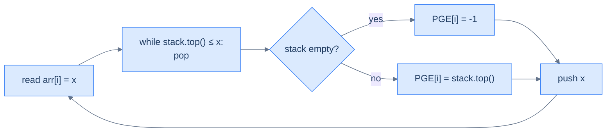

# Understanding the previous closest occurrence pattern

For each index `i`, find the *closest preceding* index `j < i` whose value beats `arr[i]` on some test — strictly greater, strictly smaller, and so on. That single question powers a whole family of stack problems.

The shape recurs constantly: stock spans (how many earlier days had a lower price), histogram bars (the nearest taller bar to the left), temperature streaks. Each asks the same thing in different clothes — *who, just before me, was bigger (or smaller)?*

> 🖼 Diagram — Previous-greater-element (PGE) for an array — for every position, the most recent strictly-greater value to its left, or −1 if none exists. The brute force is O(N²); the monotonic-stack solution is O(N).
```d2
direction: right

arr: arr {
  grid-columns: 6
  grid-gap: 0
  i0: "3"
  i1: "5"
  i2: "1"
  i3: "6"
  i4: "8"
  i5: "7"
}

out: "previous greater (PGE)" {
  grid-columns: 6
  grid-gap: 0
  o0: "−1"
  o1: "−1"
  o2: "5" {style.fill: "#fef9c3"; style.stroke: "#f59e0b"}
  o3: "−1"
  o4: "−1"
  o5: "8"
}

note: "e.g. arr[2]=1: closest earlier value > 1 is 5" {shape: text}
note -> out.o2: "" {style.stroke-dash: 3}

arr -> out
```

<p align="center"><strong>Previous-greater-element (PGE) for an array — for every position, the most recent strictly-greater value to its left, or −1 if none exists. The brute force is O(N²); the monotonic-stack solution is O(N).</strong></p>

## Why Naive Isn't Enough

The obvious move is a backward scan: for each index `i`, walk left until you hit a value that wins the comparison. It returns the right answer, but it pays for it.

The cost is the problem, not the correctness. Each backward scan can touch up to `i` earlier elements, so the total work is `1 + 2 + … + (N−1)`, which is `O(N²)` time. The space is `O(1)` beyond the result, but the quadratic clock dominates the moment the input grows.

The waste is structural. To make this concrete: on the strictly increasing array `[1, 2, 3, 4, 5]`, every element's backward scan runs all the way to the front and finds nothing. The algorithm does maximal work to produce all `-1`s, re-examining the same dead elements again and again, with no memory of what earlier scans already ruled out.

So the key idea is: an element that some later, larger value has already "passed" can never be a previous-greater answer again, and the naive scan keeps re-inspecting those losers instead of discarding them.

## The Core Idea

The fix is to remember candidates on a stack and throw away the ones a new element disqualifies. Walk the array once, left to right, keeping a stack of values that are still *eligible* to be a future element's answer.

A value stays eligible only while nothing has come along to block the view. When a new element dominates a value on the stack — greater or smaller, depending on the variant — that value is hidden from everything to its right and can be popped for good. What remains on top is exactly the nearest surviving candidate. So the core insight is: the stack holds an *un-disqualified chain* of previous candidates, and the answer for each element is whatever survives on top after the disqualified ones are popped.

## The previous closest occurrence technique

Walk the array left to right. Maintain a **monotonic decreasing stack** of values seen so far (top = smallest, bottom = largest). For each new element `x`:

1. **Pop** every value `≤ x` from the top of the stack. These values can never again be a "previous greater" for any future element — `x` itself is between them and any future query, and `x ≥ them`.
2. **The new top** (if any) is `x`'s **previous greater** — the closest earlier value that's still strictly greater. If the stack is empty, no such value exists; record `-1`.
3. **Push `x`** so it's a candidate for elements to come.

> 🖼 Diagram — Monotonic-stack core loop — pop everything that's been "dominated" by the current element, then the new top is the answer. Each value enters the stack at most once and leaves at most once → total work is O(N).


<p align="center"><strong>Monotonic-stack core loop — pop everything that's been "dominated" by the current element, then the new top is the answer. Each value enters the stack at most once and leaves at most once → total work is O(N).</strong></p>

## How the Stack Moves

Each element triggers one rhythm — pop the losers, read the survivor, push yourself. The stack never reverses; it only shrinks (during a pop run) and grows (the final push) per element.

The stack stays **monotonic** by construction, and that is the invariant every iteration preserves. For previous-greater, the values run strictly decreasing from bottom to top:

- **The bottom** is the largest live candidate — nothing seen so far has beaten it.
- **The top** is the smallest live candidate — the most recent value not yet dominated.
- **A pop run** clears every top value that the new element `x` matches or exceeds, restoring the decreasing order once `x` is pushed.

To make this concrete: on `[3, 5, 1, 6, 8, 7]`, after processing `8` the stack holds only `[8]` — `8` dominated everything before it. When `7` arrives, nothing pops (`8 > 7`), so `7`'s previous-greater is the top `8`, and `7` is pushed to leave `[8, 7]`, still decreasing. The core insight is: because the stack is always monotonic, the very top is always the nearest survivor, so a single peek answers each query.

## Why is this O(N)?

The operations look unbounded — there's a `while` loop nested inside the `for` loop — but the **amortised analysis** says otherwise. Across the entire run, every array element is **pushed exactly once** and **popped at most once**. Total stack operations: at most 2N. The outer loop runs N times. Total work: O(N).

This is one of the most beautiful amortised arguments in algorithms — a nested `while` masquerading as O(N²) but actually O(N) when you count operations across the whole input rather than per iteration.

## The Generic Algorithm

> **Algorithm — previous greater element (PGE)**
>
> -   **Step 1:** Initialise an empty stack and a result array `pge[0..n-1]` filled with `-1`.
> -   **Step 2:** For `i` from 0 to n−1:
>     -   While the stack is non-empty and `stack.top() <= arr[i]`: pop.
>     -   If the stack is non-empty: `pge[i] = stack.top()`.
>     -   Push `arr[i]`.
> -   **Step 3:** Return `pge`.

For **previous smaller element (PSE)**, swap the comparison: pop while `stack.top() >= arr[i]`.

## Implementation — generic PGE walker

The walker below works on an array of **unique** values, so the strict `<` pop test and the `≤` test in the algorithm above behave identically — no equal value ever sits on the stack. Each problem in this lesson specialises this skeleton; only the comparison and any index bookkeeping change.

```python run viz=array viz-root=stack viz-kind=stack
from typing import List

def previous_greater_occurrence(arr: List[int]) -> List[int]:
    """
    Find the previous greater occurrence for each element in the array.

    :param arr: A list of integers.
    :return: A list of integers where each element represents the previous greater element
             in the input array, or -1 if no such element exists.
    """
    # List to store the previous greater elements for arr
    previous_greater: List[int] = [-1] * len(arr)

    # Stack to hold the chain of previous greater items
    stack: List[int] = []

    # Iterate over the array
    for i in range(len(arr)):
        # Keep popping elements from the stack
        # until we find an item greater than the current item
        while stack and stack[-1] < arr[i]:
            stack.pop()

        # If the stack is not empty, the top item is the previous greater item
        if stack:
            previous_greater[i] = stack[-1]

        # Push the current element onto the stack
        stack.append(arr[i])

    return previous_greater
```

```java run viz=array viz-root=stack viz-kind=stack
class Solution {
    public List<Integer> previousGreaterOccurrence(List<Integer> arr) {

        // Array to store the previous greater elements for arr
        List<Integer> previousGreater = new ArrayList<>();
        for (int i = 0; i < arr.size(); i++) {
            previousGreater.add(-1);
        }

        // Stack to hold the chain of previous greater items
        Stack<Integer> stack = new Stack<>();

        // Iterate over the array
        for (int i = 0; i < arr.size(); i++) {
            // Keep popping elements from the stack
            // until we find an item greater than the current item
            while (!stack.isEmpty() && stack.peek() < arr.get(i)) {
                stack.pop();
            }

            // If the stack is not empty, the top item is the previous greater item
            if (!stack.isEmpty()) {
                previousGreater.set(i, stack.peek());
            }

            // Push the current element onto the stack
            stack.push(arr.get(i));
        }

        return previousGreater;
    }
}
```


## Complexity Analysis

> **All cases** — Time: **O(N)** amortised | Space: **O(N)** for the stack and result.

## Variants / Taxonomy

The family splits along two independent axes — *which direction* the comparison points and *what the array does at its ends*:

- **Previous greater (decreasing stack).** Pop while the top `≤` the current value; the survivor is the nearest strictly-greater predecessor.
- **Previous smaller (increasing stack).** Pop while the top `≥` the current value; the survivor is the nearest strictly-smaller predecessor.
- **Linear array.** One left-to-right pass over `n` indices; an element with no qualifying predecessor records `-1`.
- **Circular array.** Iterate `2n` indices with `i % n` indexing so a value's predecessor may wrap past the start; still `O(N)` time, `O(N)` space.

Each variant runs the same pop-peek-push skeleton. The greater/smaller axis only flips the comparison operator; the linear/circular axis only changes the loop bound and the index arithmetic. The decreasing-stack greater case is the workhorse the other three specialise.

# Identifying the previous closest occurrence pattern

The pattern fits whenever the answer for each position depends on **the closest earlier position satisfying some monotone condition** (greater than, smaller than, equal to, …). The decision rule for the stack:

- Looking for **previous greater**? Maintain a **decreasing** stack; pop while top `≤` current.
- Looking for **previous smaller**? Maintain an **increasing** stack; pop while top `≥` current.

**Template:**
> Walk the array; maintain a monotonic stack of un-disqualified candidates; for each new element, pop the dominated ones; the new top is the answer.

## Recognition Checklist

Four questions confirm a problem fits the previous-closest pattern. If every answer is "yes," the monotonic-stack skeleton applies as-is.

1. **Does each position need an answer drawn from the elements *before* it?** The query for index `i` ranges only over `j < i` — never the whole array, never the suffix.
2. **Is the answer the *closest* such element, not all of them?** You want the single nearest predecessor that wins the comparison, not a count or a list.
3. **Is the comparison monotone — strictly greater or strictly smaller?** A consistent `>` or `<` test is what lets a dominated value be discarded forever.
4. **Is the per-element work `O(1)` amortised?** Each element is pushed once and popped at most once, so the pop run is constant-time when averaged across the pass.

These four questions reappear as the **Diagnostic Questions** table in every problem write-up that follows.

## Canonical Example

Walk a full problem end-to-end to see the pattern click into place.

### Problem Statement

> **Problem:** Given two arrays `arr1` and `arr2`, where `arr2` is a subset of `arr1` and all values are unique, return for each value in `arr2` its previous greater element in `arr1` — the nearest strictly-greater value to its left. Use `-1` when none exists.

Take `arr1 = [3, 5, 1, 6, 8, 7]` and `arr2 = [3, 1, 8, 7]`. The expected answer is `[-1, 5, -1, 8]`.

### Brute Force

For each query value in `arr2`, scan `arr1` from the left, tracking the most recent value greater than the query, and stop at the query's own position. It works, but each query can scan the whole of `arr1`, so the cost is `O(N × M)` time — quadratic when `arr2` is as long as `arr1`. The space is `O(M)` for the result.

### Key Insight

Every query in `arr2` is asking for the previous-greater of a *specific index in `arr1`*. So compute the previous-greater for **all** of `arr1` in one monotonic-stack pass, then answer each query by lookup. The core insight is: solve the harder all-positions problem once in `O(N)`, and the per-query work collapses to a hash-map read.

### Optimized Solution

Three moving parts run in a single pass over `arr1`, then a second pass over `arr2`:

1. Run the previous-greater walker over `arr1`, filling a `previousGreater` array.
2. Record each value's index in a `value → index` map during the same pass.
3. For each query in `arr2`, look up its index and read `previousGreater[index]`.

This lands at `O(N + M)` time and `O(N)` space — the walker is `O(N)`, the lookups are `O(M)`.

### Trace

Walk `arr1 = [3, 5, 1, 6, 8, 7]` with a decreasing stack, popping while the top `≤` the current value:

```
i=0  x=3   pop none           stack empty → pge[0] = -1   push 3   stack=[3]
i=1  x=5   pop 3 (3≤5)        stack empty → pge[1] = -1   push 5   stack=[5]
i=2  x=1   pop none (5>1)     top=5       → pge[2] = 5    push 1   stack=[5,1]
i=3  x=6   pop 1, pop 5       stack empty → pge[3] = -1   push 6   stack=[6]
i=4  x=8   pop 6 (6≤8)        stack empty → pge[4] = -1   push 8   stack=[8]
i=5  x=7   pop none (8>7)     top=8       → pge[5] = 8    push 7   stack=[8,7]

previousGreater = [-1, -1, 5, -1, -1, 8]
queries arr2 = [3, 1, 8, 7] → indices [0, 2, 4, 5] → [-1, 5, -1, 8]
```

The result `[-1, 5, -1, 8]` matches the expected output.

### Fitting the Template

| Check | Answer for Preceding Superior Element |
|---|---|
| **Q1.** Does each position need an answer from elements *before* it? | **Yes** — the previous-greater of each `arr1` index ranges only over earlier indices. |
| **Q2.** Is the answer the *closest* such element, not all of them? | **Yes** — the nearest strictly-greater predecessor, a single value per index. |
| **Q3.** Is the comparison monotone — strictly greater or smaller? | **Yes** — a strict greater-than test drives every pop. |
| **Q4.** Is the per-element work `O(1)` amortised? | **Yes** — each value is pushed once, popped at most once; the index map read is `O(1)`. |

## Problems in This Category

The following four problems each specialise the monotonic-stack skeleton — the comparison flips for *inferior*, and the `-ii` variants add the circular doubled pass:

| # | Problem | Variant | Twist on the skeleton |
|---|---|---|---|
| 1 | [Preceding Superior Element](02-problems/01-preceding-superior-element) | Previous greater | Decreasing stack over `arr1`, answer queries via index map |
| 2 | [Preceding Inferior Element](02-problems/02-preceding-inferior-element) | Previous smaller | Flip to an increasing stack; pop while top `≥` current |
| 3 | [Preceding Superior Element II](02-problems/03-preceding-superior-element-ii) | Previous greater, circular | Iterate `2n` with `i % n` so the predecessor can wrap |
| 4 | [Preceding Inferior Element II](02-problems/04-preceding-inferior-element-ii) | Previous smaller, circular | Increasing stack plus the doubled-array pass |

Each is a small variation on the same skeleton — only the comparison and the loop bound change.
