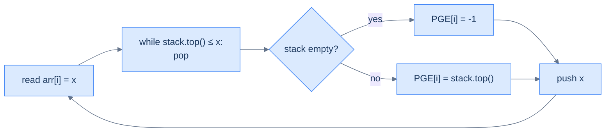

# Understanding the previous closest occurrence pattern

The pattern: for each index `i`, find the *closest preceding* index `j < i` whose value satisfies some predicate (`> arr[i]`, `< arr[i]`, etc.). The naive nested loop is O(N²). The monotonic-stack solution is O(N).

> 🖼 Diagram — Previous-greater-element (PGE) for an array — for every position, the most recent strictly-greater value to its left, or −1 if none exists. The brute force is O(N²); the monotonic-stack solution is O(N).
```d2
direction: right

arr: arr {
  grid-columns: 6
  grid-gap: 0
  i0: "3"
  i1: "5"
  i2: "1"
  i3: "6"
  i4: "8"
  i5: "7"
}

out: "previous greater (PGE)" {
  grid-columns: 6
  grid-gap: 0
  o0: "−1"
  o1: "−1"
  o2: "5" {style.fill: "#fef9c3"; style.stroke: "#f59e0b"}
  o3: "−1"
  o4: "−1"
  o5: "8"
}

note: "e.g. arr[2]=1: closest earlier value > 1 is 5" {shape: text}
note -> out.o2: "" {style.stroke-dash: 3}

arr -> out
```

<p align="center"><strong>Previous-greater-element (PGE) for an array — for every position, the most recent strictly-greater value to its left, or −1 if none exists. The brute force is O(N²); the monotonic-stack solution is O(N).</strong></p>

## The previous closest occurrence technique

Walk the array left to right. Maintain a **monotonic decreasing stack** of values seen so far (top = smallest, bottom = largest). For each new element `x`:

1. **Pop** every value `≤ x` from the top of the stack. These values can never again be a "previous greater" for any future element — `x` itself is between them and any future query, and `x ≥ them`.
2. **The new top** (if any) is `x`'s **previous greater** — the closest earlier value that's still strictly greater. If the stack is empty, no such value exists; record `-1`.
3. **Push `x`** so it's a candidate for elements to come.

> 🖼 Diagram — Monotonic-stack core loop — pop everything that's been "dominated" by the current element, then the new top is the answer. Each value enters the stack at most once and leaves at most once → total work is O(N).


<p align="center"><strong>Monotonic-stack core loop — pop everything that's been "dominated" by the current element, then the new top is the answer. Each value enters the stack at most once and leaves at most once → total work is O(N).</strong></p>

## Why is this O(N)?

The operations look unbounded — there's a `while` loop nested inside the `for` loop — but the **amortised analysis** says otherwise. Across the entire run, every array element is **pushed exactly once** and **popped at most once**. Total stack operations: at most 2N. The outer loop runs N times. Total work: O(N).

This is one of the most beautiful amortised arguments in algorithms — a nested `while` masquerading as O(N²) but actually O(N) when you count operations across the whole input rather than per iteration.

## Algorithm

> **Algorithm — previous greater element (PGE)**
>
> -   **Step 1:** Initialise an empty stack and a result array `pge[0..n-1]` filled with `-1`.
> -   **Step 2:** For `i` from 0 to n−1:
>     -   While the stack is non-empty and `stack.top() <= arr[i]`: pop.
>     -   If the stack is non-empty: `pge[i] = stack.top()`.
>     -   Push `arr[i]`.
> -   **Step 3:** Return `pge`.

For **previous smaller element (PSE)**, swap the comparison: pop while `stack.top() >= arr[i]`.

## Implementation — generic PGE walker


```python run
from typing import List

def previous_greater_occurrence(arr: List[int]) -> List[int]:
    """
    Find the previous greater occurrence for each element in the array.

    :param arr: A list of integers.
    :return: A list of integers where each element represents the previous greater element
             in the input array, or -1 if no such element exists.
    """
    # List to store the previous greater elements for arr
    previous_greater: List[int] = [-1] * len(arr)

    # Stack to hold the chain of previous greater items
    stack: List[int] = []

    # Iterate over the array
    for i in range(len(arr)):
        # Keep popping elements from the stack
        # until we find an item greater than the current item
        while stack and stack[-1] < arr[i]:
            stack.pop()

        # If the stack is not empty, the top item is the previous greater item
        if stack:
            previous_greater[i] = stack[-1]

        # Push the current element onto the stack
        stack.append(arr[i])

    return previous_greater
```

```java run
class Solution {
    public List<Integer> previousGreaterOccurrence(List<Integer> arr) {

        // Array to store the previous greater elements for arr
        List<Integer> previousGreater = new ArrayList<>();
        for (int i = 0; i < arr.size(); i++) {
            previousGreater.add(-1);
        }

        // Stack to hold the chain of previous greater items
        Stack<Integer> stack = new Stack<>();

        // Iterate over the array
        for (int i = 0; i < arr.size(); i++) {
            // Keep popping elements from the stack
            // until we find an item greater than the current item
            while (!stack.isEmpty() && stack.peek() < arr.get(i)) {
                stack.pop();
            }

            // If the stack is not empty, the top item is the previous greater item
            if (!stack.isEmpty()) {
                previousGreater.set(i, stack.peek());
            }

            // Push the current element onto the stack
            stack.push(arr.get(i));
        }

        return previousGreater;
    }
}
```


## Complexity Analysis

> **All cases** — Time: **O(N)** amortised | Space: **O(N)** for the stack and result.

# Identifying the previous closest occurrence pattern

The pattern fits whenever the answer for each position depends on **the closest earlier position satisfying some monotone condition** (greater than, smaller than, equal to, …). The decision rule for the stack:

- Looking for **previous greater**? Maintain a **decreasing** stack; pop while top `≤` current.
- Looking for **previous smaller**? Maintain an **increasing** stack; pop while top `≥` current.

**Template:**
> Walk the array; maintain a monotonic stack of un-disqualified candidates; for each new element, pop the dominated ones; the new top is the answer.

<!-- ============================================== -->
<!-- SWEEP 2 — missing sections (placeholders only) -->
<!-- ============================================== -->

<!-- TODO: Why Naive Isn't Enough — missing, needs to be written -->
<!--       Guidance: motivation for why the obvious approach fails -->

<!-- TODO: The Core Idea — missing, needs to be written -->
<!--       Guidance: one paragraph: the central trick -->

<!-- TODO: How the Pointers/Window Move — missing, needs to be written -->
<!--       Guidance: mechanics of the moving parts -->

<!-- TODO: The Generic Algorithm — missing, needs to be written -->
<!--       Guidance: numbered steps, no code -->

<!-- TODO: Generic Implementation — missing, needs to be written -->
<!--       Guidance: Python block + Java block of the skeleton -->

<!-- TODO: Variants / Taxonomy — missing, needs to be written -->
<!--       Guidance: enumerate sub-shapes of this pattern -->

<!-- TODO: Recognition Checklist — missing, needs to be written -->
<!--       Guidance: 4-question diagnostic — the source of the Problem-section Diagnostic Questions -->

<!-- TODO: Canonical Example — missing, needs to be written -->
<!--       Guidance: fully worked example: brute force → optimised → template fit -->

<!-- TODO: Problems in This Category — missing, needs to be written -->
<!--       Guidance: table with links to the 02-problems/ files -->
