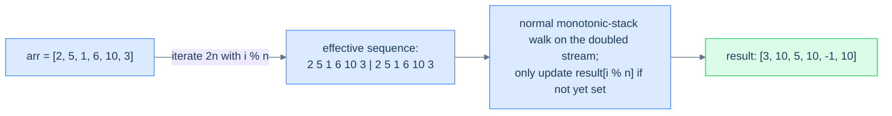

# Preceding superior element II

## Problem Statement

Same as preceding superior element, but the array is **circular** — when looking for a "preceding greater" you may wrap around past the start to the end of the array. If no greater exists even after a full circle, return `-1`.

### Example 1
> -   **Input:** `arr = [2, 5, 1, 6, 10, 3]`
> -   **Output:** `[3, 10, 5, 10, -1, 10]`

### Example 2
> -   **Input:** `arr = [6, 7, 8, 9, 8]`
> -   **Output:** `[8, 8, 9, -1, 9]`

<details>
<summary><h2>Approach — the doubled-array trick</h2></summary>


A circular array can be linearised by **iterating over `2n` indices**, mapping each index `i` to `i % n`. Each element gets two chances at finding its preceding greater — once on the "natural" pass and once with the wrap-around in play. Because every original element is processed twice, the time is still O(N).

> 🖼 Diagram — Doubled-array trick — iterate 2n times with i % n indexing. The first pass establishes most answers; the second pass catches values whose "previous greater" is on the other side of the wrap. Result is O(N) with O(N) extra space.


<p align="center"><strong>Doubled-array trick — iterate <code>2n</code> times with <code>i % n</code> indexing. The first pass establishes most answers; the second pass catches values whose "previous greater" is on the other side of the wrap. Result is O(N) with O(N) extra space.</strong></p>

</details>
<details>
<summary><h2>Solution</h2></summary>


```python run
from typing import List

class Solution:
    def preceding_superior_element_ii(self, arr: List[int]) -> List[int]:
        n = len(arr)
        result = [-1] * n

        # Stack to store elements
        stack = []

        # Iterate twice through the array (circularly)
        for i in range(2 * n):

            # Circular index
            index = i % n
            num = arr[index]

            # Check if we can pop elements from the stack
            # (i.e., find the preceding greater element)
            while stack and stack[-1] <= num:
                stack.pop()

            # If stack is not empty, the top element is the preceding
            # superior element
            if stack:
                result[index] = stack[-1]

            # Always push the element to the stack
            stack.append(num)

        return result


# Examples from the problem statement
print(Solution().preceding_superior_element_ii([2,5,1,6,10,3]))   # [3, 10, 5, 10, -1, 10]
print(Solution().preceding_superior_element_ii([6,7,8,9,8]))      # [8, 8, 9, -1, 9]

# Edge cases
print(Solution().preceding_superior_element_ii([1]))              # [-1] — single element
print(Solution().preceding_superior_element_ii([5,5,5]))          # [-1, -1, -1] — all same
print(Solution().preceding_superior_element_ii([1,2]))            # [2, -1]
print(Solution().preceding_superior_element_ii([3,1,2]))          # [3, 3, 3]
print(Solution().preceding_superior_element_ii([5,4,3,2,1]))      # [-1, 5, 4, 3, 2]
```

```java run
import java.util.*;

public class Main {
    static class Solution {
        public int[] precedingSuperiorElementII(int[] arr) {
            int n = arr.length;
            int[] result = new int[n];

            // Initialize result with -1
            for (int i = 0; i < n; i++) {
                result[i] = -1;
            }

            // Stack to store elements
            Stack<Integer> stack = new Stack<>();

            // Iterate twice through the array (circularly)
            for (int i = 0; i < 2 * n; i++) {

                // Circular index
                int index = i % n;
                int num = arr[index];

                // Check if we can pop elements from the stack
                // (i.e., find the preceding greater element)
                while (!stack.isEmpty() && stack.peek() <= num) {
                    stack.pop();
                }

                // If stack is not empty, the top element is the preceding
                // superior element
                if (!stack.isEmpty()) {
                    result[index] = stack.peek();
                }

                // Always push the element to the stack
                stack.push(num);
            }

            return result;
        }
    }

    public static void main(String[] args) {
        // Examples from the problem statement
        System.out.println(Arrays.toString(
            new Solution().precedingSuperiorElementII(new int[]{2,5,1,6,10,3})
        ));  // [3, 10, 5, 10, -1, 10]
        System.out.println(Arrays.toString(
            new Solution().precedingSuperiorElementII(new int[]{6,7,8,9,8})
        ));  // [8, 8, 9, -1, 9]

        // Edge cases
        System.out.println(Arrays.toString(
            new Solution().precedingSuperiorElementII(new int[]{1})
        ));  // [-1]
        System.out.println(Arrays.toString(
            new Solution().precedingSuperiorElementII(new int[]{5,5,5})
        ));  // [-1, -1, -1]
        System.out.println(Arrays.toString(
            new Solution().precedingSuperiorElementII(new int[]{1,2})
        ));  // [2, -1]
        System.out.println(Arrays.toString(
            new Solution().precedingSuperiorElementII(new int[]{3,1,2})
        ));  // [3, 3, 3]
        System.out.println(Arrays.toString(
            new Solution().precedingSuperiorElementII(new int[]{5,4,3,2,1})
        ));  // [-1, 5, 4, 3, 2]
    }
}
```

</details>

<!-- ============================================== -->
<!-- SWEEP 2 — missing sections (placeholders only) -->
<!-- ============================================== -->

<!-- TODO: Examples — missing, needs to be written -->
<!--       Guidance: min 3 examples: basic / variant / edge -->

<!-- TODO: Intuition — missing, needs to be written -->
<!--       Guidance: 3 paragraphs: brute force / observation / pattern fit -->

<!-- TODO: Applying the Diagnostic Questions — missing, needs to be written -->
<!--       Guidance: REQUIRED, never optional -->
<!--       Guidance: 4-row table. Columns: 'Check' | 'Answer for [Problem Name]' -->
<!--       Guidance: Rows: two positions simultaneously / one near start one near end / both move inward / simple O(1) work at each step -->

<!-- TODO: Approach — missing, needs to be written -->
<!--       Guidance: numbered steps, no code -->

<!-- TODO: Solution — missing, needs to be written -->
<!--       Guidance: Python block then Java block -->

<!-- TODO: Dry Run — missing, needs to be written -->
<!--       Guidance: walk through a small example step by step -->

<!-- TODO: Complexity Analysis — missing, needs to be written -->
<!--       Guidance: table: time / space / why -->

<!-- TODO: Edge Cases — missing, needs to be written -->
<!--       Guidance: table, min 5 rows -->

<!-- TODO: Key Takeaway — missing, needs to be written -->
<!--       Guidance: 1–2 sentences -->
