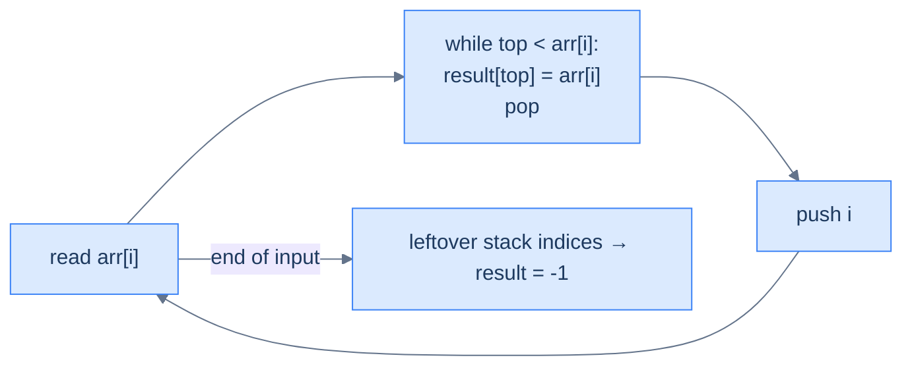
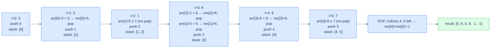

# Understanding the next closest occurrence pattern

Two equivalent algorithms.

## Approach 1 — right-to-left scan (mirror of previous-closest)

Walk the array from right to left, maintaining a monotonic decreasing stack. For each `arr[i]`:

1. Pop all stack values `≤ arr[i]`.
2. The new top (if any) is `arr[i]`'s **next greater**.
3. Push `arr[i]`.

This is *literally the previous-closest algorithm with the loop reversed*. Same proof of correctness, same O(N) cost.

## Approach 2 — left-to-right with retroactive resolution

Walk left to right with a monotonic decreasing stack of **indices**. For each `arr[i]`:

1. While the stack is non-empty and `arr[stack.top()] < arr[i]`: the current element `arr[i]` is the **next greater** for `arr[stack.top()]`. Record `result[stack.top()] = arr[i]` and pop.
2. Push `i`.

Anyone left on the stack at end-of-input has *no* next-greater — leave their answer as `-1`.

> 🖼 Diagram — Left-to-right next-greater — the current element resolves the answers of old elements as it climbs the stack. Each index is pushed once and popped at most once → O(N) total.


<p align="center"><strong>Left-to-right next-greater — the current element <em>resolves the answers</em> of old elements as it climbs the stack. Each index is pushed once and popped at most once → O(N) total.</strong></p>

This is the more idiomatic style. Most production monotonic-stack code uses left-to-right with retroactive resolution because it generalises better to "find the next position where some predicate flips" without having to first reverse the array.

## Walkthrough — `arr = [3, 5, 1, 6, 8, 7]` (left-to-right NGE)

> 🖼 Diagram — Left-to-right NGE on [3, 5, 1, 6, 8, 7] — when 5 arrives, it resolves index 0; when 6 arrives, it resolves indices 2 and 1; when 8 arrives, it resolves index 3. Indices 4 and 5 never get resolved → their NGE is -1.


<p align="center"><strong>Left-to-right NGE on <code>[3, 5, 1, 6, 8, 7]</code> — when 5 arrives, it resolves index 0; when 6 arrives, it resolves indices 2 and 1; when 8 arrives, it resolves index 3. Indices 4 and 5 never get resolved → their NGE is -1.</strong></p>

## Algorithm

> **Algorithm — next greater element (NGE), left-to-right with retroactive resolution**
>
> -   **Step 1:** Initialise an empty stack and `nge[0..n-1] = -1`.
> -   **Step 2:** For `i` from 0 to n−1:
>     -   While stack non-empty and `arr[stack.top()] < arr[i]`: `nge[stack.pop()] = arr[i]`.
>     -   Push `i`.
> -   **Step 3:** Return `nge`.

For **next smaller**, swap the comparison: `arr[stack.top()] > arr[i]`.

## Implementation — generic NGE walker


```python run
from typing import List

def next_greater_occurrence(arr: List[int]) -> List[int]:
    # List to store the next greater elements for arr
    next_greater: List[int] = [-1] * len(arr)

    # Stack to track indices of elements in decreasing order
    stack: List[int] = []

    # Iterate over the array
    for i, num in enumerate(arr):
        # While the stack is not empty and the current element is greater than
        # the element at the index stored at the top of the stack
        while stack and arr[stack[-1]] < num:
            # Set the next greater element for the index at the top of the stack
            prev_index = stack.pop()
            next_greater[prev_index] = num

        # Push the current index onto the stack
        stack.append(i)

    return next_greater
```

```java run
public class NextGreaterOccurrence {

    public List<Integer> nextGreaterOccurrence(List<Integer> arr) {

        // List to store the next greater elements for arr
        List<Integer> nextGreater = new ArrayList<>();
        for (int i = 0; i < arr.size(); i++) {
            nextGreater.add(-1);
        }

        // Stack to track indices of elements in decreasing order
        Stack<Integer> stack = new Stack<>();

        // Iterate over the array
        for (int i = 0; i < arr.size(); i++) {
            int num = arr.get(i);
            while (!stack.isEmpty() && arr.get(stack.peek()) < num) {
                // If the current item is greater than the value at the top of the stack,
                // store it in the nextGreater list using the index at the top of the stack
                int index = stack.pop();
                nextGreater.set(index, num);
            }
            // Push the current index onto the stack
            stack.push(i);
        }

        return nextGreater;
    }
}
```


## Complexity Analysis

> **All cases** — Time: **O(N)** | Space: **O(N)**.

# Identifying the next closest occurrence pattern

Anywhere the answer for each position depends on **the closest later position** satisfying a monotonic predicate, this pattern fits.

**Template:**
> Walk the array left-to-right; maintain a monotonic stack of indices; on each new element, pop from the stack any index whose value is "dominated" and record the current value as that index's answer. Indices left on the stack at end-of-input have no answer (record `-1` or sentinel).

<!-- ============================================== -->
<!-- SWEEP 2 — missing sections (placeholders only) -->
<!-- ============================================== -->

<!-- TODO: Why Naive Isn't Enough — missing, needs to be written -->
<!--       Guidance: motivation for why the obvious approach fails -->

<!-- TODO: The Core Idea — missing, needs to be written -->
<!--       Guidance: one paragraph: the central trick -->

<!-- TODO: How the Pointers/Window Move — missing, needs to be written -->
<!--       Guidance: mechanics of the moving parts -->

<!-- TODO: The Generic Algorithm — missing, needs to be written -->
<!--       Guidance: numbered steps, no code -->

<!-- TODO: Generic Implementation — missing, needs to be written -->
<!--       Guidance: Python block + Java block of the skeleton -->

<!-- TODO: Variants / Taxonomy — missing, needs to be written -->
<!--       Guidance: enumerate sub-shapes of this pattern -->

<!-- TODO: Recognition Checklist — missing, needs to be written -->
<!--       Guidance: 4-question diagnostic — the source of the Problem-section Diagnostic Questions -->

<!-- TODO: Canonical Example — missing, needs to be written -->
<!--       Guidance: fully worked example: brute force → optimised → template fit -->

<!-- TODO: Problems in This Category — missing, needs to be written -->
<!--       Guidance: table with links to the 02-problems/ files -->
