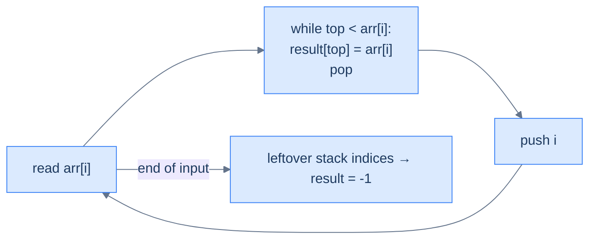
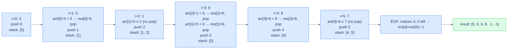

# Understanding the next closest occurrence pattern

For each index `i`, find the *closest following* index `j > i` whose value beats `arr[i]` on some test — strictly greater, strictly smaller, and so on. This is the exact mirror of the previous-closest pattern: same monotonic stack, same `O(N)` proof, with the answer living to each element's *right* instead of its *left*.

The shape recurs constantly: daily temperatures (how many days until a warmer one), stock spans looking forward, trapped rainwater between walls, the largest rectangle in a histogram. Each asks the same thing in different clothes — *who, just after me, is bigger (or smaller)?*

Two equivalent algorithms answer it, and both run in `O(N)` time and `O(N)` space:

- **Right-to-left scan.** Walk the array backwards and run the previous-closest algorithm unchanged — a value's previous-greater in reverse *is* its next-greater going forward.
- **Left-to-right with retroactive resolution.** Walk forwards with a stack of *indices*; when a new element dominates the indices below it, that new element is their answer, filled in retroactively.

## Why Naive Isn't Enough

The obvious move is a forward scan: for each index `i`, walk right until you hit a value that wins the comparison. It returns the right answer, but it pays for it.

The cost is the problem, not the correctness. Each forward scan can touch up to `N − i` later elements, so the total work is `(N−1) + (N−2) + … + 1`, which is `O(N²)` time. The space is `O(1)` beyond the result, but the quadratic clock dominates the moment the input grows.

The waste is structural. To make this concrete: on the strictly decreasing array `[5, 4, 3, 2, 1]`, every element's forward scan runs all the way to the end and finds nothing greater. The algorithm does maximal work to produce all `-1`s, re-examining the same dead elements again and again, with no memory of what earlier scans already ruled out.

So the key idea is: once a later, larger value resolves an element's answer, that element is finished, and the naive scan keeps re-inspecting settled elements instead of retiring them.

## The Core Idea

The fix is to hold *unresolved* elements on a stack and let each new element settle the ones it dominates. Walk the array once, keeping a stack of values (or indices) that are still *waiting* for a qualifying successor.

A value waits only until something larger appears to its right. When a new element dominates a value still on the stack — greater or smaller, depending on the variant — that new element is the value's nearest qualifying successor, so the value is resolved and popped. So the core insight is: the stack holds a *monotonic chain of still-unanswered elements*, and each arriving element resolves every stacked element it dominates before joining the chain itself.

## Approach 1 — right-to-left scan (mirror of previous-closest)

Walk the array from right to left, maintaining a monotonic decreasing stack. For each `arr[i]`:

1. Pop all stack values `≤ arr[i]`.
2. The new top (if any) is `arr[i]`'s **next greater**.
3. Push `arr[i]`.

This is *literally the previous-closest algorithm with the loop reversed*. Same proof of correctness, same O(N) cost.

## Approach 2 — left-to-right with retroactive resolution

Walk left to right with a monotonic decreasing stack of **indices**. For each `arr[i]`:

1. While the stack is non-empty and `arr[stack.top()] < arr[i]`: the current element `arr[i]` is the **next greater** for `arr[stack.top()]`. Record `result[stack.top()] = arr[i]` and pop.
2. Push `i`.

Anyone left on the stack at end-of-input has *no* next-greater — leave their answer as `-1`.

> 🖼 Diagram — Left-to-right next-greater — the current element resolves the answers of old elements as it climbs the stack. Each index is pushed once and popped at most once → O(N) total.


<p align="center"><strong>Left-to-right next-greater — the current element <em>resolves the answers</em> of old elements as it climbs the stack. Each index is pushed once and popped at most once → O(N) total.</strong></p>

This is the more idiomatic style. Most production monotonic-stack code uses left-to-right with retroactive resolution because it generalises better to "find the next position where some predicate flips" without having to first reverse the array.

## Walkthrough — `arr = [3, 5, 1, 6, 8, 7]` (left-to-right NGE)

> 🖼 Diagram — Left-to-right NGE on [3, 5, 1, 6, 8, 7] — when 5 arrives, it resolves index 0; when 6 arrives, it resolves indices 2 and 1; when 8 arrives, it resolves index 3. Indices 4 and 5 never get resolved → their NGE is -1.


<p align="center"><strong>Left-to-right NGE on <code>[3, 5, 1, 6, 8, 7]</code> — when 5 arrives, it resolves index 0; when 6 arrives, it resolves indices 2 and 1; when 8 arrives, it resolves index 3. Indices 4 and 5 never get resolved → their NGE is -1.</strong></p>

## How the Stack Moves

Each element triggers one rhythm — resolve everyone you dominate, then push yourself. The stack only shrinks (during a resolve run) and grows (the final push) per element; it never reverses.

The stack stays **monotonic** by construction, and that is the invariant every iteration preserves. For the left-to-right next-greater walk, the *values* behind the stacked indices run strictly decreasing from bottom to top:

- **The bottom** holds the oldest unresolved index — the value still waiting longest for a larger successor.
- **The top** holds the most recent unresolved index — the value most recently pushed without being dominated.
- **A resolve run** pops every top index whose value the new element exceeds, recording the new element as each one's answer, restoring the decreasing order once the new index is pushed.

To make this concrete: on `[3, 5, 1, 6, 8, 7]`, when `6` arrives the stack holds indices `[1, 2]` (values `5, 1`). Both `1` and `5` are smaller than `6`, so both pop and both record `6` as their next-greater. Index `3` is pushed, leaving the stack `[3]` (value `6`), still decreasing. The core insight is: because the stack is always monotonic, a new element resolves a *contiguous run* off the top and stops at the first value it cannot beat.

## Why is this O(N)?

The operations look unbounded — there's a `while` loop nested inside the `for` loop — but the **amortised analysis** says otherwise. Across the entire run, every index is **pushed exactly once** and **popped at most once**. Total stack operations: at most `2N`. The outer loop runs `N` times. Total work: `O(N)` time, `O(N)` space for the stack and result.

This is one of the most beautiful amortised arguments in algorithms — a nested `while` masquerading as `O(N²)` but actually `O(N)` when you count operations across the whole input rather than per iteration.

## Algorithm

> **Algorithm — next greater element (NGE), left-to-right with retroactive resolution**
>
> -   **Step 1:** Initialise an empty stack and `nge[0..n-1] = -1`.
> -   **Step 2:** For `i` from 0 to n−1:
>     -   While stack non-empty and `arr[stack.top()] < arr[i]`: `nge[stack.pop()] = arr[i]`.
>     -   Push `i`.
> -   **Step 3:** Return `nge`.

For **next smaller**, swap the comparison: `arr[stack.top()] > arr[i]`.

## Implementation — generic NGE walker


```python run viz=array viz-root=stack viz-kind=stack
from typing import List

def next_greater_occurrence(arr: List[int]) -> List[int]:
    # List to store the next greater elements for arr
    next_greater: List[int] = [-1] * len(arr)

    # Stack to track indices of elements in decreasing order
    stack: List[int] = []

    # Iterate over the array
    for i, num in enumerate(arr):
        # While the stack is not empty and the current element is greater than
        # the element at the index stored at the top of the stack
        while stack and arr[stack[-1]] < num:
            # Set the next greater element for the index at the top of the stack
            prev_index = stack.pop()
            next_greater[prev_index] = num

        # Push the current index onto the stack
        stack.append(i)

    return next_greater
```

```java run viz=array viz-root=stack viz-kind=stack
public class NextGreaterOccurrence {

    public List<Integer> nextGreaterOccurrence(List<Integer> arr) {

        // List to store the next greater elements for arr
        List<Integer> nextGreater = new ArrayList<>();
        for (int i = 0; i < arr.size(); i++) {
            nextGreater.add(-1);
        }

        // Stack to track indices of elements in decreasing order
        Stack<Integer> stack = new Stack<>();

        // Iterate over the array
        for (int i = 0; i < arr.size(); i++) {
            int num = arr.get(i);
            while (!stack.isEmpty() && arr.get(stack.peek()) < num) {
                // If the current item is greater than the value at the top of the stack,
                // store it in the nextGreater list using the index at the top of the stack
                int index = stack.pop();
                nextGreater.set(index, num);
            }
            // Push the current index onto the stack
            stack.push(i);
        }

        return nextGreater;
    }
}
```


## Complexity Analysis

> **All cases** — Time: **O(N)** | Space: **O(N)**.

## Variants / Taxonomy

The family splits along three independent axes — *which direction* the comparison points, *what the array does at its ends*, and *what the stacked answer aggregates*:

- **Next greater (decreasing stack).** Resolve while a stacked value `<` the current value; the new element is each popped index's nearest strictly-greater successor.
- **Next smaller (increasing stack).** Resolve while a stacked value `>` the current value; the new element is each popped index's nearest strictly-smaller successor.
- **Linear array.** One pass over `n` indices; an index never resolved keeps its `-1` sentinel.
- **Circular array.** Iterate `2n` indices with `i % n` indexing so a successor may wrap past the end; still `O(N)` time, `O(N)` space.
- **Area aggregation.** Trapping rain water and largest-rectangle store *indices* and, on each pop, compute a width `right − left − 1` and a strip area rather than recording a single value.

Each variant runs the same resolve-push skeleton over a monotonic stack. The greater/smaller axis flips the comparison operator; the linear/circular axis changes the loop bound and index arithmetic; the area axis changes what a pop *computes* but not when it fires. The decreasing-stack next-greater case is the workhorse the others specialise.

# Identifying the next closest occurrence pattern

Anywhere the answer for each position depends on **the closest later position** satisfying a monotonic predicate, this pattern fits.

**Template:**
> Walk the array left-to-right; maintain a monotonic stack of indices; on each new element, pop from the stack any index whose value is "dominated" and record the current value as that index's answer. Indices left on the stack at end-of-input have no answer (record `-1` or sentinel).

The decision rule for the stack:

- Looking for **next greater**? Maintain a **decreasing** stack; resolve while a stacked value `<` current.
- Looking for **next smaller**? Maintain an **increasing** stack; resolve while a stacked value `>` current.

## Recognition Checklist

Four questions confirm a problem fits the next-closest pattern. If every answer is "yes," the monotonic-stack skeleton applies as-is.

1. **Does each position need an answer drawn from the elements *after* it?** The query for index `i` ranges only over `j > i` — never the whole array, never the prefix.
2. **Is the answer the *closest* such element, not all of them?** You want the single nearest successor that wins the comparison, not a count or a list.
3. **Is the comparison monotone — strictly greater or strictly smaller?** A consistent `>` or `<` test is what lets a dominated index be resolved and discarded forever.
4. **Is the per-element work `O(1)` amortised?** Each index is pushed once and popped at most once, so the resolve run is constant-time when averaged across the pass.

These four questions reappear as the **Diagnostic Questions** table in every problem write-up that follows.

## Canonical Example

Walk a full problem end-to-end to see the pattern click into place.

### Problem Statement

> **Problem:** Given two arrays `arr1` and `arr2`, where `arr2` is a subset of `arr1` and all values are unique, return for each value in `arr2` its next greater element in `arr1` — the nearest strictly-greater value to its right. Use `-1` when none exists.

Take `arr1 = [3, 5, 1, 6, 8, 7]` and `arr2 = [3, 1, 8, 7]`. The expected answer is `[5, 6, -1, -1]`.

### Brute Force

For each query value in `arr2`, scan `arr1` rightward from the query's position, returning the first value greater than the query. It works, but each query can scan the whole of `arr1`, so the cost is `O(N × M)` time — quadratic when `arr2` is as long as `arr1`. The space is `O(M)` for the result.

### Key Insight

Every query in `arr2` is asking for the next-greater of a *specific index in `arr1`*. So compute the next-greater for **all** of `arr1` in one monotonic-stack pass, then answer each query by lookup. The core insight is: solve the harder all-positions problem once in `O(N)`, and the per-query work collapses to a hash-map read.

### Optimized Solution

Three moving parts run in a single pass over `arr1`, then a second pass over `arr2`:

1. Run the next-greater walker over `arr1`, filling a `nextGreater` array.
2. Record each value's index in a `value → index` map during the same pass.
3. For each query in `arr2`, look up its index and read `nextGreater[index]`.

This lands at `O(N + M)` time and `O(N)` space — the walker is `O(N)`, the lookups are `O(M)`.

### Trace

Walk `arr1 = [3, 5, 1, 6, 8, 7]` left-to-right with a decreasing stack of indices, resolving while a stacked value `<` the current value:

```
i=0  x=3   resolve none          push 0   stack=[0]              (values [3])
i=1  x=5   3<5 → nge[0]=5, pop 0  push 1   stack=[1]              (values [5])
i=2  x=1   5≥1 (no pop)           push 2   stack=[1,2]            (values [5,1])
i=3  x=6   1<6 → nge[2]=6, pop 2
           5<6 → nge[1]=6, pop 1  push 3   stack=[3]              (values [6])
i=4  x=8   6<8 → nge[3]=8, pop 3  push 4   stack=[4]              (values [8])
i=5  x=7   8≥7 (no pop)           push 5   stack=[4,5]            (values [8,7])

EOF: indices 4, 5 unresolved → nge[4] = nge[5] = -1
nextGreater = [5, 6, 6, 8, -1, -1]
queries arr2 = [3, 1, 8, 7] → indices [0, 2, 4, 5] → [5, 6, -1, -1]
```

The result `[5, 6, -1, -1]` matches the expected output.

### Fitting the Template

| Check | Answer for Succeeding Superior Element |
|---|---|
| **Q1.** Does each position need an answer from elements *after* it? | **Yes** — the next-greater of each `arr1` index ranges only over later indices. |
| **Q2.** Is the answer the *closest* such element, not all of them? | **Yes** — the nearest strictly-greater successor, a single value per index. |
| **Q3.** Is the comparison monotone — strictly greater or smaller? | **Yes** — a strict greater-than test drives every resolve-and-pop. |
| **Q4.** Is the per-element work `O(1)` amortised? | **Yes** — each index is pushed once, popped at most once; the index map read is `O(1)`. |

## Problems in This Category

The following seven problems each specialise the monotonic-stack skeleton — the comparison flips for *inferior*, the `-ii` variants add the circular doubled pass, and the last two aggregate area instead of recording a single value:

| # | Problem | Variant | Twist on the skeleton |
|---|---|---|---|
| 1 | [Succeeding Superior Element](02-problems/01-succeeding-superior-element) | Next greater | Reverse scan over `arr1`, answer queries via index map |
| 2 | [Succeeding Inferior Element](02-problems/02-succeeding-inferior-element) | Next smaller | Flip to an increasing stack; resolve while a stacked value `>` current |
| 3 | [Succeeding Superior Element II](02-problems/03-succeeding-superior-element-ii) | Next greater, circular | Iterate `2n` with `i % n` so the successor can wrap |
| 4 | [Succeeding Inferior Element II](02-problems/04-succeeding-inferior-element-ii) | Next smaller, circular | Increasing stack plus the doubled-array pass |
| 5 | [Succeeding Superior Nodes](02-problems/05-succeeding-superior-nodes) | Next greater, linked list | Stack stores `(index, value)`; walk a list with a pointer |
| 6 | [Retained Rainwater](02-problems/06-retained-rainwater) | Area between walls | Pop a valley; the new top is the left wall, current bar the right wall |
| 7 | [Largest Rectangle Area](02-problems/07-largest-rectangle-area) | Histogram area | Pop on next-smaller; width spans previous-shorter to next-shorter |

Each is a variation on the same skeleton — the comparison, the loop bound, and what a pop computes are the only moving parts.
