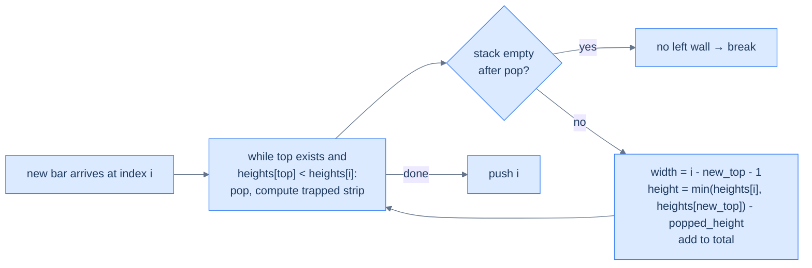

# Retained rainwater

## Problem Statement

Given an array `heights` of non-negative integers representing an elevation map (each bar has width 1), compute how much water can be trapped after rain.

### Example
> -   **Input:** `heights = [0, 2, 4, 3, 0, 3, 5, 2, 0, 4, 3, 0, 2]`
> -   **Output:** `14`

<details>
<summary><h2>Approach</h2></summary>


The water trapped above each "valley" is bounded by the heights of the **left and right walls**. The monotonic-stack approach: maintain a *decreasing* stack of bar indices. When a new taller bar arrives, it forms a *right wall* for everything popped off the stack; the *new top of the stack* (after popping) is the *left wall*. The trapped water on top of the popped bar is `(min(left, right) − popped_height) × (right_index − left_index − 1)`.

> 🖼 Diagram — Trapping rain water — pop the "valley" bar, the new top is the left wall, the current bar is the right wall, and the area trapped on top is one strip. Sum the strips.


<p align="center"><strong>Trapping rain water — pop the "valley" bar, the new top is the left wall, the current bar is the right wall, and the area trapped on top is one strip. Sum the strips.</strong></p>

</details>
<details>
<summary><h2>Solution</h2></summary>


```python run
from typing import List

class Solution:
    def retained_rainwater(self, heights: List[int]) -> int:
        n = len(heights)
        stack = []
        water_trapped = 0

        for i in range(n):

            # While the stack is not empty and the current height is
            # greater than the height of the bar at the top of the stack
            while stack and heights[i] > heights[stack[-1]]:
                top = stack.pop()

                # No left boundary for trapping water
                if not stack:
                    break

                # Calculate the width of the trapped water
                width = i - stack[-1] - 1

                # Calculate the height of the trapped water
                # (min of left and right boundary minus the current
                # height)
                height = (
                    min(heights[i], heights[stack[-1]]) - heights[top]
                )
                water_trapped += width * height

            # Push the current bar index to the stack
            stack.append(i)

        return water_trapped


# Example from the problem statement
print(Solution().retained_rainwater([0, 2, 4, 3, 0, 3, 5, 2, 0, 4, 3, 0, 2]))  # 14

# Edge cases
print(Solution().retained_rainwater([]))                     # 0
print(Solution().retained_rainwater([5]))                    # 0
print(Solution().retained_rainwater([1, 2]))                 # 0
print(Solution().retained_rainwater([0, 1, 0]))              # 0 — single valley traps nothing (width 0)
print(Solution().retained_rainwater([3, 0, 3]))              # 3
print(Solution().retained_rainwater([3, 0, 2]))              # 2
print(Solution().retained_rainwater([1, 2, 3, 4, 5]))        # 0 — monotonically increasing
print(Solution().retained_rainwater([5, 4, 3, 2, 1]))        # 0 — monotonically decreasing
```

```java run
import java.util.*;

public class Main {
    static class Solution {
        public int retainedRainwater(int[] heights) {
            int n = heights.length;
            Stack<Integer> stack = new Stack<>();
            int waterTrapped = 0;

            for (int i = 0; i < n; ++i) {

                // While the stack is not empty and the current height is
                // greater than the height of the bar at the top of the stack
                while (
                    !stack.isEmpty() && heights[i] > heights[stack.peek()]
                ) {
                    int top = stack.pop();

                    // No left boundary for trapping water
                    if (stack.isEmpty()) {
                        break;
                    }

                    // Calculate the width of the trapped water
                    int width = i - stack.peek() - 1;

                    // Calculate the height of the trapped water
                    // (min of left and right boundary minus the current
                    // height)
                    int height =
                        Math.min(heights[i], heights[stack.peek()]) -
                        heights[top];
                    waterTrapped += width * height;
                }

                // Push the current bar index to the stack
                stack.push(i);
            }

            return waterTrapped;
        }
    }

    public static void main(String[] args) {
        // Example from the problem statement
        System.out.println(new Solution().retainedRainwater(new int[]{0, 2, 4, 3, 0, 3, 5, 2, 0, 4, 3, 0, 2}));  // 14

        // Edge cases
        System.out.println(new Solution().retainedRainwater(new int[]{}));                    // 0
        System.out.println(new Solution().retainedRainwater(new int[]{5}));                   // 0
        System.out.println(new Solution().retainedRainwater(new int[]{1, 2}));                // 0
        System.out.println(new Solution().retainedRainwater(new int[]{0, 1, 0}));             // 0
        System.out.println(new Solution().retainedRainwater(new int[]{3, 0, 3}));             // 3
        System.out.println(new Solution().retainedRainwater(new int[]{3, 0, 2}));             // 2
        System.out.println(new Solution().retainedRainwater(new int[]{1, 2, 3, 4, 5}));       // 0
        System.out.println(new Solution().retainedRainwater(new int[]{5, 4, 3, 2, 1}));       // 0
    }
}
```

</details>

<!-- ============================================== -->
<!-- SWEEP 2 — missing sections (placeholders only) -->
<!-- ============================================== -->

<!-- TODO: Examples — missing, needs to be written -->
<!--       Guidance: min 3 examples: basic / variant / edge -->

<!-- TODO: Intuition — missing, needs to be written -->
<!--       Guidance: 3 paragraphs: brute force / observation / pattern fit -->

<!-- TODO: Applying the Diagnostic Questions — missing, needs to be written -->
<!--       Guidance: REQUIRED, never optional -->
<!--       Guidance: 4-row table. Columns: 'Check' | 'Answer for [Problem Name]' -->
<!--       Guidance: Rows: two positions simultaneously / one near start one near end / both move inward / simple O(1) work at each step -->

<!-- TODO: Approach — missing, needs to be written -->
<!--       Guidance: numbered steps, no code -->

<!-- TODO: Solution — missing, needs to be written -->
<!--       Guidance: Python block then Java block -->

<!-- TODO: Dry Run — missing, needs to be written -->
<!--       Guidance: walk through a small example step by step -->

<!-- TODO: Complexity Analysis — missing, needs to be written -->
<!--       Guidance: table: time / space / why -->

<!-- TODO: Edge Cases — missing, needs to be written -->
<!--       Guidance: table, min 5 rows -->

<!-- TODO: Key Takeaway — missing, needs to be written -->
<!--       Guidance: 1–2 sentences -->
