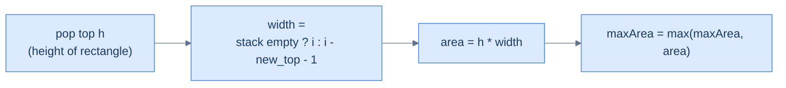

# Largest rectangle area

## Problem Statement

Given an array `histogram` of positive integers (heights of bars of unit width), return the area of the largest rectangle that can be formed.

### Example
> -   **Input:** `histogram = [2, 4, 3, 3, 5, 2, 4, 3, 2]` → **Output:** `18`

<details>
<summary><h2>Approach</h2></summary>


For each bar, the largest rectangle whose *height equals this bar's height* extends from one past the **previous shorter bar** to one before the **next shorter bar**. Using a monotonic *increasing* stack of indices:

- When a new bar arrives that's shorter than the top, the top bar's "right boundary" is the new bar.
- Pop the top, look at the new top — that's the "left boundary".
- Width = `i − left − 1` (or `i` if the stack is empty after popping).
- Update the max area.

After the main loop, **flush** the stack as if a "0" bar appeared at index `n` — those bars extend all the way to the end.

> 🖼 Diagram — When the increasing-stack invariant is broken, every popped bar represents a rectangle whose height is the popped value and whose horizontal extent runs from one past the new top to one before the current bar. Each pop is one candidate rectangle; the global max wins.


<p align="center"><strong>When the increasing-stack invariant is broken, every popped bar represents a rectangle whose height is the popped value and whose horizontal extent runs from one past the new top to one before the current bar. Each pop is one candidate rectangle; the global max wins.</strong></p>

</details>
<details>
<summary><h2>Solution</h2></summary>


```python run
from typing import List

class Solution:
    def largest_rectangle_area(self, histogram: List[int]) -> int:
        n = len(histogram)

        # Stack to store indices of bars
        stack = []

        # To keep track of the maximum area
        max_area = 0

        # Iterate over all the bars in the histogram
        for i in range(n):

            # While the stack is not empty and the current height is
            # smaller than the height of the bar at the top of the stack
            while stack and histogram[i] < histogram[stack[-1]]:
                h = histogram[stack.pop()]

                # Calculate the width
                width = i if not stack else i - stack[-1] - 1

                # Update the maximum area
                max_area = max(max_area, h * width)

            # Push the current bar index to the stack
            stack.append(i)

        # After the loop, process any remaining bars in the stack
        while stack:
            h = histogram[stack.pop()]

            # Calculate the width
            width = n if not stack else n - stack[-1] - 1

            # Update the maximum area
            max_area = max(max_area, h * width)

        return max_area


# Example from the problem statement
print(Solution().largest_rectangle_area([2, 4, 3, 3, 5, 2, 4, 3, 2]))  # 18

# Edge cases
print(Solution().largest_rectangle_area([]))                            # 0
print(Solution().largest_rectangle_area([5]))                           # 5
print(Solution().largest_rectangle_area([2, 2]))                        # 4
print(Solution().largest_rectangle_area([1, 2, 3, 4, 5]))              # 9
print(Solution().largest_rectangle_area([5, 4, 3, 2, 1]))              # 9
print(Solution().largest_rectangle_area([3, 3, 3, 3]))                 # 12
print(Solution().largest_rectangle_area([1, 100, 1]))                  # 100
```

```java run
import java.util.*;

public class Main {
    static class Solution {
        public int largestRectangleArea(int[] histogram) {
            int n = histogram.length;

            // Stack to store indices of bars
            Stack<Integer> stack = new Stack<>();

            // To keep track of the maximum area
            int maxArea = 0;

            // Iterate over all the bars in the histogram
            for (int i = 0; i < n; ++i) {

                // While the stack is not empty and the current height is
                // smaller than the height of the bar at the top of the stack
                while (
                    !stack.isEmpty() &&
                    histogram[i] < histogram[stack.peek()]
                ) {
                    int h = histogram[stack.pop()];

                    // Calculate the width
                    int width = stack.isEmpty() ? i : i - stack.peek() - 1;

                    // Update the maximum area
                    maxArea = Math.max(maxArea, h * width);
                }

                // Push the current bar index to the stack
                stack.push(i);
            }

            // After the loop, process any remaining bars in the stack
            while (!stack.isEmpty()) {
                int h = histogram[stack.pop()];

                // Calculate the width
                int width = stack.isEmpty() ? n : n - stack.peek() - 1;

                // Update the maximum area
                maxArea = Math.max(maxArea, h * width);
            }

            return maxArea;
        }
    }

    public static void main(String[] args) {
        // Example from the problem statement
        System.out.println(new Solution().largestRectangleArea(new int[]{2, 4, 3, 3, 5, 2, 4, 3, 2}));  // 18

        // Edge cases
        System.out.println(new Solution().largestRectangleArea(new int[]{}));                           // 0
        System.out.println(new Solution().largestRectangleArea(new int[]{5}));                          // 5
        System.out.println(new Solution().largestRectangleArea(new int[]{2, 2}));                       // 4
        System.out.println(new Solution().largestRectangleArea(new int[]{1, 2, 3, 4, 5}));             // 9
        System.out.println(new Solution().largestRectangleArea(new int[]{5, 4, 3, 2, 1}));             // 9
        System.out.println(new Solution().largestRectangleArea(new int[]{3, 3, 3, 3}));                // 12
        System.out.println(new Solution().largestRectangleArea(new int[]{1, 100, 1}));                 // 100
    }
}
```

</details>
<details>
<summary><h2>Final Takeaway</h2></summary>


Three lessons:

1. **Left-to-right with retroactive resolution is the idiomatic style.** When a new element arrives and dominates indices on the stack, *those* indices' answers are *the new element*. The algorithm fills in the answer table as it goes; anything left on the stack at end-of-input has no answer.
2. **Indices, not values, on the stack.** Storing indices lets you compute widths (rainwater, histogram), look up arbitrary fields of the original record, and resolve answers retroactively.
3. **The same monotonic-stack skeleton powers a vast family of problems.** Next-greater, next-smaller, daily temperatures, stock span, trapping rain water, histogram rectangles, sum-of-subarray-minimums, score-of-parentheses — all variations on "pop while dominated, resolve answers, push current index". Recognise the family and the implementation almost writes itself.

> *Coming up — **sequence validation**. The next pattern uses a stack as a "matching memory" — push opening symbols, pop on closing ones, and check that everything pairs up. The canonical applications are bracket matching, palindrome checking, and a few delightful permutation-validation puzzles.*

</details>

<!-- ============================================== -->
<!-- SWEEP 2 — missing sections (placeholders only) -->
<!-- ============================================== -->

<!-- TODO: Examples — missing, needs to be written -->
<!--       Guidance: min 3 examples: basic / variant / edge -->

<!-- TODO: Intuition — missing, needs to be written -->
<!--       Guidance: 3 paragraphs: brute force / observation / pattern fit -->

<!-- TODO: Applying the Diagnostic Questions — missing, needs to be written -->
<!--       Guidance: REQUIRED, never optional -->
<!--       Guidance: 4-row table. Columns: 'Check' | 'Answer for [Problem Name]' -->
<!--       Guidance: Rows: two positions simultaneously / one near start one near end / both move inward / simple O(1) work at each step -->

<!-- TODO: Approach — missing, needs to be written -->
<!--       Guidance: numbered steps, no code -->

<!-- TODO: Solution — missing, needs to be written -->
<!--       Guidance: Python block then Java block -->

<!-- TODO: Dry Run — missing, needs to be written -->
<!--       Guidance: walk through a small example step by step -->

<!-- TODO: Complexity Analysis — missing, needs to be written -->
<!--       Guidance: table: time / space / why -->

<!-- TODO: Edge Cases — missing, needs to be written -->
<!--       Guidance: table, min 5 rows -->

<!-- TODO: Key Takeaway — missing, needs to be written -->
<!--       Guidance: 1–2 sentences -->
