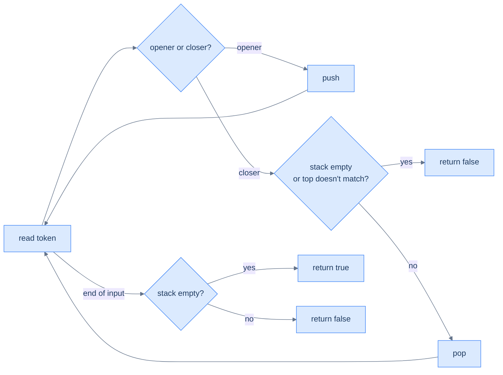
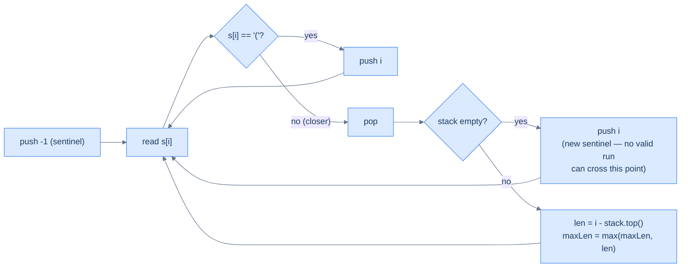

# 10. Pattern: Sequence Validation

## The Hook

`((1 + 2) * (3 - 4))` is balanced. `(1 + 2))` isn't. `[(1 + 2}]` isn't either. The difference between "valid" and "invalid" comes down to whether every opening bracket finds its *matching* closing bracket, in the *right order*. The matching rule looks subtle until you realise it's exactly the LIFO contract: when you finally close a bracket, the one you must close is the *most recent unmatched opener*. Last in, first out — the stack is born for this.

This is the **sequence validation** pattern. Push every "opener" you see; on every "closer", pop and check the match. At end-of-input, the stack should be empty (everything matched). It's the algorithm every IDE uses to highlight unmatched brackets, every JSON parser uses to reject malformed input, and every compiler uses to make sure your `if`s have their `}`s in the right places.

This lesson covers four problems on the spectrum from "is this balanced?" to "what's the longest balanced run?", with insertions/deletions and redundancy detection in between.

---

## Table of contents

1. [Understanding the sequence validation pattern](#understanding-the-sequence-validation-pattern)
2. [Identify the sequence validation pattern](#identify-the-sequence-validation-pattern)
3. [Parentheses checker](#parentheses-checker)
4. [Minimum edits](#minimum-edits)
5. [Redundant parentheses](#redundant-parentheses)
6. [Balanced span](#balanced-span)

***

# Understanding the sequence validation pattern

Two classes of token: **openers** (`(`, `[`, `{`) and **closers** (`)`, `]`, `}`). The rules:

1. **Every closer must match the most recent unmatched opener.**
2. **At the end, no openers may be left unmatched.**

The stack enforces both rules in O(N).



<p align="center"><strong>Sequence validation — push openers, pop-and-match on closers, demand empty stack at the end. Two failure modes: a closer with no matching opener, or leftover openers at end-of-input.</strong></p>

## Algorithm

> -   **Step 1:** Initialise an empty stack.
> -   **Step 2:** For each character:
>     -   Opener → push.
>     -   Closer → if stack empty or top doesn't match this closer, return `false`. Otherwise pop.
> -   **Step 3:** Return `stack.empty()`.

***

# Identify the sequence validation pattern

Anywhere the input has *paired delimiters with order constraints*, this pattern fits. Bracket matching is the canonical example, but the same machinery validates HTML/XML tag nesting, balanced binary tree pre-order traversals, valid JSON, and strings of valid push/pop sequences.

**Template:**
> Iterate the input; push openers; on closers, verify the top matches and pop; at end-of-input require an empty stack.

***

# Parentheses checker

## Problem Statement

Given a string `s` containing only `(`, `)`, `[`, `]`, `{`, `}`, return `true` iff every bracket is matched and closed in the right order.

### Example 1
> -   **Input:** `s = "()"` → **Output:** `true`

### Example 2
> -   **Input:** `s = "(({}))[]"` → **Output:** `true`

### Example 3
> -   **Input:** `s = "({{)[]"` → **Output:** `false`

<details>
<summary><h2>Solution</h2></summary>


```python run
from typing import List

class Solution:
    def is_matching_pair(self, opening: str, closing: str) -> bool:
        return (
            (opening == "(" and closing == ")")
            or (opening == "{" and closing == "}")
            or (opening == "[" and closing == "]")
        )

    def parentheses_checker(self, s: str) -> bool:

        # Create a stack to store the opening parentheses
        stack: List[str] = []

        # Iterate through each character in the string
        for ch in s:

            # If the character is an opening parenthesis, push it onto
            # the stack
            if ch == "(" or ch == "{" or ch == "[":

                # Push opening parentheses onto the stack
                stack.append(ch)

            # If the character is a closing parenthesis
            else:

                # If the stack is empty, the closing parenthesis does
                # not match the corresponding opening parenthesis
                # Return false as the string is invalid
                if not stack or not self.is_matching_pair(stack[-1], ch):
                    return False

                # Remove the corresponding opening parenthesis from the
                # stack
                stack.pop()

        # If the stack is empty at the end, the string is valid
        return not stack


# Examples from the problem statement
print(Solution().parentheses_checker("()"))          # True
print(Solution().parentheses_checker("(({}))[]{"))  # False — extra open
print(Solution().parentheses_checker("({{)[]{"))    # False

# Edge cases
print(Solution().parentheses_checker(""))            # True — empty string is valid
print(Solution().parentheses_checker("("))           # False — unmatched open
print(Solution().parentheses_checker(")"))           # False — unmatched close
print(Solution().parentheses_checker("([{}])"))      # True
print(Solution().parentheses_checker("([)]"))        # False — wrong order
print(Solution().parentheses_checker("{[()]}"))      # True
```

```java run
import java.util.*;

public class Main {
    static class Solution {
        private boolean isMatchingPair(char opening, char closing) {
            return (
                (opening == '(' && closing == ')') ||
                (opening == '{' && closing == '}') ||
                (opening == '[' && closing == ']')
            );
        }

        public boolean parenthesesChecker(String s) {

            // Create a stack to store the opening parentheses
            Stack<Character> stack = new Stack<>();

            // Iterate through each character in the string
            for (char ch : s.toCharArray()) {

                // If the character is an opening parenthesis, push it onto
                // the stack
                if (ch == '(' || ch == '{' || ch == '[') {

                    // Push opening parentheses onto the stack
                    stack.push(ch);
                }

                // If the character is a closing parenthesis
                else {

                    // If the stack is empty, the closing parenthesis does
                    // not match the corresponding opening parenthesis
                    // Return false as the string is invalid
                    if (
                        stack.isEmpty() || !isMatchingPair(stack.peek(), ch)
                    ) {
                        return false;
                    }

                    // Remove the corresponding opening parenthesis from the
                    // stack
                    stack.pop();
                }
            }

            // If the stack is empty at the end, the string is valid
            return stack.isEmpty();
        }
    }

    public static void main(String[] args) {
        // Examples from the problem statement
        System.out.println(new Solution().parenthesesChecker("()"));          // true
        System.out.println(new Solution().parenthesesChecker("(({}))[]{"));  // false
        System.out.println(new Solution().parenthesesChecker("({{)[]{"));    // false

        // Edge cases
        System.out.println(new Solution().parenthesesChecker(""));            // true
        System.out.println(new Solution().parenthesesChecker("("));           // false
        System.out.println(new Solution().parenthesesChecker(")"));           // false
        System.out.println(new Solution().parenthesesChecker("([{}])"));      // true
        System.out.println(new Solution().parenthesesChecker("([)]"));        // false
        System.out.println(new Solution().parenthesesChecker("{[()]}"));      // true
    }
}
```

</details>


***

# Minimum edits

## Problem Statement

Given a string `s` of `(` and `)` only, return the minimum number of insertions or deletions needed to make the sequence valid.

### Example 1
> -   **Input:** `s = "())"` → **Output:** `1`

### Example 2
> -   **Input:** `s = "))"` → **Output:** `2`

### Example 3
> -   **Input:** `s = "(((())))"` → **Output:** `0`

<details>
<summary><h2>Approach</h2></summary>


Walk the string with a stack of `(`s. For each `)`:

- If the stack has a `(`, **pop** (matched).
- If the stack is empty, this `)` is unmatched — **count it** as one edit (insert a `(` before it, or delete this `)` — same cost).

At end of input, the stack holds every unmatched `(`. Each one needs an edit (insert a `)` after it or delete it). **Total edits = unmatched `(` left on stack + unmatched `)` counted on the fly.**

</details>
<details>
<summary><h2>Solution</h2></summary>


```python run
from typing import List

class Solution:
    def minimum_edits(self, s: str) -> int:

        # Stack to track unmatched '('
        stack: List[str] = []

        # Count of edits needed
        edits: int = 0

        for c in s:

            # If '(', push to stack to find a match later
            if c == "(":
                stack.append(c)

            # Else if ')', try to match with a '('
            else:

                # Found a ')', check for matching '('
                if stack and stack[-1] == "(":

                    # Found a match, pop the '(' from stack
                    stack.pop()

                # No matching '(', need an edit
                else:

                    # Need to insert a '(' before this ')' or delete
                    # this ')' which counts as one edit
                    edits += 1

        # Any unmatched '(' in stack need to be closed with ')' edits
        # plus the edits we made for unmatched ')'
        return len(stack) + edits


# Examples from the problem statement
print(Solution().minimum_edits("())"))       # 1
print(Solution().minimum_edits("))"))        # 2
print(Solution().minimum_edits("(((())))"))  # 0

# Edge cases
print(Solution().minimum_edits(""))          # 0 — empty string is already valid
print(Solution().minimum_edits("("))         # 1 — one unmatched open
print(Solution().minimum_edits(")"))         # 1 — one unmatched close
print(Solution().minimum_edits("()"))        # 0
print(Solution().minimum_edits("(("))        # 2
print(Solution().minimum_edits(")()("))      # 2
```

```java run
import java.util.*;

public class Main {
    static class Solution {
        public int minimumEdits(String s) {

            // Stack to track unmatched '('
            Stack<Character> stack = new Stack<>();

            // Count of edits needed
            int edits = 0;

            for (char c : s.toCharArray()) {

                // If '(', push to stack to find a match later
                if (c == '(') {
                    stack.push(c);
                }

                // Else if ')', try to match with a '('
                else {

                    // Found a ')', check for matching '('
                    if (!stack.isEmpty() && stack.peek() == '(') {

                        // Found a match, pop the '(' from stack
                        stack.pop();
                    }

                    // No matching '(', need an edit
                    else {

                        // Need to insert a '(' before this ')' or delete
                        // this ')' which counts as one edit
                        edits++;
                    }
                }
            }

            // Any unmatched '(' in stack need to be closed with ')' edits
            // plus the edits we made for unmatched ')'
            return stack.size() + edits;
        }
    }

    public static void main(String[] args) {
        // Examples from the problem statement
        System.out.println(new Solution().minimumEdits("())"));       // 1
        System.out.println(new Solution().minimumEdits("))"));        // 2
        System.out.println(new Solution().minimumEdits("(((())))"));  // 0

        // Edge cases
        System.out.println(new Solution().minimumEdits(""));          // 0
        System.out.println(new Solution().minimumEdits("("));         // 1
        System.out.println(new Solution().minimumEdits(")"));         // 1
        System.out.println(new Solution().minimumEdits("()"));        // 0
        System.out.println(new Solution().minimumEdits("(("));        // 2
        System.out.println(new Solution().minimumEdits(")()("));      // 2
    }
}
```

</details>


***

# Redundant parentheses

## Problem Statement

Given a balanced expression `s` (containing operators, operands, and parentheses), return `true` if there exists a redundant pair of parentheses — a pair that wraps **either nothing or a single operand**, contributing no precedence value.

### Example 1
> -   **Input:** `s = "((2+3))+7"` → **Output:** `true` (the outer parens around `(2+3)` are redundant)

### Example 2
> -   **Input:** `s = "(2+3)"` → **Output:** `false` (single pair around an operation; not redundant)

### Example 3
> -   **Input:** `s = "((2+3)+7)"` → **Output:** `false`

<details>
<summary><h2>Approach</h2></summary>


Push every character except `)`. When you hit `)`, look at what was pushed *between* the most recent `(` and now. **If only operands and no operators are inside, the parens are redundant.** Equivalently: if the top of the stack is `(` *immediately* (i.e. zero operators between this `)` and its `(`), the pair is redundant.

But we should also detect `(((expr)))` — wrapping an already-parenthesised expression in *another* pair. To catch that, we should pop characters until we hit `(`. If the top *was* `(` immediately, redundant. Otherwise, check whether at least one operator was popped — if not, even though there were operands, no operator means redundant.

The simpler formulation that's used in the canonical solution: when `)` arrives, **if the top of the stack is `(`, redundant**. Otherwise pop until matching `(`, also pop the `(`. (This works because operators pushed between `(` and `)` keep the stack from being `(` directly.)

</details>
<details>
<summary><h2>Solution</h2></summary>


```python run
from typing import List

class Solution:
    def redundant_parentheses(self, s: str) -> bool:

        # Edge case for single pair of parentheses
        if s == "()":
            return False

        # Create a stack to store characters
        stack: List[str] = []

        # Iterate through each character in the string
        for ch in s:

            # If the character is a closing parenthesis
            if ch == ")":

                # If top of stack is an opening parenthesis, it's
                # redundant
                if stack and stack[-1] == "(":
                    return True

                # Pop elements until we find the corresponding '('
                while stack and stack[-1] != "(":
                    stack.pop()

                # Pop the '(' as well
                stack.pop()

            # If the character is not a closing parenthesis, push it
            # onto the stack
            else:
                stack.append(ch)

        # No redundant parentheses found
        return False


# Examples from the problem statement
print(Solution().redundant_parentheses("((2+3))+7"))   # True
print(Solution().redundant_parentheses("(2+3)"))       # False
print(Solution().redundant_parentheses("((2+3)+7)"))   # False

# Edge cases
print(Solution().redundant_parentheses("()"))          # False — edge case handled explicitly
print(Solution().redundant_parentheses("(())"))        # True — empty inner parens
print(Solution().redundant_parentheses("(a+b)"))       # False
print(Solution().redundant_parentheses("((a+b))"))     # True
print(Solution().redundant_parentheses("(a+(b+c))"))   # False
```

```java run
import java.util.*;

public class Main {
    static class Solution {
        public boolean redundantParentheses(String s) {

            // Edge case for single pair of parentheses
            if ("()".equals(s)) {
                return false;
            }

            // Create a stack to store characters
            Stack<Character> stack = new Stack<>();

            // Iterate through each character in the string
            for (char ch : s.toCharArray()) {

                // If the character is a closing parenthesis
                if (ch == ')') {

                    // If top of stack is an opening parenthesis, it's
                    // redundant
                    if (!stack.isEmpty() && stack.peek() == '(') {
                        return true;
                    }

                    // Pop elements until we find the corresponding '('
                    while (!stack.isEmpty() && stack.peek() != '(') {
                        stack.pop();
                    }

                    // Pop the '(' as well
                    stack.pop();
                }

                // If the character is not a closing parenthesis, push it
                // onto the stack
                else {
                    stack.push(ch);
                }
            }

            // No redundant parentheses found
            return false;
        }
    }

    public static void main(String[] args) {
        // Examples from the problem statement
        System.out.println(new Solution().redundantParentheses("((2+3))+7"));   // true
        System.out.println(new Solution().redundantParentheses("(2+3)"));       // false
        System.out.println(new Solution().redundantParentheses("((2+3)+7)"));   // false

        // Edge cases
        System.out.println(new Solution().redundantParentheses("()"));          // false
        System.out.println(new Solution().redundantParentheses("(())"));        // true
        System.out.println(new Solution().redundantParentheses("(a+b)"));       // false
        System.out.println(new Solution().redundantParentheses("((a+b))"));     // true
        System.out.println(new Solution().redundantParentheses("(a+(b+c))"));   // false
    }
}
```

</details>


***

# Balanced span

## Problem Statement

Given a string `s` of `(` and `)`, return the length of the **longest valid (balanced) parentheses substring**.

### Example 1
> -   **Input:** `s = "((()()"` → **Output:** `4` (`"()()"`)

### Example 2
> -   **Input:** `s = "(()())(()"` → **Output:** `6` (`"(()())"`)

### Example 3
> -   **Input:** `s = "(((("` → **Output:** `0`

<details>
<summary><h2>Approach — index stack with sentinel</h2></summary>


The trick is to push **indices** (not characters), starting with a sentinel `-1` at the bottom. The top of the stack always represents *the index just before the current valid substring started*. When we hit `(`: push its index. When we hit `)`: pop. If the stack is now empty (we popped the sentinel), push the current index as a *new sentinel* (no valid substring can include it). Otherwise, the new top is "one before the current valid run", so the current run length is `i − stack.top()`.



<p align="center"><strong>Balanced span — index stack with sentinel <code>-1</code>. The top is always "one before the current valid run". Pop on closer; if the stack drops to empty, the current index becomes the new sentinel (no run can cross an unmatched closer).</strong></p>

</details>
<details>
<summary><h2>Solution</h2></summary>


```python run
from typing import List

class Solution:
    def balanced_span(self, s: str) -> int:
        stack = []
        max_length = 0

        # Push -1 to handle base case when there's no match
        stack.append(-1)

        for i in range(len(s)):

            # If the character is an opening bracket push its index
            # to the stack
            if s[i] == "(":

                # Push index of '('
                stack.append(i)

            # If the character is a closing bracket
            else:

                # Pop the last element
                stack.pop()

                # Push the current index if the stack is empty
                if not stack:
                    stack.append(i)

                # Otherwise, calculate the length of the valid substring
                else:
                    max_length = max(max_length, i - stack[-1])

        return max_length


# Examples from the problem statement
print(Solution().balanced_span("((()()"))    # 4
print(Solution().balanced_span("(()())(()")) # 6
print(Solution().balanced_span("(((("))      # 0

# Edge cases
print(Solution().balanced_span(""))          # 0 — empty string
print(Solution().balanced_span("()"))        # 2
print(Solution().balanced_span(")()"))       # 2
print(Solution().balanced_span("(()"))       # 2
print(Solution().balanced_span("()()"))      # 4
print(Solution().balanced_span("))))"))      # 0
```

```java run
import java.util.*;

public class Main {
    static class Solution {
        public int balancedSpan(String s) {
            Stack<Integer> stack = new Stack<>();
            int maxLength = 0;

            // Push -1 to handle base case when there's no match
            stack.push(-1);

            for (int i = 0; i < s.length(); ++i) {

                // If the character is an opening bracket push the index
                // to the stack
                if (s.charAt(i) == '(') {

                    // Push index of '('
                    stack.push(i);
                }

                // If the character is a closing bracket
                else {

                    // Pop the last element
                    stack.pop();

                    // Push the current index if the stack is empty
                    if (stack.isEmpty()) {
                        stack.push(i);
                    }

                    // Otherwise, calculate the length of the valid substring
                    else {
                        maxLength = Math.max(maxLength, i - stack.peek());
                    }
                }
            }

            return maxLength;
        }
    }

    public static void main(String[] args) {
        // Examples from the problem statement
        System.out.println(new Solution().balancedSpan("((()()"));    // 4
        System.out.println(new Solution().balancedSpan("(()())(()"));  // 6
        System.out.println(new Solution().balancedSpan("(((("));       // 0

        // Edge cases
        System.out.println(new Solution().balancedSpan(""));           // 0
        System.out.println(new Solution().balancedSpan("()"));         // 2
        System.out.println(new Solution().balancedSpan(")()"));        // 2
        System.out.println(new Solution().balancedSpan("(()"));        // 2
        System.out.println(new Solution().balancedSpan("()()"));       // 4
        System.out.println(new Solution().balancedSpan("))))"));       // 0
    }
}
```

</details>
<details>
<summary><h2>Final Takeaway</h2></summary>


Three lessons:

1. **A stack is a matching memory.** Push openers, pop on closers, demand empty at the end. It's the simplest correct way to validate any LIFO-paired sequence — brackets, HTML tags, JSON nesting, function-call frames.
2. **Indices, not characters, when length matters.** Storing indices on the stack lets you measure spans (balanced-span), compute widths (histogram), and resolve answers retroactively (next-greater).
3. **A sentinel `-1` makes the boundary case disappear.** Pre-pushing `-1` on the balanced-span stack means *every* `i − stack.top()` calculation works even at the start of input, with no special-casing.

> *Coming up — the **linear evaluation** pattern. The last problem-solving pattern in this section. It's the umbrella term for stack-based algorithms that build up an *answer* one element at a time by repeatedly popping until a condition is met, then pushing. Score-of-parentheses, decode-string, simplified-Unix-paths, and the asteroid collision problem all fall here.*

</details>