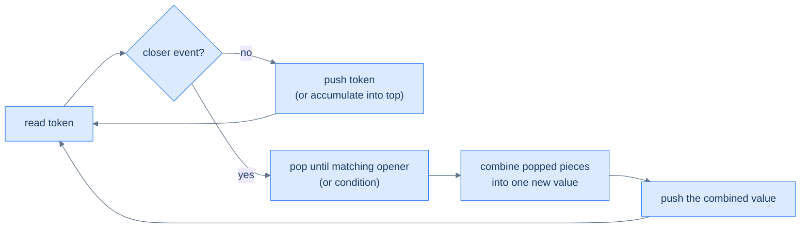
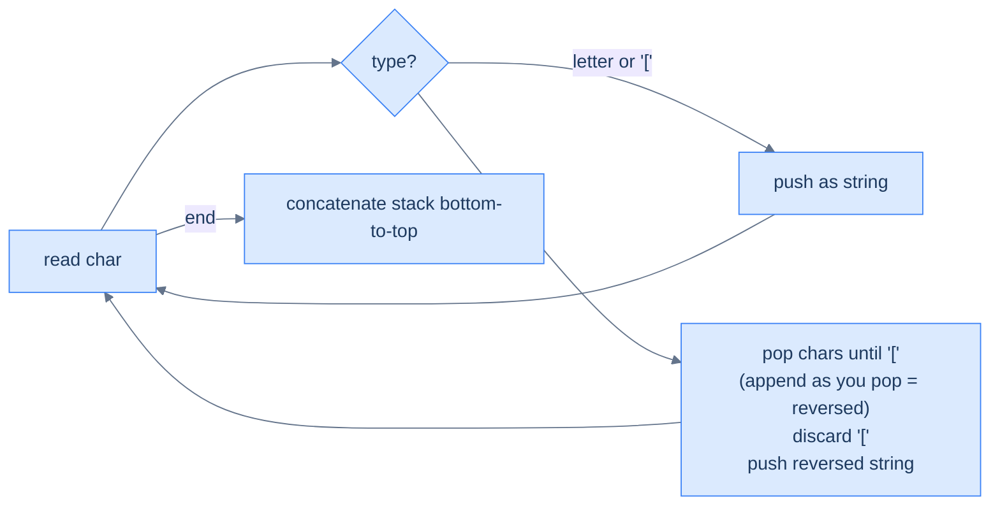
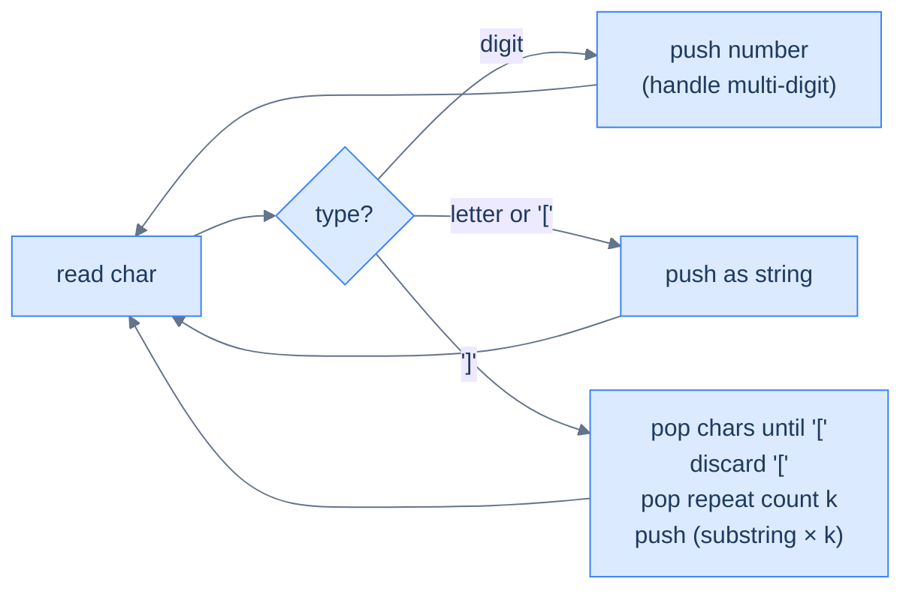

# 11. Pattern: Linear Evaluation

## The Hook

You're parsing a UNIX path like `/a/./b/../c/d`. The brain processing it does a single left-to-right scan: push `a`, ignore `.`, push `b`, see `..` → pop `b`, push `c`, push `d` → final path `/a/c/d`. The decoder for `2[ab3[c]]` in a string-expansion problem? Same thing: push characters, on `]` pop until `[`, multiply by the number before `[`, push the expanded string. A chemical formula `H(N(KO)2)3`? Same again: push atoms/groups, on `)` flatten the group, multiply by the trailing number, push back.

The unifying pattern: **as you scan, you build up sub-results on a stack; whenever a "closer" event fires, you pop a chunk, transform it, and push the transformation back as a new single unit on top of the stack.** The stack holds *partial answers in progress*; closer events trigger *evaluation* of one partial answer; the final stack contents (read top-to-bottom or bottom-to-top depending on the problem) is the answer.

This is the **linear evaluation** pattern. It's the most general of the stack patterns and the one that shows up in every interpreter, every nested-format parser, and every "decode this weird notation" interview question. Four problems below take you from the simplest case (path simplification with a single delimiter) to the most subtle (chemical-formula parsing with nested groups and multipliers).

---

## Table of contents

1. [Understanding the evaluation pattern](#understanding-the-evaluation-pattern)
2. [Identifying the linear evaluation pattern](#identifying-the-linear-evaluation-pattern)
3. [Canonicalise path](#canonicalise-path)
4. [Bracketed Reversal](#bracketed-reversal)
5. [String expansion](#string-expansion)
6. [Formula parsing](#formula-parsing)

***

# Understanding the evaluation pattern

Three primitive operations:

- **Push** a token (operand, marker, or partial result) onto the stack.
- **Trigger** evaluation when a "closer" event fires (e.g., `]`, `)`, `..`, end-of-token).
- **Combine** the popped chunk into a single new value and push it back onto the stack.



<p align="center"><strong>Linear evaluation — every input token either pushes a new partial result or triggers a "fold" of recently pushed parts into one combined result. The stack always holds a list of partial answers; the closer event collapses some of them.</strong></p>

## Algorithm

> **Algorithm**
>
> -   **Step 1:** Initialise an empty stack.
> -   **Step 2:** For each token in the input:
>     -   Decide its kind (operand, opener, closer, multiplier, …).
>     -   Push directly, or pop-and-combine, depending on the kind.
> -   **Step 3:** After the scan, the stack holds the answer (often joined or summed across remaining elements).

***

# Identifying the linear evaluation pattern

Look for problems with all three of these:

1. **Single linear scan over a string or sequence.**
2. **Nesting** — sub-expressions can contain sub-sub-expressions, recursively.
3. **A "closer" token** that triggers reducing a chunk of the stack into one result.

If the input is a flat list with no nesting, you don't need this pattern. But anywhere brackets, paths, encoded substrings, or grouping operators appear, the linear-evaluation stack lights up.

***

# Canonicalise path

## Problem Statement

Given an absolute UNIX-style path string, return its canonical form.

> -   `.` (dot) → current directory, ignored.
> -   `..` (double-dot) → parent directory, removes the last directory.
> -   `//` (multiple slashes) → treated as a single slash.
> -   Anything else is a directory name.

The output must:
- Begin with exactly one `/`.
- Have single-slash separators.
- Have no trailing slash (except for the root `/`).
- Have no `.` or `..`.

### Example 1
> -   **Input:** `/a/b/../c` → **Output:** `/a/c`

### Example 2
> -   **Input:** `/a/./../c` → **Output:** `/c`

### Example 3
> -   **Input:** `/a//b/c/../` → **Output:** `/a/b`

<details>
<summary><h2>Approach</h2></summary>


Split on `/`. Each non-empty token is one of three things:

- `.` → ignore.
- `..` → pop the stack (move up one directory). If empty, do nothing (already at root).
- anything else → push as a directory name.

Final path = `/` + `'/'.join(stack)` (or just `/` if empty).

```mermaid
---
config:
  theme: base
  themeVariables:
    primaryColor: "#dbeafe"
    primaryBorderColor: "#3b82f6"
    primaryTextColor: "#1e3a5f"
    lineColor: "#64748b"
    secondaryColor: "#ede9fe"
    tertiaryColor: "#fef9c3"
---
flowchart LR
    A["/a/b/../c"] -->|"split"| B["[a, b, .., c]"]
    B --> C["scan tokens"]
    C --> S1["push 'a' → [a]"]
    S1 --> S2["push 'b' → [a, b]"]
    S2 --> S3["'..' → pop → [a]"]
    S3 --> S4["push 'c' → [a, c]"]
    S4 --> R["join → '/a/c'"]
    style R fill:#dcfce7,stroke:#22c55e
```



<p align="center"><strong>Canonicalise path — each token decides its action: push, pop, or skip. The final stack <em>is</em> the path's directory list, joined with slashes.</strong></p>

</details>
<details>
<summary><h2>Solution</h2></summary>


```python run
from typing import List

class Solution:
    def canonicalise_path(self, path: str) -> str:

        # Stack to store valid directory names
        stack: List[str] = []

        # Split the path by '/' and iterate over components
        for token in path.split("/"):

            # Skip empty or current directory ('.') components
            if token == "" or token == ".":
                continue

            # Push the valid directory name onto the stack
            elif token != "..":
                stack.append(token)

            # Go up one directory if the current directory is '..' and
            # the stack is not empty
            elif stack:
                stack.pop()

        # If the stack is empty, return "/"
        if not stack:
            return "/"

        # Construct the simplified path by joining stack elements
        return "/" + "/".join(stack)


# Examples from the problem statement
print(Solution().canonicalise_path("/a/b/../c"))    # /a/c
print(Solution().canonicalise_path("/a/./../c"))    # /c
print(Solution().canonicalise_path("/a//b/c/../"))  # /a/b

# Edge cases
print(Solution().canonicalise_path("/"))            # /
print(Solution().canonicalise_path("/.."))          # / — can't go above root
print(Solution().canonicalise_path("/."))           # /
print(Solution().canonicalise_path("/a/b/c"))       # /a/b/c
print(Solution().canonicalise_path("/a/../../b"))   # /b
print(Solution().canonicalise_path("//home//foo/")) # /home/foo
```

```java run
import java.util.*;

public class Main {
    static class Solution {
        public String canonicalisePath(String path) {

            // Stack to store valid directory names
            Stack<String> stack = new Stack<>();

            // Split the path by '/' and iterate over components
            for (String token : path.split("/")) {

                // Skip empty or current directory ('.') components
                if (token.equals("") || token.equals(".")) {
                    continue;
                }

                // Push the valid directory name onto the stack
                else if (!token.equals("..")) {
                    stack.push(token);
                }

                // Go up one directory if the current directory is '..' and
                // the stack is not empty
                else if (!stack.isEmpty()) {
                    stack.pop();
                }
            }

            // If the stack is empty, return "/"
            if (stack.isEmpty()) {
                return "/";
            }

            // Construct the simplified path by popping the stack
            StringBuilder result = new StringBuilder();
            for (String dir : stack) {
                result.append("/").append(dir);
            }

            return result.toString();
        }
    }

    public static void main(String[] args) {
        // Examples from the problem statement
        System.out.println(new Solution().canonicalisePath("/a/b/../c"));    // /a/c
        System.out.println(new Solution().canonicalisePath("/a/./../c"));    // /c
        System.out.println(new Solution().canonicalisePath("/a//b/c/../"));  // /a/b

        // Edge cases
        System.out.println(new Solution().canonicalisePath("/"));            // /
        System.out.println(new Solution().canonicalisePath("/.."));          // /
        System.out.println(new Solution().canonicalisePath("/."));           // /
        System.out.println(new Solution().canonicalisePath("/a/b/c"));       // /a/b/c
        System.out.println(new Solution().canonicalisePath("/a/../../b"));   // /b
        System.out.println(new Solution().canonicalisePath("//home//foo/")); // /home/foo
    }
}
```

</details>


***

# Bracketed Reversal

## Problem Statement

Given a string of letters and `[`/`]` brackets, **reverse the substring inside each pair of brackets** and return the result. Brackets nest.

### Example 1
> -   **Input:** `s = "a[bcd]e"` → **Output:** `"adcbe"`

### Example 2
> -   **Input:** `s = "abcd[ef[gh]i]j"` → **Output:** `"abcdihgfej"`

### Example 3
> -   **Input:** `s = "abcdefghij"` → **Output:** `"abcdefghij"`

<details>
<summary><h2>Approach</h2></summary>


Push characters and `[` onto a stack. On `]`, pop characters until you hit `[` — but **append them as you pop**, which builds the reversed substring naturally. Pop the `[`, push the reversed substring back as a single string token. Final answer = concatenate the stack bottom-to-top.



<p align="center"><strong>Bracketed reversal — popping while appending naturally builds the reversed substring (the topmost char comes out first and goes to the front of the result).</strong></p>

</details>
<details>
<summary><h2>Solution</h2></summary>


```python run
from typing import List

class Solution:
    def bracketed_reversal(self, s: str) -> str:

        # Stack to store characters and decoded parts
        stack: List[str] = []

        i: int = 0
        while i < len(s):

            # If the character is '[' or a letter, push it as a string
            if s[i] == "[" or s[i].isalpha():
                stack.append(s[i])

            # If the character is ']', it indicates the end of a
            # bracketed section
            else:

                # Variable to store the substring inside the brackets
                reversed_str = ""

                # Pop elements from the stack until we reach '['
                while stack and stack[-1] != "[":

                    # Build substring in reversed order
                    reversed_str += stack.pop()

                # Remove the '[' from the stack
                if stack:
                    stack.pop()

                # Push the reversed substring back onto the stack
                stack.append(reversed_str)

            i += 1

        # Return the final decoded string
        return "".join(stack)


# Examples from the problem statement
print(Solution().bracketed_reversal("a[bcd]e"))       # adcbe
print(Solution().bracketed_reversal("abcd[ef[gh]i]j")) # abcdihgfej
print(Solution().bracketed_reversal("abcdefghij"))     # abcdefghij

# Edge cases
print(Solution().bracketed_reversal(""))               # ''
print(Solution().bracketed_reversal("[a]"))            # a
print(Solution().bracketed_reversal("[ab]"))           # ba
print(Solution().bracketed_reversal("[[ab]]"))         # ab — double nesting reverses back
print(Solution().bracketed_reversal("x[y[z]]"))        # xzy
```

```java run
import java.util.*;

public class Main {
    static class Solution {
        public String bracketedReversal(String s) {

            // Stack to store characters and decoded parts
            Stack<String> stack = new Stack<>();

            for (int i = 0; i < s.length(); i++) {

                // If the character is '[' or a letter, push it as a string
                if (s.charAt(i) == '[' || Character.isLetter(s.charAt(i))) {
                    stack.push(String.valueOf(s.charAt(i)));
                }

                // If the character is ']', it indicates the end of a
                // bracketed section
                else {

                    // Variable to store the substring inside the brackets
                    StringBuilder reversedStr = new StringBuilder();

                    // Pop elements from the stack until we reach '['
                    while (!stack.isEmpty() && !stack.peek().equals("[")) {

                        // Build substring in reversed order
                        reversedStr.append(stack.pop());
                    }

                    // Remove the '[' from the stack
                    if (!stack.isEmpty()) {
                        stack.pop();
                    }

                    // Push the reversed substring back onto the stack
                    stack.push(reversedStr.toString());
                }
            }

            // Collect the final result by popping from the stack
            StringBuilder result = new StringBuilder();
            while (!stack.isEmpty()) {

                // Prepend the elements to the result string
                result.insert(0, stack.pop());
            }

            // Return the final decoded string
            return result.toString();
        }
    }

    public static void main(String[] args) {
        // Examples from the problem statement
        System.out.println(new Solution().bracketedReversal("a[bcd]e"));        // adcbe
        System.out.println(new Solution().bracketedReversal("abcd[ef[gh]i]j")); // abcdihgfej
        System.out.println(new Solution().bracketedReversal("abcdefghij"));      // abcdefghij

        // Edge cases
        System.out.println(new Solution().bracketedReversal(""));                // ''
        System.out.println(new Solution().bracketedReversal("[a]"));             // a
        System.out.println(new Solution().bracketedReversal("[ab]"));            // ba
        System.out.println(new Solution().bracketedReversal("[[ab]]"));          // ab
        System.out.println(new Solution().bracketedReversal("x[y[z]]"));         // xzy
    }
}
```

</details>


***

# String expansion

## Problem Statement

Given a string encoded with `k[substring]` notation (k a positive integer, substring possibly nested), return the decoded string. The encoding repeats the substring `k` times.

### Example 1
> -   **Input:** `"2[ab3[c]]"` → **Output:** `"abcccabccc"`

### Example 2
> -   **Input:** `"3[a]2[bc]"` → **Output:** `"aaabcbc"`

### Example 3
> -   **Input:** `"2[abc]3[cd]ef"` → **Output:** `"abcabccdcdcdef"`

<details>
<summary><h2>Approach</h2></summary>


Same shape as bracketed reversal but the closer triggers a *repeat*, not a reverse. Push numbers (as strings), letters, and `[`. On `]`, pop the inner substring, pop the `[`, pop the repeat count (which is just before `[`), expand, push back.



<p align="center"><strong>String expansion — closer fires the substring×k folding. Multi-digit numbers (e.g. 12[ab]) are handled by reading consecutive digits before pushing the count as one string.</strong></p>

</details>
<details>
<summary><h2>Solution</h2></summary>


```python run
from typing import List

class Solution:
    def string_expansion(self, s: str) -> str:

        # Stack to store characters, numbers, and decoded parts
        stack: List[str] = []

        i: int = 0
        while i < len(s):

            # If the current character is a digit, extract the full
            # number
            if s[i].isdigit():
                start: int = i

                # Extract the full number (handles multi-digit numbers)
                while i < len(s) and s[i].isdigit():
                    i += 1

                # Push the number as a string to the stack
                stack.append(s[start:i])

                # Adjust index because loop will increment i
                i -= 1

            # If the character is '[' or a letter, push it to the stack
            elif s[i] == "[" or s[i].isalpha():
                stack.append(s[i])

            # If the character is ']', it indicates the end of an
            # encoded section
            elif s[i] == "]":

                # Variable to store the decoded part inside the brackets
                decoded_str: str = ""

                # Pop characters from the stack until we reach '['
                while stack and stack[-1] != "[":
                    decoded_str = stack.pop() + decoded_str

                # Remove the '[' from the stack
                stack.pop()

                # Get the repeat count (the number just before '[')
                repeat_count: int = int(stack.pop())

                # Expand the string by repeating it 'repeat_count' times
                stack.append(decoded_str * repeat_count)

            i += 1

        # Return the final decoded string
        return "".join(stack)


# Examples from the problem statement
print(Solution().string_expansion("2[ab3[c]]"))    # abcccabccc
print(Solution().string_expansion("3[a]2[bc]"))    # aaabcbc
print(Solution().string_expansion("2[abc]3[cd]ef")) # abcabccdcdcdef

# Edge cases
print(Solution().string_expansion(""))             # ''
print(Solution().string_expansion("abc"))          # abc — no encoding
print(Solution().string_expansion("1[a]"))         # a
print(Solution().string_expansion("10[a]"))        # aaaaaaaaaa — multi-digit count
print(Solution().string_expansion("2[3[x]]"))      # xxxxxx
```

```java run
import java.util.*;

public class Main {
    static class Solution {
        public String stringExpansion(String s) {

            // Stack to store characters, numbers, and decoded parts
            Stack<String> stack = new Stack<>();

            for (int i = 0; i < s.length(); i++) {

                // If the current character is a digit, extract the full
                // number
                if (Character.isDigit(s.charAt(i))) {
                    int start = i;

                    // Extract the full number (handles multi-digit numbers)
                    while (
                        i < s.length() && Character.isDigit(s.charAt(i))
                    ) {
                        i++;
                    }

                    // Push the number as a string to the stack
                    stack.push(s.substring(start, i));

                    // Adjust index because loop will increment i
                    i--;
                }

                // If the character is '[' or a letter, push it to the stack
                else if (
                    s.charAt(i) == '[' || Character.isLetter(s.charAt(i))
                ) {

                    // Push characters and '[' directly to the stack
                    stack.push(String.valueOf(s.charAt(i)));
                }

                // If the character is ']', it indicates the end of an
                // encoded section
                else if (s.charAt(i) == ']') {

                    // Variable to store the decoded part inside the brackets
                    StringBuilder decodedStr = new StringBuilder();

                    // Pop characters from the stack until we reach '['
                    while (!stack.isEmpty() && !stack.peek().equals("[")) {

                        // Prepend the characters to decodedStr
                        decodedStr.insert(0, stack.pop());
                    }

                    // Remove the '[' from the stack
                    stack.pop();

                    // Get the repeat count (the number just before '[')
                    int repeatCount = Integer.parseInt(stack.pop());

                    // Expand the string by repeating it 'repeatCount' times
                    StringBuilder expandedStr = new StringBuilder();
                    while (repeatCount-- > 0) {

                        // Append the decoded string repeatedly
                        expandedStr.append(decodedStr);
                    }

                    // Push the expanded string back to the stack
                    stack.push(expandedStr.toString());
                }
            }

            // Collect the final result by popping from the stack
            StringBuilder result = new StringBuilder();
            while (!stack.isEmpty()) {

                // Prepend the elements to the result string
                result.insert(0, stack.pop());
            }

            // Return the final decoded string
            return result.toString();
        }
    }

    public static void main(String[] args) {
        // Examples from the problem statement
        System.out.println(new Solution().stringExpansion("2[ab3[c]]"));     // abcccabccc
        System.out.println(new Solution().stringExpansion("3[a]2[bc]"));     // aaabcbc
        System.out.println(new Solution().stringExpansion("2[abc]3[cd]ef")); // abcabccdcdcdef

        // Edge cases
        System.out.println(new Solution().stringExpansion(""));              // ''
        System.out.println(new Solution().stringExpansion("abc"));           // abc
        System.out.println(new Solution().stringExpansion("1[a]"));          // a
        System.out.println(new Solution().stringExpansion("10[a]"));         // aaaaaaaaaa
        System.out.println(new Solution().stringExpansion("2[3[x]]"));       // xxxxxx
    }
}
```

</details>


***

# Formula parsing

## Problem Statement

Given a chemical formula consisting of single-uppercase atoms (e.g. `H`, `O`), positive-integer multipliers, and parentheses for grouping, return a string of `ATOM:COUNT` separated by spaces, in order of first appearance.

> Single-uppercase atoms only (no `Na`, no `Cl` — atoms here are one character each), and no atom appears twice in the input.

### Example 1
> -   **Input:** `"(HO)2"` → **Output:** `"H:2 O:2"`

### Example 2
> -   **Input:** `"H(N(KO)2)3"` → **Output:** `"H:1 N:3 K:6 O:6"`

### Example 3
> -   **Input:** `"KH"` → **Output:** `"K:1 H:1"`

<details>
<summary><h2>Approach</h2></summary>


Stack of `(name, count)` records, plus a special `(` marker. On `(`: push a marker. On atom: read its trailing count (default 1) and push. On `)`: read the multiplier, pop everything down to the `(` marker, multiply each popped count by the multiplier, push back.

The "first appearance order" requirement is satisfied because we never re-order: by tracking each atom's earliest index in a separate map, we can sort the final stack by that.

</details>
<details>
<summary><h2>Solution</h2></summary>


```python run
from typing import List

# Define a class to hold atom information
class Atom:
    def __init__(self, name: str, count: int):
        self.name = name
        self.count = count

class Solution:
    def formula_parsing(self, formula: str) -> str:

        # Stack to store atoms, counts, and group markers
        stack: List[Atom] = []

        i = 0
        while i < len(formula):

            # If the current character is '(', push it to mark the start
            # of a group
            if formula[i] == "(":
                stack.append(Atom("(", -1))

            # If the current character is ')', process the group
            elif formula[i] == ")":
                i += 1

                # Read multiplier (if any)
                multiplier = 0
                while i < len(formula) and formula[i].isdigit():
                    multiplier = multiplier * 10 + int(formula[i])
                    i += 1

                if multiplier == 0:
                    multiplier = 1

                # adjust index because loop will increment
                i -= 1
  

                # Collect atoms in the group
                group: List[Atom] = []
                while stack and stack[-1].name != "(":
                    group.append(stack.pop())

                # Remove the '(' from the stack
                if stack and stack[-1].name == "(":
                    stack.pop()

                # Multiply counts and push back
                for atom in reversed(group):
                    stack.append(
                        Atom(atom.name, atom.count * multiplier)
                    )

            # If the character is an uppercase atom
            elif formula[i].isupper():
                atom_name = formula[i]
                i += 1

                # Read count (if any)
                count = 0
                while i < len(formula) and formula[i].isdigit():
                    count = count * 10 + int(formula[i])
                    i += 1

                if count == 0:
                    count = 1

                # adjust index because loop will increment
                i -= 1
  

                # Push atom with count
                stack.append(Atom(atom_name, count))

            i += 1

        # Collect the final result from the stack
        result: List[str] = []
        while stack:
            atom = stack.pop()
            result.insert(0, f"{atom.name}:{atom.count}")

        return " ".join(result)


# Examples from the problem statement
print(Solution().formula_parsing("(HO)2"))       # H:2 O:2
print(Solution().formula_parsing("H(N(KO)2)3"))  # H:1 N:3 K:6 O:6
print(Solution().formula_parsing("KH"))          # K:1 H:1

# Edge cases
print(Solution().formula_parsing("A"))           # A:1 — single atom no count
print(Solution().formula_parsing("A3"))          # A:3
print(Solution().formula_parsing("(AB)1"))       # A:1 B:1
print(Solution().formula_parsing("(XY)10"))      # X:10 Y:10 — multi-digit multiplier
print(Solution().formula_parsing("A(BC)2D"))     # A:1 B:2 C:2 D:1
```

```java run
import java.util.*;

public class Main {
    // Define a class to hold atom information
    static class Atom {
        char name;
        int count;

        Atom(char name, int count) {
            this.name = name;
            this.count = count;
        }
    }

    static class Solution {
        public String formulaParsing(String formula) {

            // Stack to store atoms, counts, and group markers
            Stack<Atom> stack = new Stack<>();

            for (int i = 0; i < formula.length(); i++) {

                // If the current character is '(', push it to mark the start
                // of a group
                if (formula.charAt(i) == '(') {
                    stack.push(new Atom('(', -1));
                }

                // If the current character is ')', process the group
                else if (formula.charAt(i) == ')') {

                    // Move past ')', check for multiplier
                    i++;

                    // Read multiplier (if any)
                    int multiplier = 0;
                    while (
                        i < formula.length() &&
                        Character.isDigit(formula.charAt(i))
                    ) {
                        multiplier =
                            multiplier * 10 + (formula.charAt(i) - '0');
                        i++;
                    }

                    // If no multiplier, default to 1
                    if (multiplier == 0) multiplier = 1;

                    // adjust index because loop will increment
                    i--;

                    // Collect atoms in the group
                    List<Atom> group = new ArrayList<>();
                    while (!stack.isEmpty() && stack.peek().name != '(') {
                        group.add(stack.pop());
                    }

                    // Remove the '(' from the stack
                    if (!stack.isEmpty() && stack.peek().name == '(') {
                        stack.pop();
                    }

                    // Multiply counts and push back
                    for (int j = group.size() - 1; j >= 0; j--) {
                        Atom atom = group.get(j);
                        stack.push(
                            new Atom(atom.name, atom.count * multiplier)
                        );
                    }
                }

                // If the character is an uppercase atom
                else if (Character.isUpperCase(formula.charAt(i))) {
                    char atomName = formula.charAt(i++);

                    // Read count (if any)
                    int count = 0;
                    while (
                        i < formula.length() &&
                        Character.isDigit(formula.charAt(i))
                    ) {
                        count = count * 10 + (formula.charAt(i) - '0');
                        i++;
                    }

                    // If no count, default to 1
                    if (count == 0) count = 1;

                    // adjust index because loop will increment
                    i--;

                    // Push atom with count
                    stack.push(new Atom(atomName, count));
                }
            }

            // Collect the final result from the stack
            StringBuilder result = new StringBuilder();
            while (!stack.isEmpty()) {
                Atom atom = stack.pop();
                result.insert(0, atom.name + ":" + atom.count + " ");
            }

            if (result.length() > 0) {
                result.setLength(result.length() - 1);
            }

            return result.toString();
        }
    }

    public static void main(String[] args) {
        // Examples from the problem statement
        System.out.println(new Solution().formulaParsing("(HO)2"));       // H:2 O:2
        System.out.println(new Solution().formulaParsing("H(N(KO)2)3"));  // H:1 N:3 K:6 O:6
        System.out.println(new Solution().formulaParsing("KH"));          // K:1 H:1

        // Edge cases
        System.out.println(new Solution().formulaParsing("A"));           // A:1
        System.out.println(new Solution().formulaParsing("A3"));          // A:3
        System.out.println(new Solution().formulaParsing("(AB)1"));       // A:1 B:1
        System.out.println(new Solution().formulaParsing("(XY)10"));      // X:10 Y:10
        System.out.println(new Solution().formulaParsing("A(BC)2D"));     // A:1 B:2 C:2 D:1
    }
}
```

</details>
<details>
<summary><h2>Final Takeaway</h2></summary>


Three lessons:

1. **The stack holds partial answers in progress.** Whenever a closer event fires, you collapse a chunk of the stack into a single combined value and push that back. The result keeps growing until the next closer or end of input.
2. **Indices, characters, strings, or records — push whatever the problem needs.** Path tokens for path simplification; characters for bracket reversal; (atom, count) records for chemical formulas. The container shape adapts; the stack discipline doesn't.
3. **Multi-digit numbers and multi-character tokens need a sub-loop.** Inside the main scan, slurp consecutive digits or letters before pushing — otherwise `12[a]` will push `1`, `2`, `[`, `a`, `]` and you'll lose the multiplier.

> *Coming up — the **design** lesson. We've built five problem patterns; the final lesson takes the stack interface and asks: <em>what would it take to extend it with one extra O(1) operation, like <code>min()</code>?</em> Two classic interview questions — Min Stack (push, pop, top, min — all O(1)) and Stack Using Queues — close out the section by demonstrating how to <em>compose stacks with auxiliary structures</em> to add new functionality without losing the original O(1) guarantees.*

</details>