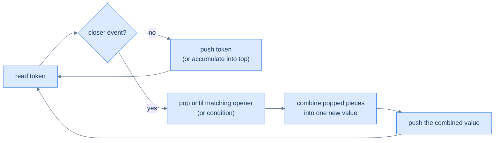
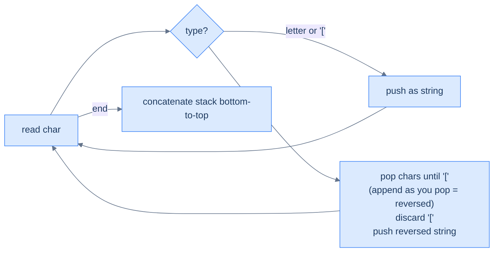
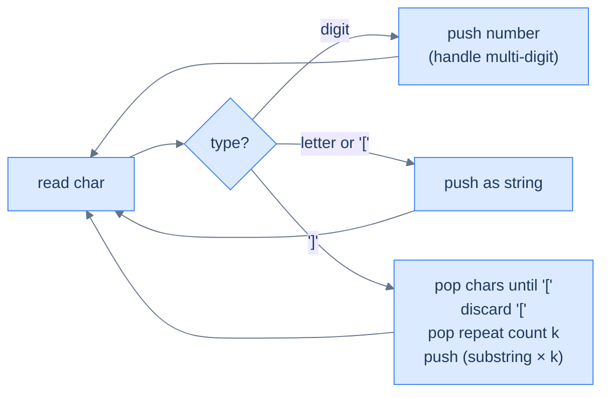

# 11. Pattern: Linear Evaluation

## The Hook

You're parsing a UNIX path like `/a/./b/../c/d`. The brain processing it does a single left-to-right scan: push `a`, ignore `.`, push `b`, see `..` → pop `b`, push `c`, push `d` → final path `/a/c/d`. The decoder for `2[ab3[c]]` in a string-expansion problem? Same thing: push characters, on `]` pop until `[`, multiply by the number before `[`, push the expanded string. A chemical formula `H(N(KO)2)3`? Same again: push atoms/groups, on `)` flatten the group, multiply by the trailing number, push back.

The unifying pattern: **as you scan, you build up sub-results on a stack; whenever a "closer" event fires, you pop a chunk, transform it, and push the transformation back as a new single unit on top of the stack.** The stack holds *partial answers in progress*; closer events trigger *evaluation* of one partial answer; the final stack contents (read top-to-bottom or bottom-to-top depending on the problem) is the answer.

This is the **linear evaluation** pattern. It's the most general of the stack patterns and the one that shows up in every interpreter, every nested-format parser, and every "decode this weird notation" interview question. Four problems below take you from the simplest case (path simplification with a single delimiter) to the most subtle (chemical-formula parsing with nested groups and multipliers).

---

## Table of contents

1. [Understanding the evaluation pattern](#understanding-the-evaluation-pattern)
2. [Identifying the linear evaluation pattern](#identifying-the-linear-evaluation-pattern)
3. [Canonicalise path](#canonicalise-path)
4. [Bracketed Reversal](#bracketed-reversal)
5. [String expansion](#string-expansion)
6. [Formula parsing](#formula-parsing)

***

# Understanding the evaluation pattern

Three primitive operations:

- **Push** a token (operand, marker, or partial result) onto the stack.
- **Trigger** evaluation when a "closer" event fires (e.g., `]`, `)`, `..`, end-of-token).
- **Combine** the popped chunk into a single new value and push it back onto the stack.



<p align="center"><strong>Linear evaluation — every input token either pushes a new partial result or triggers a "fold" of recently pushed parts into one combined result. The stack always holds a list of partial answers; the closer event collapses some of them.</strong></p>

## Algorithm

> **Algorithm**
>
> -   **Step 1:** Initialise an empty stack.
> -   **Step 2:** For each token in the input:
>     -   Decide its kind (operand, opener, closer, multiplier, …).
>     -   Push directly, or pop-and-combine, depending on the kind.
> -   **Step 3:** After the scan, the stack holds the answer (often joined or summed across remaining elements).

***

# Identifying the linear evaluation pattern

Look for problems with all three of these:

1. **Single linear scan over a string or sequence.**
2. **Nesting** — sub-expressions can contain sub-sub-expressions, recursively.
3. **A "closer" token** that triggers reducing a chunk of the stack into one result.

If the input is a flat list with no nesting, you don't need this pattern. But anywhere brackets, paths, encoded substrings, or grouping operators appear, the linear-evaluation stack lights up.

***

# Canonicalise path

## Problem Statement

Given an absolute UNIX-style path string, return its canonical form.

> -   `.` (dot) → current directory, ignored.
> -   `..` (double-dot) → parent directory, removes the last directory.
> -   `//` (multiple slashes) → treated as a single slash.
> -   Anything else is a directory name.

The output must:
- Begin with exactly one `/`.
- Have single-slash separators.
- Have no trailing slash (except for the root `/`).
- Have no `.` or `..`.

### Example 1
> -   **Input:** `/a/b/../c` → **Output:** `/a/c`

### Example 2
> -   **Input:** `/a/./../c` → **Output:** `/c`

### Example 3
> -   **Input:** `/a//b/c/../` → **Output:** `/a/b`

## Approach

Split on `/`. Each non-empty token is one of three things:

- `.` → ignore.
- `..` → pop the stack (move up one directory). If empty, do nothing (already at root).
- anything else → push as a directory name.

Final path = `/` + `'/'.join(stack)` (or just `/` if empty).

```mermaid
---
config:
  theme: base
  themeVariables:
    primaryColor: "#dbeafe"
    primaryBorderColor: "#3b82f6"
    primaryTextColor: "#1e3a5f"
    lineColor: "#64748b"
    secondaryColor: "#ede9fe"
    tertiaryColor: "#fef9c3"
---
flowchart LR
    A["/a/b/../c"] -->|"split"| B["[a, b, .., c]"]
    B --> C["scan tokens"]
    C --> S1["push 'a' → [a]"]
    S1 --> S2["push 'b' → [a, b]"]
    S2 --> S3["'..' → pop → [a]"]
    S3 --> S4["push 'c' → [a, c]"]
    S4 --> R["join → '/a/c'"]
    style R fill:#dcfce7,stroke:#22c55e
```



<p align="center"><strong>Canonicalise path — each token decides its action: push, pop, or skip. The final stack <em>is</em> the path's directory list, joined with slashes.</strong></p>

## Solution


```pseudocode
function canonicalisePath(path):
    stack ← empty
    for each token in split(path, '/'):
        if token = '' OR token = '.': continue
        if token = '..': if stack not empty: pop
        else: push token
    return '/' + join(stack, '/')
```

```python run
def canonicalise_path(path: str) -> str:
    stack = []
    for token in path.split('/'):
        if token == '' or token == '.':
            continue                           # skip empty or "."
        if token == '..':
            if stack: stack.pop()              # parent directory
        else:
            stack.append(token)
    return '/' + '/'.join(stack)

print(canonicalise_path("/a/b/../c"))      # /a/c
print(canonicalise_path("/a/./../c"))       # /c
print(canonicalise_path("/a//b/c/../"))     # /a/b
```

```java run
import java.util.*;
public class Main {
    static String canonicalisePath(String path) {
        Deque<String> st = new ArrayDeque<>();
        for (String token : path.split("/")) {
            if (token.isEmpty() || token.equals(".")) continue;
            if (token.equals("..")) { if (!st.isEmpty()) st.pop(); }
            else st.push(token);
        }
        StringBuilder out = new StringBuilder();
        Iterator<String> it = st.descendingIterator();
        while (it.hasNext()) { out.append('/').append(it.next()); }
        return out.length() == 0 ? "/" : out.toString();
    }
    public static void main(String[] args) {
        System.out.println(canonicalisePath("/a/b/../c"));
        System.out.println(canonicalisePath("/a/./../c"));
        System.out.println(canonicalisePath("/a//b/c/../"));
    }
}
```

```c run
#include <stdio.h>
#include <string.h>
#include <stdlib.h>

void canonicalise_path(const char *path, char *out) {
    char *st[256]; int top = -1;
    char buf[1024]; strncpy(buf, path, sizeof(buf)-1); buf[sizeof(buf)-1]=0;
    char *tok = strtok(buf, "/");
    while (tok) {
        if (strcmp(tok, ".") == 0) { /* skip */ }
        else if (strcmp(tok, "..") == 0) { if (top >= 0) top--; }
        else st[++top] = tok;
        tok = strtok(NULL, "/");
    }
    if (top < 0) { strcpy(out, "/"); return; }
    int o = 0;
    for (int i = 0; i <= top; i++) { out[o++] = '/'; int l = (int)strlen(st[i]); memcpy(out+o, st[i], l); o += l; }
    out[o] = 0;
}

int main() {
    char buf[256];
    canonicalise_path("/a/b/../c", buf);    printf("%s\n", buf);
    canonicalise_path("/a/./../c", buf);    printf("%s\n", buf);
    canonicalise_path("/a//b/c/../", buf);  printf("%s\n", buf);
}
```

```scala run
import scala.collection.mutable
def canonicalisePath(path: String): String = {
  val st = mutable.ArrayBuffer[String]()
  for (tok <- path.split("/")) {
    if (tok.isEmpty || tok == ".") {}
    else if (tok == "..") { if (st.nonEmpty) st.remove(st.length - 1) }
    else st.append(tok)
  }
  if (st.isEmpty) "/" else "/" + st.mkString("/")
}
object Main extends App {
  println(canonicalisePath("/a/b/../c"))
  println(canonicalisePath("/a/./../c"))
  println(canonicalisePath("/a//b/c/../"))
}
```


***

# Bracketed Reversal

## Problem Statement

Given a string of letters and `[`/`]` brackets, **reverse the substring inside each pair of brackets** and return the result. Brackets nest.

### Example 1
> -   **Input:** `s = "a[bcd]e"` → **Output:** `"adcbe"`

### Example 2
> -   **Input:** `s = "abcd[ef[gh]i]j"` → **Output:** `"abcdihgfej"`

### Example 3
> -   **Input:** `s = "abcdefghij"` → **Output:** `"abcdefghij"`

## Approach

Push characters and `[` onto a stack. On `]`, pop characters until you hit `[` — but **append them as you pop**, which builds the reversed substring naturally. Pop the `[`, push the reversed substring back as a single string token. Final answer = concatenate the stack bottom-to-top.



<p align="center"><strong>Bracketed reversal — popping while appending naturally builds the reversed substring (the topmost char comes out first and goes to the front of the result).</strong></p>

## Solution


```pseudocode
function bracketedReversal(s):
    stack ← empty
    for each ch in s:
        if ch = ']':
            rev ← ""
            while top ≠ '[': rev ← rev + pop()   # popping top-first builds reversed string
            pop                                    # discard '['
            push rev
        else: push ch
    return join(stack)
```

```python run
def bracketed_reversal(s: str) -> str:
    stack = []
    for ch in s:
        if ch == ']':
            reversed_str = ""
            while stack and stack[-1] != '[':
                reversed_str += stack.pop()    # pop = top first → reversed
            if stack: stack.pop()              # discard '['
            stack.append(reversed_str)
        else:
            stack.append(ch)
    return ''.join(stack)

print(bracketed_reversal("a[bcd]e"))         # adcbe
print(bracketed_reversal("abcd[ef[gh]i]j"))  # abcdihgfej
print(bracketed_reversal("abcdefghij"))      # abcdefghij
```

```java run
import java.util.*;
public class Main {
    static String bracketedReversal(String s) {
        Deque<String> st = new ArrayDeque<>();
        for (char ch : s.toCharArray()) {
            if (ch == ']') {
                StringBuilder rev = new StringBuilder();
                while (!st.isEmpty() && !st.peek().equals("[")) rev.append(st.pop());
                if (!st.isEmpty()) st.pop();
                st.push(rev.toString());
            } else st.push(String.valueOf(ch));
        }
        StringBuilder out = new StringBuilder();
        Iterator<String> it = st.descendingIterator();
        while (it.hasNext()) out.append(it.next());
        return out.toString();
    }
    public static void main(String[] args) {
        System.out.println(bracketedReversal("a[bcd]e"));
        System.out.println(bracketedReversal("abcd[ef[gh]i]j"));
        System.out.println(bracketedReversal("abcdefghij"));
    }
}
```

```c run
#include <stdio.h>
#include <string.h>
#include <stdlib.h>

char *bracketed_reversal(const char *s) {
    char *st[256]; int top = -1;
    for (; *s; s++) {
        if (*s == ']') {
            char *rev = malloc(256); int r = 0;
            while (top >= 0 && strcmp(st[top], "[") != 0) {
                int l = (int)strlen(st[top]);
                for (int k = l-1; k >= 0; k--) rev[r++] = st[top][k];
                free(st[top]); top--;
            }
            rev[r] = 0;
            if (top >= 0) { free(st[top]); top--; }
            st[++top] = rev;
        } else {
            char *cs = malloc(2); cs[0] = *s; cs[1] = 0;
            st[++top] = cs;
        }
    }
    int total = 0;
    for (int i = 0; i <= top; i++) total += (int)strlen(st[i]);
    char *out = malloc(total + 1); int o = 0;
    for (int i = 0; i <= top; i++) {
        int l = (int)strlen(st[i]);
        memcpy(out + o, st[i], l); o += l;
        free(st[i]);
    }
    out[o] = 0;
    return out;
}

int main() {
    char *r;
    r = bracketed_reversal("a[bcd]e"); printf("%s\n", r); free(r);
    r = bracketed_reversal("abcd[ef[gh]i]j"); printf("%s\n", r); free(r);
    r = bracketed_reversal("abcdefghij"); printf("%s\n", r); free(r);
}
```

```scala run
import scala.collection.mutable
def bracketedReversal(s: String): String = {
  val st = mutable.Stack[String]()
  for (ch <- s) {
    if (ch == ']') {
      val rev = new StringBuilder
      while (st.nonEmpty && st.top != "[") rev.append(st.pop())
      if (st.nonEmpty) st.pop()
      st.push(rev.toString)
    } else st.push(ch.toString)
  }
  st.reverseIterator.mkString
}
object Main extends App {
  println(bracketedReversal("a[bcd]e"))
  println(bracketedReversal("abcd[ef[gh]i]j"))
  println(bracketedReversal("abcdefghij"))
}
```


***

# String expansion

## Problem Statement

Given a string encoded with `k[substring]` notation (k a positive integer, substring possibly nested), return the decoded string. The encoding repeats the substring `k` times.

### Example 1
> -   **Input:** `"2[ab3[c]]"` → **Output:** `"abcccabccc"`

### Example 2
> -   **Input:** `"3[a]2[bc]"` → **Output:** `"aaabcbc"`

### Example 3
> -   **Input:** `"2[abc]3[cd]ef"` → **Output:** `"abcabccdcdcdef"`

## Approach

Same shape as bracketed reversal but the closer triggers a *repeat*, not a reverse. Push numbers (as strings), letters, and `[`. On `]`, pop the inner substring, pop the `[`, pop the repeat count (which is just before `[`), expand, push back.



<p align="center"><strong>String expansion — closer fires the substring×k folding. Multi-digit numbers (e.g. 12[ab]) are handled by reading consecutive digits before pushing the count as one string.</strong></p>

## Solution


```pseudocode
function stringExpansion(s):
    stack ← empty; i ← 0
    while i < length(s):
        if s[i] is digit:
            read full multi-digit number; push it; advance i
        else if s[i] = ']':
            inner ← collect tokens above '[' in original order; pop '['
            k     ← pop()              # repeat count pushed just before '['
            push (inner repeated k times)
            i ← i + 1
        else: push s[i]; i ← i + 1
    return join(stack)
```

```python run
def string_expansion(s: str) -> str:
    stack = []
    i = 0
    while i < len(s):
        if s[i].isdigit():
            j = i
            while j < len(s) and s[j].isdigit(): j += 1
            stack.append(s[i:j])
            i = j
        elif s[i] == ']':
            inner = ""
            while stack and stack[-1] != '[':
                inner = stack.pop() + inner       # build in original order
            if stack: stack.pop()                  # discard '['
            k = int(stack.pop())                   # the repeat count
            stack.append(inner * k)
            i += 1
        else:
            stack.append(s[i]); i += 1
    return ''.join(stack)

print(string_expansion("2[ab3[c]]"))      # abcccabccc
print(string_expansion("3[a]2[bc]"))      # aaabcbc
print(string_expansion("2[abc]3[cd]ef"))  # abcabccdcdcdef
```

```java run
import java.util.*;
public class Main {
    static String stringExpansion(String s) {
        Deque<String> st = new ArrayDeque<>();
        int i = 0;
        while (i < s.length()) {
            char ch = s.charAt(i);
            if (Character.isDigit(ch)) {
                int j = i;
                while (j < s.length() && Character.isDigit(s.charAt(j))) j++;
                st.push(s.substring(i, j));
                i = j;
            } else if (ch == ']') {
                StringBuilder inner = new StringBuilder();
                while (!st.isEmpty() && !st.peek().equals("[")) inner.insert(0, st.pop());
                if (!st.isEmpty()) st.pop();
                int k = Integer.parseInt(st.pop());
                StringBuilder expanded = new StringBuilder();
                for (int t = 0; t < k; t++) expanded.append(inner);
                st.push(expanded.toString());
                i++;
            } else {
                st.push(String.valueOf(ch));
                i++;
            }
        }
        StringBuilder out = new StringBuilder();
        Iterator<String> it = st.descendingIterator();
        while (it.hasNext()) out.append(it.next());
        return out.toString();
    }
    public static void main(String[] args) {
        System.out.println(stringExpansion("2[ab3[c]]"));
        System.out.println(stringExpansion("3[a]2[bc]"));
        System.out.println(stringExpansion("2[abc]3[cd]ef"));
    }
}
```

```c run
#include <stdio.h>
#include <string.h>
#include <stdlib.h>
#include <ctype.h>

char *string_expansion(const char *s) {
    char *st[256]; int top = -1; int n = (int)strlen(s);
    for (int i = 0; i < n; ) {
        char ch = s[i];
        if (isdigit((unsigned char)ch)) {
            int j = i; while (j < n && isdigit((unsigned char)s[j])) j++;
            char *num = malloc(j - i + 1); memcpy(num, s+i, j-i); num[j-i] = 0;
            st[++top] = num; i = j;
        } else if (ch == ']') {
            char inner[1024]; int p = 0;
            char *parts[256]; int pn = 0;
            while (top >= 0 && strcmp(st[top], "[") != 0) parts[pn++] = st[top--];
            for (int k = pn - 1; k >= 0; k--) { int l = (int)strlen(parts[k]); memcpy(inner+p, parts[k], l); p += l; free(parts[k]); }
            inner[p] = 0;
            if (top >= 0) { free(st[top]); top--; }
            int kk = atoi(st[top]); free(st[top--]);
            char *exp = malloc(p * kk + 1); int eo = 0;
            for (int t = 0; t < kk; t++) { memcpy(exp+eo, inner, p); eo += p; }
            exp[eo] = 0;
            st[++top] = exp;
            i++;
        } else {
            char *cs = malloc(2); cs[0] = ch; cs[1] = 0; st[++top] = cs; i++;
        }
    }
    int total = 0; for (int i = 0; i <= top; i++) total += (int)strlen(st[i]);
    char *out = malloc(total + 1); int o = 0;
    for (int i = 0; i <= top; i++) { int l = (int)strlen(st[i]); memcpy(out+o, st[i], l); o += l; free(st[i]); }
    out[o] = 0; return out;
}

int main() {
    char *r;
    r = string_expansion("2[ab3[c]]"); printf("%s\n", r); free(r);
    r = string_expansion("3[a]2[bc]"); printf("%s\n", r); free(r);
    r = string_expansion("2[abc]3[cd]ef"); printf("%s\n", r); free(r);
}
```

```scala run
import scala.collection.mutable
def stringExpansion(s: String): String = {
  val st = mutable.Stack[String]()
  var i = 0
  while (i < s.length) {
    val ch = s(i)
    if (ch.isDigit) {
      var j = i; while (j < s.length && s(j).isDigit) j += 1
      st.push(s.substring(i, j)); i = j
    } else if (ch == ']') {
      val inner = new StringBuilder
      while (st.nonEmpty && st.top != "[") inner.insert(0, st.pop())
      if (st.nonEmpty) st.pop()
      val k = st.pop().toInt
      val exp = new StringBuilder
      for (_ <- 0 until k) exp.append(inner)
      st.push(exp.toString); i += 1
    } else { st.push(ch.toString); i += 1 }
  }
  st.reverseIterator.mkString
}
object Main extends App {
  println(stringExpansion("2[ab3[c]]"))
  println(stringExpansion("3[a]2[bc]"))
  println(stringExpansion("2[abc]3[cd]ef"))
}
```


***

# Formula parsing

## Problem Statement

Given a chemical formula consisting of single-uppercase atoms (e.g. `H`, `O`), positive-integer multipliers, and parentheses for grouping, return a string of `ATOM:COUNT` separated by spaces, in order of first appearance.

> Single-uppercase atoms only (no `Na`, no `Cl` — atoms here are one character each), and no atom appears twice in the input.

### Example 1
> -   **Input:** `"(HO)2"` → **Output:** `"H:2 O:2"`

### Example 2
> -   **Input:** `"H(N(KO)2)3"` → **Output:** `"H:1 N:3 K:6 O:6"`

### Example 3
> -   **Input:** `"KH"` → **Output:** `"K:1 H:1"`

## Approach

Stack of `(name, count)` records, plus a special `(` marker. On `(`: push a marker. On atom: read its trailing count (default 1) and push. On `)`: read the multiplier, pop everything down to the `(` marker, multiply each popped count by the multiplier, push back.

The "first appearance order" requirement is satisfied because we never re-order: by tracking each atom's earliest index in a separate map, we can sort the final stack by that.

## Solution


```pseudocode
function formulaParsing(formula):
    stack ← empty; firstSeen ← []; i ← 0
    while i < length(formula):
        ch ← formula[i]
        if ch = '(': push ('(', −1); i ← i + 1
        else if ch = ')':
            i ← i + 1; mult ← read multi-digit number (default 1)
            group ← pop all entries above '(' marker; pop '('
            for each (atom, cnt) in group: push (atom, cnt * mult)
        else if ch is uppercase letter:
            atom ← ch; i ← i + 1; cnt ← read multi-digit number (default 1)
            record first-seen order; push (atom, cnt)
        else: i ← i + 1
    aggregate counts per atom; sort by first-seen order
    return "A:count B:count …"
```

```python run
def formula_parsing(formula: str) -> str:
    stack = [('(', -1)]                  # sentinel; never used
    stack.pop()                          # ... actually keep it clean
    i = 0; n = len(formula)
    first_seen = {}                       # atom → order of first appearance
    order_counter = 0
    while i < n:
        ch = formula[i]
        if ch == '(':
            stack.append(('(', -1)); i += 1
        elif ch == ')':
            i += 1
            mult = 0
            while i < n and formula[i].isdigit():
                mult = mult * 10 + int(formula[i]); i += 1
            if mult == 0: mult = 1
            group = []
            while stack and stack[-1][0] != '(':
                group.append(stack.pop())
            if stack: stack.pop()         # discard '('
            for atom, cnt in reversed(group):
                stack.append((atom, cnt * mult))
        elif ch.isupper():
            atom = ch; i += 1
            cnt = 0
            while i < n and formula[i].isdigit():
                cnt = cnt * 10 + int(formula[i]); i += 1
            if cnt == 0: cnt = 1
            if atom not in first_seen:
                first_seen[atom] = order_counter; order_counter += 1
            stack.append((atom, cnt))
        else: i += 1
    # Aggregate (input guarantees each atom appears once before grouping, but
    # multiplications may accumulate the same atom across the stack)
    totals = {}
    for atom, cnt in stack:
        totals[atom] = totals.get(atom, 0) + cnt
    parts = sorted(totals.items(), key=lambda kv: first_seen[kv[0]])
    return ' '.join(f"{a}:{c}" for a, c in parts)

print(formula_parsing("(HO)2"))         # H:2 O:2
print(formula_parsing("H(N(KO)2)3"))    # H:1 N:3 K:6 O:6
print(formula_parsing("KH"))             # K:1 H:1
```

```java run
import java.util.*;
public class Main {
    static String formulaParsing(String formula) {
        Deque<int[]> st = new ArrayDeque<>();   // [atomCharCode (-1 for marker), count]
        Map<Character, Integer> firstSeen = new LinkedHashMap<>();
        int n = formula.length(), i = 0;
        while (i < n) {
            char ch = formula.charAt(i);
            if (ch == '(') { st.push(new int[]{-1, -1}); i++; }
            else if (ch == ')') {
                i++;
                int mult = 0;
                while (i < n && Character.isDigit(formula.charAt(i))) { mult = mult * 10 + (formula.charAt(i) - '0'); i++; }
                if (mult == 0) mult = 1;
                List<int[]> group = new ArrayList<>();
                while (!st.isEmpty() && st.peek()[0] != -1) group.add(st.pop());
                if (!st.isEmpty()) st.pop();
                for (int j = group.size() - 1; j >= 0; j--) {
                    int[] a = group.get(j); st.push(new int[]{a[0], a[1] * mult});
                }
            } else if (Character.isUpperCase(ch)) {
                char atom = ch; i++;
                int cnt = 0;
                while (i < n && Character.isDigit(formula.charAt(i))) { cnt = cnt * 10 + (formula.charAt(i) - '0'); i++; }
                if (cnt == 0) cnt = 1;
                firstSeen.putIfAbsent(atom, firstSeen.size());
                st.push(new int[]{atom, cnt});
            } else i++;
        }
        Map<Character, Integer> totals = new HashMap<>();
        for (int[] e : st) totals.merge((char)e[0], e[1], Integer::sum);
        StringBuilder out = new StringBuilder();
        for (Character a : firstSeen.keySet()) {
            if (out.length() > 0) out.append(' ');
            out.append(a).append(':').append(totals.get(a));
        }
        return out.toString();
    }
    public static void main(String[] args) {
        System.out.println(formulaParsing("(HO)2"));
        System.out.println(formulaParsing("H(N(KO)2)3"));
        System.out.println(formulaParsing("KH"));
    }
}
```

```c run
#include <stdio.h>
#include <string.h>
#include <ctype.h>
#include <stdlib.h>

typedef struct { char name; int count; } Atom;

void formula_parsing(const char *f, char *out) {
    Atom st[1024]; int top = -1;
    char order[64]; int order_n = 0;
    int seen[256] = {0};
    int total[256] = {0};
    int n = (int)strlen(f); int i = 0;
    while (i < n) {
        char ch = f[i];
        if (ch == '(') { st[++top] = (Atom){'(', -1}; i++; }
        else if (ch == ')') {
            i++;
            int mult = 0;
            while (i < n && isdigit((unsigned char)f[i])) { mult = mult*10 + (f[i] - '0'); i++; }
            if (mult == 0) mult = 1;
            int gtop = top; int gstart = top;
            while (gstart >= 0 && st[gstart].name != '(') gstart--;
            for (int k = gstart + 1; k <= top; k++) st[k].count *= mult;
            // remove the '(' marker
            for (int k = gstart; k < top; k++) st[k] = st[k+1];
            top--;
        } else if (isupper((unsigned char)ch)) {
            char atom = ch; i++;
            int cnt = 0;
            while (i < n && isdigit((unsigned char)f[i])) { cnt = cnt*10 + (f[i] - '0'); i++; }
            if (cnt == 0) cnt = 1;
            if (!seen[(int)atom]) { seen[(int)atom] = 1; order[order_n++] = atom; }
            st[++top] = (Atom){atom, cnt};
        } else i++;
    }
    for (int k = 0; k <= top; k++) total[(int)st[k].name] += st[k].count;
    int o = 0;
    for (int k = 0; k < order_n; k++) {
        if (k > 0) out[o++] = ' ';
        o += sprintf(out + o, "%c:%d", order[k], total[(int)order[k]]);
    }
    out[o] = 0;
}

int main() {
    char buf[256];
    formula_parsing("(HO)2", buf);       printf("%s\n", buf);
    formula_parsing("H(N(KO)2)3", buf);  printf("%s\n", buf);
    formula_parsing("KH", buf);          printf("%s\n", buf);
}
```

```scala run
import scala.collection.mutable
def formulaParsing(f: String): String = {
  val st = mutable.Stack[(Char, Int)]()
  val order = mutable.ArrayBuffer[Char]()
  val seen  = mutable.Set[Char]()
  var i = 0
  while (i < f.length) {
    val ch = f(i)
    if (ch == '(') { st.push(('(', -1)); i += 1 }
    else if (ch == ')') {
      i += 1
      var mult = 0
      while (i < f.length && f(i).isDigit) { mult = mult * 10 + (f(i) - '0'); i += 1 }
      if (mult == 0) mult = 1
      val grp = mutable.ArrayBuffer[(Char, Int)]()
      while (st.nonEmpty && st.top._1 != '(') grp.append(st.pop())
      if (st.nonEmpty) st.pop()
      for (j <- grp.indices.reverse) { val (a, c) = grp(j); st.push((a, c * mult)) }
    } else if (ch.isUpper) {
      val atom = ch; i += 1
      var cnt = 0
      while (i < f.length && f(i).isDigit) { cnt = cnt * 10 + (f(i) - '0'); i += 1 }
      if (cnt == 0) cnt = 1
      if (!seen(atom)) { seen.add(atom); order.append(atom) }
      st.push((atom, cnt))
    } else i += 1
  }
  val total = mutable.Map[Char, Int]().withDefaultValue(0)
  while (st.nonEmpty) { val (a, c) = st.pop(); total(a) += c }
  order.map(a => s"$a:${total(a)}").mkString(" ")
}
object Main extends App {
  println(formulaParsing("(HO)2"))
  println(formulaParsing("H(N(KO)2)3"))
  println(formulaParsing("KH"))
}
```


***

## Final Takeaway

Three lessons:

1. **The stack holds partial answers in progress.** Whenever a closer event fires, you collapse a chunk of the stack into a single combined value and push that back. The result keeps growing until the next closer or end of input.
2. **Indices, characters, strings, or records — push whatever the problem needs.** Path tokens for path simplification; characters for bracket reversal; (atom, count) records for chemical formulas. The container shape adapts; the stack discipline doesn't.
3. **Multi-digit numbers and multi-character tokens need a sub-loop.** Inside the main scan, slurp consecutive digits or letters before pushing — otherwise `12[a]` will push `1`, `2`, `[`, `a`, `]` and you'll lose the multiplier.

> *Coming up — the **design** lesson. We've built five problem patterns; the final lesson takes the stack interface and asks: <em>what would it take to extend it with one extra O(1) operation, like <code>min()</code>?</em> Two classic interview questions — Min Stack (push, pop, top, min — all O(1)) and Stack Using Queues — close out the section by demonstrating how to <em>compose stacks with auxiliary structures</em> to add new functionality without losing the original O(1) guarantees.*
