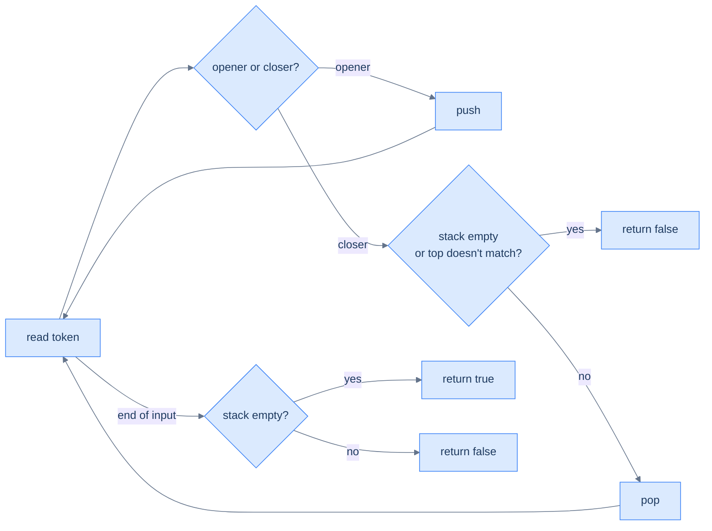

# Understanding the sequence validation pattern

Two classes of token: **openers** (`(`, `[`, `{`) and **closers** (`)`, `]`, `}`). The rules:

1. **Every closer must match the most recent unmatched opener.**
2. **At the end, no openers may be left unmatched.**

The stack enforces both rules in O(N).

> 🖼 Diagram — Sequence validation — push openers, pop-and-match on closers, demand empty stack at the end. Two failure modes: a closer with no matching opener, or leftover openers at end-of-input.


<p align="center"><strong>Sequence validation — push openers, pop-and-match on closers, demand empty stack at the end. Two failure modes: a closer with no matching opener, or leftover openers at end-of-input.</strong></p>

## Why Naive Isn't Enough

The tempting first attempt is to count brackets: tally openers, tally closers, and declare the string valid when the two totals match. The count is necessary but not sufficient, and the gap is where the naive approach breaks.

Two strings expose the hole. `"([)]"` has one opener and one closer of each kind, so every count balances — yet it is invalid, because the `)` closes an `(` while a `[` is still open. A second attempt tracks a single running depth (`+1` on an opener, `−1` on a closer), but depth has no memory of *which* bracket opened. To make this concrete: `"([)]"` and `"()[]"` produce the identical depth trace `1, 2, 1, 0`, yet one is invalid and the other is valid. A scalar counter cannot tell them apart.

The missing ingredient is **order**. A closer is legal only against the *most recent* unmatched opener, and "most recent" is a Last In, First Out question. So the key idea is: validation needs a structure that remembers unmatched openers newest-first and matches each closer against the freshest one — which is exactly a stack.

## The Core Idea

The stack is a **matching register**: it holds every opener that has not yet found its closer, with the most recent opener on top. Walk the input once. Each opener is a promise of a future closer, so you push it and remember it. Each closer must redeem the newest outstanding promise, so you check the top and pop it.

The core insight is: the stack's top is always the only opener a closer is allowed to match. When a `)` arrives, the correct partner is never some opener buried in the middle — it is whatever sits on top, because anything pushed after it must close first. That single rule covers nesting (`([])`) and sequencing (`()[]`) with no extra bookkeeping. Two checks catch every invalid string: a closer that finds the stack empty or a mismatched top fails immediately, and any opener still on the stack at end-of-input means an unredeemed promise.

The invariant the loop preserves is precise: **at every step, the stack holds exactly the openers seen so far that have not yet been matched, in newest-on-top order.** A valid string drives the stack back to empty; a non-empty stack at the end is the signature of leftover openers.

## How the Stack Moves

Each token triggers one of two moves, and the stack only ever grows by one or shrinks by one per token. There is no scanning inside the stack — every decision reads or touches only the top.

- **Opener → push.** The token is an unmatched opener; it goes on top and becomes the new "most recent" candidate for the next closer.
- **Closer, top matches → pop.** The newest unmatched opener is the correct partner; popping it discharges the matched pair and exposes the opener beneath as the next candidate.
- **Closer, stack empty or top mismatches → fail.** There is no opener to match, or the freshest opener is the wrong type; the string is invalid and the scan stops.

To make this concrete: on `"(({}))"`, the stack climbs to `( ( {` as the openers arrive, then drains `{`, `(`, `(` as each closer matches its partner top-down, ending empty. The depth rises and falls, but the *type* on top is checked at every pop — which is the part a plain counter throws away.

## Algorithm

> -   **Step 1:** Initialise an empty stack.
> -   **Step 2:** For each character:
>     -   Opener → push.
>     -   Closer → if stack empty or top doesn't match this closer, return `false`. Otherwise pop.
> -   **Step 3:** Return `stack.empty()`.

The steps carry no code — they are the whole pattern in prose. Push openers, match-and-pop on closers, and demand an empty stack at the end. Each problem in this section specialises these three steps: what counts as an opener, what "match" means, and what you return instead of a plain boolean.

## Complexity Analysis

> **Worst case** — Time: **O(N)** | Space: **O(N)** — every token is an opener; all `N` get pushed.
> **Best case** — Time: **O(1)** | Space: **O(1)** — the first token is a closer; the scan fails immediately.

The runtime is `O(N)` time in the worst case: one left-to-right pass touches each of the `N` tokens once, and a push, a peek, or a pop is `O(1)`. The space is `O(N)`: a string of all openers (`"((((("`) pushes every token and never pops, so the stack grows to `N`. The best case is `O(1)` time and `O(1)` space — a leading closer (`")..."`) hits the empty-stack check on the first token and returns immediately, before anything is pushed.

## Variants / Taxonomy

Every problem here runs the same push-openers / match-closers loop. They differ only in what the stack *stores* and what the scan *returns*:

- **Boolean validity** — store the opener characters; return `true` only if every closer matched and the stack ends empty. The canonical bracket checker.
- **Edit distance to validity** — store unmatched openers; count closers that find no partner, and add the leftover openers at the end. The return is a *count* of fixes, not a yes/no.
- **Structural redundancy** — store every character (operators and operands too); on a closer, inspect what sits between it and its opener. The return flags a pair that wraps nothing meaningful.
- **Longest valid span** — store *indices*, not characters, seeded with a sentinel `-1`. The top is always "one index before the current valid run", so `i − stack.top()` measures the running span. The return is a *length*.

The shared invariant across all four is unchanged: the stack always holds the not-yet-resolved openers (or their index proxies) in newest-on-top order. What varies is the payload — character, count, or index — and the question asked of it.

# Identify the sequence validation pattern

Anywhere the input has *paired delimiters with order constraints*, this pattern fits. Bracket matching is the canonical example, but the same machinery validates HTML/XML tag nesting, balanced binary tree pre-order traversals, valid JSON, and strings of valid push/pop sequences.

**Template:**
> Iterate the input; push openers; on closers, verify the top matches and pop; at end-of-input require an empty stack.

## Recognition Checklist

The pattern fits when **all four** answers are "yes". The first two confirm the input is a paired sequence; the last two confirm a stack is the right tool rather than a counter.

1. **Does the input pair up — openers that must be matched by later closers?** Brackets, tags, start/end events; every closer expects a partner that came before it.
2. **Does a closer have to match the *most recent* unmatched opener, not just any opener?** Order matters, so `"([)]"` is invalid even though counts balance — this is what rules out a scalar counter.
3. **Is one left-to-right pass with `O(1)` work per token enough?** Each token triggers a single push, peek, or pop — no re-scanning of earlier tokens.
4. **Is validity (or the derived count/length) decided by what the stack holds, and whether it ends empty?** The answer is read off the stack's contents and its final emptiness, not computed separately.

These four questions reappear as the **Diagnostic Questions** table in every problem write-up that follows.

## Canonical Example

Walk the bracket checker end-to-end to watch the pattern click into place.

### Problem Statement

> **Problem:** Given a string `s` of brackets `(`, `)`, `[`, `]`, `{`, `}`, return `true` if every bracket is matched by the correct type and closed in the right order, otherwise `false`.

Take `s = "(({}))[]"`. The expected answer is `true`.

### Brute Force

Repeatedly scan the string for an adjacent matched pair — `()`, `[]`, or `{}` — delete it, and rescan from the start. If the string collapses to empty, it was valid; if a full pass deletes nothing while characters remain, it was invalid. It works, but each deletion can trigger a full rescan, so the cost is `O(N²)` time and `O(N)` space for the mutated string. The repeated scanning is pure waste — it keeps re-reading characters it has already cleared.

### Key Insight

A single stack pass replaces the repeated scans. The core insight is: the only opener a closer can legally match is the one on top of the stack, so you never need to search — you peek. Push each opener; on each closer, check the top and pop. The repeated `O(N²)` rescans collapse into one `O(N)` walk because every token is touched exactly once.

### Optimized Solution

One pass with the matching register:

1. Initialise an empty stack.
2. For each character: if it is an opener, push it.
3. If it is a closer, fail when the stack is empty or its top is not the matching opener; otherwise pop.
4. After the pass, return `true` only if the stack is empty.

This is `O(N)` time — one pass, `O(1)` per token — and `O(N)` space for the stack in the all-openers worst case. The Python and Java implementations live in the **Parentheses Checker** problem file.

### Trace

```
s = "(({}))[]"

'('  opener → push      → stack (bottom→top): (
'('  opener → push      → stack: ( (
'{'  opener → push      → stack: ( ( {
'}'  closer, top='{' ✓  → pop  → stack: ( (
')'  closer, top='(' ✓  → pop  → stack: (
')'  closer, top='(' ✓  → pop  → stack: (empty)
'['  opener → push      → stack: [
']'  closer, top='[' ✓  → pop  → stack: (empty)

end of input, stack empty → return true ✓
```

### Fitting the Template

| Check | Answer for Parentheses Checker |
|---|---|
| **Q1.** Does the input pair up — openers matched by later closers? | **Yes** — every closing bracket expects an opener of the same type earlier in `s`. |
| **Q2.** Must a closer match the *most recent* unmatched opener? | **Yes** — `"([)]"` balances by count but fails because `)` does not match the freshest opener `[`. |
| **Q3.** Is one pass with `O(1)` work per token enough? | **Yes** — each character drives a single push, peek, or pop; no re-scanning. |
| **Q4.** Is validity decided by the stack's contents and final emptiness? | **Yes** — a mismatch fails mid-scan; a non-empty stack at the end means leftover openers. |

All four answers are "yes", so the sequence-validation pattern applies. Push openers, match-and-pop closers, and require an empty stack at end-of-input.

## Problems in This Category

The four problems below each specialise the matching register — the loop is identical, but the stack payload and the return value change:

| # | Problem | Variant | Twist on the skeleton |
|---|---|---|---|
| 1 | [Parentheses Checker](02-problems/01-parentheses-checker.md) | Boolean validity | Store opener characters; return `true` iff all match and the stack ends empty |
| 2 | [Minimum Edits](02-problems/02-minimum-edits.md) | Edit distance | Count unmatched closers on the fly, add leftover openers at the end |
| 3 | [Redundant Parentheses](02-problems/03-redundant-parentheses.md) | Structural redundancy | Push every character; on `)`, a `(` directly on top means a redundant pair |
| 4 | [Balanced Span](02-problems/04-balanced-span.md) | Longest valid length | Push *indices* with a sentinel `-1`; the span is `i − stack.top()` |

Difficulty rises with what the stack stores. The first returns a boolean off opener characters; the last stores indices and a sentinel to measure spans, which is the most bookkeeping in the section.
