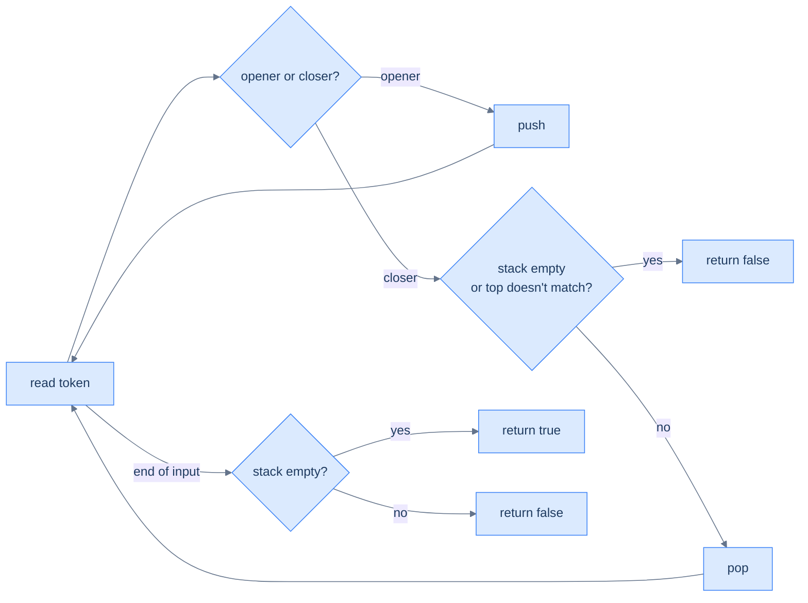

# Understanding the sequence validation pattern

Two classes of token: **openers** (`(`, `[`, `{`) and **closers** (`)`, `]`, `}`). The rules:

1. **Every closer must match the most recent unmatched opener.**
2. **At the end, no openers may be left unmatched.**

The stack enforces both rules in O(N).

> 🖼 Diagram — Sequence validation — push openers, pop-and-match on closers, demand empty stack at the end. Two failure modes: a closer with no matching opener, or leftover openers at end-of-input.

<strong>Sequence validation — push openers, pop-and-match on closers, demand empty stack at the end. Two failure modes: a closer with no matching opener, or leftover openers at end-of-input.</strong>

## Algorithm

> -   **Step 1:** Initialise an empty stack.
> -   **Step 2:** For each character:
>     -   Opener → push.
>     -   Closer → if stack empty or top doesn't match this closer, return `false`. Otherwise pop.
> -   **Step 3:** Return `stack.empty()`.

# Identify the sequence validation pattern

Anywhere the input has *paired delimiters with order constraints*, this pattern fits. Bracket matching is the canonical example, but the same machinery validates HTML/XML tag nesting, balanced binary tree pre-order traversals, valid JSON, and strings of valid push/pop sequences.

**Template:**
> Iterate the input; push openers; on closers, verify the top matches and pop; at end-of-input require an empty stack.

<!-- ============================================== -->
<!-- SWEEP 2 — missing sections (placeholders only) -->
<!-- ============================================== -->

<!-- TODO: Why Naive Isn't Enough — missing, needs to be written -->
<!--       Guidance: motivation for why the obvious approach fails -->

<!-- TODO: The Core Idea — missing, needs to be written -->
<!--       Guidance: one paragraph: the central trick -->

<!-- TODO: How the Pointers/Window Move — missing, needs to be written -->
<!--       Guidance: mechanics of the moving parts -->

<!-- TODO: The Generic Algorithm — missing, needs to be written -->
<!--       Guidance: numbered steps, no code -->

<!-- TODO: Generic Implementation — missing, needs to be written -->
<!--       Guidance: Python block + Java block of the skeleton -->

<!-- TODO: Complexity Analysis — missing, needs to be written -->
<!--       Guidance: table -->

<!-- TODO: Variants / Taxonomy — missing, needs to be written -->
<!--       Guidance: enumerate sub-shapes of this pattern -->

<!-- TODO: Identifying — missing, needs to be written -->
<!--       Guidance: per-variant: recognition checklist + canonical example -->

<!-- TODO: Recognition Checklist — missing, needs to be written -->
<!--       Guidance: 4-question diagnostic — the source of the Problem-section Diagnostic Questions -->

<!-- TODO: Canonical Example — missing, needs to be written -->
<!--       Guidance: fully worked example: brute force → optimised → template fit -->

<!-- TODO: Problems in This Category — missing, needs to be written -->
<!--       Guidance: table with links to the 02-problems/ files -->
