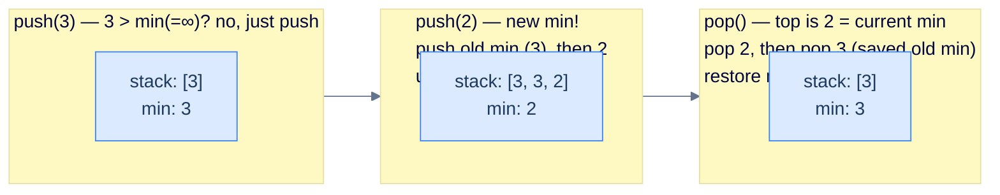

# 12. Design

## The Hook

A normal stack does push, pop, and peek in O(1). What if you also wanted **`getMin()`** in O(1) — the smallest value currently in the stack, every time, no scanning? Walking the stack from top to bottom would be O(N), and a bag of cleverness ("just store the running min on a separate stack") feels too easy. The actual interview question is sharper: **using only one stack, can you give me push, pop, top, AND getMin all in O(1)?**

Yes. The trick is to **encode the previous minimum directly into the storage stack** — when you push a new minimum, you push the *old* minimum onto the stack first, then push the new value on top. The new value becomes the visible top; the saved old min sits one below, ready to resurface when this new-minimum value is eventually popped. The math works out because the only time we need the *old* min is exactly when we pop the *current* min — at that moment, the next thing under the popped value is the saved old min, and we restore it as the new current min.

This lesson is two problems — **Min Stack** and its mirror **Max Stack**. Both demonstrate the same composition idea: an O(1) auxiliary slot (a single integer) plus a single stack adds an entirely new query (`getMin`/`getMax`) without breaking any existing O(1) guarantee. It's the same architectural move we saw in the hash-table design lesson — *compose the data structure with one auxiliary piece to add a new operation* — applied to stacks.

---

## Table of contents

1. [Design a Min Stack](#design-a-min-stack)
2. [Design a Max Stack](#design-a-max-stack)

***

# Design a Min Stack

## Problem Statement

Implement a `MinStack` class with the following operations, all amortised **O(1)**:

> -   **`MinStack()`** — initialise.
> -   **`push(int val)`** — push onto the top.
> -   **`pop()`** — remove and discard the top.
> -   **`top()`** — return the top element.
> -   **`getMin()`** — return the smallest value currently in the stack.

> **Constraints:**
> - `getMin()` must run in **O(1)**.
> - You may use only **one** internal stack.
> - Assume no duplicate values are ever pushed.

> **Example:**
>
> | Operation | Stack state | Output |
> |---|---|---|
> | `MinStack()` | `[]` | `null` |
> | `push(2)` | `[2]` | `null` |
> | `push(3)` | `[3, 2]` (top first) | `null` |
> | `top()` | `[3, 2]` | `3` |
> | `getMin()` | `[3, 2]` | `2` |
> | `pop()` | `[2]` | `null` |
> | `getMin()` | `[2]` | `2` |
> | `push(-1)` | `[-1, 2]` | `null` |
> | `getMin()` | `[-1, 2]` | `-1` |

## Approach — encode the previous minimum into the stack

The clever invariant: maintain a running `min` field; when a *new* minimum arrives, **push the OLD min onto the stack first**, *then* push the new value. Update `min` to the new value.

Now the stack contains, just below every "minimum so far" record, the previous minimum. When we eventually pop the current min, we know to also pop the saved previous min — and that saved value becomes the new current min.



<p align="center"><strong>Min Stack — when a new min lands, the previous min is buried just below it. When the current min is popped, restore from the buried record. Push of a non-min value is just a regular push.</strong></p>

> **Why this works** — the key observation is that the only time we need the *previous* min is when we *remove* the current min. At that moment, the value sitting just under the current-min slot is exactly the previous min. So encoding it inline is sufficient — we don't need a parallel auxiliary stack.

## Solution


```pseudocode
function MinStack():
    stack ← empty; min ← +∞

function push(stack, val):
    if val ≤ min:
        push min          # bury old min below new min
        min ← val
    push val

function pop(stack):
    top ← pop()
    if top = min: min ← pop()   # restore buried min

function top(stack):   return peek()
function getMin(stack): return min
```

```python run
import sys

class MinStack:
    def __init__(self):
        self.stack = []
        self.min = sys.maxsize

    def push(self, val: int) -> None:
        # When a new min lands, push the old min first as a "burial record",
        # then push val. Otherwise just push val.
        if val <= self.min:
            self.stack.append(self.min)
            self.min = val
        self.stack.append(val)

    def pop(self) -> None:
        # If we're popping the current min, also pop the burial record
        # and restore min to it.
        top = self.stack.pop()
        if top == self.min:
            self.min = self.stack.pop()

    def top(self) -> int:
        return self.stack[-1]

    def getMin(self) -> int:
        return self.min

# Boss-fight demo
s = MinStack()
s.push(2); s.push(3)
print(s.top())     # 3
print(s.getMin())  # 2
s.pop()
print(s.getMin())  # 2
s.push(-1)
print(s.getMin())  # -1
```

```java run
import java.util.*;
public class Main {
    static class MinStack {
        private final Deque<Integer> stack = new ArrayDeque<>();
        private int min = Integer.MAX_VALUE;

        public void push(int val) {
            if (val <= min) { stack.push(min); min = val; }
            stack.push(val);
        }
        public void pop() {
            int top = stack.pop();
            if (top == min) min = stack.pop();
        }
        public int top()    { return stack.peek(); }
        public int getMin() { return min; }
    }
    public static void main(String[] args) {
        MinStack s = new MinStack();
        s.push(2); s.push(3);
        System.out.println(s.top());
        System.out.println(s.getMin());
        s.pop();
        System.out.println(s.getMin());
        s.push(-1);
        System.out.println(s.getMin());
    }
}
```

```c run
#include <stdio.h>
#include <stdlib.h>
#include <limits.h>

typedef struct {
    int *arr;
    int  capacity, top;
    int  min;
} MinStack;

MinStack* min_stack_new(void) {
    MinStack *s = malloc(sizeof(*s));
    s->capacity = 256; s->arr = malloc(sizeof(int) * s->capacity);
    s->top = -1; s->min = INT_MAX;
    return s;
}
void min_stack_push(MinStack *s, int val) {
    if (val <= s->min) { s->arr[++s->top] = s->min; s->min = val; }
    s->arr[++s->top] = val;
}
void min_stack_pop(MinStack *s) {
    int top = s->arr[s->top--];
    if (top == s->min) s->min = s->arr[s->top--];
}
int  min_stack_top(MinStack *s)    { return s->arr[s->top]; }
int  min_stack_get_min(MinStack *s){ return s->min; }

int main() {
    MinStack *s = min_stack_new();
    min_stack_push(s, 2); min_stack_push(s, 3);
    printf("%d\n", min_stack_top(s));
    printf("%d\n", min_stack_get_min(s));
    min_stack_pop(s);
    printf("%d\n", min_stack_get_min(s));
    min_stack_push(s, -1);
    printf("%d\n", min_stack_get_min(s));
}
```

```scala run
import scala.collection.mutable

class MinStack {
  private val stack = mutable.Stack[Int]()
  private var min   = Int.MaxValue

  def push(v: Int): Unit = {
    if (v <= min) { stack.push(min); min = v }
    stack.push(v)
  }
  def pop(): Unit = {
    val top = stack.pop()
    if (top == min) min = stack.pop()
  }
  def top:    Int = stack.top
  def getMin: Int = min
}

object Main extends App {
  val s = new MinStack
  s.push(2); s.push(3)
  println(s.top); println(s.getMin)
  s.pop()
  println(s.getMin)
  s.push(-1)
  println(s.getMin)
}
```


***

# Design a Max Stack

## Problem Statement

Identical to Min Stack, but track the **maximum** instead of the minimum.

> -   **`MaxStack()`**, **`push(val)`**, **`pop()`**, **`top()`** — same semantics.
> -   **`getMax()`** — return the largest value currently in the stack, in **O(1)**.

> **Constraints:**
> - `getMax()` must run in **O(1)**.
> - Use only one internal stack.
> - No duplicate values.

> **Example:**
>
> | Operation | Stack state | Output |
> |---|---|---|
> | `MaxStack()` | `[]` | `null` |
> | `push(3)` | `[3]` | `null` |
> | `push(2)` | `[2, 3]` (top first) | `null` |
> | `top()` | `[2, 3]` | `2` |
> | `getMax()` | `[2, 3]` | `3` |
> | `pop()` | `[3]` | `null` |
> | `getMax()` | `[3]` | `3` |
> | `push(5)` | `[5, 3]` | `null` |
> | `getMax()` | `[5, 3]` | `5` |

## Approach

Mirror image of MinStack. Maintain a running `max`. When a new max arrives, push the old max as a burial record, then the new value, and update max. When popping a value equal to the current max, also pop the buried record and restore max from it.

## Solution


```pseudocode
function MaxStack():
    stack ← empty; max ← −∞

function push(stack, val):
    if val ≥ max:
        push max          # bury old max below new max
        max ← val
    push val

function pop(stack):
    top ← pop()
    if top = max: max ← pop()   # restore buried max

function top(stack):   return peek()
function getMax(stack): return max
```

```python run
import sys

class MaxStack:
    def __init__(self):
        self.stack = []
        self.max = -sys.maxsize

    def push(self, val: int) -> None:
        if val >= self.max:
            self.stack.append(self.max)        # burial record for old max
            self.max = val
        self.stack.append(val)

    def pop(self) -> None:
        top = self.stack.pop()
        if top == self.max:
            self.max = self.stack.pop()

    def top(self) -> int:
        return self.stack[-1]

    def getMax(self) -> int:
        return self.max

# Boss-fight demo
s = MaxStack()
s.push(3); s.push(2)
print(s.top())     # 2
print(s.getMax())  # 3
s.pop()
print(s.getMax())  # 3
s.push(5)
print(s.getMax())  # 5
```

```java run
import java.util.*;
public class Main {
    static class MaxStack {
        private final Deque<Integer> stack = new ArrayDeque<>();
        private int max = Integer.MIN_VALUE;

        public void push(int val) {
            if (val >= max) { stack.push(max); max = val; }
            stack.push(val);
        }
        public void pop() {
            int top = stack.pop();
            if (top == max) max = stack.pop();
        }
        public int top()    { return stack.peek(); }
        public int getMax() { return max; }
    }
    public static void main(String[] args) {
        MaxStack s = new MaxStack();
        s.push(3); s.push(2);
        System.out.println(s.top());
        System.out.println(s.getMax());
        s.pop();
        System.out.println(s.getMax());
        s.push(5);
        System.out.println(s.getMax());
    }
}
```

```c run
#include <stdio.h>
#include <stdlib.h>
#include <limits.h>

typedef struct {
    int *arr;
    int  capacity, top;
    int  max;
} MaxStack;

MaxStack* max_stack_new(void) {
    MaxStack *s = malloc(sizeof(*s));
    s->capacity = 256; s->arr = malloc(sizeof(int) * s->capacity);
    s->top = -1; s->max = INT_MIN;
    return s;
}
void max_stack_push(MaxStack *s, int val) {
    if (val >= s->max) { s->arr[++s->top] = s->max; s->max = val; }
    s->arr[++s->top] = val;
}
void max_stack_pop(MaxStack *s) {
    int top = s->arr[s->top--];
    if (top == s->max) s->max = s->arr[s->top--];
}
int  max_stack_top(MaxStack *s)    { return s->arr[s->top]; }
int  max_stack_get_max(MaxStack *s){ return s->max; }

int main() {
    MaxStack *s = max_stack_new();
    max_stack_push(s, 3); max_stack_push(s, 2);
    printf("%d\n", max_stack_top(s));
    printf("%d\n", max_stack_get_max(s));
    max_stack_pop(s);
    printf("%d\n", max_stack_get_max(s));
    max_stack_push(s, 5);
    printf("%d\n", max_stack_get_max(s));
}
```

```scala run
import scala.collection.mutable

class MaxStack {
  private val stack = mutable.Stack[Int]()
  private var max   = Int.MinValue

  def push(v: Int): Unit = {
    if (v >= max) { stack.push(max); max = v }
    stack.push(v)
  }
  def pop(): Unit = {
    val top = stack.pop()
    if (top == max) max = stack.pop()
  }
  def top:    Int = stack.top
  def getMax: Int = max
}
object Main extends App {
  val s = new MaxStack
  s.push(3); s.push(2)
  println(s.top); println(s.getMax)
  s.pop()
  println(s.getMax)
  s.push(5)
  println(s.getMax)
}
```


***

## Final Takeaway

Three lessons:

1. **One auxiliary integer + one stack = O(1) min/max.** No second stack required. The trick is to *bury* the previous extremum value just below every new-extremum value in the same stack.
2. **The trigger for "restore" is `top == current_min`.** When you pop and the popped value equals the current min, you know there's a saved record one slot below — pop it and restore. If the popped value isn't the current min, no extra work needed.
3. **The two-stack approach exists too.** A parallel stack of "running mins" works and is more obvious. We chose the single-stack version because the constraint demanded it, and because it teaches the deeper compositional move: encoding metadata *into* the existing structure rather than alongside it.

> **The complete arc — twelve lessons, one section, one data structure:**
>
> | Lesson | What you got | Why it mattered |
> |---|---|---|
> | 1 — Introduction | LIFO, push/pop semantics, real-world examples | Foundation |
> | 2 — Array implementation | O(1) per op via index = top tracking | Cache-friendly default |
> | 3 — Linked-list implementation | O(1) per op via head insertion | Unbounded growth |
> | 4 — Notations | Infix vs. postfix vs. prefix | Parser foundations |
> | 5 — Evaluating | Postfix evaluator, prefix evaluator, infix wrapper | The calculator |
> | 6 — Converting | Six conversions, Shunting-Yard | The compiler front-end |
> | 7 — Reversal | The simplest stack pattern | Gateway |
> | 8 — Previous closest | Monotonic stack | Stock span, histogram, ... |
> | 9 — Next closest | Same machinery, retroactive resolution | Daily temperatures, rainwater, histogram |
> | 10 — Sequence validation | Stack as matching memory | Brackets, palindromes, balance |
> | 11 — Linear evaluation | Push-pop-fold composition | Path simplification, decoding, parsing |
> | 12 — Design | Compose stack with auxiliary state | Min/Max stack |
>
> You started knowing a stack was a "list with restricted operations". You leave knowing it's the universal tool for *deferred work* — anywhere recency matters, anywhere most-recent-first is the right priority, anywhere parsers nest, anywhere "remember this until I find its match" comes up. Carry the toolkit. Every interview, every parser, every undo-redo system, every CPU you'll ever read assembly for — they all live or die by stacks.
